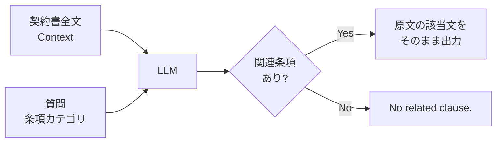

## 論文概要（Abstract）

本記事は [https://arxiv.org/abs/2508.03080](https://arxiv.org/abs/2508.03080) の解説記事です。

ContractEvalは、商業契約書からの条項レベルのリスク特定タスクにおいてLLMの性能を体系的に評価するベンチマークである。著者らはCUAD（Contract Understanding Atticus Dataset）テストセットの4,128データポイント・41条項カテゴリ・102契約を用いて、プロプライエタリ4モデルとオープンソース15モデルの計19モデルを評価している。著者らは、プロプライエタリモデルがF1スコアで約16%オープンソースモデルを上回ること、thinkingモードがJaccard類似度を改善する一方でF1を低下させること、モデルサイズとパフォーマンスの間に非線形な関係があることを報告している。

この記事は [Zenn記事: Vertex AI Gemini 3.1 Proの1Mコンテキストで契約書レビューの精度とコストを両立する](https://zenn.dev/0h_n0/articles/2d259d1c630072) の深掘りです。

## 情報源

- **arXiv ID**: 2508.03080
- **URL**: [https://arxiv.org/abs/2508.03080](https://arxiv.org/abs/2508.03080)
- **著者**: Shuang Liu, Zelong Li, Ruoyun Ma, Haiyan Zhao, Mengnan Du
- **発表年**: 2025
- **分野**: cs.AI
- **コード**: [https://github.com/olivialiu121/ContractEval](https://github.com/olivialiu121/ContractEval)

## 背景と動機（Background & Motivation）

商業契約書には数百ページに及ぶ条項が含まれ、弁護士が手動でリスクのある条項を特定するには膨大な時間とコストがかかる。従来のNLPベースの契約分析手法はNER（固有表現認識）やテキスト分類に基づくものが主流であったが、条項レベルの正確なスパン抽出には十分な精度が得られていなかった。

LLMの長文コンテキスト処理能力の向上により、契約書全体を一度に入力して条項を抽出するアプローチが現実的になってきている。しかし、法律ドメインにおけるLLMの性能を体系的に比較評価するベンチマークは限られていた。既存のベンチマーク（LawBench、ContractNLI等）は文書レベルの分類や推論を対象としており、条項レベルの正確なスパン抽出を評価するものではなかった。

ContractEvalはこのギャップを埋めるため、実際の商業契約書から条項レベルでリスクのある文を正確に抽出するタスクにおいて、最新のLLMを網羅的に評価するベンチマークとして設計されている。

## 主要な貢献（Key Contributions）

- **貢献1**: CUADテストセットに基づく条項レベルのリスク特定ベンチマーク（ContractEval）の構築。4,128データポイント、41条項カテゴリ、コンテキスト長0.6k-301kの多様な契約書を対象とする
- **貢献2**: プロプライエタリ4モデル（GPT 4.1, GPT 4.1 mini, Gemini 2.5 Pro Preview, Claude Sonnet 4）とオープンソース15モデル（DeepSeek, LLaMA, Gemma, Qwen3系列）の計19モデルによる網羅的な比較評価
- **貢献3**: thinkingモードの効果、量子化の影響、モデルサイズの非線形性、レアカテゴリの特定困難性、モデルの「怠惰性」（lazy response）など、法律ドメインにおけるLLMの振る舞いに関する多角的な分析

## 技術的詳細（Technical Details）

### 評価タスクの設計

ContractEvalのタスクは、与えられた契約書コンテキストと質問（特定の条項カテゴリに該当する文の抽出を求める）に対して、関連する文をそのまま（言い換えや要約なしで）抽出することである。関連する条項が存在しない場合は「No related clause.」と応答する。



著者らが使用したシステムプロンプトは以下の通りである。

> You are an assistant with strong legal knowledge, supporting senior lawyers by preparing reference materials. Given a Context and a Question, extract and return only the sentence(s) from the Context that directly address or relate to the Question. Do not rephrase or summarize in any way--respond with exact sentences from the Context relevant to the Question. If no part of the Context is relevant to the Question, respond with: 'No related clause.'

### 評価指標の定義

論文では以下の4つの指標が使用されている。

**F1スコア（正確性）**: Precisionと Recallの調和平均。

$$
F_1 = \frac{2 \cdot \text{Precision} \cdot \text{Recall}}{\text{Precision} + \text{Recall}}
$$

**F2スコア（Recall重視の正確性）**: 法律ドメインでは見逃し（false negative）のコストが高いため、Recallに重みを置いたF-betaスコアを使用している。

$$
F_2 = \frac{5 \cdot \text{Precision} \cdot \text{Recall}}{4 \cdot \text{Precision} + \text{Recall}}
$$

ここで、

- $\text{Precision} = \frac{|A \cap B|}{|A|}$: モデル出力トークン集合 $A$ のうち正解に含まれる割合
- $\text{Recall} = \frac{|A \cap B|}{|B|}$: 正解トークン集合 $B$ のうちモデルが抽出した割合

**Jaccard類似度（出力効果性）**: 予測スパンと正解スパンのトークンレベルでの重なりを測定する。ポジティブケース（関連条項が存在するデータポイント）のみで計算される。

$$
J(A, B) = \frac{|A \cap B|}{|A \cup B|}
$$

ここで、$A$ はモデルが出力したトークン集合、$B$ は正解のトークン集合である。F1がPrecisionとRecallの調和平均であるのに対し、Jaccardは集合の重複度を直接測定するため、冗長な出力（関係のない文も一緒に出力する傾向）をより厳しく評価する。

**False "No Related Clause" Rate（怠惰性指標）**: 正解に条項が含まれるにもかかわらず、モデルが「No related clause」と応答した割合。モデルの「怠惰な」応答傾向を定量化する。

### データセットの特性

CUADテストセットの構成は以下の通りである。

| 項目 | 値 |
|------|-----|
| データポイント数 | 4,128 |
| 条項カテゴリ数 | 41 |
| 契約書数 | 102 |
| コンテキスト長 | 0.6k - 301k文字 |
| ラベル分布 | 30%ポジティブ / 70%ネガティブ |

ラベル分布の偏り（70%がネガティブ）は実務の契約書レビューを反映している。すなわち、多くの条項カテゴリについて、ほとんどの契約書には該当する条項が含まれていない。

## 実装のポイント（Implementation）

### ContractEvalベンチマークの再現

ContractEvalのコードは[GitHub](https://github.com/olivialiu121/ContractEval)で公開されている。ベンチマークを再現する際の主要なポイントは以下の通りである。

**コンテキスト長の要件**: 契約書のコンテキスト長が最大301k文字に達するため、評価対象モデルには最低128kトークンのコンテキストウィンドウが必要である。オープンソースモデルをローカルで実行する場合、vLLMやSGLang等の推論フレームワークで十分なKVキャッシュメモリを確保する必要がある。

**プロンプト設計の一貫性**: 全モデルに同一のシステムプロンプトを使用し、出力形式の統一を図っている。ただし、thinkingモード対応モデルでは、推論プロセスが出力に混入しないよう後処理が必要になる場合がある。

**トークンレベルの評価**: F1/F2/Jaccardはトークンレベルで計算されるため、モデル出力と正解のトークナイゼーションを統一する必要がある。

```python
def compute_jaccard(prediction_tokens: list[str], ground_truth_tokens: list[str]) -> float:
    """Jaccard類似度をトークンレベルで計算する。

    Args:
        prediction_tokens: モデル出力のトークンリスト
        ground_truth_tokens: 正解のトークンリスト

    Returns:
        Jaccard類似度（0.0 - 1.0）
    """
    pred_set = set(prediction_tokens)
    gt_set = set(ground_truth_tokens)

    if not pred_set and not gt_set:
        return 1.0
    if not pred_set or not gt_set:
        return 0.0

    intersection = pred_set & gt_set
    union = pred_set | gt_set

    return len(intersection) / len(union)


def compute_f_beta(
    prediction_tokens: list[str],
    ground_truth_tokens: list[str],
    beta: float = 1.0,
) -> float:
    """F-betaスコアをトークンレベルで計算する。

    Args:
        prediction_tokens: モデル出力のトークンリスト
        ground_truth_tokens: 正解のトークンリスト
        beta: betaパラメータ（1.0でF1, 2.0でF2）

    Returns:
        F-betaスコア（0.0 - 1.0）
    """
    pred_set = set(prediction_tokens)
    gt_set = set(ground_truth_tokens)

    if not pred_set and not gt_set:
        return 1.0
    if not pred_set or not gt_set:
        return 0.0

    true_positives = len(pred_set & gt_set)
    precision = true_positives / len(pred_set)
    recall = true_positives / len(gt_set)

    if precision + recall == 0:
        return 0.0

    beta_sq = beta ** 2
    f_beta = (1 + beta_sq) * precision * recall / (beta_sq * precision + recall)

    return f_beta
```

**量子化モデルの評価**: 論文ではFP8およびAWQ量子化の影響を検証している。量子化モデルを評価する場合、推論フレームワークの量子化設定（AWQカーネル、FP8キャリブレーション等）が結果に影響する点に注意が必要である。

## Production Deployment Guide

ContractEvalの知見を活用し、契約書レビューAIシステムをAWS上にデプロイする際の実装パターンを示す。本論文では条項抽出タスクの評価に焦点を当てているが、実運用では抽出結果のフィルタリング、信頼度スコアリング、人間のレビュアーへの提示までをカバーするパイプラインが必要になる。

### AWS実装パターン（コスト最適化重視）

| 構成 | トラフィック量 | 主要サービス | 月額概算 |
|------|--------------|-------------|---------|
| Small | ~100契約/日 | Lambda + Bedrock | $150-400 |
| Medium | ~1,000契約/日 | ECS Fargate + Bedrock | $800-2,000 |
| Large | 10,000+契約/日 | EKS + vLLM on GPU | $5,000-15,000 |

注: 上記コストは2026年6月時点のAWS ap-northeast-1（東京）リージョン料金に基づく概算値である。実際のコストはトラフィックパターン、契約書の長さ、使用モデル、バースト使用量により変動する。最新料金はAWS料金計算ツールで確認を推奨する。

**Small構成（~100契約/日）**: Lambda + Bedrock構成。契約書をS3にアップロードし、LambdaがBedrockのClaude/Gemini APIを呼び出して条項抽出を実行する。コンテキスト長が長い契約書（100k+トークン）ではBedrock APIのレイテンシが30-60秒になるため、非同期処理（Step Functions）が適している。

**Medium構成（~1,000契約/日）**: ECS Fargate + Bedrock構成。常時起動のコンテナでリクエストキューを処理する。SQSでリクエストをバッファリングし、Fargateタスクの自動スケーリングで負荷変動に対応する。

**Large構成（10,000+契約/日）**: EKS + GPU Instances構成。論文の結果からQwen3 8Bがオープンソースで最良のF1（0.540）を示しており、vLLMでセルフホスティングすることでAPIコストを大幅に削減できる。g5.2xlarge（A10G GPU）のSpot Instancesを使用し、Karpenterで自動スケーリングする。

**コスト削減テクニック**:
- Spot Instances活用でGPUインスタンスコストを最大90%削減
- Bedrock Batch API使用でAPI呼び出しコストを50%削減（バッチ処理可能な場合）
- Prompt Caching有効化で同一契約書テンプレートへの繰り返し処理コストを30-90%削減
- Reserved Instances購入（1年コミット）でオンデマンド比最大72%削減

### Terraformインフラコード

**Small構成（Serverless）**:

```hcl
# ContractEval Small構成: Lambda + Bedrock + DynamoDB
# 2026年6月時点の設定

terraform {
  required_version = ">= 1.12"
  required_providers {
    aws = {
      source  = "hashicorp/aws"
      version = "~> 5.90"
    }
  }
}

provider "aws" {
  region = "ap-northeast-1"
}

# --- IAM Role (最小権限) ---
resource "aws_iam_role" "contract_eval_lambda" {
  name = "contract-eval-lambda-role"
  assume_role_policy = jsonencode({
    Version = "2012-10-17"
    Statement = [{
      Action = "sts:AssumeRole"
      Effect = "Allow"
      Principal = { Service = "lambda.amazonaws.com" }
    }]
  })
}

resource "aws_iam_role_policy" "bedrock_invoke" {
  name = "bedrock-invoke"
  role = aws_iam_role.contract_eval_lambda.id
  policy = jsonencode({
    Version = "2012-10-17"
    Statement = [
      {
        Effect   = "Allow"
        Action   = ["bedrock:InvokeModel"]
        Resource = "arn:aws:bedrock:ap-northeast-1::foundation-model/*"
      },
      {
        Effect   = "Allow"
        Action   = ["dynamodb:PutItem", "dynamodb:GetItem", "dynamodb:Query"]
        Resource = aws_dynamodb_table.results.arn
      },
      {
        Effect   = "Allow"
        Action   = ["s3:GetObject"]
        Resource = "${aws_s3_bucket.contracts.arn}/*"
      }
    ]
  })
}

# --- S3 (契約書アップロード先) ---
resource "aws_s3_bucket" "contracts" {
  bucket = "contract-eval-documents"
}

resource "aws_s3_bucket_server_side_encryption_configuration" "contracts" {
  bucket = aws_s3_bucket.contracts.id
  rule {
    apply_server_side_encryption_by_default {
      sse_algorithm = "aws:kms"
    }
  }
}

# --- DynamoDB (結果保存, On-Demand) ---
resource "aws_dynamodb_table" "results" {
  name         = "contract-eval-results"
  billing_mode = "PAY_PER_REQUEST"
  hash_key     = "contract_id"
  range_key    = "clause_category"

  attribute {
    name = "contract_id"
    type = "S"
  }
  attribute {
    name = "clause_category"
    type = "S"
  }

  server_side_encryption {
    enabled = true
  }
}

# --- Lambda関数 ---
resource "aws_lambda_function" "clause_extractor" {
  function_name = "contract-clause-extractor"
  role          = aws_iam_role.contract_eval_lambda.arn
  handler       = "handler.lambda_handler"
  runtime       = "python3.13"
  timeout       = 900   # 契約書処理は長時間になるため最大値
  memory_size   = 1024

  environment {
    variables = {
      RESULTS_TABLE = aws_dynamodb_table.results.name
      MODEL_ID      = "anthropic.claude-sonnet-4-20250514-v1:0"
    }
  }

  filename = "lambda_package.zip"

  tracing_config {
    mode = "Active" # X-Ray有効化
  }
}

# --- CloudWatch アラーム (コスト監視) ---
resource "aws_cloudwatch_metric_alarm" "lambda_duration" {
  alarm_name          = "contract-eval-lambda-high-duration"
  comparison_operator = "GreaterThanThreshold"
  evaluation_periods  = 3
  metric_name         = "Duration"
  namespace           = "AWS/Lambda"
  period              = 300
  statistic           = "Average"
  threshold           = 600000 # 10分
  alarm_description   = "Lambda実行時間が10分を超過"

  dimensions = {
    FunctionName = aws_lambda_function.clause_extractor.function_name
  }
}
```

**Large構成（Container）**:

```hcl
# ContractEval Large構成: EKS + Karpenter + Spot GPU Instances
# vLLMでQwen3 8Bをセルフホスティング

module "eks" {
  source  = "terraform-aws-modules/eks/aws"
  version = "~> 20.36"

  cluster_name    = "contract-eval-cluster"
  cluster_version = "1.32"

  vpc_id     = module.vpc.vpc_id
  subnet_ids = module.vpc.private_subnets

  # Karpenter用のIRSA設定
  enable_cluster_creator_admin_permissions = true
}

# --- Karpenter Provisioner (Spot GPU優先) ---
resource "kubectl_manifest" "karpenter_nodepool" {
  yaml_body = yamlencode({
    apiVersion = "karpenter.sh/v1"
    kind       = "NodePool"
    metadata   = { name = "gpu-spot" }
    spec = {
      template = {
        spec = {
          requirements = [
            { key = "karpenter.sh/capacity-type", operator = "In", values = ["spot", "on-demand"] },
            { key = "node.kubernetes.io/instance-type", operator = "In",
              values = ["g5.2xlarge", "g5.4xlarge", "g6.2xlarge"] },
          ]
          nodeClassRef = { name = "default" }
        }
      }
      limits   = { cpu = "128", "nvidia.com/gpu" = "8" }
      disruption = {
        consolidationPolicy = "WhenEmptyOrUnderutilized"
        consolidateAfter    = "30s"
      }
    }
  })
}

# --- Secrets Manager (モデル設定) ---
resource "aws_secretsmanager_secret" "model_config" {
  name = "contract-eval/model-config"
}

resource "aws_secretsmanager_secret_version" "model_config" {
  secret_id = aws_secretsmanager_secret.model_config.id
  secret_string = jsonencode({
    model_name      = "Qwen/Qwen3-8B"
    max_model_len   = 131072
    gpu_memory_util = 0.92
  })
}

# --- AWS Budgets (予算アラート) ---
resource "aws_budgets_budget" "monthly" {
  name         = "contract-eval-monthly"
  budget_type  = "COST"
  limit_amount = "6000"
  limit_unit   = "USD"
  time_unit    = "MONTHLY"

  notification {
    comparison_operator       = "GREATER_THAN"
    threshold                 = 80
    threshold_type            = "PERCENTAGE"
    notification_type         = "ACTUAL"
    subscriber_email_addresses = ["ops@example.com"]
  }
}
```

### 運用・監視設定

**CloudWatch Logs Insights クエリ**（コスト異常検知）:

```
# 1時間あたりのBedrock呼び出し回数とトークン使用量
fields @timestamp, @message
| filter @message like /InvokeModel/
| stats count() as invocations,
        sum(input_tokens) as total_input_tokens,
        sum(output_tokens) as total_output_tokens
  by bin(1h) as hour
| sort hour desc
```

**CloudWatch アラーム設定コード（Python）**:

```python
import boto3


def create_bedrock_token_alarm(
    alarm_name: str,
    sns_topic_arn: str,
    threshold: float = 1000000,
) -> dict:
    """Bedrockトークン使用量スパイク検知用アラームを作成する。

    Args:
        alarm_name: アラーム名
        sns_topic_arn: 通知先SNSトピックARN
        threshold: 閾値（トークン数/5分）

    Returns:
        CloudWatch put_metric_alarm のレスポンス
    """
    client = boto3.client("cloudwatch", region_name="ap-northeast-1")
    return client.put_metric_alarm(
        AlarmName=alarm_name,
        MetricName="InputTokenCount",
        Namespace="AWS/Bedrock",
        Statistic="Sum",
        Period=300,
        EvaluationPeriods=2,
        Threshold=threshold,
        ComparisonOperator="GreaterThanThreshold",
        AlarmActions=[sns_topic_arn],
    )
```

**X-Ray トレーシング設定（Python）**:

```python
from aws_xray_sdk.core import xray_recorder, patch_all

# boto3の自動計装
patch_all()


@xray_recorder.capture("extract_clauses")
def extract_clauses(contract_text: str, clause_category: str) -> str:
    """契約書から指定カテゴリの条項を抽出する。

    Args:
        contract_text: 契約書テキスト全文
        clause_category: 抽出対象の条項カテゴリ

    Returns:
        抽出された条項テキスト、該当なしの場合は"No related clause."
    """
    subsegment = xray_recorder.current_subsegment()
    subsegment.put_annotation("clause_category", clause_category)
    subsegment.put_metadata(
        "contract_length", len(contract_text), "contract_info"
    )
    # Bedrock呼び出し（X-Rayで自動トレース）
    # ...
```

**Cost Explorer自動レポート（Python）**:

```python
import datetime

import boto3


def get_daily_cost_report(days_back: int = 1) -> dict:
    """日次コストレポートを取得し、閾値超過時にSNS通知を送る。

    Args:
        days_back: 何日前のコストを取得するか

    Returns:
        サービス別コスト情報の辞書
    """
    ce = boto3.client("ce", region_name="us-east-1")
    end = datetime.date.today()
    start = end - datetime.timedelta(days=days_back)

    response = ce.get_cost_and_usage(
        TimePeriod={"Start": str(start), "End": str(end)},
        Granularity="DAILY",
        Metrics=["UnblendedCost"],
        Filter={
            "Or": [
                {"Dimensions": {"Key": "SERVICE", "Values": ["Amazon Bedrock"]}},
                {"Dimensions": {"Key": "SERVICE", "Values": ["AWS Lambda"]}},
                {"Dimensions": {"Key": "SERVICE", "Values": ["Amazon Elastic Kubernetes Service"]}},
            ]
        },
        GroupBy=[{"Type": "DIMENSION", "Key": "SERVICE"}],
    )

    total = sum(
        float(group["Metrics"]["UnblendedCost"]["Amount"])
        for result in response["ResultsByTime"]
        for group in result["Groups"]
    )

    if total > 100.0:
        sns = boto3.client("sns", region_name="ap-northeast-1")
        sns.publish(
            TopicArn="arn:aws:sns:ap-northeast-1:123456789012:cost-alert",
            Subject=f"ContractEval日次コスト超過: ${total:.2f}",
            Message=f"日次コストが$100を超過しました: ${total:.2f}",
        )

    return response
```

### コスト最適化チェックリスト

**アーキテクチャ選択**:
- [ ] トラフィック量に基づきServerless/Hybrid/Container構成を選定
- [ ] 契約書の平均コンテキスト長に基づきモデルを選定（短文: GPT 4.1 mini、長文: Gemini 2.5 Pro）

**リソース最適化**:
- [ ] EC2/EKS: Spot Instances優先（g5.2xlargeで最大90%削減）
- [ ] Reserved Instances: 1年コミットで最大72%削減
- [ ] Savings Plans: Compute Savings Plansで全サービス横断割引
- [ ] Lambda: メモリサイズ最適化（1024MB推奨、Power Tuningで検証）
- [ ] ECS/EKS: 夜間・週末のスケールダウン（契約書レビューは営業時間集中）

**LLMコスト削減**:
- [ ] Bedrock Batch API: 非リアルタイム処理で50%削減
- [ ] Prompt Caching: 同一テンプレート契約書で30-90%削減
- [ ] モデル選択ロジック: 短い契約書にはGPT 4.1 mini、長い契約書にはGemini 2.5 Proを動的選択
- [ ] トークン数制限: 出力トークン上限設定でコスト抑制
- [ ] セルフホスティング: 大量処理時はQwen3 8B on vLLMで固定コスト化

**監視・アラート**:
- [ ] AWS Budgets: 月額予算設定（80%到達で通知）
- [ ] CloudWatch アラーム: Bedrock呼び出し回数・トークン使用量の異常検知
- [ ] Cost Anomaly Detection: MLベースの自動異常検知有効化
- [ ] 日次コストレポート: Cost Explorer APIで自動取得・SNS通知

**リソース管理**:
- [ ] 未使用リソース削除: 検証用EKSクラスタ・S3バケットの定期確認
- [ ] タグ戦略: 全リソースにEnvironment/Project/Ownerタグ付与
- [ ] ライフサイクルポリシー: S3の古い契約書を90日後にGlacierに移行
- [ ] 開発環境夜間停止: EKS開発クラスタのスケジュールスケーリング
- [ ] NAT Gateway最適化: VPCエンドポイント使用でNAT Gateway通信量削減

## 実験結果（Results）

### 全19モデルの比較結果

論文Table IIIより、全モデルの評価結果を以下に示す。

| モデル | F1 | F2 | Jaccard | False Rate |
|--------|------|------|---------|------------|
| **プロプライエタリモデル** | | | | |
| GPT 4.1 | 0.641 | 0.672 | 0.472 | 0.071 |
| GPT 4.1 mini | 0.644 | 0.678 | 0.435 | 0.072 |
| Gemini 2.5 Pro Preview | 0.497 | 0.604 | **0.506** | 0.011 |
| Claude Sonnet 4 | 0.523 | 0.578 | 0.458 | 0.025 |
| **オープンソースモデル** | | | | |
| DeepSeek R1 Distill Qwen 7B | 0.071 | 0.085 | 0.131 | 0.037 |
| DeepSeek R1 0528 Qwen3 8B | 0.475 | 0.464 | 0.404 | 0.100 |
| Llama 3.1 8B Instruct | 0.392 | 0.370 | 0.300 | 0.214 |
| Gemma 3 4B | 0.188 | 0.246 | 0.311 | **0.000** |
| Gemma 3 12B | 0.391 | 0.421 | 0.446 | 0.045 |
| Qwen3 4B | 0.411 | 0.362 | 0.337 | 0.211 |
| Qwen3 4B (thinking) | 0.075 | 0.055 | 0.300 | 0.198 |
| Qwen3 8B AWQ | 0.475 | 0.393 | 0.303 | 0.306 |
| Qwen3 8B AWQ (thinking) | 0.187 | 0.150 | 0.374 | 0.125 |
| **Qwen3 8B** | **0.530** | 0.453 | 0.340 | 0.248 |
| **Qwen3 8B (thinking)** | **0.540** | 0.512 | 0.391 | 0.110 |
| Qwen3 8B FP8 | 0.491 | 0.411 | 0.313 | 0.285 |
| Qwen3 8B FP8 (thinking) | 0.307 | 0.263 | 0.399 | 0.105 |
| Qwen3 14B | 0.473 | 0.418 | 0.400 | 0.174 |
| Qwen3 14B (thinking) | 0.387 | 0.334 | 0.421 | 0.117 |

太字はオープンソースモデル内での最高値を示す（False Rateは最低値が最良）。

### 主要な分析結果

**プロプライエタリ vs オープンソース**: GPT 4.1 mini（F1: 0.644）が全モデル中で最高のF1スコアを記録し、オープンソース最高のQwen3 8B thinking（F1: 0.540）を約16%上回っている。一方、Jaccard類似度ではGemini 2.5 Pro Preview（0.506）が最高であり、Gemma 3 12B（0.446）がオープンソースで最も近い値を示している。

**Thinkingモードの二面性**: Qwen3 8Bでの比較では、thinkingモードがF1を0.530から0.540に改善する一方、False Rateも0.248から0.110に大幅に低下している。しかしQwen3 4Bでは、thinkingモードがF1を0.411から0.075に激減させている。著者らは、thinkingモードがタスクを過度に複雑化する傾向があると分析している。

**モデルサイズの非線形性**: Qwen3シリーズ（non-thinking）では、8B（F1: 0.530）が4B（F1: 0.411）と14B（F1: 0.473）の両方を上回っている。著者らは、8Bが「パラメータ効率と表現力の最適なバランス」にあると考察している。

**量子化の影響**: Qwen3 8Bにおいて、FP16（F1: 0.530）からFP8（F1: 0.491）で約7%、AWQ（F1: 0.475）で約10%の性能低下が見られる。thinkingモードでは量子化の影響がさらに大きく、FP8 thinkingはF1: 0.307まで低下している。

**カテゴリ別の性能差異**: 著者らによると、「Governing Law」「Parties」等の頻出カテゴリではGPT 4.1 miniがF1: 0.9超を達成する一方、「Uncapped Liability」「Joint IP Ownership」「Notice Period to Terminate Renewal」等のレアカテゴリでは全モデルがほぼゼロのF1スコアとなっている。

**モデルの怠惰性**: Qwen3 8B AWQ（non-thinking）が30.6%と最も高いFalse "No Related Clause" Rateを示す一方、Gemma 3 4Bは0%である。ただしGemma 3 4BのF1は0.188と低く、怠惰でないことが必ずしも高精度を意味しない。

## 実運用への応用（Practical Applications）

### Zenn記事との関連

関連するZenn記事「[Vertex AI Gemini 3.1 Proの1Mコンテキストで契約書レビューの精度とコストを両立する](https://zenn.dev/0h_n0/articles/2d259d1c630072)」では、Gemini 3.1 Proの100万トークンコンテキストウィンドウを活用した契約書レビューシステムの構築を解説している。ContractEvalの結果は、このアプローチの妥当性を裏付けつつ、いくつかの実践的な示唆を提供する。

**モデル選択の指針**: 論文の結果から、Gemini 2.5 Pro PreviewはF1（0.497）でGPT 4.1系に劣るものの、Jaccard類似度（0.506）では全モデル中最高であり、False Rate（0.011）も極めて低い。これは、Geminiが冗長な出力を抑えつつ正確な条項を抽出する傾向があることを示唆している。Zenn記事で採用しているGeminiベースのアプローチは、過抽出を避けたい契約書レビューのユースケースに適していると考えられる。

**コンテキスト長の実務的課題**: CUADデータセットのコンテキスト長が最大301k文字に達することから、実務の契約書も100kトークンを超えるケースがある。Geminiの100万トークンコンテキストはこの要件を十分にカバーする。

**コスト効率のトレードオフ**: GPT 4.1 miniがF1で最高スコアを記録しているが、API料金とのバランスを考慮する必要がある。大量の契約書を処理する場合、Qwen3 8Bのセルフホスティング（F1: 0.540）が費用対効果で優れる可能性がある。

**レアカテゴリへの対策**: 全モデルが「Uncapped Liability」等のレアカテゴリで低スコアを示す現状では、LLMの出力を人間の弁護士が確認するハイブリッドワークフローが不可欠である。特に重要度の高い条項カテゴリについては、ファインチューニングやfew-shot例の追加で対応することが実践的である。

## 関連研究（Related Work）

- **CUAD (Hendrycks et al., 2021)**: ContractEvalが評価データセットとして使用する Contract Understanding Atticus Dataset。510件の契約書に41カテゴリの条項アノテーションを付与した法律NLPの標準ベンチマーク
- **LawBench (Fei et al., 2023)**: 中国語の法律タスクを含む広範なLLM評価ベンチマーク。文書レベルの分類・推論が中心であり、条項レベルのスパン抽出は対象外
- **ContractNLI (Koreeda & Manning, 2021)**: 契約書に対するNLI（自然言語推論）タスクのベンチマーク。仮説の含意関係を判定するタスクであり、条項の直接抽出とは異なるアプローチ
- **VICTOR (Luz de Araujo et al., 2020)**: ブラジル最高裁の判例文書を対象とした法律NLPベンチマーク。判例の分類・検索に焦点を当てている

ContractEvalはこれらの先行研究と異なり、LLMの長文コンテキスト処理能力を活かした条項レベルのスパン抽出に特化している点が特徴である。

## まとめと今後の展望

ContractEvalは、19の最新LLMを条項レベルの法的リスク特定で評価した初の包括的ベンチマークである。著者らの主要な結論として、プロプライエタリモデル（特にGPT 4.1系）がF1でオープンソースを約16%上回ること、thinkingモードは小規模モデルでは逆効果になりうること、モデルサイズと性能の関係が非線形であること、レアな条項カテゴリの特定は依然として全モデルにとって困難であることが報告されている。

著者らは今後の方向性として、(1) 条項特定精度向上のためのファインチューニング、(2) レアカテゴリのデータ不均衡への対処、(3) モデルの怠惰な応答（false "no related clause"）の軽減を挙げている。実務的には、モデルの出力を人間の専門家が検証するハイブリッドワークフローの構築と、契約書の種類やカテゴリに応じた動的なモデル選択が重要な課題となる。

## 参考文献

- **arXiv**: [https://arxiv.org/abs/2508.03080](https://arxiv.org/abs/2508.03080)
- **Code**: [https://github.com/olivialiu121/ContractEval](https://github.com/olivialiu121/ContractEval)
- **CUAD Dataset**: [https://www.atticusprojectai.org/cuad](https://www.atticusprojectai.org/cuad)
- **Related Zenn article**: [https://zenn.dev/0h_n0/articles/2d259d1c630072](https://zenn.dev/0h_n0/articles/2d259d1c630072)
