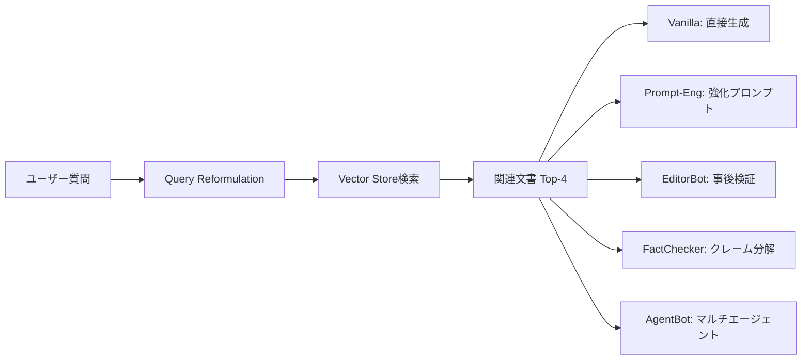
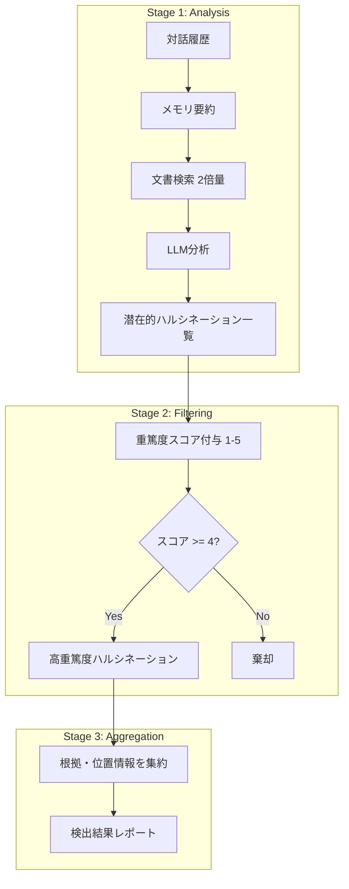

本記事は [HalluDetect: Detecting, Mitigating, and Benchmarking Hallucinations in Conversational Systems in the Legal Domain (arXiv:2509.11619)](https://arxiv.org/abs/2509.11619) の解説記事です。

## 論文概要（Abstract）

Spandan Anaokar, Shrey Ganatra, Harshvivek Kashid, Swapnil Bhattacharyya, Shruti Nair, Reshma Sekhar, Siddharth Manohar, Rahul Hemrajani, Pushpak Bhattacharyya らによる本論文は、法務ドメイン（消費者苦情チャットボット）におけるLLMハルシネーションの**検出・緩和・ベンチマーク**を体系的に扱った研究である。著者らはLLaMA 3.1 8B Instructを用いた5種類のRAGチャットボットアーキテクチャを構築し、LLMベースのハルシネーション検出システム「HalluDetect」を提案している。HalluDetectはGPT-4o mini使用時にF1スコア68.92%を達成し、既存のベースライン検出器を22.47%上回ったと報告されている。緩和手法としては、マルチエージェント構成のAgentBotが最も効果的で、ハルシネーション率をターン当たり0.4159に低減し、トークン精度96.13%を達成したとされる。

この記事は [Zenn記事: Vertex AI Gemini 3.1 Proの1Mコンテキストで契約書レビューの精度とコストを両立する](https://zenn.dev/0h_n0/articles/2d259d1c630072) の深掘りである。Zenn記事で解説されている法務LLMにおけるハルシネーション対策（法令引用制限ルール、確信度表明）の背景にある学術研究として、本論文の技術的詳細を解説する。

## 情報源

- **arXiv ID**: 2509.11619
- **URL**: [https://arxiv.org/abs/2509.11619](https://arxiv.org/abs/2509.11619)
- **著者**: Spandan Anaokar, Shrey Ganatra, Harshvivek Kashid et al.
- **発表年**: 2025年9月（v1）、2025年10月（v2）
- **分野**: cs.CL（Computation and Language）

## 背景と動機（Background & Motivation）

LLMは自然言語生成において高い流暢性を達成しているが、入力データに裏付けのない情報を生成する「ハルシネーション」は依然として深刻な課題である。特に法務ドメインでは、ハルシネーションの影響が致命的となりうる。消費者苦情チャットボットが誤った法的助言を生成した場合、ユーザーが存在しない法令に基づいて行動したり、不適切な救済手段を追求したりするリスクがある。

著者らはインドの消費者法に関するチャットボットを対象とし、以下の課題を指摘している。

- **既存検出手法の限界**: LettuceDetectやHHEM v2.1などの従来手法は、単一ターンのコンテキストに最適化されており、多ターン対話における文脈依存のハルシネーションを適切に検出できない
- **ドメイン依存パラドックス（Domain Reliance Paradox）**: 法務ドメインでは、RAGで取得した文書に含まれない一般常識的な回答（例: 「消費者は返品を要求できる」）を過剰にハルシネーションと判定してしまう問題が存在する
- **コンパクトモデルでの事実精度**: GPT-4のような大規模モデルではなく、LLaMA 3.1 8Bのようなコスト効率の高いコンパクトモデルでの事実精度向上が実務上重要である

これらの課題に対し、著者らは検出・緩和・ベンチマークの3軸で包括的なフレームワークを構築している。

## 主要な貢献（Key Contributions）

- **貢献1**: 5種類のRAGチャットボットアーキテクチャ（Vanilla、Prompt-engineered、EditorBot、FactChecker、AgentBot）の設計と比較評価。AgentBotが最も効果的な緩和戦略であることを実証した
- **貢献2**: 3段階パイプライン（Analysis → Filtering → Aggregation）によるLLMベースの多ターンハルシネーション検出システム「HalluDetect」の提案。F1=68.92%で既存手法を大幅に上回った
- **貢献3**: 法務専門家によるアノテーション済みベンチマークデータセット「DetectorEval」の構築。115対話、平均7.39ターン、対話あたり平均4.04件のハルシネーションを含む
- **貢献4**: 最適化された推論戦略により、コンパクトモデル（8Bパラメータ）でも事実精度を大幅に向上可能であることの実証

## 技術的詳細（Technical Details）

### 5種類のRAGチャットボットアーキテクチャ

著者らはLLaMA 3.1 8B Instructをベースに、ハルシネーション緩和のための5つのアーキテクチャを設計している。



**1. Vanilla**: 2段階のRAGパイプライン。まずクエリを法的文脈に即して再構成し、次にcosine類似度で上位4チャンクを取得して回答を生成する。ベースラインとして使用される。

**2. Prompt-engineered**: Vanillaの生成プロンプトに、事実的根拠づけを強調する制約（「提供された文書に基づいてのみ回答せよ」等）を追加したもの。

**3. EditorBot**: 生成後に「編集者プロンプト」による事後検証ステップを追加。生成された回答をRAG文書と照合し、矛盾や根拠不明の箇所を修正する。

**4. FactChecker**: 生成された回答をクレーム単位に分解し、各クレームをRAGコンテキストと照合して検証する。検証に失敗したクレームは修正または削除される。

**5. AgentBot**: 最も複雑な構成で、4つの専門エージェント（Receptionist、Paralegal、Lawyer、Drafter）がそれぞれの役割を果たすマルチエージェントワークフローを構成する。

AgentBotの各エージェントの役割は以下の通りである。

```python
from dataclasses import dataclass
from enum import Enum


class AgentRole(Enum):
    """AgentBotの各エージェントロール定義."""

    RECEPTIONIST = "receptionist"
    PARALEGAL = "paralegal"
    LAWYER = "lawyer"
    DRAFTER = "drafter"


@dataclass
class AgentConfig:
    """AgentBotのエージェント設定.

    Attributes:
        role: エージェントの役割
        description: 役割の説明
        input_source: 入力データソース
    """

    role: AgentRole
    description: str
    input_source: str


AGENT_PIPELINE: list[AgentConfig] = [
    AgentConfig(
        role=AgentRole.RECEPTIONIST,
        description="ユーザー質問を分類し、法的カテゴリを特定",
        input_source="user_query",
    ),
    AgentConfig(
        role=AgentRole.PARALEGAL,
        description="関連法令・判例をRAGから検索・要約",
        input_source="classified_query + rag_context",
    ),
    AgentConfig(
        role=AgentRole.LAWYER,
        description="法的分析を実施し、根拠に基づく法的見解を構成",
        input_source="paralegal_summary + rag_context",
    ),
    AgentConfig(
        role=AgentRole.DRAFTER,
        description="最終回答を平易な言葉でユーザー向けに整形",
        input_source="lawyer_opinion",
    ),
]
```

### HalluDetect: 3段階検出パイプライン

HalluDetectは、多ターン対話におけるハルシネーションを3段階で検出するLLMベースのシステムである。



**Stage 1 - Analysis（分析）**: 対話履歴全体のメモリ要約（memory_prompt）を生成し、通常の2倍の文書数をRAGから取得する。拡張されたコンテキストとメモリ要約をLLMに入力し、潜在的なハルシネーション候補を列挙する。2倍の文書取得は、Vanillaチャットボットが参照しなかった関連文書を検出器側で補完するための設計である。

**Stage 2 - Filtering（フィルタリング）**: 各ハルシネーション候補に1から5の重篤度スコアを付与する。スコア4以上のもののみを高重篤度ハルシネーションとして保持し、スコア3以下は棄却する。この閾値設定により、ドメイン依存パラドックスへの対処を図っている。すなわち、一般常識に基づく正当な回答が過度にハルシネーションと判定されることを防ぐ。

**Stage 3 - Aggregation（集約）**: 高重篤度ハルシネーションに対して、根拠となる文書の参照箇所、対話中の出現位置、判定理由を統合し、解釈可能なレポートを生成する。

### ハルシネーション検出の数式定義

論文では、ハルシネーション検出の性能を以下の指標で評価している。

検出器の出力を$\hat{H} = \{h_1, h_2, \ldots, h_m\}$、正解ラベルを$H^* = \{h^*_1, h^*_2, \ldots, h^*_n\}$とする。ここで各$h_i$および$h^*_j$は対話中の特定のテキストスパンに対応する。

精度（Precision）、再現率（Recall）、F1スコアは以下で定義される。

$$
\text{Precision} = \frac{|\hat{H} \cap H^*|}{|\hat{H}|}
$$

$$
\text{Recall} = \frac{|\hat{H} \cap H^*|}{|H^*|}
$$

$$
F_1 = 2 \cdot \frac{\text{Precision} \times \text{Recall}}{\text{Precision} + \text{Recall}}
$$

ここで、
- $\hat{H}$: 検出器が出力したハルシネーション集合
- $H^*$: 法務専門家がアノテーションした正解ハルシネーション集合
- $\|\hat{H} \cap H^*\|$: 正しく検出されたハルシネーション数

緩和手法の評価には、ターン当たりハルシネーション数（Hallucinations Per Turn, HPT）とトークン精度（Token Accuracy, TokAcc）が用いられる。

$$
\text{HPT} = \frac{\text{検出されたハルシネーション総数}}{\text{対話ターン総数}}
$$

$$
\text{TokAcc} = 1 - \frac{\text{ハルシネーショントークン数}}{\text{生成トークン総数}}
$$

### 検出における2つの課題

**偽陽性（False Positive）の発生**: 対話履歴に含まれるメールアドレスなどの情報が、RAGコーパスに存在しないためにハルシネーションと誤判定されるケースが報告されている。これは対話コンテキストの統合が不十分なことに起因する。

**偽陰性（False Negative）の発生**: 事実として誤りだが文脈的に自然な応答（例: 架空の住所の生成）は、意味的整合性が高いために検出を逃れる。これはLLMベース検出器の本質的な限界であり、検出器自身がハルシネーションの影響を受けうる点を示している。

## 実装のポイント（Implementation）

### RAGパイプラインの構成

論文のシステムは以下の技術スタックで構成されている。

- **LLM**: LLaMA-3.1-8B-Instruct（生成・検出の両方に使用）
- **Embedding**: mixedbread-ai/mxbai-embed-large-v1
- **Vector Store**: cosine類似度による上位4チャンク取得
- **推論パラメータ**: temperature=0.5, repetition_penalty=1.02, max_tokens=1024

法務AIでのハルシネーション対策を実装する際の実践的なポイントを以下に整理する。

```python
from dataclasses import dataclass


@dataclass
class HalluDetectConfig:
    """HalluDetect検出パイプラインの設定.

    Attributes:
        retrieval_multiplier: 検出時の文書取得倍率（通常の何倍取得するか）
        severity_threshold: ハルシネーション重篤度の閾値（1-5）
        temperature: LLM推論時のtemperature
        max_tokens: 最大生成トークン数
        top_k_chunks: RAG取得チャンク数
    """

    retrieval_multiplier: int = 2
    severity_threshold: int = 4
    temperature: float = 0.5
    max_tokens: int = 1024
    top_k_chunks: int = 4


def build_detection_prompt(
    dialogue_history: str,
    memory_summary: str,
    rag_context: str,
) -> str:
    """HalluDetect Stage 1の分析プロンプトを構築する.

    Args:
        dialogue_history: 対話の全履歴テキスト
        memory_summary: メモリ要約プロンプトの出力
        rag_context: 拡張RAGコンテキスト（通常の2倍量）

    Returns:
        LLMに入力する検出プロンプト文字列
    """
    return f"""You are a hallucination detector for legal chatbot responses.

## Dialogue History Summary
{memory_summary}

## Retrieved Legal Documents
{rag_context}

## Full Dialogue
{dialogue_history}

## Task
Identify all statements in the chatbot responses that:
1. Are not supported by the retrieved legal documents
2. Contain fabricated legal citations, case numbers, or statutes
3. Provide specific legal advice not grounded in the context

For each hallucination found, provide:
- The exact text span
- Severity score (1-5, where 5 is most severe)
- Justification for the classification

IMPORTANT: Do NOT flag general legal knowledge (e.g., "consumers have the
right to file complaints") as hallucinations. Only flag specific claims
that require document support but lack it."""
```

### 実装時の注意事項

1. **文書取得量の拡張**: HalluDetectでは検出精度向上のために通常の2倍の文書を取得するが、これはトークン使用量が2.52倍に増加することを意味する（論文報告値: 検出あたり約69,402トークン vs ベースライン27,538トークン）。コスト管理が必要な本番環境では、重要度の高い対話のみに検出を適用するサンプリング戦略が有効である

2. **重篤度閾値の調整**: 閾値4はドメイン依存パラドックスへの対処として設定されているが、ドメインによって最適値は異なる。医療ドメインではより低い閾値（3）、カジュアルな問い合わせ対応では高い閾値（5）が適切な可能性がある

3. **メモリ要約の品質**: 多ターン対話ではメモリ要約（memory_prompt）の品質が検出精度に直結する。要約自体がハルシネーションを含むと、検出器の判断が歪む再帰的な問題が発生しうる

## Production Deployment Guide

### AWS実装パターン（コスト最適化重視）

HalluDetectのハルシネーション検出パイプラインをAWS上にデプロイする際の構成を、トラフィック量別に示す。以下のコスト試算は2026年6月時点のAWS ap-northeast-1（東京）リージョン料金に基づく概算値であり、実際のコストはトラフィックパターンやバースト使用量により変動する。最新料金はAWS料金計算ツールで確認を推奨する。

| 構成 | トラフィック | 主要サービス | 月額概算 |
|------|-------------|-------------|---------|
| **Small** | ~100 req/日 | Lambda + Bedrock + DynamoDB | $80-180 |
| **Medium** | ~1,000 req/日 | ECS Fargate + Bedrock + ElastiCache | $400-900 |
| **Large** | 10,000+ req/日 | EKS + Spot + vLLM自前ホスト | $2,500-5,500 |

**Small構成の詳細**: Lambda（1024MB, 30秒タイムアウト）でリクエストを受け付け、Amazon Bedrock（Llama 3.1 8B相当モデル）でハルシネーション検出を実行する。対話履歴とRAGコンテキストはDynamoDB（On-Demandモード）に保存する。HalluDetectの3段階パイプラインを1つのLambda関数内で逐次実行する構成である。

**Medium構成の詳細**: ECS Fargate（2vCPU, 4GB RAM）で常駐サービスとして稼働し、ElastiCacheでメモリ要約をキャッシュする。Bedrockへのリクエストはバッチ化して送信し、API呼び出し回数を削減する。

**Large構成の詳細**: EKS上にvLLMでLlama 3.1 8Bを自前ホストし、Karpenter + Spot Instances（g5.xlarge）で推論コストを削減する。検出パイプラインの各ステージを独立したマイクロサービスとして分離し、Stage 1（文書取得・分析）のみスケールアウト可能にする。

**コスト削減テクニック**:
- Spot Instances活用（g5.xlarge）で推論コスト最大90%削減
- Bedrock Batch API使用でオンデマンド比50%削減
- Prompt Caching有効化でシステムプロンプト部分のトークンコスト30-90%削減
- Reserved Instances（1年コミット）で常時稼働ノードのコスト最大72%削減

### Terraformインフラコード

**Small構成（Serverless）**:

```hcl
# HalluDetect Serverless構成 - Lambda + Bedrock + DynamoDB
# terraform apply で即デプロイ可能

terraform {
  required_version = ">= 1.9"
  required_providers {
    aws = {
      source  = "hashicorp/aws"
      version = "~> 5.80"
    }
  }
}

provider "aws" {
  region = "ap-northeast-1"
}

# --- IAM（最小権限） ---
resource "aws_iam_role" "halludetect_lambda" {
  name = "halludetect-lambda-role"
  assume_role_policy = jsonencode({
    Version = "2012-10-17"
    Statement = [{
      Action = "sts:AssumeRole"
      Effect = "Allow"
      Principal = { Service = "lambda.amazonaws.com" }
    }]
  })
}

resource "aws_iam_role_policy" "halludetect_policy" {
  name = "halludetect-policy"
  role = aws_iam_role.halludetect_lambda.id
  policy = jsonencode({
    Version = "2012-10-17"
    Statement = [
      {
        Effect   = "Allow"
        Action   = ["bedrock:InvokeModel"]
        Resource = "arn:aws:bedrock:ap-northeast-1::foundation-model/meta.llama*"
      },
      {
        Effect   = "Allow"
        Action   = ["dynamodb:GetItem", "dynamodb:PutItem", "dynamodb:Query"]
        Resource = aws_dynamodb_table.dialogue_history.arn
      },
      {
        Effect   = "Allow"
        Action   = ["logs:CreateLogGroup", "logs:CreateLogStream", "logs:PutLogEvents"]
        Resource = "arn:aws:logs:ap-northeast-1:*:*"
      }
    ]
  })
}

# --- DynamoDB（On-Demand、コスト最適化） ---
resource "aws_dynamodb_table" "dialogue_history" {
  name         = "halludetect-dialogue-history"
  billing_mode = "PAY_PER_REQUEST"  # On-Demand: 低トラフィック時にコスト最適
  hash_key     = "conversation_id"
  range_key    = "turn_number"

  attribute {
    name = "conversation_id"
    type = "S"
  }
  attribute {
    name = "turn_number"
    type = "N"
  }

  # KMS暗号化
  server_side_encryption {
    enabled = true
  }

  ttl {
    attribute_name = "expires_at"
    enabled        = true
  }
}

# --- Lambda関数 ---
resource "aws_lambda_function" "halludetect" {
  function_name = "halludetect-detector"
  role          = aws_iam_role.halludetect_lambda.arn
  handler       = "handler.lambda_handler"
  runtime       = "python3.12"
  timeout       = 60  # HalluDetect 3段階パイプライン用に長めに設定
  memory_size   = 1024

  filename         = "lambda_package.zip"
  source_code_hash = filebase64sha256("lambda_package.zip")

  environment {
    variables = {
      BEDROCK_MODEL_ID      = "meta.llama3-1-8b-instruct-v1:0"
      DYNAMODB_TABLE        = aws_dynamodb_table.dialogue_history.name
      SEVERITY_THRESHOLD    = "4"
      RETRIEVAL_MULTIPLIER  = "2"
    }
  }
}

# --- CloudWatch アラーム（コスト監視） ---
resource "aws_cloudwatch_metric_alarm" "lambda_duration" {
  alarm_name          = "halludetect-lambda-duration-high"
  comparison_operator = "GreaterThanThreshold"
  evaluation_periods  = 3
  metric_name         = "Duration"
  namespace           = "AWS/Lambda"
  period              = 300
  statistic           = "Average"
  threshold           = 45000  # 45秒超過でアラート
  alarm_description   = "HalluDetect Lambda execution time exceeds 45s"

  dimensions = {
    FunctionName = aws_lambda_function.halludetect.function_name
  }
}
```

**Large構成（Container）**:

```hcl
# HalluDetect Container構成 - EKS + Karpenter + Spot
# 高トラフィック環境向け

module "eks" {
  source  = "terraform-aws-modules/eks/aws"
  version = "~> 20.31"

  cluster_name    = "halludetect-cluster"
  cluster_version = "1.31"

  vpc_id     = module.vpc.vpc_id
  subnet_ids = module.vpc.private_subnets

  # Karpenter用のIAM設定
  enable_cluster_creator_admin_permissions = true
}

# --- Karpenter Provisioner（Spot優先） ---
resource "kubectl_manifest" "karpenter_nodepool" {
  yaml_body = yamlencode({
    apiVersion = "karpenter.sh/v1"
    kind       = "NodePool"
    metadata   = { name = "halludetect-gpu" }
    spec = {
      template = {
        spec = {
          requirements = [
            { key = "karpenter.sh/capacity-type", operator = "In", values = ["spot", "on-demand"] },
            { key = "node.kubernetes.io/instance-type", operator = "In", values = ["g5.xlarge", "g5.2xlarge"] },
          ]
          nodeClassRef = { name = "default" }
        }
      }
      limits   = { cpu = "64", memory = "256Gi" }
      disruption = {
        consolidationPolicy = "WhenEmptyOrUnderutilized"
        consolidateAfter    = "30s"
      }
    }
  })
}

# --- Secrets Manager（Bedrock設定） ---
resource "aws_secretsmanager_secret" "halludetect_config" {
  name        = "halludetect/config"
  description = "HalluDetect pipeline configuration"
}

# --- AWS Budgets（予算アラート） ---
resource "aws_budgets_budget" "halludetect_monthly" {
  name         = "halludetect-monthly"
  budget_type  = "COST"
  limit_amount = "5000"
  limit_unit   = "USD"
  time_unit    = "MONTHLY"

  notification {
    comparison_operator       = "GREATER_THAN"
    threshold                 = 80
    threshold_type            = "PERCENTAGE"
    notification_type         = "ACTUAL"
    subscriber_email_addresses = ["alerts@example.com"]
  }
}
```

### 運用・監視設定

**CloudWatch Logs Insights クエリ**:

```
# ハルシネーション検出率の時系列分析（1時間あたり）
fields @timestamp, @message
| filter @message like /hallucination_detected/
| stats count(*) as detections, avg(severity_score) as avg_severity by bin(1h)
| sort @timestamp desc

# レイテンシ分析（P95, P99）
fields @timestamp, duration_ms
| filter event_type = "detection_pipeline"
| stats percentile(duration_ms, 95) as p95,
        percentile(duration_ms, 99) as p99,
        avg(duration_ms) as avg_ms
  by bin(1h)
```

**CloudWatch アラーム設定（Python）**:

```python
import boto3


def create_halludetect_alarms(
    function_name: str,
    sns_topic_arn: str,
) -> list[str]:
    """HalluDetect用のCloudWatchアラームを作成する.

    Args:
        function_name: Lambda関数名
        sns_topic_arn: 通知先SNSトピックARN

    Returns:
        作成されたアラームのARNリスト
    """
    cw = boto3.client("cloudwatch", region_name="ap-northeast-1")
    alarm_arns: list[str] = []

    # Bedrock トークン使用量スパイク検知
    cw.put_metric_alarm(
        AlarmName=f"{function_name}-token-spike",
        MetricName="InputTokenCount",
        Namespace="AWS/Bedrock",
        Statistic="Sum",
        Period=3600,
        EvaluationPeriods=1,
        Threshold=500000,  # 1時間あたり50万トークン超過
        ComparisonOperator="GreaterThanThreshold",
        AlarmActions=[sns_topic_arn],
    )

    # Lambda実行時間異常検知
    cw.put_metric_alarm(
        AlarmName=f"{function_name}-duration-anomaly",
        MetricName="Duration",
        Namespace="AWS/Lambda",
        Statistic="p99",
        Period=300,
        EvaluationPeriods=3,
        Threshold=55000,
        ComparisonOperator="GreaterThanThreshold",
        Dimensions=[{"Name": "FunctionName", "Value": function_name}],
        AlarmActions=[sns_topic_arn],
    )

    return alarm_arns
```

**X-Ray トレーシング設定（Python）**:

```python
from aws_xray_sdk.core import xray_recorder, patch_all


def setup_xray_tracing() -> None:
    """HalluDetect パイプラインのX-Rayトレーシングを設定する."""
    xray_recorder.configure(service="halludetect")
    patch_all()  # boto3自動計装


@xray_recorder.capture("halludetect_pipeline")
def run_detection_pipeline(
    conversation_id: str,
    dialogue_history: str,
) -> dict:
    """ハルシネーション検出パイプラインを実行しトレースを記録する.

    Args:
        conversation_id: 対話セッションID
        dialogue_history: 対話履歴テキスト

    Returns:
        検出結果の辞書
    """
    subsegment = xray_recorder.current_subsegment()
    if subsegment:
        subsegment.put_annotation("conversation_id", conversation_id)
        subsegment.put_metadata("turn_count", dialogue_history.count("[USER]"))

    # Stage 1-3 の各段階もサブセグメントで追跡
    with xray_recorder.in_subsegment("stage1_analysis"):
        analysis_result = _run_analysis(dialogue_history)

    with xray_recorder.in_subsegment("stage2_filtering"):
        filtered = _filter_by_severity(analysis_result, threshold=4)

    with xray_recorder.in_subsegment("stage3_aggregation"):
        report = _aggregate_results(filtered)

    return report
```

**Cost Explorer自動レポート（Python）**:

```python
import datetime

import boto3


def get_daily_halludetect_cost(
    sns_topic_arn: str,
    cost_threshold: float = 100.0,
) -> dict:
    """日次コストレポートを取得し閾値超過時にSNS通知する.

    Args:
        sns_topic_arn: 通知先SNSトピックARN
        cost_threshold: 日次コスト閾値（USD）

    Returns:
        サービス別コスト辞書
    """
    ce = boto3.client("ce", region_name="us-east-1")
    today = datetime.date.today()
    yesterday = today - datetime.timedelta(days=1)

    response = ce.get_cost_and_usage(
        TimePeriod={"Start": str(yesterday), "End": str(today)},
        Granularity="DAILY",
        Metrics=["UnblendedCost"],
        Filter={
            "Tags": {
                "Key": "Project",
                "Values": ["halludetect"],
            }
        },
        GroupBy=[{"Type": "DIMENSION", "Key": "SERVICE"}],
    )

    costs: dict[str, float] = {}
    total = 0.0
    for group in response["ResultsByTime"][0]["Groups"]:
        service = group["Keys"][0]
        amount = float(group["Metrics"]["UnblendedCost"]["Amount"])
        costs[service] = amount
        total += amount

    if total > cost_threshold:
        sns = boto3.client("sns", region_name="ap-northeast-1")
        sns.publish(
            TopicArn=sns_topic_arn,
            Subject=f"HalluDetect cost alert: ${total:.2f}/day",
            Message=f"Daily cost exceeded ${cost_threshold}: ${total:.2f}\n{costs}",
        )

    return costs
```

### コスト最適化チェックリスト

**アーキテクチャ選択**:
- [ ] トラフィック量に応じた構成を選択（~100 req/日: Serverless、~1,000 req/日: Hybrid、10,000+ req/日: Container）
- [ ] HalluDetectの検出を全対話に適用するかサンプリングするか判断（2.52倍のトークンコスト考慮）

**リソース最適化**:
- [ ] EC2/EKS: Spot Instances優先（g5.xlarge推論ノード）
- [ ] Reserved Instances: 常時稼働ノードに1年コミット
- [ ] Savings Plans: Compute Savings Plans検討
- [ ] Lambda: メモリサイズ最適化（1024MB推奨、Power Tuningで検証）
- [ ] ECS/EKS: 夜間・休日のスケールダウン設定

**LLMコスト削減**:
- [ ] Bedrock Batch API使用（非リアルタイム検出に50%削減）
- [ ] Prompt Caching有効化（システムプロンプト部分で30-90%削減）
- [ ] モデル選択ロジック（低リスク対話はHaiku、高リスクはLlama 8B/GPT-4o mini）
- [ ] トークン数制限（max_tokens=1024、メモリ要約で入力トークン圧縮）
- [ ] 検出結果キャッシュ（同一RAGコンテキストの再利用）

**監視・アラート**:
- [ ] AWS Budgets設定（月額上限アラート）
- [ ] CloudWatchアラーム（トークン使用量スパイク、レイテンシ異常）
- [ ] Cost Anomaly Detection有効化
- [ ] 日次コストレポート（Cost Explorer API + SNS）
- [ ] Bedrock Model Invocation Loggingで利用状況可視化

**リソース管理**:
- [ ] 未使用リソース削除（停止済みECSタスク、孤立EBS）
- [ ] タグ戦略（Project=halludetect, Environment=prod/dev）
- [ ] DynamoDB TTL設定（対話履歴の自動削除）
- [ ] CloudWatch Logs保持期間設定（90日）
- [ ] 開発環境の夜間停止（EventBridge Scheduler）

## 実験結果（Results）

### ハルシネーション検出性能（論文Table 1より）

| 検出モデル | Precision | Recall | F1 |
|-----------|-----------|--------|----|
| LettuceDetect | 30.55% | 96.89% | 46.45% |
| HHEM 2.1 | 27.91% | 98.35% | 43.48% |
| HalluDetect (Llama 3.1 8B) | 54.56% | 80.63% | 65.08% |
| **HalluDetect (GPT-4o mini)** | **54.30%** | **94.29%** | **68.92%** |

既存手法（LettuceDetect、HHEM 2.1）は再現率は高い（96-98%）が、精度が低い（27-30%）。これは多ターン対話における文脈を考慮せず、一般的な法的知識までハルシネーションとして過剰検出するためである。HalluDetectはStage 2のフィルタリングにより精度を54%台まで向上させつつ、GPT-4o mini使用時には再現率94.29%を維持している。統計的有意性についてはFriedman検定で有意差（p < 0.01）が確認され、Wilcoxon符号順位検定によりHalluDetectの精度が既存手法を有意に上回ること（p < 0.001）が報告されている。

### チャットボットアーキテクチャ別の緩和効果（論文Table 3より）

| アーキテクチャ | HPT-1 | HPT-2 | TokAcc-1 | TokAcc-2 | ハルシネーション含有対話率 |
|--------------|-------|-------|----------|----------|----------------------|
| Vanilla | 0.8165 | 0.7901 | 93.83% | 94.36% | 60.00% |
| Prompt-Eng. | 0.7692 | 0.8944 | 94.00% | 93.43% | 63.33% |
| EditorBot | 0.4476 | 0.4744 | 95.64% | 95.47% | 56.67% |
| FactChecker | 0.5872 | 0.5861 | 95.89% | 95.97% | 50.00% |
| **AgentBot** | **0.4159** | **0.4279** | **96.13%** | **96.38%** | **46.67%** |

HPT-1とHPT-2はそれぞれ異なるアノテータによる評価値、TokAcc-1とTokAcc-2も同様である。AgentBotはすべての指標でベストを記録し、VanillaのHPT 0.8165から0.4159へと約49%のハルシネーション低減を達成している。

注目すべき点として、Prompt-engineeredは一部の指標でVanillaよりも悪化している（HPT-2: 0.8944 vs 0.7901）。著者らはこれを、過度な制約プロンプトがモデルの推論能力を阻害し、かえって不正確な回答を誘発する現象として報告している。

### 計算コストのトレードオフ

HalluDetectの検出パイプラインは、ベースラインチャットボットと比較して約2.52倍のトークン使用量を必要とする（対話あたり約69,402トークン vs 27,538トークン）。この追加コストは、Stage 1での2倍量の文書取得とメモリ要約生成に起因する。実運用では、全対話に検出を適用するのではなく、リスクスコアに基づくサンプリング戦略が現実的である。

## 実運用への応用（Practical Applications）

### Zenn記事のハルシネーション対策との関連

Zenn記事「Vertex AI Gemini 3.1 Proの1Mコンテキストで契約書レビューの精度とコストを両立する」では、法務LLMにおける実践的なハルシネーション対策として以下のアプローチが解説されている。

1. **法令引用制限ルール**: LLMに対して「提供された法令のみを引用すること」というシステムインストラクションを設定する
2. **確信度表明**: 回答に確信度を付与し、低確信度の回答にはユーザーへの注意喚起を追加する

HalluDetectの知見は、これらの実践的対策を補完する形で活用できる。具体的には以下の組み合わせが有効である。

- **EditorBot的な事後検証**: Zenn記事のシステムインストラクションによるプロンプト制御に加え、生成後の検証ステップを追加することで、プロンプト制御をすり抜けたハルシネーションを捕捉する
- **AgentBot的な役割分離**: 法務情報の検索、法的分析、回答の整形を異なるプロンプト（または異なるモデル呼び出し）に分離することで、各段階での事実精度を管理しやすくする
- **重篤度スコアと確信度の統合**: HalluDetectの重篤度スコアリングとZenn記事の確信度表明を統合し、検出された低確信度の箇所にはハルシネーション検出結果を紐づけて提示する

### システムインストラクション設計への示唆

論文の結果から、プロンプトエンジニアリングのみでのハルシネーション緩和には限界があることが示されている（Prompt-Eng.がVanillaより悪化するケースの存在）。実運用では以下の多層防御が推奨される。

1. **Layer 1（プロンプト制御）**: Zenn記事のアプローチに従い、引用範囲と確信度表明をシステムインストラクションに組み込む
2. **Layer 2（構造的分離）**: AgentBotに倣い、検索・分析・生成を分離した処理パイプラインを構築する
3. **Layer 3（事後検出）**: HalluDetectのような検出器を後段に配置し、重篤度の高いハルシネーションをフィルタリングする

## 関連研究（Related Work）

- **LettuceDetect**: NLIベースのハルシネーション検出器。高い再現率（96.89%）を持つが、精度が低く（30.55%）、単一ターンのコンテキストに最適化されている。HalluDetectはメモリ要約と拡張文書取得で多ターン対話への対応を実現した
- **HHEM v2.1（Vectara）**: Hughes Hallucination Evaluation Model。同様に再現率は高いが精度が低い。HalluDetectの重篤度フィルタリングにより精度と再現率のバランスが改善されている
- **SelfCheckGPT**: LLM自身の複数回生成の一貫性からハルシネーションを検出する手法。HalluDetectは外部文書との照合に基づく点で、RAG環境により適合している
- **RefChecker**: 参照チェックに基づくハルシネーション検出。HalluDetectはRefCheckerの参照チェックの概念を拡張し、多ターン対話のメモリ管理と重篤度評価を統合している

## まとめと今後の展望

HalluDetectは、法務ドメインにおけるLLMハルシネーションの検出・緩和・ベンチマークを体系的に扱った研究であり、以下の実務的示唆を提供している。

- コンパクトモデル（8Bパラメータ）でも、AgentBotのようなマルチエージェント構成により事実精度を大幅に向上できること
- プロンプトエンジニアリングのみでの緩和には限界があり、構造的なアーキテクチャ設計が不可欠であること
- ハルシネーション検出は追加のトークンコスト（2.52倍）を伴うため、リスクベースの適用戦略が必要であること

論文の限界として、評価がインドの消費者法ドメインに限定されている点、LLMベースの検出器自身がハルシネーションの影響を受けうる点が挙げられる。今後の研究方向として、著者らはクロスドメインでの汎化性評価、検出器の軽量化（蒸留モデルの活用）、リアルタイム検出のための推論高速化を示唆している。

## 参考文献

- **arXiv**: [https://arxiv.org/abs/2509.11619](https://arxiv.org/abs/2509.11619)
- **Related Zenn article**: [https://zenn.dev/0h_n0/articles/2d259d1c630072](https://zenn.dev/0h_n0/articles/2d259d1c630072)
- **LettuceDetect**: [https://github.com/KRR-Oxford/LettuceDet](https://github.com/KRR-Oxford/LettuceDet)
- **HHEM v2.1**: [https://huggingface.co/vectara/hallucination_evaluation_model](https://huggingface.co/vectara/hallucination_evaluation_model)
