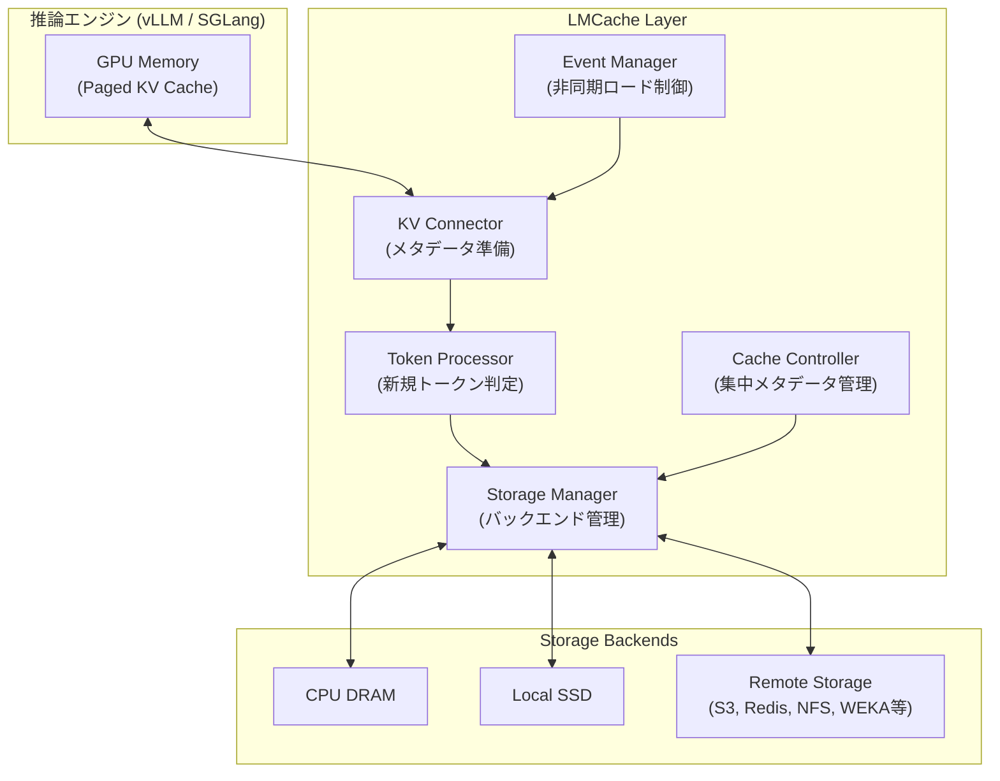
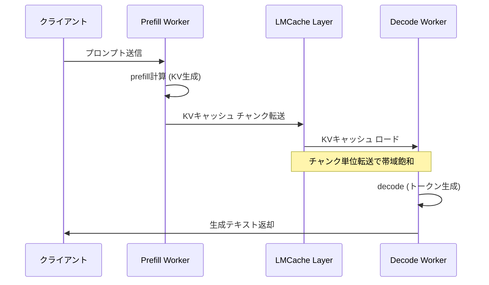

## 論文概要（Abstract）

本記事は [https://arxiv.org/abs/2510.09665](https://arxiv.org/abs/2510.09665) の解説記事です。

LMCacheは、LLM推論におけるKVキャッシュをGPUメモリの外部に移動し、クエリ間および推論エンジン間で共有可能にするKVキャッシュ管理レイヤーである。従来、KVキャッシュはGPUメモリ上にのみ存在し、個々のクエリ処理後に破棄されていた。LMCacheはこのKVキャッシュを永続化・階層化し、CPU DRAM、ローカルディスク、リモートストレージにオフロードすることで、プレフィックスの再計算を回避する。著者らは、マルチラウンドQAやドキュメント分析のワークロードにおいて最大15倍のスループット改善を報告している。

この記事は [Zenn記事: Vertex AI Gemini 3.1 Proの1Mコンテキストで契約書レビューの精度とコストを両立する](https://zenn.dev/0h_n0/articles/2d259d1c630072) の深掘りです。

## 情報源

- **arXiv ID**: 2510.09665
- **URL**: [https://arxiv.org/abs/2510.09665](https://arxiv.org/abs/2510.09665)
- **著者**: Yuhan Liu, Yihua Cheng, Junchen Jiang et al.（全11名）
- **発表年**: 2025年（v1: 2025年10月、v2: 2025年12月）
- **分野**: cs.LG（Machine Learning）
- **GitHub**: [https://github.com/LMCache/LMCache](https://github.com/LMCache/LMCache)

## 背景と動機（Background & Motivation）

LLM推論のデコードフェーズでは、過去のトークンの計算結果をKVキャッシュとしてGPUメモリに保持し、再計算を回避する。しかし、エンタープライズ環境では以下の3つの問題が顕在化している。

第一に、GPUメモリの容量制限である。コンテキスト長が数万トークンに達するとKVキャッシュのサイズはGBオーダーに膨れ上がり、同時処理可能なクエリ数を圧迫する。論文のFigure 3によれば、あるエンタープライズ環境では5週間の運用期間中にGPUメモリを超過するKVキャッシュの割合が顕著に増加したと報告されている。

第二に、クエリ間でのキャッシュ再利用の欠如である。RAGパイプラインやマルチラウンド会話では、同一のドキュメントチャンクやシステムプロンプトが繰り返し入力されるにもかかわらず、従来のシステムではクエリごとにprefillを再実行していた。

第三に、推論エンジン間でのキャッシュ共有が不可能だった点である。prefill処理とdecode処理を別GPUに分離する「Prefill-Decode Disaggregation」のアーキテクチャでは、prefillで生成したKVキャッシュをdecodeワーカーに効率的に転送する仕組みが必要となる。

## 主要な貢献（Key Contributions）

- **高速なKVキャッシュデータ移動**: バッチ化I/O、Compute-I/Oパイプライニング、ゼロコピー参照カウンタにより、CPU DRAMからの読み込み帯域幅400 Gbpsを達成（vLLMネイティブの88 Gbpsに対し約4.5倍）
- **モジュラーKV Connector**: 推論エンジン（vLLM、SGLang）の内部進化から独立したコネクタインタフェースにより、エンジンのバージョンアップに追従しやすい設計を実現
- **Cache Controller API**: GPU、CPU、ストレージ、ネットワークをまたぐ柔軟なキャッシュオーケストレーションを提供し、KV-awareなルーティング、ピンニング、圧縮の判断を可能にする
- **エンタープライズデプロイメント知見**: 実プロダクション環境での運用から得た設計上の教訓を体系的に報告

## 技術的詳細（Technical Details）

### システムアーキテクチャ

LMCacheは推論エンジンとストレージ・ネットワークデバイスの間に位置するミドルウェアとして動作する。以下の主要コンポーネントで構成される。



KV Connectorは、推論エンジンからトークン化されたプロンプトとGPUメモリアドレスを受け取り、Token Processorがストレージへの保存が必要な新規トークンを判定する。Storage Managerは複数のバックエンド（CPU DRAM、ローカルSSD、S3互換ストレージ、Redis/Valkey、NFS、WEKA、GPU-Direct Storage、Mooncake Store、NIXL、InfiniStore）にわたるデータの読み書きを管理する。

### KVキャッシュのチャンキング戦略

LMCacheはKVキャッシュをチャンク単位で管理する。vLLMでは1ページが「単一レイヤーにおける16トークン分」に対応し、Llama-3.1-8B-Instructの場合、1ページあたり約62.5 KBとなる。デフォルトのチャンクサイズは256トークンである。

小さなI/O操作はネットワーク帯域幅の利用効率が低いため、複数レイヤーの複数ページをまとめて大きなチャンクに統合する。論文Table 1では、転送メッセージサイズと達成スループットの関係が示されている。

| メッセージサイズ | 達成スループット |
|:---:|:---:|
| 64 KB | 4 Gbps |
| 1 MB | 16 Gbps |
| 10 MB | 40 Gbps |
| 100 MB | 49 Gbps |

この結果から、チャンクサイズを十分に大きく取ることで帯域利用効率が向上することが分かる。

### データ移動の最適化

LMCacheのデータ移動最適化は3つの柱から成る。

**1. バッチ化I/OとカスタムCUDAカーネル**

GPUのpaged memoryは連続していないため、そのままではDMA転送効率が低い。LMCacheは中間ストリーミングGPUバッファを用意し、散在するページメモリを連続領域に集約する。カスタムCUDAカーネルがDMAエンジンを介して一括オフロードを実行する。

**2. レイヤーワイズCompute-I/Oパイプライニング**

計算とデータ移動を別々のCUDAストリームに割り当て、レイヤー単位で重畳する。レイヤー$N$の計算中にレイヤー$N+1$のKVキャッシュを非同期でロードする。

$$
T_{\text{total}} \approx \max(T_{\text{compute}}, T_{\text{load}}) \times L
$$

ここで、
- $T_{\text{compute}}$: 1レイヤーあたりの計算時間
- $T_{\text{load}}$: 1レイヤーあたりのKVキャッシュ読み込み時間
- $L$: レイヤー数

この方式により、必要な追加GPUバッファは単一レイヤー分のKVキャッシュサイズのみに抑えられる。

**3. ゼロコピー参照カウンタによるデータ重複排除**

複数の宛先への転送時にデータをコピーせず、参照カウンタで管理する。各読み書き操作の完了時にカウンタをデクリメントし、カウンタが0になった時点でデータを解放する。

### 動的オフロード機構

GPUメモリが逼迫した場合、KVキャッシュをCPUメモリに動的にオフロードする。この機構は3つのポインタ（start、current、end）で状態遷移を管理する。

```python
class DynamicOffloadManager:
    """KVキャッシュの動的GPU→CPUオフロードを管理する。

    3つのポインタでオフロード進捗を追跡:
    - start: オフロード開始位置
    - current: 現在のオフロード進行位置
    - end: オフロード完了予定位置
    """

    def __init__(self, total_pages: int) -> None:
        self.start: int = 0
        self.current: int = 0
        self.end: int = 0
        self.total_pages: int = total_pages

    def initiate_offload(self, num_pages: int) -> None:
        """オフロード対象範囲を設定する。

        Args:
            num_pages: オフロードするページ数
        """
        self.start = self.current
        self.end = self.start + num_pages

    def advance(self, pages_transferred: int) -> bool:
        """オフロード進行状況を更新する。

        Args:
            pages_transferred: 転送完了したページ数

        Returns:
            オフロードが完了したかどうか
        """
        self.current += pages_transferred
        return self.current >= self.end

    def on_query_arrival(self, allocated_pages: int) -> None:
        """新規クエリ到着時にend pointerを拡張する。

        Args:
            allocated_pages: 新規に割り当てたページ数
        """
        self.end += allocated_pages
```

### Prefill-Decode Disaggregation

大規模モデルの推論では、プロンプト全体を処理するprefillフェーズと、トークンを逐次生成するdecodeフェーズで計算特性が異なる。prefillは計算バウンド（行列積の並列実行）、decodeはメモリバウンド（KVキャッシュの読み出し）である。

LMCacheはこの2つのフェーズを別GPUに分離するPD Disaggregationをサポートする。KVキャッシュをチャンク単位で転送することで帯域を飽和させる。vLLMネイティブのPD実装がページ単位（約62.5 KB）で転送するのに対し、LMCacheはチャンク単位（数MB以上）で転送するため、帯域利用効率が大幅に向上する。



### KV Connectorインタフェース

推論エンジンとの結合を疎に保つため、LMCacheは8つのコネクタ関数を定義している（論文Table 2）。主要な関数は以下の通りである。

- `get_num_new_matched_tokens`: キャッシュ上で何トークン分のヒットがあるかを返す
- `update_state_after_alloc`: メモリ割り当て後の内部状態を更新する
- `build_connector_meta`: 転送に必要なメタデータ（トークンハッシュ、GPUアドレス等）を構築する

このインタフェース設計により、vLLMやSGLangのバージョンアップ時にも最小限の変更でLMCacheを維持できる。

## 実装のポイント（Implementation）

LMCacheはPythonで実装されており、`pip install lmcache`で導入できる。vLLMとの連携には2つのデプロイモードが用意されている。

**Multiprocess（MP）モード（推奨）**: LMCacheを独立デーモンとして起動し、推論エンジンが障害で停止してもKVキャッシュを失わない。

```bash
# LMCacheサーバー起動
lmcache server \
    --l1-size-gb 20 --eviction-policy LRU --chunk-size 16

# vLLM起動（別ターミナル）
vllm serve Qwen/Qwen3-8B \
    --port 8000 --kv-transfer-config \
    '{"kv_connector":"LMCacheMPConnector", "kv_role":"kv_both"}'
```

**In-Processモード**: 単一プロセスで動作するシンプルな構成。

```bash
LMCACHE_CHUNK_SIZE=8 \
vllm serve Qwen/Qwen3-8B \
    --port 8000 --kv-transfer-config \
    '{"kv_connector":"LMCacheConnectorV1", "kv_role":"kv_both"}'
```

SGLangとの連携ではYAML設定ファイルを使用する。

```yaml
# lmc_config.yaml
chunk_size: 8
local_cpu: true
use_layerwise: true
max_local_cpu_size: 10  # GB
```

実装上の注意点として、チャンクサイズの選定がある。小さすぎるとI/O効率が低下し、大きすぎるとキャッシュヒット率が下がる。ワークロードに応じて8-256トークンの範囲で調整することが推奨される。また、レイヤーワイズパイプライニングを有効にする`use_layerwise: true`は、大きなモデル（70B以上）でTTFT削減効果が顕著となる。

## Production Deployment Guide

LMCacheのKVキャッシュオフロード機能をAWS上でプロダクション環境として構築するためのガイドを示す。以下のコスト試算は2026年6月時点のAWS ap-northeast-1（東京）リージョン料金に基づく概算値であり、実際のコストはトラフィックパターン、バースト使用量、リージョンにより変動する。最新料金はAWS料金計算ツールで確認を推奨する。

### AWS実装パターン（コスト最適化重視）

LMCacheの主要メリットはKVキャッシュの再利用によるprefill再計算の回避であるため、GPU推論コストの削減が中心的な価値となる。

| 構成 | 想定トラフィック | 主要サービス | 月額概算 |
|:---:|:---:|:---|:---:|
| Small | ~100 req/日 | EC2 g5.xlarge (1xA10G) + LMCache (CPU DRAM) + S3 | $150-300 |
| Medium | ~1,000 req/日 | ECS Fargate (GPU) + ElastiCache Valkey + S3 | $800-1,500 |
| Large | 10,000+ req/日 | EKS + Karpenter (g5.12xlarge Spot) + ElastiCache クラスタ | $3,000-6,000 |

**Small構成の内訳**: EC2 g5.xlarge（$1.006/h、24h稼働で$724/月）をSpot Instance活用で約$150-220/月に削減可能。LMCacheはCPU DRAMオフロード（インスタンスの16GB RAMを活用）で追加コストなし。S3はKVキャッシュの永続化に使用（$0.025/GB/月、100GBで$2.5/月）。

**Medium構成の内訳**: ECS Fargate GPUタスク（vLLM+LMCache）、ElastiCache Valkey（cache.r7g.large、$0.252/h = $181/月）でクエリ間キャッシュ共有、S3 Express One Zone（低レイテンシ永続化）。

**Large構成の内訳**: EKS上にKarpenterでg5.12xlarge Spot（4xA10G、Spot価格で最大70%削減）を自動プロビジョニング。LMCacheのMPモード（独立デーモン）をサイドカーとして配置し、推論エンジン障害時のキャッシュ保全を実現。ElastiCache Valkey クラスタ（3ノード）でPD Disaggregation時のKVキャッシュ転送ハブとして機能。

**コスト削減テクニック**:
- Spot Instances活用: g5インスタンスで最大70-90%削減（GPUワークロードはSpot中断耐性あり、LMCacheがKVキャッシュを外部保持するため再開が高速）
- Reserved Instances (1年): 最大40%削減（安定トラフィックのベースライン用）
- Savings Plans: Compute Savings Plansで最大66%削減
- LMCacheのキャッシュヒットによるGPU時間削減: prefill再計算を回避することで実効的なGPUコストを30-80%削減（ヒット率依存）

### Terraformインフラコード

**Small構成（EC2 + LMCache + S3）**:

```hcl
# --- VPC基盤 ---
resource "aws_vpc" "lmcache" {
  cidr_block           = "10.0.0.0/16"
  enable_dns_hostnames = true
  tags = { Name = "lmcache-vpc" }
}

resource "aws_subnet" "private" {
  vpc_id            = aws_vpc.lmcache.id
  cidr_block        = "10.0.1.0/24"
  availability_zone = "ap-northeast-1a"
  tags = { Name = "lmcache-private" }
}

# --- IAMロール（最小権限） ---
resource "aws_iam_role" "lmcache_ec2" {
  name = "lmcache-ec2-role"
  assume_role_policy = jsonencode({
    Version = "2012-10-17"
    Statement = [{
      Action = "sts:AssumeRole"
      Effect = "Allow"
      Principal = { Service = "ec2.amazonaws.com" }
    }]
  })
}

resource "aws_iam_role_policy" "s3_kvcache" {
  name = "s3-kvcache-access"
  role = aws_iam_role.lmcache_ec2.id
  policy = jsonencode({
    Version = "2012-10-17"
    Statement = [{
      Effect   = "Allow"
      Action   = ["s3:GetObject", "s3:PutObject", "s3:DeleteObject"]
      Resource = "${aws_s3_bucket.kvcache.arn}/*"
    }]
  })
}

# --- S3（KVキャッシュ永続化、KMS暗号化） ---
resource "aws_s3_bucket" "kvcache" {
  bucket = "lmcache-kvcache-${data.aws_caller_identity.current.account_id}"
  tags   = { Purpose = "kv-cache-storage" }
}

resource "aws_s3_bucket_server_side_encryption_configuration" "kvcache" {
  bucket = aws_s3_bucket.kvcache.id
  rule {
    apply_server_side_encryption_by_default {
      sse_algorithm = "aws:kms"
    }
  }
}

resource "aws_s3_bucket_lifecycle_configuration" "kvcache_ttl" {
  bucket = aws_s3_bucket.kvcache.id
  rule {
    id     = "expire-old-cache"
    status = "Enabled"
    expiration { days = 7 }  # 7日で自動削除（コスト最適化）
  }
}

# --- EC2 GPU Instance (Spot) ---
resource "aws_spot_instance_request" "lmcache_gpu" {
  ami                  = "ami-0abcdef1234567890"  # Deep Learning AMI (Ubuntu)
  instance_type        = "g5.xlarge"               # 1x A10G, 16GB VRAM
  spot_price           = "0.40"                    # 最大許容Spot価格
  wait_for_fulfillment = true
  subnet_id            = aws_subnet.private.id
  iam_instance_profile = aws_iam_instance_profile.lmcache.name

  root_block_device {
    volume_size = 100
    volume_type = "gp3"
    encrypted   = true
  }

  user_data = base64encode(<<-EOF
    #!/bin/bash
    pip install lmcache vllm
    # LMCache MPモード起動
    lmcache server --l1-size-gb 12 --eviction-policy LRU --chunk-size 16 &
    # vLLM起動
    vllm serve meta-llama/Llama-3.1-8B-Instruct \
      --port 8000 \
      --kv-transfer-config '{"kv_connector":"LMCacheMPConnector","kv_role":"kv_both"}'
    EOF
  )

  tags = { Name = "lmcache-gpu-spot" }
}

# --- CloudWatch アラーム（コスト監視） ---
resource "aws_cloudwatch_metric_alarm" "gpu_utilization" {
  alarm_name          = "lmcache-gpu-low-utilization"
  comparison_operator = "LessThanThreshold"
  evaluation_periods  = 3
  metric_name         = "GPUUtilization"
  namespace           = "AWS/EC2"
  period              = 300
  statistic           = "Average"
  threshold           = 10
  alarm_description   = "GPU utilization below 10% for 15min - consider stopping"
  alarm_actions       = [aws_sns_topic.alerts.arn]
}

data "aws_caller_identity" "current" {}
```

**Large構成（EKS + Karpenter + Spot）**:

```hcl
# --- EKSクラスタ ---
module "eks" {
  source          = "terraform-aws-modules/eks/aws"
  version         = "~> 20.0"
  cluster_name    = "lmcache-cluster"
  cluster_version = "1.31"
  vpc_id          = aws_vpc.lmcache.id
  subnet_ids      = aws_subnet.private[*].id

  cluster_endpoint_public_access = false  # プライベートアクセスのみ

  eks_managed_node_groups = {
    system = {
      instance_types = ["m7i.large"]
      min_size       = 2
      max_size       = 3
      desired_size   = 2
    }
  }
}

# --- Karpenter Provisioner（Spot優先、GPU） ---
resource "kubectl_manifest" "karpenter_nodepool" {
  yaml_body = yamlencode({
    apiVersion = "karpenter.sh/v1"
    kind       = "NodePool"
    metadata   = { name = "gpu-lmcache" }
    spec = {
      template = {
        spec = {
          requirements = [
            { key = "karpenter.sh/capacity-type", operator = "In", values = ["spot", "on-demand"] },
            { key = "node.kubernetes.io/instance-type", operator = "In",
              values = ["g5.12xlarge", "g5.8xlarge", "g5.4xlarge"] },
          ]
          nodeClassRef = { name = "default" }
        }
      }
      limits   = { cpu = "128", "nvidia.com/gpu" = "16" }
      disruption = {
        consolidationPolicy = "WhenEmptyOrUnderutilized"
        consolidateAfter    = "60s"
      }
    }
  })
}

# --- Secrets Manager（モデル設定） ---
resource "aws_secretsmanager_secret" "lmcache_config" {
  name       = "lmcache/config"
  kms_key_id = aws_kms_key.lmcache.arn
}

# --- AWS Budgets（月次予算アラート） ---
resource "aws_budgets_budget" "lmcache_monthly" {
  name         = "lmcache-monthly"
  budget_type  = "COST"
  limit_amount = "5000"
  limit_unit   = "USD"
  time_unit    = "MONTHLY"

  notification {
    comparison_operator       = "GREATER_THAN"
    threshold                 = 80
    threshold_type            = "PERCENTAGE"
    notification_type         = "ACTUAL"
    subscriber_email_addresses = ["ops-team@example.com"]
  }
}
```

### 運用・監視設定

**CloudWatch Logs Insights クエリ（コスト異常検知）**:

```
fields @timestamp, @message
| filter @message like /kv_cache_hit/
| stats count(*) as hits, sum(tokens_saved) as total_tokens_saved by bin(1h) as hour
| sort hour desc
```

**CloudWatch Logs Insights クエリ（レイテンシ分析）**:

```
fields @timestamp, ttft_ms, itl_ms
| stats avg(ttft_ms) as avg_ttft,
        pct(ttft_ms, 95) as p95_ttft,
        pct(ttft_ms, 99) as p99_ttft,
        avg(itl_ms) as avg_itl
  by bin(5m)
| sort @timestamp desc
```

**CloudWatch アラーム設定（Python）**:

```python
import boto3

def create_lmcache_alarms(instance_id: str, sns_topic_arn: str) -> None:
    """LMCache推論サーバー用のCloudWatchアラームを作成する。

    Args:
        instance_id: EC2インスタンスID
        sns_topic_arn: 通知先SNSトピックARN
    """
    cw = boto3.client("cloudwatch", region_name="ap-northeast-1")

    # GPU使用率スパイク検知
    cw.put_metric_alarm(
        AlarmName=f"lmcache-{instance_id}-gpu-spike",
        MetricName="GPUUtilization",
        Namespace="CWAgent",
        Statistic="Average",
        Period=300,
        EvaluationPeriods=2,
        Threshold=95.0,
        ComparisonOperator="GreaterThanThreshold",
        AlarmActions=[sns_topic_arn],
        Dimensions=[{"Name": "InstanceId", "Value": instance_id}],
    )

    # KVキャッシュヒット率低下検知
    cw.put_metric_alarm(
        AlarmName=f"lmcache-{instance_id}-cache-miss",
        MetricName="CacheHitRate",
        Namespace="LMCache",
        Statistic="Average",
        Period=600,
        EvaluationPeriods=3,
        Threshold=30.0,
        ComparisonOperator="LessThanThreshold",
        AlarmActions=[sns_topic_arn],
    )
```

**X-Ray トレーシング設定（Python）**:

```python
from aws_xray_sdk.core import xray_recorder, patch_all

def setup_xray_tracing(service_name: str = "lmcache-inference") -> None:
    """X-Rayトレーシングを設定しLMCache推論パイプラインを計装する。

    Args:
        service_name: X-Rayサービス名
    """
    xray_recorder.configure(service=service_name)
    patch_all()  # boto3の自動計装

@xray_recorder.capture("kv_cache_lookup")
def kv_cache_lookup(prompt_tokens: list[int], chunk_size: int = 256) -> dict:
    """KVキャッシュのルックアップをトレースする。

    Args:
        prompt_tokens: プロンプトのトークンID列
        chunk_size: チャンクサイズ（トークン数）

    Returns:
        キャッシュヒット情報
    """
    subsegment = xray_recorder.current_subsegment()
    subsegment.put_annotation("prompt_length", len(prompt_tokens))
    subsegment.put_annotation("chunk_size", chunk_size)

    # キャッシュルックアップ処理
    hit_chunks = len(prompt_tokens) // chunk_size
    subsegment.put_metadata("hit_chunks", hit_chunks, "lmcache")

    return {"hit_chunks": hit_chunks, "miss_tokens": len(prompt_tokens) % chunk_size}
```

**Cost Explorer自動レポート（Python）**:

```python
import boto3
from datetime import datetime, timedelta

def daily_cost_report(sns_topic_arn: str, threshold_usd: float = 100.0) -> None:
    """日次コストレポートを取得しBedrock/EC2/EKSコストを抽出する。

    Args:
        sns_topic_arn: 通知先SNSトピックARN
        threshold_usd: アラート閾値（USD/日）
    """
    ce = boto3.client("ce", region_name="us-east-1")
    sns = boto3.client("sns", region_name="ap-northeast-1")

    end = datetime.utcnow().strftime("%Y-%m-%d")
    start = (datetime.utcnow() - timedelta(days=1)).strftime("%Y-%m-%d")

    resp = ce.get_cost_and_usage(
        TimePeriod={"Start": start, "End": end},
        Granularity="DAILY",
        Metrics=["UnblendedCost"],
        GroupBy=[{"Type": "DIMENSION", "Key": "SERVICE"}],
    )

    total = 0.0
    details: list[str] = []
    for group in resp["ResultsByTime"][0]["Groups"]:
        svc = group["Keys"][0]
        cost = float(group["Metrics"]["UnblendedCost"]["Amount"])
        if cost > 1.0:
            details.append(f"  {svc}: ${cost:.2f}")
            total += cost

    if total > threshold_usd:
        msg = f"LMCache Daily Cost Alert: ${total:.2f}\n" + "\n".join(details)
        sns.publish(TopicArn=sns_topic_arn, Subject="Cost Alert", Message=msg)
```

### コスト最適化チェックリスト

**アーキテクチャ選択**:
- [ ] トラフィック100 req/日以下: EC2 Spot単体（Small構成）
- [ ] トラフィック1,000 req/日: ECS Fargate + ElastiCache（Medium構成）
- [ ] トラフィック10,000+ req/日: EKS + Karpenter Spot（Large構成）
- [ ] PD Disaggregationの要否をレイテンシ要件から判断

**リソース最適化**:
- [ ] EC2: Spot Instances優先（GPU系はSpot中断率が比較的低い）
- [ ] Reserved Instances: 安定ベースライン用に1年コミット
- [ ] Savings Plans: Compute Savings Plansで柔軟な割引
- [ ] LMCache MPモード: 推論エンジン障害時のキャッシュ保全でSpot中断コスト軽減
- [ ] ElastiCache: cache.r7g系でメモリ最適化、リザーブドノード検討

**LLMコスト削減**:
- [ ] LMCacheキャッシュヒットでprefill再計算を回避（GPU時間30-80%削減）
- [ ] チャンクサイズ最適化（ワークロード別に8-256トークンで調整）
- [ ] CacheBlend有効化（非プレフィックスのKV再利用でヒット率向上）
- [ ] LRUエビクションポリシーでメモリ効率を維持
- [ ] 不要なKVキャッシュのTTL設定（S3ライフサイクルで自動削除）

**監視・アラート**:
- [ ] AWS Budgets: 月次予算（80%到達で通知）
- [ ] CloudWatch: GPU使用率、キャッシュヒット率、TTFT/ITL
- [ ] Cost Anomaly Detection: 日次コストの異常検知
- [ ] 日次コストレポート: SNS通知（$100/日超過でアラート）

**リソース管理**:
- [ ] 未使用EC2/EBS/ENIの定期削除
- [ ] タグ戦略: `Project=lmcache`, `Environment=prod/dev`
- [ ] S3ライフサイクル: 古いKVキャッシュの自動Expire
- [ ] 開発環境の夜間自動停止（EventBridge Scheduler）
- [ ] Karpenter consolidation: 未使用ノードの60秒後自動回収

## 実験結果（Results）

### CPU DRAMオフロード性能

論文の実験では、マルチラウンドQA（10Kトークンのコンテキスト）ワークロードにおいて以下の結果が報告されている。

| 指標 | 改善幅 | 備考 |
|:---|:---:|:---|
| スループット | 2.3-14倍 | QPS依存、最大15倍 |
| TTFT | 1.9-8.1倍削減 | prefill再計算回避 |
| ITL | 7-92%削減 | QPS=1時 |

5つのモデル（Llama-3.1-8B からQwen3-Coder-480Bまで）を用いた実トレース評価では、TTFTが3.7-6.8倍、ITLが19-58%改善されたと報告されている。

特筆すべきは、Qwen3-Coder-480B（4800億パラメータ）では、vLLM標準のCPUオフロードが動作不能であったのに対し、LMCacheは安定動作したという点である。

### KVキャッシュ読み込み帯域幅

論文Table 5によれば、CPU DRAMからのKVキャッシュ読み込み帯域幅は以下の通りである。

| システム | 帯域幅 |
|:---:|:---:|
| LMCache | 400 Gbps |
| vLLM native | 88 Gbps |

LMCacheのバッチ化I/OとカスタムCUDAカーネルにより、約4.5倍の帯域幅改善を達成している。

### PD Disaggregation性能

8Kトークン入力・200トークン出力のワークロードにおいて、vLLMネイティブPDと比較して以下の改善が報告されている。

| 指標 | 改善幅 |
|:---:|:---:|
| 平均TTFT | 1.53-1.84倍削減 |
| 平均ITL | 1.12-1.66倍削減 |
| エンドツーエンド遅延 | 1.46倍削減 |

95パーセンタイルのテール・レイテンシでも顕著な改善が見られたと報告されている。

### リモートストレージの有効性

15 Gbps Ethernetを介したリモートストレージサーバー構成では、1.3-3倍のスループット改善が報告されている。論文では、S3 Expressのような最新オブジェクトストアでは読み出し帯域が1 GBps（レガシーの100 MBpsから10倍向上）に達しており、ある企業（Company C）ではフルprefillと比較して22-32%低いTTFTを達成したと述べられている。

## 実運用への応用（Practical Applications）

### Zenn記事のGemini コンテキストキャッシュとの関連

関連Zenn記事で解説されているVertex AI Gemini 3.1 Proのコンテキストキャッシュ機能は、APIレベルでキャッシュされたコンテキストの入力トークン料金を割引する仕組みである。LMCacheはこれと同じKVキャッシュ再利用の発想を、オープンソースのセルフホスト推論基盤でシステムレベルに実現している。

両者の位置づけを整理すると以下のようになる。

| 観点 | Gemini コンテキストキャッシュ | LMCache |
|:---|:---|:---|
| 対象 | マネージドAPI（Vertex AI） | セルフホスト推論（vLLM/SGLang） |
| キャッシュ管理 | Google Cloud側が自動管理 | ユーザーが明示的に制御 |
| コスト削減の仕組み | キャッシュ済みトークンの料金割引 | prefill再計算回避によるGPU時間削減 |
| 柔軟性 | API仕様に依存 | ストレージバックエンド・エビクション等を自由に設定 |
| ユースケース | SaaS型LLM利用 | オンプレミス/クラウドGPUでの自社モデル運用 |

契約書レビューのようなドキュメント分析ワークロードでは、同一ドキュメントに対する複数クエリでKVキャッシュの再利用率が高くなるため、LMCacheの効果が大きい。論文のエンタープライズ事例では、コーディングアシスタントやRAGパイプラインで50%のキャッシュヒット率を達成したケースが報告されている。

### プロダクション視点

- **スケーリング**: KarpenterやHPAと組み合わせることで、トラフィック増加時にGPUノードを自動追加し、LMCacheのElastiCacheバックエンドを共有キャッシュとして活用できる
- **レイテンシ**: TTFT削減が最大の価値であり、長コンテキストRAGでは8倍の改善が見込まれる
- **コスト効率**: Spot Instancesとの相性が良い。LMCacheがKVキャッシュを外部保持するため、Spot中断後の再開時にprefill再計算が不要となる
- **運用課題**: コンテキスト切り詰め（スライディングウィンドウ）を行うとキャッシュヒット率が85%から45%に低下するため、キャッシュフレンドリーなプロンプト設計が重要

## 関連研究（Related Work）

- **vLLM (Kwon et al., 2023)**: PagedAttentionによるGPUメモリ効率化を実現した推論エンジン。LMCacheはvLLMの上位レイヤーとして、GPU外へのキャッシュ拡張を担う
- **SGLang (Zheng et al., 2024)**: RadixAttentionによるプレフィックスキャッシュを内蔵する推論エンジン。LMCacheはSGLangとも統合可能で、CPU/ディスクへのオフロードを追加する
- **CacheBlend (Yao et al., 2024)**: プレフィックス一致に限らない任意位置のKVキャッシュ再利用手法。LMCacheはCacheBlendを統合し、選択的な再計算でキャッシュヒット率を向上させる
- **ContextPilot (2025)**: コンテキスト再利用による長コンテキスト推論の高速化。LMCacheと類似のモチベーションだが、LMCacheはより汎用的なストレージ階層を提供する

## まとめと今後の展望

LMCacheは、KVキャッシュをGPU内部の一時的な計算状態から、永続化・共有可能なファーストクラスの計算資源に昇格させるシステムである。バッチ化I/O、レイヤーワイズパイプライニング、ゼロコピー参照カウンタの3つの最適化により、CPU DRAMからの読み込み帯域幅400 Gbpsを達成し、マルチラウンドQAで最大15倍のスループット改善が報告されている。

実務への示唆として、RAGパイプラインやマルチラウンド会話のように同一コンテキストが繰り返されるワークロードでは、LMCacheの導入によるコスト削減効果が大きい。Gemini等のマネージドAPIのコンテキストキャッシュと同等の最適化を、セルフホスト環境でオープンソースとして実現できる点は、エンタープライズにとって重要な選択肢となる。

今後の方向性として、著者らはKV-awareなルーティング（キャッシュヒット率を考慮したリクエスト振り分け）、KVキャッシュの圧縮（メモリ使用量のさらなる削減）、マルチモーダルモデルへの拡張を挙げている。2026年7月時点で既にvLLM V1のマルチモーダルモデルへの対応が進められている。

## 参考文献

- **arXiv**: [https://arxiv.org/abs/2510.09665](https://arxiv.org/abs/2510.09665)
- **Code**: [https://github.com/LMCache/LMCache](https://github.com/LMCache/LMCache)
- **Documentation**: [https://docs.lmcache.ai/](https://docs.lmcache.ai/)
- **MLSys 2026 Invited Talk**: [https://mlsys.org/virtual/2026/invited-talk/3646](https://mlsys.org/virtual/2026/invited-talk/3646)
- **Related Zenn article**: [https://zenn.dev/0h_n0/articles/2d259d1c630072](https://zenn.dev/0h_n0/articles/2d259d1c630072)
