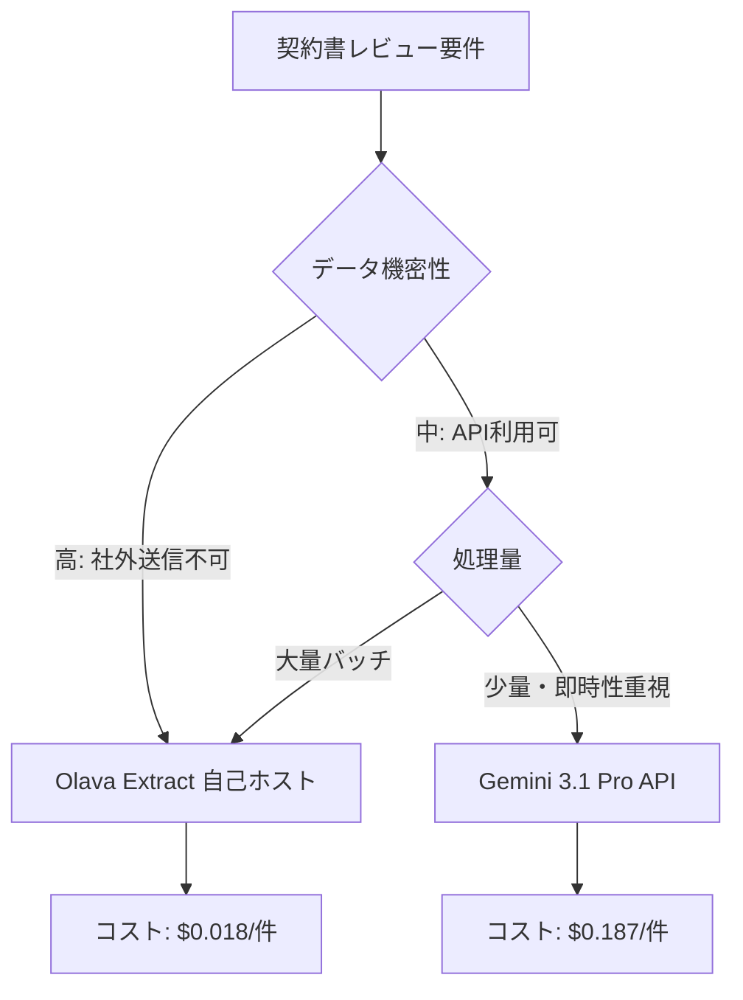

## 論文概要（Abstract）

本記事は [https://arxiv.org/abs/2605.05532](https://arxiv.org/abs/2605.05532) の解説記事です。

Lincoln らは、法的契約書からの構造化データ抽出タスクにおいて、ドメイン特化の小規模 Mixture of Experts（MoE）モデル「Olava Extract」が、5つの主要フロンティア LLM（Claude Opus 4.6、Claude Sonnet 4.6、Gemini 2.5 Pro、Gemini 3.1 Pro Preview、GPT-5.4）を上回る性能を達成したことを報告している。Olava Extract は macro F1 = 0.812、micro F1 = 0.842 を記録し、推論コストを 78-97% 削減した。この結果は、高性能な法務 AI に最大規模の外部ホストモデルが必ずしも必要ではないことを示唆している。

この記事は [Zenn記事: Vertex AI Gemini 3.1 Proの1Mコンテキストで契約書レビューの精度とコストを両立する](https://zenn.dev/0h_n0/articles/2d259d1c630072) の深掘りです。

## 情報源

- **arXiv ID**: 2605.05532
- **URL**: [https://arxiv.org/abs/2605.05532](https://arxiv.org/abs/2605.05532)
- **著者**: Nicole Lincoln, Nick Whitehouse, Jaron Mar, Rivindu Perera（Onit AI Labs）
- **発表年**: 2026年
- **分野**: cs.CL, cs.CY

## 背景と動機（Background & Motivation）

法務分野における契約書レビューは、従来は弁護士やリーガルプロセスアウトソーシング（LPO）が担ってきた高コスト業務である。近年、LLM の台頭により契約書の自動レビューが現実的になりつつあるが、フロンティアモデルの API 利用にはいくつかの課題がある。

第一に、コストの問題がある。エージェント型の AI システムではセッションあたり最大 159 倍のトークンを消費するとされ、導入初期の割引価格が終了した後の運用コストが懸念される。第二に、法務データの機密性から、外部 API への契約書送信にはデータガバナンス上のリスクが伴う。第三に、フロンティアモデルが生成するハルシネーション（根拠のない抽出結果）は、法務ワークフローにおいて下流のレビュー負荷を増大させる運用リスクとなる。

著者らの先行研究 "Better Call GPT"（Martin et al., 2024）では LLM が弁護士に匹敵する精度で契約書をレビューできることが示されたが、本論文ではさらに踏み込み、ドメイン特化の小規模モデルがフロンティアモデルを凌駕できるかを検証している。

## 主要な貢献（Key Contributions）

- **貢献1**: 法務ドメイン特化 MoE モデル（Olava Extract）がフロンティア LLM 5モデルを macro F1・micro F1 の両指標で上回ることを実証
- **貢献2**: 自己ホスト型の小規模モデルによる推論コスト 78-97% 削減を定量的に示し、エンタープライズ AI のスケーラビリティに関する新たな選択肢を提示
- **貢献3**: 法務タスクにおけるハルシネーション（未サポート抽出）の定量評価を行い、Olava Extract が最高精度（precision）を達成することを確認
- **貢献4**: SEC EDGAR の公開契約書を用いた 26 フィールド・508 アノテーションの評価ベンチマークを構築

## 技術的詳細（Technical Details）

### Olava Extract のアーキテクチャ

Olava Extract は、法務ドメインに特化した Mixture of Experts（MoE）モデルである。論文ではパラメータ数やエキスパート数の詳細は開示されていないが、以下の技術的特徴が報告されている。

**MoE の基本原理**: MoE アーキテクチャでは、複数のエキスパートネットワークの中からゲーティング関数が入力に応じてサブセットを選択的に活性化する。これにより、総パラメータ数に対して推論時のアクティブパラメータ数を抑制できる。

$$
y = \sum_{i=1}^{N} g_i(x) \cdot E_i(x)
$$

ここで、
- $x$: 入力トークン列
- $N$: エキスパートの総数
- $E_i(x)$: $i$ 番目のエキスパートネットワークの出力
- $g_i(x)$: ゲーティング関数による $i$ 番目エキスパートの重み（Top-k ルーティングでは上位 $k$ 個以外は 0）

著者らは Olava Extract のアクティブ推論フットプリントが「小規模な dense モデルに匹敵する」と記述しており、MoE による効率的な計算が法務タスクのコスト削減に寄与していることが示唆される。

### ファインチューニング手法

学習には Parameter-Efficient Fine-Tuning（PEFT）の一種である LoRA（Low-Rank Adaptation）が採用されている。

$$
W' = W + \Delta W = W + BA
$$

ここで、
- $W \in \mathbb{R}^{d \times d}$: 元の重み行列
- $B \in \mathbb{R}^{d \times r}$, $A \in \mathbb{R}^{r \times d}$: 低ランク行列（ランク $r = 32$）
- $\Delta W = BA$: 学習される差分

学習の詳細は以下の通りである。

- **学習データ**: 89,517 インスタンス、5,453 バリデーションラベル
- **ラベル生成**: フロンティア LLM による合成ラベル生成 + LLM-as-Judge パネルによるフィルタリング
- **学習設定**: bfloat16 精度、1 エポック、バリデーション損失でチェックポイント選択
- **ハードウェア**: NVIDIA H200 SXM GPU 2基

### 評価手法

評価データセットは SEC EDGAR から取得した 24 件の公開契約書で構成され、法務専門家が Label Studio 上で 508 フィールドインスタンスをアノテーションしている。アノテーション間の不一致はシニア弁護士が解決した。

**抽出対象**: 6カテゴリ・26フィールドが定義されている。

| カテゴリ | フィールド数 | 例 |
|---------|------------|-----|
| テキスト抽出概念 | 8 | Assignment, Confidentiality, Indemnity |
| Duration フィールド | 6 | Term, Payment Period, Renewal Term |
| Date フィールド | 3 | Effective Date, Executed Date, End Date |
| Currency フィールド | 2 | Annual Contract Value, Total Contract Value |
| Boolean/Categorical | 4 | Termination for Cause, Renewal Type |
| 短テキスト識別子 | 3 | Contract Name, Parties, Governing Law |

**出力形式**: 各フィールドについて「表示回答（display answer）」と「根拠となる契約書原文スパン（supporting verbatim contract span(s)）」の両方を出力する必要がある。

**マッチングルール**: データ型に応じた照合基準が適用される。

| カテゴリ | 照合ルール |
|---------|----------|
| テキスト抽出概念 | 参照スパンのオーバーラップ |
| Duration/Date/Currency | 表示回答の部分文字列含有 or 参照スパンオーバーラップ |
| Boolean/Categorical | 固定選択肢リストとの完全一致 |
| 短テキスト識別子 | 契約書から抽出された文字列との完全一致 |

**F1 スコアの集計方法**:

Micro F1 は全フィールドインスタンスをプールして計算する。

$$
\text{Micro F1} = \frac{2 \cdot P_{\text{micro}} \cdot R_{\text{micro}}}{P_{\text{micro}} + R_{\text{micro}}}
$$

ここで、$P_{\text{micro}} = \frac{\sum_i TP_i}{\sum_i (TP_i + FP_i)}$, $R_{\text{micro}} = \frac{\sum_i TP_i}{\sum_i (TP_i + FN_i)}$

Macro F1 は各フィールドの F1 を個別に計算してから平均する。

$$
\text{Macro F1} = \frac{1}{|C|} \sum_{c \in C} F1_c
$$

ここで、$C$ は 26 フィールドの集合、$F1_c$ はフィールド $c$ の F1 スコアである。Macro 平均は低頻度フィールドの性能を公平に反映するため、法務タスクのように各条項の見落としが重大な影響を持つ場面で重要な指標となる。

### アルゴリズム: 契約書構造化抽出パイプライン

```python
from dataclasses import dataclass


@dataclass
class ExtractionResult:
    """単一フィールドの抽出結果"""
    field_name: str
    display_answer: str
    supporting_spans: list[str]


def extract_contract_fields(
    contract_text: str,
    target_fields: list[str],
    model: "OlavaExtract",
) -> list[ExtractionResult]:
    """契約書全文から構造化フィールドを抽出する

    Args:
        contract_text: 契約書の全文テキスト
        target_fields: 抽出対象の26フィールド名リスト
        model: Olava Extract モデルインスタンス

    Returns:
        各フィールドの抽出結果リスト
    """
    # 契約書全文をチャンキングせず入力（最大 262,144 トークン）
    prompt = build_extraction_prompt(contract_text, target_fields)
    raw_output = model.generate(prompt, max_context_length=262_144)
    return [
        ExtractionResult(
            field_name=f,
            display_answer=parse_field_output(raw_output, f)["display_answer"],
            supporting_spans=parse_field_output(raw_output, f)["spans"],
        )
        for f in target_fields
    ]
```

## 実装のポイント（Implementation）

### 推論環境の構成

著者らは vLLM 0.19.1 を推論エンジンとして使用し、以下の設定で Olava Extract をデプロイしている。

- **Prefix caching**: 有効化（同一プロンプトプレフィックスの再計算を回避）
- **最大コンテキスト長**: 262,144 トークン（契約書全文をチャンキングせず処理可能）
- **LoRA アダプタ**: ランク 32 でロード
- **GPU**: NVIDIA H200 SXM 2基、bfloat16 精度（量子化なし）

### バッチ処理 vs 逐次処理のコスト差

バッチ処理では 24 件の契約書を 6分27秒で完了し、1件あたり $0.018 となる。一方、逐次処理では 1件あたり $0.147 となり、約 8 倍のコスト差が生じる。vLLM の continuous batching 機能を活用したバッチ処理が、コスト最適化の鍵となっている。

### 合成ラベルによる学習データ構築

学習データの生成には「合成ラベル + LLM-as-Judge フィルタリング」パイプラインが用いられている。フロンティア LLM で大量のラベルを生成し、複数の LLM による判定パネルで品質をフィルタリングすることで、人手アノテーションのコストを抑えつつ高品質な学習データ（89,517 インスタンス）を構築している。この手法は、専門家アノテーションが高コストなドメイン特化タスク全般に応用可能である。

## Production Deployment Guide

自己ホスト型法務 AI モデルを本番環境にデプロイする際の AWS 実装パターンを示す。Olava Extract は自己ホスト型 MoE モデルであり、GPU インスタンスを用いた推論サーバのデプロイが前提となる。

### AWS 実装パターン（コスト最適化重視）

**トラフィック量別の推奨構成**:

| 構成 | トラフィック | AWS サービス | 月額コスト概算 |
|------|------------|-------------|--------------|
| Small | ~100 req/日 | EC2 g6e.2xlarge (Spot) + S3 + DynamoDB | $150-300 |
| Medium | ~1,000 req/日 | ECS Fargate (GPU) + ALB + ElastiCache | $800-1,500 |
| Large | 10,000+ req/日 | EKS + Karpenter (p5.48xlarge Spot) + CloudFront | $3,000-6,000 |

**Small 構成の詳細**:
- EC2 g6e.2xlarge（L40S GPU 1基、48GB VRAM）で vLLM サーバを稼働
- Spot Instance 活用で On-Demand 比 最大 70% 削減
- S3 にモデルウェイトを保存、起動時にダウンロード
- DynamoDB On-Demand で抽出結果を永続化

**Large 構成の詳細**:
- EKS 上で vLLM を Pod として運用、Karpenter による Spot 優先オートスケーリング
- p5.48xlarge（H100 8基）で高スループットバッチ処理に対応
- Prefix caching 有効化により同一テンプレートのプロンプトで 30-50% のレイテンシ削減

**コスト削減テクニック**:
- Spot Instances 活用で最大 70-90% 削減
- Reserved Instances（1年コミット）で最大 40% 削減
- vLLM continuous batching でスループット最大化（論文では 24 件/6分27秒）
- Prefix caching で反復プロンプトの KV cache 再利用

**コスト試算の注意事項**: 上記は 2026年6月時点の AWS ap-northeast-1（東京）リージョン料金に基づく概算値である。実際のコストはトラフィックパターン、Spot 価格変動、バースト使用量により変動する。最新料金は [AWS Pricing Calculator](https://calculator.aws/) で確認を推奨する。

### Terraform インフラコード

**Small 構成（EC2 Spot + vLLM）** の主要リソース:

```hcl
# -- EC2 Spot Instance (GPU) --
resource "aws_spot_instance_request" "vllm" {
  ami                  = data.aws_ami.deep_learning.id
  instance_type        = "g6e.2xlarge" # L40S GPU, 48GB VRAM
  spot_price           = "1.50"
  wait_for_fulfillment = true
  iam_instance_profile = aws_iam_instance_profile.vllm.name
  subnet_id            = aws_subnet.private.id

  root_block_device {
    volume_size = 200
    volume_type = "gp3"
    encrypted   = true # KMS 暗号化
  }

  user_data = base64encode(<<-EOF
    #!/bin/bash
    aws s3 cp s3://legal-ai-models/olava-extract/ /opt/model/ --recursive
    python -m vllm.entrypoints.openai.api_server \
      --model /opt/model \
      --enable-prefix-caching \
      --max-model-len 262144 \
      --enable-lora \
      --lora-modules olava-lora=/opt/model/lora-r32 \
      --dtype bfloat16 \
      --port 8000
  EOF
  )

  tags = {
    Name        = "olava-vllm-server"
    Environment = "production"
    CostCenter  = "legal-ai"
  }
}

# -- DynamoDB（抽出結果保存、On-Demand でコスト最適化） --
resource "aws_dynamodb_table" "extractions" {
  name         = "contract-extractions"
  billing_mode = "PAY_PER_REQUEST"
  hash_key     = "contract_id"
  range_key    = "field_name"

  attribute { name = "contract_id"; type = "S" }
  attribute { name = "field_name"; type = "S" }

  server_side_encryption { enabled = true }
  tags = { CostCenter = "legal-ai" }
}
```

**Large 構成（EKS + Karpenter + Spot）** では、`terraform-aws-modules/eks/aws` v20 系モジュールで EKS クラスタを構築し、Karpenter NodePool で `p5.48xlarge`（H100 8基）の Spot Instance を優先的にプロビジョニングする。`consolidationPolicy = "WhenEmptyOrUnderutilized"` で未使用ノードを 30 秒後に自動回収し、AWS Budgets で月額 $6,000 の閾値アラートを設定する。

### 運用・監視設定

**CloudWatch Logs Insights クエリ（コスト異常検知）**:

```
fields @timestamp, @message
| filter @message like /tokens_used/
| stats sum(tokens_used) as total_tokens by bin(1h) as hour
| sort hour desc
| limit 24
```

**CloudWatch アラーム設定（Python）**:

```python
import boto3


def create_extraction_alarms(sns_topic_arn: str) -> None:
    """契約書抽出サービスの監視アラームを作成する

    Args:
        sns_topic_arn: アラート送信先の SNS トピック ARN
    """
    cw = boto3.client("cloudwatch", region_name="ap-northeast-1")

    # GPU メモリ使用率スパイク検知
    cw.put_metric_alarm(
        AlarmName="olava-gpu-memory-spike",
        MetricName="GPUMemoryUtilization",
        Namespace="CWAgent",
        Statistic="Maximum",
        Period=60,
        EvaluationPeriods=3,
        Threshold=95,
        ComparisonOperator="GreaterThanThreshold",
        AlarmActions=[sns_topic_arn],
        AlarmDescription="GPU メモリ使用率が95%超過",
    )
```

**X-Ray トレーシング設定**: `aws_xray_sdk.core` の `patch_all()` で boto3 を自動計装し、`xray_recorder.current_segment()` に `contract_id`、`field_count`、`model_version` をアノテーションとして記録する。

**Cost Explorer 自動レポート**: `ce.get_cost_and_usage()` で `CostCenter=legal-ai` タグのサービス別日次コストを取得し、$100/日超過時に SNS 通知を送信する。

### コスト最適化チェックリスト

**アーキテクチャ選択**:
- [ ] トラフィック量に基づく構成選択（Small: ~100 req/日 → EC2 Spot、Medium: ~1,000 req/日 → ECS、Large: 10,000+ req/日 → EKS）
- [ ] GPU インスタンスタイプの選定（L40S: 推論特化、H100: 高スループットバッチ）

**リソース最適化**:
- [ ] EC2 Spot Instances 優先（On-Demand 比 70-90% 削減）
- [ ] Reserved Instances / Savings Plans（1年コミットで最大 40% 削減）
- [ ] vLLM prefix caching 有効化（反復プロンプトで 30-50% レイテンシ削減）
- [ ] バッチ処理の活用（逐次処理比 8 倍のコスト効率）
- [ ] 夜間・休日の GPU インスタンス停止（EventBridge Scheduler）

**LLM コスト削減**:
- [ ] vLLM continuous batching でスループット最大化
- [ ] LoRA ランク最適化（論文設定: ランク 32）
- [ ] bfloat16 精度で推論（量子化なしで精度維持）

**監視・アラート**:
- [ ] AWS Budgets 設定（月額上限アラート）
- [ ] CloudWatch GPU 使用率・推論レイテンシアラーム
- [ ] Cost Anomaly Detection 有効化
- [ ] 日次コストレポート（Cost Explorer API + SNS）

**リソース管理**:
- [ ] CostCenter タグ戦略（legal-ai タグで全リソースを追跡）
- [ ] S3 モデルウェイトのライフサイクルポリシー（旧バージョンを Glacier 移行）
- [ ] 開発環境の夜間自動停止（EventBridge + Lambda）
- [ ] ECR イメージ・未使用 EBS の定期クリーンアップ

## 実験結果（Results）

### 全体性能比較

論文 Table 3 より、Micro F1 の結果を以下に示す。

| モデル | Precision | Recall | Micro F1 |
|-------|-----------|--------|----------|
| **Olava Extract** | **0.812** | 0.874 | **0.842** |
| Gemini 3.1 Pro Preview | 0.783 | 0.860 | 0.820 |
| Claude Opus 4.6 | 0.777 | 0.862 | 0.817 |
| Claude Sonnet 4.6 | 0.745 | 0.855 | 0.796 |
| Gemini 2.5 Pro | 0.693 | 0.898 | 0.783 |
| GPT-5.4 | 0.686 | 0.902 | 0.779 |

Olava Extract は Precision で全モデル中最高値（0.812）を記録している。一方、Recall では GPT-5.4（0.902）や Gemini 2.5 Pro（0.898）が上回っている。法務タスクでは、存在しない条項を誤って抽出する False Positive（低 Precision）が運用リスクとなるため、Precision の優位性は実務上の意義が大きい。

### コスト比較

論文の報告に基づく 1 件あたりの推論コストは以下の通りである。

| モデル | コスト/件 | Olava バッチ比 |
|-------|----------|--------------|
| Olava Extract（バッチ） | $0.018 | 1.0x |
| Olava Extract（逐次） | $0.147 | 8.2x |
| Gemini 2.5 Pro | $0.149 | 8.3x |
| Gemini 3.1 Pro Preview | $0.187 | 10.4x |
| Claude Opus 4.6 | $0.258 | 14.3x |
| GPT-5.4 | $0.262 | 14.6x |
| Claude Sonnet 4.6 | $0.456 | 25.3x |

Olava Extract のバッチ処理コストは最も高価な Claude Sonnet 4.6 と比較して 97% 削減、最も安価なフロンティアモデルである Gemini 2.5 Pro と比較しても 88% 削減となっている。

### カテゴリ別の性能差

著者らは Currency フィールド（Annual Contract Value, Total Contract Value）で全モデルが苦戦していることを報告している。Olava Extract は Annual Contract Value で F1 = 0.333 にとどまっている。この低性能は「更新条件が複数文にまたがって記述される」「支払い頻度が非公式に表現される」といった契約書固有のあいまい性に起因すると著者らは分析している。

## 実運用への応用（Practical Applications）

### Zenn 記事との関連

関連する [Zenn記事](https://zenn.dev/0h_n0/articles/2d259d1c630072) では Vertex AI Gemini 3.1 Pro の 1M コンテキストウィンドウを活用した契約書レビューが解説されている。本論文の結果は、この Gemini ベースのアプローチに対して補完的な知見を提供する。

**使い分けの指針**:



- **データ機密性が高い場合**: Olava Extract の自己ホスト型が適切。契約書データが社外に出ない
- **少量・即時処理**: Gemini 3.1 Pro API が初期コスト不要で導入しやすい
- **大量バッチ処理**: Olava Extract のバッチ処理（$0.018/件）がコスト面で有利

### ハイブリッド戦略

実務では、Olava Extract の高 Precision と GPT-5.4 の高 Recall を組み合わせるハイブリッド戦略も検討に値する。まず Recall の高いモデルで候補を広く抽出し、次に Precision の高いモデルでフィルタリングすることで、見落としと誤抽出の両方を抑制できる可能性がある。ただし、これは筆者の解釈であり、論文では直接提案されていない。

## 関連研究（Related Work）

- **CUAD**（Hendrycks et al., 2021）: 510 件の契約書・41 条項タイプの専門家アノテーションデータセット。法務 NLP の標準ベンチマークとして広く利用されている。本論文は CUAD とは異なる SEC EDGAR ベースのデータセットを構築した点で差別化される
- **ContractNLI**（Koreeda & Manning, 2021）: 文書レベルの契約書推論タスク。自然言語推論（NLI）フレームワークを契約書理解に適用
- **Better Call GPT**（Martin et al., 2024）: LLM と弁護士の契約書レビュー性能を比較し、LLM がコスト 99.97% 削減で人間に匹敵する精度を達成すると報告。本論文の著者らによる先行研究
- **Legal-BERT**（Chalkidis et al., 2020）: BERT を法務コーパスで事前学習した初期のドメイン適応研究
- **Better Bill GPT**（Whitehouse et al., 2025）: 請求書レビューへの LLM 適用を評価した研究

## まとめと今後の展望

本論文は、法務ドメイン特化の小規模 MoE モデルがフロンティア LLM を性能・コスト・Precision の全面で上回れることを実証した。エンタープライズ AI において「大きなモデルほど良い」という仮定に対する重要な反例を提示している。

著者らは今後の課題として、(1) 統計的有意性検定のための評価セット拡大、(2) Currency フィールド等の弱点カテゴリの改善、(3) 修正契約・作業指示書・別紙等への適用範囲拡大を挙げている。

法務 AI の導入において、フロンティアモデルの API 利用一択ではなく、ドメイン特化モデルの自己ホスト運用が性能・コスト・データガバナンスの観点で有力な選択肢となる。

## 参考文献

- **arXiv**: [https://arxiv.org/abs/2605.05532](https://arxiv.org/abs/2605.05532)
- **Related Zenn article**: [https://zenn.dev/0h_n0/articles/2d259d1c630072](https://zenn.dev/0h_n0/articles/2d259d1c630072)
- **CUAD Dataset**: [https://arxiv.org/abs/2103.06268](https://arxiv.org/abs/2103.06268)
- **Better Call GPT**: [https://arxiv.org/abs/2401.16212](https://arxiv.org/abs/2401.16212)
