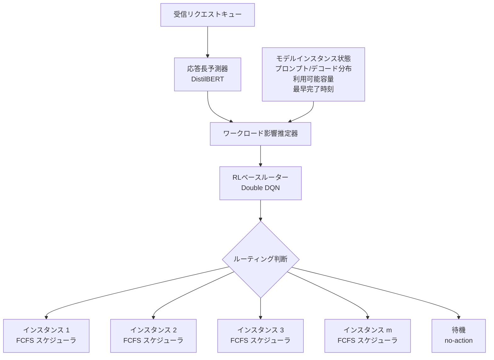

本記事は [Intelligent Router for LLM Workloads: Improving Performance Through Workload-Aware Load Balancing](https://arxiv.org/abs/2408.13510) の解説記事です。LLM推論における負荷分散の課題を、ワークロード特性を考慮した強化学習ベースのルーティングで解決するアプローチを詳しく解説します。

## 論文概要

大規模言語モデル（LLM）の推論ワークロードには、prefill（プロンプト処理）とdecode（トークン生成）という計算特性の異なる2つのフェーズが存在する。しかし、既存のスケジューリングアルゴリズムはLLMワークロードをモノリシックなジョブとして扱い、この2フェーズの特性差を考慮していない。本論文では、まずLLM推論レイテンシに影響を与える要因を特性分析し、インスタンスレベルのスケジューラ最適化よりも、インスタンス間のリクエスト負荷分散の改善がエンドツーエンドレイテンシに大きく寄与することを実証している。この知見に基づき、ヒューリスティック誘導型強化学習ベースのIntelligent Routerを提案し、公開データセットで11%以上、実運用トレースで7.8%のレイテンシ改善を報告している。

## 情報源

| 項目 | 内容 |
|------|------|
| **arXiv ID** | [2408.13510](https://arxiv.org/abs/2408.13510) |
| **著者** | Kunal Jain, Anjaly Parayil, Ankur Mallick, Esha Choukse, Xiaoting Qin, Jue Zhang, Inigo Goiri, Rujia Wang, Chetan Bansal, Victor Ruhle, Anoop Kulkarni, Steve Kofsky, Saravan Rajmohan |
| **所属** | Microsoft（Cloud Provider Xとして匿名化） |
| **初版** | 2024年8月 |
| **改訂版** | 2025年1月（v2） |
| **分野** | cs.DC（分散・並列・クラスタコンピューティング） |

## 背景と動機

LLM推論は2つの根本的に異なる計算フェーズで構成される。**prefillフェーズ**は入力トークンを並列処理し、各層でself-attention計算を行うため**計算バウンド（compute bound）**である。一方、**decodeフェーズ**は前トークンのKVキャッシュを参照しながら出力トークンを逐次生成するため**メモリバウンド（memory bound）**となる。

著者らの実験によると、バッチ実行時間はprefillトークン数に対して線形に増加し（勾配: $$3.2 \times 10^{-4}$$秒/トークン、Llama-2-7b on V100の場合）、decode中のトークン数増加に対する実行時間の増加は遥かに緩やか（勾配: $$3.3 \times 10^{-5}$$秒/トークン）であると報告している。

既存手法の問題点は以下の通りである:

- **インスタンスレベルの最適化に偏重**: vLLM（ORCA）やSarathiなど、単一インスタンス内のバッチスケジューリングを改善する研究は多いが、複数インスタンス間のリクエスト分配は考慮されていない
- **モノリシックなジョブ扱い**: Round Robinやdecode balancerなどの既存ルーティングは、リクエストのprefill/decode特性を区別しない
- **ワークロード混在の影響を無視**: 異なる特性のリクエストを同一インスタンスで処理すると、prefillフェーズの割込みによりdecodeフェーズの実行時間にスパイクが発生する

著者らは8リクエストを2インスタンスに分配する全探索実験を行い、最適な割当（27.03秒）とランダム割当（29.81秒）の間に約10%の差があることを示し、ルーティング最適化の余地の大きさを定量的に裏付けている。

## 主要な貢献

1. **ワークロード混在の影響分析**: ルーティング戦略とインスタンスレベルのスケジューリングの相互作用を体系的に分析し、ルーティングの改善がインスタンスレベルの最適化よりもE2Eレイテンシに大きく寄与することを実証した（論文Table 2より）
2. **ワークロードミキシング影響推定器**: リクエストのprefill/decode特性に基づく4カテゴリ分類（LL/LH/HL/HH）と、異なる特性のリクエストを混在させた際のレイテンシ影響を定式化した新規推定手法を提案した
3. **ヒューリスティック誘導型RLルーター**: 応答長予測器とワークロード影響推定器を組み込んだ強化学習フレームワークにより、公開データセットで11.43%、実運用トレースで7.84%のE2Eレイテンシ改善を達成した

## 技術的詳細

### Intelligent Routerのアーキテクチャ

Intelligent Routerは3つの主要コンポーネントで構成される。



重要な設計方針として、ルーターはインスタンスレベルのスケジューラ（FCFS、bin-packing等）に依存しない。これにより、prefill chunkingやprefix cachingなどのインスタンスレベル最適化と直交的に改善効果を発揮できる。

### 応答長予測器の設計

応答長予測器は、受信リクエストのdecodeフェーズの長さ（出力トークン数）をバケット分類問題として予測する。

**モデル**: DistilBERTをfine-tune

**バケット設計**: 均等サイズではなく、推定完了時間に基づく不均等バケットを使用する。Llama-2-7b on V100の場合、平均500トークン/秒のデコード速度に基づき、以下のバケットを定義する:
- 0-250トークン（0-0.5秒）
- 250-1000トークン（0.5-2秒）
- 1000-4000トークン（2-8秒）
- 4000トークン以上

**タスクヒントの付与**: 入力プロンプトの末尾に「This is a \<task\> task」というヒントを追加することで、精度を大幅に改善している。タスク種別自体もDistilBERTで93.79%の精度で予測可能であると報告されている。

**精度**: 先行研究S3の手法（Jin et al., 2023）をそのまま適用した場合の5.5%に対し、タスクヒント追加により79.15%の精度を達成している（論文Table 1より）。データセット別では、Entity Recognition（WNUT）で95.06%、Translation（Books）で93.10%と高精度である一方、In-context QnA（SQuAD）では65.27%にとどまる。

### ワークロードミキシングの定式化

リクエストを処理時間に基づき4カテゴリに分類する:
- **LL**: light prompt - light decode
- **LH**: light prompt - heavy decode
- **HL**: heavy prompt - light decode
- **HH**: heavy prompt - heavy decode

ここで、prefillフェーズの処理時間が0.5秒以上をheavy prompt、decodeフェーズの処理時間が5秒以上をheavy decodeと定義する。この閾値はモデル・ハードウェア組合せに依存するハイパーパラメータである。

モデルインスタンス $$m$$ に $$n$$ 個のリクエストが処理中で、$$j$$ 番目の既存リクエストのprefill/decodeトークン数をそれぞれ $$p_j^m$$, $$d_j^m$$ とする。新規リクエスト（prefillトークン数 $$p_i$$、decodeトークン数 $$d_i$$）をこのインスタンスに追加した場合の影響を以下のように定式化する。

**prefillフェーズへの影響**（新規リクエストの処理時間 $$T_{p_i}^m$$ とそのペナルティ $$r_{p_i}^m$$）:

$$
T_{p_i}^m = \text{grad}_1 \times \left( p_i^2 + \sum_{j=1}^{n} p_j^m + d_j^m \right)
$$

$$
r_{p_i}^m = \begin{cases} 1 & \text{if } T_{p_i}^m \leq \epsilon \\ \frac{1}{T_{p_i}^m} - \epsilon & \text{otherwise} \end{cases}
$$

ここで $$\epsilon$$ はレイテンシ閾値パラメータ、$$\text{grad}_1$$ はprefillの時間勾配（V100での実測値 $$3.2 \times 10^{-4}$$）である。

**decodeフェーズへの影響**（既存リクエストへのペナルティ $$r_d^m$$）:

$$
r_d^m = -\text{grad}_2 \times \sum_{j=1}^{n} \left( p_j^m + d_j^m + p_i + d_i \right)
$$

ここで $$\text{grad}_2$$ はdecodeの時間勾配（V100での実測値 $$3.3 \times 10^{-5}$$）である。

**混合ペナルティの統合**:

$$
r_{\text{mixing}}(s_t, s_{t+1}) = \alpha \cdot r_{p_i}^m + (1 - \alpha) \cdot r_d^m
$$

$$\alpha \in (0, 1)$$ はprefillとdecodeへの優先度バランスパラメータであり、論文の実験では $$\alpha = 0.5$$ が使用されている。

### 強化学習ベースのルーティングアルゴリズム

リクエストルーティング問題を離散時間マルコフ決定過程（MDP）$$M = (S, A, P, r, \gamma)$$ として定式化する。

**状態空間** $$S$$（27次元、4インスタンスの場合）:
- $$wq_t$$: 時刻 $$t$$ でのキュー内リクエスト数
- $$p_t, d_t$$: 次のリクエストのprefillトークン数と推定decodeバケット
- $$P_t \in \mathbb{R}^{m \times n_p}$$, $$D_t \in \mathbb{R}^{m \times n_d}$$: 各インスタンスのprefill/decode分布行列
- $$C_t \in \mathbb{R}^m$$: 各インスタンスの利用可能容量
- $$\hat{T}_{c_t}$$: 各インスタンスの最早リクエスト完了推定時刻

**行動空間** $$A$$: $$a \in \{0, 1, \ldots, m\}$$。$$m$$ 個のインスタンスへのルーティング、またはno-action（待機）。

**報酬設計**（Workload Guided RL）:

$$
r_t = -\sum_{j \in J} \frac{1}{\hat{T}_j} (1 - f_j^t) + \sum_{j=1}^{m} \sum_i r_w \times w_{it}^m - (\gamma - \tilde{\gamma}_k) \cdot h(s_t, s_{t+1})
$$

ここで:
- $$f_j^t = o_j^t / \hat{d}_j^t$$: リクエスト $$j$$ の完了割合
- $$r_w$$: リクエスト完了報酬（実験では60に設定）
- $$h(s_t, s_{t+1}) = r_{\text{mixing}}(s_t, s_{t+1}) - \max_{l=1,...,m} r_{\text{mixing}}(s_t, s_l^{t+1})$$: 最小混合影響インスタンスとの差分

**ヒューリスティック誘導メカニズム**: Cheng et al.（2021）のフレームワークに基づき、誘導割引率 $$\tilde{\gamma}_k = (1 - e^{-\beta_d k}) \gamma$$ を導入する。$$\beta_d = 0.5$$ の指数減衰により、訓練初期はヒューリスティック（ワークロード混合ペナルティ）の影響が大きく、エピソード数の増加とともに元のMDPへ収束する。

**ニューラルネットワーク**: Double DQNを採用。層構成は (27, 64), (64, 64), (64, 5) で、ReLU活性化関数を使用する。バッチサイズ512で訓練する。

## 実装のポイント

Intelligent Routerを実装する際の重要な考慮点を整理する。

**ルーターのオーバーヘッド**: 各ルーティング判断に対し、(1) DistilBERTによる出力長バケット推論（GPUで0.01秒/batch64、CPUで0.8秒/batch64）、(2) DQNによるルーティング推論（ミリ秒未満）の2ステップが必要となる。キュー内リクエスト数が多い場合、長さ予測とルーティング推論を並列化できる。

**no-action（待機）の活用**: ルーターは即座にルーティングせず戦略的に待機する選択肢を持つ。Workload Guided RLでは平均ルーター待機時間2.05秒で最適なバランスを実現している。Baseline RLの0.59秒では早すぎてインスタンスでのプリエンプションが発生し、Workload Aware RLの4.41秒では過度な待機となる。

**プロファイリングの必要性**: $$\text{grad}_1$$ と $$\text{grad}_2$$ はモデル・ハードウェア組合せごとに実測が必要である。V100とA100では到達リクエストレートを20 RPSから80 RPSに変更する必要があったことが報告されている。

以下にワークロード混合ペナルティ計算の擬似コードを示す。

```python
import numpy as np


def compute_mixing_penalty(
    prompt_tokens: int,
    decode_bucket: int,
    instance_prompt_total: float,
    instance_decode_total: float,
    grad1: float = 3.2e-4,
    grad2: float = 3.3e-5,
    alpha: float = 0.5,
    epsilon: float = 0.5,
) -> float:
    """ワークロード混合ペナルティを計算する"""
    total_existing = instance_prompt_total + instance_decode_total

    # prefillフェーズへの影響
    t_prefill = grad1 * (prompt_tokens ** 2 + total_existing)
    r_prefill = 1.0 if t_prefill <= epsilon else 1.0 / t_prefill - epsilon

    # decodeフェーズへの影響
    r_decode = -grad2 * (total_existing + prompt_tokens + decode_bucket)

    return alpha * r_prefill + (1.0 - alpha) * r_decode


def route_request(state: np.ndarray, dqn_model, n_instances: int) -> int | None:
    """DQNに基づきルーティング先を決定する

    Returns:
        インスタンスインデックス。Noneはno-action（待機）。
    """
    q_values = dqn_model.predict(state)
    action = int(np.argmax(q_values))
    return None if action == n_instances else action
```

## Production Deployment Guide

本論文のIntelligent Routerコンセプトをプロダクション環境に適用する際の実装パターンを検討する。論文はLlama-2-7b（V100）およびLlama-3.1-8B（A100）での実験結果を報告しているが、アーキテクチャ自体はモデル・ハードウェアに非依存である。

### AWS実装パターン

| 構成 | Small | Medium | Large |
|------|-------|--------|-------|
| **想定規模** | 4インスタンス, <100 RPS | 8-16インスタンス, 100-500 RPS | 32+インスタンス, 500+ RPS |
| **ルーターコンピュート** | Lambda + API Gateway | ECS Fargate | EKS + Karpenter |
| **DQNモデルホスティング** | Lambda (CPU推論) | SageMaker Endpoint | EKS上のTriton Server |
| **応答長予測器** | Lambda (CPU, 0.8s/batch) | SageMaker (GPU, 0.01s/batch) | EKS上のTriton (GPU) |
| **LLMインスタンス** | EC2 g5.xlarge x4 | EC2 p4d.24xlarge x8 | EKS + p5.48xlarge |
| **状態管理** | DynamoDB | ElastiCache (Redis) | Redis Cluster on EKS |
| **月額概算** | $3,000-5,000 | $30,000-60,000 | $200,000+ |

### Terraform実装例（Small構成）

Small構成では、Lambda関数でルーティングロジックを実行し、DynamoDBでインスタンス状態を管理する。

```hcl
resource "aws_lambda_function" "intelligent_router" {
  function_name = "llm-intelligent-router"
  runtime       = "python3.12"
  handler       = "router.handler"
  memory_size   = 1024
  timeout       = 30

  environment {
    variables = {
      INSTANCE_TABLE = aws_dynamodb_table.instance_state.name
      GRAD1          = "3.2e-4"
      GRAD2          = "3.3e-5"
      ALPHA          = "0.5"
    }
  }
}

resource "aws_dynamodb_table" "instance_state" {
  name         = "llm-instance-state"
  billing_mode = "PAY_PER_REQUEST"
  hash_key     = "instance_id"

  attribute {
    name = "instance_id"
    type = "S"
  }
}
```

Large構成ではEKS + Karpenterを使用し、GPU NodePoolのオートスケーリングでインスタンス数を動的に調整する。Karpenter NodePoolでp5.48xlarge/p4d.24xlargeをon-demand/spotで混在運用し、`consolidationPolicy: WhenEmpty`で不要ノードを自動回収する構成が推奨される。

### 運用・監視設定

ルーターの運用においては、以下のメトリクスをCloudWatchダッシュボードで監視する:

- **E2Eレイテンシ**: p50/p90/p99パーセンタイル（ルーティング遅延を含むリクエスト全体）
- **ルーターキュー深度**: no-action待機中のリクエスト数（過度な蓄積は待機時間上限の調整が必要）
- **GPU使用率**: 各インスタンスの計算リソース消費（不均衡はルーティング品質の問題を示唆）
- **リクエストプリエンプション数**: メモリ不足による中断（本論文の主要な最適化対象）
- **応答長予測精度**: 予測バケットと実際の出力長の一致率（concept driftの検出）

X-Rayトレーシングでリクエストのルーティング判断からインスタンスでの処理完了までを追跡し、ボトルネックを特定する。

### コスト最適化チェックリスト

**ルーター層**
- [ ] DQN推論をCPUで実行可能か検証する（論文報告: ミリ秒未満）
- [ ] 応答長予測器のGPU/CPUトレードオフを評価する（GPU: 0.01秒, CPU: 0.8秒/batch64）
- [ ] ルーターのno-action待機時間上限を設定し無限待機を防止する
- [ ] バッチ推論でDistilBERT呼び出しを効率化する

**推論インスタンス層**
- [ ] Spot Instanceの活用可否を検証する（decodeフェーズ中断リスク評価）
- [ ] Savings Plans / Reserved Instancesでベースロードをカバーする
- [ ] prefill chunkingの有効化（論文: Intelligent Router併用で11.06%改善を維持）
- [ ] heavy/light閾値をワークロードに合わせて調整する
- [ ] GPUメモリ使用率に基づくオートスケーリングポリシーを設定する

**データパイプライン・可用性**
- [ ] ルーティング判断ログの収集とDQN再訓練パイプラインの構築
- [ ] concept drift検出アラートの設定
- [ ] grad1/grad2プロファイリングデータの定期更新スケジュール
- [ ] ルーター障害時のRound Robinフォールバック実装
- [ ] マルチAZ配置でルーターの単一障害点を排除

**パフォーマンスチューニング**
- [ ] アクション間隔をワークロードに合わせて調整（論文: 0.02秒）
- [ ] $$\alpha$$ をワークロード特性に合わせてチューニング（prefill支配的なら $$\alpha > 0.5$$）
- [ ] $$r_w$$（完了報酬）と $$\beta_d$$（減衰率）をSLO要件に合わせて調整
- [ ] DQNの層サイズをインスタンス数に合わせてスケーリング
- [ ] explore/exploit切替エピソード数を調整（論文: 20エピソード後）

## 実験結果

### 主要結果（公開データセット、4インスタンス、Llama-2-7b on V100）

2000リクエストを20 RPSで4インスタンスに分配し、20エピソードの平均を報告している（論文Figure 1bおよびSection 6.1より）。

| ルーティング手法 | E2Eレイテンシ改善率（vs RR） | 平均ルーター待機時間 |
|---|---|---|
| Round Robin（ベースライン） | - | - |
| Join Shortest Queue | 0.46% | - |
| Maximum Capacity Usage | 2.60% | - |
| Min-Min Algorithm | 1.50% | - |
| Baseline RL | 4.35%（7.53秒短縮） | 0.59秒 |
| Workload Aware RL | 7.79%（13.50秒短縮） | 4.41秒 |
| **Workload Guided RL** | **11.43%（19.18秒短縮）** | **2.05秒** |

### ハードウェア・モデル汎化性（Llama-3.1-8B on A100）

| 手法 | prefill chunking無し | prefill chunking有り |
|---|---|---|
| Round Robin | ベースライン | ベースライン |
| Baseline RL | 3.15%改善 | 3.11%改善 |
| Workload Aware RL | 6.74%改善 | 6.96%改善 |
| Workload Guided RL | 10.71%改善 | 11.06%改善 |

（論文Table 3より）

### スケーラビリティ（8インスタンス、4000リクエスト、40 RPS）

Baseline RL 5.84%、Workload Aware RL 6.64%、**Workload Guided RL 11.62%**の改善が報告されている（論文Appendix A.11より）。インスタンス数が増加しても改善率が維持されることが確認されている。

### 実運用トレース（Cloud Provider X、4000リクエスト、80 RPS）

実運用トレースでは平均prefill長5526.64トークン、平均decode長112.69トークンとprefillが支配的な分布を示す。Round Robin（1005.31秒）に対し、Workload Guided RLは**7.84%改善**（926.49秒）を達成している。改善率が公開データセットより低い要因として、decode長が短いためプリエンプションの発生頻度が低いことが挙げられている（論文Appendix A.12より）。

## 実運用への応用

本論文の知見は、関連Zenn記事「[Azure OpenAI負荷分散の運用設計：PTUサイジングから監視・自動スケーリングまで](https://zenn.dev/0h_n0/articles/05003ecf02b6dc)」で扱うAzure API Management（APIM）ベースの負荷分散と直接的に関連する。

Azure APIMのビルトインロードバランサはRound RobinやWeighted Round Robinを提供するが、本論文が示すようにこれらの静的ルーティングはLLMワークロードにおいて最適ではない。特にPTU（Provisioned Throughput Units）で複数のAzure OpenAIインスタンスを運用する場合、以下の適用可能性が考えられる:

- **APIMポリシーでのワークロード分類**: リクエストヘッダーやプロンプト長に基づくlight/heavy分類を実装し、APIMのchoose/whenポリシーでルーティング先を分岐する
- **Application Insightsとの連携**: 各バックエンドインスタンスのprefill/decode分布やキュー状態をメトリクスとして収集し、ルーティング判断に活用する
- **PTUサイジングへの示唆**: 本論文の全探索実験（最適割当と平均割当の10%差）は、PTU容量の余裕を見積もる際の定量的根拠となりうる

ただし、本論文のルーターはミリ秒単位の判断を行うのに対し、APIMポリシーでの複雑なルーティングロジックはレイテンシオーバーヘッドとなりうる点には注意が必要である。

## 関連研究

- **DistServe / Splitwise** (Patel et al., 2023; Zhong et al., 2024): prefillとdecodeを異なるGPU/インスタンスに分離するアプローチ。本論文は同一インスタンスでの混在を前提としつつ影響を最小化する
- **RouteLLM** (Ong et al., 2024): 異なるモデル間（GPT-4とMixtral等）でのルーティング。本論文は同一モデルの複数インスタンス間のルーティングを対象とし相補的
- **S3** (Jin et al., 2023): DistilBERTによる出力長予測でスループットを最適化。本論文はタスクヒント追加とインスタンス間ルーティングへ拡張
- **Sarathi** (Agrawal et al., 2023): prefill chunkingによるdecodeフェーズの割込み軽減。本論文のルーターと組み合わせて追加改善が可能（Table 3: chunking有りでも11.06%改善）

## まとめと今後の展望

本論文は、LLM推論の負荷分散において「インスタンスレベルの最適化には限界があり、インスタンス間のルーティング最適化がより大きなレイテンシ改善をもたらす」という重要な知見を実証的に示している。提案手法であるIntelligent Routerは、ワークロード特性を考慮した強化学習ベースのルーティングにより、異なるモデル・ハードウェア構成で一貫した改善を達成している。

一方で、著者ら自身が認めている通り、RLベースのアプローチはヒューリスティックと比較して追加のオーバーヘッドを伴う。また、同種（homogeneous）インスタンスのみを対象としており、異種混在環境への拡張は今後の課題である。プロファイリングデータ（grad1, grad2）のモデル・ハードウェア依存性も、新しい構成への展開時にコストとなりうる。

本論文のフレームワークはインスタンスレベルスケジューラのベンチマーク基準としても活用可能であり、推論基盤の設計において理論的な最適性の指標を提供する点で実用的な価値がある。

## 参考文献

1. Jain, K., Parayil, A., Mallick, A., et al. "Intelligent Router for LLM Workloads: Improving Performance Through Workload-Aware Load Balancing." arXiv:2408.13510, 2024. [https://arxiv.org/abs/2408.13510](https://arxiv.org/abs/2408.13510)
2. 関連Zenn記事: "Azure OpenAI負荷分散の運用設計：PTUサイジングから監視・自動スケーリングまで" [https://zenn.dev/0h_n0/articles/05003ecf02b6dc](https://zenn.dev/0h_n0/articles/05003ecf02b6dc)
3. Jin, Y., Wu, C.-F., Brooks, D., and Wei, G.-Y. "S3: Increasing GPU Utilization during Generative Inference for Higher Throughput." NeurIPS, 2023.
4. Cheng, C.-A., Kolobov, A., and Swaminathan, A. "Heuristic-guided Reinforcement Learning." NeurIPS, 2021.
5. Patel, P., Choukse, E., et al. "Splitwise: Efficient Generative LLM Inference Using Phase Splitting." 2023.
6. Agrawal, A., et al. "Sarathi: Efficient LLM Inference by Piggybacking Decodes with Chunked Prefills." 2023.
