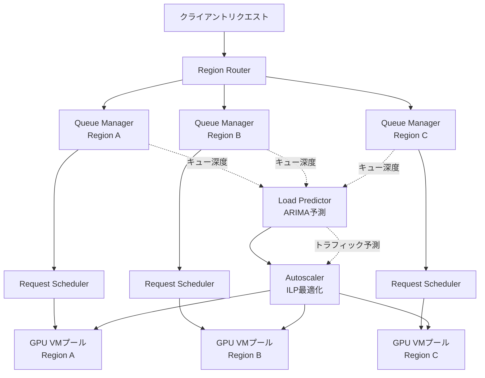
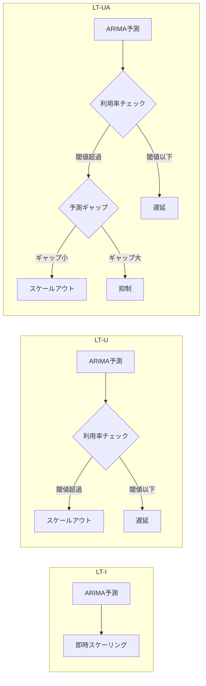

本記事は [SageServe論文](https://arxiv.org/abs/2502.14617) の解説記事です。なお、本記事は論文の内容を解説するものであり、筆者が独自に実験を行ったものではありません。

## 論文概要

SageServeは、Microsoft Office 365における1日あたり1,000万件のLLM推論リクエストの分析に基づき設計された、クラウドデータセンター向けLLMサービングフレームワークである。短期的なリクエストルーティングと長期的なGPU VMスケーリング・モデル配置を統合し、ARIMA時系列予測とILP（整数線形計画法）最適化を組み合わせることで、現行ベースラインと比較してGPU時間を最大25%削減し、非効率なオートスケーリングに起因するGPU時間の浪費を80%低減する。著者らは月間最大250万ドルのコスト削減ポテンシャルがあると報告している。

## 情報源

- **arXiv ID**: [2502.14617](https://arxiv.org/abs/2502.14617)
- **タイトル**: SageServe: Optimizing LLM Serving on Cloud Data Centers with Forecast Aware Auto-Scaling
- **著者**: Shashwat Jaiswal, Kunal Jain, Yogesh Simmhan, Anjaly Parayil, Ankur Mallick, Rujia Wang, Renee St. Amant, Chetan Bansal, Victor Rühle, Anoop Kulkarni, Steve Kofsky, Saravan Rajmohan
- **掲載**: Proceedings of the ACM on Measurement and Analysis of Computing Systems, Vol. 9, No. 3 (SIGMETRICS 2025)
- **コード**: [https://github.com/shashwatj07/SageServe](https://github.com/shashwatj07/SageServe)

## 背景と動機

LLMの推論サービングは、従来のWebサービスとは根本的に異なる課題を抱えている。GPT-4クラスのモデルは数十GBのGPUメモリを必要とし、VMの起動からモデルロードまでのコールドスタートに数分を要する。さらに、エンタープライズ環境ではワークロードが多様であり、インタラクティブなチャット応答（数秒以内のレイテンシ要求）からバッチ処理（24時間以内の完了で十分）まで、SLA要件が大きく異なる。

著者らは、既存のLLMサービング基盤における3つの主要課題を指摘している。第一に、GPU VMプールがモデルやワークロードごとにサイロ化されており、リソースの共有が困難であること。第二に、リアクティブなオートスケーリング（利用率閾値ベース）ではLLMの急激なトラフィック変動に追従できず、コールドスタートのペナルティが大きいこと。第三に、リージョン間でのリクエスト分散が最適化されておらず、特定リージョンに負荷が集中すること。これらの課題に対し、SageServeは予測型の統合フレームワークとして設計された。

## 主要な貢献

著者らは以下の3つの貢献を主張している。

1. **統合フレームワークの設計**: 短期リクエストルーティング（秒単位）、長期GPU VMスケーリング（分〜時間単位）、モデル配置を統合的に最適化するマルチタイムスケール制御フレームワーク。ILP最適化とARIMA予測を組み合わせ、SLAを維持しながらコスト最小化を実現する。

2. **大規模ワークロード分析**: Microsoft Office 365の実トラフィック（1日1,000万リクエスト）を分析し、ワークロードの時系列特性（周期性、バースト性、リージョン間偏り）を明らかにした。この分析に基づきワークロードを3層（IW-Fast、IW-Normal、NIW）に分類し、SLA要件に応じた差別化サービングを実現している。

3. **公開データセットとコード**: 再現可能性のため、シミュレータおよびコードをGitHubで公開している。

## 技術的詳細

### SageServeアーキテクチャ

SageServeは5つのコアコンポーネントから構成される。



各コンポーネントの役割は以下の通りである。

- **Region Router**: リクエストをリージョン間で分散する。各リージョンのGPUメモリ使用率が70%閾値を超えた場合、他リージョンへルーティングする。
- **Queue Manager**: リージョン内でリクエストを受け付け、ワークロード層（IW-Fast/IW-Normal/NIW）に分類してキューイングする。
- **Load Predictor**: ARIMAモデルによる時系列予測を実行し、将来のトラフィック量を推定する。
- **Autoscaler**: Load Predictorの予測値に基づき、ILP最適化でGPU VMの取得・解放とモデル配置を決定する。
- **Request Scheduler**: GPU VMプール内で個々のリクエストを適切なVMに割り当てる。

### Multi-tier Scheduling

著者らは、Office 365のワークロード分析に基づき、リクエストを3つの層に分類している。

| 層 | SLA要件 | 特性 | 例 |
|---|---|---|---|
| **IW-Fast** | TTFT < 1秒 | インタラクティブ、低レイテンシ必須 | チャット応答、リアルタイム補完 |
| **IW-Normal** | TTFT < 1分 | インタラクティブだが若干の遅延許容 | 文書要約、メール下書き |
| **NIW** | 24時間以内 | 非インタラクティブ、バッチ処理可能 | 大量文書分析、レポート生成 |

この3層分類により、IW-FastにはGPUリソースを優先的に割り当て、NIWはGPUの空き時間を活用するといった差別化が可能になる。著者らは、NIWリクエストをバッファとして活用することで、GPUの稼働率を維持しつつピーク時のIW-Fastリクエストにリソースを譲る戦略が有効であると報告している。

### ARIMA予測モデル

Load Predictorはトラフィック予測にARIMA（自己回帰和分移動平均）モデルを採用している。著者らが報告する主要な特性は以下の通りである。

- **予測精度**: MAPE（平均絶対パーセント誤差）3%未満
- **周期性スコア**: 時系列の周期性を定量化し、予測可能なワークロードを識別
- **訓練オーバーヘッド**: 約0.7秒（軽量でリアルタイム更新が可能）
- **予測ウィンドウ**: 複数の時間粒度（5分、15分、1時間）で予測を生成

ARIMAモデルの選択理由として、著者らはLLMトラフィックが強い日次・週次周期性を持つことを挙げている。ニューラルネットワークベースの予測手法（LSTMなど）と比較して、ARIMAは訓練が高速であり、周期性のあるデータに対して十分な精度を達成できるとしている。ただし、突発的なイベント（製品リリースやインシデント）によるトラフィックスパイクへの対応には限界があり、この点は短期のリアクティブスケーリングで補完している。

### ILP定式化

Autoscalerの中核は整数線形計画法（ILP）による最適化問題である。

**決定変数**:
- $n_{i,j,k}$: リージョン $i$ でモデル $j$ を提供するVMタイプ $k$ の台数
- $\delta_{i,j,k}$: 前回のスケーリング決定からの変化量（新規取得または解放するVM数）

**容量制約**:

各リージョン・モデルの組み合わせに対し、割り当てられたGPUキャパシティが予測需要を満たすことを要求する。

$$\sum_k (n_{i,j,k} + \delta_{i,j,k}) \times \theta_{i,k} \geq \max_w \epsilon \times \rho_{i,j}(w)$$

ここで、$\theta_{i,k}$ はVMタイプ $k$ の処理能力、$\rho_{i,j}(w)$ はウィンドウ $w$ におけるリージョン $i$ でのモデル $j$ への予測リクエスト量、$\epsilon$ はSLAマージン係数である。$\max_w$ は予測ウィンドウ内のピーク需要を意味する。

**目的関数**:

$$\arg\min(\gamma + \mu)$$

ここで、$\gamma$ はVM取得コスト（GPU VMの調達・維持コスト）、$\mu$ はモデルデプロイコスト（モデルのロード・アンロードに伴うコールドスタートコスト）である。つまり、SLAを満たしつつ、VMの取得コストとモデル配置変更コストの合計を最小化する。

この定式化の重要な点は、$\mu$（モデルデプロイコスト）を目的関数に含めていることである。これにより、頻繁なスケールイン・アウトによるモデルの再配置（コールドスタート）を抑制し、安定したサービング品質を維持できる。

### 3つのスケーリング戦略

著者らは3つのスケーリング戦略を提案し、比較評価している。

**LT-I（Long-Term Immediate）**: Load Predictorの予測値に即座にスケーリングする。予測精度が高い場合に最も効率的だが、予測誤差がそのままリソース過不足に直結する。

**LT-U（Long-Term Utilization-Deferred）**: 予測に基づくスケーリング決定に加え、現在のGPU利用率を考慮する。利用率が閾値を下回っている場合、スケールアウトを遅延させる。これにより、予測誤差によるリソースの過剰割り当てを緩和する。

**LT-UA（Long-Term Utilization + ARIMA Gap）**: LT-Uに加え、ARIMAの予測値と実際のトラフィックの差分（ギャップ）を監視する。予測値が実際のトラフィックを大幅に上回っている場合、スケールアウトをさらに抑制する。著者らはこの戦略が最もバランスが良く、GPU時間の浪費を80%削減したと報告している。



## 実装のポイント

SageServeの設計思想を実装に落とし込む際の重要なポイントを整理する。以下はLoad Predictorの概念を示す簡易的なPythonコード例である（論文の実装を簡略化したもの）。

```python
from dataclasses import dataclass
from statsmodels.tsa.arima.model import ARIMA
import numpy as np
from numpy.typing import NDArray


@dataclass(frozen=True)
class TrafficForecast:
    """トラフィック予測結果を保持する不変データクラス."""

    predicted_values: NDArray[np.float64]
    mape: float
    periodicity_score: float


def forecast_traffic(
    historical_data: NDArray[np.float64],
    forecast_horizon: int = 12,
    order: tuple[int, int, int] = (2, 1, 2),
) -> TrafficForecast:
    """ARIMAモデルでトラフィック予測を実行する.

    Args:
        historical_data: 過去のリクエスト数時系列データ
        forecast_horizon: 予測ステップ数
        order: ARIMA(p,d,q)パラメータ

    Returns:
        TrafficForecast: 予測値とメトリクス
    """
    model = ARIMA(historical_data, order=order)
    fitted = model.fit()
    predictions = fitted.forecast(steps=forecast_horizon)

    # 周期性スコアの簡易計算（自己相関に基づく）
    autocorr = np.correlate(
        historical_data - historical_data.mean(),
        historical_data - historical_data.mean(),
        mode="full",
    )
    autocorr = autocorr[len(autocorr) // 2 :]
    periodicity = float(np.max(autocorr[1:]) / autocorr[0])

    return TrafficForecast(
        predicted_values=predictions,
        mape=float(fitted.mae / np.mean(historical_data) * 100),
        periodicity_score=periodicity,
    )
```

論文では、このような予測モジュールの訓練が約0.7秒で完了すると報告されており、5分間隔のリアルタイム更新が実用的であるとしている。実運用ではARIMAパラメータの自動チューニング（AICベース）やアノマリー検出との連携が必要になる。

## Production Deployment Guide

SageServeの設計原則をAWS環境に適用する場合の実装パターンを、規模別に整理する。ここではSageServe論文の概念をAWSサービスにマッピングした参考構成を示す。

### 規模別アーキテクチャ構成

| 構成要素 | Small（〜100 req/s） | Medium（〜1,000 req/s） | Large（〜10,000 req/s） |
|---|---|---|---|
| **Region Router** | ALB + Lambda | ALB + ECS Fargate | NLB + EKS |
| **Queue Manager** | SQS Standard | SQS FIFO + DLQ | Amazon MSK (Kafka) |
| **Load Predictor** | Lambda + SageMaker Serverless | ECS + SageMaker Endpoint | EKS Pod + SageMaker Real-time |
| **Autoscaler** | EventBridge + Lambda | Step Functions + Lambda | Karpenter (EKS) |
| **Request Scheduler** | Lambda | ECS Service | EKS + カスタムスケジューラ |
| **GPU Compute** | SageMaker Serverless | EC2 g5.xlarge (Spot) | EC2 p4d/p5 (Reserved + Spot) |
| **月額概算** | $500-2,000 | $5,000-20,000 | $50,000-500,000 |

### Small構成: Lambda + SageMaker

小規模構成では、サーバーレスアーキテクチャを中心に構成する。SageServeのRegion Routerに相当する機能をALBとLambdaで実現し、GPU推論はSageMaker Serverless Inferenceに委ねる。

```hcl
# Terraform: Small構成 - Lambda + SageMaker Serverless
terraform {
  required_version = ">= 1.5"
  required_providers {
    aws = {
      source  = "hashicorp/aws"
      version = "~> 5.0"
    }
  }
}

# SQS: Queue Manager相当（3層キュー）
resource "aws_sqs_queue" "iw_fast" {
  name                       = "llm-iw-fast"
  visibility_timeout_seconds = 30
  message_retention_seconds  = 300  # 5分（低レイテンシ層）
}

resource "aws_sqs_queue" "iw_normal" {
  name                       = "llm-iw-normal"
  visibility_timeout_seconds = 120
  message_retention_seconds  = 3600  # 1時間
}

resource "aws_sqs_queue" "niw_batch" {
  name                       = "llm-niw-batch"
  visibility_timeout_seconds = 900
  message_retention_seconds  = 86400  # 24時間
}

# Lambda: Region Router + Request Scheduler相当
resource "aws_lambda_function" "router" {
  function_name = "llm-request-router"
  runtime       = "python3.12"
  handler       = "router.handler"
  memory_size   = 256
  timeout       = 30

  environment {
    variables = {
      IW_FAST_QUEUE_URL   = aws_sqs_queue.iw_fast.url
      IW_NORMAL_QUEUE_URL = aws_sqs_queue.iw_normal.url
      NIW_QUEUE_URL       = aws_sqs_queue.niw_batch.url
      MEMORY_THRESHOLD    = "0.70"  # 70%メモリ閾値（論文準拠）
    }
  }
}

# CloudWatch: Load Predictor向けメトリクス
resource "aws_cloudwatch_metric_alarm" "gpu_utilization_high" {
  alarm_name          = "llm-gpu-utilization-high"
  comparison_operator = "GreaterThanThreshold"
  evaluation_periods  = 2
  metric_name         = "GPUUtilization"
  namespace           = "AWS/SageMaker"
  period              = 300  # 5分間隔（ARIMA予測ウィンドウ）
  statistic           = "Average"
  threshold           = 70
  alarm_actions       = [aws_sns_topic.scaling_alerts.arn]
}

resource "aws_sns_topic" "scaling_alerts" {
  name = "llm-scaling-alerts"
}
```

### Large構成: EKS + Karpenter

大規模構成では、EKSとKarpenterを組み合わせ、SageServeのAutoscalerに相当する予測型スケーリングを実現する。

```hcl
# Terraform: Large構成 - EKS + Karpenter
# EKSクラスタ（GPU対応）
module "eks" {
  source          = "terraform-aws-modules/eks/aws"
  version         = "~> 20.0"
  cluster_name    = "llm-serving-cluster"
  cluster_version = "1.30"

  vpc_id     = module.vpc.vpc_id
  subnet_ids = module.vpc.private_subnets

  # Karpenter用IAMロール
  enable_cluster_creator_admin_permissions = true
}

# Karpenter: Autoscaler相当（予測型スケーリング）
resource "helm_release" "karpenter" {
  namespace  = "karpenter"
  name       = "karpenter"
  repository = "oci://public.ecr.aws/karpenter"
  chart      = "karpenter"
  version    = "1.1.0"

  set {
    name  = "settings.clusterName"
    value = module.eks.cluster_name
  }
}

# Karpenter NodePool: GPU VMプール定義
# SageServeのILP決定変数 n_{i,j,k} に対応
resource "kubectl_manifest" "gpu_nodepool" {
  yaml_body = yamlencode({
    apiVersion = "karpenter.sh/v1"
    kind       = "NodePool"
    metadata = {
      name = "gpu-llm-serving"
    }
    spec = {
      template = {
        spec = {
          requirements = [
            {
              key      = "node.kubernetes.io/instance-type"
              operator = "In"
              values   = ["g5.xlarge", "g5.2xlarge", "g5.4xlarge", "p4d.24xlarge"]
            },
            {
              key      = "karpenter.sh/capacity-type"
              operator = "In"
              values   = ["on-demand", "spot"]
            }
          ]
          nodeClassRef = {
            group = "karpenter.k8s.aws"
            kind  = "EC2NodeClass"
            name  = "gpu-nodes"
          }
        }
      }
      limits = {
        cpu            = "1000"
        memory         = "4000Gi"
        "nvidia.com/gpu" = "64"  # 最大GPU数の制約
      }
      disruption = {
        consolidationPolicy = "WhenEmptyOrUnderutilized"
        consolidateAfter    = "5m"  # LT-U戦略に対応
      }
    }
  })
}
```

### 運用・監視

SageServeのLoad PredictorとAutoscalerの監視には、以下のAWSサービスを組み合わせる。

**CloudWatchダッシュボード構成**:

| メトリクス | 対応するSageServeコンポーネント | アラーム閾値 |
|---|---|---|
| GPU Utilization | Request Scheduler | > 85%（5分平均） |
| Queue Depth (IW-Fast) | Queue Manager | > 100件 |
| Queue Depth (NIW) | Queue Manager | > 10,000件 |
| TTFT p99 | Request Scheduler | > 1秒（IW-Fast） |
| Scaling Latency | Autoscaler | > 5分 |
| Forecast MAPE | Load Predictor | > 10% |
| Cold Start Count | Autoscaler | > 5回/時間 |

**AWS X-Ray**: リクエストのEnd-to-Endトレーシング。Region Router → Queue Manager → Request Scheduler → GPU VMの各ステップのレイテンシを計測し、ボトルネックを特定する。

**AWS Cost Explorer**: GPU VMのコスト推移を監視し、SageServeのILP最適化によるコスト削減効果を定量的に追跡する。Savings Plans / Reserved Instancesの利用率も合わせて確認する。

### コスト最適化チェックリスト

SageServeの設計原則に基づくAWS運用のチェックリストを以下に示す。

**リソース配分**:
- [ ] GPU VMのインスタンスタイプが推論モデルサイズに適合しているか
- [ ] Spot Instanceの利用比率が適切か（NIW層はSpot推奨）
- [ ] Reserved InstancesまたはSavings Plansで基準負荷をカバーしているか
- [ ] リージョン間のリクエスト分散が偏っていないか
- [ ] GPU VMプールがモデルごとにサイロ化されていないか（SageServeの主要課題）

**スケーリング効率**:
- [ ] オートスケーリングの予測精度（MAPE）を定期的に確認しているか
- [ ] コールドスタート回数が許容範囲内か
- [ ] スケールイン時のモデルアンロードコストを考慮しているか
- [ ] LT-UA戦略（利用率 + 予測ギャップ）を導入しているか
- [ ] スケーリングの最小間隔がモデルロード時間以上に設定されているか

**キュー管理**:
- [ ] IW-Fast/IW-Normal/NIWの3層キューが設定されているか
- [ ] NIWリクエストがGPU空き時間に適切にスケジュールされているか
- [ ] キュー滞留時間のアラートが設定されているか
- [ ] DLQ（Dead Letter Queue）でリトライ不能リクエストを捕捉しているか

**モニタリング**:
- [ ] GPU利用率の70%閾値アラートが設定されているか（Region Router基準）
- [ ] TTFTのp99レイテンシを各ワークロード層別に監視しているか
- [ ] 予測値と実トラフィックの乖離をダッシュボードで可視化しているか
- [ ] コスト推移を日次で追跡しているか

**耐障害性**:
- [ ] GPU VM障害時のフェイルオーバーが設定されているか
- [ ] リージョン障害時の別リージョンへのルーティングが機能するか
- [ ] Graceful shutdownでin-flightリクエストを完了させる仕組みがあるか
- [ ] 定期的にカオスエンジニアリング（GPU VM強制終了テスト等）を実施しているか

## 実験結果

著者らは、3リージョン・4つのオープンソースモデル（Llama-2-13b、Mistral-7b等）を用いた実環境テストとシミュレーションで評価を行っている。主要な結果を以下に示す。

| メトリクス | ベースライン | SageServe (LT-UA) | 改善率 |
|---|---|---|---|
| GPU時間 | 100%（基準） | 75% | **25%削減** |
| GPU時間浪費（コールドスタート等） | 100%（基準） | 20% | **80%削減** |
| 月間コスト削減 | — | — | **最大$2.5M/月** |
| ARIMA予測精度 (MAPE) | — | < 3% | — |
| ARIMA訓練時間 | — | 0.7秒 | — |
| SLA違反率 | 基準 | 同等以下 | 維持 |

3つのスケーリング戦略の比較では、LT-IAが最も高い精度でスケーリングを行うが、過剰なリソース確保になりやすい。LT-Uは利用率チェックでこれを緩和するが、急激なトラフィック増加時に対応が遅れる場合がある。LT-UAはARIMAの予測ギャップを追加的に考慮することで、最もバランスの取れた結果を達成したと報告されている。

ただし、著者らはいくつかの制約・限界にも言及している。第一に、評価はMicrosoft Office 365のワークロードパターンに基づいており、他のドメイン（例：ゲーム、金融）への汎化性は検証されていない。第二に、ARIMAは突発的なトラフィックスパイク（ゼロデイイベント等）への対応が困難であり、リアクティブなスケーリングとの併用が前提である。第三に、ILP最適化の計算コストはモデル数・リージョン数に依存して増加するため、超大規模環境では近似解法が必要になる可能性がある。

## 実運用への応用：Azure PTUとの関連

本論文の知見は、[Zenn記事「Azure OpenAI負荷分散の運用設計」](https://zenn.dev/0h_n0/articles/05003ecf02b6dc)で取り上げているAzure OpenAI PTU（Provisioned Throughput Units）の運用設計と密接に関連する。

SageServeのキャパシティプランニング（ILP最適化で $n_{i,j,k}$ を決定）は、PTUサイジングの課題と本質的に同じ問題を扱っている。PTUでは固定容量を事前に確保するため、SageServeのARIMA予測で得られるトラフィックパターン分析は、適切なPTU数の決定に直接応用できる。

具体的な対応関係は以下の通りである。

| SageServeの概念 | Azure PTU運用での対応 |
|---|---|
| ILP最適化による $n_{i,j,k}$ 決定 | PTU数のサイジング |
| 3層ワークロード分類（IW-Fast/Normal/NIW） | PTUとPay-as-you-goの使い分け |
| ARIMA予測によるピーク需要推定 | PTU予約量の見積もり |
| Region Router（70%閾値） | Azure API Management負荷分散 |
| LT-UA戦略（予測 + 利用率 + ギャップ） | PTU利用率監視 + スピルオーバー設計 |

特に、SageServeのNIW層（バッチ処理）をPay-as-you-goに割り当て、IW-Fast層（低レイテンシ要求）をPTUに割り当てるという戦略は、コスト最適化の観点から合理的である。SageServeの実験結果（25% GPU時間削減）は、同様のワークロード分類をAzure環境に適用した場合にも一定の効果が期待できることを示唆している。

## 関連研究

SageServeは以下の研究領域と関連している。

- **Orca** (Yu et al., OSDI 2022): LLM推論のiteration-levelスケジューリングを提案。SageServeはOrcaのスケジューリングを基盤としつつ、クラスタレベルの最適化を追加している。
- **AlpaServe** (Li et al., OSDI 2023): モデル並列性を活用した統計的多重化によるLLMサービング。SageServeは単一モデルの並列化ではなく、複数モデル・複数リージョンの統合最適化に焦点を置いている。
- **Cocktail** (Gunasekaran et al., NSDI 2022): 機械学習推論のコスト最適化フレームワーク。予測型スケーリングのアプローチはSageServeと共通するが、LLM特有のコールドスタート問題への対処が異なる。
- **Clipper** (Crankshaw et al., NSDI 2017): 汎用的なML推論サービングシステム。SageServeはLLMの特性（大きなモデルサイズ、自己回帰生成）に特化した最適化を行っている。

## まとめ

SageServeは、LLMサービングにおけるリソース効率化を、予測型オートスケーリングとILP最適化の組み合わせで実現するフレームワークである。Microsoft Office 365の実トラフィック（1日1,000万リクエスト）に基づく分析と評価により、GPU時間を25%削減し、コールドスタートによる浪費を80%削減できることが示された。3層ワークロード分類とLT-UA戦略の組み合わせは、SLA維持とコスト最適化のバランスにおいて実用的な解を提供している。

一方で、ARIMA予測の突発イベントへの脆弱性や、ILP最適化のスケーラビリティなど、実運用に向けた課題も残されている。Azure OpenAI PTUの運用設計においても、SageServeの設計原則（ワークロード分類、予測型キャパシティプランニング、利用率ベースの動的調整）は直接応用可能であり、参考になる知見が多い。

## 参考文献

1. Jaiswal, S. et al. "SageServe: Optimizing LLM Serving on Cloud Data Centers with Forecast Aware Auto-Scaling." Proceedings of the ACM on Measurement and Analysis of Computing Systems, Vol. 9, No. 3, 2025. [arXiv:2502.14617](https://arxiv.org/abs/2502.14617)
2. SageServe GitHub Repository: [https://github.com/shashwatj07/SageServe](https://github.com/shashwatj07/SageServe)
3. Zenn記事「Azure OpenAI負荷分散の運用設計：PTUサイジングから監視・自動スケーリングまで」: [https://zenn.dev/0h_n0/articles/05003ecf02b6dc](https://zenn.dev/0h_n0/articles/05003ecf02b6dc)
