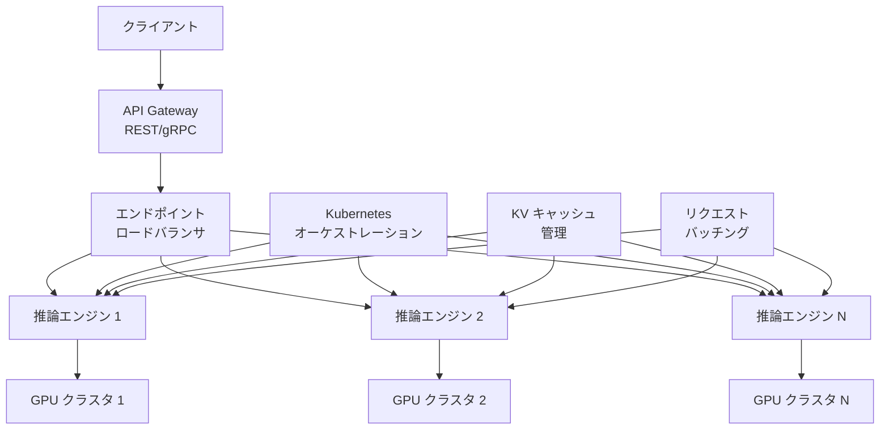

本記事は [Enhancing reliability in AI inference services: An empirical study on real production incidents](https://arxiv.org/abs/2511.07424) の解説記事です。

## 論文概要

本論文は、大規模LLM推論サービスで発生した156件の高重大度インシデント（2025年4月〜6月）を体系的に分類・分析した実証研究である。著者らは4カテゴリからなる障害分類法を構築し、インファレンスエンジン障害が全体の約60%を占めることを明らかにした。さらに、HTTPエラーコード分布、緩和策の分類、自動検知率（74%）などの定量データを提示し、AIOps自動化・インテリジェントフェイルオーバー・GPU対応ルーティングの実装を推奨している。分類の信頼性はCohen's kappa ≈ 0.89（95% CI [0.75, 1.00]）で検証されている。

## 情報源

- **arXiv ID**: 2511.07424
- **URL**: [https://arxiv.org/abs/2511.07424](https://arxiv.org/abs/2511.07424)
- **著者**: Bhala Ranganathan, Mickey Zhang, Kai Wu
- **発表年**: 2025年11月

## 背景と動機

LLM推論サービスはハイパースケール環境で運用されるが、従来のWebサービスとは異なる信頼性課題を抱えている。GPUクラスタ上でのモデル推論は、KVキャッシュ管理、動的バッチング、テンソル並列処理など固有の障害要因を持つ。しかし、実際の本番障害を体系的に分析した研究はこれまで乏しかった。

著者らは、1年間のオペレーション経験に基づき、この空白を埋めるべく156件の高重大度インシデントを分析した。対象となったインシデントは重大度2（Severity 2）が82.7%（129件）、重大度2.5が17.3%（27件）であり、いずれもサービスに実質的な影響を与えたものである。分析期間中、トークン生成量は約1.27倍に増加し、P75 TTFT（Time To First Token）は約60ms、P75 TTLT（Time To Last Token）は約80ms増加したと報告されている。このスケール拡大に伴い、障害の多様化と複雑化が進んでいる実態が研究の動機となっている。

## 主要な貢献

著者らは以下の3点を主要な貢献として挙げている。

1. **障害分類法の構築**: 4カテゴリ（Infrastructure、Model configuration、Inference engine、Operational）からなる分類体系を、1年間の運用経験に基づいて開発した。Cohen's kappa ≈ 0.89で分類の一貫性を検証している。

2. **定量分析の提示**: 156件のインシデントについて、障害カテゴリ分布、HTTPエラーコード分布、検知方法、緩和策を定量的に分析し、推論エンジン障害が支配的であることを実証した。

3. **実践的推奨事項**: ヘルスプローブ自動再起動、スキーマバリデーション、コネクション生存確認、適応的モニタリング、GPU対応ルーティングなど、具体的な改善策を提案している。

## 技術的詳細

### 推論サービングアーキテクチャ

著者らが分析対象とした推論サービスの一般的なアーキテクチャを以下に示す。



クライアントからのリクエストはAPI Gatewayを経由し、ロードバランサで各推論エンジンに振り分けられる。KVキャッシュ管理とリクエストバッチングが推論効率を左右する重要なコンポーネントである。

### 障害分類法

著者らは156件のインシデントを以下の4カテゴリに分類した。

#### 1. Infrastructure（インフラストラクチャ）: 約20%（31件）

デプロイメントテンプレートやノード、ネットワークに起因する障害である。サブタイプ別の内訳は以下の通りである。

| サブタイプ | 割合 |
|:---|:---:|
| デプロイメントテンプレートの設定誤り | 26% |
| 不良ノード | 19% |
| MPI リング障害 | 18% |
| サイドカー問題 | 11% |
| Istio 問題 | 7% |
| コンピュート割り当て遅延 | 7% |
| Redis 問題 | 4% |
| ストレージ問題 | 4% |
| スケジューリング問題 | 4% |

MPI（Message Passing Interface）リング障害はテンソル並列処理時のGPU間通信に起因し、従来のWebサービスでは見られないLLM推論特有の障害タイプである。

#### 2. Model Configuration（モデル設定）: 約16%（25件）

モデルのデプロイ設定に起因する障害である。

| サブタイプ | 割合 |
|:---|:---:|
| ヘッダー設定の誤り・欠落 | 81% |
| 設定誤りによる不正出力 | 19% |

ヘッダー設定の問題が81%を占める点は注目に値する。著者らはスキーマバリデーションによる事前検証を推奨している。

#### 3. Inference Engine（推論エンジン）: 約60%（94件）

全障害の過半数を占める最大カテゴリである。サブタイプ別の内訳は以下の通りである。

| サブタイプ | 割合 |
|:---|:---:|
| タイムアウト | 40% |
| リソース枯渇 | 29% |
| クラッシュ | 12% |
| レイテンシスパイク | 6% |
| 入力フェッチ | 6% |
| KV キャッシュ | 5% |
| 制約サンプリング | 1% |
| メモリリーク | 1% |

タイムアウト（40%）とリソース枯渇（29%）で推論エンジン障害の約7割を占める。GPUメモリやKVキャッシュの管理不全がリソース枯渇の主要因であり、長時間推論リクエストでのコネクション切断がタイムアウトの典型的なパターンである。

#### 4. Operational（運用）: 約4%（6件）

人的オペレーションやプロセスに起因する障害である。

| サブタイプ | 割合 |
|:---|:---:|
| ロールアウトウィンドウ問題 | 33% |
| 低トラフィック検知ギャップ | 17% |
| アラート設定誤り | 17% |
| エラーコード変換問題 | 17% |
| 不均衡なトラフィックルーティング | 16% |

件数は少ないが、運用プロセスの改善で防止可能な障害が含まれている。

### モデルタイプ別分布

分析対象のうち、非推論モデルが75%（117件）、推論モデルが25%（39件）であった。インシデントの96.2%（150件）は単一エンドポイントに限定されていた。

### HTTPエラーコード分布

著者らは、156件のインシデントで観測されたHTTPエラーコードの分布を以下のように報告している。

| HTTP ステータスコード | 割合 | 件数 |
|:---|:---:|:---:|
| 500 Internal Server Error | 74% | 115件 |
| 408 Request Timeout | 10% | 16件 |
| 503 Service Unavailable | 9% | 14件 |
| 429 Too Many Requests | 3% | 5件 |
| 424 Failed Dependency | 3% | 5件 |
| 504 Gateway Timeout | 1% | 1件 |

HTTP 500が74%と圧倒的に多い点は、推論エンジン内部の障害（クラッシュ、リソース枯渇等）が外部にはGenericな500エラーとして伝播する構造を反映している。HTTP 429（レートリミット）はわずか3%であり、Azure OpenAIサービスの負荷分散設計において429エラーが注目されがちだが、本番障害全体では500系エラーへの対応がより重要であることを示唆している。

### 分類精度の検証

著者らは分類の信頼性をCohen's kappa統計量で検証した。

$$\kappa = \frac{P_o - P_e}{1 - P_e}$$

ここで $$P_o$$ は観測一致率、$$P_e$$ は偶然一致率である。結果として $$\kappa \approx 0.89$$（95% CI [0.75, 1.00]）が得られ、Landis & Kochの基準で「almost perfect agreement」に該当する高い分類一貫性が確認された。

### 検知と緩和策

#### 検知方法

- **自動検知**: 74%（115件） — 監視システムによるアラート
- **手動検知**: 26%（41件） — ユーザー報告やオペレーター発見

#### 緩和策の分類

著者らは、各インシデントに適用された緩和策を以下の6カテゴリに分類した。

| 緩和策 | 割合 | 件数 |
|:---|:---:|:---:|
| Monitor only（監視のみ） | 48.08% | 75件 |
| Hotfix（手動コード/設定修正） | 28.21% | 44件 |
| Capacity increase（容量増加） | 9.62% | 15件 |
| Node restart（ノード再起動） | 8.97% | 14件 |
| Traffic routing（トラフィックルーティング） | 4.49% | 7件 |
| Deployment deletion（デプロイメント削除） | 0.64% | 1件 |

「Monitor only」が48%を占める点は重要である。これらのインシデントは自然回復したか、根本原因の特定に至らず監視強化で対処されたケースである。一方、Hotfixが28%を占めることは、自動化の余地が大きいことを示している。

緩和までの時間（TTM）はP75で4月に約32時間、5月に約49時間と悪化傾向にあり、インシデントの複雑化が影響している可能性がある。

### ケーススタディ: HTTP 408エラーの改善

著者らは、コネクション生存確認（connection liveness）の実装によるHTTP 408エラー改善のケーススタディを報告している。長時間推論リクエストにおいて、ロードバランサやプロキシがアイドルコネクションをタイムアウトで切断する問題に対し、コネクション生存確認メカニズムを導入した結果、正規化HTTP 408エラー率が **2.72%から0.47%** に低下した（2025年2月→3月）。これは約83%の削減に相当する。

## 実装のポイント

論文の知見を実装に活かすための主要パターンを以下に示す。

### ヘルスプローブと自動再起動

推論エンジン障害の40%がタイムアウト、12%がクラッシュであることから、ヘルスプローブによる障害検知と自動再起動が有効である。

```python
import asyncio
import httpx
from dataclasses import dataclass

@dataclass
class HealthProbeConfig:
    endpoint: str
    interval_sec: float = 10.0
    timeout_sec: float = 5.0
    unhealthy_threshold: int = 3

async def health_probe_loop(config: HealthProbeConfig) -> None:
    """推論エンジンのヘルスプローブを定期実行する。

    unhealthy_threshold回連続で失敗した場合、
    自動再起動をトリガーする。
    """
    consecutive_failures = 0
    async with httpx.AsyncClient(timeout=config.timeout_sec) as client:
        while True:
            try:
                resp = await client.get(config.endpoint)
                if resp.status_code == 200:
                    consecutive_failures = 0
                else:
                    consecutive_failures += 1
            except (httpx.TimeoutException, httpx.ConnectError):
                consecutive_failures += 1

            if consecutive_failures >= config.unhealthy_threshold:
                await trigger_node_restart(config.endpoint)
                consecutive_failures = 0

            await asyncio.sleep(config.interval_sec)
```

### コネクション生存確認

HTTP 408エラーの削減（2.72%→0.47%）を実現した生存確認パターンである。

```python
import time

class ConnectionLivenessChecker:
    """長時間推論リクエスト向けコネクション生存確認。

    ロードバランサのアイドルタイムアウトより短い間隔で
    keepaliveを送信し、接続切断を防止する。
    """

    def __init__(
        self,
        idle_timeout_sec: float = 60.0,
        keepalive_interval_sec: float = 30.0,
    ) -> None:
        self.idle_timeout_sec = idle_timeout_sec
        self.keepalive_interval_sec = keepalive_interval_sec
        self._last_activity: float = time.monotonic()

    def record_activity(self) -> None:
        self._last_activity = time.monotonic()

    def needs_keepalive(self) -> bool:
        elapsed = time.monotonic() - self._last_activity
        return elapsed >= self.keepalive_interval_sec
```

### スキーマバリデーション

モデル設定障害の81%がヘッダー設定の誤り・欠落に起因することから、デプロイ前のスキーマバリデーションが有効である。

```python
from pydantic import BaseModel, field_validator

class InferenceEndpointConfig(BaseModel):
    """推論エンドポイントのデプロイ設定スキーマ。

    モデル設定障害の81%を占めるヘッダー設定誤りを
    デプロイ前に検出する。
    """
    model_id: str
    max_tokens: int
    temperature: float
    api_version: str
    content_type: str = "application/json"

    @field_validator("api_version")
    @classmethod
    def validate_api_version(cls, v: str) -> str:
        if not v.startswith("20"):
            raise ValueError(f"Invalid api_version format: {v}")
        return v
```

## Production Deployment Guide

### AWS実装パターン

論文の障害分類に基づき、推論サービスの信頼性を段階的に向上させるAWS構成を以下に示す。

| 項目 | Small | Medium | Large |
|:---|:---|:---|:---|
| コンピュート | Lambda + API Gateway | ECS Fargate | EKS + GPU ノード |
| モニタリング | CloudWatch Alarms | CloudWatch + X-Ray | Prometheus + Grafana |
| ヘルスチェック | ALB ヘルスチェック | ECS タスクヘルス | カスタムヘルスプローブ |
| 自動復旧 | Lambda リトライ | ECS サービス自動復旧 | Pod 自動再起動 + HPA |
| トラフィック制御 | API Gateway スロットリング | ALB ルーティング | Istio トラフィック分割 |
| 障害検知 | CloudWatch メトリクス | X-Ray トレーシング | 分散トレーシング + AIOps |
| 推定月額 | $50-200 | $500-2,000 | $5,000-50,000+ |
| 対象規模 | PoC・検証 | 中規模本番 | ハイスケール本番 |

### Terraform構成例: Small（Lambda + CloudWatch）

```hcl
# Lambda + CloudWatch による最小構成の推論監視
# 論文の「Monitor only 48%」パターンの自動化を目指す

resource "aws_cloudwatch_metric_alarm" "inference_5xx_rate" {
  alarm_name          = "inference-5xx-error-rate"
  comparison_operator = "GreaterThanThreshold"
  evaluation_periods  = 2
  metric_name         = "5XXError"
  namespace           = "AWS/ApiGateway"
  period              = 300
  statistic           = "Average"
  threshold           = 0.05  # 5%を超えたらアラート
  alarm_description   = "HTTP 500 rate exceeds 5% (paper: 74% of incidents)"

  alarm_actions = [aws_sns_topic.alerts.arn]
}

resource "aws_cloudwatch_metric_alarm" "inference_timeout_rate" {
  alarm_name          = "inference-timeout-rate"
  comparison_operator = "GreaterThanThreshold"
  evaluation_periods  = 2
  metric_name         = "IntegrationLatency"
  namespace           = "AWS/ApiGateway"
  period              = 300
  statistic           = "p99"
  threshold           = 30000  # 30秒（推論タイムアウト）
  alarm_description   = "P99 latency exceeds 30s (paper: timeouts = 40% of engine failures)"

  alarm_actions = [aws_sns_topic.alerts.arn]
}

resource "aws_sns_topic" "alerts" {
  name = "inference-alerts"
}
```

### Terraform構成例: Large（EKS + ヘルスプローブ）

```hcl
# EKS + GPU ノード + ヘルスプローブ構成（抜粋）
# 論文推奨: ヘルスプローブ + 自動再起動でクラッシュ (12%) に対応

resource "aws_eks_node_group" "gpu_inference" {
  cluster_name    = aws_eks_cluster.main.name
  node_group_name = "gpu-inference"
  instance_types  = ["p4d.24xlarge"]
  capacity_type   = "ON_DEMAND"

  scaling_config {
    desired_size = 3
    max_size     = 10
    min_size     = 2
  }

  labels = {
    "gpu-aware-routing" = "enabled"  # 論文推奨: GPU対応ルーティング
  }
}

# Kubernetes liveness/readiness probes（YAML相当）
# liveness_probe: path=/health, period=10s, failure_threshold=3
# readiness_probe: path=/ready, period=5s, failure_threshold=2
# GPU resources: limits 8 GPU / 320Gi, requests 8 GPU / 256Gi
```

### 運用・監視設定

論文の障害カテゴリに対応したインシデント検知と自動復旧の設定例を示す。

```python
from dataclasses import dataclass

@dataclass
class IncidentDetectionConfig:
    """論文の障害カテゴリに基づくインシデント検知設定。"""
    http_500_rate_threshold: float = 0.05      # 論文: 74%がHTTP 500
    timeout_rate_threshold: float = 0.03       # 論文: エンジン障害の40%
    gpu_memory_usage_threshold: float = 0.90   # 論文: リソース枯渇29%
    p99_latency_threshold_ms: float = 30_000
    health_check_failure_threshold: int = 3
    auto_restart_enabled: bool = True          # 論文: Node restart 9%
    auto_failover_enabled: bool = True         # 論文: Traffic routing 4.5%
```

段階的エスカレーションは、論文の緩和策分布に基づき「監視強化（48%）→ 自動再起動（9%）→ 容量増加（10%）→ トラフィック切替（4.5%）→ Hotfix対応（28%）」の順で設計する。

### コスト最適化チェックリスト

論文の知見を踏まえた運用コスト最適化のチェックリストである。

**インフラストラクチャ（障害の20%に対応）**

- [ ] デプロイメントテンプレートのバージョン管理とCIバリデーション
- [ ] 不良ノードの自動検知とドレイン（論文: 19%がBad nodes）
- [ ] MPI通信のヘルスチェック（テンソル並列処理の障害検知）
- [ ] サイドカーコンテナのリソース制限設定

**モデル設定（障害の16%に対応）**

- [ ] デプロイ前のスキーマバリデーション（ヘッダー誤り81%防止）
- [ ] モデル設定のdry-runテストとカナリアデプロイ

**推論エンジン（障害の60%に対応）**

- [ ] タイムアウト閾値の動的調整（推論モデル vs 非推論モデル）
- [ ] GPUメモリ・KVキャッシュ使用率の継続監視とアラート
- [ ] コネクション生存確認の実装（HTTP 408対策）
- [ ] メモリリーク検知のための長期メトリクス収集
- [ ] レイテンシスパイク検知のための動的閾値

**運用プロセス（障害の4%に対応）**

- [ ] ロールアウトウィンドウの自動制御
- [ ] アラート設定のテスト自動化（論文: 17%がアラート設定誤り）
- [ ] トラフィック分散の均等性モニタリング

**コスト効率化**

- [ ] スポットインスタンスの活用（非クリティカルワークロード）
- [ ] GPUノードのオートスケーリング（需要予測ベース）

## 実験結果

著者らが報告した主要な定量結果を以下にまとめる。なお、本記事の著者が独自に実験を行ったものではなく、論文の報告値をそのまま記載している。

### 障害カテゴリ分布

| カテゴリ | 件数 | 割合 |
|:---|:---:|:---:|
| Inference Engine | 94件 | 60% |
| Infrastructure | 31件 | 20% |
| Model Configuration | 25件 | 16% |
| Operational | 6件 | 4% |
| **合計** | **156件** | **100%** |

### 検知と対応の効率

| メトリクス | 値 |
|:---|:---:|
| 自動検知率 | 74%（115件） |
| 手動検知率 | 26%（41件） |
| P75 TTM（4月） | 約32時間 |
| P75 TTM（5月） | 約49時間 |
| Hotfix 必要率 | 28.21%（44件） |

### 重大度分布

| 重大度 | 件数 | 割合 |
|:---|:---:|:---:|
| Severity 2 | 129件 | 82.7% |
| Severity 2.5 | 27件 | 17.3% |

### HTTP 408改善効果（ケーススタディ）

| 指標 | 改善前（2月） | 改善後（3月） | 削減率 |
|:---|:---:|:---:|:---:|
| 正規化 HTTP 408 エラー率 | 2.72% | 0.47% | 約83% |

コネクション生存確認の導入という比較的シンプルな変更で大幅な改善が得られた好例である。

## 実運用への応用

### Zenn記事「Azure OpenAI負荷分散の運用設計」との関連

関連するZenn記事（[Azure OpenAI負荷分散の運用設計](https://zenn.dev/0h_n0/articles/05003ecf02b6dc)）では、Azure OpenAIサービスにおけるPTUサイジングや429エラー対策が議論されている。本論文の知見は、このような負荷分散設計に以下の示唆を与える。

**429エラーの位置づけの再考**: 論文によると、HTTP 429（レートリミット）は全インシデントのわずか3%（5件）にすぎない。実際の本番障害ではHTTP 500（74%）やHTTP 408（10%）がはるかに支配的である。429エラー対策は重要だが、500系エラーへのフォールバック戦略をより重視すべきことを示唆している。

**段階的エスカレーション**: 論文の緩和策分布（監視のみ48%→Hotfix 28%→容量増加10%→ノード再起動9%→トラフィックルーティング4.5%）は、Azure OpenAIの運用設計における段階的エスカレーション戦略の設計に活用できる。まず監視強化で状況を把握し、必要に応じて自動再起動、容量増加、トラフィック切替へとエスカレートする戦略が、論文のデータからも裏付けられている。

**推論モデル固有の監視**: 推論（Reasoning）モデルが全インシデントの25%を占める点は、Azure OpenAI o1/o3シリーズの運用において追加の監視ポイントが必要であることを示している。長時間推論に伴うタイムアウト対策として、コネクション生存確認の実装が特に有効である。

## 関連研究

著者らは以下の関連分野の研究を参照している。

- **クラウドサービスの障害分析**: 従来のクラウドサービス（VM、ストレージ等）の障害分析研究が多数存在するが、LLM推論サービスに特化した実証研究は本論文が先駆的であると著者らは位置づけている。

- **GPUクラスタの信頼性**: 大規模GPUクラスタのハードウェア障害分析研究が関連する。本論文はソフトウェアレベルの推論エンジン障害にも焦点を当てている。

- **AIOps**: 障害の自動検知・診断・修復のためのAIOps研究が進展しているが、著者らは自動検知率74%からさらなるAIOps統合の必要性を指摘している。

- **SREプラクティス**: Google SREの原則との関連も議論されており、LLM推論特有のSLI定義（TTFT、TTLT等）の必要性が指摘されている。

## まとめ

本論文は、LLM推論サービスの本番障害156件を4カテゴリの分類法で体系的に分析した実証研究である。推論エンジン障害が60%を占め、その中でもタイムアウト（40%）とリソース枯渇（29%）が支配的であることが明らかにされた。HTTP 500エラーが全体の74%を占める一方、HTTP 429は3%にとどまるという知見は、負荷分散設計の優先順位付けに重要な示唆を与える。

コネクション生存確認によるHTTP 408エラー率の83%削減（2.72%→0.47%）は、比較的シンプルな実装変更で大きな効果が得られることを示している。一方で、48%のインシデントが「監視のみ」で対処されている現状は、自動化の余地が大きいことを意味する。ヘルスプローブ、スキーマバリデーション、GPU対応ルーティングなどの推奨事項は、Azure OpenAIを含むLLM推論サービスの運用設計に直接適用可能である。

## 参考文献

1. Ranganathan, B., Zhang, M., & Wu, K. (2025). Enhancing reliability in AI inference services: An empirical study on real production incidents. arXiv:2511.07424. [https://arxiv.org/abs/2511.07424](https://arxiv.org/abs/2511.07424)
2. Landis, J. R., & Koch, G. G. (1977). The Measurement of Observer Agreement for Categorical Data. *Biometrics*, 33(1), 159-174.
3. Beyer, B., Jones, C., Petoff, J., & Murphy, N. R. (2016). *Site Reliability Engineering: How Google Runs Production Systems*. O'Reilly Media.
