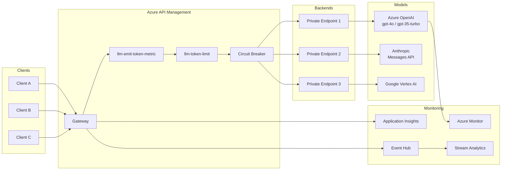
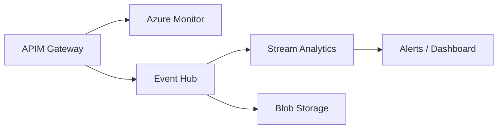
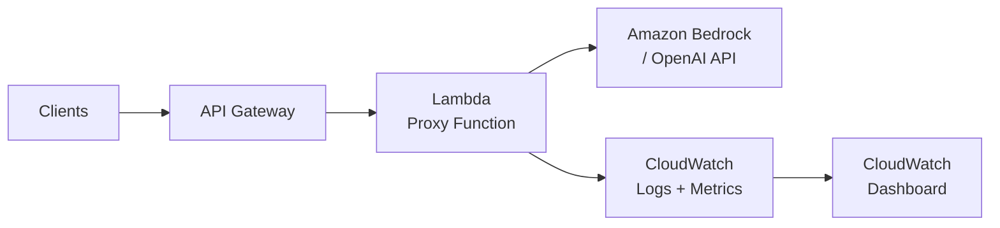
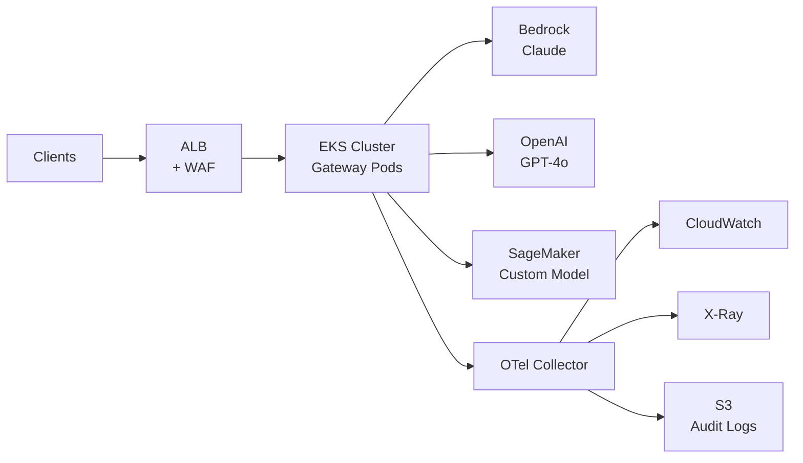

## 冒頭

本記事は [Azure API Management - Unified AI Gateway Design Pattern](https://techcommunity.microsoft.com/blog/integrationsonazureblog/azure-api-management---unified-ai-gateway-design-pattern/4495436) および [Implement Advanced Monitoring for Foundry Models Through a Gateway](https://learn.microsoft.com/en-us/azure/architecture/ai-ml/guide/azure-openai-gateway-monitoring) の解説記事です。Azure API Management（以下APIM）をAIワークロード向けの統合ゲートウェイとして活用する設計パターンと、高度な監視シナリオの実装方法を扱っています。

なお、本記事は解説であり筆者自身による検証は行っていません。技術的主張はすべて原典に基づいています。

この記事は [Zenn記事: Azure OpenAI負荷分散の運用設計：PTUサイジングから監視・自動スケーリングまで](https://zenn.dev/0h_n0/articles/05003ecf02b6dc) の深掘りです。

## ブログ概要

Microsoftは、複数のAIプロバイダ（Azure OpenAI、Anthropic、Google Vertex AI）へのリクエストをAPIMで一元管理する「統合AIゲートウェイ」パターンを提唱している。クライアントIPの完全な追跡、トークン使用量のモデル・クライアント別集計、入出力の監査ログ取得、サーキットブレーカーによる障害伝播防止を、単一のゲートウェイレイヤで実現する。Azure Architecture Centerの監視ガイドでは、チャージバック、監査、準リアルタイム監視の3つの高度な監視シナリオが解説されている。

## 情報源

- **URL**: [Azure API Management - Unified AI Gateway Design Pattern](https://techcommunity.microsoft.com/blog/integrationsonazureblog/azure-api-management---unified-ai-gateway-design-pattern/4495436)
- **URL**: [Implement Advanced Monitoring for Foundry Models Through a Gateway](https://learn.microsoft.com/en-us/azure/architecture/ai-ml/guide/azure-openai-gateway-monitoring)
- **組織**: Microsoft
- **更新日**: 2025-03-28（Architecture Center）、2026-06-15（llm-emit-token-metric）

## 技術的背景: なぜAPIゲートウェイが必要か

Azure OpenAIを直接利用する構成では、以下の3つの運用課題が発生する。

**第一に、クライアントIPのマスキング問題**である。Microsoftのドキュメントによれば、Azure OpenAIのネイティブテレメトリではクライアントIPアドレスの最後のオクテットがマスクされる。例えば`10.0.1.123`は`10.0.1.xxx`として記録される。このマスキングにより、特定のアプリケーションやビジネスユニットへの使用量の紐付けが困難になり、チャージバック（部門別課金配賦）の実装が阻害される。

**第二に、ログの分散問題**である。複数リージョンにデプロイされたAzure OpenAIインスタンスは、それぞれのローカルリージョンのAzure Monitorにログを記録する。全インスタンスの使用量を横断的に追跡するには、異なるAzure Monitorインスタンスからのログ集約が必要となる。

**第三に、マルチモデル管理の複雑性**である。gpt-4o、gpt-35-turboなど異なるモデルを複数のクライアントが利用する場合、クライアント×モデル別のトークン消費量を一元的に把握する手段がない。さらにAnthropic、Vertex AIも併用する場合、プロバイダごとに監視体制を構築する必要が生じる。

ゲートウェイを導入することで、これらの問題を単一レイヤで解決できる。ただしMicrosoftも明記しているように、**単一アプリケーション×単一モデルの場合**はゲートウェイの複雑性がメリットを上回る可能性があり、クライアント側ログとモデルネイティブ機能で十分である。

## 実装アーキテクチャ

### 統合AIゲートウェイの全体構成

Microsoftが提唱するアーキテクチャでは、APIMがすべてのAIプロバイダへのリクエストを仲介する。以下にその全体構成を示す。



APIMは OpenAI Chat Completions / Responses API、Anthropic Messages API、Google Vertex AI APIの3つのAPIスキーマに対応しており（Anthropic対応はv2ティアで利用可能）、`llm-emit-token-metric`や`llm-token-limit`といったLLM専用ポリシーがプロバイダ横断で動作する。

### llm-emit-token-metric ポリシーの詳細

`llm-emit-token-metric`ポリシーは、LLM APIのトークン消費量をApplication Insightsにカスタムメトリクスとして送信するAPIMポリシーである。送信されるメトリクスはプロンプトトークン、コンプリーショントークン、合計トークンを含み、プレビュー段階ではキャッシュトークン、推論トークン等も追加されている。

以下はMicrosoft公式ドキュメントに記載されたポリシー構文である。

```xml
<llm-emit-token-metric
        namespace="metric namespace">
        <dimension name="dimension name" value="dimension value" />
        ...additional dimensions...
</llm-emit-token-metric>
```

**カスタムディメンション**として最大5つまで設定可能である。Azure Monitorでは1メトリクスあたり10のディメンションキーが設定可能だが、APIMがデフォルトでRegion、Service ID、Service Name、Service Typeの4つを使用するため、ユーザー追加分は最大5つとなる。値なしで使用可能なデフォルトディメンション名として、API ID、Operation ID、Product ID、User ID、Subscription ID、Location、Gateway ID、Backend IDが用意されている。

以下は、API IDをデフォルトディメンションとして使用する設定例（Microsoft公式ドキュメントより引用）である。

```xml
<policies>
  <inbound>
      <llm-emit-token-metric namespace="MyLLM">
            <dimension name="API ID" />
      </llm-emit-token-metric>
  </inbound>
  <outbound>
  </outbound>
</policies>
```

チャージバック用途では、`counter-key`にクライアントIPアドレスやサブスクリプションIDを設定することで、部門別・アプリケーション別のトークン消費量を追跡できる。

### llm-token-limit ポリシーによるレート制限

`llm-token-limit`ポリシーは、キーごとのトークン消費量をレート（1分あたりのトークン数）またはクォータ（期間あたりのトークン総量）で制限する。Microsoftのドキュメントによれば、レート制限超過時は`429 Too Many Requests`、クォータ超過時は`403 Forbidden`が返される。

```xml
<llm-token-limit
    counter-key="@(context.Request.IpAddress)"
    tokens-per-minute="5000"
    estimate-prompt-tokens="false"
    remaining-tokens-variable-name="remainingTokens" />
```

`estimate-prompt-tokens="true"`を設定すると、リクエスト送信前にプロンプトトークン数を推定し、制限超過時のバックエンドへの不要なリクエストを抑制できる。ストリーミング有効時にはプロンプトトークンが常に推定される。

### Circuit Breaker + Load Balancing Pool構成

APIMのバックエンドリソースにはサーキットブレーカーが組み込まれており、バックエンドサービスの過負荷保護を実現する。Microsoftのドキュメントによれば、サーキットブレーカーは「定義された時間間隔内での障害条件（回数またはパーセンテージ）」と「障害とみなすステータスコード範囲」をルールとして定義する。

以下はBicepでの構成例（Microsoft公式ドキュメントより引用）である。1時間内に500-599のステータスコードが3回発生した場合にサーキットブレーカーがトリップし、1時間後にリセットされる。`acceptRetryAfter: true`により、レスポンスに含まれる`Retry-After`ヘッダーの値を尊重する。

```bicep
resource backend 'Microsoft.ApiManagement/service/backends@2023-09-01-preview' = {
  name: 'myAPIM/myBackend'
  properties: {
    url: 'https://mybackend.com'
    protocol: 'http'
    circuitBreaker: {
      rules: [
        {
          failureCondition: {
            count: 3
            errorReasons: ['Server errors']
            interval: 'PT1H'
            statusCodeRanges: [
              { min: 500, max: 599 }
            ]
          }
          name: 'myBreakerRule'
          tripDuration: 'PT1H'
          acceptRetryAfter: true
        }
      ]
    }
  }
}
```

Microsoftは特にAzure OpenAIバックエンドについて、`429 Too Many Requests`と大きな`Retry-After`値を返す場合があるため、サーキットブレーカーで`429`を処理し`Retry-After`を受け入れる構成を推奨している。

ロードバランシングプールは最大30のバックエンドを含むことができ、以下の3つのオプションが提供される。

| オプション | 説明 |
|---|---|
| ラウンドロビン | リクエストをプール内のバックエンドに均等に分散（デフォルト） |
| 重み付き | バックエンドに重みを割り当て、相対的な重みに基づいて分散（Blue-Greenデプロイ向け） |
| 優先度ベース | バックエンドを優先度グループに整理し、高優先度グループから順にリクエストを送信 |

Microsoftは、APIMの分散アーキテクチャの性質上、ロードバランシングは近似的であり、ゲートウェイの異なるインスタンス間で同期されない点を明記している。

### Session-aware Load Balancing

マルチターン会話（チャット、AIアシスタント）では、同一セッションのリクエストを同一バックエンドにルーティングする必要がある。APIMはセッションIDクッキーによるセッションアフィニティをサポートしている。

以下はBicepでの構成例（Microsoft公式ドキュメントより引用）である。

```bicep
resource backendPool 'Microsoft.ApiManagement/service/backends@2023-09-01-preview' = {
  name: 'myAPIM/myBackendPool'
  properties: {
    description: 'Load balancer for multiple backends'
    type: 'Pool'
    pool: {
      services: [
        { id: '/subscriptions/.../backends/backend-1', priority: 1, weight: 3 }
        { id: '/subscriptions/.../backends/backend-2', priority: 1, weight: 1 }
      ]
      sessionAffinity: {
        sessionId: { source: 'Cookie', name: 'SessionId' }
      }
    }
  }
}
```

クライアント側では`Set-Cookie`ヘッダーの値を保存し、後続リクエストで送信する必要がある。Assistants APIの場合は、スレッドIDの抽出とクッキーの紐付けをAPIMの`outbound`ポリシーで定義する。

### KQLクエリによる使用量監視

APIMのゲートウェイログ（`ApiManagementGatewayLogs`）を使用して、クライアントIP・モデル別のトークン使用量を集計できる。以下はMicrosoft公式ドキュメントに記載された使用量監視クエリである。

```sql
ApiManagementGatewayLogs
| where tolower(OperationId) in ('completions_create','chatcompletions_create')
| extend model = tostring(parse_json(BackendResponseBody)['model'])
| extend prompttokens = parse_json(parse_json(BackendResponseBody)['usage'])['prompt_tokens']
| extend completiontokens = parse_json(parse_json(BackendResponseBody)['usage'])['completion_tokens']
| extend totaltokens = parse_json(parse_json(BackendResponseBody)['usage'])['total_tokens']
| extend ip = CallerIpAddress
| summarize
    sum(todecimal(prompttokens)),
    sum(todecimal(completiontokens)),
    sum(todecimal(totaltokens)),
    avg(todecimal(totaltokens))
    by ip, model
```

このクエリにより、クライアントIPアドレス（マスクされていない完全なアドレス）とモデル名ごとに、プロンプトトークン・コンプリーショントークン・合計トークンの集計値が取得できる。Azure OpenAIのネイティブログでは最後のオクテットがマスクされるが、APIMゲートウェイ経由であれば完全なIPアドレスが記録される。

429エラー率のトレンド監視には、`countif(ResponseCode == 429)`で時間帯別のスロットル率を算出するKQLクエリが有効である。

### 監査ログ（入出力ログ取得）

ゲートウェイはクライアントからの生のリクエスト（入力）と、最終的なレスポンス（出力）の両方をログに記録できる立場にある。Microsoftのドキュメントでは、入力側の脅威検出・利用規約違反検出・パフォーマンス評価、出力側のデータ漏洩検出・ステートフルコンプライアンス・法規制遵守がユースケースとして挙げられている。Azure OpenAIのネイティブ機能ではモデルの入出力ログが記録されない制約があるが、ゲートウェイレイヤでこれを補完できる。キャッシュからの応答や複数モデルの集約応答も含めてログを取得できる点が利点である。

### Near Real-Time Monitoring

Azure Monitorにはログデータ取り込みの固有レイテンシがあり、準リアルタイム処理には最適化されていない。Microsoftのドキュメントでは、準リアルタイム処理が必要な場合、ゲートウェイからメッセージバス（Event Hub）にログを直接パブリッシュし、Azure Stream Analyticsでウィンドウ操作を実行するアーキテクチャが提案されている。



この構成により、Azure Monitorのバッチ的なログ処理では対応できない秒単位のアラートやリアルタイムダッシュボードが実現可能となる。

## Production Deployment Guide

### クラウド横断の類似パターン: AWS実装例

APIMの統合AIゲートウェイパターンはAzure固有の実装であるが、同等の機能をAWS上で構築する場合のアーキテクチャパターンを以下に示す。これらはMicrosoftのドキュメントに記載されたものではなく、同等の機能要件をAWSサービスで実現するための参考設計である。

#### Small規模: API Gateway + Lambda

単一チーム・少数モデルの環境向け。API Gatewayがリクエストを受け、Lambda関数がプロキシとしてBedrock/OpenAI APIにリクエストを転送しつつ、トークン使用量をCloudWatch Metricsに送信する。



Lambda関数内でのトークンメトリクス送信例（Python）:

```python
import boto3
from datetime import datetime

cloudwatch = boto3.client("cloudwatch")


def emit_token_metrics(
    client_ip: str,
    model: str,
    prompt_tokens: int,
    completion_tokens: int,
    total_tokens: int,
) -> None:
    """CloudWatch にトークン使用量メトリクスを送信する."""
    dimensions = [
        {"Name": "ClientIP", "Value": client_ip},
        {"Name": "Model", "Value": model},
    ]
    cloudwatch.put_metric_data(
        Namespace="LLMGateway",
        MetricData=[
            {
                "MetricName": name,
                "Dimensions": dimensions,
                "Timestamp": datetime.utcnow(),
                "Value": value,
                "Unit": "Count",
            }
            for name, value in [
                ("PromptTokens", prompt_tokens),
                ("CompletionTokens", completion_tokens),
                ("TotalTokens", total_tokens),
            ]
        ],
    )
```

#### Large規模: ALB + EKS + OpenTelemetry

マルチチーム・大規模トラフィック環境向け。APIMのロードバランシングプール + サーキットブレーカー + 入出力監査を完全に再現する構成である。



EKS上のゲートウェイPodからOpenTelemetry Collectorを経由してCloudWatch（メトリクス）、X-Ray（トレース）、S3（監査ログ）に分流する。CloudWatch Logs InsightsでAPIMのKQLクエリと同等のトークン使用量集計が可能であり、Cost Explorer API連携によりチャージバック精度を検証できる。

### 運用チェックリスト

AIゲートウェイ導入時の主要な確認項目を以下に示す。

**トークン管理**:
- [ ] `llm-token-limit`レート制限は全クライアントに設定されているか
- [ ] `estimate-prompt-tokens`の有効化により不要なバックエンドリクエストを抑制しているか
- [ ] トークンクォータ（日次/月次）は予算に基づいて設定されているか

**監視コスト**:
- [ ] Application Insightsのサンプリングレートは適切か（100%取り込みは高コスト）
- [ ] カスタムメトリクスのアクティブ時系列数は50,000/リージョン/サブスクリプション以内か
- [ ] Near real-time monitoringのEvent Hub/Stream Analyticsは本当に必要か

**バックエンド最適化**:
- [ ] サーキットブレーカーのトリップ条件は適切か（過度に敏感だと可用性低下）
- [ ] `acceptRetryAfter: true`を設定し、Azure OpenAIの429レスポンスを適切に処理しているか
- [ ] 優先度ベースルーティングで低コストモデルを優先利用しているか

**セキュリティ**:
- [ ] 監査ログに含まれるPII（個人情報）のマスキングルールは定義されているか
- [ ] 入出力ログの暗号化（at rest / in transit）は確保されているか
- [ ] ログへのアクセス制御（RBAC）は最小権限の原則に基づいているか

## パフォーマンス最適化

ゲートウェイ導入による最大の懸念事項はレイテンシオーバーヘッドである。Microsoftのドキュメントでは、「ゲートウェイのオブザーバビリティ上の利点がパフォーマンスへの影響を上回ることを確認する必要がある」と明記されている。

主要な最適化手法として、(1) Private Endpoint経由の通信によりAzureバックボーンネットワーク内で完結させること、(2) ストリーミング時に`include_usage`パラメータを`true`に設定して正確なトークンカウントを取得すること、(3) サーキットブレーカーの閾値を過度に敏感にせず、フェイルオーバー頻発を防ぐことが挙げられる。APIMの分散アーキテクチャではインスタンス間でサーキットブレーカールールが同期されない点にも注意が必要である。

## 運用での学び

### チャージバック実装の実務

APIMのゲートウェイログは完全なクライアントIPアドレスを記録できる（Azure OpenAIネイティブでは最後のオクテットがマスクされる）。KQLクエリでIP・モデル別にトークン使用量を集計し、トークン単価テーブルと組み合わせることでコスト配賦が実現できる。実運用ではIPアドレスだけでなく、APIMのSubscription IDやカスタムヘッダーによるビジネスユニット識別を併用することが望ましい。

### マルチプロバイダ対応

APIMのLLM専用ポリシーはOpenAI、Anthropic（v2ティア）、Google Vertex AIの3スキーマに対応しており、プロバイダ切替時にゲートウェイの監視・制御ロジックを変更する必要がない。

### セキュリティ考慮

Microsoftは、ゲートウェイで収集した監視データが顧客のプライバシー期待に準拠すること、機密データは引き続き機密データとして扱うことを明記している。入出力の監査ログにはユーザーのプロンプトやモデル応答に含まれうる個人情報・機密情報の取り扱いポリシーを事前に定義することが求められる。

### 信頼性に関する設計判断

Microsoftは、監視機能がワークロードにとって不可欠かどうかを判断し、不可欠でなければ監視システム停止時もアプリケーションを稼働し続ける設計を推奨している。ゲートウェイが新たな単一障害点（SPOF）とならないよう、サービス障害や人為的な設定ミスのリスクを事前に評価することが重要である。

## 学術研究との関連

arXiv論文 2511.07424「Enhancing Reliability of LLM-Based Systems」で提案されているサーキットブレーカーパターン・リトライ戦略・フォールバック機構は、APIMの統合AIゲートウェイが実装している機能と直接的に対応する。特にバックエンドプールの優先度ベースルーティングは、論文で議論されているグレースフルデグラデーションの実装例と見なせる。

## まとめと実践への示唆

APIMの統合AIゲートウェイパターンは、チャージバック・監査・リアルタイム監視を単一のアーキテクチャレイヤで解決する。`llm-emit-token-metric`や`llm-token-limit`による宣言的なトークン監視は実務上の大きな利点だが、レイテンシオーバーヘッドや信頼性への影響を評価した上で導入を判断すべきである。単一アプリ×単一モデル構成ではゲートウェイが過剰な複雑性をもたらす可能性がある点を忘れてはならない。

## 参考文献

- [Azure API Management - Unified AI Gateway Design Pattern (Microsoft Tech Community)](https://techcommunity.microsoft.com/blog/integrationsonazureblog/azure-api-management---unified-ai-gateway-design-pattern/4495436)
- [Implement Advanced Monitoring for Foundry Models Through a Gateway (Azure Architecture Center)](https://learn.microsoft.com/en-us/azure/architecture/ai-ml/guide/azure-openai-gateway-monitoring)
- [llm-emit-token-metric Policy Reference (Microsoft Learn)](https://learn.microsoft.com/en-us/azure/api-management/llm-emit-token-metric-policy)
- [llm-token-limit Policy Reference (Microsoft Learn)](https://learn.microsoft.com/en-us/azure/api-management/llm-token-limit-policy)
- [Azure API Management Backends (Microsoft Learn)](https://learn.microsoft.com/en-us/azure/api-management/backends)
- [Zenn記事: Azure OpenAI負荷分散の運用設計：PTUサイジングから監視・自動スケーリングまで](https://zenn.dev/0h_n0/articles/05003ecf02b6dc)
