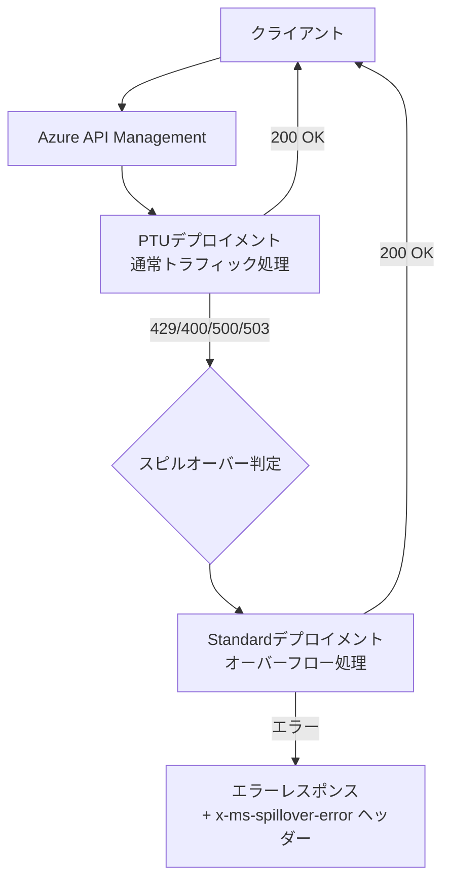
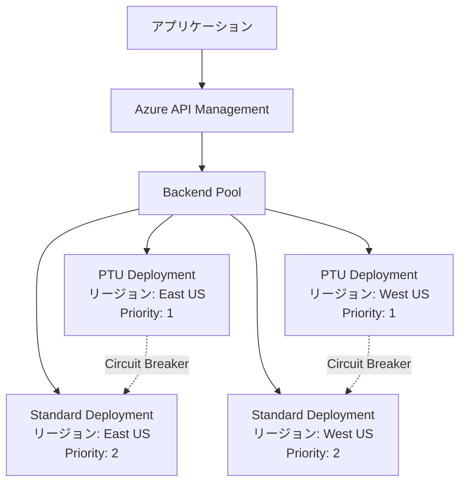
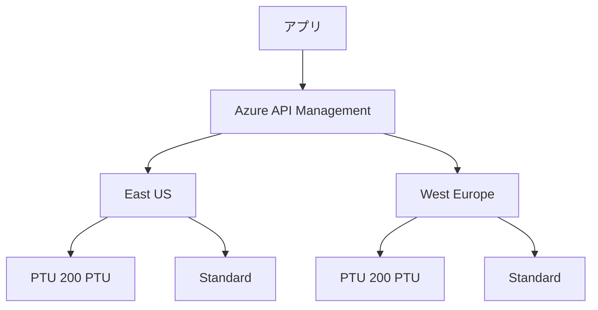

本記事は [Right-size your PTU deployment and save big](https://techcommunity.microsoft.com/blog/azure-ai-foundry-blog/right-size-your-ptu-deployment-and-save-big/4053857) の解説記事です。

## ブログ概要

Azure OpenAI ServiceのProvisioned Throughput Units（PTU）は、専用のモデル処理容量を確保する予約型デプロイメントである。公式ブログでは、PTUのコストが高く見える主因は「ピーク負荷に合わせて全容量をPTUで確保してしまうこと」にあると指摘している。ブログが提案する解決策は**スピルオーバー（Spillover）パターン**であり、PTUで通常トラフィックの大部分（例: 90%）をカバーし、残りのバースト分をPay-As-You-Go（PayGo）デプロイメントに自動ルーティングする構成である。この構成により、未使用PTU容量への課金を大幅に削減できるとMicrosoftは述べている。

## 情報源

- **URL**: [Right-size your PTU deployment and save big](https://techcommunity.microsoft.com/blog/azure-ai-foundry-blog/right-size-your-ptu-deployment-and-save-big/4053857)
- **組織**: Microsoft Azure AI Foundry
- **発表日**: 2024年2月12日
- **補足**: [Provisioned throughput](https://learn.microsoft.com/en-us/azure/ai-services/openai/concepts/provisioned-throughput), [Spillover management](https://learn.microsoft.com/en-us/azure/ai-services/openai/how-to/spillover-traffic-management)

## 技術的背景

### PTU（Provisioned Throughput Units）とは

PTUはAzure OpenAI（現Microsoft Foundry Models）における専用処理容量の単位である。Microsoft公式ドキュメントによれば、PTUデプロイメントは「固定量のモデル処理容量を排他的に確保する」ものであり、Standard（従量課金）デプロイメントとは異なりリクエスト有無にかかわらず容量が保持される。

PTUの主な特徴は以下のとおりである。

- **モデル非依存**: 同一のPTUクォータで任意のサポートモデルをデプロイ可能
- **リージョン固有**: PTUクォータはサブスクリプション・リージョン・デプロイメントタイプごとに付与
- **モデルごとにスループットが異なる**: 同じPTU数でも、軽量モデルと重量モデルでは得られるTPM（Tokens Per Minute）が異なる
- **最小デプロイメントサイズあり**: モデルごとに最低PTU数が設定されている

### なぜPTUは「高コスト」に見えるのか

PTUは時間課金（$/PTU/hr）であり、デプロイメント作成時から削除時まで継続的に課金される。公式ブログでは「ピークに合わせてプロビジョニングすることが前提として仮定されている」ことがコスト高の原因と指摘している。たとえば、ピーク時に1000 PTU必要だが通常時は600 PTUしか使わない場合、残り400 PTU分の課金が常時発生する。

一方、PTUにはStandardデプロイメントにないメリットがある。

- **予測可能なレイテンシ**: 共有テナントによるnoisy neighbor問題が発生しない
- **レイテンシSLA**: モデルごとに定義されたレイテンシターゲットが提供される
- **高負荷時の安定性**: トークン単価でなく容量単価のため、大量リクエスト時にコスト効率が高い

### PayGo（Standard）デプロイメントとの比較

| 項目 | PTU（Provisioned） | Standard（PayGo） |
|------|-------------------|-------------------|
| 課金モデル | PTU数 × 時間単価 | 入力/出力トークン従量課金 |
| レイテンシSLA | あり（モデルごと定義） | なし |
| 容量保証 | 専用確保 | 共有（変動あり） |
| 最適ワークロード | 予測可能な高負荷 | 開発・テスト・変動負荷 |
| アイドル時コスト | 発生（常時課金） | 発生しない |

## 実装アーキテクチャ

### PTU + PayGo ハイブリッド構成

公式ブログが推奨するのは、PTUとPayGoを組み合わせたハイブリッド構成である。以下の図は、スピルオーバーによるトラフィック分散の全体像を示す。



### スピルオーバーの仕組み

Microsoft公式ドキュメントによれば、スピルオーバーは以下の非200レスポンスコードで発動する。

| ステータスコード | トリガー条件 | 説明 |
|:---:|---|---|
| `429` | PTU容量枯渇 | 全PTUが使用中でリクエスト処理不可 |
| `400` | ロングコンテキスト | PTUがサポートするコンテキスト長超過（例: GPT-4.1で128K超） |
| `500` | サーバーエラー | リクエスト処理中の内部エラー |
| `503` | サービス利用不可 | 一時的なサービス障害 |

スピルオーバーが発生したリクエストは、レスポンスヘッダーで識別できる。

- `x-ms-spillover-from-deployment`: スピルオーバー元のPTUデプロイメント名
- `x-ms-deployment-name`: 実際にリクエストを処理したデプロイメント名
- `x-ms-spillover-error`: スピルオーバーをトリガーした元のエラーコード（429, 500, 503等）

### 2つのスピルオーバーモード

Microsoft公式ドキュメントでは、2つのスピルオーバー構成モードが紹介されている。

**1. Deployment-level（デプロイメントレベル）**

デプロイメントのプロパティ `spilloverDeploymentName` にStandardデプロイメント名を設定する。このデプロイメントへの全リクエストに対してスピルオーバーが有効になる。

```bash
# REST APIでの設定例（公式ドキュメントより）
curl -X PUT "https://management.azure.com/subscriptions/{sub-id}/resourceGroups/{rg}/providers/Microsoft.CognitiveServices/accounts/{account}/deployments/my-ptu-deployment?api-version=2024-10-01" \
  -H "Content-Type: application/json" \
  -H "Authorization: Bearer $TOKEN" \
  -d '{
    "sku": {
      "name": "GlobalProvisionedManaged",
      "capacity": 100
    },
    "properties": {
      "spilloverDeploymentName": "my-standard-deployment",
      "model": {
        "format": "OpenAI",
        "name": "gpt-4o-mini",
        "version": "2024-07-18"
      }
    }
  }'
```

**2. Request-level（リクエストレベル）**

推論リクエストごとに `x-ms-spillover-deployment` ヘッダーを設定する。ヘッダーが付与されたリクエストのみスピルオーバー対象となり、付与されないリクエストはPTUが429を返した場合そのままエラーとなる。

推論リクエストに `x-ms-spillover-deployment: <standard-deployment-name>` ヘッダーを付与するだけでよい。公式ドキュメントでは、Deployment-levelとRequest-levelの両方が設定された場合Deployment-levelが優先されると記載されている。リクエスト単位の制御のみを行いたい場合は `spilloverDeploymentName` プロパティを設定せず、ヘッダーのみで運用する。

### 構成パターン比較

以下は、月間のトラフィックプロファイルに基づく構成パターンの比較である。ピーク時に1000 PTU相当の処理が必要で、通常時は平均600 PTU相当の負荷がかかるワークロードを仮定する。

| 構成パターン | PTU確保量 | PayGo利用 | 概算月間コスト構成 | 特徴 |
|---|---|---|---|---|
| PTU 100% | 1000 PTU | なし | PTU全量を常時課金 | レイテンシ最優先、コスト最大 |
| PTU 90:10 | 900 PTU | ピーク時10% | PTU 90% + PayGo少量 | 推奨パターン、コスト効率良好 |
| PTU 70:30 | 700 PTU | バースト時30% | PTU 70% + PayGo中量 | コスト重視、レイテンシ変動許容 |
| PayGo 100% | なし | 全量 | トークン従量課金のみ | レイテンシSLAなし、低負荷向き |

公式ブログでは、90:10構成（PTU 90% + PayGo 10%）により、未使用PTUコストの50%以上を削減できるケースがあると紹介されている。

### PTUコスト計算

PTUのサイジングには以下の要素が関与する。Microsoft公式ドキュメントによれば、PTU必要数の算出式は次のとおりである。

$$
\text{Normalized TPM} = \text{RPM} \times (\text{Avg Input Tokens} + \text{Avg Output Tokens} \times R_{\text{out/in}}) \times (1 - C_{\text{cache}})
$$

$$
\text{Required PTUs} = \left\lceil \frac{\text{Normalized TPM}}{\text{Input TPM per PTU}} \right\rceil
$$

ここで:
- $R_{\text{out/in}}$: 出力トークンと入力トークンの処理コスト比率（モデルごとに定義。GPT-4.1以降ではStandard課金の出力/入力価格比に一致）
- $C_{\text{cache}}$: プロンプトキャッシュ率（キャッシュされたトークンはPTU容量を消費しない）
- $\text{RPM}$: 分あたりリクエスト数
- $\text{Input TPM per PTU}$: モデルごとのPTUあたり入力TPM値

Azure AI Foundry（Classic）ポータルには[Capacity Calculator](https://ai.azure.com/resource/calculator)が提供されており、ガイド付きでPTUサイジングの見積もりが可能である。

### API Management Backend Pool構成

大規模運用では、Azure API Management（APIM）を前段に配置し、バックエンドプールでPTUデプロイメントとStandardデプロイメントを統合管理する構成が推奨される。



APIMポリシーでは、PTUバックエンドにPriority 1、PayGoバックエンドにPriority 2を設定し、サーキットブレーカー（例: 10秒間に429が5回でトリップ、60秒後にハーフオープン）を組み合わせる。スピルオーバー（同一Foundryリソース内の自動リダイレクト）とAPIMサーキットブレーカー（リソース間・リージョン間ルーティング）の2段構えでトラフィックを制御する構成となる。

## Production Deployment Guide

### 構成パターンの選択指針

本番環境へのPTUデプロイメントでは、ワークロードの特性に応じて以下の3段階の構成を検討する。

#### Small構成（月間100万リクエスト未満）

単一リージョン・単一PTUデプロイメント + Standardスピルオーバーの最小構成。


**特徴**:
- 管理対象が少なく運用負荷が低い
- 単一リージョン障害に弱い
- PTUのDeployment-levelスピルオーバーのみで構成可能

#### Medium構成（月間100万-1000万リクエスト）

マルチリージョン + APIM + Priority-basedルーティング。



**特徴**:
- リージョン障害時のフェイルオーバーが可能
- APIMのサーキットブレーカーで高度なトラフィック制御
- PTU + Standardの組み合わせでコスト最適化

#### Large構成（月間1000万リクエスト超）

Global Provisioned + Data Zone Provisioned + APIM + Azure Front Door/Traffic Managerによるジオルーティング構成。複数リージョン（East US / West Europe / East Asia等）にGlobal ProvisionedとStandardデプロイメントを分散配置し、データ居住性とレイテンシを両立する。

### Terraform構成例

#### Small構成: 単一リージョンPTU + スピルオーバー

```hcl
resource "azurerm_cognitive_account" "openai" {
  name                = "openai-ptu-service"
  location            = "eastus"
  resource_group_name = azurerm_resource_group.main.name
  kind                = "OpenAI"
  sku_name            = "S0"
}

resource "azurerm_cognitive_deployment" "ptu" {
  name                 = "gpt-4o-ptu"
  cognitive_account_id = azurerm_cognitive_account.openai.id
  model {
    format  = "OpenAI"
    name    = "gpt-4o"
    version = "2024-11-20"
  }
  sku {
    name     = "GlobalProvisionedManaged"
    capacity = 100  # PTU数
  }
}

resource "azurerm_cognitive_deployment" "standard" {
  name                 = "gpt-4o-standard"
  cognitive_account_id = azurerm_cognitive_account.openai.id
  model {
    format  = "OpenAI"
    name    = "gpt-4o"
    version = "2024-11-20"
  }
  sku {
    name     = "Standard"
    capacity = 120  # 千TPM単位
  }
}
```

Large構成では、`for_each` によるマルチリージョンデプロイメント、APIM Premium SKU、Azure Monitor メトリックアラート（`ProvisionedManagedUtilizationV2` 80%閾値）を組み合わせて構成する。詳細はAzure公式のTerraform providerドキュメントを参照されたい。

### 運用・監視設定

#### 監視すべきメトリクス

PTUデプロイメントの運用では、Azure Monitorの以下のメトリクスを監視する。

| メトリクス | 用途 | アラート閾値の目安 |
|---|---|---|
| `ProvisionedManagedUtilizationV2` | PTU使用率 | 80%超で警告、95%超で緊急 |
| `Azure OpenAI Requests`（`ModelDeploymentName` 分割） | デプロイメント別リクエスト数 | - |
| `Azure OpenAI Requests`（`IsSpillover` 分割） | スピルオーバー比率 | スピルオーバー率20%超で見直し検討 |
| `Azure OpenAI Requests`（`StatusCode` 分割） | エラー率 | 429率5%超でPTU増設検討 |
| `ProcessedPromptTokens` / `GeneratedCompletionTokens` | トークン消費量 | サイジング検証に使用 |
| `AzureOpenAITimeToResponse` | レスポンスタイム | P95がSLA超過で調査 |

公式ドキュメントによれば、スピルオーバーしたリクエストはStandardデプロイメント側で `IsSpillover=True` として記録され、PTUデプロイメント側では429としてカウントされない。このため、正確なスピルオーバー率の把握には `IsSpillover` 分割の確認が必須である。

ダッシュボードには、PTU Utilization（ゲージ、閾値: 70%/85%）、Request Distribution（デプロイメント別スタックバー）、Spillover Rate（`IsSpillover` 分割の時系列）、Latency P50/P95/P99、Cost Estimation（PTU時間課金 + PayGoトークン課金合計）の5パネルを構成することを推奨する。

### コスト最適化チェックリスト

以下は、PTUデプロイメントのコスト最適化を行う際に確認すべき項目である。

**サイジング**:
1. Capacity Calculatorで算出したPTU数と実使用率を比較しているか
2. ピークではなくP90-P95の負荷に合わせてPTUをサイジングしているか
3. プロンプトキャッシュ率（$C_{\text{cache}}$）を実測値で反映しているか
4. 出力/入力トークン比率（$R_{\text{out/in}}$）をモデル固有値で計算しているか
5. 最小PTUデプロイメントサイズ以上で確保しているか

**スピルオーバー構成**:
6. PTUデプロイメントにスピルオーバーが設定されているか
7. スピルオーバー先のStandardデプロイメントが同一Foundryリソース内にあるか
8. スピルオーバー先のモデル・バージョンがPTUデプロイメントと一致しているか
9. Request-levelスピルオーバーの使い分けが必要なワークロードを識別しているか
10. スピルオーバー率が継続的に20%を超えていないか（超える場合はPTU増設を検討）

**課金・予約**:
11. Azure Reservationsの適用を検討しているか（1か月または1年）
12. Reservation購入前にデプロイメントを作成し容量を確認しているか
13. Reservationのスコープ（サブスクリプション/リソースグループ）を適切に設定しているか
14. Reservationの利用率をCost Managementで定期確認しているか
15. 時間課金のまま放置しているデプロイメントがないか

**モニタリング**:
16. PTU使用率のアラートを設定しているか（80%/95%）
17. スピルオーバーメトリクス（`IsSpillover` 分割）を監視しているか
18. Standard側の429エラーも監視しているか（スピルオーバー先もTPM制限あり）
19. レイテンシP95/P99を継続監視しているか
20. コスト推移をダッシュボードで可視化しているか

**容量管理**:
21. PTUクォータ残量の把握とクォータ申請リードタイム（2-4週間）の確認
22. デプロイメント削減後の容量再取得保証がないことの理解
23. Global / Data Zone / Regional の適切な使い分けの検討

## パフォーマンス最適化

### PTU vs PayGo のレイテンシ特性

PTUデプロイメントはMicrosoft公式ドキュメントで「定義されたレイテンシターゲット」を持つと記載されており、Standard（PayGo）にはレイテンシSLAが存在しない。PTUの主なパフォーマンス上の利点は以下である。

- **専用容量**: 他のテナントとリソースを共有しないため、noisy neighbor問題が発生しない
- **一貫したレイテンシ**: トラフィック量に依存しない安定した応答時間
- **Priority Processing（優先処理）との比較**: Priority Processingもレイテンシターゲットを提供するが、長期コミットメント不要のトークン従量課金型である

### スピルオーバー時の性能変動

スピルオーバーが発生すると、以下の性能変動が生じる可能性がある。

1. **追加レイテンシ**: 公式ドキュメントでは「PTUデプロイメントへの送信を優先した後にオーバーフロー分をStandardに送る」と記載されており、この判定処理による追加レイテンシが発生し得る
2. **StandardデプロイメントのSLAなし**: スピルオーバー先のStandardデプロイメントにはレイテンシSLAがないため、ピーク時にはPTUより応答が遅くなる可能性がある
3. **二重障害リスク**: PTUがエラーを返し、かつスピルオーバー先のStandardも失敗した場合、Standardのエラーレスポンスがクライアントに返される（`x-ms-spillover-error` ヘッダーで元のPTUエラーコードが確認可能）

これらの特性から、レイテンシに厳密な要件があるリクエストに対しては、Request-levelスピルオーバーを無効にし、PTUのみで処理する運用も検討すべきである。

## 運用での学び

### PTU利用率の監視と最適化サイクル

PTUの運用は「Capacity Calculatorで初期サイジング → 1-2週間の `ProvisionedManagedUtilizationV2` 観測 → ピーク/平均使用率・スピルオーバー率の分析 → PTU数調整」のサイクルで回す。公式ドキュメントでは「容量は動的に変化する」と明記されており、PTU削減後の再取得は保証されないため、増設は段階的に、削減は慎重に行う必要がある。

### Azure Reservations の活用

本番環境での継続利用にはAzure Reservations（1か月または1年コミットメント）による割引が推奨される。重要な注意点として、Reservationsは容量を保証しないため、先にデプロイメントを作成して容量を確保した後にReservationを購入する手順が公式で推奨されている。Reservationsはデプロイメントタイプ（Global / Data Zone / Regional）ごとに購入する。

### クォータ申請のタイミング

PTUクォータはサブスクリプションに付与されるポリシー上限であり、容量（実際にデプロイ可能なPTU数）とは別概念である。追加クォータは[リクエストフォーム](https://aka.ms/oai/stuquotarequest)から申請し、承認には数日かかる。クォータがあっても容量不足ならデプロイメント作成は失敗するため、本番拡張には2-4週間のリードタイムを見込むべきである。

## 学術研究との関連

PTUのスピルオーバーパターンは、LLM推論サービングにおけるリソース最適化の学術研究と密接に関連している。

**SageServe**（Jaiswal et al., arXiv:2502.14617）は、Microsoft Office 365の1日1000万超のリクエストを分析し、トラフィック予測に基づくGPU VMのオートスケーリングフレームワークを提案している。PTUの「固定容量 + スピルオーバー」は、SageServeの「短期ルーティング + 長期スケーリング」の産業実装と位置づけることができる。SageServeはベースライン比でGPU時間25%削減、無駄なスケーリング80%削減を報告しており、PTUの適正サイジングが大規模運用でのコスト削減に直結することを裏付けている。

**Intelligent Router**（Jain et al., arXiv:2408.13510）は、LLM推論のprefillフェーズとdecodeフェーズの特性差を考慮した強化学習ベースのルーティングシステムである。ベンチマークで既存手法比11%のレイテンシ改善、本番ワークロードで7.8%の改善を達成している。PTUのスピルオーバーは静的なルール（HTTPステータスコード）に基づくのに対し、Intelligent Routerは動的なワークロード特性に基づく適応的ルーティングを行う。将来的には、PTUスピルオーバーにこのような学習ベースのルーティング戦略が統合される可能性がある。

## まとめと実践への示唆

本記事では、MicrosoftのPTUスピルオーバーパターンを中心に、Azure OpenAIの予約容量管理とコスト最適化手法を解説した。PTUのコストが高く見える原因は「ピーク想定の過剰プロビジョニング」であり、P90-P95の負荷に合わせたサイジング + PayGoスピルオーバーが有効な対策である。

実践においては、以下の3点が最も重要である。

1. **Capacity Calculatorで根拠あるサイジングを行い、ピーク想定を避ける**: PTUの必要量はトラフィックプロファイル・キャッシュ率・出力比率から算出でき、感覚的な「念のため多めに」は不要である
2. **スピルオーバーを有効化してバースト耐性を確保する**: Deployment-levelで全リクエスト対象とするか、Request-levelで重要度に応じた制御を行う
3. **監視→分析→調整のサイクルを回す**: PTU使用率・スピルオーバー率・コストを継続的に観測し、Azure Reservationsの適用タイミングを見極める

本記事は解説であり、実環境での検証は行っていない。具体的なPTU数・コスト削減率はワークロード特性により大きく変動するため、必ず自環境での計測に基づいて判断されたい。

## 参考文献

1. [Right-size your PTU deployment and save big](https://techcommunity.microsoft.com/blog/azure-ai-foundry-blog/right-size-your-ptu-deployment-and-save-big/4053857) - Microsoft Tech Community Blog, 2024年2月
2. [Provisioned throughput for Foundry Models](https://learn.microsoft.com/en-us/azure/ai-services/openai/concepts/provisioned-throughput) - Microsoft Learn
3. [Manage traffic with spillover for provisioned deployments](https://learn.microsoft.com/en-us/azure/ai-services/openai/how-to/spillover-traffic-management) - Microsoft Learn
4. [Determine PTU sizing for a workload](https://learn.microsoft.com/en-us/azure/ai-services/openai/how-to/provisioned-throughput-sizing) - Microsoft Learn
5. [Azure Reservations for provisioned throughput](https://learn.microsoft.com/en-us/azure/ai-services/openai/concepts/provisioned-throughput-billing) - Microsoft Learn
6. Jaiswal, S. et al. "SageServe: Optimizing LLM Serving on Cloud Data Centers with Forecast Aware Auto-Scaling" arXiv:2502.14617, 2025
7. Jain, K. et al. "Intelligent Router for LLM Workloads: Improving Performance Through Workload-Aware Load Balancing" arXiv:2408.13510, 2024
8. [Zenn記事: Azure OpenAI負荷分散の運用設計：PTUサイジングから監視・自動スケーリングまで](https://zenn.dev/0h_n0/articles/05003ecf02b6dc)
