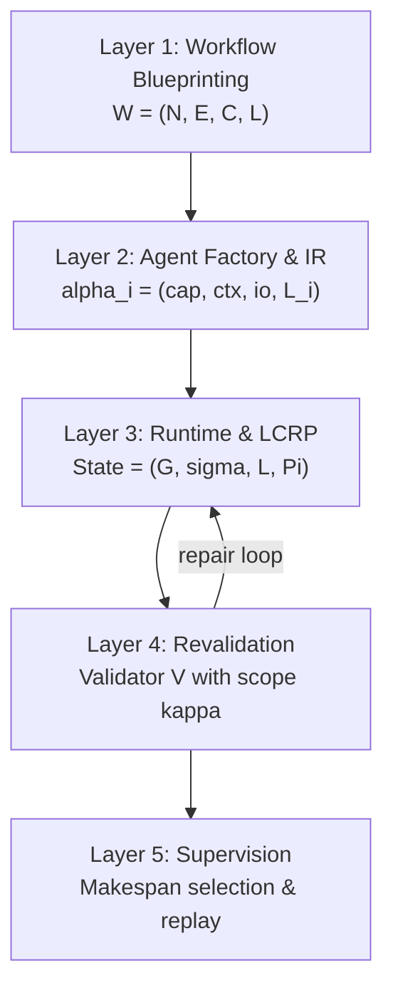

## 論文概要（Abstract）

ALASは、LLMベースのエージェントが抱える4つの根本的欠陥――自己検証の不在、コンテキスト侵食、次トークン近視、永続状態の欠如――に体系的に対処するマルチエージェントフレームワークである。各プランをロール特化エージェントに分解し、バージョン管理された実行ログによる自動状態追跡を装備し、軽量プロトコルで調整する。障害発生時にはグローバル再計画を回避し、局所補償によりカスケード障害を抑制する。実世界規模のジョブショップスケジューリングベンチマークにおいて、実行可能率83.7%、最適解到達率で従来手法を上回る結果を報告している。

本記事は [https://arxiv.org/abs/2505.12501](https://arxiv.org/abs/2505.12501) の解説記事です。

この記事は [Zenn記事: LangGraphチェックポイント機構で社内ヘルプデスクの中断復帰を実装する](https://zenn.dev/0h_n0/articles/4caf31c9560691) の深掘りです。

## 情報源

- **arXiv ID**: 2505.12501
- **URL**: [https://arxiv.org/abs/2505.12501](https://arxiv.org/abs/2505.12501)
- **著者**: Edward Y. Chang, Longling Geng（Stanford University）
- **発表年**: 2025
- **分野**: cs.AI, cs.MA
- **論文規模**: 36ページ、10図、19表

## 背景と動機（Background & Motivation）

LLMを用いたプランニングは、旅行計画やコード生成といったタスクで実用化が進んでいるが、ジョブショップスケジューリング（JSSP）のような制約充足型の計画問題では、既存のマルチエージェントフレームワーク（AutoGen、CrewAIなど）が深刻な課題を抱えている。

第一に、LLMは自身の出力の正しさを検証できない。提案者が同時に承認者となる構造では、制約違反を見逃す「循環検証」の問題が発生する。第二に、長いコンテキストウィンドウの中間部分で情報が失われる「コンテキスト侵食」により、計画の一貫性が崩れる。第三に、次トークン予測の最尤推定バイアスにより、確率的に高い出力が実行可能性を満たすとは限らない。第四に、LLMは本質的にステートレスであり、過去の決定や制約の履行状況を追跡する仕組みを持たない。

著者らは、これらの問題をフレームワークの**システム特性**として解決すべきだと主張している。個々のプロンプト改善ではなく、バリデータ分離・バージョン管理ログ・局所修復プロトコルというアーキテクチャレベルの設計で、トランザクション的な信頼性（ACID的保証）をLLMプランニングに持ち込むのがALASの設計思想である。

## 主要な貢献（Key Contributions）

- **5層アーキテクチャの提案**: ワークフロー設計、エージェントファクトリ、ランタイム実行、再検証、監督の5層でプランニングの信頼性をシステム的に実現
- **局所カスケード修復プロトコル（LCRP）**: 障害発生時に影響範囲を最小近傍に限定し、局所的な修復で対応。グローバル再計画を回避してトークン使用量を60%削減
- **独立バリデータによる検証分離**: プランナーと独立したバリデータが、境界付きコンテキスト $\kappa$ で検証を実行し、循環検証問題を解消
- **エンジン非依存の中間表現（IR）**: Amazon States Language（ASL）やArgo Workflowsへのマッピングを提供し、実運用ワークフローエンジンとの接続を実現
- **JSSP実ベンチマークでの実証**: DMU、Taillard、ABZ等の古典的ベンチマークで、実行可能率83.7%・最適解到達率最大100%を達成

## 技術的詳細（Technical Details）

### 5層アーキテクチャ

ALASは計画問題の信頼性を5つの層に分解して実現する。



**Layer 1: ワークフロー設計（Workflow Blueprinting）** では、タスク仕様 $\mathcal{O}$ と制約集合 $D$、障害モデル $\Phi$ からワークフローテンプレートを合成する。

$$
\mathcal{W}_{\text{template}} = (\mathcal{N}, \mathcal{E}, \mathcal{C}, \mathcal{L})
$$

ここで $\mathcal{N}$ はロールプロファイル $\mathcal{P}_{n_i}$ を持つノード集合、$\mathcal{E}$ はデータ/制御エッジ（修復可能タイプ $\in \{\text{time}, \text{order}, \text{resource}, \text{none}\}$）、$\mathcal{C}$ はグローバル制約、$\mathcal{L}$ はバージョン管理ログスキーマである。

**Layer 2: エージェントファクトリ & 正規IR** では、ロール仕様からエージェントインスタンスを生成する。各エージェント $\alpha_i$ は以下の4つ組で定義される。

$$
\alpha_i = \langle \text{cap}_i, \text{ctx}_i, \text{io}_i, \mathcal{L}_i \rangle
$$

$\text{cap}_i$ は能力プロファイル、$\text{ctx}_i$ はコンテキスト上限（最大トークン数）、$\text{io}_i$ は入出力スキーマ、$\mathcal{L}_i$ はノードローカルのログスキーマである。正規IRはリトライ、キャッチ、タイムアウト、冪等性キー、補償アクション、ループガードをポリシーセット $\Pi$ として明示的に記述し、ASLやArgo Workflowsへの変換を可能にする。

**Layer 3: ランタイム実行 & LCRP** は、実行状態 $(\mathcal{G}, \sigma, L, \Pi)$ を管理する。$\mathcal{G}$ はワークフローDAG、$\sigma$ は現在のアサインメントマップ、$L$ はバージョン管理ログ、$\Pi$ はポリシーセットである。障害検出時にはLCRPが起動する。

**Layer 4: 再検証** では、修復後に独立バリデータ $V$ が境界付きプロンプトスコープ $\kappa$ で実行可能性を再確認する。成功するかトークン/イテレーション予算を使い切るまで繰り返す。

**Layer 5: 監督** は、最良のメイクスパンを持つ計画を選択し、バージョン管理ログによる決定論的リプレイを可能にする。

### 局所カスケード修復プロトコル（LCRP）

LCRPは障害発生時の修復を4フェーズで実行する。

**Phase 1（近傍スコーピング）**: 障害点 $v$ からの距離 $\delta$ 以内のノード集合 $N(v)$ を特定し、影響を受けるアサインメントの部分写像 $\sigma|_{N(v)}$ を収集する。

**Phase 2（最小編集提案）**: 修復仕様 $\rho_i$ に基づく編集プリミティブを適用する。

$$
\rho_i = (\text{primitives}, \text{bounds})
$$

プリミティブには時間シフト（$\Delta t_{\max}$ 以内の開始/終了時刻変更）、隣接スワップ（先行制約を保持した操作順入替）、リソース再割当がある。制約として、$N(v)$ 外の実行可能性を保持する必要がある。

**Phase 3（再検証）**: 独立バリデータ $V$ が編集後のアサインメント $\sigma'$ を制約集合 $\mathcal{C}$ に対して検証する。失敗時は $N(v)$ を拡大するか、グローバル再計画にエスカレーションする。

**Phase 4（コミット）**: ログにバージョン+1のエントリを追加し、$\sigma \leftarrow \sigma'$ で状態を更新する。修復の計算量は近傍直径 $\delta$ と編集数で有界である。

### バージョン管理ログの構造

ログエントリは6つ組で構成される。

$$
\text{logEntry} = \langle ts, \text{nodeId}, \text{eventType}, \text{payload}, \text{version}, \text{correlationId} \rangle
$$

$ts$ はUnixタイムスタンプ、$\text{eventType} \in \{\text{proposal}, \text{validation}, \text{repair}, \text{commit}, \text{failure}\}$、$\text{version}$ は単調増加のシーケンス番号、$\text{correlationId}$ はエントリ間の因果関係を示す。この構造により、実行の決定論的リプレイとリストアポイントからの再開が可能になる。

### 4つのLLM欠陥への対応

| LLM欠陥 | ALASの解決策 |
|---------|-------------|
| 循環検証（提案者が自身を承認） | 独立バリデータ $V$、境界付きコンテキスト $\kappa$ で検証 |
| コンテキスト侵食（中間情報の消失） | バージョン管理ログ $L$ で状態遷移を記録、再検証は境界付きログスライスを使用 |
| 最尤バイアス（高確率 $\neq$ 実行可能） | 明示的な編集上限 $\rho_i$ と局所探索で修復 |
| ステートレス実行（状態追跡なし） | 構造化ログ（ts, nodeId, eventType, payload, version, correlationId）による永続化 |

## 実装のポイント（Implementation）

ALASの中間表現（IR）は、ASLとArgo Workflowsの双方にマッピングされる設計となっている。IRの各ノードにはポリシー参照が付与され、リトライ（指数バックオフ付き）、エラーハンドリング、タイムアウト、冪等性キーが宣言的に記述される。

```python
from dataclasses import dataclass, field
from typing import Literal


@dataclass(frozen=True)
class RetryPolicy:
    """リトライポリシー（指数バックオフ付き）。

    Attributes:
        max_attempts: 最大リトライ回数
        backoff_rate: バックオフ倍率
        initial_delay_ms: 初回待機時間（ミリ秒）
    """

    max_attempts: int = 3
    backoff_rate: float = 2.0
    initial_delay_ms: int = 100


@dataclass(frozen=True)
class CompensationAction:
    """障害時の補償アクション定義。

    Attributes:
        action: 実行する補償処理の識別子
        guard: 補償実行の前提条件
        max_retries: 補償自体のリトライ上限
    """

    action: str
    guard: str
    max_retries: int = 2


@dataclass(frozen=True)
class AgentPolicy:
    """ALASエージェントのポリシーセット（IR仕様に準拠）。

    論文Section 3.2のPolicy Set Piに対応する。
    ASL/Argo Workflowsへの変換時にこの構造から
    対応するフィールドを生成する。

    Attributes:
        retry: リトライ戦略
        catch: エラータイプ別のハンドラマッピング
        timeout_seconds: 最大実行時間
        idempotency_key: 冪等性保証のキー
        compensation: 障害時の補償アクション
        loop_max_iterations: ループガードの上限
    """

    retry: RetryPolicy = field(default_factory=RetryPolicy)
    catch: dict[str, str] = field(
        default_factory=lambda: {
            "ConstraintViolation": "repair_node",
            "default": "escalate",
        }
    )
    timeout_seconds: int = 60
    idempotency_key: str = "operation_id"
    compensation: CompensationAction | None = None
    loop_max_iterations: int = 10
```

実装上の注意点として、著者らは以下を挙げている。バリデータ $V$ のコンテキストスコープ $\kappa$ は、検証精度とトークンコストのトレードオフであり、JSSPベンチマークでは直近のログスライスに限定することで、全コンテキスト再投入と同等の精度を維持しつつトークン使用量を大幅に削減している。また、冪等性キーの設計が補償アクションの安全性を左右するため、各操作に一意の識別子を付与し、重複実行を防止する仕組みが不可欠である。

## Production Deployment Guide

ALASの3層アーキテクチャをAWS上に実装する場合のリファレンス構成を示す。以下のコスト試算は2026年7月時点のAWS ap-northeast-1（東京リージョン）料金に基づく概算値であり、実際のコストはトラフィックパターンやバースト使用量により変動する。最新料金は[AWS料金計算ツール](https://calculator.aws/)で確認を推奨する。

### AWS実装パターン（コスト最適化重視）

#### トラフィック量別の推奨構成

| 構成 | 規模 | 月額概算 | 主要サービス |
|------|------|----------|-------------|
| **Small** | ~100 req/日 | $80-180 | Lambda + Step Functions + Bedrock + DynamoDB |
| **Medium** | ~1,000 req/日 | $400-900 | ECS Fargate + Step Functions + Bedrock + DynamoDB |
| **Large** | 10,000+ req/日 | $2,500-5,500 | EKS + Karpenter + Spot + Bedrock Batch |

**Small構成（~100 req/日）**:
Lambda関数でLayer 1-2のワークフロー生成とエージェントファクトリを実行し、Step FunctionsでLayer 3のランタイムオーケストレーションを担当する。DynamoDB（オンデマンド）がバージョン管理ログ $L$ の永続化を担い、Bedrockが各エージェントのLLM推論を提供する。Step Functionsのスタンダードワークフローは状態遷移あたり$0.000025で、LCRP修復ループの状態追跡に適している。月額内訳: Lambda $5-15、Step Functions $5-10、Bedrock（Claude Haiku 4.5） $40-100、DynamoDB $10-30、CloudWatch $5-10。

**Medium構成（~1,000 req/日）**:
ECS Fargateで常駐のランタイムモニタ（Layer 3）を稼働させ、エージェント間の低レイテンシ通信を実現する。Step Functionsはワークフロー全体の制御フローを管理し、DynamoDBのプロビジョンドキャパシティでログ書き込みのスループットを安定化する。Bedrock Claude Sonnet 4.6（入力$3/100万トークン、出力$15/100万トークン）を使用し、バリデータにはHaiku 4.5を割り当てることでコストを抑制する。

**Large構成（10,000+ req/日）**:
EKSクラスタ上でKarpenterによるSpot Instancesの自動プロビジョニングを行い、Bedrock Batch APIで非同期推論を50%コスト削減する。複数のLCRP修復ループを並列実行するため、Pod単位でのスケーリングが有効となる。Prompt Cachingの有効化により、ワークフローテンプレートの反復的な検証で30-90%のトークンコスト削減が可能である。

### Terraformインフラコード

#### Small構成（Serverless）

```hcl
# ALAS Small構成: Lambda + Step Functions + DynamoDB
# 2026年7月 ap-northeast-1 想定

terraform {
  required_version = ">= 1.9"
  required_providers {
    aws = {
      source  = "hashicorp/aws"
      version = "~> 5.70"
    }
  }
}

provider "aws" {
  region = "ap-northeast-1"
}

# --- DynamoDB: バージョン管理ログ (Layer 3 永続状態) ---
resource "aws_dynamodb_table" "alas_execution_log" {
  name         = "alas-execution-log"
  billing_mode = "PAY_PER_REQUEST"
  hash_key     = "correlation_id"
  range_key    = "version"

  attribute {
    name = "correlation_id"
    type = "S"
  }

  attribute {
    name = "version"
    type = "N"
  }

  attribute {
    name = "node_id"
    type = "S"
  }

  global_secondary_index {
    name            = "node-index"
    hash_key        = "node_id"
    range_key       = "version"
    projection_type = "ALL"
  }

  point_in_time_recovery {
    enabled = true
  }

  ttl {
    attribute_name = "ttl_timestamp"
    enabled        = true
  }

  tags = {
    Project = "alas-framework"
    Layer   = "runtime-log"
  }
}

# --- IAM: Lambda実行ロール（最小権限） ---
resource "aws_iam_role" "alas_lambda_role" {
  name = "alas-lambda-execution-role"

  assume_role_policy = jsonencode({
    Version = "2012-10-17"
    Statement = [{
      Action    = "sts:AssumeRole"
      Effect    = "Allow"
      Principal = { Service = "lambda.amazonaws.com" }
    }]
  })
}

resource "aws_iam_role_policy" "alas_lambda_policy" {
  name = "alas-lambda-policy"
  role = aws_iam_role.alas_lambda_role.id

  policy = jsonencode({
    Version = "2012-10-17"
    Statement = [
      {
        Effect = "Allow"
        Action = [
          "dynamodb:PutItem",
          "dynamodb:GetItem",
          "dynamodb:Query",
          "dynamodb:UpdateItem"
        ]
        Resource = [
          aws_dynamodb_table.alas_execution_log.arn,
          "${aws_dynamodb_table.alas_execution_log.arn}/index/*"
        ]
      },
      {
        Effect   = "Allow"
        Action   = ["bedrock:InvokeModel"]
        Resource = ["arn:aws:bedrock:ap-northeast-1::foundation-model/*"]
      },
      {
        Effect = "Allow"
        Action = [
          "logs:CreateLogGroup",
          "logs:CreateLogStream",
          "logs:PutLogEvents"
        ]
        Resource = "arn:aws:logs:*:*:*"
      }
    ]
  })
}

# --- Lambda: ワークフロー生成 (Layer 1-2) ---
resource "aws_lambda_function" "alas_workflow_generator" {
  function_name = "alas-workflow-generator"
  runtime       = "python3.12"
  handler       = "handler.generate_workflow"
  role          = aws_iam_role.alas_lambda_role.arn
  timeout       = 300
  memory_size   = 512

  filename         = "dist/workflow_generator.zip"
  source_code_hash = filebase64sha256("dist/workflow_generator.zip")

  environment {
    variables = {
      DYNAMODB_TABLE = aws_dynamodb_table.alas_execution_log.name
      BEDROCK_REGION = "ap-northeast-1"
    }
  }

  tracing_config {
    mode = "Active"
  }
}

# --- CloudWatch アラーム ---
resource "aws_cloudwatch_metric_alarm" "lambda_errors" {
  alarm_name          = "alas-lambda-error-rate"
  comparison_operator = "GreaterThanThreshold"
  evaluation_periods  = 2
  metric_name         = "Errors"
  namespace           = "AWS/Lambda"
  period              = 300
  statistic           = "Sum"
  threshold           = 5
  alarm_description   = "ALAS Lambda error rate exceeded threshold"

  dimensions = {
    FunctionName = aws_lambda_function.alas_workflow_generator.function_name
  }
}
```

#### Large構成（Container）

```hcl
# ALAS Large構成: EKS + Karpenter + Spot Instances
# 2026年7月 ap-northeast-1 想定

module "eks" {
  source  = "terraform-aws-modules/eks/aws"
  version = "~> 20.0"

  cluster_name    = "alas-production"
  cluster_version = "1.31"

  vpc_id     = module.vpc.vpc_id
  subnet_ids = module.vpc.private_subnets

  cluster_endpoint_public_access = false

  eks_managed_node_groups = {
    system = {
      instance_types = ["m7i.large"]
      min_size       = 2
      max_size       = 4
      desired_size   = 2
      capacity_type  = "ON_DEMAND"
    }
  }
}

# --- Karpenter: Spot優先のオートスケーリング ---
resource "kubectl_manifest" "karpenter_node_pool" {
  yaml_body = yamlencode({
    apiVersion = "karpenter.sh/v1"
    kind       = "NodePool"
    metadata   = { name = "alas-agents" }
    spec = {
      template = {
        spec = {
          requirements = [
            {
              key      = "karpenter.sh/capacity-type"
              operator = "In"
              values   = ["spot", "on-demand"]
            },
            {
              key      = "node.kubernetes.io/instance-type"
              operator = "In"
              values   = ["m7i.xlarge", "m7i.2xlarge", "c7i.xlarge"]
            }
          ]
        }
      }
      limits   = { cpu = "128", memory = "512Gi" }
      disruption = {
        consolidationPolicy = "WhenEmptyOrUnderutilized"
        consolidateAfter    = "30s"
      }
    }
  })
}

# --- Cost Explorer アラート ---
resource "aws_ce_anomaly_monitor" "alas_cost" {
  name              = "alas-cost-anomaly-monitor"
  monitor_type      = "DIMENSIONAL"
  monitor_dimension = "SERVICE"
}

resource "aws_budgets_budget" "alas_monthly" {
  name         = "alas-monthly-budget"
  budget_type  = "COST"
  limit_amount = "5000"
  limit_unit   = "USD"
  time_unit    = "MONTHLY"

  notification {
    comparison_operator       = "GREATER_THAN"
    threshold                 = 80
    threshold_type            = "PERCENTAGE"
    notification_type         = "ACTUAL"
    subscriber_email_addresses = ["ops-team@example.com"]
  }
}
```

### 運用・監視設定

#### CloudWatch Logs Insights クエリ

```sql
-- LCRP修復の成功率とレイテンシ分析
fields @timestamp, @message
| filter event_type = "repair"
| stats count() as repair_count,
        avg(duration_ms) as avg_repair_ms,
        pct(duration_ms, 95) as p95_repair_ms,
        sum(case when status = "success" then 1 else 0 end) / count() * 100 as success_rate
| by bin(1h) as time_bucket

-- Bedrockトークン使用量の日次推移
fields @timestamp, input_tokens, output_tokens
| filter source = "bedrock"
| stats sum(input_tokens) as total_input,
        sum(output_tokens) as total_output,
        sum(input_tokens + output_tokens) as total_tokens
| by bin(1d) as day
```

#### CloudWatch アラーム設定

```yaml
# Bedrockトークン使用量アラーム
- MetricName: InvocationModelInputTokenCount
  Namespace: AWS/Bedrock
  Period: 3600
  Statistic: Sum
  Threshold: 1000000  # 100万トークン/時
  ComparisonOperator: GreaterThanThreshold

# Step Functions実行失敗アラーム
- MetricName: ExecutionsFailed
  Namespace: AWS/States
  Period: 300
  Statistic: Sum
  Threshold: 3
  ComparisonOperator: GreaterThanThreshold
```

#### X-Ray トレーシング設定

```python
from aws_xray_sdk.core import xray_recorder, patch_all
from aws_xray_sdk.core import lambda_launcher  # noqa: F401


def setup_tracing() -> None:
    """X-Rayトレーシングの初期化。

    boto3呼び出し（Bedrock, DynamoDB）を自動計装し、
    ALASの各Layer間のレイテンシを可視化する。
    """
    patch_all()


def trace_lcrp_repair(
    node_id: str, edit_radius: int, makespan_before: int, makespan_after: int
) -> None:
    """LCRP修復の実行をX-Rayサブセグメントとして記録する。

    Args:
        node_id: 障害が発生したノードID
        edit_radius: 修復で影響を受けた操作数
        makespan_before: 修復前のメイクスパン
        makespan_after: 修復後のメイクスパン
    """
    subsegment = xray_recorder.begin_subsegment("lcrp_repair")
    subsegment.put_annotation("node_id", node_id)
    subsegment.put_metadata("edit_radius", edit_radius)
    subsegment.put_metadata("makespan_delta", makespan_after - makespan_before)
    xray_recorder.end_subsegment()
```

#### Cost Explorer自動レポート

```python
import json
from datetime import datetime, timedelta, timezone

import boto3


def generate_daily_cost_report() -> dict[str, object]:
    """日次コストレポートを生成してSNSに通知する。

    Returns:
        コストサマリの辞書（サービス別内訳を含む）
    """
    ce = boto3.client("ce", region_name="ap-northeast-1")
    jst = timezone(timedelta(hours=9))
    end = datetime.now(jst).strftime("%Y-%m-%d")
    start = (datetime.now(jst) - timedelta(days=1)).strftime("%Y-%m-%d")

    response = ce.get_cost_and_usage(
        TimePeriod={"Start": start, "End": end},
        Granularity="DAILY",
        Metrics=["BlendedCost"],
        GroupBy=[{"Type": "DIMENSION", "Key": "SERVICE"}],
        Filter={
            "Tags": {
                "Key": "Project",
                "Values": ["alas-framework"],
            }
        },
    )

    sns = boto3.client("sns", region_name="ap-northeast-1")
    sns.publish(
        TopicArn="arn:aws:sns:ap-northeast-1:ACCOUNT:alas-cost-report",
        Subject=f"ALAS Daily Cost Report ({start})",
        Message=json.dumps(response["ResultsByTime"], indent=2, default=str),
    )

    return response["ResultsByTime"][0] if response["ResultsByTime"] else {}
```

### コスト最適化チェックリスト

**アーキテクチャ選択（4項目）**:
- [ ] トラフィック量に応じた構成選択（100 req/日以下はServerless、1,000以上はContainer）
- [ ] Step Functions StandardとExpressの使い分け（LCRP修復ループはStandard、短時間バッチはExpress）
- [ ] DynamoDBのオンデマンドvsプロビジョンド評価（一定負荷ならプロビジョンドで60-70%削減）
- [ ] リージョン内通信に限定（Cross-Region Inference利用時は10%プレミアム加算を考慮）

**リソース最適化（5項目）**:
- [ ] EKS/ECSワーカーはSpot Instances優先（最大90%削減、Karpenter consolidation設定）
- [ ] 安定ワークロードにはCompute Savings Plans適用（最大72%削減）
- [ ] Lambda関数のメモリサイズ最適化（AWS Lambda Power Tuningで測定）
- [ ] DynamoDB TTL設定でログの自動削除（保持期間30日推奨）
- [ ] 夜間・週末のECSタスク数縮小（Application Auto Scaling scheduled action）

**LLMコスト削減（6項目）**:
- [ ] Bedrock Batch API利用で非同期推論50%コスト削減
- [ ] Prompt Caching有効化（ワークフローテンプレート部分で30-90%削減）
- [ ] バリデータにはHaiku 4.5（$1/$5 per 1Mトークン）を割り当て、プランナーにSonnet 4.6を使用
- [ ] トークン上限の設定（バリデータのコンテキストスコープ $\kappa$ でログスライスを制限）
- [ ] レスポンスキャッシュ（同一ワークフローパターンの検証結果をDynamoDBに保存）
- [ ] Cross-Region InferenceよりRegional Endpointを優先（低レイテンシ+価格安定）

**監視・アラート（5項目）**:
- [ ] AWS Budgets月次アラート設定（80%/100%閾値で通知）
- [ ] Cost Anomaly Detection有効化（サービス単位の異常検知）
- [ ] CloudWatch Logs Insightsでトークン使用量の日次推移を監視
- [ ] Bedrockモデル別のコスト内訳をタグベースで追跡
- [ ] 日次コストレポートのSNS通知設定

**リソース管理（4項目）**:
- [ ] 未使用のEBSボリューム・Elastic IP・NAT Gatewayの定期削除
- [ ] Projectタグの徹底（全リソースにalas-frameworkタグ付与）
- [ ] S3ライフサイクルポリシー（ログアーカイブは90日でGlacierに移行）
- [ ] ECRイメージのライフサイクルポリシー（最新5世代のみ保持）

## 実験結果（Results）

著者らはDMU（Demirkol、20x15-50x20）、Taillard（TA、15x15-100x20）、ABZ、SWV、YNといった古典的JSSPベンチマークでALASを評価している。

論文Table 3-4より、ALASは集約で実行可能率83.7%を達成し、最適解到達率はデータセット/変種によって最大100%に達したと報告されている。一方、比較対象のAutoGenは0-25%の成功率にとどまり、バージョン管理ログの欠如と循環検証が主因とされている。CrewAIは25-71.4%の成功率で、修復機構の不足が課題と分析されている。単体GPT-4oは68.9%の成功率だが、バリデータ分離がないため最適性にばらつきがある。

論文Table 5のアブレーション実験では、修復（LCRP）を無効化すると最適性が25.4-86.1%に低下（修復により15-40ポイント改善）、バリデータを無効化すると25.4-83.8%に低下（バリデータにより10-50ポイント改善）し、両機構の相乗効果が確認されている。

動的シナリオ（マシン故障、操作遅延ショック）では、ALASのLCRPによる局所修復がグローバル再計画と比較して、トークン使用量60%削減、レイテンシ1.82倍高速化を実現したと報告されている。5x3 JSSPのホワイトボックス例では、M1故障（$t \in [5, 8]$）に対してベースラインmakespan 19から22への増加（+3ダウンタイム、WIPペナルティ0）にとどめ、グローバル再計画の26-28と比較して優位性を示している。

## 実運用への応用（Practical Applications）

ALASの設計思想は、LangGraphのチェックポイント機構と多くの共通点を持つ。Zenn記事「[LangGraphチェックポイント機構で社内ヘルプデスクの中断復帰を実装する](https://zenn.dev/0h_n0/articles/4caf31c9560691)」で扱われたPostgreSQLバックエンドによる状態永続化は、ALASのバージョン管理ログ $L$ の実装に相当する。LangGraphの`interrupt()`と`Command(resume=...)`パターンは、ALASのLCRP Phase 3（再検証）で外部入力を待つユースケースに対応する。

ALASの知見を実プロダクトに適用する際のポイントとして、以下が挙げられる。

第一に、**バリデータの分離**はLangGraphでも実装可能である。計画生成ノードと検証ノードを別のStateGraphノードとして配置し、異なるLLMモデル（プランナーにSonnet、バリデータにHaiku）を割り当てることで、コスト効率とバリデーション品質を両立できる。

第二に、**局所修復の適用範囲**は社内ヘルプデスク以外にも広い。サプライチェーンの動的スケジューリング、クラウドリソースのオートスケーリング判断、CI/CDパイプラインの障害復旧など、状態遷移と制約充足が求められるドメインでALASのLCRPパターンが有効である。

第三に、**ACID的保証の段階的導入**が現実的である。まずバージョン管理ログ（Durability）を導入し、次にバリデータ分離（Isolation）、最後に補償アクション（Atomicity）の順で、既存のLangGraphワークフローに段階的に組み込むアプローチが推奨される。

## 関連研究（Related Work）

ALASは分散トランザクションのSagaパターンからインスピレーションを得ており、同著者のSagaLLM（VLDB 2025）でLLMプランニングにおけるコンテキスト管理とトランザクション意味論を先行研究として提示している。マルチエージェント協調フレームワークとしてはAutoGen（Microsoft）、CrewAI、LangGraphが代表的であるが、論文ではこれらがバージョン管理ログと独立バリデータを欠くことが制約充足型タスクでの性能低下の主因と分析されている。操作研究の観点では、JSSPに対するメタヒューリスティクス（焼きなまし法、遺伝的アルゴリズム）との比較も行われており、ALASが動的シナリオでの適応性において優位性を示している。

## まとめと今後の展望

ALASは、LLMエージェントが抱える4つの根本的欠陥に対し、アーキテクチャレベルの解決策を提示した。独立バリデータ、バージョン管理ログ、局所カスケード修復プロトコルの3要素が、制約充足型プランニングにおけるLLMの信頼性を向上させることを実証している。

今後の展望として、著者らはALASの更新版（arXiv:2511.03094）で、より大規模なJSSPインスタンスへのスケーラビリティと、複数ドメインへの汎化を検討している。実務的には、AWSのStep FunctionsやArgo WorkflowsとのIR変換の成熟度が上がれば、ALASのアーキテクチャパターンを既存のLLMオーケストレーション基盤に直接統合できる可能性がある。ただし、論文はJSSPベンチマークに評価が集中しており、自然言語応答を含む対話型エージェントへの適用可能性については今後の検証が必要である。

## 参考文献

- Chang, E. Y., & Geng, L. (2025). "ALAS: A Stateful Multi-LLM Agent Framework for Disruption-Aware Planning." arXiv:2505.12501. [https://arxiv.org/abs/2505.12501](https://arxiv.org/abs/2505.12501)
- Chang, E. Y., & Geng, L. (2025). "ALAS: Transactional and Dynamic Multi-Agent LLM Planning." arXiv:2511.03094. [https://arxiv.org/abs/2511.03094](https://arxiv.org/abs/2511.03094)
- Chang, E. Y. (2025). "SagaLLM: Context Management, Validation, and Transaction." PVLDB, Vol.18, pp.4874. [https://www.vldb.org/pvldb/vol18/p4874-chang.pdf](https://www.vldb.org/pvldb/vol18/p4874-chang.pdf)
- LangGraph Documentation. "Persistence (Checkpointing)." [https://langchain-ai.github.io/langgraph/concepts/persistence/](https://langchain-ai.github.io/langgraph/concepts/persistence/)
- AWS Step Functions Pricing. [https://aws.amazon.com/step-functions/pricing/](https://aws.amazon.com/step-functions/pricing/)
- Amazon Bedrock Pricing. [https://aws.amazon.com/bedrock/pricing/](https://aws.amazon.com/bedrock/pricing/)

---

*本記事はAI（Claude）によって生成されました。技術的な正確性については原論文をご確認ください。*
