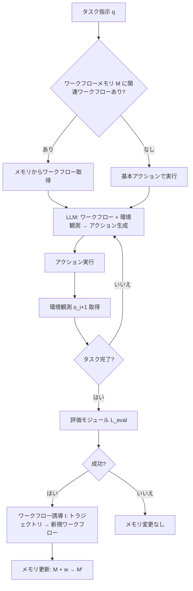

## 論文概要

Agent Workflow Memory (AWM) は、LLMベースのエージェントが過去の経験から再利用可能なタスクワークフロー（ルーティン）を誘導し、後続タスクの解決を導く手法である。著者らは、人間が日常的に行う「過去の経験から手順を学び、将来の行動に活かす」というプロセスをエージェントに実装した。AWMはオフライン（事前の訓練データから学習）とオンライン（テスト時にストリーミングで学習）の両シナリオに対応し、WebArenaベンチマークで51.1%、Mind2Webで24.6%の相対的な成功率改善を達成した。ICML 2025にポスター発表として採択されている。

本記事は [https://arxiv.org/abs/2409.07429](https://arxiv.org/abs/2409.07429) の解説記事です。

## 情報源

| 項目 | 内容 |
|------|------|
| タイトル | Agent Workflow Memory |
| 著者 | Zora Zhiruo Wang, Jiayuan Mao, Daniel Fried, Graham Neubig |
| 所属 | Carnegie Mellon University, MIT |
| arXiv ID | [2409.07429](https://arxiv.org/abs/2409.07429) |
| 発表日 | 2024年9月11日 |
| 採択 | ICML 2025 (Poster) |
| 分野 | cs.CL, cs.AI |
| コード | [zorazrw/agent-workflow-memory](https://github.com/zorazrw/agent-workflow-memory) (Apache 2.0) |

## 背景と動機

LLMベースのエージェントは、Webナビゲーションのような長期的なタスク（long-horizon task）において、複雑なアクション列を正確に実行する必要がある。しかし、既存のエージェントは各タスクを個別に処理し、過去の成功体験を体系的に蓄積・再利用する仕組みを持たなかった。

人間は繰り返しの経験からパターンを抽出し、抽象化されたワークフローとして記憶に格納する。たとえば「ECサイトで商品を購入する」という手順は、サイトが変わっても基本構造が共通している。著者らはこの認知プロセスに着想を得て、エージェントが生のアクショントレースから再利用可能なワークフローを誘導（induce）し、メモリとして保持する仕組みを提案した。

既存手法の多くは、人手で作成したワークフロー（例: SteP）をエージェントに提供するか、生のトレースをそのまま保存するアプローチを取っていた。前者はスケーラビリティに課題があり、後者はドメイン固有の詳細が転移を妨げる。AWMは、この中間を自動で実現する点が新しい。

## 主要な貢献

著者らは以下の貢献を報告している（論文Section 1より）。

- **ワークフロー誘導フレームワーク**: エピソードトレースから再利用可能なワークフロールールを自動抽出するAWMの提案。LMベースと規則ベースの2種類の誘導手法を比較
- **オフライン・オンライン両対応**: 訓練データからの事前学習（オフライン）とテスト時のストリーミング学習（オンライン）の両方に対応する柔軟な設計
- **ワークフローの階層構築**: 基本アクション集合から出発し、獲得済みワークフローの上により複雑なワークフローを構築する階層的誘導
- **2大ベンチマークでの実証**: Mind2Web（200+ドメイン）とWebArena（5サイト、812タスク）での広範な評価。人手作成ワークフローを上回る性能を達成

## 技術的詳細

### ワークフローの定義

AWMにおけるワークフローは、テキスト記述 $d$ とトラジェクトリステップ列 $P = (p_1, p_2, \ldots, p_n)$ の組として表現される。各ステップ $p_i$ は以下の3要素で構成される。

1. 環境状態の自然言語記述
2. アクション選択の推論過程
3. 実行可能なプログラムアクション（例: `click [element_id]`, `type [element_id] "text"`）

ワークフロー誘導関数 $I$ は、経験の集合 $\mathcal{E}$ から再利用可能なワークフロー集合 $\mathcal{W}$ を抽出する。

$$I(\mathcal{E}) \rightarrow \mathcal{W} = \{w\} = \{(d_j, P_j^d)\}$$

重要な設計判断として、ワークフロー内の具体的な値（例: 「dry cat food」）はプレースホルダ（例: `{product-name}`）に置換される。これにより、異なるタスクへの転移可能性が向上する。

### オフラインAWM

訓練データ $\mathcal{E}_{\text{train}}$ から事前にワークフローを誘導する。

$$I(\mathcal{E}_{\text{train}}) \rightarrow \mathcal{W}_{\text{offline}}$$

推論時には、誘導済みの全ワークフローをエージェントのメモリ $M$ に統合し、アクションを生成する。

$$L(q, M + \mathcal{W}_{\text{offline}}, o_i^{\text{test}}) \rightarrow a_i^{\text{test}}$$

ここで $L$ はLLM、$q$ はタスク指示、$o_i$ は時刻 $i$ での環境観測である。

### オンラインAWM

テストクエリを逐次処理し、成功したタスクからワークフローを獲得する。

タスク $t$ に対して、エージェントがトラジェクトリ $e_t$ を生成し、評価モジュール $L_{\text{eval}}$ が成功/失敗を判定する。

$$L_{\text{eval}}(e_t) \in \{0, 1\}$$

成功時のみワークフローを誘導し、メモリを更新する。

$$I(e_t) \rightarrow \{w^t\}, \quad M^t + \{w^t\} \rightarrow M^{t+1}$$

この逐次更新により、エージェントは新しいドメインのタスクに適応しながらワークフローライブラリを拡張する。

### ワークフロー誘導の手法

著者らは2つの誘導手法を比較している。

**LMベース誘導**: LLMに対して「入力された経験から共通のサブルーティンを抽出せよ」とプロンプトする。モデルは反復パターンを検出し、ワークフローとして構造化する。

**規則ベース誘導**: アクション系列（例: CLICK→CLICK→TYPE）で重複排除し、アクション系列ごとに $n=1$ の代表的な経験を選択する。無効なステップ（引数IDが要件と不一致）は除外する。

論文Table 5によれば、WebArenaでの成功率は規則ベースが35.6%、LMベースが35.5%とほぼ同等だが、LMベースはステップ数が5.9と規則ベースの6.3より少ない。

### アーキテクチャ概要



## 実装のポイント

AWMの公開リポジトリ（Python 100%）は、WebArenaとMind2Webの2つのベンチマーク向けに実装が分かれている。

**主要な実装パターン**:

```python
from dataclasses import dataclass


@dataclass
class WorkflowStep:
    """ワークフローの1ステップを表現するデータクラス。

    Attributes:
        state_description: 環境状態の自然言語記述
        reasoning: アクション選択の推論過程
        action: 実行可能なプログラムアクション
    """
    state_description: str
    reasoning: str
    action: str


@dataclass
class Workflow:
    """誘導されたワークフローの表現。

    Attributes:
        description: ワークフローの目的を記述するテキスト
        steps: ワークフローステップのリスト
        source_task_ids: 誘導元のタスクID群
    """
    description: str
    steps: list[WorkflowStep]
    source_task_ids: list[str]

    def to_prompt(self) -> str:
        """ワークフローをLLMプロンプト用テキストに変換する。

        Returns:
            プロンプトに挿入可能な文字列表現
        """
        lines: list[str] = [f"Workflow: {self.description}"]
        for i, step in enumerate(self.steps, 1):
            lines.append(f"Step {i}: {step.state_description}")
            lines.append(f"  Reasoning: {step.reasoning}")
            lines.append(f"  Action: {step.action}")
        return "\n".join(lines)
```

**実行パイプラインの構成**:

```bash
# WebArena向け実行
cd webarena
python pipeline.py --website shopping  # shopping, reddit, gitlab, cms, maps

# Mind2Web向け実行
cd mind2web
python pipeline.py --setup offline  # offline or online
```

著者らはGPT-4 (gpt-4-0613) をtemperature 0.0で使用している。ワークフロー誘導自体もLLMで行うため、推論コストには誘導フェーズのトークン消費も含まれる点に留意が必要である。

## Production Deployment Guide

AWMの概念を実運用のエージェントシステムに適用する場合のAWSインフラ設計パターンを示す。以下では、ワークフロー誘導・保存・検索・適用の各フェーズをマネージドサービスで構成する。

### 実装パターン表

コスト試算は2026年7月時点のAWS ap-northeast-1（東京リージョン）料金に基づく概算である。Lambda料金はus-east-1比で約25%増のAPACマークアップを適用している（AWS公式料金ページより）。

| 構成要素 | Small (PoC) | Medium (本番初期) | Large (大規模運用) |
|---------|------------|------------------|------------------|
| ワークフロー誘導 | Lambda (512MB, 30s) | ECS Fargate (1vCPU, 2GB) | ECS Fargate (2vCPU, 4GB) x 3 |
| ワークフロー保存 | DynamoDB On-Demand | DynamoDB Provisioned | DynamoDB + ElastiCache (Redis) |
| ワークフロー検索 | DynamoDB Scan + LLM判定 | OpenSearch Serverless | OpenSearch Serverless + ベクトル検索 |
| LLM推論 | Bedrock (Haiku) | Bedrock (Sonnet) | Bedrock (Sonnet) + Provisioned Throughput |
| オーケストレーション | Step Functions Standard | Step Functions Standard | Step Functions Express + SQS |
| 月間タスク数 | ~1,000 | ~50,000 | ~500,000 |
| 概算月額 | $50-150 | $800-2,000 | $5,000-15,000 |

### Terraformインフラコード（Medium構成の抜粋）

```hcl
# dynamodb.tf — ワークフローストア
resource "aws_dynamodb_table" "workflow_store" {
  name         = "awm-agent-workflows-production"
  billing_mode = "PAY_PER_REQUEST"
  hash_key     = "workflow_id"
  range_key    = "version"

  attribute { name = "workflow_id"; type = "S" }
  attribute { name = "version";     type = "N" }
  attribute { name = "domain";      type = "S" }
  attribute { name = "utility_score"; type = "N" }

  global_secondary_index {
    name            = "domain-utility-index"
    hash_key        = "domain"
    range_key       = "utility_score"
    projection_type = "ALL"
  }

  point_in_time_recovery { enabled = true }
}

# lambda.tf — ワークフロー誘導Lambda (ARM64でコスト最適化)
resource "aws_lambda_function" "induce_workflow" {
  function_name = "awm-agent-induce-production"
  runtime       = "python3.12"
  handler       = "handler.induce_workflow"
  timeout       = 60
  memory_size   = 1024
  architectures = ["arm64"]

  environment {
    variables = {
      WORKFLOW_TABLE = aws_dynamodb_table.workflow_store.name
      BEDROCK_MODEL  = "anthropic.claude-sonnet-4-6-20260514-v1:0"
      BEDROCK_REGION = "ap-northeast-1"
    }
  }

  tracing_config { mode = "Active" }
}
```

### ワークフロー誘導Lambdaの実装例

```python
"""AWMワークフロー誘導Lambda関数。

成功したタスクトラジェクトリからワークフローを抽出し、
DynamoDBに保存する。
"""

import json
import os
import uuid
from datetime import datetime, timezone
from typing import Any

import boto3
from pydantic import BaseModel, Field

_bedrock = boto3.client("bedrock-runtime", region_name=os.environ["BEDROCK_REGION"])
_dynamodb = boto3.resource("dynamodb")
_table = _dynamodb.Table(os.environ["WORKFLOW_TABLE"])


class TrajectoryStep(BaseModel):
    """トラジェクトリの1ステップ。"""
    state: str = Field(description="環境状態の記述")
    reasoning: str = Field(description="推論過程")
    action: str = Field(description="実行アクション")


class InductionRequest(BaseModel):
    """ワークフロー誘導リクエスト。"""
    task_id: str
    domain: str
    trajectory: list[TrajectoryStep]
    task_instruction: str


def induce_workflow(event: dict[str, Any], context: Any) -> dict[str, Any]:
    """トラジェクトリからワークフローを誘導しDynamoDBに保存する。

    Args:
        event: Step Functionsから渡されるイベント
        context: Lambda実行コンテキスト

    Returns:
        誘導されたワークフロー数とID群
    """
    request = InductionRequest(**event)
    trajectory_text = "\n".join(
        f"Step {i+1}: State={s.state} | Action={s.action}"
        for i, s in enumerate(request.trajectory)
    )

    response = _bedrock.invoke_model(
        modelId=os.environ["BEDROCK_MODEL"],
        body=json.dumps({
            "anthropic_version": "bedrock-2023-05-31",
            "max_tokens": 4096,
            "temperature": 0.0,
            "messages": [{"role": "user", "content": (
                f"タスク: {request.task_instruction}\n\n"
                f"トレース:\n{trajectory_text}\n\n"
                "上記から再利用可能なワークフローをJSON配列で抽出せよ。"
                "具体値はプレースホルダ {placeholder} に置換すること。"
            )}],
        }),
    )

    result = json.loads(response["body"].read())
    content = result["content"][0]["text"]
    raw_workflows = json.loads(content[content.find("["):content.rfind("]") + 1])

    workflow_ids: list[str] = []
    for raw in raw_workflows:
        wf_id = str(uuid.uuid4())
        _table.put_item(Item={
            "workflow_id": wf_id, "version": 1,
            "description": raw["description"], "steps": raw["steps"],
            "domain": request.domain, "source_task_id": request.task_id,
            "utility_score": 0,
            "created_at": datetime.now(timezone.utc).isoformat(),
        })
        workflow_ids.append(wf_id)

    return {"induced_count": len(workflow_ids), "workflow_ids": workflow_ids}
```

### 運用・監視設定

運用時に監視すべき主要メトリクスは以下のとおりである。

| メトリクス | 閾値 | アラート条件 |
|-----------|------|------------|
| Lambda Errors (誘導関数) | 5回/5分 | 2期間連続で超過 |
| DynamoDB ThrottledRequests | 0 | 即時通知 |
| Bedrock InvocationLatency | 10秒 | P99が超過 |
| ワークフロー利用率 | 0.8未満 | 日次集計で低下 |

CloudWatch Embedded Metric Format (EMF) を用いて、ワークフロー誘導のカスタムメトリクス（誘導数、カバレッジ、利用率）をLambda関数のstdoutからJSON 1行で出力し、CloudWatchカスタム名前空間 `AWM/WorkflowInduction` で可視化する構成を推奨する。

### コスト最適化チェックリスト

以下は2026年7月時点のAWS ap-northeast-1料金に基づく概算である。Lambda料金はus-east-1比で約25%増のAPACマークアップを適用（[AWS Lambda Pricing](https://aws.amazon.com/lambda/pricing/)参照）。

- [ ] **Lambda ARM64 (Graviton2)**: x86比で約20%のコスト削減（概算 $0.0000166667/GB-s vs $0.0000208333/GB-s）
- [ ] **Bedrock モデル選択**: 誘導にはHaiku ($1/1M入力トークン)、タスク実行にSonnet ($3/1M入力トークン) と使い分け
- [ ] **DynamoDB**: 月間50,000リクエスト以下はOn-Demand、以上はProvisioned + Auto Scaling
- [ ] **Step Functions**: 5分以下の実行はExpress Workflows ($1.00/100万リクエスト + 実行時間課金) が有利
- [ ] **VPCエンドポイント**: DynamoDB・S3・BedrockへGateway/Interface VPCエンドポイントを使用しNAT Gateway料金を回避

## 実験結果

### WebArena

著者らはGPT-4 (gpt-4-0613) を用いてWebArenaの812タスクで評価を行っている（論文Table 1より）。

| 手法 | 全体SR | Shopping | CMS | Reddit | GitLab | Maps | 平均Steps |
|------|--------|----------|-----|--------|--------|------|-----------|
| BrowserGym_ax-tree | 15.0% | 17.2% | 14.8% | 20.2% | 19.0% | 25.5% | 7.9 |
| BrowserGym | 23.5% | - | - | - | - | - | - |
| SteP (人手WF) | 33.0% | 37.0% | 24.0% | 59.0% | 32.0% | 30.0% | - |
| **AWM (Online)** | **35.5%** | **30.8%** | **29.1%** | **50.9%** | **31.8%** | **43.3%** | **5.9** |

AWMはBrowserGymベースラインに対して51.1%の相対改善を達成し、人手でワークフローを作成したSteP (33.0%) をも上回る35.5%の成功率を記録した。タスク解決に要するステップ数も7.9から5.9に削減されている（論文Table 1）。

### Mind2Web

Mind2Webのクロスタスク評価（論文Table 3, GPT-4, オフラインAWM）では、以下の結果が報告されている。

| 手法 | Elem Acc | Action F1 | Step SR | Task SR |
|------|----------|-----------|---------|---------|
| MindAct | 41.6% | 60.6% | 36.2% | 2.0% |
| **AWM** | **50.6%** | 57.3% | **45.1%** | **4.8%** |

Step SRで24.6%の相対改善が得られた。Action F1がわずかに低下している点について、著者らはワークフローに過度に従うことで個別の環境状態への適応が減ることが原因と分析している。

### 汎化性能

論文Table 4によれば、訓練-テスト間の分布差が拡大するほどAWMの優位性が増す。

- **クロスタスク**: +8.9 absolute points (Step SR)
- **クロスウェブサイト**: +3.6-3.8 absolute points
- **クロスドメイン**: +14.0 absolute points

### ワークフロー品質指標

論文Table 10より、誘導されたワークフローの品質指標を示す。

| 指標 | WebArena | Mind2Web |
|------|----------|----------|
| ワークフロー数/サイト | 7.3-7.4 | - |
| カバレッジ | - | 0.40 |
| 関数重複率 | 0.08 | 0.20 |
| 利用率 | 0.94 | 0.91 |

利用率（ワークフローが実際に活用された割合）が0.91-0.94と高い一方、カバレッジは0.40にとどまる。著者らはこれを訓練-テスト間の分布の違いを考慮すれば妥当な値であると述べている。

## 実運用への応用

AWMの概念は、社内ヘルプデスクやカスタマーサポートのエージェント設計に直接応用可能である。たとえば、関連するZenn記事「[LangGraphチェックポイント機構で社内ヘルプデスクの中断復帰を実装する](https://zenn.dev/0h_n0/articles/4caf31c9560691)」で解説されているLangGraphのステート管理と組み合わせることで、以下のようなシステムが構築可能である。

1. **ヘルプデスクチケット処理の自動化**: 過去の解決済みチケットからワークフローを誘導し、類似チケットの処理を効率化する。LangGraphのチェックポイント機構により、中断・復帰時にもワークフローの状態を保持できる

2. **RPA連携**: WebArenaで実証されたWebナビゲーション能力を活用し、社内システム操作の自動化ワークフローを構築する。AWMにより新しいシステムへの適応が自動化される

3. **段階的なワークフロー拡張**: オンラインAWMの特性を活かし、デプロイ初期は少数のワークフローで運用を開始し、成功体験の蓄積に伴いワークフローライブラリを自動拡張する

ただし、著者ら自身が論文で指摘しているとおり、動的な環境変化（ポップアップ要素の出現など）への対応や、ワークフローからの逸脱判断はいまだ課題として残っている。また、オフラインとオンラインで誘導されたワークフローの互換性が完全ではない点（Appendix C）も実運用時の設計に影響する。

## 関連研究

AWMは以下の研究系譜に位置づけられる。

- **SteP** (Sodhi et al., 2024): 人手でワークフローを記述し、エージェントに提供する手法。AWMは人手の介在なしにこれを上回った
- **Synapse** (Zheng et al., 2024): Mind2Webでの先行手法。AWMのオフラインモードとの比較対象
- **ReAct** (Yao et al., 2023): 推論とアクションの交互実行フレームワーク。AWMのベースとなるエージェントアーキテクチャ
- **Voyager** (Wang et al., 2023): Minecraftでスキルライブラリを構築するエージェント。AWMとスキル蓄積の思想を共有するが、対象ドメインが異なる
- **Memex(RL)** (2026): AWMの後続研究として、強化学習を用いたインデックス付き経験メモリの手法が提案されている

## まとめと今後の展望

Agent Workflow Memoryは、LLMエージェントに「経験からワークフローを学び、再利用する」能力を付与する実用的なフレームワークである。WebArenaで51.1%、Mind2Webで24.6%の相対改善という結果は、ワークフロー記憶がエージェントの汎化能力を向上させることを示している。

今後の課題として、著者らは(1) 動的環境変化への対応、(2) ワークフローからの適切な逸脱判断、(3) オフライン・オンライン統合の3点を挙げている。また、ワークフローの有効期限管理（環境の変化による陳腐化）やマルチエージェント環境でのワークフロー共有も、実運用においては重要な検討事項である。

## 参考文献

1. Wang, Z. Z., Mao, J., Fried, D., & Neubig, G. (2024). Agent Workflow Memory. arXiv:2409.07429. [https://arxiv.org/abs/2409.07429](https://arxiv.org/abs/2409.07429)
2. Sodhi, P., et al. (2024). SteP: Stacked LLM Policies for Web Actions.
3. Zheng, B., et al. (2024). Synapse: Trajectory-as-Exemplar Prompting with Memory for Computer Control.
4. Yao, S., et al. (2023). ReAct: Synergizing Reasoning and Acting in Language Models.
5. Wang, G., et al. (2023). Voyager: An Open-Ended Embodied Agent with Large Language Models.
6. Deng, X., et al. (2024). Mind2Web: Towards a Generalist Agent for the Web.
7. Zhou, S., et al. (2024). WebArena: A Realistic Web Environment for Building Autonomous Agents.
8. GitHub Repository: [zorazrw/agent-workflow-memory](https://github.com/zorazrw/agent-workflow-memory) (Apache 2.0 License)
