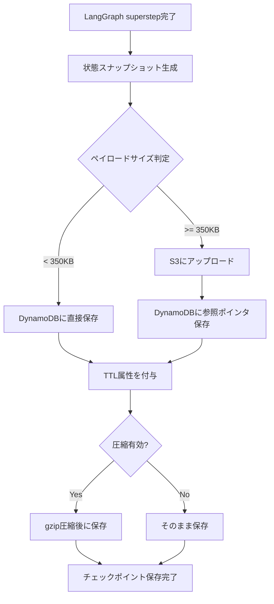

## ブログ概要（Summary）

AWS公式データベースブログにて、Lee Hannigan氏（Sr. DynamoDB Database Engineer）が2026年1月13日に公開した記事である。LangGraphのチェックポイント機構をAmazon DynamoDBで永続化するための公式パッケージ `langgraph-checkpoint-aws` の設計思想と実装パターンを解説している。DynamoDBのサーバーレスアーキテクチャとミリ秒レイテンシを活かし、AIエージェントの状態管理をスケーラブルかつ耐障害性のある形で実現する方法を、HITL（Human-in-the-Loop）、障害復旧、長期セッション維持の3つのユースケースとともに紹介している。

本記事は [AWS公式ブログ: Build Durable AI Agents with LangGraph and Amazon DynamoDB](https://aws.amazon.com/blogs/database/build-durable-ai-agents-with-langgraph-and-amazon-dynamodb/) の解説記事です。

この記事は [Zenn記事: LangGraphチェックポイント機構で社内ヘルプデスクの中断復帰を実装する](https://zenn.dev/0h_n0/articles/4caf31c9560691) の深掘りです。

## 情報源

- **種別**: 企業テックブログ（AWS Database Blog）
- **URL**: [https://aws.amazon.com/blogs/database/build-durable-ai-agents-with-langgraph-and-amazon-dynamodb/](https://aws.amazon.com/blogs/database/build-durable-ai-agents-with-langgraph-and-amazon-dynamodb/)
- **著者**: Lee Hannigan（Sr. DynamoDB Database Engineer, Donegal, Ireland）
- **発表日**: 2026年1月13日
- **関連パッケージ**: [langgraph-checkpoint-aws v1.1.1](https://pypi.org/project/langgraph-checkpoint-aws/)（2026年6月17日リリース）

## 技術的背景（Technical Background）

LangGraphはLangChainの上位フレームワークとして、ステートフルなマルチアクターAIアプリケーションの構築を支援する。グラフ実行の各ステップ（superstep）でチェックポイントを保存し、同一`thread_id`で再呼び出しすることで中断地点からの再開を可能にする。

開発時には `InMemorySaver` が手軽だが、プロセス終了で全状態が消失する。本番運用では永続化バックエンドが必須となり、関連Zenn記事ではPostgreSQLバックエンド（`langgraph-checkpoint-postgres`）を用いた実装を解説している。しかし、PostgreSQLを使う場合にはRDBの運用負荷（コネクション管理、スケーリング、バックアップ）が課題となる。

Hannigan氏のブログはこの課題に対し、DynamoDBのサーバーレス特性を活かしたアプローチを提案している。DynamoDBはコネクションプーリング不要、自動スケーリング、単一桁ミリ秒レイテンシを提供するため、チェックポイントストアとしてRDBより運用負荷が低い。加えて、350KB超のペイロードをS3に自動オフロードする機構により、DynamoDBの400KBアイテムサイズ制限を透過的に回避する設計となっている。

## 実装アーキテクチャ（Architecture）

### DynamoDBSaverのペイロード処理フロー

`DynamoDBSaver`はチェックポイント保存時にペイロードサイズを判定し、保存先を動的に切り替える。Hannigan氏のブログによると、閾値は350KBに設定されている。



### DynamoDBテーブルスキーマ

ブログおよびAWS公式ドキュメントによると、チェックポイントテーブルはComposite Primary Key構成を採用している。

| 属性名 | 型 | 役割 |
|--------|------|------|
| PK | String (HASH) | パーティションキー（thread_idベース） |
| SK | String (RANGE) | ソートキー（checkpoint_idベース） |
| ttl | Number | DynamoDB TTL用のUNIXタイムスタンプ |

この設計により、同一スレッド内のチェックポイントを時系列で効率的にクエリできる。`thread_id`をパーティションキーに含めることで、スレッド間のアクセスが完全に分離される。

### コンストラクタパラメータ

AWS公式ドキュメントおよびPyPIのドキュメントによると、`DynamoDBSaver`のコンストラクタは以下のパラメータを受け付ける。

```python
from langgraph_checkpoint_aws import DynamoDBSaver

checkpointer = DynamoDBSaver(
    table_name: str,                           # 必須: DynamoDBテーブル名
    session: Optional[boto3.Session] = None,   # boto3セッション（認証制御用）
    region_name: Optional[str] = None,         # AWSリージョン
    endpoint_url: Optional[str] = None,        # カスタムエンドポイント（DynamoDB Local用）
    boto_config: Optional[Config] = None,      # botocore設定（リトライ等）
    ttl_seconds: Optional[int] = None,         # チェックポイント有効期限（秒）
    enable_checkpoint_compression: bool = False,  # gzip圧縮の有効化
    s3_offload_config: Optional[dict] = None   # S3オフロード設定
)
```

## Production Deployment Guide

### AWS実装パターン（コスト最適化重視）

以下はLangGraph + DynamoDBSaverを用いたAIエージェントの本番構成を、トラフィック規模別に整理したものである。コスト試算は2026年7月時点のAWS ap-northeast-1（東京リージョン）料金に基づく概算値であり、実際のコストはトラフィックパターン、バースト使用量、データサイズにより変動する。最新料金は[AWS料金計算ツール](https://calculator.aws/)での確認を推奨する。

なお、DynamoDBオンデマンド料金はus-east-1で書き込み$0.625/百万WRU、読み取り$0.125/百万RRUである（AWS公式料金ページより）。東京リージョンはus-east-1比で約1.25-1.4倍の料金設定となる傾向がある。以下の試算ではこの係数を反映している。

| 項目 | Small (~100 req/日) | Medium (~1,000 req/日) | Large (10,000+ req/日) |
|------|---------------------|----------------------|----------------------|
| コンピュート | Lambda + Bedrock | ECS Fargate (0.5 vCPU) | EKS + Spot Instances |
| チェックポイントDB | DynamoDB On-Demand | DynamoDB On-Demand | DynamoDB Provisioned |
| S3オフロード | 不要（ペイロード小） | S3 Standard | S3 Standard + Lifecycle |
| TTL設定 | 7日 | 30日 | 90日（アーカイブ付き） |
| 月額概算 | $30-80 | $200-500 | $1,500-4,000 |

**Small構成の内訳**:
- Lambda: 100 req/日 x 30日 x 平均10秒実行 x 512MB = 約$5-10/月
- DynamoDB On-Demand: 100 req x 30日 x 平均5 WRU/req = 15,000 WRU/月（$0.01未満）
- Bedrock (Claude 3.5 Sonnet): 100 req x 30日 x 平均2,000トークン = 約$15-50/月
- CloudWatch Logs: 約$3-5/月

**Medium構成の内訳**:
- ECS Fargate (0.5 vCPU, 1GB): 約$30-40/月（常時稼働）
- DynamoDB On-Demand: 1,000 req x 30日 x 平均5 WRU/req = 150,000 WRU/月（約$0.15）
- S3 Standard: チェックポイントデータ約10GB = 約$0.25/月
- ALB: 約$20/月
- Bedrock: 約$150-300/月

### Terraformインフラコード

#### Small構成（Serverless: Lambda + DynamoDB）

```hcl
# dynamodb.tf - LangGraphチェックポイントテーブル
resource "aws_dynamodb_table" "langgraph_checkpoints" {
  name         = "langgraph-checkpoints"
  billing_mode = "PAY_PER_REQUEST"
  hash_key     = "PK"
  range_key    = "SK"

  attribute {
    name = "PK"
    type = "S"
  }
  attribute {
    name = "SK"
    type = "S"
  }

  ttl {
    attribute_name = "ttl"
    enabled        = true
  }
  point_in_time_recovery { enabled = true }
  server_side_encryption  { enabled = true }

  tags = { Project = "langgraph-agent", Environment = "production" }
}

# iam.tf - DynamoDBチェックポイント用最小権限
resource "aws_iam_role_policy" "dynamodb_checkpoint" {
  name = "dynamodb-checkpoint-access"
  role = aws_iam_role.lambda_langgraph.id

  policy = jsonencode({
    Version = "2012-10-17"
    Statement = [{
      Effect   = "Allow"
      Action   = [
        "dynamodb:GetItem", "dynamodb:PutItem", "dynamodb:Query",
        "dynamodb:BatchGetItem", "dynamodb:BatchWriteItem"
      ]
      Resource = aws_dynamodb_table.langgraph_checkpoints.arn
    }]
  })
}
```

#### Large構成追加分（S3オフロード）

```hcl
# s3.tf - チェックポイントオーバーフロー用S3バケット
resource "aws_s3_bucket" "checkpoint_overflow" {
  bucket = "langgraph-checkpoint-overflow-${data.aws_caller_identity.current.account_id}"
}

resource "aws_s3_bucket_public_access_block" "checkpoint" {
  bucket                  = aws_s3_bucket.checkpoint_overflow.id
  block_public_acls       = true
  block_public_policy     = true
  ignore_public_acls      = true
  restrict_public_buckets = true
}

resource "aws_s3_bucket_lifecycle_configuration" "checkpoint" {
  bucket = aws_s3_bucket.checkpoint_overflow.id
  rule {
    id     = "expire-old-checkpoints"
    status = "Enabled"
    expiration { days = 90 }
    transition { days = 30; storage_class = "STANDARD_IA" }
  }
}

# S3オフロード用追加IAM権限
resource "aws_iam_role_policy" "s3_checkpoint_offload" {
  name = "s3-checkpoint-offload"
  role = aws_iam_role.ecs_task_role.id
  policy = jsonencode({
    Version = "2012-10-17"
    Statement = [
      {
        Effect   = "Allow"
        Action   = ["s3:PutObject", "s3:GetObject", "s3:DeleteObject", "s3:PutObjectTagging"]
        Resource = "${aws_s3_bucket.checkpoint_overflow.arn}/*"
      },
      {
        Effect   = "Allow"
        Action   = ["s3:GetBucketLifecycleConfiguration", "s3:PutBucketLifecycleConfiguration"]
        Resource = aws_s3_bucket.checkpoint_overflow.arn
      }
    ]
  })
}
```

### 運用・監視設定

#### CloudWatch監視設定

```hcl
# DynamoDBスロットリング検知アラーム
resource "aws_cloudwatch_metric_alarm" "dynamodb_throttle" {
  alarm_name          = "langgraph-dynamodb-throttling"
  comparison_operator = "GreaterThanThreshold"
  evaluation_periods  = 2
  metric_name         = "ThrottledRequests"
  namespace           = "AWS/DynamoDB"
  period              = 300
  statistic           = "Sum"
  threshold           = 10
  dimensions          = { TableName = aws_dynamodb_table.langgraph_checkpoints.name }
  alarm_actions       = [aws_sns_topic.alerts.arn]
}

# DynamoDBテーブルサイズ監視（10GB超で通知）
resource "aws_cloudwatch_metric_alarm" "dynamodb_table_size" {
  alarm_name          = "langgraph-dynamodb-size"
  comparison_operator = "GreaterThanThreshold"
  evaluation_periods  = 1
  metric_name         = "TableSizeBytes"
  namespace           = "AWS/DynamoDB"
  period              = 86400
  statistic           = "Average"
  threshold           = 10737418240
  dimensions          = { TableName = aws_dynamodb_table.langgraph_checkpoints.name }
  alarm_actions       = [aws_sns_topic.alerts.arn]
}
```

CloudWatch Logs Insightsでは以下のクエリでチェックポイント書き込みレイテンシとS3オフロード頻度を監視できる。

```
fields @timestamp, @message
| filter @message like /checkpoint/
| stats avg(duration_ms) as avg_latency, max(duration_ms) as p100, count(*) as writes by bin(1h)
```

### コスト最適化チェックリスト

**アーキテクチャ選択**:
- [ ] トラフィック量に応じたコンピュート選択（Lambda / Fargate / EKS）
- [ ] DynamoDBのキャパシティモード選択（On-Demand vs Provisioned）
- [ ] S3オフロードの要否判定（平均ペイロードサイズ確認）
- [ ] リージョン選択の妥当性確認（レイテンシ vs コスト）

**DynamoDBコスト削減**:
- [ ] TTL設定で不要チェックポイントを自動削除
- [ ] gzip圧縮有効化でアイテムサイズ削減
- [ ] Provisioned CapacityへのReserved Capacity適用（安定負荷時）
- [ ] DynamoDB Standard-IAテーブルクラスの検討（低頻度アクセスデータ）
- [ ] 不要なGSI/LSIが存在しないことの確認

**S3コスト削減**:
- [ ] Lifecycle Policyで古いオブジェクトをStandard-IA/Glacierへ移行
- [ ] S3 Intelligent-Tieringの検討（アクセスパターン不明時）
- [ ] バケットのバージョニング無効化（チェックポイントは上書き不要）
- [ ] 不要オブジェクトの自動削除設定

**Lambdaコスト削減**:
- [ ] メモリサイズの最適化（Power Tuning実施）
- [ ] Provisioned Concurrencyの要否判定（コールドスタート許容度）
- [ ] ARM64アーキテクチャ（Graviton2）の採用で20%コスト削減
- [ ] Lambda SnapStart の検討（Java/Pythonランタイム）

**監視・アラート**:
- [ ] AWS Budgets でDynamoDB/S3/Lambda月額上限を設定
- [ ] Cost Anomaly Detection有効化
- [ ] CloudWatch Logsの保持期間を適切に設定（不要ログの削減）
- [ ] DynamoDBスロットリングアラームの設定
- [ ] 日次コストレポートのSNS通知設定

**リソース管理**:
- [ ] 未使用テーブル/バケットの定期棚卸し
- [ ] タグ戦略の統一（Project, Environment, Owner）
- [ ] IaCによるリソース管理の一元化
- [ ] 開発/ステージング環境の夜間自動停止

## パフォーマンス最適化（Performance）

### TTLによるストレージ管理

Hannigan氏のブログでは、`ttl_seconds`パラメータによるチェックポイントの自動期限切れが紹介されている。DynamoDBのTTL機能を利用しており、指定秒数経過後にアイテムが自動削除される。TTL削除はDynamoDBのバックグラウンドプロセスで実行されるため、WRUを消費せずストレージコストのみ削減できる。

```python
# 用途別TTL設定の例
checkpointer_dev = DynamoDBSaver(
    table_name="langgraph-checkpoints",
    ttl_seconds=86400,          # 開発: 1日
)

checkpointer_prod = DynamoDBSaver(
    table_name="langgraph-checkpoints",
    ttl_seconds=86400 * 30,     # 本番: 30日
    enable_checkpoint_compression=True,
)
```

### gzip圧縮

`enable_checkpoint_compression=True` を設定すると、チェックポイントデータがgzip圧縮されてからDynamoDBに保存される。ブログではこの圧縮により「DynamoDB書き込みコストとS3ストレージコストの両方を削減できる」と述べられている。具体的な圧縮率は記載されていないが、JSON形式のチェックポイントデータは繰り返しパターンが多いため、一般的にgzipで50-70%のサイズ削減が見込まれる。

### S3オフロードの透過性

350KB以上のペイロードがS3に自動オフロードされる設計は、DynamoDBの400KBアイテムサイズ制限を考慮したものである。Hannigan氏はこのオフロードが「透過的」であると述べており、アプリケーションコード側での分岐処理は不要となる。読み込み時もDynamoDBの参照ポインタから自動的にS3オブジェクトをフェッチする。

## 運用での学び（Production Lessons）

### InMemorySaverからの移行パス

Hannigan氏のブログでは、`InMemorySaver` から `DynamoDBSaver` への移行を「チェックポインタを差し替えるだけ」と述べている。LangGraphのCheckpointerインターフェースが統一されているため、グラフ定義やノードのロジックを変更する必要がない。

```python
from langgraph_checkpoint_aws import DynamoDBSaver

# Before: プロトタイプ
# checkpointer = InMemorySaver()

# After: 本番
checkpointer = DynamoDBSaver(
    table_name="langgraph-checkpoints",
    region_name="ap-northeast-1",
    ttl_seconds=86400 * 7,
    enable_checkpoint_compression=True,
    s3_offload_config={"bucket_name": "my-checkpoint-bucket"}
)

graph = workflow.compile(checkpointer=checkpointer)
```

### 3つのユースケースパターン

ブログでは以下の3パターンが本番運用で有用であると述べられている。

**1. HITL Review（人間介入型レビュー）**: 機密性の高い操作（ローン承認、データ削除等）をエージェントが実行する前に、チェックポイントで一時停止し、人間が承認/却下を判断する。DynamoDBの永続化により、レビュー待ち時間が数時間から数日に及んでも状態が保持される。

**2. Failure Recovery（障害復旧）**: エージェント実行中にプロセスクラッシュやAPI障害が発生した場合、最後に成功したチェックポイントから再開できる。Hannigan氏はブログで「完了済みのステップを再実行する必要がない」と述べている。

**3. Long-Running Conversations（長期セッション）**: カスタマーサポートや社内ヘルプデスクのように、複数日にまたがるセッションの状態を維持する。関連Zenn記事で解説している社内ヘルプデスクのユースケースと直接的に対応する。

### PostgresSaverとの比較

関連Zenn記事ではPostgreSQLバックエンド（`AsyncPostgresSaver`）を用いた実装を解説しているが、DynamoDBバックエンドとの主な違いは以下の通りである。

| 観点 | PostgresSaver | DynamoDBSaver |
|------|--------------|---------------|
| 運用負荷 | コネクション管理、バキューム、レプリケーション設定が必要 | サーバーレス、運用ゼロ |
| スケーリング | 垂直スケールが中心、Read Replica追加で水平対応 | 自動スケーリング、キャパシティ管理不要（On-Demand時） |
| レイテンシ | 通常数ms~数十ms | AWS公式によると「単一桁ミリ秒」 |
| 大規模ペイロード | PostgreSQLのTOAST機構で自動圧縮 | 350KB超はS3に明示的オフロード |
| クエリ柔軟性 | SQL、複雑な集計が可能 | PK/SKベースのクエリが中心 |
| コスト構造 | インスタンス課金（固定費寄り） | リクエスト課金（変動費寄り） |
| セットアップ | `setup()`でテーブル自動作成 | 事前にDynamoDBテーブル作成が必要 |

## 学術研究との関連（Academic Connection）

LangGraphのチェックポイント機構は、分散システムにおけるチェックポイント/リスタート（C/R）の概念に基づいている。Chandy-Lamportアルゴリズム（1985年）に代表される分散スナップショット手法の応用として捉えることができる。ただし、LangGraphの現時点の実装はブログ記事 "[Why Checkpoints Aren't Durable Execution](https://www.diagrid.io/blog/checkpoints-are-not-durable-execution-why-langgraph-crewai-google-adk-and-others-fall-short-for-production-agent-workflows)"（Diagrid, 2026年）が指摘するように、自動障害検知やプロセス外部からの再起動トリガーは提供しておらず、Temporal/Durable Functionsのような「Durable Execution」とは設計思想が異なる点に留意が必要である。DynamoDBSaverはあくまでステート永続化を提供するものであり、オーケストレーション層の障害検知は別途設計する必要がある。

## まとめと実践への示唆

Hannigan氏のブログは、LangGraphのチェックポイント永続化におけるDynamoDBバックエンドの設計と実装を体系的に解説している。サーバーレス運用、TTLによる自動クリーンアップ、gzip圧縮、S3オーバーフローという4つの機能により、本番AIエージェントの状態管理を低運用負荷で実現できる。関連Zenn記事で解説しているPostgreSQLバックエンドと比較すると、運用負荷の低さとスケーラビリティで優位性がある一方、SQLによる柔軟なクエリや既存RDBインフラとの統合が必要な場合はPostgreSQLが適する。ユースケースとチームの運用能力に応じた選択が重要である。

## 参考文献

- **Blog URL**: [Build Durable AI Agents with LangGraph and Amazon DynamoDB](https://aws.amazon.com/blogs/database/build-durable-ai-agents-with-langgraph-and-amazon-dynamodb/) - Lee Hannigan, AWS Database Blog, 2026年1月13日
- **AWS公式ドキュメント**: [Using DynamoDB as a checkpoint store for LangGraph agents](https://docs.aws.amazon.com/amazondynamodb/latest/developerguide/ddb-langgraph-checkpoint.html) - Amazon DynamoDB Developer Guide
- **PyPI**: [langgraph-checkpoint-aws v1.1.1](https://pypi.org/project/langgraph-checkpoint-aws/) - 2026年6月17日リリース
- **GitHub**: [langchain-ai/langchain-aws - DynamoDBSaver](https://github.com/langchain-ai/langchain-aws/blob/main/libs/langgraph-checkpoint-aws/docs/dynamodb/DynamoDBSaver.md)
- **LangGraph Documentation**: [Persistence](https://docs.langchain.com/oss/python/langgraph/persistence) - LangChain公式ドキュメント
- **DynamoDB Pricing**: [Amazon DynamoDB Pricing](https://aws.amazon.com/dynamodb/pricing/) - AWS公式料金ページ
- **Related Zenn article**: [LangGraphチェックポイント機構で社内ヘルプデスクの中断復帰を実装する](https://zenn.dev/0h_n0/articles/4caf31c9560691)
- **Durable Execution批評**: [Why Checkpoints Aren't Durable Execution](https://www.diagrid.io/blog/checkpoints-are-not-durable-execution-why-langgraph-crewai-google-adk-and-others-fall-short-for-production-agent-workflows) - Diagrid, 2026年
