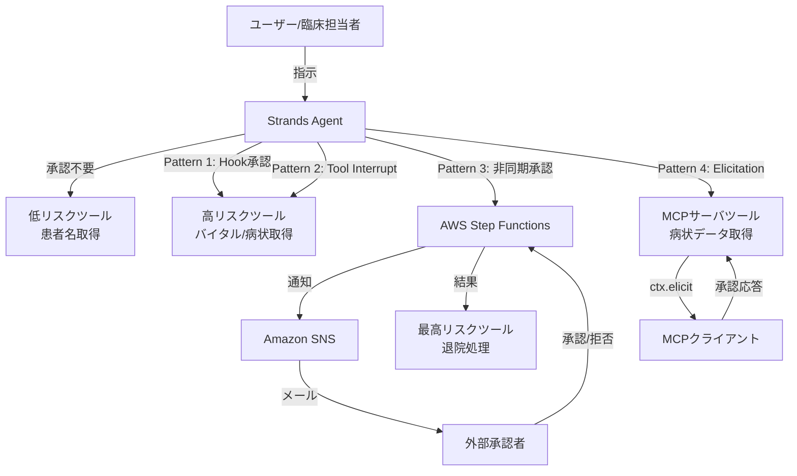
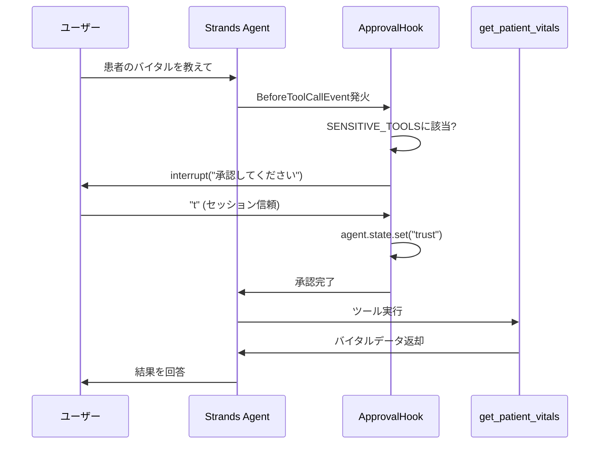
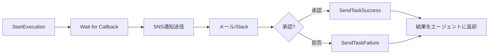

## ブログ概要

AWSのSenior AI/ML Solutions ArchitectであるPierre de Malliard氏が2026年4月8日に公開した本ブログでは、ヘルスケア・ライフサイエンス領域のAIエージェントシステムにおいて、人間の承認を組み込む4つの実装パターンが解説されている。GxP規制、患者安全、PHI（Protected Health Information）保護、監査要件といったヘルスケア固有の制約下で、AIエージェントの自律的な動作をどこで・どのように人間が監視すべきかを、Strands Agents Framework、AWS Step Functions、MCP（Model Context Protocol）の具体的なコードとともに示している。

本記事は [https://aws.amazon.com/blogs/machine-learning/human-in-the-loop-constructs-for-agentic-workflows-in-healthcare-and-life-sciences/](https://aws.amazon.com/blogs/machine-learning/human-in-the-loop-constructs-for-agentic-workflows-in-healthcare-and-life-sciences/) の解説記事です。

## 情報源

| 項目 | 内容 |
|------|------|
| タイトル | Human-in-the-loop constructs for agentic workflows in healthcare and life sciences |
| 著者 | Pierre de Malliard (Senior AI/ML Solutions Architect, AWS) |
| 公開日 | 2026年4月8日 |
| URL | [AWSブログ](https://aws.amazon.com/blogs/machine-learning/human-in-the-loop-constructs-for-agentic-workflows-in-healthcare-and-life-sciences/) |
| サンプルコード | [GitHub: aws-samples/sample-human-in-the-loop-patterns](https://github.com/aws-samples/sample-human-in-the-loop-patterns) |
| 関連ドキュメント | [Strands Agents SDK](https://strandsagents.com/)、[Amazon Bedrock AgentCore](https://docs.aws.amazon.com/bedrock-agentcore/) |

## 技術的背景: ヘルスケアAIにおける規制要件

ヘルスケア・ライフサイエンス分野でAIエージェントを運用する場合、一般的なソフトウェア開発とは異なる厳格な規制への準拠が求められる。著者らは以下の規制要件をHITL実装の動機として挙げている。

**GxP規制（Good x Practice）**: FDA 21 CFR Part 11は、電子記録・電子署名に対して監査証跡（Audit Trail）の保持を要求する。AIが生成・修正した記録については、モデルの識別子・バージョン、プロンプト、RAGコンテキスト、生の出力、人間レビュアーの行動、最終決定のすべてを監査証跡に記録する必要がある（[IntuitionLabs, "GxP Audit Trails for AI"](https://intuitionlabs.ai/articles/audit-trail-requirements-ai-gxp-compliance)）。

**PHI保護**: HIPAA準拠として、患者の保護された医療情報へのアクセスには明示的な認可が必要であり、エージェントが自律的にPHIを取得・変更する前に人間の承認チェックポイントを設ける必要がある。

**患者安全**: 臨床試験プロトコルの変更や患者退院処理など、患者の安全に直結する操作は、資格を持つ人間の承認なしに実行してはならない。

これらの要件は、AIエージェントの「自律性」と「人間による監視」のバランスをどう設計するかという、HITLアーキテクチャの根本的な問いを提示している。

## 実装アーキテクチャ: 4パターンの比較

著者は、ツールのリスクレベルと承認の同期性に基づき、4つのHITL実装パターンを提案している。以下に比較表を示す。

### 4パターン比較表

| 特性 | Pattern 1: Hook System | Pattern 2: Tool Interrupt | Pattern 3: Step Functions | Pattern 4: MCP Elicitation |
|------|------------------------|--------------------------|---------------------------|----------------------------|
| 承認スコープ | エージェントループ全体 | 個別ツール内 | 外部ワークフロー | MCPサーバ内 |
| 同期/非同期 | 同期（ブロッキング） | 同期（ブロッキング） | 非同期（ノンブロッキング） | 同期（SSE経由） |
| 承認者 | ローカルユーザー | ローカルユーザー | 外部承認者（メール/Slack） | MCPクライアントユーザー |
| ロールベース制御 | なし（ツール名ベース） | あり（user_role判定） | あり（外部承認者権限） | なし（ツール定義内） |
| セッション信頼 | あり（"t"応答） | あり（"t"応答） | あり（state管理） | なし |
| 監査証跡 | agent.stateに記録 | agent.stateに記録 | Step Functions実行履歴 | MCPサーバログ |
| ユースケース | 開発/テスト環境 | 本番（単一ユーザー） | 本番（組織承認フロー） | 本番（MCP連携） |

### アーキテクチャ全体図



## Production Deployment Guide

### 4パターンの詳細実装

#### Pattern 1: Agentic Loop Hook System

Strands Agents Frameworkの`HookProvider`を使い、エージェントループレベルでツール呼び出しをインターセプトするパターンである。著者はこのパターンについて、承認ロジックをエージェント全体で一元化でき、個別ツールの修正が不要である点を利点として述べている。

Strands Agents SDKのフック機構は、エージェントのライフサイクル全体にわたる20以上のイベントを提供する。主要なイベントには`AgentInitializedEvent`、`BeforeModelCallEvent`、`BeforeToolCallEvent`、`AfterToolCallEvent`、`InterruptEvent`、`AgentResultEvent`などがある（[Strands Agents SDK: Hooks](https://strandsagents.com/docs/user-guide/concepts/agents/hooks/)）。

```python
from typing import Any

from strands.agent import Agent
from strands.hooks import HookProvider, HookRegistry
from strands.hooks.events import BeforeToolCallEvent


class ApprovalHook(HookProvider):
    """GxP環境向けツール呼び出し承認フック.

    SENSITIVE_TOOLSに指定されたツールの実行前に
    ユーザー承認を要求する。セッション信頼("t")により
    同一セッション内での再承認を省略可能。
    """

    SENSITIVE_TOOLS: list[str] = [
        "get_patient_condition",
        "get_patient_vitals",
    ]

    def register_hooks(
        self, registry: HookRegistry, **kwargs: Any
    ) -> None:
        """BeforeToolCallEventに承認コールバックを登録."""
        registry.add_callback(BeforeToolCallEvent, self.approve)

    def approve(self, event: BeforeToolCallEvent) -> None:
        """ツール呼び出し前に承認を要求.

        Args:
            event: ツール呼び出しイベント。
                event.tool_use["name"]でツール名、
                event.interrupt()で中断、
                event.cancel_toolで拒否を制御する。
        """
        tool_name: str = event.tool_use["name"]
        if tool_name not in self.SENSITIVE_TOOLS:
            return

        approval_key: str = f"{tool_name}-approval"
        # セッション信頼が設定済みならスキップ
        if event.agent.state.get(approval_key) == "t":
            return

        approval: str = event.interrupt(
            approval_key,
            reason={
                "reason": (
                    f"Authorize {tool_name} with args: "
                    f"{event.tool_use.get('input', {})}"
                ),
            },
        )
        if approval.lower() not in ["y", "yes", "t"]:
            event.cancel_tool = (
                f"User denied permission to run {tool_name}"
            )
            return

        # "t"応答: セッション中は再承認不要
        if approval.lower() == "t":
            event.agent.state.set(approval_key, "t")


# エージェント構成
agent = Agent(
    hooks=[ApprovalHook()],
    tools=[
        get_patient_name,       # 低リスク: 承認不要
        get_patient_condition,  # 高リスク: 承認必要
        get_patient_vitals,     # 高リスク: 承認必要
    ],
)
```

承認応答は3種類である。`"y"`または`"yes"`は1回限りの承認、`"t"`はセッション中の信頼（以降の同一ツール呼び出しを自動承認）、それ以外の入力は拒否として処理される。



#### Pattern 2: Tool Context Interrupt

ツール定義内に`tool_context.interrupt()`を埋め込み、ツールごとに承認ロジックを個別制御するパターンである。著者はこのパターンでロールベースアクセス制御（RBAC）を組み合わせ、ユーザーの役割に応じた承認閾値の差異を実現している。

```python
from strands.types.tools import ToolContext


def check_access(
    tool_context: ToolContext,
    patient_id: str,
    action: str,
) -> str | None:
    """ロールベースのアクセス制御と承認を実行.

    Physician以外のロールはアクセスを拒否する。
    Physicianロールでも初回はinterruptで承認を要求し、
    "t"応答でセッション信頼を設定する。

    Args:
        tool_context: Strandsのツールコンテキスト。
        patient_id: 対象患者のID。
        action: 実行するアクション名。

    Returns:
        None: アクセス承認済み。
        str: 拒否理由メッセージ。
    """
    user_role: str = (
        tool_context.agent.state.get("user_role")
        or "Non-Physician"
    )

    if user_role != "Physician":
        return (
            f"Access denied: {action} requires Physician role "
            f"(current: {user_role})"
        )

    approval_key: str = f"{action}-{patient_id}-approval"
    if tool_context.agent.state.get(approval_key) == "t":
        return None  # セッション信頼済み

    approval: str = tool_context.interrupt(
        approval_key,
        reason={
            "reason": (
                f"[{user_role}] Authorize {action} "
                f"for patient {patient_id}"
            ),
        },
    )
    if approval.lower() not in ["y", "yes", "t"]:
        return (
            f"Physician denied access to {action} "
            f"for patient {patient_id}"
        )

    if approval.lower() == "t":
        tool_context.agent.state.set(approval_key, "t")
    return None  # 承認完了
```

Pattern 1（Hook）とPattern 2（Tool Interrupt）の使い分けについて、著者の記述から以下のように整理できる。

| 判断基準 | Pattern 1: Hook | Pattern 2: Tool Interrupt |
|---------|----------------|--------------------------|
| 承認ロジックの配置 | エージェント全体で一元管理 | ツールごとに個別管理 |
| ツール改修の要否 | 不要（既存ツールに影響なし） | 必要（各ツール内に埋め込み） |
| RBAC対応 | 追加実装が必要 | ネイティブに組み込み可能 |
| 粒度 | ツール名単位 | ツール名+引数+ロール単位 |
| 適用場面 | 横断的なポリシー適用 | ツール固有の承認要件 |

#### Pattern 3: Asynchronous Approval via Step Functions

エージェントセッションから承認フローを完全に分離し、AWS Step Functionsで非同期ワークフローとして管理するパターンである。著者はこのパターンが最も本番環境に適していると位置づけており、外部承認者（例: 担当医師、薬事担当者）がメールやSlackで承認できる点を強調している。

```python
import json

import boto3
from strands.tool import tool
from strands.types.tools import ToolContext

sfn_client = boto3.client("stepfunctions")
state_machine_arn: str = (
    "arn:aws:states:ap-northeast-1:123456789012:"
    "stateMachine:PatientDischargeApproval"
)


@tool(context=True)
def discharge_patient(
    tool_context: ToolContext,
    patient_id: str,
    reason: str,
) -> str:
    """患者退院処理を外部承認フロー経由で実行.

    Step Functionsワークフローを起動し、SNS経由で
    外部承認者に通知する。承認済みの場合はスキップ。

    Args:
        tool_context: Strandsのツールコンテキスト。
        patient_id: 退院対象の患者ID。
        reason: 退院理由。

    Returns:
        承認待ちまたは退院完了のメッセージ。
    """
    # セッション内で既に承認済みならスキップ
    if (
        tool_context.agent.state.get("external-approver-state")
        == "approved"
    ):
        return (
            f"Patient {patient_id} discharged (pre-approved). "
            f"Reason: {reason}"
        )

    response = sfn_client.start_execution(
        stateMachineArn=state_machine_arn,
        input=json.dumps(
            {
                "patient_id": patient_id,
                "action": "discharge",
                "reason": reason,
            }
        ),
    )
    return (
        f"Waiting for external approval. "
        f"Execution ARN: {response['executionArn']}"
    )
```

Step Functionsワークフローの処理フローを以下に示す。



Step Functionsのコールバックパターンでは、タスクトークンをSNSトピックとともに発行し、外部承認者がApprove/Denyリンクをクリックすると、API Gateway経由でLambdaが`SendTaskSuccess`または`SendTaskFailure`を呼び出してワークフローを再開する（[AWS公式チュートリアル: Wait for Human Approval](https://docs.aws.amazon.com/step-functions/latest/dg/tutorial-human-approval.html)）。

#### Pattern 4: MCP Elicitation Protocol

MCP（Model Context Protocol）のElicitation機能を使い、MCPサーバ側からクライアントに承認を要求するパターンである。MCPの2026年7月リリース候補仕様ではElicitationが正式にサポートされており、サーバがツール実行を一時停止してユーザーから追加情報や承認を取得できる（[MCP Blog: 2026-07-28 Release Candidate](https://blog.modelcontextprotocol.io/posts/2026-07-28-release-candidate/)）。

```python
from mcp.server import Server
from mcp.types import Context

server = Server("healthcare-mcp-server")


@server.tool
async def get_patient_condition(
    patient_id: str,
    ctx: Context,
) -> str:
    """患者の病状データを取得（MCP Elicitation承認付き）.

    MCPのctx.elicit()を使用して、クライアント側ユーザーに
    承認を要求する。承認されない場合はアクセスを拒否する。

    Args:
        patient_id: 対象患者のID。
        ctx: MCPコンテキスト。

    Returns:
        患者の病状データまたは拒否メッセージ。
    """
    result = await ctx.elicit(
        f"Approve access to SENSITIVE condition data "
        f"for patient {patient_id}?"
    )
    if result.action != "accept":
        return (
            f"Access to condition data for patient "
            f"{patient_id} DENIED."
        )
    return (
        f"Patient {patient_id} condition: "
        f"Hypertension Stage 2, Type 2 Diabetes"
    )
```

MCP Elicitationの通信はStateful HTTP（Server-Sent Events）上で行われ、MCPクライアントが`elicitation_callback`を登録することで承認リクエストを受け取る。AgentCore Runtimeにデプロイされた場合、WebSocket経由でリモートのエンドユーザーに承認を中継する。

### Terraformインフラストラクチャコード

4パターンのうちPattern 3（Step Functions非同期承認）のインフラをTerraformで構築する例を示す。

```hcl
# ---------- variables.tf ----------
variable "environment" {
  description = "デプロイ環境名"
  type        = string
  default     = "prod"
}

variable "approver_email" {
  description = "外部承認者のメールアドレス"
  type        = string
}

variable "approval_timeout_seconds" {
  description = "承認タイムアウト（秒）"
  type        = number
  default     = 86400  # 24時間
}

# ---------- sns.tf ----------
resource "aws_sns_topic" "approval_notifications" {
  name = "hitl-approval-${var.environment}"

  tags = {
    Environment = var.environment
    Purpose     = "HITL-approval"
    Compliance  = "GxP"
  }
}

resource "aws_sns_topic_subscription" "approver_email" {
  topic_arn = aws_sns_topic.approval_notifications.arn
  protocol  = "email"
  endpoint  = var.approver_email
}

# ---------- iam.tf ----------
resource "aws_iam_role" "step_functions_role" {
  name = "hitl-sfn-role-${var.environment}"

  assume_role_policy = jsonencode({
    Version = "2012-10-17"
    Statement = [
      {
        Action = "sts:AssumeRole"
        Effect = "Allow"
        Principal = {
          Service = "states.amazonaws.com"
        }
      }
    ]
  })
}

resource "aws_iam_role_policy" "sfn_sns_publish" {
  name = "sfn-sns-publish"
  role = aws_iam_role.step_functions_role.id

  policy = jsonencode({
    Version = "2012-10-17"
    Statement = [
      {
        Effect   = "Allow"
        Action   = "sns:Publish"
        Resource = aws_sns_topic.approval_notifications.arn
      }
    ]
  })
}

# ---------- step_functions.tf ----------
resource "aws_sfn_state_machine" "approval_workflow" {
  name     = "PatientDischargeApproval-${var.environment}"
  role_arn = aws_iam_role.step_functions_role.arn

  definition = jsonencode({
    Comment = "HITL非同期承認ワークフロー（GxP準拠）"
    StartAt = "SendApprovalRequest"
    States = {
      SendApprovalRequest = {
        Type     = "Task"
        Resource = "arn:aws:states:::sns:publish.waitForTaskToken"
        Parameters = {
          TopicArn = aws_sns_topic.approval_notifications.arn
          Message = {
            "TaskToken.$"  = "$$.Task.Token"
            "patient_id.$" = "$.patient_id"
            "action.$"     = "$.action"
            "reason.$"     = "$.reason"
          }
        }
        TimeoutSeconds = var.approval_timeout_seconds
        Next           = "ApprovalDecision"
        Catch = [
          {
            ErrorEquals = ["States.Timeout"]
            Next        = "ApprovalTimedOut"
          }
        ]
      }
      ApprovalDecision = {
        Type = "Choice"
        Choices = [
          {
            Variable     = "$.approved"
            BooleanEquals = true
            Next         = "ExecuteAction"
          }
        ]
        Default = "ActionDenied"
      }
      ExecuteAction = {
        Type   = "Pass"
        Result = { "status" = "approved_and_executed" }
        End    = true
      }
      ActionDenied = {
        Type   = "Pass"
        Result = { "status" = "denied" }
        End    = true
      }
      ApprovalTimedOut = {
        Type   = "Pass"
        Result = { "status" = "timed_out" }
        End    = true
      }
    }
  })

  tags = {
    Environment = var.environment
    Compliance  = "GxP"
    AuditTrail  = "enabled"
  }
}
```

### 運用・監視設定

GxP環境での運用では、監査証跡の完全性と承認フローの可観測性が求められる。以下にCloudWatch Alarmsによる監視設定例を示す。

```hcl
# ---------- monitoring.tf ----------
resource "aws_cloudwatch_metric_alarm" "approval_timeout_rate" {
  alarm_name          = "hitl-approval-timeout-rate-${var.environment}"
  comparison_operator = "GreaterThanThreshold"
  evaluation_periods  = 1
  metric_name         = "ExecutionsTimedOut"
  namespace           = "AWS/States"
  period              = 3600  # 1時間
  statistic           = "Sum"
  threshold           = 3
  alarm_description   = "承認タイムアウトが1時間に3回以上発生"
  alarm_actions       = [aws_sns_topic.approval_notifications.arn]

  dimensions = {
    StateMachineArn = aws_sfn_state_machine.approval_workflow.arn
  }
}

resource "aws_cloudwatch_log_group" "agent_audit_log" {
  name              = "/hitl/agent-audit/${var.environment}"
  retention_in_days = 2557  # 7年: GxP監査証跡保持要件
}

resource "aws_cloudwatch_metric_alarm" "agent_error_rate" {
  alarm_name          = "hitl-agent-error-rate-${var.environment}"
  comparison_operator = "GreaterThanThreshold"
  evaluation_periods  = 2
  metric_name         = "ExecutionsFailed"
  namespace           = "AWS/States"
  period              = 300  # 5分
  statistic           = "Sum"
  threshold           = 1
  alarm_description   = "エージェントワークフロー失敗を検知"
  alarm_actions       = [aws_sns_topic.approval_notifications.arn]

  dimensions = {
    StateMachineArn = aws_sfn_state_machine.approval_workflow.arn
  }
}
```

### コスト最適化チェックリスト（2026年7月 AWS ap-northeast-1料金基準）

以下の料金は2026年7月時点のAWS公式料金ページに基づく。東京リージョン（ap-northeast-1）の料金は一部のサービスで米国東部と異なる場合があるため、実際のデプロイ前にAWS Pricing Calculatorでの検証を推奨する。

**参考料金（US East基準、東京リージョンは10-20%程度高い傾向がある）**:

| サービス | 料金体系 | 参考単価 |
|---------|---------|---------|
| Step Functions Standard | 状態遷移あたり | $0.000025/遷移 |
| Step Functions Free Tier | 月間無料枠 | 4,000遷移/月（無期限） |
| AgentCore Runtime CPU | vCPU時間あたり | $0.0895/vCPU-hour |
| AgentCore Runtime Memory | GB時間あたり | $0.00945/GB-hour |
| SNS Email通知 | メッセージあたり | 最初の1,000件無料、以降$2.00/100,000件 |
| CloudWatch Logs | 取り込みあたり | $0.50/GB（US East基準） |

出典: [AWS Step Functions Pricing](https://aws.amazon.com/step-functions/pricing/)、[Amazon Bedrock AgentCore Pricing](https://aws.amazon.com/bedrock/agentcore/pricing/)、[Amazon SNS Pricing](https://aws.amazon.com/sns/pricing/)

#### チェックリスト

**Step Functions最適化（7項目）**:

1. 承認待ち状態に必ず`TimeoutSeconds`を設定する（未設定だと無期限に課金が継続する）
2. Free Tierの月間4,000遷移を活用し、開発環境では無料枠内に収める
3. 承認ワークフローのステート数を最小化する（各ステートの遷移が課金対象）
4. Express Workflowは承認待ちに不適（最大5分のタイムアウト制限）のためStandard Workflowを使用する
5. `Catch`ブロックでタイムアウト・エラーを適切にハンドリングし、無駄な再試行遷移を防ぐ
6. 承認が不要なケース（セッション信頼済み）はStep Functionsを起動せずエージェント内で完結させる
7. 同一患者に対する複数承認を1つのワークフロー実行にバッチ化する

**AgentCore Runtime最適化（5項目）**:

8. I/O待機中は課金されないため、承認待ちの間はエージェントをアイドル状態にする
9. 最小メモリ128MBの制約を考慮し、不要なライブラリのロードを避ける
10. セッション分離を活用し、患者データの漏洩リスクを低減する
11. AgentCore Runtimeの秒単位課金を活かし、短時間セッションを多数処理する設計にする
12. VPCエンドポイントを使用してデータ転送コスト（NAT Gateway経由）を削減する

**SNS・通知最適化（4項目）**:

13. 最初の1,000件/月のメール通知は無料のため、承認リクエスト数が少量であれば実質無料
14. 承認リマインダーの送信間隔を適切に設定し、不要な通知を抑制する
15. メール以外のプロトコル（HTTP/SなどのWebhook）はSNS側の課金が異なるため確認する
16. SNSメッセージサイズを64KB以内に収める（超過分は追加リクエストとして課金）

**監査・ログ最適化（4項目）**:

17. CloudWatch Logsの保持期間をGxP要件（通常7年）に合わせつつ、S3 Glacier Deep Archiveへの移行で長期保存コストを削減する
18. ログの構造化（JSON形式）により、CloudWatch Logs Insightsでの検索効率を向上させる
19. メトリクスフィルタで重要イベント（承認拒否・タイムアウト）のみアラーム化し、不要なアラーム課金を避ける
20. 開発環境のログ保持期間を短縮（例: 30日）し、本番環境との差別化を行う

**全体コスト見積もり例**:

AgentCore Runtimeの公式料金情報によると、月間10,000会話（各5ターン）の中規模カスタマーサポートエージェントで、AgentCoreインフラコストは月額約$50-$200、Bedrockモデル推論が$200-$800程度とされている（[Amazon Bedrock AgentCore Pricing](https://aws.amazon.com/bedrock/agentcore/pricing/)）。HITL承認フロー（Step Functions + SNS）の追加コストは、月間1,000件の承認リクエスト（1件あたり約10遷移）で$0.25程度であり、全体コストに対する影響は軽微である。

## パフォーマンス最適化

著者のブログでは具体的なレイテンシ数値は記載されていないが、各パターンのパフォーマンス特性は以下のように整理できる。

**同期パターン（Pattern 1, 2, 4）の最適化**:
- セッション信頼（"t"応答）の活用により、同一セッション内の2回目以降の承認オーバーヘッドをゼロにできる。ヘルスケア環境では1回の診察で同一患者の複数データ（バイタル、病状、投薬履歴）を参照する場面が多く、セッション信頼による体験改善の効果が大きい
- `agent.state`への承認キャッシュにより、同一ツール・同一患者への繰り返しinterruptを回避する。ただしGxP監査の観点からは、セッション信頼の付与自体をログに記録し、信頼範囲の逸脱（例: 異なる患者IDへの暗黙的適用）を検知する仕組みが別途必要になる
- Pattern 4のMCP Elicitationは、SSE（Server-Sent Events）上で双方向通信を行うため、WebSocket接続のKeep-Alive設定やタイムアウト設定がレイテンシに影響する

**非同期パターン（Pattern 3）の最適化**:
- Step Functionsの`waitForTaskToken`は内部的にポーリングではなくイベント駆動で動作するため、待機中のコスト効率が高い。Standard Workflowの最大実行時間は1年間であり、長期の承認待ちにも対応できる
- 承認タイムアウトを業務要件に応じて設定する（緊急：1時間、通常：24時間、延長：72時間）。タイムアウト発生時のフォールバック処理（エスカレーション先の変更、デフォルト拒否など）を`Catch`ブロックで定義しておくことが重要である
- エージェントは承認待ちの間も他のタスクを処理可能（ノンブロッキング設計）。これにより、複数の退院処理を並行して承認フローに投入し、承認が得られたものから順次処理する運用が可能になる

**AgentCore Runtime上での最適化**:
- セッション分離によりマルチテナント環境でもパフォーマンスが他セッションの影響を受けない。AgentCore Runtimeは自動的にコードをDockerイメージにパッケージし、ECRにプッシュしてサーバレス環境にデプロイする（[Amazon Bedrock AgentCore](https://aws.amazon.com/bedrock/agentcore/)）
- 自動スケーリングにより需要に応じたリソース配分が行われる。I/O待機中（承認待ち含む）はCPU課金が発生しないため、承認フローの待機時間がコストに直結しない設計となっている
- VPCエンドポイントとPrivateLinkをサポートしており、PHIデータがパブリックインターネットを経由しない閉域網構成が可能である

## 運用での学び

著者のブログおよびAWSのWell-Architected Agentic AI Lensから、HITL運用で重要なポイントを整理する。

**リスク分類の設計が鍵**: ツールを低リスク（承認不要）、高リスク（ローカル承認）、最高リスク（外部承認）に分類することで、ユーザー体験と安全性のバランスを取れる。著者の例では、患者名取得は承認不要、バイタル・病状取得はローカル承認、退院処理は外部承認としている。この分類は静的に固定するのではなく、運用実績に基づいて定期的に見直すことが望ましい。例えば、特定のツールで承認拒否率が高い場合、そのツールのリスク分類を引き上げることを検討する。

**段階的導入が現実的**: 開発環境ではPattern 1（Hook）で素早くプロトタイプし、本番環境ではPattern 3（Step Functions）に移行する段階的アプローチが実務的である。著者のサンプルコードリポジトリ（[GitHub](https://github.com/aws-samples/sample-human-in-the-loop-patterns)）には4パターンすべての動作例が含まれており、ローカル環境で各パターンの挙動を確認した上で本番パターンを選定できる。

**承認疲れへの対策**: セッション信頼（"t"応答）はユーザーの承認疲れを軽減するが、GxP環境ではセッション信頼の範囲と期限を監査要件に照らして慎重に設計する必要がある。具体的には、セッション信頼をツール単位（同一ツールへの再承認を省略）とするか、患者単位（同一患者へのすべてのツール呼び出しを自動承認）とするかで、安全性と利便性のトレードオフが生じる。

**監査証跡の一貫性**: FDA 21 CFR Part 11の要件として、AIが生成した記録にはモデル識別子、プロンプト、出力、人間レビュアーの行動、最終決定を記録する必要がある（[IntuitionLabs](https://intuitionlabs.ai/articles/audit-trail-requirements-ai-gxp-compliance)）。Step Functionsの実行履歴はこの要件に適合するが、Pattern 1-2の`agent.state`ベースの記録はインメモリであり、セッション終了時に消失する。本番環境でPattern 1-2を使用する場合は、`AfterToolCallEvent`フックでDynamoDBやCloudWatch Logsに承認記録を永続化する仕組みを追加する必要がある。

**制約と限界**: 著者のブログで提示されている4パターンにはいくつかの制約がある。まず、Pattern 1-2の同期承認はエージェントの応答をブロックするため、承認者が即座に応答できない環境では使用が難しい。Pattern 3はStep Functionsの状態遷移に課金が発生するため、大量の承認リクエストが発生するユースケースではコスト面の検討が必要になる。Pattern 4のMCP Elicitationは2026年7月時点でリリース候補仕様であり、今後のプロトコル変更に追従する必要がある。

## 学術研究との関連

HITLエージェントアーキテクチャは、マルチエージェントシステムにおける人間監視の研究と密接に関連する。AWSのWell-Architected Agentic AI Lens（[AGENTSEC04-BP02](https://docs.aws.amazon.com/wellarchitected/latest/agentic-ai-lens/agentsec04-bp02.html)）は、重要な意思決定におけるHuman-in-the-Loopをベストプラクティスとして定義している。

関連するZenn記事「[LangGraphチェックポイント機構で社内ヘルプデスクの中断復帰を実装する](https://zenn.dev/0h_n0/articles/4caf31c9560691)」では、LangGraphの`interrupt()`と`Command(resume=...)`によるHITLパターンが解説されている。本ブログのStrands Agents Frameworkにおける`event.interrupt()`は、LangGraphの`interrupt()`と概念的に同等であり、いずれもエージェントの実行を一時停止して人間の入力を待つメカニズムを提供する。両者の差異は、Strandsがフック機構による横断的制御を志向するのに対し、LangGraphがグラフノード単位のチェックポイントによる状態永続化を志向する点にある。

## まとめと実践への示唆

著者が提示した4つのHITLパターンは、ヘルスケアに限らずGxP規制・金融規制・個人情報保護などの厳格な監査要件が求められるあらゆる領域で応用可能である。実装の選択基準は、承認の同期性（リアルタイムか非同期か）、承認者の所在（ローカルか外部か）、監査証跡の要件（agent.stateで十分かStep Functions実行履歴が必要か）の3軸で判断できる。まずはPattern 1（Hook）で最小限のプロトタイプを構築し、リスク分類とコンプライアンス要件に基づいてPattern 3（Step Functions）やPattern 4（MCP）に段階的に移行するアプローチを推奨する。

## 参考文献

- de Malliard, P. (2026). "Human-in-the-loop constructs for agentic workflows in healthcare and life sciences." AWS Machine Learning Blog. [https://aws.amazon.com/blogs/machine-learning/human-in-the-loop-constructs-for-agentic-workflows-in-healthcare-and-life-sciences/](https://aws.amazon.com/blogs/machine-learning/human-in-the-loop-constructs-for-agentic-workflows-in-healthcare-and-life-sciences/)
- AWS. (2026). "Strands Agents SDK - Hooks." [https://strandsagents.com/docs/user-guide/concepts/agents/hooks/](https://strandsagents.com/docs/user-guide/concepts/agents/hooks/)
- AWS. (2026). "Amazon Bedrock AgentCore Documentation." [https://docs.aws.amazon.com/bedrock-agentcore/](https://docs.aws.amazon.com/bedrock-agentcore/)
- AWS. (2026). "Amazon Bedrock AgentCore Pricing." [https://aws.amazon.com/bedrock/agentcore/pricing/](https://aws.amazon.com/bedrock/agentcore/pricing/)
- AWS. (2026). "Deploying a workflow that waits for human approval in Step Functions." [https://docs.aws.amazon.com/step-functions/latest/dg/tutorial-human-approval.html](https://docs.aws.amazon.com/step-functions/latest/dg/tutorial-human-approval.html)
- AWS. (2026). "AGENTSEC04-BP02 Human-in-the-loop for critical decisions - Agentic AI Lens." [https://docs.aws.amazon.com/wellarchitected/latest/agentic-ai-lens/agentsec04-bp02.html](https://docs.aws.amazon.com/wellarchitected/latest/agentic-ai-lens/agentsec04-bp02.html)
- Model Context Protocol. (2026). "2026-07-28 MCP Specification Release Candidate." [https://blog.modelcontextprotocol.io/posts/2026-07-28-release-candidate/](https://blog.modelcontextprotocol.io/posts/2026-07-28-release-candidate/)
- IntuitionLabs. (2026). "GxP Audit Trails for AI: 21 CFR Part 11 & Annex 11 Rules." [https://intuitionlabs.ai/articles/audit-trail-requirements-ai-gxp-compliance](https://intuitionlabs.ai/articles/audit-trail-requirements-ai-gxp-compliance)
- AWS. (2026). "AWS Step Functions Pricing." [https://aws.amazon.com/step-functions/pricing/](https://aws.amazon.com/step-functions/pricing/)
- AWS. (2026). "Amazon SNS Pricing." [https://aws.amazon.com/sns/pricing/](https://aws.amazon.com/sns/pricing/)
- GitHub. (2026). "aws-samples/sample-human-in-the-loop-patterns." [https://github.com/aws-samples/sample-human-in-the-loop-patterns](https://github.com/aws-samples/sample-human-in-the-loop-patterns)
