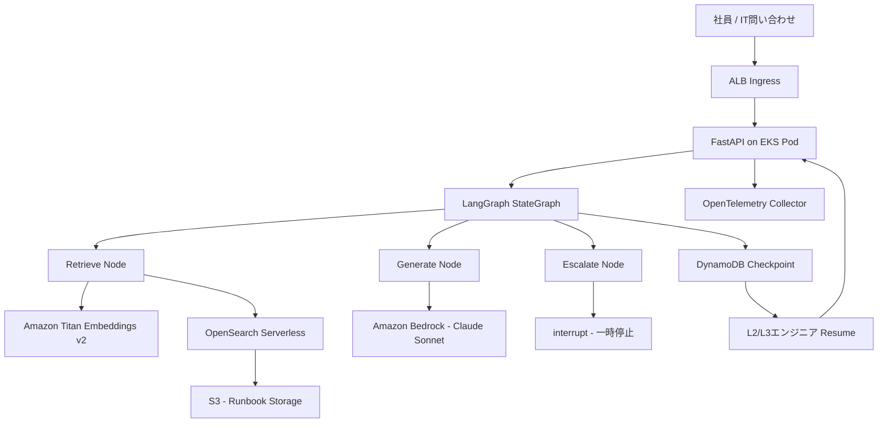

## ブログ概要

本記事は [Building a Stateful IT Service Desk Agent with LangGraph on Amazon EKS](https://aws.amazon.com/blogs/opensource/building-a-stateful-it-service-desk-agent-with-langgraph-on-amazon-eks/) の解説記事です。

AWSオープンソースブログにおいて、Sunil Ramachandra氏とShashidhar Kolur氏は、LangGraph（MITライセンス）とAmazon EKSを組み合わせてステートフルなITサービスデスクエージェントを構築する方法を解説しています。このシステムは、社内IT問い合わせに対してRAG（Retrieval-Augmented Generation）で自動回答を試み、信頼度が閾値未満の場合は`interrupt()`によってグラフ実行を一時停止し、DynamoDBにフルコンテキストを永続化したうえで人間のL2/L3エンジニアにエスカレーションするという、L1自動化とHuman-in-the-Loop（HITL）を統合したアーキテクチャです。

## 情報源

| 項目 | 内容 |
|------|------|
| 種別 | 企業テックブログ（AWS Open Source Blog） |
| URL | [aws.amazon.com/blogs/opensource/...](https://aws.amazon.com/blogs/opensource/building-a-stateful-it-service-desk-agent-with-langgraph-on-amazon-eks/) |
| 組織 | Amazon Web Services |
| 著者 | Sunil Ramachandra, Shashidhar Kolur |
| 発表日 | 2026年6月26日 |

**関連記事**: [LangGraphチェックポイント機構で社内ヘルプデスクの中断復帰を実装する](https://zenn.dev/0h_n0/articles/4caf31c9560691)では、LangGraphのチェックポイント機構をPostgreSQLベースで実装する方法を解説しています。本記事のAWSブログはDynamoDBをチェックポイントバックエンドとして採用しており、マネージドサービスの運用性とスケーラビリティの観点で異なるアプローチを取っています。

## 技術的背景

社内ITサービスデスクでは、VPN接続障害、SSO認証エラー、オンボーディング手続きなど、定型的な問い合わせが大量に発生します。L1サポート（一次対応）の多くはrunbook（手順書）に基づく定型回答で解決可能ですが、未知の問題や複雑なケースではL2/L3エンジニアへのエスカレーションが必要になります。

従来のチャットボットはステートレスであり、エスカレーション時にコンテキストが失われる問題がありました。LangGraphは有向グラフベースのワークフローエンジンであり、各ノード遷移時に状態をチェックポイントとして永続化できます。これにより、Pod再起動、水平スケーリング、マルチレプリカルーティングを跨いでも会話状態を保持できます。2026年時点でLangGraphはKlarna、Replit、Elastic、Cloudflare、Lyft、Uber、Coinbase、NVIDIAなど多くの組織で本番利用されており、エージェントフレームワークとしてのデファクトスタンダードの一つとなっています。

著者らは、このLangGraphの`interrupt()`機構とAWSマネージドサービス群を組み合わせることで、L1自動化とHITLエスカレーションをシームレスに統合する実用的なアーキテクチャを提示しています。

## 実装アーキテクチャ

### システム全体像

著者らが提示するアーキテクチャは、以下の3層構造で構成されています。



### 3ノードグラフの設計

LangGraphの`StateGraph`は3つのノードで構成されています。

1. **Retrieve**: ユーザーの質問をAmazon Titan Text Embeddings v2でベクトル化し、OpenSearch ServerlessのkNN検索でrunbookからTop 5ドキュメントを取得
2. **Generate**: 取得したコンテキストとともにClaude Sonnet（Amazon Bedrock）に送信し、回答・信頼度スコア・カテゴリを構造化出力として抽出
3. **Escalate**: 信頼度が閾値未満の場合、`interrupt()`でグラフ実行を一時停止し、DynamoDBにフルコンテキストを永続化

条件分岐のロジックは以下の通りです。

```python
def route_after_generate(state: SupportState) -> str:
    """Generate後の条件分岐: エスカレーション判定。

    信頼度が閾値未満の場合はエスカレーションノードへ、
    それ以外は処理完了としてENDへルーティングする。
    """
    if state.needs_escalation:
        return "escalate_to_engineer"
    return END
```

### 信頼度評価の二重閾値

著者らのシステムでは、エスカレーション判定に2つの独立した閾値を用いています。

- **検索類似度閾値**: $\theta_{\text{retrieval}} = 0.7$（Titan Embeddingsのコサイン類似度）
- **LLM自己評価閾値**: $\theta_{\text{confidence}} = 7/10$（Claude Sonnetが出力する信頼度スコア）

いずれか一方でも閾値を下回った場合にエスカレーションが発動します。

$$
\text{needs\_escalation} = (\max_{d \in D} \text{score}(d) < \theta_{\text{retrieval}}) \lor (\text{confidence} < \theta_{\text{confidence}})
$$

ここで $D$ は取得されたドキュメント集合、$\text{score}(d)$ は各ドキュメントのkNN検索スコアです。

著者らは「ナレッジベースがまだ薄い段階では閾値を上げて（例: 0.8/8）積極的にエスカレーションし、カバレッジが充実するにつれて緩和する」というチューニング指針も述べています。

### 状態管理: SupportState

全ノードを流れる状態は`SupportState`データクラスで定義されています。

```python
from dataclasses import dataclass, field


@dataclass
class Document:
    """検索で取得したドキュメントを表すデータクラス。"""

    content: str
    source: str
    score: float = 0.0


@dataclass
class SupportState:
    """LangGraphの全ノード間で共有されるサポート状態。

    Attributes:
        question: ユーザーからのIT問い合わせ内容
        documents: 検索で取得したrunbookドキュメントのリスト
        generation: LLMが生成した回答テキスト
        confidence_score: LLMの自己評価による信頼度(1-10)
        needs_escalation: エスカレーション要否フラグ
        engineer_response: L2/L3エンジニアからの回答(エスカレーション時)
        category: 問い合わせカテゴリ(vpn, sso, onboarding等)
    """

    question: str = ""
    documents: list[Document] = field(default_factory=list)
    generation: str = ""
    confidence_score: float = 0.0
    needs_escalation: bool = False
    engineer_response: str | None = None
    category: str = ""  # vpn, sso, onboarding, hardware, access, other
```

## Production Deployment Guide

### AWS実装パターン: Small / Medium / Large

著者らのブログで提示されたアーキテクチャを基に、利用規模別の構成パターンを整理します。以下のコスト試算は2026年7月時点のAWS ap-northeast-1（東京リージョン）料金に基づく概算値であり、最新料金は[AWS料金計算ツール](https://calculator.aws/)で確認を推奨します。

#### Small構成（月間1,000件以下の問い合わせ）

| コンポーネント | 構成 | 月額概算 (USD) |
|---|---|---|
| EKS Control Plane | 1クラスタ | ~$72 |
| EC2 (m7i.large x2) | On-Demand | ~$180 |
| DynamoDB | On-Demand (PAY_PER_REQUEST) | ~$5 |
| OpenSearch Serverless | 2 OCU (最小構成) | ~$350 |
| Bedrock (Claude Sonnet) | ~1,000リクエスト/月 | ~$15 |
| Bedrock (Titan Embeddings) | ~1,000リクエスト/月 | ~$1未満 |
| ALB | 1台 | ~$25 |
| ECR | イメージストレージ | ~$1 |
| **合計** | | **~$650/月** |

#### Large構成（月間100,000件以上の問い合わせ）

| コンポーネント | 構成 | 月額概算 (USD) |
|---|---|---|
| EKS Control Plane | 1クラスタ (XL Provisioned) | ~$1,200 |
| EC2 (m7i.large x5-10) | Spot + Karpenter自動スケーリング | ~$400-800 |
| DynamoDB | On-Demand + DAX キャッシュ | ~$250 |
| OpenSearch Serverless | 8-16 OCU (自動スケーリング) | ~$1,400-2,800 |
| Bedrock (Claude Sonnet) | ~100,000リクエスト/月 | ~$1,500 |
| Bedrock (Titan Embeddings) | ~100,000リクエスト/月 | ~$20 |
| ALB + WAF + Shield | DDoS対策込み | ~$100 |
| CloudWatch + X-Ray + Dashboards | 完全監視 | ~$80 |
| **合計** | | **~$5,000-6,800/月** |

**注意**: 上記はあくまで概算です。Bedrockの料金はリクエストあたりの入出力トークン数に大きく依存します。Claude Sonnet 4.6の料金は入力$3/100万トークン、出力$15/100万トークンです（リージョナルエンドポイント使用時は約10%増）。Titan Text Embeddings v2は入力$0.2/100万トークンです。

### Terraformインフラコード: Small構成

以下は著者らのブログのアーキテクチャをTerraformで再現するSmall構成の主要リソースです。

```hcl
# main.tf - Small構成: DynamoDB + EKS (ap-northeast-1)

# DynamoDB: チェックポイントテーブル（TTL + PITR有効）
resource "aws_dynamodb_table" "checkpoints" {
  name         = "it-support-checkpoints"
  billing_mode = "PAY_PER_REQUEST"
  hash_key     = "PK"
  range_key    = "SK"
  attribute { name = "PK"; type = "S" }
  attribute { name = "SK"; type = "S" }
  ttl { attribute_name = "expiry"; enabled = true }
  point_in_time_recovery { enabled = true }
}

# EKS Cluster: terraform-aws-modules/eks/aws ~> 20.0
module "eks" {
  source          = "terraform-aws-modules/eks/aws"
  version         = "~> 20.0"
  cluster_name    = "it-support-agent"
  cluster_version = "1.31"
  vpc_id          = module.vpc.vpc_id
  subnet_ids      = module.vpc.private_subnets
  eks_managed_node_groups = {
    default = {
      instance_types = ["m7i.large"]
      min_size = 2; max_size = 5; desired_size = 2
      capacity_type = "ON_DEMAND"
    }
  }
}
```

### Large構成の追加要素

Large構成ではSmall構成に加えて以下を追加します。

- **Karpenter NodePool**: `karpenter.sh/capacity-type: [spot, on-demand]`でSpot優先のノードプロビジョニング。対象インスタンスは`m7i.large`, `m7i.xlarge`, `m6i.large`, `m6i.xlarge`。`consolidationPolicy: WhenEmptyOrUnderutilized`で未使用ノードを60秒後に自動回収
- **DAXキャッシュ**: `dax.t3.small`（レプリケーションファクター2）でDynamoDBチェックポイントの読み取りを高速化
- **CPU/メモリ上限**: Karpenterのlimitsで`cpu: 100`, `memory: 400Gi`に制限し、コストの暴走を防止

### 運用・監視設定

#### OpenTelemetry統合

著者らのブログではOpenTelemetryによる分散トレーシングが組み込まれています。各ノードの実行を以下のスパンで計装しています。

```python
from opentelemetry import trace
from opentelemetry.sdk.resources import Resource
from opentelemetry.sdk.trace import TracerProvider
from opentelemetry.sdk.trace.export import BatchSpanProcessor
from opentelemetry.exporter.otlp.proto.grpc.trace_exporter import OTLPSpanExporter
from opentelemetry.instrumentation.fastapi import FastAPIInstrumentor


def init_telemetry(app: "FastAPI") -> None:
    """OpenTelemetryの初期化とFastAPIの自動計装を行う。

    Args:
        app: FastAPIアプリケーションインスタンス
    """
    provider = TracerProvider(
        resource=Resource.create({"service.name": "it-support-agent"})
    )
    provider.add_span_processor(
        BatchSpanProcessor(
            OTLPSpanExporter(
                endpoint="http://otel-collector:4317",
                insecure=True,
            )
        )
    )
    trace.set_tracer_provider(provider)
    FastAPIInstrumentor.instrument_app(app)
```

計装されるスパンは以下の通りです。

| スパン名 | 記録される属性 |
|---|---|
| `support.retrieve` | question, documents_retrieved, top_score, runbooks_searched |
| `support.generate` | confidence_score, best_retrieval_score, needs_escalation, category |
| `support.escalate` | confidence_score, category, engineer_resolved, resolution_time_ms |

#### CloudWatch + X-Ray推奨アラート

本番運用では以下の3つのCloudWatch Alarmを設定することを推奨します。

| アラート名 | メトリクス | 閾値 | 評価期間 |
|---|---|---|---|
| エスカレーション率異常 | `ITSupportAgent/EscalationRate` Average | > 0.5 | 1時間 x 3回 |
| P95レイテンシ超過 | `AWS/ApplicationELB/Duration` p95 | > 10,000ms | 5分 x 3回 |
| DynamoDBスロットリング | `AWS/DynamoDB/ThrottledRequests` Sum | > 10 | 5分 x 1回 |

CloudWatch Agentは`cwagentconfig.json`でKubernetesメトリクス収集（60秒間隔）とX-Ray/OTLPトレース受信を設定します。

### コスト最適化チェックリスト（20項目）

| # | カテゴリ | 施策 |
|---|---|---|
| 1 | Compute | Karpenter + Spotで非クリティカルワーカーのコスト削減 |
| 2 | Compute | HPAのtargetCPUUtilization 70%で過剰プロビジョニング回避 |
| 3 | Compute | Karpenter consolidation policy `WhenEmptyOrUnderutilized`で未使用ノード回収 |
| 4 | Compute | EKS標準サポート期間内のバージョン使用（延長は6倍料金） |
| 5 | Compute | 安定ワークロードにCompute Savings Plans適用 |
| 6 | Bedrock | Claude Sonnet max_tokens 1024制限（ブログ設定値） |
| 7 | Bedrock | Titan Embeddings v2使用（v1比5倍低コスト、精度97%維持） |
| 8 | Bedrock | 月間10万リクエスト超はProvisioned Throughput検討 |
| 9 | Bedrock | プロンプトキャッシュでシステムプロンプトのトークンコスト削減 |
| 10 | Bedrock | cross-region inference回避（リージョナルは約10%プレミアム） |
| 11 | Data | DynamoDB TTLで古いチェックポイント自動削除 |
| 12 | Data | langgraph-checkpoint-awsのS3オフロード（350KB以上自動退避） |
| 13 | Data | OpenSearch Serverless最小2 OCU（約$350/月）の常時課金に注意 |
| 14 | Data | 開発/テスト環境は非冗長構成（約$174/月）を使用 |
| 15 | Data | DAXキャッシュで頻繁な状態読み取りのReadコスト削減 |
| 16 | Network | PrivateLinkでNAT Gatewayデータ転送コスト回避 |
| 17 | Network | ECRライフサイクルポリシーで古いイメージ自動削除 |
| 18 | Ops | CloudWatch Logs保持90日、長期はS3+Glacier |
| 19 | Ops | OTelサンプリングレート調整（全トレースではなく一定割合） |
| 20 | Ops | Cost Explorerタグ分析 + AWS Budgets 80%アラート |

## パフォーマンス最適化

著者らのブログでは明示的なレイテンシやスループットの数値は提示されていませんが、アーキテクチャから読み取れるパフォーマンス最適化ポイントは以下の通りです。

**検索性能**: OpenSearch ServerlessのkNN検索はTop 5に制限しており、検索結果の網羅性とレイテンシのトレードオフを取っています。OCU数はワークロードに応じて自動スケーリングされるため、検索クエリ量の増減にも対応できます。

**LLM推論**: Claude Sonnetの`max_tokens`を1024に制限することで、応答生成の時間とコストを抑制しています。構造化出力パーシング（正規表現による`CONFIDENCE:`と`CATEGORY:`の抽出）により、後処理のオーバーヘッドを最小限にしています。

**チェックポイント永続化**: `langgraph-checkpoint-aws`ライブラリ（v1.1.1、2026年6月17日リリース）は、350KB未満のチェックポイントはDynamoDBに直接保存し、350KB以上はS3にオフロードする仕組みを備えています。DynamoDBのPAY_PER_REQUEST（オンデマンド）モードにより、スパイク時にも自動スケーリングされます。

**水平スケーリング**: HPAのtargetCPUUtilization 70%、minReplicas 2、maxReplicas 10の設定により、負荷に応じたPod数の自動調整が行われます。DynamoDBチェックポイントがPod間で共有されるため、どのPodにリクエストがルーティングされても中断/再開が正しく動作します。

## 運用での学び

著者らのブログから読み取れる運用上の重要な知見を整理します。

**IRSA（IAM Roles for Service Accounts）の採用**: 静的なAWSクレデンシャルをPodに注入する代わりに、EKSのOIDCプロバイダとIAMロールを連携させています。これにより、クレデンシャルのローテーション管理が不要になり、最小権限の原則をKubernetes ServiceAccount単位で適用できます。著者らのIAMポリシーでは、Bedrock（InvokeModel）、DynamoDB（GetItem/PutItem/Query/UpdateItem/DeleteItem）、OpenSearch Serverless（APIAccessAll）の3サービスのみに権限を絞り込んでいます。

**信頼度閾値の段階的チューニング**: 著者らは閾値について「ナレッジベースの充実度に応じて調整する」という実践的な指針を示しています。初期段階では高めの閾値（0.8/8）でエスカレーション率を上げ、回答品質を保護します。runbookの拡充に伴い、閾値を下げて（0.7/7）自動解決率を向上させるという段階的なアプローチです。

**`interrupt()`による状態の完全保存**: エスカレーション時にはLangGraphの`interrupt()`関数が質問文、AI試行回答、信頼度スコア、カテゴリ、参照ソース一覧をペイロードとしてDynamoDBに永続化します。L2/L3エンジニアはこのコンテキストを参照しながら対応でき、ユーザーに再度状況説明を求める必要がありません。

**エスカレーション後の再開**: FastAPIの`/support/{ticket_id}/resolve`エンドポイントで`Command(resume=engineer_response)`を発行すると、DynamoDBからチェックポイントが復元され、Escalateノードの`interrupt()`の戻り値としてエンジニアの回答が注入されます。

## 学術研究との関連

本アーキテクチャは、Human-in-the-Loop AIエージェントに関する近年の研究動向と密接に関連しています。2024年のHuman-in-the-Loop Software Development Agentsに関するサーベイ（arXiv:2411.12924）では、LLMベースのエージェントフレームワークにおいて人間が計画段階やコーディング段階でレビュー・承認を行うことで、開発時間と工数が削減されることが報告されています。また、2025年のTowards Effective Human-in-the-Loop Assistive AI Agents（arXiv:2507.18374）では、AIエージェントにおける適切なエスカレーション判断の重要性が議論されています。

著者らのシステムにおける二重閾値（検索類似度 + LLM自己評価）によるエスカレーション判定は、単純なルールベースと完全自律の中間に位置する実用的なアプローチであり、信頼度キャリブレーションの研究とも関連しています。

## まとめと実践への示唆

著者らのブログは、LangGraphの`interrupt()`+DynamoDBチェックポイントによるステートフルHITLエージェントの実用的な構築パターンを示しています。特に、二重閾値によるエスカレーション判定、IRSAによるセキュアなクレデンシャル管理、OpenTelemetryによる可観測性の3点は、同種のシステムを構築する際の参考になります。一方で、ブログでは具体的なレイテンシやスループットの実測値、エスカレーション率の実績データは提示されていないため、本番導入時には自社環境での性能検証が必要です。OpenSearch Serverlessの最低月額約$350という固定コストも、Small構成では全体コストの過半を占める点に注意が必要です。

## 参考文献

- [Building a Stateful IT Service Desk Agent with LangGraph on Amazon EKS](https://aws.amazon.com/blogs/opensource/building-a-stateful-it-service-desk-agent-with-langgraph-on-amazon-eks/) - AWS Open Source Blog, 2026年6月26日
- [langgraph-checkpoint-aws (PyPI)](https://pypi.org/project/langgraph-checkpoint-aws/) - v1.1.1, 2026年6月17日リリース
- [Build durable AI agents with LangGraph and Amazon DynamoDB](https://aws.amazon.com/blogs/database/build-durable-ai-agents-with-langgraph-and-amazon-dynamodb/) - AWS Database Blog
- [Using DynamoDB as a checkpoint store for LangGraph agents](https://docs.aws.amazon.com/amazondynamodb/latest/developerguide/ddb-langgraph-checkpoint.html) - AWS公式ドキュメント
- [LangGraph GitHub Repository](https://github.com/langchain-ai/langgraph) - MITライセンス
- [langchain-aws DynamoDBSaver Documentation](https://github.com/langchain-ai/langchain-aws/blob/main/libs/langgraph-checkpoint-aws/docs/dynamodb/DynamoDBSaver.md)
- [Amazon Bedrock Pricing](https://aws.amazon.com/bedrock/pricing/) - Claude Sonnet / Titan Embeddings料金
- [Amazon OpenSearch Serverless Pricing](https://aws.amazon.com/opensearch-service/pricing/)
- [Amazon EKS Pricing](https://aws.amazon.com/eks/pricing/)
- [Human-in-the-Loop Software Development Agents](https://arxiv.org/abs/2411.12924) - arXiv, 2024
- [LangGraphチェックポイント機構で社内ヘルプデスクの中断復帰を実装する](https://zenn.dev/0h_n0/articles/4caf31c9560691) - Zenn関連記事

---

*本記事はAIによって生成されました。記事中のコード例・技術的見解は原著者の記述に基づいています。コスト試算は2026年7月時点の概算値であり、最新情報は公式ドキュメントをご確認ください。*
