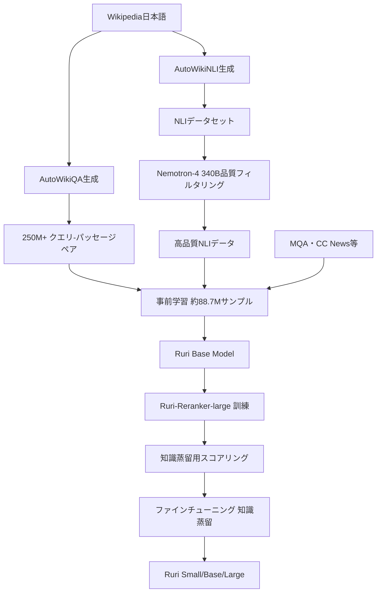

## 論文概要（Abstract）

本記事は [Ruri: Japanese General Text Embeddings（arXiv:2409.07737）](https://arxiv.org/abs/2409.07737) の解説記事です。

Ruriは、名古屋大学の塚越・笹野らが開発した日本語汎用テキスト埋め込みモデル群である。英語・多言語でのembeddingモデル開発が活発に進む中、日本語では訓練データの不足と専門知識の欠如が課題となっていた。著者らはLLM合成データセットの生成、リランカーによるデータフィルタリングと知識蒸留、そしてJMTEBベンチマークによる汎用テキスト埋め込みモデルの有効性評価を通じて、この問題に取り組んだ。最新版Ruri v3（310Mパラメータ）はJMTEBスコア77.24でSOTAを達成し、OSSの日本語embeddingモデルとして有力な選択肢となっている。

この記事は [Zenn記事: Embeddingモデル精度評価の実践：MTEB指標の読み方と最新モデル比較](https://zenn.dev/0h_n0/articles/b70b9c19e0a825) の深掘りです。

## 情報源

- **arXiv ID**: 2409.07737
- **URL**: [arXiv:2409.07737](https://arxiv.org/abs/2409.07737)
- **著者**: Hayato Tsukagoshi, Ryohei Sasano（名古屋大学）
- **発表年**: 2024年9月
- **分野**: Computation and Language (cs.CL)

## 背景と動機（Background & Motivation）

テキスト埋め込みモデルは、RAG（Retrieval-Augmented Generation）やセマンティック検索の基盤技術である。英語圏ではE5やGTE、BGEなど高性能なモデルが次々と登場し、MTEBベンチマークで継続的に評価されている。一方、日本語では以下の課題が存在していた。

1. **訓練データの不足**: 英語ではNLI（Natural Language Inference）やMS MARCOなど大規模な教師付きデータセットが利用可能だが、日本語では同規模のデータセットが存在しない
2. **多言語モデルへの依存**: multilingual-e5やmultilingual-BGEなど多言語モデルが使われていたが、日本語に最適化されておらず性能に限界があった
3. **評価基盤の不在**: 日本語embeddingモデルを横断的に比較するベンチマーク（JMTEB）が整備されたのは比較的最近である

著者らはこれらの課題に対し、LLMを活用した合成データ生成と知識蒸留を組み合わせた訓練パイプラインを構築することで、日本語特化の高性能embeddingモデルを実現した。

## 主要な貢献（Key Contributions）

- **LLM合成データセットの構築**: Wikipediaを基にLLMでクエリ-パッセージペアを250M以上生成（AutoWikiQA）し、日本語の訓練データ不足を解消
- **リランカーの構築と知識蒸留**: Ruri-Reranker-largeでフィルタリングした高品質データを使用し、bi-encoderへの知識蒸留を実施
- **3サイズ展開（Small/Base/Large）**: 68M〜337Mパラメータの3バリアントを提供し、用途に応じた選択を可能に
- **Ruri v3によるSOTA達成**: ModernBERT-Jaベースの310Mモデルで、JMTEB平均スコア77.24を記録
- **OSSとしての公開**: Apache License 2.0で全モデルを公開し、日本語NLPコミュニティに貢献

## 技術的詳細（Technical Details）

### 訓練パイプライン全体像



### LLM合成データ生成（AutoWikiQA）

訓練データ不足を補うため、著者らはWikipediaの日本語記事からLLMを用いてクエリ-パッセージペアを自動生成した。この手法をAutoWikiQAと呼ぶ。

**生成プロセス**:

1. Wikipediaのパッセージを入力としてLLM（Swallow-MX 8x22B / Nemotron-4 340B）に与える
2. LLMがそのパッセージに対する自然な検索クエリを生成する
3. 生成されたクエリとパッセージの組をポジティブペアとする

これにより250M以上のクエリ-パッセージペアが得られた。同様の手法でNLIデータセット（AutoWikiNLI）も生成し、Nemotron-4 340Bの報酬モデルでスコアリングした後、下位20%を除去する品質フィルタリングを実施している。

### 事前学習データ構成

事前学習には約88.7Mサンプルを使用し、以下の構成となっている：

| データソース | サンプル数 | 割合 |
|-------------|-----------|------|
| Wikipedia variants | 37.3M | 42.1% |
| MQA | 25.2M | 28.4% |
| AutoWikiQA（合成） | 11.6M | 13.1% |
| CC News | 9.0M | 10.1% |
| その他 | 5.6M | 6.3% |

Hard negative miningにはBM25を使用し、クエリに対してレキシカルに類似しているがセマンティックに異なるパッセージをネガティブサンプルとして採用している。

### 損失関数

embeddingモデルの訓練には、InfoNCE（Contrastive Loss）を基本損失関数として使用する。

$$
\mathcal{L}_{\text{InfoNCE}} = -\frac{1}{N} \sum_{i=1}^{N} \log \frac{\exp(\text{sim}(\mathbf{q}_i, \mathbf{d}_i^+) / \tau)}{\exp(\text{sim}(\mathbf{q}_i, \mathbf{d}_i^+) / \tau) + \sum_{j=1}^{K} \exp(\text{sim}(\mathbf{q}_i, \mathbf{d}_{i,j}^-) / \tau)}
$$

ここで、
- $\mathbf{q}_i$: $i$番目のクエリの埋め込みベクトル
- $\mathbf{d}_i^+$: $i$番目のポジティブ文書の埋め込みベクトル
- $\mathbf{d}_{i,j}^-$: $i$番目のクエリに対する$j$番目のハードネガティブの埋め込みベクトル
- $\tau$: 温度パラメータ（スケーリング係数）
- $\text{sim}(\cdot, \cdot)$: コサイン類似度
- $K$: ネガティブサンプル数
- $N$: バッチ内のサンプル数

### 知識蒸留

ファインチューニング段階では、Ruri-Reranker-large（CrossEncoder、337Mパラメータ）を教師モデルとした知識蒸留を行う。

**蒸留プロセス**:

1. Ruri-Reranker-largeで検索データセットの各クエリ-文書ペアをスコアリング
2. スコアをmin-max正規化して$[0, 1]$の範囲に変換
3. relevance score < 0.8のサンプルをフィルタリング（低品質ペアの除去）
4. 残った高品質サンプル（検索: 51,427件、NLI: 201,216件）で蒸留

蒸留時の損失関数は、教師モデル（Reranker）のスコア分布と生徒モデル（bi-encoder）のスコア分布のKLダイバージェンスを最小化する：

$$
\mathcal{L}_{\text{KD}} = \text{KL}\left(p^{(T)} \| p^{(S)}\right) = \sum_{j} p_j^{(T)} \log \frac{p_j^{(T)}}{p_j^{(S)}}
$$

ここで、
- $p^{(T)}$: 教師モデル（Reranker）のスコア分布（softmax適用後）
- $p^{(S)}$: 生徒モデル（bi-encoder）の類似度分布（softmax適用後）
- $j$: 候補文書のインデックス

この蒸留により、CrossEncoderの高精度なスコアリング能力をbi-encoderに転移しつつ、bi-encoderの推論速度の利点を保持する。

### Pooling戦略: Mean Pooling vs [CLS]

Ruriでは全バリアントでmean poolingを採用している。[CLS]トークンの出力を使う方式と比較して、mean poolingはトークン全体の情報を均等に集約するため、短い文と長い文の両方でより安定した表現が得られると著者らは報告している。

$$
\mathbf{e} = \frac{1}{L} \sum_{t=1}^{L} \mathbf{h}_t
$$

ここで、$\mathbf{e}$は文埋め込みベクトル、$\mathbf{h}_t$は$t$番目のトークンの隠れ状態、$L$はトークン数（パディング除外）である。

### Ruri v3のアーキテクチャ改善

Ruri v3ではベースモデルをModernBERT-Jaに変更し、以下の改善を実現している：

| 項目 | Ruri v1/v2 | Ruri v3 |
|------|-----------|---------|
| ベースモデル | BERT-base/large-japanese | ModernBERT-Ja |
| パラメータ数 | 68M / 111M / 337M | 310M（315M total） |
| 最大シーケンス長 | 512トークン | 8,192トークン |
| 語彙サイズ | 32K | 100K |
| Attention | 標準 | FlashAttention対応 |
| トークナイザ | MeCab + WordPiece | SentencePiece（外部形態素解析不要） |
| レイヤー数 | - | 25 |
| 出力次元 | 768 / 1024 | 768 |

SentencePieceトークナイザの採用により、MeCabやfugashiなどの外部形態素解析器への依存がなくなり、デプロイの簡素化とクロスプラットフォーム対応が容易になった。

## 実装のポイント（Implementation）

### SentenceTransformersでの利用

Ruriはsentence-transformersライブラリと互換性があり、数行で導入できる。

**Ruri v1/v2（BERT系）の場合**:

```python
from sentence_transformers import SentenceTransformer
import torch.nn.functional as F

def encode_with_ruri_v2(
    queries: list[str],
    documents: list[str],
    model_name: str = "cl-nagoya/ruri-large",
) -> tuple[list[list[float]], list[list[float]]]:
    """Ruri v2でクエリと文書をエンコードする。

    Args:
        queries: 検索クエリのリスト
        documents: 検索対象文書のリスト
        model_name: Hugging Faceモデル名

    Returns:
        クエリ埋め込みと文書埋め込みのタプル
    """
    model = SentenceTransformer(model_name)

    # v1/v2ではプレフィックスが必須
    prefixed_queries = [f"クエリ: {q}" for q in queries]
    prefixed_docs = [f"文章: {d}" for d in documents]

    query_embeddings = model.encode(prefixed_queries)
    doc_embeddings = model.encode(prefixed_docs)

    return query_embeddings.tolist(), doc_embeddings.tolist()
```

**Ruri v3（ModernBERT系）の場合**:

```python
from sentence_transformers import SentenceTransformer

def encode_with_ruri_v3(
    queries: list[str],
    documents: list[str],
    model_name: str = "cl-nagoya/ruri-v3-310m",
) -> tuple[list[list[float]], list[list[float]]]:
    """Ruri v3でクエリと文書をエンコードする。

    v3ではタスクに応じたプレフィックスが変更されている。
    FlashAttention 2対応で高速推論が可能。

    Args:
        queries: 検索クエリのリスト
        documents: 検索対象文書のリスト
        model_name: Hugging Faceモデル名

    Returns:
        クエリ埋め込みと文書埋め込みのタプル
    """
    model = SentenceTransformer(
        model_name,
        trust_remote_code=True,
    )

    # v3ではプレフィックスが変更
    prefixed_queries = [f"検索クエリ: {q}" for q in queries]
    prefixed_docs = [f"検索文書: {d}" for d in documents]

    query_embeddings = model.encode(prefixed_queries)
    doc_embeddings = model.encode(prefixed_docs)

    return query_embeddings.tolist(), doc_embeddings.tolist()
```

### プレフィックスの重要性

Ruriの性能を引き出すにはプレフィックスの付与が不可欠である。プレフィックスなしでエンコードすると検索精度が大幅に低下する。v1/v2とv3でプレフィックスが異なる点に注意が必要である。

| タスク | v1/v2 | v3 |
|--------|-------|-----|
| 検索クエリ | `クエリ: ` | `検索クエリ: ` |
| 検索文書 | `文章: ` | `検索文書: ` |
| 分類・クラスタリング | - | `トピック: ` |
| STS（意味類似度） | - | （プレフィックスなし） |

### 依存パッケージ

```bash
# Ruri v1/v2
pip install sentence-transformers fugashi sentencepiece unidic-lite

# Ruri v3（外部形態素解析不要）
pip install sentence-transformers "transformers>=4.48.0"
# GPU高速化（推奨）
pip install flash-attn
```

## Production Deployment Guide

### AWS実装パターン: 日本語RAGシステムでのruri-v3デプロイ

Ruri v3はCPU推論でもミリ秒オーダーのレイテンシを実現するため、GPUなしのコスト効率の高い構成が可能である。以下にトラフィック量別の推奨構成を示す。

**トラフィック量別の推奨構成**:

| 構成 | トラフィック | モデル | 推奨サービス | 月額概算 |
|------|------------|--------|-------------|---------|
| Small | ~100 req/日 | ruri-v3-30m/70m | Lambda + ECR | $30-80 |
| Medium | ~1000 req/日 | ruri-v3-310m | ECS Fargate (CPU) | $150-400 |
| Large | 10000+ req/日 | ruri-v3-310m + pgvector | EKS + OpenSearch | $800-2,500 |

> **コスト試算の注意事項**: 以下の試算はAWS ap-northeast-1（東京）リージョンの2026年7月時点の概算値です。実際のコストはトラフィックパターン、リージョン、バースト使用量により変動します。最新料金は[AWS料金計算ツール](https://calculator.aws/)で確認してください。

#### Small構成: Lambda + ECR（ruri-v3-30m/70m）

小規模モデル（30M/70Mパラメータ）はLambda関数のメモリ内に収まるため、サーバーレスで運用可能である。コンテナイメージをECRにプッシュし、Lambda関数から直接推論する。

- **Lambda**: 1GB RAM、30秒タイムアウト、ARM64（Graviton2）
- **ECR**: モデル込みコンテナイメージ（~500MB）
- **DynamoDB**: 埋め込みキャッシュ（On-Demand）
- **月額**: Lambda実行$5-15 + ECR$1 + DynamoDB$10-30 + CloudWatch$5 = **$30-80**

#### Medium構成: ECS Fargate CPU推論（ruri-v3-310m）

310Mパラメータモデルは約1.2GBのメモリを消費する。ECS FargateのCPUタスクで十分な推論速度（0.1-0.2ms/文）が得られるため、GPU不要で高いコスト効率を実現できる。

- **ECS Fargate**: 2 vCPU / 4GB RAM、常時1タスク + オートスケーリング（最大4）
- **ALB**: アプリケーションロードバランサー
- **ElastiCache (Redis)**: 埋め込みキャッシュ（cache.t4g.micro）
- **月額**: Fargate$60-200 + ALB$25 + Redis$15 + CloudWatch$10 = **$150-400**

#### Large構成: EKS + ベクトルDB + バッチインデックス

大規模では、EKSクラスタ上でruri-v3推論Podを配置し、pgvector（RDS PostgreSQL）またはOpenSearch Serviceでベクトルインデックスを管理する。バッチインデックス更新にはAWS Batchを使用する。

- **EKS**: m6i.xlarge x 2-4ノード（Spot優先、最大70%削減）
- **RDS PostgreSQL + pgvector**: db.r6g.large（Multi-AZ）
- **OpenSearch Service（代替）**: 2 x m6g.large.search
- **AWS Batch**: バッチインデックス更新（Spot Fargate）
- **月額**: EKS$200-600 + RDS$300-500 + Batch$50-100 + 監視$50 = **$800-2,500**

### Terraformインフラコード

#### Small構成（Serverless）

```hcl
# Ruri v3 Small構成: Lambda + ECR
# 対象: ~100 req/日、ruri-v3-30m/70m

terraform {
  required_version = ">= 1.9"
  required_providers {
    aws = {
      source  = "hashicorp/aws"
      version = "~> 5.60"
    }
  }
}

provider "aws" {
  region = "ap-northeast-1"
}

# ECR リポジトリ（モデルコンテナ格納）
resource "aws_ecr_repository" "ruri_inference" {
  name                 = "ruri-v3-inference"
  image_tag_mutability = "IMMUTABLE"

  image_scanning_configuration {
    scan_on_push = true
  }

  encryption_configuration {
    encryption_type = "KMS"
  }
}

# IAMロール（最小権限）
resource "aws_iam_role" "lambda_ruri" {
  name = "ruri-inference-lambda"

  assume_role_policy = jsonencode({
    Version = "2012-10-17"
    Statement = [{
      Action = "sts:AssumeRole"
      Effect = "Allow"
      Principal = { Service = "lambda.amazonaws.com" }
    }]
  })
}

resource "aws_iam_role_policy" "lambda_ruri_policy" {
  name = "ruri-lambda-policy"
  role = aws_iam_role.lambda_ruri.id

  policy = jsonencode({
    Version = "2012-10-17"
    Statement = [
      {
        Effect = "Allow"
        Action = [
          "logs:CreateLogGroup",
          "logs:CreateLogStream",
          "logs:PutLogEvents"
        ]
        Resource = "arn:aws:logs:*:*:*"
      },
      {
        Effect = "Allow"
        Action = [
          "dynamodb:GetItem",
          "dynamodb:PutItem",
          "dynamodb:Query"
        ]
        Resource = aws_dynamodb_table.embedding_cache.arn
      }
    ]
  })
}

# Lambda関数（ARM64 Graviton2でコスト最適化）
resource "aws_lambda_function" "ruri_inference" {
  function_name = "ruri-v3-inference"
  role          = aws_iam_role.lambda_ruri.arn
  package_type  = "Image"
  image_uri     = "${aws_ecr_repository.ruri_inference.repository_url}:latest"
  architectures = ["arm64"]
  timeout       = 30
  memory_size   = 1024

  environment {
    variables = {
      MODEL_NAME    = "cl-nagoya/ruri-v3-30m"
      CACHE_TABLE   = aws_dynamodb_table.embedding_cache.name
      MAX_BATCH     = "32"
    }
  }
}

# DynamoDB 埋め込みキャッシュ（On-Demand）
resource "aws_dynamodb_table" "embedding_cache" {
  name         = "ruri-embedding-cache"
  billing_mode = "PAY_PER_REQUEST"
  hash_key     = "text_hash"

  attribute {
    name = "text_hash"
    type = "S"
  }

  ttl {
    attribute_name = "expires_at"
    enabled        = true
  }

  server_side_encryption {
    enabled = true
  }
}

# CloudWatchアラーム（コスト監視）
resource "aws_cloudwatch_metric_alarm" "lambda_cost" {
  alarm_name          = "ruri-lambda-invocations-high"
  comparison_operator = "GreaterThanThreshold"
  evaluation_periods  = 1
  metric_name         = "Invocations"
  namespace           = "AWS/Lambda"
  period              = 86400
  statistic           = "Sum"
  threshold           = 1000
  alarm_description   = "Daily Lambda invocations exceed 1000"

  dimensions = {
    FunctionName = aws_lambda_function.ruri_inference.function_name
  }
}
```

#### Large構成（Container）

```hcl
# Ruri v3 Large構成: EKS + pgvector
# 対象: 10000+ req/日、ruri-v3-310m

# EKSクラスタ
module "eks" {
  source  = "terraform-aws-modules/eks/aws"
  version = "~> 20.24"

  cluster_name    = "ruri-embedding-cluster"
  cluster_version = "1.31"

  vpc_id     = module.vpc.vpc_id
  subnet_ids = module.vpc.private_subnets

  # Karpenter用のIAMロール
  enable_irsa = true

  eks_managed_node_groups = {
    # 初期ノード（Karpenterコントローラー用）
    system = {
      instance_types = ["m6i.large"]
      min_size       = 1
      max_size       = 2
      desired_size   = 1

      labels = { role = "system" }
    }
  }
}

# Karpenter Provisioner（Spot優先で最大70%コスト削減）
resource "kubectl_manifest" "karpenter_provisioner" {
  yaml_body = yamlencode({
    apiVersion = "karpenter.sh/v1"
    kind       = "NodePool"
    metadata   = { name = "ruri-inference" }
    spec = {
      template = {
        spec = {
          requirements = [
            {
              key      = "karpenter.sh/capacity-type"
              operator = "In"
              values   = ["spot", "on-demand"]  # Spot優先
            },
            {
              key      = "node.kubernetes.io/instance-type"
              operator = "In"
              values   = ["m6i.xlarge", "m6a.xlarge", "m7i.xlarge"]
            }
          ]
          nodeClassRef = {
            group = "karpenter.k8s.aws"
            kind  = "EC2NodeClass"
            name  = "default"
          }
        }
      }
      limits   = { cpu = "32" }
      disruption = {
        consolidationPolicy = "WhenEmptyOrUnderutilized"
        consolidateAfter    = "30s"
      }
    }
  })
}

# Secrets Manager（モデル設定）
resource "aws_secretsmanager_secret" "ruri_config" {
  name = "ruri-v3-config"

  # KMS暗号化
  kms_key_id = aws_kms_key.ruri.arn
}

resource "aws_kms_key" "ruri" {
  description             = "KMS key for Ruri config encryption"
  deletion_window_in_days = 7
  enable_key_rotation     = true
}

# AWS Budgets（月額予算アラート）
resource "aws_budgets_budget" "ruri_monthly" {
  name         = "ruri-embedding-monthly"
  budget_type  = "COST"
  limit_amount = "2500"
  limit_unit   = "USD"
  time_unit    = "MONTHLY"

  notification {
    comparison_operator       = "GREATER_THAN"
    threshold                 = 80
    threshold_type            = "PERCENTAGE"
    notification_type         = "ACTUAL"
    subscriber_email_addresses = ["ops-team@example.com"]
  }
}
```

### 運用・監視設定

#### CloudWatch Logs Insights クエリ

```
# 推論レイテンシ分析（P95/P99）
fields @timestamp, @message
| filter @message like /inference_latency/
| stats avg(latency_ms) as avg_latency,
        pct(latency_ms, 95) as p95_latency,
        pct(latency_ms, 99) as p99_latency,
        count() as request_count
  by bin(1h) as time_bucket
| sort time_bucket desc

# インデックス品質監視（キャッシュヒット率）
fields @timestamp, @message
| filter @message like /cache_hit|cache_miss/
| stats count() as total,
        sum(cache_hit) as hits
  by bin(1h)
| display total, hits, (hits / total * 100) as hit_rate_pct
```

#### CloudWatch アラーム設定

```python
import boto3

def create_ruri_monitoring_alarms(
    function_name: str = "ruri-v3-inference",
    sns_topic_arn: str = "",
) -> list[str]:
    """Ruri推論Lambda用のCloudWatchアラームを作成する。

    Args:
        function_name: Lambda関数名
        sns_topic_arn: 通知先SNSトピックARN

    Returns:
        作成されたアラームARNのリスト
    """
    client = boto3.client("cloudwatch", region_name="ap-northeast-1")
    alarm_arns: list[str] = []

    # 推論レイテンシ異常検知（P99 > 500ms）
    client.put_metric_alarm(
        AlarmName="ruri-inference-latency-p99",
        MetricName="Duration",
        Namespace="AWS/Lambda",
        Statistic="p99",
        Period=300,
        EvaluationPeriods=3,
        Threshold=500,
        ComparisonOperator="GreaterThanThreshold",
        Dimensions=[
            {"Name": "FunctionName", "Value": function_name},
        ],
        AlarmActions=[sns_topic_arn] if sns_topic_arn else [],
        AlarmDescription="Ruri inference P99 latency exceeds 500ms",
    )
    alarm_arns.append(f"ruri-inference-latency-p99")

    # エラー率異常検知（5分間で5%超過）
    client.put_metric_alarm(
        AlarmName="ruri-inference-error-rate",
        MetricName="Errors",
        Namespace="AWS/Lambda",
        Statistic="Sum",
        Period=300,
        EvaluationPeriods=2,
        Threshold=5,
        ComparisonOperator="GreaterThanThreshold",
        Dimensions=[
            {"Name": "FunctionName", "Value": function_name},
        ],
        AlarmActions=[sns_topic_arn] if sns_topic_arn else [],
        AlarmDescription="Ruri inference error count exceeds 5 in 5min",
    )
    alarm_arns.append(f"ruri-inference-error-rate")

    return alarm_arns
```

#### X-Ray トレーシング設定

```python
from aws_xray_sdk.core import xray_recorder, patch_all
from aws_xray_sdk.core import lambda_launcher
import hashlib

# boto3自動計装
patch_all()

def trace_ruri_inference(
    texts: list[str],
    model_name: str = "cl-nagoya/ruri-v3-310m",
) -> dict:
    """X-Rayトレース付きでRuri推論を実行する。

    Args:
        texts: エンコード対象テキストのリスト
        model_name: 使用するモデル名

    Returns:
        推論結果とトレースメタデータ
    """
    subsegment = xray_recorder.begin_subsegment("ruri_inference")
    subsegment.put_annotation("model", model_name)
    subsegment.put_annotation("batch_size", len(texts))
    subsegment.put_metadata("input_lengths", [len(t) for t in texts])

    try:
        # 推論実行（実装は省略）
        embeddings = _run_inference(texts, model_name)

        subsegment.put_metadata("output_dim", len(embeddings[0]))
        return {"embeddings": embeddings, "count": len(embeddings)}
    except Exception as e:
        subsegment.add_exception(e, stack=True)
        raise
    finally:
        xray_recorder.end_subsegment()
```

#### Cost Explorer 日次コストレポート

```python
import boto3
from datetime import datetime, timedelta

def get_ruri_daily_cost_report() -> dict:
    """Ruri関連AWSサービスの日次コストレポートを取得する。

    Returns:
        サービス別コスト内訳と合計
    """
    client = boto3.client("ce", region_name="ap-northeast-1")
    today = datetime.utcnow().date()
    yesterday = today - timedelta(days=1)

    response = client.get_cost_and_usage(
        TimePeriod={
            "Start": yesterday.isoformat(),
            "End": today.isoformat(),
        },
        Granularity="DAILY",
        Metrics=["UnblendedCost"],
        Filter={
            "Tags": {
                "Key": "Project",
                "Values": ["ruri-embedding"],
            }
        },
        GroupBy=[
            {"Type": "DIMENSION", "Key": "SERVICE"},
        ],
    )

    costs: dict[str, float] = {}
    total = 0.0
    for group in response["ResultsByTime"][0]["Groups"]:
        service = group["Keys"][0]
        amount = float(group["Metrics"]["UnblendedCost"]["Amount"])
        costs[service] = amount
        total += amount

    # $100/日超過でSNS通知
    if total > 100.0:
        sns = boto3.client("sns", region_name="ap-northeast-1")
        sns.publish(
            TopicArn="arn:aws:sns:ap-northeast-1:ACCOUNT:ruri-cost-alert",
            Subject=f"Ruri daily cost alert: ${total:.2f}",
            Message=f"Daily cost exceeded $100: ${total:.2f}\n{costs}",
        )

    return {"date": yesterday.isoformat(), "costs": costs, "total": total}
```

### コスト最適化チェックリスト

**アーキテクチャ選択**:

- [ ] トラフィック~100 req/日 → Lambda + ECR（Serverless）
- [ ] トラフィック~1000 req/日 → ECS Fargate CPU（GPU不要がruri最大の利点）
- [ ] トラフィック10000+ req/日 → EKS + ベクトルDB

**リソース最適化**:

- [ ] EC2/EKSノード: Spot Instances優先（最大70%削減）
- [ ] 長期利用: Reserved Instances 1年コミット（最大40%削減）
- [ ] コンピュート全体: Savings Plans検討（最大30%削減）
- [ ] Lambda: ARM64（Graviton2）でx86比20%割引
- [ ] Lambda: メモリサイズ最適化（Power Tuning実行）
- [ ] ECS/EKS: アイドル時スケールダウン（Karpenter consolidation）
- [ ] ruri-v3はCPU推論で0.1-0.2ms/文のため、GPU不要でコスト削減

**埋め込みキャッシュ戦略**:

- [ ] 同一テキストの再エンコード防止（DynamoDB/Redis）
- [ ] TTL設定でキャッシュ肥大化防止
- [ ] バッチエンコードで呼び出し回数削減（max_batch=32）
- [ ] 類似クエリのキャッシュヒット率向上（正規化前処理）

**監視・アラート**:

- [ ] AWS Budgets: 月額予算アラート設定
- [ ] CloudWatch アラーム: レイテンシP99、エラー率
- [ ] Cost Anomaly Detection: 自動異常検知有効化
- [ ] 日次コストレポート: SNS通知
- [ ] X-Ray: 推論パイプラインのボトルネック可視化

**リソース管理**:

- [ ] 未使用ECRイメージ: ライフサイクルポリシー（30日）
- [ ] タグ戦略: `Project=ruri-embedding`で全リソース追跡
- [ ] CloudWatch Logs: 保持期間設定（90日）
- [ ] 開発環境: 夜間・週末のECS/EKSスケールダウン
- [ ] S3: Intelligent-Tiering（ベクトルバックアップ用）

## 実験結果（Results）

### JMTEB v1/v2ベンチマーク

著者らが報告しているJMTEB v1での主要モデル比較結果を以下に示す（論文Table 3より）。

| モデル | パラメータ数 | Average | Retrieval | STS | Classification |
|-------|------------|---------|-----------|-----|----------------|
| Ruri-small | 68M | 71.53 | 69.41 | 82.79 | 76.22 |
| Ruri-base | 111M | 71.91 | 69.82 | 82.87 | 75.58 |
| Ruri-large | 337M | 73.31 | 73.02 | 83.13 | 77.43 |
| multilingual-e5-large | 278M | 70.90 | 69.73 | 80.55 | 74.66 |
| GLuCoSE-base | 133M | 67.29 | - | - | - |
| text-embedding-3-small | - | 69.18 | - | - | - |
| text-embedding-3-large | - | 74.05 | - | - | - |

Ruri-largeは、同程度のパラメータ数のmultilingual-e5-large（278M）を平均スコアで2.41ポイント上回っている。OpenAIのtext-embedding-3-large（74.05）には0.74ポイント及ばないが、OSSモデルとしてはこの時点で最高性能であった。

### Ruri v3のJMTEBスコア

Ruri v3（310M）はJMTEB平均スコア77.24を達成し、OSSモデルとしてSOTAを記録している（Hugging Face Model Cardより）。

| タスク | スコア |
|--------|-------|
| Retrieval | 81.89 |
| STS | 81.22 |
| Classification | 78.66 |
| Reranking | 93.43 |
| Clustering | 55.69 |
| Pair Classification | 62.60 |
| **Average** | **77.24** |

v1のRuri-large（73.31）から3.93ポイントの改善であり、ModernBERT-Jaへのアーキテクチャ変更と8,192トークン対応が大きく寄与していると考えられる。

### Reranker性能

Ruri-Rerankerはnot only知識蒸留の教師モデルとしてだけでなく、単体のリランカーとしても高い性能を示している（nDCG@10）。

| モデル | JQaRA | JaCWIR | MIRACL |
|-------|-------|--------|--------|
| Ruri-Reranker-base | 74.3 | 93.5 | 95.6 |
| Ruri-Reranker-large | 77.1 | 94.1 | 96.1 |

特にMIRACLデータセットでnDCG@10=96.1を記録しており、日本語のリランキングタスクにおいて優れた性能を発揮している。

## 実運用への応用（Practical Applications）

### RAGパイプラインでの活用

Zenn記事で紹介されているように、Ruriは日本語RAGシステムのembeddingモデルとして有力な選択肢である。Ruri v3のJMTEB Retrievalスコア81.89は、ローカル推論可能なOSSモデルとしてはトップクラスであり、以下の利点がある。

1. **CPU推論の高速性**: 0.1-0.2ms/文のレイテンシでGPU不要（コスト効率が高い）
2. **長文対応**: 8,192トークンまで処理可能で、長い文書のチャンク分割を減らせる
3. **外部依存の少なさ**: v3ではSentencePieceのみでMeCab不要、Dockerコンテナの構築が容易
4. **Rerankerとの組み合わせ**: Ruri-Rerankerを2段階検索に使用し、Retrieval精度をさらに向上

### 制約と考慮事項

著者らの報告によれば、Ruri v3のJMTEB平均スコア77.24はGemini Embedding（スコア非公開だがZenn記事ではP@1=0.588 vs Ruriの0.555）に劣る場面がある。APIベースのモデルと比較する際は、レイテンシ・コスト・プライバシー要件を含めた総合判断が必要である。

## 関連研究（Related Work）

- **E5 (Wang et al., 2022)**: 英語のテキスト埋め込みモデル。LLM合成データによる訓練手法はRuriの手法と方向性が一致する
- **BGE (Xiao et al., 2023)**: BAAIが開発した多言語embeddingモデル。RetroMAEによる事前学習とmulti-stage fine-tuningを採用
- **GTE (Li et al., 2023)**: Alibaba DARMOによるembeddingモデル。multi-stage対比学習を採用し、MTEBで高いスコアを記録
- **JMTEB (Usui et al., 2024)**: 日本語のテキスト埋め込みモデルを評価するベンチマーク。Retrieval、STS、Classification等の多様なタスクで構成される

## まとめと今後の展望

Ruriは、LLM合成データ（AutoWikiQA）の大規模生成と、Rerankerからbi-encoderへの知識蒸留を組み合わせることで、日本語特化の高性能テキスト埋め込みモデルを実現した。Ruri v3ではModernBERT-Jaをベースに8,192トークン対応とSentencePieceトークナイザを採用し、JMTEB平均スコア77.24のSOTAを達成している。

CPU推論での高速性（0.1-0.2ms/文）とApache License 2.0でのOSS公開は、日本語RAGシステムの構築においてコスト効率とデプロイ容易性の両面で大きな利点となる。今後は、さらなるデータ品質の向上やinstruction-tuned embeddingへの発展が期待される。

## 参考文献

- **arXiv**: [https://arxiv.org/abs/2409.07737](https://arxiv.org/abs/2409.07737)
- **Ruri v3 (Hugging Face)**: [https://huggingface.co/cl-nagoya/ruri-v3-310m](https://huggingface.co/cl-nagoya/ruri-v3-310m)
- **Ruri-large (Hugging Face)**: [https://huggingface.co/cl-nagoya/ruri-large](https://huggingface.co/cl-nagoya/ruri-large)
- **Ruri-Reranker-large (Hugging Face)**: [https://huggingface.co/cl-nagoya/ruri-reranker-large](https://huggingface.co/cl-nagoya/ruri-reranker-large)
- **JMTEB**: [https://github.com/sbintuitions/JMTEB](https://github.com/sbintuitions/JMTEB)
- **Related Zenn article**: [https://zenn.dev/0h_n0/articles/b70b9c19e0a825](https://zenn.dev/0h_n0/articles/b70b9c19e0a825)
