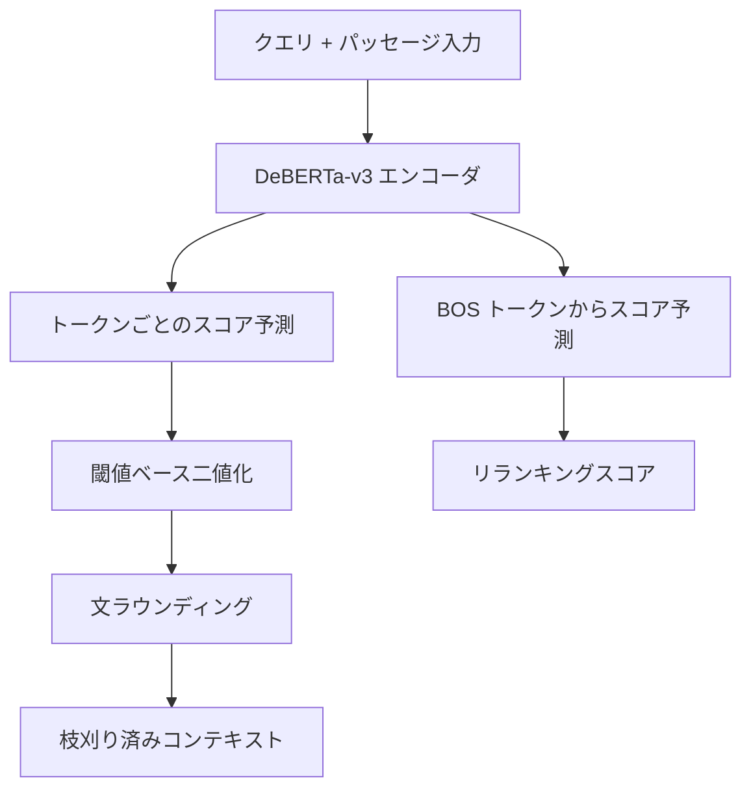
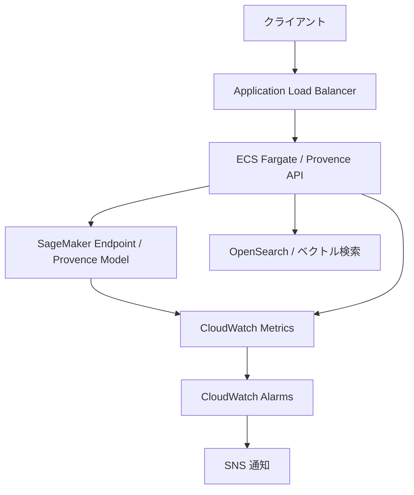

本記事は [arXiv 2501.16214](https://arxiv.org/abs/2501.16214)（ICLR 2025採択）の解説記事です。Navier Labs Europeの Chirkova らが提案した **Provence (Pruning and Reranking Of retrieVEd relevaNt ContExts)** は、RAG パイプラインにおける文脈枝刈り（context pruning）をバイナリ系列ラベリングとして定式化し、既存のリランカーに統合することで追加コストゼロの文脈圧縮を実現する手法である。6つのベンチマークで 75-82% の圧縮率を達成しつつ、回答品質を維持している。

## 情報源

| 項目 | 詳細 |
|------|------|
| 論文タイトル | Provence: efficient and robust context pruning for retrieval-augmented generation |
| 著者 | Nadezhda Chirkova, Thibault Formal, Vassilina Nikoulina, Stéphane Clinchant |
| 所属 | Naver Labs Europe |
| arXiv ID | [2501.16214](https://arxiv.org/abs/2501.16214) |
| 採択 | ICLR 2025 (Conference Paper) |
| カテゴリ | cs.CL, cs.IR |
| コード・モデル | [naver/provence-reranker-debertav3-v1](https://huggingface.co/naver/provence-reranker-debertav3-v1) |

## カンファレンス情報

ICLR（International Conference on Learning Representations）は、深層学習・表現学習分野における主要国際会議であり、NeurIPS・ICML と並ぶ機械学習トップカンファレンスの一つである。ICLR 2025 はシンガポールで開催され、採択率は約 32% であった。Provence はポスター発表として採択されている。

## 背景と動機

Retrieval-Augmented Generation（RAG）は、外部知識ベースから検索した文書をコンテキストとして LLM に与えることで、知識の正確性と最新性を向上させる手法である。しかし、検索されたパッセージには回答に無関係な文が多く含まれ、これが LLM の推論コスト増大と回答品質の低下（Lost in the Middle 問題）を引き起こす。

著者らは、既存の文脈圧縮手法に以下の限界があると指摘している。LLMLingua 系はトークン単位の枝刈りを行うが、小型言語モデルの perplexity に依存するため計算コストが高い（50サンプルで194秒）。RECOMP は文の抽出・要約を行うが、T5ベースのモデルを別途必要とし、パイプラインが複雑になる。いずれの手法もリランキングとは独立に動作するため、RAG パイプライン全体で見ると追加の計算コストが発生する。

## 主要な貢献

著者らは以下の4つの貢献を報告している。

**1. 系列ラベリングとしての定式化**: 文脈枝刈りを、クエリとパッセージの連結入力に対するバイナリ系列ラベリング問題として定式化した。各トークンに対して「保持」か「除去」かのラベルを予測し、文単位の丸め処理（sentence rounding）で最終的な枝刈り結果を得る。

**2. リランカーとの統合**: DeBERTa-v3 ベースのリランカーに枝刈りヘッドを追加することで、単一モデルで reranking と pruning を同時に実行する Unified Provence を実現した。

**3. ゼロコスト枝刈り**: リランキング処理の中で枝刈りが完了するため、既にリランカーを使用している RAG パイプラインでは枝刈りの追加コストが実質ゼロとなる。

**4. ドメインロバスト性**: MS MARCO と NQ という異なるドメインの学習データで訓練することで、Wikipedia、生物医学、ニュース、シラバスなど多様なドメインに対する汎化性能を確保した。

## 技術的詳細

### 損失関数

Provence の学習には、枝刈りラベルの予測損失とリランキングスコアの回帰損失を組み合わせたマルチタスク損失関数を使用する。

$$
\mathcal{L} = \sum_{n=1}^{N} \left\{ \sum_{k=1}^{L_n} \log P(y_{n,k} \mid z_{n,k}) + \lambda (s_n - z_{n,0})^2 \right\}
$$

各変数の定義は以下の通りである。

- $$N$$: 学習サンプル数
- $$L_n$$: サンプル $$n$$ のトークン数
- $$y_{n,k}$$: トークン $$k$$ の枝刈りグラウンドトゥルースラベル（0: 除去, 1: 保持）
- $$z_{n,k}$$: モデルが予測するトークン $$k$$ のスコア
- $$s_n$$: 教師リランカー（cross-encoder）が出力する関連度スコア
- $$z_{n,0}$$: BOS トークンの出力から予測されるランキングスコア
- $$\lambda$$: ランキング損失の重み係数（$$\lambda = 0.05$$）

第一項は各トークンの枝刈り予測に対するバイナリクロスエントロピー損失、第二項は BOS トークンからのスコア予測と教師リランカースコアの MSE 損失である。

### シルバーラベルの生成

枝刈りの正解ラベルは直接入手できないため、著者らは Llama-3-8B-Instruct を用いたシルバーラベル生成を行っている。具体的には、パッセージ中の各文について、その文を含む場合と含まない場合でLLMに回答を生成させ、回答品質の差分から文の重要度を判定する。

### 推論メカニズム

推論時の処理は以下の3ステップで構成される。



**ステップ1: 閾値ベース二値化**

各トークンのスコア $$z_k$$ を閾値 $$T$$ で二値化する。著者らは $$T = 0.1$$（高再現率）と $$T = 0.5$$（高精度）の2つの設定を報告している。

**ステップ2: 文ラウンディング**

トークン単位の予測を文単位に変換する。文中の50%以上のトークンが「保持」と予測された場合、その文全体を保持する。これにより、文法的に不完全な断片が生成されることを防ぐ。

**ステップ3: 統合モード**

Unified Provence では、リランキングと枝刈りが単一のフォワードパスで完了する。BOS トークンの出力からリランキングスコアを、残りのトークンの出力から枝刈り予測を同時に取得する。

### 実装例

以下は Hugging Face の公開モデルを用いた Provence の基本的な利用例である。

```python
from transformers import AutoModel


def prune_context(
    question: str,
    contexts: list[str],
    threshold: float = 0.1,
    top_k: int = 5,
) -> dict[str, list[str] | list[float]]:
    """Provenceモデルで文脈を枝刈りし、リランキングスコアを返す。

    Args:
        question: ユーザーのクエリ文字列。
        contexts: 検索で取得したパッセージのリスト。
        threshold: 枝刈り閾値（0.1: 高再現率、0.5: 高精度）。
        top_k: リランキング後に返す上位パッセージ数。

    Returns:
        枝刈り済みパッセージとスコアを含む辞書。
    """
    provence = AutoModel.from_pretrained(
        "naver/provence-reranker-debertav3-v1",
        trust_remote_code=True,
    )

    output = provence.process(
        question,
        contexts,
        threshold=threshold,
        reorder=True,
        top_k=top_k,
    )

    return {
        "pruned_contexts": output.pruned_contexts,
        "scores": output.scores,
    }
```

## 実装のポイント

### 閾値の選択

著者らは閾値 $$T$$ の選択がタスク特性に依存すると報告している。$$T = 0.1$$ は圧縮率がやや低下するものの重要な情報を取りこぼしにくく、事実抽出型（extractive）のQAに適している。一方、$$T = 0.5$$ はより積極的な圧縮を行い、マルチホップ推論など冗長な情報がノイズになりやすいタスクで有効とされている。

### 文ラウンディングの効果

トークン単位の予測をそのまま使用すると、文の一部のみが残り文法的に不完全な断片が生成される。著者らの実験では、文ラウンディングを適用することで、LLM の回答品質が平均 2-3 ポイント向上したと報告されている。この処理は単純な多数決であり、追加の計算コストは無視できる。

### モデルサイズとコンテキスト長

Provence は DeBERTa-v3-large（約4.3億パラメータ）をベースとしており、コンテキスト長は512トークンに制限される。512トークンを超えるパッセージでは、パッセージを分割して処理する必要がある。著者らはこの制約について論文中で明示的に議論しており、長文パッセージへの対応は今後の課題としている。

## Production Deployment Guide

Provence を本番環境に導入する際の構成例を示す。以下は AWS 上での典型的なデプロイ構成である。

### アーキテクチャ概要



### AWS 構成表（2026年7月時点の料金）

| コンポーネント | サービス | インスタンス | 月額概算（USD） | 備考 |
|---|---|---|---|---|
| モデル推論 | SageMaker Real-time Endpoint | ml.g5.xlarge | $1,462 | 24/7稼働、GPU 1基 |
| API サーバー | ECS Fargate | 2 vCPU / 4GB | $146 | 2タスク常時起動 |
| ベクトル検索 | OpenSearch Serverless | — | $700 | 2 OCU 最小構成 |
| ロードバランサー | ALB | — | $22 | 固定料金 + LCU |
| 監視 | CloudWatch | — | $30 | カスタムメトリクス10個 |
| 通知 | SNS | — | $1未満 | メール通知 |
| **合計** | | | **約 $2,361** | |

**コスト最適化オプション**: SageMaker Savings Plans を適用すると、ml.g5.xlarge の推論コストを最大64%削減可能である（$1,462 → 約$526/月）。バッチ処理が許容される場合は、SageMaker Serverless Inference（コールドスタートあり）でさらに削減できる。

### Terraform 構成

```hcl
# --- SageMaker Endpoint for Provence ---

resource "aws_sagemaker_model" "provence" {
  name               = "provence-reranker-debertav3"
  execution_role_arn = var.sagemaker_role_arn

  primary_container {
    image          = "763104351884.dkr.ecr.ap-northeast-1.amazonaws.com/huggingface-pytorch-inference:2.3.0-transformers4.44.2-gpu-py311-cu121-ubuntu22.04"
    model_data_url = "s3://${var.model_bucket}/provence/model.tar.gz"
    environment = {
      HF_MODEL_ID             = "naver/provence-reranker-debertav3-v1"
      HF_TASK                 = "custom"
      SAGEMAKER_PROGRAM       = "inference.py"
      SAGEMAKER_SUBMIT_DIRECTORY = "/opt/ml/model/code"
    }
  }

  tags = {
    Project     = "rag-pipeline"
    Environment = var.environment
  }
}

resource "aws_sagemaker_endpoint_configuration" "provence" {
  name = "provence-endpoint-config-${var.environment}"

  production_variants {
    variant_name           = "primary"
    model_name             = aws_sagemaker_model.provence.name
    initial_instance_count = var.min_instance_count
    instance_type          = "ml.g5.xlarge"

    model_data_download_timeout_in_seconds = 600
    container_startup_health_check_timeout_in_seconds = 300
  }

  tags = {
    Project     = "rag-pipeline"
    Environment = var.environment
  }
}

resource "aws_sagemaker_endpoint" "provence" {
  name                 = "provence-endpoint-${var.environment}"
  endpoint_config_name = aws_sagemaker_endpoint_configuration.provence.name

  tags = {
    Project     = "rag-pipeline"
    Environment = var.environment
  }
}

# --- Auto Scaling ---

resource "aws_appautoscaling_target" "provence" {
  max_capacity       = var.max_instance_count
  min_capacity       = var.min_instance_count
  resource_id        = "endpoint/${aws_sagemaker_endpoint.provence.name}/variant/primary"
  scalable_dimension = "sagemaker:variant:DesiredInstanceCount"
  service_namespace  = "sagemaker"
}

resource "aws_appautoscaling_policy" "provence_scaling" {
  name               = "provence-target-tracking"
  policy_type        = "TargetTrackingScaling"
  resource_id        = aws_appautoscaling_target.provence.resource_id
  scalable_dimension = aws_appautoscaling_target.provence.scalable_dimension
  service_namespace  = aws_appautoscaling_target.provence.service_namespace

  target_tracking_scaling_policy_configuration {
    predefined_metric_specification {
      predefined_metric_type = "SageMakerVariantInvocationsPerInstance"
    }
    target_value       = 100
    scale_in_cooldown  = 300
    scale_out_cooldown = 60
  }
}

# --- Variables ---

variable "sagemaker_role_arn" {
  description = "SageMaker 実行ロールの ARN"
  type        = string
}

variable "model_bucket" {
  description = "モデルアーティファクトの S3 バケット名"
  type        = string
}

variable "environment" {
  description = "デプロイ環境（dev / staging / prod）"
  type        = string
  default     = "prod"
}

variable "min_instance_count" {
  description = "最小インスタンス数"
  type        = number
  default     = 1
}

variable "max_instance_count" {
  description = "最大インスタンス数"
  type        = number
  default     = 3
}
```

### 監視設定

Provence エンドポイントの健全性を監視するための CloudWatch 設定例を示す。

```python
import boto3
from typing import Any


def create_provence_alarms(
    endpoint_name: str,
    sns_topic_arn: str,
    region: str = "ap-northeast-1",
) -> list[dict[str, Any]]:
    """Provenceエンドポイント用のCloudWatchアラームを作成する。

    Args:
        endpoint_name: SageMaker エンドポイント名。
        sns_topic_arn: 通知先 SNS トピックの ARN。
        region: AWS リージョン。

    Returns:
        作成されたアラームの情報リスト。
    """
    cloudwatch = boto3.client("cloudwatch", region_name=region)

    alarms_config = [
        {
            "AlarmName": f"{endpoint_name}-latency-p99",
            "MetricName": "ModelLatency",
            "Namespace": "AWS/SageMaker",
            "Statistic": "p99",
            "Period": 300,
            "EvaluationPeriods": 3,
            "Threshold": 500_000,  # 500ms in microseconds
            "ComparisonOperator": "GreaterThanThreshold",
            "AlarmDescription": "P99レイテンシが500msを超過",
        },
        {
            "AlarmName": f"{endpoint_name}-error-rate",
            "MetricName": "Invocation5XXErrors",
            "Namespace": "AWS/SageMaker",
            "Statistic": "Sum",
            "Period": 300,
            "EvaluationPeriods": 2,
            "Threshold": 10,
            "ComparisonOperator": "GreaterThanThreshold",
            "AlarmDescription": "5分間で5XXエラーが10件を超過",
        },
        {
            "AlarmName": f"{endpoint_name}-gpu-utilization",
            "MetricName": "GPUUtilization",
            "Namespace": "/aws/sagemaker/Endpoints",
            "Statistic": "Average",
            "Period": 300,
            "EvaluationPeriods": 6,
            "Threshold": 85,
            "ComparisonOperator": "GreaterThanThreshold",
            "AlarmDescription": "GPU使用率が30分間85%超（スケールアウト検討）",
        },
    ]

    created_alarms = []
    for config in alarms_config:
        cloudwatch.put_metric_alarm(
            **config,
            Dimensions=[
                {
                    "Name": "EndpointName",
                    "Value": endpoint_name,
                },
                {
                    "Name": "VariantName",
                    "Value": "primary",
                },
            ],
            AlarmActions=[sns_topic_arn],
            OKActions=[sns_topic_arn],
            TreatMissingData="notBreaching",
        )
        created_alarms.append(
            {"name": config["AlarmName"], "threshold": config["Threshold"]}
        )

    return created_alarms
```

### カスタムメトリクスの送信

Provence 固有のメトリクス（圧縮率、枝刈りトークン数）を CloudWatch に送信する。

```python
import boto3
import time
from typing import Any


def publish_provence_metrics(
    endpoint_name: str,
    compression_ratio: float,
    pruned_tokens: int,
    total_tokens: int,
    latency_ms: float,
    region: str = "ap-northeast-1",
) -> None:
    """Provence固有のカスタムメトリクスをCloudWatchに送信する。

    Args:
        endpoint_name: SageMaker エンドポイント名。
        compression_ratio: 圧縮率（0.0-1.0）。
        pruned_tokens: 枝刈りされたトークン数。
        total_tokens: 入力トークン総数。
        latency_ms: 推論レイテンシ（ミリ秒）。
        region: AWS リージョン。
    """
    cloudwatch = boto3.client("cloudwatch", region_name=region)

    cloudwatch.put_metric_data(
        Namespace="Provence/RAGPipeline",
        MetricData=[
            {
                "MetricName": "CompressionRatio",
                "Value": compression_ratio,
                "Unit": "None",
                "Dimensions": [
                    {"Name": "EndpointName", "Value": endpoint_name},
                ],
                "Timestamp": time.time(),
            },
            {
                "MetricName": "PrunedTokens",
                "Value": pruned_tokens,
                "Unit": "Count",
                "Dimensions": [
                    {"Name": "EndpointName", "Value": endpoint_name},
                ],
                "Timestamp": time.time(),
            },
            {
                "MetricName": "InferenceLatencyMs",
                "Value": latency_ms,
                "Unit": "Milliseconds",
                "Dimensions": [
                    {"Name": "EndpointName", "Value": endpoint_name},
                ],
                "Timestamp": time.time(),
            },
        ],
    )
```

### デプロイチェックリスト

**モデル準備**

- [ ] Hugging Face モデル（`naver/provence-reranker-debertav3-v1`）を S3 にアップロード
- [ ] `inference.py` にカスタム推論コード（`model_fn`, `input_fn`, `predict_fn`, `output_fn`）を実装
- [ ] `model.tar.gz` にモデルファイルと `code/` ディレクトリをパッケージング
- [ ] GPU 対応の推論コンテナイメージを選択（PyTorch + CUDA 12.1）

**エンドポイント設定**

- [ ] ml.g5.xlarge インスタンスで動作確認（DeBERTa-v3-large は約1.7GB VRAM）
- [ ] `ContainerStartupHealthCheckTimeoutInSeconds` を 300秒以上に設定
- [ ] Auto Scaling ポリシーを設定（`InvocationsPerInstance` ターゲット: 100）
- [ ] スケールイン/アウトのクールダウン期間を設定（イン: 300秒、アウト: 60秒）

**監視・アラート**

- [ ] P99 レイテンシアラーム（閾値: 500ms）
- [ ] 5XX エラーレートアラーム（閾値: 5分間10件）
- [ ] GPU 使用率アラーム（閾値: 85%、30分継続）
- [ ] カスタムメトリクス（圧縮率、枝刈りトークン数）の送信を確認
- [ ] SNS トピック経由のアラート通知先を設定

**セキュリティ**

- [ ] SageMaker 実行ロールに最小権限の IAM ポリシーを付与
- [ ] VPC エンドポイント経由でのアクセスに制限
- [ ] S3 バケットのサーバーサイド暗号化（SSE-KMS）を有効化
- [ ] エンドポイントへのアクセスを IAM 認証で制限

**負荷テスト**

- [ ] 想定ピークの2倍の負荷でレイテンシ・スループットを計測
- [ ] Auto Scaling のスケールアウト/イン動作を確認
- [ ] 長時間（24時間以上）の安定性テストを実施

## 実験結果

### ベンチマーク性能

著者らは6つのQAデータセットで評価を行い、以下の結果を報告している。LLM-Eval は GPT-4 による回答品質の自動評価スコアである。

| データセット | LLM-Eval | 圧縮率 | 特徴 |
|---|---|---|---|
| NQ (Natural Questions) | 72.6 | 76.0% | Wikipedia ベースの事実質問 |
| HotpotQA | 56.0 | 82.4% | マルチホップ推論 |
| PopQA | 59.5 | 75.8% | エンティティ知識 |
| TyDi QA | 73.6 | 76.2% | 多言語QA（英語部分） |
| BioASQ | 80.6 | 49.0% | 生物医学ドメイン |
| RGB | 96.3 | 69.3% | ロバスト性評価 |

BioASQ の圧縮率が49.0%と低い点について、著者らは生物医学テキストの情報密度が高く、文単位での除去が困難であるためと分析している。

### 計算効率

著者らは50サンプルでの推論時間と浮動小数点演算回数（MFLOPS）を比較している。

| 手法 | 推論時間（50サンプル） | MFLOPS | 備考 |
|---|---|---|---|
| LongLLMLingua | 194秒 | 5.4 × 10¹⁶ | GPT-2ベース perplexity 計算 |
| RECOMP | 499秒 | 5.36 × 10¹⁴ | T5ベース要約モデル |
| Provence (standalone) | 25秒 | 7.9 × 10¹⁴ | DeBERTa-v3 単独実行 |
| Unified Provence | ほぼ0秒 | — | リランキングに統合 |

Provence の standalone 実行は LongLLMLingua の約8倍高速であり、Unified モードではリランキングのフォワードパスに統合されるため追加コストが実質ゼロとなる。

### リランキング性能の維持

枝刈りヘッドの追加がリランキング性能に悪影響を与えないことも重要な結果である。

| ベンチマーク | Provence | DeBERTa-v3 ベースライン |
|---|---|---|
| NQ Recall@5 | 84.4 | 83.0 |
| MS MARCO MRR@10 | 40.6 | 40.5 |
| BEIR 平均 nDCG@10 | 55.9 | 55.4 |

いずれの指標でもベースラインと同等以上の性能を維持しており、枝刈りタスクの追加がリランキング性能を損なわないことを著者らは確認している。

## 実運用への応用

Provence の特性は、設備保全ナレッジ検索のようなドメイン特化型 RAG システムとの親和性が高い。設備保全マニュアルは長文かつ定型的な記述が多く、回答に必要な部分は文書全体のごく一部であることが多い。Provence の76-82%という圧縮率は、こうした冗長性の高い文書に対して特に有効と考えられる。

関連する Zenn 記事「[PruneRAGの動的チャンク枝刈りで設備保全ナレッジ検索を高速化する](https://zenn.dev/0h_n0/articles/91becffa48ec2e)」では、チャンク単位の枝刈りによる RAG 高速化を扱っているが、Provence は文単位のより細粒度な枝刈りを提供する。リランカーを既に導入しているパイプラインであれば、Provence への置き換えにより追加コストなしで文脈圧縮を実現できる。

## 制限事項

著者らは以下の制限事項を明記している。

- **文位置バイアス**: パッセージの先頭と末尾の文に対して枝刈り精度が低下する傾向がある
- **タスク範囲**: QA タスクのみで評価されており、要約・対話など他のタスクへの適用は未検証である
- **言語**: 英語のみで訓練・評価されている（多言語拡張は後続研究 XProvence で対応）
- **コンテキスト長**: DeBERTa-v3 の512トークン制限により、長文パッセージの処理に分割が必要となる

## 関連研究

**LLMLingua / LongLLMLingua** (Jiang et al., 2023): 小型言語モデルの perplexity を用いたトークン単位の文脈圧縮手法である。粗粒度から細粒度への段階的圧縮パイプラインを構築している。Provence と比較すると計算コストが高く（約8倍）、圧縮率の制御が困難である。

**RECOMP** (Xu et al., 2023): 検索された文書を抽出的・抽象的に圧縮する手法である。抽出的圧縮では関連文の選択、抽象的圧縮では T5 ベースの要約モデルを使用する。Provence よりも推論時間が長く（50サンプルで499秒）、別途圧縮モデルの管理が必要となる。

**AttentionRAG** (2025): LLM の attention パターンを利用してクエリと文脈の関連度を推定し、枝刈りを行う手法である。最大6.3倍の文脈圧縮を達成しつつ LLMLingua 系を約10%上回る性能を報告している。ただし、LLM の attention 計算自体にコストがかかるため、Provence の Unified モードのようなゼロコスト統合は実現していない。

## まとめ

Provence は、文脈枝刈りをバイナリ系列ラベリングとして定式化し、リランカーと統合することで追加コストゼロの文脈圧縮を実現した手法である。6つのベンチマークで75-82%の圧縮率と回答品質の維持を両立し、既存手法と比較して約8倍の推論速度を達成している。リランカーを既に運用している RAG パイプラインにとって、Provence への切り替えは低リスクかつ高効果な最適化選択肢と位置づけられる。

## 参考文献

1. Chirkova, N., Formal, T., Nikoulina, V., & Clinchant, S. (2025). Provence: efficient and robust context pruning for retrieval-augmented generation. *ICLR 2025*. [arXiv:2501.16214](https://arxiv.org/abs/2501.16214)
2. Jiang, Z., Wu, F. D., Shao, L., & Lü, S. (2023). LLMLingua: Compressing Prompts for Accelerated Inference of Large Language Models. *EMNLP 2023*. [arXiv:2310.05736](https://arxiv.org/abs/2310.05736)
3. Xu, F., Shi, W., & Choi, E. (2023). RECOMP: Improving Retrieval-Augmented LMs with Compression and Selective Augmentation. *ICLR 2024*. [arXiv:2310.04408](https://arxiv.org/abs/2310.04408)
4. AttentionRAG: Attention-Guided Context Pruning in Retrieval-Augmented Generation. (2025). [arXiv:2503.10720](https://arxiv.org/abs/2503.10720)
5. He, P., Liu, X., Gao, J., & Chen, W. (2021). DeBERTa: Decoding-enhanced BERT with Disentangled Attention. *ICLR 2021*. [arXiv:2006.03654](https://arxiv.org/abs/2006.03654)
6. Naver Labs Europe. provence-reranker-debertav3-v1. [Hugging Face Model](https://huggingface.co/naver/provence-reranker-debertav3-v1)
