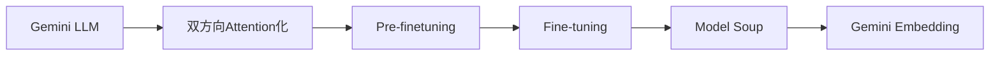

## 論文概要（Abstract）

本記事は[Gemini Embedding論文](https://arxiv.org/abs/2503.07891)の解説記事です。

Gemini Embeddingは、GoogleのGemini LLMが持つ多言語・コード理解能力を埋め込み（embedding）モデルへ転用した手法である。著者らは、classification、similarity、clustering、ranking、retrievalといった多様な下流タスクに対応する汎用的なテキスト表現の獲得を目指した。Massive Multilingual Text Embedding Benchmark（MMTEB）において100以上のタスク・250以上の言語を対象に評価を行い、既存手法を大幅に上回る性能を報告している。

この記事は [Zenn記事: Embeddingモデル精度評価の実践：MTEB指標の読み方と最新モデル比較](https://zenn.dev/0h_n0/articles/b70b9c19e0a825) の深掘りです。

## 情報源

- **arXiv ID**: 2503.07891
- **URL**: [arXiv:2503.07891](https://arxiv.org/abs/2503.07891)
- **著者**: Jinhyuk Lee, Feiyang Chen, Sahil Dua, et al.（47名、Google）
- **発表年**: 2025年3月
- **分野**: Computation and Language (cs.CL), Artificial Intelligence (cs.AI)

## 背景と動機（Background & Motivation）

テキスト埋め込みモデルは、セマンティック検索・RAG・文書分類など多くのNLPアプリケーションの基盤技術である。従来の埋め込みモデルには以下の課題があった。

**従来手法の限界**:

1. **言語カバレッジの不足**: 多くのモデルは英語中心に設計されており、低リソース言語への汎化が困難であった。multilingual-e5-large-instructのような多言語対応モデルも存在するが、250以上の言語を統一的に扱えるモデルは限られていた。

2. **タスク特化の壁**: retrievalに強いモデルはclusteringで弱い、といったタスク間のトレードオフが存在した。複数のタスクに統一的に対応する汎用モデルの実現が求められていた。

3. **コード領域の未対応**: テキストとコードを統一的に扱える埋め込みモデルは少なく、コード検索やコード類似度計算には別途専用モデルが必要であった。

著者らは、Gemini LLMが事前学習で獲得した多言語・マルチモーダル理解能力を埋め込み表現に転用することで、これらの課題を統一的に解決できると考えた。LLMの内部表現はすでに豊富な意味情報を持っており、これを埋め込みモデルとして適切にfine-tuningすることで、多言語・多タスクに対応可能な汎用表現が得られるという仮説に基づいている。

## 主要な貢献（Key Contributions）

- **統一的多言語モデル**: 250以上の言語、テキスト・コードの複数モダリティに単一モデルで対応。言語ごとに専用モデルを用意する必要がなくなる
- **Foundation Modelの活用**: Gemini LLMの事前学習で獲得された表現を、2段階のfine-tuningパイプラインで埋め込みモデルに転用。Model Soupによる汎化性能向上も報告
- **包括的なSOTA達成**: MMTEB（多言語）、MTEB英語v2、MTEB Codeの3ベンチマークにおいて、Task Mean・Type Meanの両方で1位を達成（論文Table 1-3より）
- **データ品質向上手法**: Geminiを活用した合成データ生成、データフィルタリング、ハードネガティブマイニングの3手法を提案し、各手法の効果をablation studyで検証

## 技術的詳細（Technical Details）

### アーキテクチャ

Gemini Embeddingは、Gemini LLMのTransformerを双方向（bidirectional）attentionに変更して初期化する。自己回帰（autoregressive）生成用のcausal maskを除去し、全トークン間のattentionを可能にすることで、文脈全体を考慮した表現を獲得する。

埋め込みベクトルの生成過程は以下の通りである。

$$
\mathbf{h}_i = \text{Transformer}(x_i) \quad \text{for } i = 1, \ldots, L
$$

$$
\mathbf{e} = \text{MeanPool}(\mathbf{h}_1, \ldots, \mathbf{h}_L) = \frac{1}{L} \sum_{i=1}^{L} \mathbf{h}_i
$$

$$
\mathbf{z} = \mathbf{W} \mathbf{e} + \mathbf{b}
$$

ここで、$x_i$は入力トークン、$L$は系列長、$\mathbf{h}_i \in \mathbb{R}^{d_{\text{model}}}$はTransformerの出力、$\mathbf{W} \in \mathbb{R}^{d_{\text{emb}} \times d_{\text{model}}}$はランダム初期化された線形射影層、$\mathbf{z} \in \mathbb{R}^{d_{\text{emb}}}$が最終的な埋め込みベクトル（$d_{\text{emb}} = 3072$）である。

### 2段階学習パイプライン



**Stage 1: Pre-finetuning**

数十億規模のWebコーパスからタイトル-パッセージペアを構成し、ハードネガティブなしの大バッチサイズで学習する。この段階の目的は、自己回帰生成用に最適化されたパラメータを、双方向エンコーディングに適応させることである。

**Stage 2: Fine-tuning**

キュレーション済みデータセットから$(q, p^+, p^-)$のトリプレット（クエリ、正例、ハードネガティブ）を構成し、より小さいバッチサイズで学習する。各イテレーションでは単一データセットからバッチを構成し、タスク間の干渉を防ぐ。

### 損失関数

学習にはNoise Contrastive Estimation（NCE）損失を用いる。

$$
\mathcal{L}_{\text{NCE}} = -\log \frac{\exp(\text{sim}(\mathbf{z}_q, \mathbf{z}_{p^+}) / \tau)}{\sum_{j=1}^{B} \exp(\text{sim}(\mathbf{z}_q, \mathbf{z}_{p_j}) / \tau)}
$$

ここで、$\mathbf{z}_q$はクエリの埋め込み、$\mathbf{z}_{p^+}$は正例の埋め込み、$B$はバッチサイズ（in-batch negatives）、$\tau$は温度パラメータ、$\text{sim}(\cdot, \cdot)$はコサイン類似度である。分母にはバッチ内の全パッセージ埋め込みが含まれ、in-batch negativesとして機能する。

### タスクプロンプトの統合

クエリにはタスクの説明を連結して入力する。

$$
\tilde{q} = \text{task\_string} \oplus q
$$

ここで$\oplus$は文字列連結を表す。例えばretrieval用途では`"Given a user query, retrieve relevant passages"`のようなプロンプトをクエリに前置する。これにより、同一モデルで異なるタスクに適応できる。

### Multi-Resolution Learning (MRL)

単一モデルで複数の埋め込み次元（768、1536、3072）をサポートする。射影層を次元ごとに学習し、用途に応じて埋め込みサイズを選択できるようにしている。

### データ品質向上

著者らはGemini LLM自身をデータ品質向上に活用する3つの手法を提案している。

1. **合成データ生成**: multi-stage promptingでretrievalペアやclassificationデータを生成し、Geminiによる自動品質評価でフィルタリング
2. **データフィルタリング**: 人手アノテーションされたretrievalデータセットから低品質サンプルをGeminiで除去
3. **ハードネガティブマイニング**: 最近傍をGeminiでグレード付き分類・クエリ尤度でスコアリングし、Reciprocal Rank Fusionで統合

## 実装のポイント（Implementation）

### API利用時の設定

Gemini Embedding APIを利用する際の主要パラメータを以下に示す。

```python
import google.generativeai as genai
from typing import Optional


def embed_text(
    text: str,
    task_type: str = "RETRIEVAL_DOCUMENT",
    title: Optional[str] = None,
    model: str = "models/gemini-embedding-001",
) -> list[float]:
    """Gemini Embedding APIでテキストを埋め込みベクトルに変換する。

    Args:
        text: 埋め込み対象テキスト（最大2048トークン）
        task_type: タスク種別。RETRIEVAL_QUERY, RETRIEVAL_DOCUMENT,
                   SEMANTIC_SIMILARITY, CLASSIFICATION, CLUSTERING から選択
        title: ドキュメントのタイトル（RETRIEVAL_DOCUMENTの場合に推奨）
        model: 使用するモデル名

    Returns:
        3072次元の埋め込みベクトル
    """
    result = genai.embed_content(
        model=model,
        content=text,
        task_type=task_type,
        title=title,
    )
    return result["embedding"]
```

### 次元数の選択

論文Table 4（ablation study）より、MRLで3072/1536/768の3つの次元をサポートしている。3072次元が最高精度だが、ストレージやレイテンシの制約がある場合は低次元を選択できる。著者らはMRLによる精度低下が小さいことを報告しており、768次元でも実用的な性能が得られるとしている。

### バッチ処理の注意点

- 1リクエストあたり最大2048トークンの制限がある
- `task_type`パラメータを適切に設定することで精度が向上する（retrieval用途ではクエリ側に`RETRIEVAL_QUERY`、ドキュメント側に`RETRIEVAL_DOCUMENT`を指定）
- バッチAPI（$0.075/1Mトークン）を活用することで、標準APIの半額でオフライン処理が可能

## Production Deployment Guide

Gemini Embedding APIを使った埋め込み推論サービスをAWS上にデプロイする際の構成パターンを示す。Gemini APIはGoogle Cloud上のサービスだが、AWS上のアプリケーションからHTTPS経由で呼び出す構成を想定している。

### AWS実装パターン（コスト最適化重視）

| 構成 | トラフィック | サービス構成 | 月額概算 |
|------|------------|------------|---------|
| Small | ~100 req/日 | Lambda + API Gateway + DynamoDB（キャッシュ） | $30-80 |
| Medium | ~1,000 req/日 | ECS Fargate + ElastiCache Redis + SQSバッチ | $200-500 |
| Large | 10,000+ req/日 | EKS + pgvector/Qdrant + 大規模インデックス | $1,500-4,000 |

**注意**: 上記は2026年7月時点のAWS ap-northeast-1（東京）リージョン料金に基づく概算値である。Gemini API利用料（$0.15/1Mトークン、gemini-embedding-001）は別途発生する。実際のコストはトラフィックパターン、リージョン、バースト使用量により変動するため、最新料金は[AWS料金計算ツール](https://calculator.aws/)で確認を推奨する。

**Small構成の詳細**:
- Lambda（256MB、平均実行時間500ms）: ~$1/月
- API Gateway（REST API、100 req/日）: ~$0.50/月
- DynamoDB On-Demand（埋め込みキャッシュ、1KBアイテム）: ~$3/月
- Gemini API（100 req/日 x 500トークン/req平均）: 無料枠内（1,500 req/日まで無料）
- 合計: **約$30-80/月**（Lambda/API Gatewayの最低料金を含む）

**Medium構成の詳細**:
- ECS Fargate（0.5vCPU、1GB RAM、常時1タスク）: ~$15/月
- ElastiCache Redis（cache.t3.micro）: ~$13/月
- SQS（バッチキュー）: ~$1/月
- ALB: ~$20/月
- Gemini API（1,000 req/日 x 500トークン平均）: ~$2.25/月
- 合計: **約$200-500/月**（ピーク時のスケールアウトを含む）

**Large構成の詳細**:
- EKS（コントロールプレーン）: $73/月
- EC2ワーカーノード（m6i.xlarge x 2、Spot）: ~$60/月
- pgvector on RDS（db.r6g.large）: ~$200/月
- Gemini API（10,000 req/日 x 500トークン平均）: ~$22.5/月
- NAT Gateway + データ転送: ~$50/月
- 合計: **約$1,500-4,000/月**（ベクトルDB規模・インデックスサイズに依存）

**コスト削減テクニック**:
- Gemini無料枠の活用: gemini-embedding-001は1,500 req/日まで無料
- 埋め込みキャッシュ: 同一テキストの再計算を回避し、API呼び出し回数を50-80%削減
- Batch APIの利用: オフライン処理は$0.075/1Mトークン（標準の50%引き）
- Spot Instances: EC2/EKSワーカーノードで最大90%削減

### Terraformインフラコード

**Small構成（Serverless）**:

```hcl
# Small構成: Lambda + API Gateway + DynamoDB
# Gemini Embedding APIキャッシュ付きサーバーレス推論

terraform {
  required_version = ">= 1.9"
  required_providers {
    aws = {
      source  = "hashicorp/aws"
      version = "~> 5.60"
    }
  }
}

provider "aws" {
  region = "ap-northeast-1"
}

# --- DynamoDB: 埋め込みキャッシュ ---
resource "aws_dynamodb_table" "embedding_cache" {
  name         = "gemini-embedding-cache"
  billing_mode = "PAY_PER_REQUEST" # On-Demandでコスト最適化
  hash_key     = "text_hash"

  attribute {
    name = "text_hash"
    type = "S"
  }

  ttl {
    attribute_name = "ttl"
    enabled        = true
  }

  server_side_encryption {
    enabled = true # KMS暗号化
  }

  tags = {
    Service = "gemini-embedding"
    Env     = "prod"
  }
}

# --- IAMロール: Lambda用（最小権限） ---
resource "aws_iam_role" "lambda_role" {
  name = "gemini-embedding-lambda-role"

  assume_role_policy = jsonencode({
    Version = "2012-10-17"
    Statement = [{
      Action = "sts:AssumeRole"
      Effect = "Allow"
      Principal = { Service = "lambda.amazonaws.com" }
    }]
  })
}

resource "aws_iam_role_policy" "lambda_policy" {
  name = "gemini-embedding-lambda-policy"
  role = aws_iam_role.lambda_role.id

  policy = jsonencode({
    Version = "2012-10-17"
    Statement = [
      {
        Effect   = "Allow"
        Action   = ["dynamodb:GetItem", "dynamodb:PutItem"]
        Resource = aws_dynamodb_table.embedding_cache.arn
      },
      {
        Effect   = "Allow"
        Action   = ["secretsmanager:GetSecretValue"]
        Resource = aws_secretsmanager_secret.gemini_api_key.arn
      },
      {
        Effect = "Allow"
        Action = [
          "logs:CreateLogGroup",
          "logs:CreateLogStream",
          "logs:PutLogEvents"
        ]
        Resource = "arn:aws:logs:*:*:*"
      },
      {
        Effect   = "Allow"
        Action   = ["xray:PutTraceSegments", "xray:PutTelemetryRecords"]
        Resource = "*"
      }
    ]
  })
}

# --- Secrets Manager: Gemini APIキー ---
resource "aws_secretsmanager_secret" "gemini_api_key" {
  name        = "gemini-embedding/api-key"
  description = "Google Gemini Embedding API Key"
}

# --- Lambda関数 ---
resource "aws_lambda_function" "embedding" {
  function_name = "gemini-embedding-handler"
  role          = aws_iam_role.lambda_role.arn
  handler       = "handler.lambda_handler"
  runtime       = "python3.12"
  timeout       = 30
  memory_size   = 256
  filename      = "lambda.zip"

  tracing_config {
    mode = "Active" # X-Ray有効化
  }

  environment {
    variables = {
      CACHE_TABLE     = aws_dynamodb_table.embedding_cache.name
      SECRET_NAME     = aws_secretsmanager_secret.gemini_api_key.name
      EMBEDDING_MODEL = "models/gemini-embedding-001"
    }
  }

  tags = {
    Service = "gemini-embedding"
    Env     = "prod"
  }
}

# --- CloudWatchアラーム: コスト監視 ---
resource "aws_cloudwatch_metric_alarm" "lambda_duration" {
  alarm_name          = "gemini-embedding-high-duration"
  comparison_operator = "GreaterThanThreshold"
  evaluation_periods  = 3
  metric_name         = "Duration"
  namespace           = "AWS/Lambda"
  period              = 300
  statistic           = "p95"
  threshold           = 10000 # 10秒
  alarm_description   = "Lambda P95 latency exceeds 10s"
  alarm_actions       = [] # SNSトピックARNを設定

  dimensions = {
    FunctionName = aws_lambda_function.embedding.function_name
  }
}
```

**Large構成（Container）**:

```hcl
# Large構成: EKS + Karpenter + Spot Instances
# 大規模埋め込みパイプライン

# --- EKSクラスタ ---
module "eks" {
  source  = "terraform-aws-modules/eks/aws"
  version = "~> 20.24"

  cluster_name    = "gemini-embedding-cluster"
  cluster_version = "1.31"

  vpc_id     = module.vpc.vpc_id
  subnet_ids = module.vpc.private_subnets

  cluster_endpoint_public_access = false # セキュリティ強化

  eks_managed_node_groups = {
    system = {
      instance_types = ["m6i.large"]
      min_size       = 1
      max_size       = 2
      desired_size   = 1

      labels = { role = "system" }
    }
  }

  tags = {
    Service = "gemini-embedding"
    Env     = "prod"
  }
}

# --- Karpenter: Spot優先オートスケーリング ---
resource "kubectl_manifest" "karpenter_nodepool" {
  yaml_body = yamlencode({
    apiVersion = "karpenter.sh/v1"
    kind       = "NodePool"
    metadata   = { name = "embedding-workers" }
    spec = {
      template = {
        spec = {
          requirements = [
            { key = "karpenter.sh/capacity-type", operator = "In", values = ["spot", "on-demand"] },
            { key = "node.kubernetes.io/instance-type", operator = "In", values = ["m6i.xlarge", "m6i.2xlarge", "m7i.xlarge"] },
          ]
          nodeClassRef = {
            group = "karpenter.k8s.aws"
            kind  = "EC2NodeClass"
            name  = "default"
          }
        }
      }
      limits   = { cpu = "64", memory = "128Gi" }
      disruption = {
        consolidationPolicy = "WhenEmptyOrUnderutilized"
        consolidateAfter    = "30s"
      }
    }
  })
}

# --- AWS Budgets: 予算アラート ---
resource "aws_budgets_budget" "monthly" {
  name         = "gemini-embedding-monthly"
  budget_type  = "COST"
  limit_amount = "3000"
  limit_unit   = "USD"
  time_unit    = "MONTHLY"

  notification {
    comparison_operator       = "GREATER_THAN"
    threshold                 = 80
    threshold_type            = "PERCENTAGE"
    notification_type         = "ACTUAL"
    subscriber_email_addresses = ["ops@example.com"]
  }

  notification {
    comparison_operator       = "GREATER_THAN"
    threshold                 = 100
    threshold_type            = "PERCENTAGE"
    notification_type         = "FORECASTED"
    subscriber_email_addresses = ["ops@example.com"]
  }
}
```

### 運用・監視設定

**CloudWatch Logs Insights クエリ（コスト異常検知）**:

```
# 1時間あたりのGemini API呼び出し回数とトークン使用量
fields @timestamp, @message
| filter @message like /gemini_api_call/
| stats count(*) as api_calls, sum(token_count) as total_tokens by bin(1h)
| sort @timestamp desc
```

**CloudWatch Logs Insights クエリ（レイテンシ分析）**:

```
# P95/P99 レイテンシ分析
fields @timestamp, duration_ms
| filter event = "embedding_request"
| stats percentile(duration_ms, 95) as p95,
        percentile(duration_ms, 99) as p99,
        avg(duration_ms) as avg_ms
  by bin(5m)
| sort @timestamp desc
```

**CloudWatchアラーム設定（Python）**:

```python
import boto3


def create_embedding_alarms(function_name: str, sns_topic_arn: str) -> None:
    """Gemini Embedding推論Lambda用のCloudWatchアラームを設定する。

    Args:
        function_name: Lambda関数名
        sns_topic_arn: 通知先SNSトピックARN
    """
    cw = boto3.client("cloudwatch", region_name="ap-northeast-1")

    # API呼び出しエラー率アラーム
    cw.put_metric_alarm(
        AlarmName=f"{function_name}-error-rate",
        MetricName="Errors",
        Namespace="AWS/Lambda",
        Statistic="Sum",
        Period=300,
        EvaluationPeriods=2,
        Threshold=5,
        ComparisonOperator="GreaterThanThreshold",
        Dimensions=[{"Name": "FunctionName", "Value": function_name}],
        AlarmActions=[sns_topic_arn],
        AlarmDescription="Gemini API call errors exceed threshold",
    )

    # レイテンシP95アラーム
    cw.put_metric_alarm(
        AlarmName=f"{function_name}-p95-latency",
        MetricName="Duration",
        Namespace="AWS/Lambda",
        ExtendedStatistic="p95",
        Period=300,
        EvaluationPeriods=3,
        Threshold=10000,  # 10秒
        ComparisonOperator="GreaterThanThreshold",
        Dimensions=[{"Name": "FunctionName", "Value": function_name}],
        AlarmActions=[sns_topic_arn],
        AlarmDescription="P95 latency exceeds 10s — check Gemini API or cache",
    )
```

**X-Rayトレーシング設定（Python）**:

```python
from aws_xray_sdk.core import xray_recorder, patch_all
from aws_xray_sdk.core.models.subsegment import Subsegment

# boto3, requests等を自動計装
patch_all()


def trace_embedding_call(text: str, model: str) -> list[float]:
    """X-Rayサブセグメント付きでGemini Embedding APIを呼び出す。

    Args:
        text: 埋め込み対象テキスト
        model: 使用するモデル名

    Returns:
        埋め込みベクトル
    """
    subsegment: Subsegment = xray_recorder.begin_subsegment("gemini_embedding")
    subsegment.put_annotation("model", model)
    subsegment.put_metadata("input_length", len(text))

    try:
        embedding = embed_text(text, model=model)
        subsegment.put_metadata("output_dim", len(embedding))
        return embedding
    except Exception as e:
        subsegment.add_exception(e, stack=True)
        raise
    finally:
        xray_recorder.end_subsegment()
```

**Cost Explorer 日次レポート（Python）**:

```python
import boto3
from datetime import datetime, timedelta


def daily_cost_report(sns_topic_arn: str, threshold_usd: float = 100.0) -> dict:
    """日次コストレポートを取得し、閾値超過時にSNS通知する。

    Args:
        sns_topic_arn: 通知先SNSトピックARN
        threshold_usd: アラート閾値（USD/日）

    Returns:
        サービス別コスト辞書
    """
    ce = boto3.client("ce", region_name="us-east-1")
    sns = boto3.client("sns", region_name="ap-northeast-1")

    end = datetime.utcnow().strftime("%Y-%m-%d")
    start = (datetime.utcnow() - timedelta(days=1)).strftime("%Y-%m-%d")

    response = ce.get_cost_and_usage(
        TimePeriod={"Start": start, "End": end},
        Granularity="DAILY",
        Metrics=["UnblendedCost"],
        GroupBy=[{"Type": "DIMENSION", "Key": "SERVICE"}],
    )

    costs: dict[str, float] = {}
    total = 0.0
    for group in response["ResultsByTime"][0]["Groups"]:
        service = group["Keys"][0]
        amount = float(group["Metrics"]["UnblendedCost"]["Amount"])
        costs[service] = amount
        total += amount

    if total > threshold_usd:
        sns.publish(
            TopicArn=sns_topic_arn,
            Subject=f"Cost Alert: ${total:.2f}/day exceeds ${threshold_usd}",
            Message=f"Daily cost: ${total:.2f}\n\nBreakdown:\n"
            + "\n".join(f"  {k}: ${v:.2f}" for k, v in sorted(costs.items(), key=lambda x: -x[1])[:10]),
        )

    return costs
```

### コスト最適化チェックリスト

#### アーキテクチャ選択

- [ ] トラフィック100 req/日以下 → Small（Serverless）構成を選択
- [ ] トラフィック100-5,000 req/日 → Medium（Hybrid）構成を選択
- [ ] トラフィック5,000 req/日超 → Large（Container）構成を選択

#### リソース最適化

- [ ] EC2/EKSワーカー: Spot Instances優先（最大90%削減）
- [ ] 安定ワークロード: Reserved Instances 1年コミット（最大72%削減）
- [ ] 複数サービス利用: Savings Plans検討（最大66%削減）
- [ ] Lambda: メモリサイズを256-512MBに最適化（Power Tuningで実測）
- [ ] ECS/EKS: 夜間・休日のスケールダウン（Karpenter consolidation設定）

#### Gemini API コスト削減

- [ ] Gemini無料枠の活用: gemini-embedding-001で1,500 req/日まで無料
- [ ] Batch API使用: オフライン一括処理は$0.075/1Mトークン（50%削減）
- [ ] 埋め込みキャッシュ: DynamoDB/Redisで同一テキストの再計算を回避（50-80%削減）
- [ ] トークン数制限: 入力テキストを必要最小限にトリミング
- [ ] 次元数の選択: 768次元で十分な場合は3072次元を避ける（ストレージ75%削減）

#### 監視・アラート

- [ ] AWS Budgets: 月次予算アラート（80%/100%の2段階）
- [ ] CloudWatch アラーム: Lambda実行時間・エラー率
- [ ] Cost Anomaly Detection: 異常コスト検知の有効化
- [ ] 日次コストレポート: Cost Explorer APIで自動取得（閾値超過でSNS通知）
- [ ] Gemini API使用量ダッシュボード: Google Cloud Consoleで監視

#### リソース管理

- [ ] 未使用リソース: 月次で未使用Lambda/ECSタスク/EBSボリュームを削除
- [ ] タグ戦略: `Service`/`Env`/`CostCenter`タグ必須（コスト配賦用）
- [ ] DynamoDB TTL: 埋め込みキャッシュに30日TTLを設定
- [ ] CloudWatch Logs: ログ保持期間を90日に制限
- [ ] 開発環境: 夜間停止（EventBridge Schedulerで自動化）

## 実験結果（Results）

### MMTEB（多言語）

著者らが論文Table 1で報告しているMMTEB（Multilingual）の結果を以下に示す。

| モデル | Task Mean | Type Mean |
|--------|----------|----------|
| **Gemini Embedding** | **68.32** | **59.64** |
| gte-Qwen2-7B-instruct | 62.52 | 55.94 |
| multilingual-e5-large-instruct | 63.23 | 56.00 |
| OpenAI text-embedding-3-large | 58.93 | - |
| Cohere-embed-multilingual-v3.0 | 61.12 | - |

Task Meanにおいて、2位に対して+5.09ポイントの差をつけている。タスク種別ごとの内訳では、Classification（+9.6）、Retrieval（+9.0）、Clustering（+3.7）で特に大きな改善が報告されている（論文Table 1より）。

### MTEB英語v2

| モデル | Task Mean | Classification | STS | Retrieval |
|--------|----------|---------------|-----|----------|
| **Gemini Embedding** | **73.30** | 90.1 | 85.3 | 64.4 |
| NV-Embed-v2 | 72.31 | 89.5 | 84.1 | 62.8 |

英語単体でもTask Mean 73.30で1位を達成している（論文Table 2より）。

### MTEB Code

| モデル | Mean All |
|--------|---------|
| **Gemini Embedding** | **74.66** |
| voyage-code-3 | 71.21 |

コード埋め込みベンチマークにおいても、専用モデルであるvoyage-code-3を上回っている（論文Table 3より）。

### Ablation Study の要点

著者らのablation study（論文Table 6-8, Figure 3）からは以下の知見が得られている。

- **言語多様性 vs タスク多様性**: 英語のみのfine-tuningでも多言語性能は66.75を達成し、既存モデルを上回る。著者らは、fine-tuning段階では言語多様性よりもタスク多様性が重要であると報告している
- **合成データの効果**: Classification精度が57.57から75.17へ+17.6ポイント改善（論文Table 7より）
- **データフィルタリングの効果**: MIRACLデータセットで18言語平均+3.9ポイント改善（論文Table 8より）

## 実運用への応用（Practical Applications）

### RAGパイプラインでの活用

Zenn記事で紹介しているように、Gemini Embeddingは日本語RAGベンチマークでP@1=0.588と報告されており、日本語検索用途にも実用的である。多言語対応のため、日英混在コーパスや多言語ドキュメントベースのRAGにも単一モデルで対応できる。

### セマンティック検索

`task_type`パラメータをクエリ側（`RETRIEVAL_QUERY`）とドキュメント側（`RETRIEVAL_DOCUMENT`）で使い分けることで、非対称検索の精度が向上する。MMTEB Retrievalで67.71（1位）を達成している点は、本番セマンティック検索での信頼性を裏付ける。

### コスト効率

API価格は$0.15/1Mトークン（gemini-embedding-001）で、OpenAI text-embedding-3-large（$0.13/1Mトークン）と同等の価格帯である。無料枠（約1,500 req/日）が提供されており、プロトタイピングや小規模プロダクションでは実質無料で利用できる。Batch APIを使えば$0.075/1Mトークンまで削減可能である。

### 後継モデルの動向

2025年5月にGemini Embedding 2（arXiv:2605.27295）が発表されている。テキストに加え画像・音声・動画のマルチモーダル埋め込みに対応し、テキスト価格は$0.20/1Mトークンに上昇しているが、マルチモーダルRAGへの道を開く進展である。

## 関連研究（Related Work）

- **NV-Embed-v2**（NVIDIA, 2024）: 7Bパラメータのデコーダのみモデルをベースとした埋め込みモデル。MTEB英語で69.81を達成し、オープンウェイトモデルとして高い性能を示している。Gemini Embeddingとの主な違いは、NV-EmbedがLLatent Attention Layerを導入している点である
- **Qwen3-Embedding**（Alibaba, 2025）: Qwen3をベースとした埋め込みモデル。8Bパラメータ版がMMTEBで70.58を報告しており、オープンウェイトモデルとして注目される。コードベンチマーク（MTEB Code: 80.68）で特に高い性能を示している
- **Cohere Embed v4**（Cohere, 2025）: テキストと画像を統一ベクトル空間に射影するマルチモーダル埋め込みモデル。多言語性能（cross-lingual score: 0.955）に強みがあるが、MTEB英語テキストでは65.20と、Gemini Embeddingを下回る

## まとめと今後の展望

Gemini Embeddingは、LLMの事前学習で獲得した多言語・コード理解能力を埋め込みモデルに転用し、MMTEB・MTEB英語・MTEB Codeの3ベンチマークでSOTAを達成した。特に、2段階学習パイプライン、Geminiを活用したデータ品質向上、Model Soupによる汎化性能向上が主要な技術的貢献である。

今後の方向として、Gemini Embedding 2で示されたマルチモーダル埋め込みの発展、MRL（Multi-Resolution Learning）による次元数の適応的選択、そしてQwen3-Embeddingのようなオープンウェイトモデルとの性能競争が注目される。実務面では、API価格の低下と無料枠の拡充により、埋め込みモデルの利用障壁は下がり続けており、RAGやセマンティック検索の品質向上に直接寄与すると考えられる。

## 参考文献

- **arXiv**: [https://arxiv.org/abs/2503.07891](https://arxiv.org/abs/2503.07891)
- **Gemini Embedding API**: [https://ai.google.dev/gemini-api/docs/embeddings](https://ai.google.dev/gemini-api/docs/embeddings)
- **Gemini Embedding 2**: [https://arxiv.org/abs/2605.27295](https://arxiv.org/abs/2605.27295)
- **MMTEB Benchmark**: [https://huggingface.co/spaces/mteb/leaderboard](https://huggingface.co/spaces/mteb/leaderboard)
- **NV-Embed-v2**: [https://arxiv.org/abs/2405.17428](https://arxiv.org/abs/2405.17428)
- **Qwen3-Embedding**: [https://arxiv.org/abs/2506.05176](https://arxiv.org/abs/2506.05176)
- **Related Zenn article**: [https://zenn.dev/0h_n0/articles/b70b9c19e0a825](https://zenn.dev/0h_n0/articles/b70b9c19e0a825)
