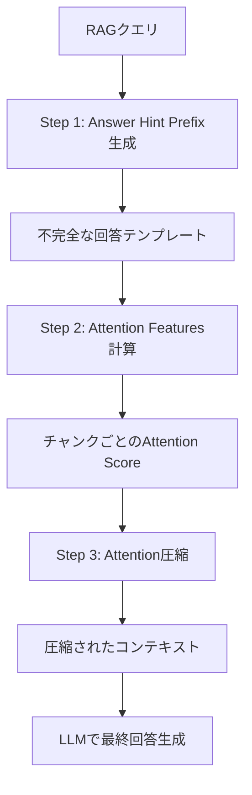

## 論文概要（Abstract）

本記事は arXiv 2503.10720「AttentionRAG: Attention-Guided Context Pruning in Retrieval-Augmented Generation」の解説記事である。AttentionRAGは、Retrieval-Augmented Generation（RAG）において検索されたコンテキストをLLM内部のattention機構を利用して圧縮する手法を提案している。著者らは、クエリをnext-token prediction形式に変換しattention scoreを算出することで、最大6.3倍のコンテキスト圧縮を再学習なしで達成したと報告している。

この記事は [Zenn記事: PruneRAGの動的チャンク枝刈りで設備保全ナレッジ検索を高速化する](https://zenn.dev/0h_n0/articles/91becffa48ec2e) の深掘りです。

## 情報源

- **arXiv ID**: 2503.10720
- **URL**: [https://arxiv.org/abs/2503.10720](https://arxiv.org/abs/2503.10720)
- **著者**: Yixiong Fang, Tianran Sun, Yuling Shi, Xiaodong Gu
- **発表年**: 2025年（v1: 2025年3月13日、v2: 2025年10月27日）
- **分野**: cs.CL, cs.AI
- **OpenReview**: [https://openreview.net/forum?id=sEcdaSzgF9](https://openreview.net/forum?id=sEcdaSzgF9)

## 背景と動機（Background & Motivation）

RAGはLLMの知識をリアルタイムに補完する手法として広く利用されているが、検索されたコンテキストが大量になるとLLMの入力トークン数が増大し、推論コスト・レイテンシ・精度の全てに悪影響を及ぼす。特に、検索結果にはクエリと無関係なチャンクが多く含まれる場合があり、いわゆる「lost in the middle」問題が知られている。

従来のコンテキスト圧縮手法としてLLMLingua系列が存在するが、これらは外部の小型モデル（GPT-2等）を用いてperplexityベースでトークンを取捨選択するため、追加の学習データやモデルが必要となる。著者らは、LLM自体が持つattention機構をそのまま活用すれば、追加学習なしにクエリ関連度の高いトークンを選別できるのではないかという着想からAttentionRAGを提案している。

## 主要な貢献（Key Contributions）

- **Attention Focus Mechanism**: RAGクエリをnext-token prediction形式に変換する「answer hint prefix」を導入し、LLM内部のattention weightを直接利用してコンテキストの関連度を算出する手法を提案
- **再学習不要の圧縮パイプライン**: 追加の学習データや専用モデルを必要とせず、既存のLLMのforward passのみで圧縮を完結させる3ステップパイプラインを設計
- **精度維持と大幅な圧縮の両立**: LongBenchおよびBABILongベンチマークにおいて、最大6.3倍のコンテキスト圧縮を達成しつつ、TriviaQAでは未圧縮時を上回る精度（EM 0.89 vs 0.87）を報告（論文Table 1, 2より）

## 技術的詳細（Technical Details）

### Attention Focus Mechanism

AttentionRAGの中核は、RAGクエリを通常の質問応答形式からnext-token prediction形式へ変換する点にある。例えば、クエリ「Where is Daniel?」を「Daniel is in the ____」という不完全な回答テンプレート（answer hint prefix）に変換する。この変換により、空白トークン（`____`）に対するattention weightがクエリの意味的焦点を反映し、コンテキスト中の各トークンとの関連度を精密に計算できる。

### Attention Score計算

各コンテキストチャンク $c_j$ に対するattention scoreは、全レイヤーにわたるattention weightの総和として定義される。

$$
A_j = \sum_{l=0}^{L} \text{Attention}_l(c_j, a_j)
$$

ここで、
- $L$: Transformerの総レイヤー数
- $a_j$: answer hint prefix後の最初の生成トークン（semantic focusが集中する位置）
- $\text{Attention}_l(c_j, a_j)$: レイヤー $l$ における $c_j$ から $a_j$ へのattention weight

全レイヤーの合算を用いることで、特定レイヤーに偏ったタスク固有バイアスを緩和し、安定したスコアリングを実現している。

### 3ステップ圧縮パイプライン



**Step 1: Answer Hint Prefix生成**

LLMがクエリから不完全な回答テンプレートを生成する。これはクエリの意味的焦点を明示化し、後段のattention計算を誘導する役割を持つ。

**Step 2: Attention Features計算**

コンテキストをサイズ $m$ のチャンクに分割し、各チャンクについてanswer hint prefix付きでforward passを実行する。生成トークン $a_j$ に対する各トークンのattention weightを全レイヤーにわたって合算し、チャンクごとのattention scoreを算出する。

**Step 3: Attention圧縮**

上位 $k$ トークンを選択し、それらのトークンを含む文全体を保持する。これにより、トークン単位の切断による文脈破壊を防ぐ。

$$
c'_j = \text{Concat}(\{s \mid t_r \in \text{Top-}k(A_j) \text{ and } t_r \in s\})
$$

ここで、
- $c'_j$: 圧縮後のコンテキスト
- $s$: 文単位のセグメント
- $t_r$: attention scoreの上位 $k$ に含まれるトークン
- $\text{Top-}k(A_j)$: attention score上位 $k$ トークンの集合

### 実装コード例

```python
import torch
from transformers import AutoModelForCausalLM, AutoTokenizer
from dataclasses import dataclass


@dataclass
class AttentionRAGConfig:
    """AttentionRAGの設定パラメータ。

    Attributes:
        chunk_size: コンテキスト分割時のチャンクサイズ（トークン数）
        top_k: 保持する上位トークン数
        model_name: 使用するLLMのモデル名
    """
    chunk_size: int = 300
    top_k: int = 12
    model_name: str = "meta-llama/Llama-3.1-8B-Instruct"


def compute_attention_scores(
    model: AutoModelForCausalLM,
    tokenizer: AutoTokenizer,
    context_chunks: list[str],
    hint_prefix: str,
) -> list[torch.Tensor]:
    """各チャンクに対するattention scoreを計算する。

    Args:
        model: HuggingFace CausalLMモデル
        tokenizer: 対応するトークナイザー
        context_chunks: コンテキストのチャンクリスト
        hint_prefix: answer hint prefix（例: "Daniel is in the"）

    Returns:
        各チャンクのトークンごとattention scoreのリスト
    """
    scores: list[torch.Tensor] = []
    for chunk in context_chunks:
        input_text = f"{chunk} {hint_prefix}"
        inputs = tokenizer(input_text, return_tensors="pt").to(model.device)
        with torch.no_grad():
            outputs = model(**inputs, output_attentions=True)

        # 全レイヤーのattentionを合算（論文式: A_j = Σ Attention_l）
        # attentions: tuple of (batch, heads, seq_len, seq_len)
        all_layer_attn = torch.stack(outputs.attentions, dim=0)  # (L, B, H, S, S)
        # 最後のトークン（生成トークン位置）への注意を取得
        last_token_attn = all_layer_attn[:, :, :, -1, :]  # (L, B, H, S)
        # レイヤーとヘッドにわたって合算
        aggregated = last_token_attn.sum(dim=(0, 2)).squeeze(0)  # (S,)

        chunk_token_len = len(tokenizer.encode(chunk))
        scores.append(aggregated[:chunk_token_len])

    return scores


def compress_context(
    context: str,
    scores: list[torch.Tensor],
    top_k: int,
    chunk_boundaries: list[tuple[int, int]],
) -> str:
    """attention scoreに基づきコンテキストを圧縮する。

    上位kトークンを含む文全体を保持する方式で、
    文脈の一貫性を維持しつつ不要な部分を除去する。

    Args:
        context: 元のコンテキスト文字列
        scores: チャンクごとのattention scoreテンソルリスト
        top_k: 保持する上位トークン数
        chunk_boundaries: 各チャンクの(開始, 終了)インデックス

    Returns:
        圧縮されたコンテキスト文字列
    """
    sentences = context.split("。")
    all_scores = torch.cat(scores, dim=0)
    top_indices = torch.topk(all_scores, k=min(top_k, len(all_scores))).indices

    # 上位トークンを含む文を特定して保持
    selected_sentences: set[int] = set()
    char_pos = 0
    for sent_idx, sent in enumerate(sentences):
        sent_start = char_pos
        sent_end = char_pos + len(sent)
        for idx in top_indices:
            if sent_start <= idx.item() < sent_end:
                selected_sentences.add(sent_idx)
                break
        char_pos = sent_end + 1  # "。"の分

    compressed = "。".join(
        sent for i, sent in enumerate(sentences) if i in selected_sentences
    )
    return compressed
```

## 実装のポイント（Implementation）

### chunk sizeの選択

著者らが報告しているハイパーパラメータ（論文Table 3より）から、chunk sizeはデータセットの特性に応じて調整が必要である。

| データセット | Chunk Size ($m$) | Top-$k$ |
|---|---|---|
| HotpotQA | 300 | 12 |
| TriviaQA | 150 | 8 |
| BABILong 1K | 50 | 8 |
| BABILong 4K | 200 | 12 |

短いコンテキスト（1K tokens前後）では小さなchunk size（50）が有効であり、長いコンテキストではchunk sizeを大きくすることで計算効率を維持している。

### answer hint prefixの設計

answer hint prefixの品質が圧縮精度に直結する。著者らは、LLMにクエリから不完全な回答文を生成させる方式を採用している。プロンプトの設計次第では、焦点がぼやけてattention scoreの分散が大きくなり、圧縮精度が低下する可能性がある。実運用では、ドメイン固有のテンプレートを用意しておくことが推奨される。

### バッチ処理対応

AttentionRAGはチャンク単位でforward passを実行するため、複数チャンクをバッチ処理することでスループットを向上できる。著者らは8Bモデルで70Bモデルと同等の性能を達成したと報告しており、小型モデルでの運用がコスト面で有利である。

## Production Deployment Guide

### AWS実装パターン（コスト最適化重視）

以下は2026年7月時点のAWS ap-northeast-1（東京）リージョン料金に基づく概算値である。実際のコストはトラフィックパターン、バースト使用量、リージョンにより変動するため、最新料金は[AWS料金計算ツール](https://calculator.aws.amazon.com/)で確認を推奨する。

| 構成 | トラフィック | 主要サービス | 月額概算 |
|---|---|---|---|
| **Small** | ~100 req/日 | Lambda + Bedrock + DynamoDB | $50-150 |
| **Medium** | ~1,000 req/日 | ECS Fargate + Bedrock + ElastiCache | $300-800 |
| **Large** | 10,000+ req/日 | EKS + Spot Instances + Bedrock Batch | $2,000-5,000 |

**Small構成（~100 req/日）**:
- Lambda（ARM64, 1024MB, 30秒タイムアウト）: ~$5/月
- Bedrock Claude Haiku（attention score計算 + 最終回答生成）: ~$30-100/月
- DynamoDB On-Demand（チャンクキャッシュ）: ~$5/月
- S3（コンテキストストレージ）: ~$1/月
- CloudWatch Logs: ~$5/月

**Medium構成（~1,000 req/日）**:
- ECS Fargate（2 vCPU, 4GB RAM, 2タスク）: ~$120/月
- Bedrock Claude Sonnet: ~$150-500/月
- ElastiCache Redis（cache.t4g.micro）: ~$15/月
- ALB: ~$25/月

**Large構成（10,000+ req/日）**:
- EKS コントロールプレーン: ~$75/月
- EC2 Spot Instances（g5.xlarge x 2-4, vLLMセルフホスト）: ~$500-1,200/月
- Bedrock Batch API（非同期処理分）: ~$300-800/月
- Karpenter（Spot優先オートスケーリング）
- NAT Gateway: ~$45/月

**コスト削減テクニック**:
- Spot Instances活用: On-Demandと比較して最大90%削減（g5.xlargeの場合 $1.006/h → ~$0.30/h）
- Reserved Instances（1年コミット）: 最大72%削減
- Bedrock Batch API: 同期APIと比較して50%削減
- Prompt Caching有効化: answer hint prefix部分のキャッシュで30-90%削減

### Terraformインフラコード

**Small構成（Serverless）**:

```hcl
# AttentionRAG Small構成 - Lambda + Bedrock + DynamoDB
terraform {
  required_version = ">= 1.9"
  required_providers {
    aws = {
      source  = "hashicorp/aws"
      version = "~> 5.60"
    }
  }
}

provider "aws" {
  region = "ap-northeast-1"
}

# --- IAMロール（最小権限） ---
resource "aws_iam_role" "attention_rag_lambda" {
  name = "attention-rag-lambda-role"
  assume_role_policy = jsonencode({
    Version = "2012-10-17"
    Statement = [{
      Action    = "sts:AssumeRole"
      Effect    = "Allow"
      Principal = { Service = "lambda.amazonaws.com" }
    }]
  })
}

resource "aws_iam_role_policy" "lambda_bedrock" {
  name = "bedrock-invoke"
  role = aws_iam_role.attention_rag_lambda.id
  policy = jsonencode({
    Version = "2012-10-17"
    Statement = [
      {
        Effect   = "Allow"
        Action   = ["bedrock:InvokeModel"]
        Resource = "arn:aws:bedrock:ap-northeast-1::foundation-model/anthropic.claude-3-5-haiku-*"
      },
      {
        Effect   = "Allow"
        Action   = ["dynamodb:GetItem", "dynamodb:PutItem", "dynamodb:Query"]
        Resource = aws_dynamodb_table.chunk_cache.arn
      },
      {
        Effect   = "Allow"
        Action   = ["logs:CreateLogGroup", "logs:CreateLogStream", "logs:PutLogEvents"]
        Resource = "arn:aws:logs:ap-northeast-1:*:*"
      }
    ]
  })
}

# --- DynamoDB（チャンクキャッシュ、On-Demand） ---
resource "aws_dynamodb_table" "chunk_cache" {
  name         = "attention-rag-chunk-cache"
  billing_mode = "PAY_PER_REQUEST"  # コスト最適化: On-Demandで低トラフィック対応
  hash_key     = "query_hash"
  range_key    = "chunk_id"

  attribute {
    name = "query_hash"
    type = "S"
  }
  attribute {
    name = "chunk_id"
    type = "S"
  }

  ttl {
    attribute_name = "expires_at"
    enabled        = true
  }

  server_side_encryption {
    enabled = true  # KMS暗号化
  }
}

# --- Lambda関数 ---
resource "aws_lambda_function" "attention_rag" {
  function_name = "attention-rag-processor"
  role          = aws_iam_role.attention_rag_lambda.arn
  handler       = "handler.lambda_handler"
  runtime       = "python3.12"
  architectures = ["arm64"]  # コスト最適化: ARM64で20%安価
  memory_size   = 1024
  timeout       = 30

  environment {
    variables = {
      CHUNK_CACHE_TABLE = aws_dynamodb_table.chunk_cache.name
      BEDROCK_MODEL_ID  = "anthropic.claude-3-5-haiku-20250620-v1:0"
      TOP_K             = "12"
      CHUNK_SIZE        = "300"
    }
  }

  tracing_config {
    mode = "Active"  # X-Rayトレーシング有効化
  }

  filename = "lambda_package.zip"
}

# --- CloudWatchアラーム（コスト監視） ---
resource "aws_cloudwatch_metric_alarm" "lambda_duration" {
  alarm_name          = "attention-rag-high-duration"
  comparison_operator = "GreaterThanThreshold"
  evaluation_periods  = 3
  metric_name         = "Duration"
  namespace           = "AWS/Lambda"
  period              = 300
  statistic           = "Average"
  threshold           = 25000  # 25秒（タイムアウト30秒の83%）
  alarm_actions       = []     # SNSトピックARNを設定

  dimensions = {
    FunctionName = aws_lambda_function.attention_rag.function_name
  }
}
```

**Large構成（Container）**:

```hcl
# AttentionRAG Large構成 - EKS + Karpenter + Spot Instances
module "eks" {
  source  = "terraform-aws-modules/eks/aws"
  version = "~> 20.24"

  cluster_name    = "attention-rag-cluster"
  cluster_version = "1.31"

  vpc_id     = module.vpc.vpc_id
  subnet_ids = module.vpc.private_subnets

  cluster_endpoint_public_access = false  # セキュリティ: プライベートのみ

  eks_managed_node_groups = {
    system = {
      instance_types = ["m7g.medium"]  # ARM64でコスト削減
      min_size       = 1
      max_size       = 2
      desired_size   = 1
    }
  }
}

# --- Karpenter Provisioner（Spot優先） ---
resource "kubectl_manifest" "karpenter_nodepool" {
  yaml_body = yamlencode({
    apiVersion = "karpenter.sh/v1"
    kind       = "NodePool"
    metadata   = { name = "attention-rag-gpu" }
    spec = {
      template = {
        spec = {
          requirements = [
            { key = "karpenter.sh/capacity-type", operator = "In", values = ["spot", "on-demand"] },
            { key = "node.kubernetes.io/instance-type", operator = "In", values = ["g5.xlarge", "g5.2xlarge"] },
          ]
          nodeClassRef = { name = "default" }
        }
      }
      limits   = { cpu = "64", memory = "256Gi" }
      disruption = {
        consolidationPolicy = "WhenEmptyOrUnderutilized"
        consolidateAfter    = "30s"
      }
    }
  })
}

# --- Secrets Manager（Bedrock設定） ---
resource "aws_secretsmanager_secret" "bedrock_config" {
  name        = "attention-rag/bedrock-config"
  description = "AttentionRAG Bedrock configuration"
}

resource "aws_secretsmanager_secret_version" "bedrock_config" {
  secret_id     = aws_secretsmanager_secret.bedrock_config.id
  secret_string = jsonencode({
    model_id   = "anthropic.claude-3-5-sonnet-20250620-v2:0"
    top_k      = 12
    chunk_size = 300
    region     = "ap-northeast-1"
  })
}

# --- AWS Budgets（予算アラート） ---
resource "aws_budgets_budget" "monthly" {
  name         = "attention-rag-monthly"
  budget_type  = "COST"
  limit_amount = "5000"
  limit_unit   = "USD"
  time_unit    = "MONTHLY"

  notification {
    comparison_operator       = "GREATER_THAN"
    threshold                 = 80
    threshold_type            = "PERCENTAGE"
    notification_type         = "ACTUAL"
    subscriber_email_addresses = ["ops-team@example.com"]
  }
}
```

### 運用・監視設定

**CloudWatch Logs Insights クエリ**:

```
# コスト異常検知: 1時間あたりのBedrockトークン使用量
fields @timestamp, @message
| filter @message like /bedrock_tokens/
| stats sum(input_tokens) as total_input, sum(output_tokens) as total_output by bin(1h)
| filter total_input > 100000
| sort @timestamp desc

# レイテンシ分析: P95/P99
fields @timestamp, duration_ms
| filter event = "attention_rag_request"
| stats percentile(duration_ms, 95) as p95,
        percentile(duration_ms, 99) as p99,
        avg(duration_ms) as avg_ms
  by bin(5m)
```

**CloudWatch アラーム設定（Python）**:

```python
import boto3


def create_bedrock_token_alarm(sns_topic_arn: str) -> dict:
    """Bedrockトークン使用量スパイク検知アラームを作成する。

    Args:
        sns_topic_arn: 通知先のSNSトピックARN

    Returns:
        CloudWatch APIレスポンス
    """
    client = boto3.client("cloudwatch", region_name="ap-northeast-1")
    return client.put_metric_alarm(
        AlarmName="attention-rag-bedrock-token-spike",
        MetricName="InputTokenCount",
        Namespace="AWS/Bedrock",
        Statistic="Sum",
        Period=3600,
        EvaluationPeriods=2,
        Threshold=500000,
        ComparisonOperator="GreaterThanThreshold",
        AlarmActions=[sns_topic_arn],
        Dimensions=[
            {"Name": "ModelId", "Value": "anthropic.claude-3-5-haiku-20250620-v1:0"},
        ],
    )
```

**X-Ray トレーシング設定（Python）**:

```python
from aws_xray_sdk.core import xray_recorder, patch_all


def configure_xray_tracing() -> None:
    """X-Rayトレーシングを設定し、boto3を自動計装する。"""
    xray_recorder.configure(
        sampling=True,
        context_missing="LOG_ERROR",
        daemon_address="127.0.0.1:2000",
    )
    patch_all()  # boto3, requests等を自動計装


def trace_attention_rag_request(
    query: str, context_length: int, compressed_length: int
) -> None:
    """AttentionRAGリクエストのトレースにアノテーションとメタデータを記録する。

    Args:
        query: ユーザークエリ
        context_length: 圧縮前のコンテキスト長（トークン数）
        compressed_length: 圧縮後のコンテキスト長（トークン数）
    """
    segment = xray_recorder.current_segment()
    segment.put_annotation("compression_ratio", context_length / max(compressed_length, 1))
    segment.put_metadata("request", {
        "query_length": len(query),
        "context_tokens": context_length,
        "compressed_tokens": compressed_length,
        "reduction_pct": round((1 - compressed_length / max(context_length, 1)) * 100, 1),
    })
```

**Cost Explorer自動レポート（Python）**:

```python
import boto3
from datetime import datetime, timedelta


def get_daily_cost_report() -> dict:
    """日次コストレポートを取得し、閾値超過時にSNS通知を送信する。

    Returns:
        Bedrock/Lambda/EKSの日次コスト内訳
    """
    ce = boto3.client("ce", region_name="us-east-1")
    today = datetime.utcnow().strftime("%Y-%m-%d")
    yesterday = (datetime.utcnow() - timedelta(days=1)).strftime("%Y-%m-%d")

    response = ce.get_cost_and_usage(
        TimePeriod={"Start": yesterday, "End": today},
        Granularity="DAILY",
        Metrics=["UnblendedCost"],
        GroupBy=[{"Type": "DIMENSION", "Key": "SERVICE"}],
    )

    costs: dict[str, float] = {}
    for group in response["ResultsByTime"][0]["Groups"]:
        service = group["Keys"][0]
        amount = float(group["Metrics"]["UnblendedCost"]["Amount"])
        if any(s in service for s in ["Bedrock", "Lambda", "EKS", "EC2"]):
            costs[service] = amount

    total = sum(costs.values())
    if total > 100:  # $100/日超過でアラート
        sns = boto3.client("sns", region_name="ap-northeast-1")
        sns.publish(
            TopicArn="arn:aws:sns:ap-northeast-1:123456789012:cost-alert",
            Subject=f"AttentionRAG Cost Alert: ${total:.2f}/day",
            Message=f"Daily cost exceeded $100: {costs}",
        )

    return costs
```

### コスト最適化チェックリスト

**アーキテクチャ選択**:
- [ ] トラフィック~100 req/日 → Serverless（Lambda + Bedrock）
- [ ] トラフィック~1,000 req/日 → Hybrid（ECS + Bedrock）
- [ ] トラフィック10,000+ req/日 → Container（EKS + Spot + vLLM）

**リソース最適化**:
- [ ] EC2: Spot Instances優先（g5.xlarge: On-Demand比 最大70%削減）
- [ ] Reserved Instances: 安定ワークロード分を1年コミット
- [ ] Savings Plans: Compute Savings Plansで全体コスト削減
- [ ] Lambda: ARM64アーキテクチャで20%削減
- [ ] Lambda: メモリサイズをPower Tuningで最適化
- [ ] ECS/EKS: Karpenterでアイドル時にスケールダウン

**LLMコスト削減**:
- [ ] Bedrock Batch API: 非リアルタイム処理に使用して50%削減
- [ ] Prompt Caching: answer hint prefix部分をキャッシュ（30-90%削減）
- [ ] モデル選択ロジック: 単純クエリはHaiku、複雑クエリはSonnetに振り分け
- [ ] トークン数制限: AttentionRAG圧縮で入力トークンを削減（直接的なコスト削減）
- [ ] レスポンスキャッシュ: DynamoDB/ElastiCacheで同一クエリの再計算を回避

**監視・アラート**:
- [ ] AWS Budgets: 月額予算アラート設定（80%, 100%閾値）
- [ ] CloudWatch アラーム: Bedrockトークン使用量、Lambda実行時間
- [ ] Cost Anomaly Detection: 自動異常検知の有効化
- [ ] 日次コストレポート: Cost Explorer APIで自動取得、SNS通知

**リソース管理**:
- [ ] 未使用リソース削除: Trusted Advisorで定期チェック
- [ ] タグ戦略: `project:attention-rag`, `env:prod/dev` で全リソースにタグ付け
- [ ] ライフサイクルポリシー: S3/CloudWatch Logsの保持期間設定（30-90日）
- [ ] 開発環境夜間停止: EventBridgeスケジュールで自動停止/起動
- [ ] ECRイメージクリーンアップ: ライフサイクルポリシーで古いイメージを自動削除

## 実験結果（Results）

### LongBenchベンチマーク

著者らはLlama-3.1-8B-InstructをベースモデルとしてLongBenchベンチマークで評価を行っている（論文Table 1より）。

| データセット | 手法 | Exact Match (EM) | 圧縮率 (CR) |
|---|---|---|---|
| 2WikiMQA | Original（未圧縮） | 0.49 | 1.0x |
| 2WikiMQA | AttentionRAG | 0.42 | 15x |
| HotpotQA | Original（未圧縮） | 0.50 | 1.0x |
| HotpotQA | AttentionRAG | 0.48 | 5.6x |
| TriviaQA | Original（未圧縮） | 0.87 | 1.0x |
| TriviaQA | AttentionRAG | 0.89 | 1.7x |

TriviaQAでは圧縮後のEM（0.89）が未圧縮時（0.87）を上回っている点が注目に値する。著者らはこれについて、不要なコンテキストの除去によりLLMの注意が正解チャンクに集中しやすくなったためと考察している。一方、2WikiMQAでは15倍圧縮と引き換えにEMが0.49から0.42に低下しており、マルチホップ推論タスクでは過度な圧縮がチェーン推論に必要な情報を失わせるリスクがある。

### BABILong推論結果

長いコンテキストでの推論タスクにおける結果は以下の通りである（論文Table 2より）。

| コンテキスト長 | Original EM | AttentionRAG EM | 圧縮率 (CR) |
|---|---|---|---|
| 1K | 0.74 | 0.74 | 3.8x |
| 4K | 0.80 | 0.66 | 5.6x |

1Kトークンのコンテキストでは精度を完全に維持しつつ3.8倍の圧縮を達成しているが、4Kトークンでは14ポイントの精度低下が見られる。長いコンテキストでは、attention scoreの分散が大きくなり上位 $k$ トークンの選択精度が低下する可能性がある。

### LLMLingua2との比較

著者らはLLMLingua2との比較において、主要メトリクスで約10%の改善を報告している。AttentionRAGの優位性として、再学習が不要であること、LLMの内在的なattention能力を直接活用する点が挙げられている。8Bモデルで70Bモデルと同等の性能を達成したとの報告もあり、小型モデルでの費用対効果の高い運用が可能である。

## 実運用への応用（Practical Applications）

Zenn記事で取り上げているPruneRAGと同様に、AttentionRAGは設備保全ナレッジ検索のような長文コンテキストを扱うRAGシステムに適用可能である。特に以下のシナリオで効果が期待される。

- **保全マニュアル検索**: 数百ページに及ぶ設備マニュアルから関連箇所を抽出する際、AttentionRAGによるコンテキスト圧縮でLLMへの入力を削減し、レスポンス時間とAPIコストを同時に改善できる
- **障害対応ナレッジベース**: 過去の障害報告書群から関連事例を検索する場合、attention scoreベースの枝刈りにより、類似障害の核心部分のみをLLMに提示可能
- **多言語対応**: answer hint prefixの言語を切り替えるだけで多言語コンテキストに対応可能であり、グローバル展開する製造業のナレッジ検索に適している

PruneRAGがチャンク単位の動的枝刈りに焦点を当てているのに対し、AttentionRAGはLLM内部のattention weightを直接活用する点で相補的なアプローチと位置づけられる。

## 関連研究（Related Work）

- **PruneRAG**: 動的チャンク枝刈り手法。検索結果のチャンク品質スコアに基づき不要チャンクを除去する。AttentionRAGとはチャンク選択の基準が異なり、PruneRAGは検索スコアベース、AttentionRAGはLLM内部のattention weightベースである
- **LLMLingua2**: GPT-2等の小型モデルを用いたperplexityベースのコンテキスト圧縮手法。追加のモデル学習が必要だが、LLMに依存しない汎用的な圧縮が可能。AttentionRAGは再学習不要である点で運用上の利点がある
- **Provence**: プロンプトレベルのコンテキスト圧縮を行う手法。文単位の重要度推定に基づく選択を行い、AttentionRAGのトークン→文の保持戦略と類似したアプローチを取るが、attention機構の直接利用ではなく外部評価モデルを使用する点が異なる

## まとめと今後の展望

AttentionRAGは、LLM内部のattention機構を直接活用することで、追加学習なしにRAGコンテキストを最大6.3倍圧縮する手法である。TriviaQAでは未圧縮時を上回る精度を達成したと報告されており、不要コンテキストの除去がLLMの推論精度を向上させる可能性が示されている。一方、マルチホップ推論タスクや長いコンテキストでは精度低下が見られ、チェーン推論に必要な情報の保持が今後の課題である。

実務面では、answer hint prefixのドメイン適応や、PruneRAG等のチャンク枝刈り手法との組み合わせによるハイブリッドアプローチの検討が期待される。小型モデル（8B）での高い費用対効果は、コスト制約の厳しいプロダクション環境への導入を後押しする要因となる。

## 参考文献

- **arXiv**: [https://arxiv.org/abs/2503.10720](https://arxiv.org/abs/2503.10720)
- **OpenReview**: [https://openreview.net/forum?id=sEcdaSzgF9](https://openreview.net/forum?id=sEcdaSzgF9)
- **Related Zenn article**: [https://zenn.dev/0h_n0/articles/91becffa48ec2e](https://zenn.dev/0h_n0/articles/91becffa48ec2e)
