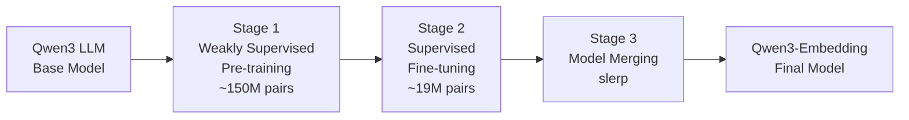

## 論文概要（Abstract）

本記事は [Qwen3 Embedding論文](https://arxiv.org/abs/2506.05176) の解説記事です。

Qwen3 Embeddingは、Alibabaが開発した0.6B/4B/8Bの3サイズで展開されるテキスト埋め込み・リランキングモデルシリーズである。著者らは、約150Mペアの弱教師あり事前学習と約19Mペアの教師ありファインチューニングを組み合わせたマルチステージ訓練パイプラインを採用し、さらにspherical linear interpolation（slerp）によるモデルマージで汎化性能を向上させたと報告している。8BモデルはMTEB Multilingualベンチマークで70.58を達成し、Gemini Embedding（68.37）を上回りオープンソースモデルとして当時のトップスコアを記録した（論文Table 2より）。

この記事は [Zenn記事: Embeddingモデル精度評価の実践：MTEB指標の読み方と最新モデル比較](https://zenn.dev/0h_n0/articles/b70b9c19e0a825) の深掘りです。

## 情報源

- **arXiv ID**: 2506.05176
- **URL**: [arXiv:2506.05176](https://arxiv.org/abs/2506.05176)
- **著者**: Yanzhao Zhang, Mingxin Li, Dingkun Long, et al.（12名、Alibaba Group）
- **発表年**: 2025年6月
- **分野**: Computation and Language (cs.CL), Information Retrieval (cs.IR)
- **ライセンス**: Apache 2.0

## 背景と動機（Background & Motivation）

テキスト埋め込みモデルは、検索（retrieval）、分類（classification）、クラスタリング、意味的テキスト類似度（STS）など多くのNLPタスクの基盤となっている。従来のBERT系小規模モデル（110M-330Mパラメータ）は英語中心で、多言語・コード検索などのドメインでは性能に限界があった。

近年、大規模言語モデル（LLM）のデコーダアーキテクチャを埋め込みモデルの基盤に転用する手法が注目されている。NV-Embed-v2（7B）やGTE-Qwen2などの先行研究がこの方向性を示したが、多言語対応・コード対応・モデルサイズの柔軟性の面で課題が残っていた。

著者らは、Qwen3 LLMの多言語基盤モデルを活用することで、100言語以上に対応し、テキスト埋め込みとリランキングの両タスクを単一のモデルファミリーで扱えるアーキテクチャを構築したと述べている。特に、合成データ生成にQwen3-32Bを利用し、大規模かつ多様な訓練データを確保した点が従来手法との差異である。

## 主要な貢献（Key Contributions）

- **マルチステージ訓練パイプライン**: 弱教師あり事前学習（約150Mペア）と教師ありファインチューニング（約7M labeled + 約12M synthetic）を2段階で実施し、汎用的な表現学習と特化型の性能向上を両立
- **モデルマージによる汎化**: slerp補間で複数チェックポイントをマージし、0.6Bモデルで62.56から64.33への性能向上を実現（論文Table 5より）
- **合成データ生成パイプライン**: Qwen3-32Bを使用したペルソナベースの多様なクエリ生成と、コサイン類似度フィルタリング（閾値0.7）による品質保証
- **偽陰性軽減contrastive loss**: 高類似度ペアをネガティブとしてカウントしないマスク機構で訓練の安定性を向上
- **3サイズ展開（0.6B/4B/8B）**: 計算コストと性能のトレードオフに応じた選択を可能に

## 技術的詳細（Technical Details）

### マルチステージ訓練パイプライン



**Stage 1: 弱教師あり事前学習**では、Qwen3-32Bを用いて約150Mの合成ペアを生成する。タスクタイプは4種類（Retrieval、Bitext Mining、Classification、STS）であり、Persona Hubからのキャラクタ設定を注入して多様性を確保している。この段階ではInfoNCEベースのcontrastive lossで訓練する。

**Stage 2: 教師ありファインチューニング**では、約7Mの人手ラベル付きペア（MS MARCO、Natural Questions、HotpotQA、NLI、DuReader、T2-Ranking、SimCLUE、MIRACL、MLDR、Mr.TyDi、Multi-CPR、CodeSearchNet）と、約12Mの高品質合成ペアを使用する。合成ペアはコサイン類似度が0.7を超えるもののみフィルタリングして採用している。

### Contrastive Loss with False-Negative Mitigation

埋め込みモデルの訓練に使用する損失関数は、InfoNCEをベースに偽陰性軽減メカニズムを組み込んだものである。

$$
\mathcal{L} = -\log \frac{\exp(s(q_i, d_i^+) / \tau)}{\exp(s(q_i, d_i^+) / \tau) + \sum_{j \neq i} m_{ij} \cdot \exp(s(q_i, d_j) / \tau)}
$$

ここで、
- $q_i$: $i$番目のクエリ
- $d_i^+$: $q_i$に対応するポジティブ文書
- $d_j$: バッチ内の他のクエリに対応する文書（インバッチネガティブ）
- $s(\cdot, \cdot)$: コサイン類似度関数
- $\tau$: 温度パラメータ
- $m_{ij}$: 偽陰性マスク係数

偽陰性マスク $m_{ij}$ は以下の条件で0となる：

$$
m_{ij} = \begin{cases} 0 & \text{if } s(q_i, d_j) > s(q_i, d_i^+) + 0.1 \text{ or } d_j = d_i^+ \\ 1 & \text{otherwise} \end{cases}
$$

この機構により、クエリ $q_i$ に対してポジティブ文書 $d_i^+$ よりも高い類似度を持つ文書 $d_j$ が存在する場合（つまりラベルの付いていない真のポジティブである可能性が高い場合）、それをネガティブサンプルから除外する。マージン0.1は、ポジティブとの境界付近にある曖昧なサンプルも除外するためのバッファである。

### Spherical Linear Interpolation（slerp）によるモデルマージ

複数のファインチューニングチェックポイントを統合するために、spherical linear interpolation（slerp）を使用する。

$$
\text{slerp}(\theta_A, \theta_B; t) = \frac{\sin((1 - t) \cdot \Omega)}{\sin \Omega} \theta_A + \frac{\sin(t \cdot \Omega)}{\sin \Omega} \theta_B
$$

ここで、
- $\theta_A, \theta_B$: 2つのチェックポイントのパラメータベクトル
- $t \in [0, 1]$: 補間係数
- $\Omega = \arccos\left(\frac{\theta_A \cdot \theta_B}{\|\theta_A\| \|\theta_B\|}\right)$: パラメータベクトル間の角度

slerpは線形補間（lerp）と異なり、パラメータ空間の球面上を移動するため、モデルのノルムが保存される。これにより、異なる学習率やデータサブセットで訓練されたチェックポイントを、性能劣化を抑えつつ統合できる。

### リランキングモデル

リランキングモデルは、クエリ-文書ペアの関連性を二値分類として定式化する。スコア計算は以下の通りである：

$$
\text{score}(q, d) = \frac{e^{P(\text{yes} \mid I, q, d)}}{e^{P(\text{yes} \mid I, q, d)} + e^{P(\text{no} \mid I, q, d)}}
$$

ここで、$I$はタスク指示文、$P(\text{yes} \mid I, q, d)$ と $P(\text{no} \mid I, q, d)$ はそれぞれ「関連あり」「関連なし」の対数確率である。損失関数は以下の通りである：

$$
\mathcal{L}_{\text{reranking}} = -\log P(l \mid P(q, d))
$$

ここで $l$ は正解ラベル（"yes" or "no"）である。

### アーキテクチャ詳細

| コンポーネント | 0.6B | 4B | 8B |
|---------------|------|-----|-----|
| レイヤー数 | 28 | 36 | 36 |
| 最大系列長 | 32K | 32K | 32K |
| 埋め込み次元 | 1024 | 2560 | 4096 |
| MRL対応 | Yes | Yes | Yes |

埋め込みベクトルは、最終レイヤーの[EOS]トークンに対応する隠れ状態から取得される。Matryoshka Representation Learning（MRL）に対応しており、32から最大次元までの任意の埋め込み次元を選択できる。

## 実装のポイント（Implementation）

### フレームワーク選択

Qwen3-Embeddingは複数の推論フレームワークに対応している。

**sentence-transformers（推奨）**:

```python
from sentence_transformers import SentenceTransformer


def encode_with_qwen3(
    texts: list[str],
    model_name: str = "Qwen/Qwen3-Embedding-8B",
    prompt_name: str = "query",
) -> list[list[float]]:
    """Qwen3-Embeddingでテキストをエンコードする

    Args:
        texts: エンコード対象のテキストリスト
        model_name: 使用するモデル名
        prompt_name: プロンプト種別（"query" or "document"）

    Returns:
        埋め込みベクトルのリスト
    """
    model = SentenceTransformer(model_name)
    embeddings = model.encode(texts, prompt_name=prompt_name)
    return embeddings.tolist()
```

**vLLM（高スループット推論）**:

```python
from vllm import LLM


def embed_with_vllm(
    texts: list[str],
    model_name: str = "Qwen/Qwen3-Embedding-8B",
) -> list[list[float]]:
    """vLLMを使用した高スループット埋め込み生成

    Args:
        texts: エンコード対象のテキストリスト
        model_name: 使用するモデル名（vLLM v0.8.5+が必要）

    Returns:
        埋め込みベクトルのリスト
    """
    model = LLM(model=model_name, task="embed")
    outputs = model.embed(texts)
    return [output.outputs.embedding for output in outputs]
```

### モデルサイズ選択指針

| 要件 | 推奨モデル | 理由 |
|------|-----------|------|
| 低レイテンシ・低コスト | 0.6B | MTEB Multi 64.33でも十分な用途が多い |
| バランス重視 | 4B | 8Bの93%の性能で約半分のVRAM |
| 最高精度 | 8B | MTEB Multi 70.58、VRAM約16GB |
| エッジデバイス | 0.6B（MRL 256次元） | 次元削減でメモリ・通信量を削減 |

8Bモデルは約16GBのVRAMを必要とし、NVIDIA A10G（24GB）やL4（24GB）で動作する。4Bモデルは約8GBで動作するため、T4（16GB）でも余裕を持って推論可能である。

## Production Deployment Guide

### AWS実装パターン（コスト最適化重視）

Qwen3-EmbeddingはApache 2.0ライセンスのオープンソースモデルであるため、GPU推論によるセルフホストが可能である。以下にトラフィック量別の推奨構成を示す。

| 規模 | 月間リクエスト | 推奨構成 | 月額コスト | 主要サービス |
|------|--------------|---------|-----------|------------|
| **Small** | ~3,000 (100/日) | SageMaker Serverless | $80-200 | SageMaker Serverless + S3 |
| **Medium** | ~30,000 (1,000/日) | ECS + GPU | $400-900 | ECS Fargate + g5.xlarge + ALB |
| **Large** | 300,000+ (10,000+/日) | EKS + Spot GPU | $2,000-5,000 | EKS + Karpenter + g5.xlarge Spot |

**Small構成の詳細**（月額$80-200、0.6Bモデル使用）:

- **SageMaker Serverless Inference**: 0.6Bモデルを使用、コールドスタート約30秒、ウォームアップ後はP95レイテンシ約200ms ($40-100/月)
- **S3**: モデルアーティファクト保存 ($5/月)
- **CloudWatch**: 基本監視 ($5/月)
- **API Gateway**: REST API ($5/月)

**Medium構成の詳細**（月額$400-900、4Bモデル使用）:

- **ECS Fargate**: GPU対応タスク定義、g5.xlarge（24GB VRAM）で4Bモデルを推論 ($350/月、スポット活用時)
- **Application Load Balancer**: ヘルスチェック付きロードバランシング ($20/月)
- **ElastiCache Redis**: cache.t3.micro、埋め込みキャッシュ ($15/月)
- **CloudWatch**: 詳細監視 ($10/月)

**Large構成の詳細**（月額$2,000-5,000、8Bモデル + vLLM使用）:

- **EKS**: コントロールプレーン ($72/月)
- **EC2 Spot Instances**: g5.xlarge x 2-4台、vLLMでバッチ推論（平均$800-1,600/月、Spot利用で最大70%削減）
- **Karpenter**: Spot優先の自動スケーリング（追加コストなし）
- **S3**: モデルアーティファクト + ログ ($20/月)
- **CloudWatch + Container Insights**: 詳細GPU監視 ($100/月)

**コスト削減テクニック**:

- Spot Instances使用で最大70%削減（g5.xlarge Spotは東京リージョンで約$0.40/h vs On-Demand $1.006/h）
- Reserved Instances購入で最大72%削減（1年コミット、予測可能な負荷向け）
- MRL次元削減（4096 -> 1024）でメモリ使用量と通信コストを約75%削減
- バッチ処理によるGPU稼働率最適化（vLLMのdynamic batching活用）
- 埋め込みキャッシュ（Redis/DynamoDB）で重複計算を回避

**コスト試算の注意事項**:

- 上記は記事生成時点（2026年7月）のAWS ap-northeast-1（東京）リージョン料金に基づく概算値です
- 実際のコストはトラフィックパターン、リージョン、バースト使用量により変動します
- 最新料金は [AWS料金計算ツール](https://calculator.aws/) で確認してください

**セルフホスト vs API比較**:

| 項目 | セルフホスト (8B, vLLM) | OpenAI text-embedding-3-large | Gemini Embedding |
|------|----------------------|-------------------------------|------------------|
| 月額コスト (10K req/日) | $2,000-5,000 | ~$1,500 (トークン量依存) | ~$500 (無料枠あり) |
| MTEB Multilingual | 70.58 | 58.93 | 68.37 |
| レイテンシ (P95) | 50-100ms | 100-300ms | 100-200ms |
| データプライバシー | 完全制御 | 外部送信 | 外部送信 |
| カスタマイズ | 可能（ファインチューニング） | 不可 | 不可 |

### Terraformインフラコード

**Small構成 (SageMaker Serverless): 0.6Bモデル**

```hcl
# --- IAMロール（最小権限） ---
resource "aws_iam_role" "sagemaker_execution" {
  name = "qwen3-embedding-sagemaker-role"

  assume_role_policy = jsonencode({
    Version = "2012-10-17"
    Statement = [{
      Action = "sts:AssumeRole"
      Effect = "Allow"
      Principal = {
        Service = "sagemaker.amazonaws.com"
      }
    }]
  })
}

resource "aws_iam_role_policy" "sagemaker_s3_access" {
  role = aws_iam_role.sagemaker_execution.id

  policy = jsonencode({
    Version = "2012-10-17"
    Statement = [
      {
        Effect = "Allow"
        Action = [
          "s3:GetObject",
          "s3:ListBucket"
        ]
        Resource = [
          aws_s3_bucket.model_artifacts.arn,
          "${aws_s3_bucket.model_artifacts.arn}/*"
        ]
      },
      {
        Effect = "Allow"
        Action = [
          "logs:CreateLogGroup",
          "logs:CreateLogStream",
          "logs:PutLogEvents"
        ]
        Resource = "arn:aws:logs:ap-northeast-1:*:*"
      },
      {
        Effect = "Allow"
        Action = [
          "ecr:GetDownloadUrlForLayer",
          "ecr:BatchGetImage",
          "ecr:GetAuthorizationToken"
        ]
        Resource = "*"
      }
    ]
  })
}

# --- S3 モデルアーティファクト ---
resource "aws_s3_bucket" "model_artifacts" {
  bucket = "qwen3-embedding-model-artifacts"

  tags = {
    Project     = "qwen3-embedding"
    Environment = "prod"
  }
}

resource "aws_s3_bucket_server_side_encryption_configuration" "model_artifacts" {
  bucket = aws_s3_bucket.model_artifacts.id

  rule {
    apply_server_side_encryption_by_default {
      sse_algorithm = "aws:kms"
    }
  }
}

# --- SageMaker Serverless Endpoint ---
resource "aws_sagemaker_model" "qwen3_06b" {
  name               = "qwen3-embedding-06b"
  execution_role_arn = aws_iam_role.sagemaker_execution.arn

  primary_container {
    image          = "763104351884.dkr.ecr.ap-northeast-1.amazonaws.com/huggingface-pytorch-inference:2.3.0-transformers4.46.3-gpu-py311-cu124-ubuntu22.04"
    model_data_url = "s3://${aws_s3_bucket.model_artifacts.id}/qwen3-embedding-06b/model.tar.gz"

    environment = {
      HF_MODEL_ID           = "Qwen/Qwen3-Embedding-0.6B"
      HF_TASK                = "feature-extraction"
      SAGEMAKER_CONTAINER_LOG_LEVEL = "20"
    }
  }
}

resource "aws_sagemaker_endpoint_configuration" "qwen3_serverless" {
  name = "qwen3-embedding-serverless-config"

  production_variants {
    variant_name           = "default"
    model_name             = aws_sagemaker_model.qwen3_06b.name

    serverless_config {
      max_concurrency   = 5
      memory_size_in_mb = 6144  # 0.6Bモデルに十分
    }
  }
}

resource "aws_sagemaker_endpoint" "qwen3" {
  name                 = "qwen3-embedding-endpoint"
  endpoint_config_name = aws_sagemaker_endpoint_configuration.qwen3_serverless.name
}

# --- CloudWatch アラーム ---
resource "aws_cloudwatch_metric_alarm" "endpoint_latency" {
  alarm_name          = "qwen3-embedding-latency-spike"
  comparison_operator = "GreaterThanThreshold"
  evaluation_periods  = 2
  metric_name         = "ModelLatency"
  namespace           = "AWS/SageMaker"
  period              = 300
  statistic           = "p95"
  threshold           = 5000000  # 5秒（マイクロ秒単位）
  alarm_description   = "SageMaker推論レイテンシ異常（P95 > 5秒）"

  dimensions = {
    EndpointName = aws_sagemaker_endpoint.qwen3.name
    VariantName  = "default"
  }
}
```

**Large構成 (EKS + Karpenter + Spot GPU): 8Bモデル + vLLM**

```hcl
# --- VPC基盤 ---
module "vpc" {
  source  = "terraform-aws-modules/vpc/aws"
  version = "~> 5.0"

  name = "qwen3-embedding-vpc"
  cidr = "10.0.0.0/16"
  azs  = ["ap-northeast-1a", "ap-northeast-1c"]

  private_subnets = ["10.0.1.0/24", "10.0.2.0/24"]
  public_subnets  = ["10.0.101.0/24", "10.0.102.0/24"]

  enable_nat_gateway   = true
  single_nat_gateway   = true  # コスト削減: 単一NAT Gateway
  enable_dns_hostnames = true
}

# --- EKSクラスタ ---
module "eks" {
  source  = "terraform-aws-modules/eks/aws"
  version = "~> 20.0"

  cluster_name    = "qwen3-embedding-cluster"
  cluster_version = "1.31"

  vpc_id     = module.vpc.vpc_id
  subnet_ids = module.vpc.private_subnets

  cluster_endpoint_public_access = true  # 本番では false + VPN推奨

  enable_cluster_creator_admin_permissions = true

  # NVIDIA Device Pluginを有効化
  cluster_addons = {
    coredns = { most_recent = true }
    kube-proxy = { most_recent = true }
    vpc-cni = { most_recent = true }
  }
}

# --- Karpenter (Spot GPU自動スケーリング) ---
resource "kubectl_manifest" "karpenter_node_pool" {
  yaml_body = <<-YAML
    apiVersion: karpenter.sh/v1
    kind: NodePool
    metadata:
      name: gpu-spot-pool
    spec:
      template:
        spec:
          requirements:
            - key: karpenter.sh/capacity-type
              operator: In
              values: ["spot"]
            - key: node.kubernetes.io/instance-type
              operator: In
              values: ["g5.xlarge", "g5.2xlarge"]
            - key: kubernetes.io/arch
              operator: In
              values: ["amd64"]
          nodeClassRef:
            group: karpenter.k8s.aws
            kind: EC2NodeClass
            name: gpu-nodes
      limits:
        cpu: "32"
        memory: "128Gi"
        nvidia.com/gpu: "8"
      disruption:
        consolidationPolicy: WhenEmptyOrUnderutilized
        consolidateAfter: 60s
  YAML
}

# --- vLLM Deployment ---
resource "kubectl_manifest" "vllm_deployment" {
  yaml_body = <<-YAML
    apiVersion: apps/v1
    kind: Deployment
    metadata:
      name: qwen3-embedding-vllm
      labels:
        app: qwen3-embedding
    spec:
      replicas: 2
      selector:
        matchLabels:
          app: qwen3-embedding
      template:
        metadata:
          labels:
            app: qwen3-embedding
        spec:
          containers:
            - name: vllm
              image: vllm/vllm-openai:latest
              args:
                - "--model"
                - "Qwen/Qwen3-Embedding-8B"
                - "--task"
                - "embed"
                - "--max-model-len"
                - "8192"
                - "--gpu-memory-utilization"
                - "0.90"
              ports:
                - containerPort: 8000
              resources:
                requests:
                  nvidia.com/gpu: "1"
                  memory: "20Gi"
                limits:
                  nvidia.com/gpu: "1"
                  memory: "24Gi"
              readinessProbe:
                httpGet:
                  path: /health
                  port: 8000
                initialDelaySeconds: 120
                periodSeconds: 10
          tolerations:
            - key: nvidia.com/gpu
              operator: Exists
              effect: NoSchedule
  YAML
}

# --- AWS Budgets ---
resource "aws_budgets_budget" "embedding_monthly" {
  name         = "qwen3-embedding-monthly"
  budget_type  = "COST"
  limit_amount = "5000"
  limit_unit   = "USD"
  time_unit    = "MONTHLY"

  cost_filter {
    name   = "TagKeyValue"
    values = ["user:Project$qwen3-embedding"]
  }

  notification {
    comparison_operator       = "GREATER_THAN"
    threshold                 = 80
    threshold_type            = "PERCENTAGE"
    notification_type         = "ACTUAL"
    subscriber_email_addresses = ["ops@example.com"]
  }
}
```

### セキュリティベストプラクティス

**本番環境での推奨設定**:

1. **ネットワークセキュリティ**:
   - EKS: `cluster_endpoint_public_access = false` を設定（VPN/Direct Connect経由アクセス）
   - セキュリティグループ: ポート8000（vLLM API）のみ内部公開
   - VPCエンドポイント: S3、CloudWatch、ECRへのプライベート接続

2. **認証・認可**:
   - IAMロール: 最小権限の原則（SageMaker/EKS用）
   - Kubernetes RBAC + IRSA（IAM Roles for Service Accounts）
   - API Gateway: API Keyまたは Cognito認証

3. **データ保護**:
   - 転送中: TLS 1.2以上必須
   - 保管中: S3/EBS全てKMS暗号化
   - モデルアーティファクト: 暗号化済みS3バケット

### 運用・監視設定

**CloudWatch Logs Insights クエリ**:

```sql
-- GPU使用率監視: vLLMコンテナのGPU使用率推移
fields @timestamp, gpu_utilization, gpu_memory_used
| stats avg(gpu_utilization) as avg_gpu,
        max(gpu_memory_used) as max_vram by bin(5m)
| filter avg_gpu < 30  -- 低使用率検知（スケールダウン候補）

-- 推論レイテンシ分析: P95, P99
fields @timestamp, latency_ms
| stats pct(latency_ms, 95) as p95,
        pct(latency_ms, 99) as p99,
        avg(latency_ms) as avg_latency by bin(5m)
| filter p95 > 200  -- SLO違反検知
```

**CloudWatch アラーム設定（Python）**:

```python
import boto3


def setup_embedding_alarms(
    endpoint_name: str,
    sns_topic_arn: str,
) -> list[str]:
    """Qwen3-Embedding推論エンドポイントの監視アラームを設定する

    Args:
        endpoint_name: SageMakerエンドポイント名またはEKSサービス名
        sns_topic_arn: 通知先SNSトピックARN

    Returns:
        作成されたアラーム名のリスト
    """
    cloudwatch = boto3.client("cloudwatch")
    alarm_names: list[str] = []

    # GPU使用率アラーム（低使用率 = コスト浪費）
    cloudwatch.put_metric_alarm(
        AlarmName=f"{endpoint_name}-gpu-underutilized",
        ComparisonOperator="LessThanThreshold",
        EvaluationPeriods=6,  # 30分間継続
        MetricName="GPUUtilization",
        Namespace="Custom/Embedding",
        Period=300,
        Statistic="Average",
        Threshold=20.0,
        ActionsEnabled=True,
        AlarmActions=[sns_topic_arn],
        AlarmDescription="GPU使用率20%未満が30分継続（スケールダウン検討）",
    )
    alarm_names.append(f"{endpoint_name}-gpu-underutilized")

    # 推論レイテンシアラーム
    cloudwatch.put_metric_alarm(
        AlarmName=f"{endpoint_name}-latency-spike",
        ComparisonOperator="GreaterThanThreshold",
        EvaluationPeriods=2,
        MetricName="InferenceLatency",
        Namespace="Custom/Embedding",
        Period=300,
        Statistic="p95",
        Threshold=500.0,  # P95 > 500ms
        ActionsEnabled=True,
        AlarmActions=[sns_topic_arn],
        AlarmDescription="推論レイテンシP95が500msを超過",
    )
    alarm_names.append(f"{endpoint_name}-latency-spike")

    return alarm_names
```

**vLLMメトリクス収集（Prometheus形式）**:

```python
import requests


def collect_vllm_metrics(
    vllm_host: str = "localhost",
    vllm_port: int = 8000,
) -> dict[str, float]:
    """vLLMサーバーからPrometheusメトリクスを収集する

    Args:
        vllm_host: vLLMサーバーホスト
        vllm_port: vLLMサーバーポート

    Returns:
        主要メトリクスの辞書
    """
    response = requests.get(
        f"http://{vllm_host}:{vllm_port}/metrics",
        timeout=10,
    )
    response.raise_for_status()

    metrics: dict[str, float] = {}
    for line in response.text.split("\n"):
        if line.startswith("#"):
            continue
        if "vllm:num_requests_running" in line:
            metrics["running_requests"] = float(line.split()[-1])
        if "vllm:gpu_cache_usage_perc" in line:
            metrics["gpu_cache_usage"] = float(line.split()[-1])
        if "vllm:avg_prompt_throughput_toks_per_s" in line:
            metrics["throughput_toks_per_s"] = float(line.split()[-1])

    return metrics
```

**Cost Explorer自動レポート**:

```python
import boto3
from datetime import datetime, timedelta


def get_daily_embedding_cost() -> dict[str, float]:
    """Qwen3-Embedding関連の日次コストを取得する

    Returns:
        サービス別コストの辞書
    """
    ce = boto3.client("ce")

    response = ce.get_cost_and_usage(
        TimePeriod={
            "Start": (datetime.now() - timedelta(days=1)).strftime("%Y-%m-%d"),
            "End": datetime.now().strftime("%Y-%m-%d"),
        },
        Granularity="DAILY",
        Metrics=["UnblendedCost"],
        Filter={
            "Tags": {
                "Key": "Project",
                "Values": ["qwen3-embedding"],
            }
        },
        GroupBy=[{"Type": "SERVICE", "Key": "SERVICE"}],
    )

    costs: dict[str, float] = {}
    for result in response["ResultsByTime"]:
        for group in result["Groups"]:
            service = group["Keys"][0]
            cost = float(group["Metrics"]["UnblendedCost"]["Amount"])
            if cost > 0:
                costs[service] = cost

    return costs
```

### コスト最適化チェックリスト

**アーキテクチャ選択（トラフィック量で判断）**:
- [ ] ~100 req/日 → SageMaker Serverless + 0.6Bモデル ($80-200/月)
- [ ] ~1,000 req/日 → ECS + g5.xlarge + 4Bモデル ($400-900/月)
- [ ] 10,000+ req/日 → EKS + Spot GPU + 8B + vLLM ($2,000-5,000/月)

**リソース最適化**:
- [ ] EC2: Spot Instances優先（g5.xlarge Spotで最大70%削減）
- [ ] Reserved Instances: 1年コミットで72%削減（予測可能な負荷向け）
- [ ] Savings Plans: Compute Savings Plans検討（インスタンスファミリー変更に柔軟）
- [ ] MRL次元削減: 4096 -> 1024で通信・ストレージコスト75%削減
- [ ] EKS: Karpenter `consolidateAfter: 60s` でアイドルノード自動削除

**推論コスト削減**:
- [ ] vLLM dynamic batching: バッチサイズ最適化でGPU稼働率向上
- [ ] 埋め込みキャッシュ: Redis/DynamoDBで重複クエリの再計算を回避
- [ ] モデル選択ロジック: 簡易クエリは0.6B、複雑クエリは8Bで処理分岐
- [ ] max-model-len制限: 不要に長いコンテキストを制限（32K -> 8Kで十分な場合が多い）
- [ ] INT8量子化: AWQ/GPTQでVRAM使用量を約50%削減（精度低下は要検証）

**監視・アラート（コスト異常の即時検知）**:
- [ ] AWS Budgets: 月額予算設定（80%で警告、100%でアラート）
- [ ] CloudWatch アラーム: GPU低使用率検知（スケールダウントリガー）
- [ ] Cost Anomaly Detection: 自動異常検知
- [ ] 日次コストレポート: SNS/Slackへ自動送信

**リソース管理**:
- [ ] 未使用エンドポイント削除: SageMakerエンドポイントの棚卸し
- [ ] タグ戦略: Project/Environment/Teamタグでコスト可視化
- [ ] モデルアーティファクト: S3ライフサイクルで古いバージョンを自動削除
- [ ] 開発環境: 夜間・週末のGPUインスタンス自動停止

## 実験結果（Results）

### MTEB Multilingual ベンチマーク

著者らが報告しているMTEB Multilingualベンチマークの主要結果を以下に示す（論文Table 2より）。

| モデル | パラメータ数 | MTEB Multi (Mean) | MTEB Eng v2 | MTEB Code |
|-------|------------|-------------------|-------------|-----------|
| **Qwen3-Embedding-8B** | 8B | **70.58** | **75.22** | **80.68** |
| **Qwen3-Embedding-4B** | 4B | 69.45 | 74.60 | 80.06 |
| **Qwen3-Embedding-0.6B** | 0.6B | 64.33 | 70.70 | 75.41 |
| Gemini Embedding | 非公開 | 68.37 | 73.30 | 74.66 |
| OpenAI text-embedding-3-large | 非公開 | 58.93 | — | — |
| NV-Embed-v2 | 7B | 56.29 | — | — |
| BGE-M3 | 0.6B | 59.56 | — | — |

8Bモデルは、MTEB Multilingualで70.58を達成し、Gemini Embedding（68.37）を2.21ポイント上回っている。0.6Bモデルでも64.33を達成し、同パラメータ帯のBGE-M3（59.56）を4.77ポイント上回っている。

### タスクカテゴリ別スコア（Qwen3-Embedding-8B）

| タスクカテゴリ | スコア |
|--------------|--------|
| Bitext Mining | 80.89 |
| Instruction Retrieval | 86.40 |
| STS (Semantic Textual Similarity) | 81.08 |
| Classification | 74.00 |
| Reranking | 65.63 |
| Clustering | 57.65 |

Instruction Retrieval（86.40）とBitext Mining（80.89）で特に高い性能を示しており、指示に従った検索タスクと多言語テキストマッチングに強いことがわかる。

### CMTEB（中国語）ベンチマーク

| モデル | CMTEB (Mean) |
|-------|-------------|
| Qwen3-Embedding-8B | 73.83 |
| Qwen3-Embedding-4B | 72.26 |
| Qwen3-Embedding-0.6B | 66.33 |

中国語ベンチマークでも8Bモデルが73.83を達成している（論文Table 2より）。

### Ablation Study（論文Table 5より）

| 条件 | MMTEB Mean |
|------|-----------|
| 合成データのみ（Stage 1のみ） | 58.49 |
| 合成データなし（labeled dataのみ） | 61.21 |
| モデルマージなし | 62.56 |
| **最終モデル（全手法適用）** | **64.33** |

この結果から、各要素の貢献度が明確になる：

1. **教師ありデータの重要性**: 合成データのみ（58.49）→ labeledデータ追加（61.21）で+2.72ポイント
2. **合成データの効果**: labeledデータのみ（61.21）→ 合成データ追加（62.56）で+1.35ポイント
3. **モデルマージの効果**: マージなし（62.56）→ マージあり（64.33）で+1.77ポイント

### リランキングモデルの性能

| タスク | Embedding-0.6B | Reranker-0.6B | Reranker-4B | Reranker-8B |
|------|----------------|---------------|-------------|-------------|
| MTEB-R | 61.82 | 65.80 | 69.76 | 69.02 |
| CMTEB-R | 71.02 | 71.31 | 75.94 | 77.45 |
| MMTEB-R | 64.64 | 66.36 | 72.74 | 72.94 |
| MTEB-Code | 75.41 | 73.42 | 81.20 | 81.22 |

リランカーはEmbeddingモデルと同じ基盤モデルを使用しているが、クエリ-文書ペアを直接入力としてcross-attention計算を行うため、一般にbi-encoderベースの埋め込みモデルよりも高精度になる。CMTEB-Rでは8Bリランカーが77.45で最高スコアを記録している。

## 実運用への応用（Practical Applications）

Zenn記事で紹介されたように、Qwen3-Embedding-8BはオープンソースモデルとしてvLLMやSGLangでセルフホスト可能であり、以下のユースケースに適している。

**RAG（Retrieval-Augmented Generation）パイプライン**: MTEB Retrievalカテゴリで高いスコアを示しており、ドキュメント検索の精度向上が期待できる。特にInstruction Retrieval（86.40）が高く、指示付きクエリの検索に強みがある。

**多言語検索システム**: 100言語以上に対応し、MTEB Multilingualで70.58を達成しているため、多言語コーパスを持つ企業の横断検索に適用可能である。日中英を含む多言語ドキュメントを単一のインデックスで管理できる。

**コード検索**: MTEB Codeで80.68を達成しており、CodeSearchNetなどのコードデータで訓練されているため、ソースコード検索やコードレビュー支援に活用できる。

**リランキングパイプライン**: 2段階の検索パイプライン（bi-encoder → reranker）を同一モデルファミリーで構築できる。埋め込みモデルで候補を高速に絞り込み、リランカーで精度を向上させるアプローチが有効である。

**スケーリング戦略**: 0.6B/4B/8Bの3サイズが提供されているため、プロトタイプ段階では0.6Bで検証し、本番では4Bまたは8Bに切り替えるといった段階的なスケーリングが可能である。MRL対応により、ストレージ制約に応じて埋め込み次元を柔軟に調整できる。

## 関連研究（Related Work）

- **GTE-Qwen2**（Alibaba, 2024）: Qwen3-Embeddingの前身モデル。Qwen2 LLMをベースとし、bi-directional attentionを使用。Qwen3-Embeddingはこの系譜を発展させ、多言語性能とコード対応を強化した
- **NV-Embed-v2**（NVIDIA, 2024）: 7Bパラメータの大規模埋め込みモデル。MTEB English v1でSOTAを達成したが、MTEB Multilingualでは56.29にとどまり、多言語性能ではQwen3-8B（70.58）に大きく劣る
- **BGE-M3**（BAAI, 2024）: 0.6Bパラメータで多言語対応の埋め込みモデル。Dense/Sparse/Multi-Vectorの3方式を統合した設計が特徴。MTEB Multilingualで59.56であり、同サイズのQwen3-0.6B（64.33）に4.77ポイント差をつけられた
- **E5-Mistral-7B-instruct**（Microsoft, 2024）: Mistral-7Bベースの指示チューニング埋め込みモデル。指示文付きの埋め込み生成を普及させた先行研究

## まとめと今後の展望

Qwen3 Embeddingは、LLMデコーダアーキテクチャを埋め込みモデルの基盤に転用する手法の有効性を示した研究である。マルチステージ訓練（弱教師あり事前学習 + 教師ありファインチューニング）、合成データ生成、slerpによるモデルマージの組み合わせにより、MTEB Multilingualで70.58のスコアを達成した。

実務上の意義として、Apache 2.0ライセンスで3サイズが公開されているため、データプライバシー要件やコスト制約に応じたセルフホストが可能である。vLLM対応により本番環境での高スループット推論も実現しやすい。

今後の研究方向として、著者らはモデルの更なるスケーリング、長文コンテキストへの最適化、およびマルチモーダル対応を示唆している。また、MRLによる次元削減の性能トレードオフについても、より詳細な分析が求められる。

## 参考文献

- **arXiv**: [https://arxiv.org/abs/2506.05176](https://arxiv.org/abs/2506.05176)
- **Hugging Face**: [https://huggingface.co/Qwen/Qwen3-Embedding-8B](https://huggingface.co/Qwen/Qwen3-Embedding-8B)
- **Related Zenn article**: [https://zenn.dev/0h_n0/articles/b70b9c19e0a825](https://zenn.dev/0h_n0/articles/b70b9c19e0a825)
