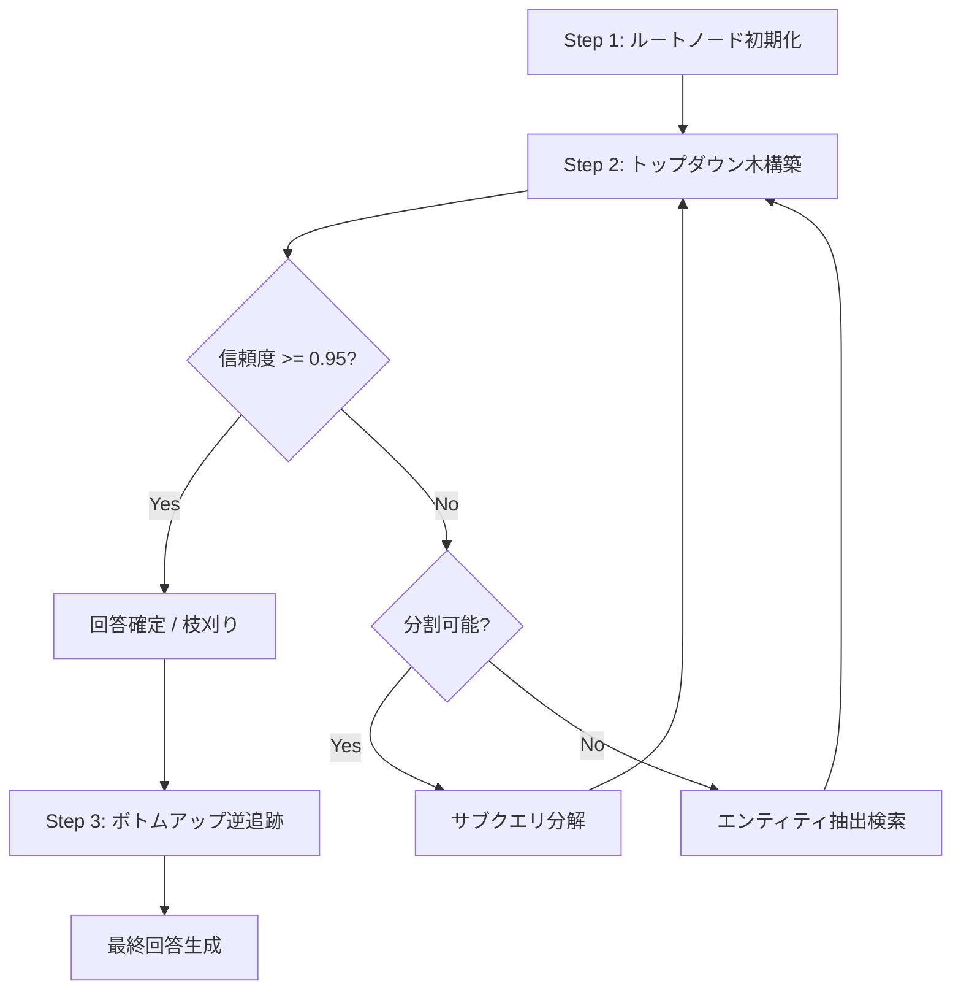

## 論文概要

本記事は、arXiv 2601.11024 として公開された論文 "PruneRAG: Confidence-Guided Query Decomposition Trees for Efficient Retrieval-Augmented Generation" の解説記事です。PruneRAGは、Retrieval-Augmented Generation（RAG）における2つの構造的課題――Evidence Forgetting（検索した証拠をLLMが活用できない現象）と非効率なクエリ拡張――を同時に解決するフレームワークである。著者らは信頼度ガイド付きクエリ分解木を提案し、不要な検索を枝刈りすることで、回答精度の向上と推論コストの削減を両立したと報告している。

この記事は [Zenn記事: PruneRAGの動的チャンク枝刈りで設備保全ナレッジ検索を高速化する](https://zenn.dev/0h_n0/articles/91becffa48ec2e) の深掘りです。

## 情報源

- **arXiv ID**: 2601.11024
- **URL**: [https://arxiv.org/abs/2601.11024](https://arxiv.org/abs/2601.11024)
- **著者**: Shuguang Jiao, Xinyu Xiao, Yunfan Wei, et al.
- **発表年**: 2026
- **分野**: cs.IR（情報検索）
- **会議**: ACM Web Conference 2026 採択

## 背景と動機

RAGはLLMの知識不足を外部検索で補う手法として広く普及しているが、マルチホップ質問応答のような複雑なタスクでは2つの構造的失敗が顕在化する。たとえば「ある映画の監督が、別のどの映画にも出演した俳優は誰か?」のような質問は、映画→監督→出演作品→俳優という複数段階の推論を要し、単一の検索では回答できない。

第一の課題は **Evidence Forgetting** である。検索された文書に正解の根拠が含まれているにもかかわらず、LLMがその情報を活用できずに誤った回答を生成する現象を指す。これはLLMのコンテキストウィンドウに大量の検索文書が投入されることで、関連情報が無関係な文書の中に埋もれてしまうことが一因と考えられている。著者らの分析によれば、既存のRAGシステムではEvidence Forgetting Rate（EFR）が最大60%に達するケースが確認されている（論文Table 2より）。つまり、正解の手がかりが目の前にあるにもかかわらず、10問中6問で誤答するという深刻な事態が生じている。

第二の課題は **非効率なクエリ拡張** である。既存のクエリ分解手法（IRCoTやRAG-Starなど）は、元のクエリを一律にサブクエリへ分解するため、すでに回答可能な簡単なクエリに対しても不要な分解と検索が行われる。これにより検索コストとLLM推論コストの両方が増大し、レイテンシが悪化する。著者らは、RAG-StarやConTReGenなどの先行手法ではクエリ展開の制御が不十分であることを指摘しており、特にConTReGenでは平均検索回数が5回を超えるケースも報告されている。

PruneRAGはこれらの課題に対し、「回答に十分な信頼度が得られた時点で分解を打ち切る」という適応的な枝刈り戦略を導入することで、精度と効率のトレードオフを解消するアプローチを採っている。決定木のような階層構造にクエリを分解しつつ、各ノードでLLMの出力信頼度を計測し、十分な確信が得られた時点で木の展開を停止する。これにより、簡単な質問は浅い木で即座に回答し、困難な質問のみ深く掘り下げるという動的な振る舞いが実現される。

## 主要な貢献

- **Evidence Forgetting Rate（EFR）の定式化**: RAGシステムにおける証拠忘却現象を定量的に測定する新しい評価指標を提案。検索結果に正解根拠が含まれるにもかかわらず誤答する割合を捕捉する
- **信頼度ガイド付きクエリ分解木**: 回答の信頼度スコアに基づいてクエリ分解の深さを動的に制御するアルゴリズムを導入。不要な検索を枝刈りすることで、平均検索回数を2.0回に抑制
- **ファイングレイン・エンティティ検索**: クエリからキーエンティティを抽出して精密な検索を行う機構を提案。適応的ノード展開と組み合わせることで、HotpotQAにおいてF1スコア63.6を達成したと報告されている（論文Table 2より）

## 技術的詳細

### Evidence Forgetting Rate（EFR）

著者らは、RAGの証拠忘却を定量化するための指標EFRを以下のように定義している。

$$
\text{EFR} = \frac{1}{N} \sum_{i=1}^{N} \mathbb{1}\{G_i \subseteq d_i \wedge a_i \neq a_i^*\}
$$

ここで、
- $N$: 評価サンプル数
- $G_i$: $i$ 番目のサンプルにおける正解証拠セット（gold evidence set）
- $d_i$: 検索によって取得された文書集合
- $a_i$: モデルの予測回答
- $a_i^*$: 正解回答
- $\mathbb{1}\{\cdot\}$: 指示関数（条件が真のとき1、偽のとき0）

この指標は「検索文書に正解根拠が含まれているにもかかわらず誤答したサンプルの割合」を意味する。EFRが高いほど、LLMが検索結果を有効に活用できていないことを示す。従来のRAG評価ではEMやF1といった最終回答の正確性のみが測定されてきたが、EFRは「検索は成功したが回答生成で失敗した」というパイプライン上の障害点を明確に分離する点で新規性がある。著者らはこの指標をベースライン比較に一貫して使用しており、PruneRAGの各コンポーネントがどのように証拠忘却を軽減しているかを定量的に示している。

### 適応的ノード展開

PruneRAGの中核は、クエリの状態に応じて3種類のノード展開を選択する関数 $f_{\text{decompose}}$ である。

$$
f_{\text{decompose}}(q, d, p) = \begin{cases} (\text{"answer"}, A) & \text{if } \text{Ans}(q) \\ (\text{"query"}, q_1, q_2) & \text{if } \neg\text{Ans}(q) \wedge \text{Spl}(q) \\ (\text{"entity"}, e_1, e_2) & \text{if } \neg\text{Ans}(q) \wedge \neg\text{Spl}(q) \end{cases}
$$

ここで、
- $q$: 現在のクエリ
- $d$: 検索された文書集合
- $p$: プロンプトコンテキスト
- $\text{Ans}(q)$: クエリ $q$ に対して回答可能と判定される条件
- $\text{Spl}(q)$: クエリ $q$ がサブクエリに分割可能と判定される条件
- $A$: 生成された回答
- $q_1, q_2$: 分解されたサブクエリ
- $e_1, e_2$: 抽出されたキーエンティティ

回答可能であればノードを閉じ（枝刈り）、分割可能であればサブクエリノードを生成し、いずれでもなければエンティティ抽出による精密検索にフォールバックする。この3分岐の判定はLLMのプロンプトベースで行われる。具体的には、検索結果を含むコンテキストとクエリをLLMに与え、「この情報で回答可能か」「サブクエリに分解可能か」を順次判定する。著者らはこの判定にchain-of-thought形式のプロンプトを使用しており、判定理由も含めて出力させることで、木構造の解釈性を担保している。

### 信頼度ガイド付き判定

回答の「信頼度」は、LLMが出力する各トークンの対数確率（logprob）から算出される。

$$
\text{Confidence}(A) = \exp\left(\frac{1}{|A|} \sum_{i=1}^{|A|} \log P(a_i \mid a_{<i}, q, d)\right)
$$

ここで、
- $A$: 生成された回答トークン列
- $|A|$: 回答トークン数
- $a_i$: $i$ 番目のトークン
- $a_{<i}$: $i$ 番目より前のトークン列
- $P(a_i \mid a_{<i}, q, d)$: クエリ $q$ と文書 $d$ を条件とした $a_i$ の条件付き確率
- $q$: 入力クエリ
- $d$: 検索文書

この式は対数確率の算術平均の指数関数であり、幾何平均に対応する。幾何平均を採用する理由は、算術平均と比較して極端に低い確率のトークンの影響を適度に反映できるためである。たとえば、ほとんどのトークンが高確率で生成されていても、1つでも極端に低確率なトークンがあれば信頼度が大きく低下する。これにより、「自信のない単語を含む回答」を適切に検出できる。

閾値 $\tau_a = 0.95$ 以上であれば回答を確定し、未満であればクエリ分解にフォールバックする。この閾値は論文のハイパーパラメータ分析において最適値として報告されている。なお、vLLMやHugging Face Transformersなど主要な推論フレームワークはlogprobs出力をサポートしており、追加の計算コストはほぼゼロである。

### アルゴリズムの全体像

PruneRAGの処理フローは以下の3ステップで構成される。



**Step 1: ルートノード初期化** -- 元のクエリをルートノードとしてキューに追加し、初回検索を実行する。

**Step 2: トップダウン木構築** -- キューからノードを取り出し、LLMで回答を生成する。信頼度が閾値以上であればそのノードを葉ノードとして確定し、未満であれば $f_{\text{decompose}}$ に従い子ノードを生成してキューに追加する。最大分岐数（max_branch=2）と最大深さ（max_depth=3）で木の膨張を制約する。

**Step 3: ボトムアップ逆追跡** -- 葉ノードの回答をボトムアップに集約し、最終回答を生成する。各ノードで得られた部分回答をコンテキストとして親ノードの回答を再生成する。このボトムアップのパスでは、子ノードで得られた部分的な事実をコンテキストに追加して親ノードのクエリに再度回答させることで、段階的に情報を統合する。マルチホップ質問の場合、各ホップに対応する部分回答が逆追跡により自然に合成される仕組みとなっている。

以下に、PruneRAGのコアロジックを簡略化したPython実装を示す。

```python
from dataclasses import dataclass, field
from typing import Literal
from collections import deque
import math


@dataclass
class TreeNode:
    """クエリ分解木のノードを表現するデータクラス。

    Attributes:
        query: このノードが担当するクエリ文字列
        depth: 木における深さ（ルート=0）
        node_type: ノードの種別（query/entity/answer）
        answer: LLMが生成した回答（未生成時はNone）
        confidence: 回答の信頼度スコア（0.0-1.0）
        children: 子ノードのリスト
    """
    query: str
    depth: int = 0
    node_type: Literal["query", "entity", "answer"] = "query"
    answer: str | None = None
    confidence: float = 0.0
    children: list["TreeNode"] = field(default_factory=list)


def compute_confidence(logprobs: list[float]) -> float:
    """トークンの対数確率リストから信頼度スコアを算出する。

    幾何平均（対数確率の算術平均の指数）として計算する。
    論文の式: Confidence(A) = exp(1/|A| * Σ log P(a_i | a_{<i}, q, d))

    Args:
        logprobs: 各トークンの対数確率のリスト

    Returns:
        0.0-1.0 の信頼度スコア
    """
    if not logprobs:
        return 0.0
    avg_logprob = sum(logprobs) / len(logprobs)
    return math.exp(avg_logprob)


def build_decomposition_tree(
    query: str,
    retriever: "Retriever",
    llm: "LLMClient",
    max_branch: int = 2,
    max_depth: int = 3,
    confidence_threshold: float = 0.95,
) -> TreeNode:
    """信頼度ガイド付きクエリ分解木を構築する。

    BFS方式でノードを展開し、信頼度が閾値以上のノードは
    葉ノードとして確定（枝刈り）する。

    Args:
        query: 入力クエリ
        retriever: 文書検索を行うリトリーバ
        llm: 回答生成と分解判定を行うLLMクライアント
        max_branch: 各ノードの最大分岐数
        max_depth: 木の最大深さ
        confidence_threshold: 枝刈り判定の信頼度閾値（τ_a）

    Returns:
        構築されたクエリ分解木のルートノード
    """
    root = TreeNode(query=query, depth=0)
    queue: deque[TreeNode] = deque([root])

    while queue:
        node = queue.popleft()

        # 深さ制約チェック
        if node.depth >= max_depth:
            docs = retriever.search(node.query)
            answer, logprobs = llm.generate_with_logprobs(node.query, docs)
            node.answer = answer
            node.confidence = compute_confidence(logprobs)
            node.node_type = "answer"
            continue

        # Step 2: 回答生成と信頼度判定
        docs = retriever.search(node.query)
        answer, logprobs = llm.generate_with_logprobs(node.query, docs)
        confidence = compute_confidence(logprobs)

        if confidence >= confidence_threshold:
            # 枝刈り: 十分な信頼度で回答確定
            node.answer = answer
            node.confidence = confidence
            node.node_type = "answer"
            continue

        # 適応的ノード展開: f_decompose の判定
        decomposition = llm.decompose(node.query, docs)

        if decomposition.action == "query":
            # サブクエリ分解
            for sub_q in decomposition.sub_queries[:max_branch]:
                child = TreeNode(
                    query=sub_q,
                    depth=node.depth + 1,
                    node_type="query",
                )
                node.children.append(child)
                queue.append(child)

        elif decomposition.action == "entity":
            # エンティティ抽出による精密検索
            for entity in decomposition.entities[:max_branch]:
                child = TreeNode(
                    query=entity,
                    depth=node.depth + 1,
                    node_type="entity",
                )
                node.children.append(child)
                queue.append(child)

    return root
```

## 実装のポイント

### ハイパーパラメータの選択

論文で報告されている最適なハイパーパラメータは以下の通りである（論文Section 4.1より）。

- **max_branch = 2**: 各ノードの最大分岐数。3以上にすると検索回数が急増し、精度向上は限定的と報告されている
- **max_depth = 3**: 木の最大深さ。4以上では過度な分解によりコンテキストが断片化する
- **$\tau_a$ = 0.95**: 信頼度閾値。0.9では枝刈りが甘く不要な検索が増加し、0.99ではほぼ全ノードが展開されて効率が悪化する

### vLLMでのlogprobs取得

信頼度計算にはLLMの出力トークンごとのlogprobsが必要である。著者らはvLLMを使用しており、`SamplingParams` に `logprobs=1` を指定することでトークン単位の対数確率を取得している。論文の実験ではvLLMのバッチ推論機能を活用し、4×NVIDIA L40 PCIe 48GB上で並列処理を行っている。

### リトリーバの構成

著者らはBGE-large-en-v1.5をメインのリトリーバとして使用し、Wikipedia 2018 dumpをコーパスとしている。エンティティ検索ノードでは同じリトリーバを用いるが、クエリをエンティティ名に限定することで検索精度を向上させている。また、E5をリトリーバとした実験でも同様の傾向が確認されており、PruneRAGの有効性がリトリーバの選択に依存しないことが示されている。

### ボトムアップ逆追跡の実装上の注意

Step 3のボトムアップ逆追跡では、子ノードの部分回答を親ノードのコンテキストに追加してLLMに再度回答を生成させる。この際、子ノードの回答をそのまま連結するのではなく、「以下の情報が判明しています: [子ノード1の回答], [子ノード2の回答]」というフォーマットで構造化することで、LLMが情報を整理しやすくなる。また、逆追跡時にも信頼度を計算し、低信頼度の回答が上位に伝播しないようガードすることが実装上重要である。

## Production Deployment Guide

### AWS実装パターン（コスト最適化重視）

PruneRAGをAWS上にデプロイする場合、トラフィック量に応じて3つの構成を推奨する。以下はいずれも2026年7月時点のap-northeast-1（東京）リージョン料金に基づく概算値であり、実際のコストはトラフィックパターンやバースト使用量により変動する。最新料金はAWS料金計算ツールで確認を推奨する。

| 構成 | トラフィック | コンピュート | LLM推論 | ベクトルDB | 月額目安 |
|------|------------|------------|---------|----------|---------|
| Small | ~100 req/日 | Lambda | Bedrock (Claude Haiku) | DynamoDB | $50-150 |
| Medium | ~1,000 req/日 | ECS Fargate (2vCPU, 8GB) | Bedrock (Claude Sonnet) | OpenSearch Serverless | $300-800 |
| Large | 10,000+ req/日 | EKS + Spot (g5.xlarge) | vLLM on GPU Spot | OpenSearch (r6g.large x3) | $2,000-5,000 |

**Small構成の内訳**: Lambda (128MB, 平均3秒/req) $5/月、Bedrock Claude Haiku (入力$0.25/MTok, 出力$1.25/MTok) $15-40/月、DynamoDB On-Demand $5-10/月、S3 $1/月、CloudWatch $5/月。

**Large構成のコスト削減テクニック**:
- Spot Instances活用: g5.xlargeのSpot価格はOn-Demandの最大90%引き（$0.15/h vs $1.006/h）
- Reserved Instances: 1年コミットで最大72%削減
- Bedrock Batch API: 非同期処理可能なリクエストは50%削減
- Prompt Caching: システムプロンプトのキャッシュで30-90%のトークンコスト削減

### Terraformインフラコード

**Small構成（Serverless）: Lambda + Bedrock + DynamoDB**

```hcl
# PruneRAG Small構成 — Serverless
# 2026年7月時点 ap-northeast-1

terraform {
  required_version = ">= 1.9"
  required_providers {
    aws = { source = "hashicorp/aws", version = "~> 5.60" }
  }
}

provider "aws" {
  region = "ap-northeast-1"
}

# --- IAM: 最小権限 ---
resource "aws_iam_role" "prunerag_lambda" {
  name = "prunerag-lambda-role"
  assume_role_policy = jsonencode({
    Version = "2012-10-17"
    Statement = [{
      Action = "sts:AssumeRole"
      Effect = "Allow"
      Principal = { Service = "lambda.amazonaws.com" }
    }]
  })
}

resource "aws_iam_role_policy" "prunerag_lambda" {
  name = "prunerag-lambda-policy"
  role = aws_iam_role.prunerag_lambda.id
  policy = jsonencode({
    Version = "2012-10-17"
    Statement = [
      {
        Effect   = "Allow"
        Action   = ["bedrock:InvokeModel"]
        Resource = "arn:aws:bedrock:ap-northeast-1::foundation-model/anthropic.claude-3-5-haiku-*"
      },
      {
        Effect   = "Allow"
        Action   = ["dynamodb:GetItem", "dynamodb:PutItem", "dynamodb:Query"]
        Resource = aws_dynamodb_table.prunerag_docs.arn
      },
      {
        Effect   = "Allow"
        Action   = ["logs:CreateLogGroup", "logs:CreateLogStream", "logs:PutLogEvents"]
        Resource = "arn:aws:logs:ap-northeast-1:*:*"
      },
      {
        Effect   = "Allow"
        Action   = ["xray:PutTraceSegments", "xray:PutTelemetryRecords"]
        Resource = "*"
      }
    ]
  })
}

# --- DynamoDB: On-Demand + KMS暗号化 ---
resource "aws_dynamodb_table" "prunerag_docs" {
  name         = "prunerag-documents"
  billing_mode = "PAY_PER_REQUEST" # コスト最適: On-Demand
  hash_key     = "doc_id"

  attribute {
    name = "doc_id"
    type = "S"
  }

  server_side_encryption {
    enabled = true # KMS暗号化
  }

  point_in_time_recovery {
    enabled = true
  }
}

# --- Lambda ---
resource "aws_lambda_function" "prunerag" {
  function_name = "prunerag-inference"
  runtime       = "python3.12"
  handler       = "main.handler"
  role          = aws_iam_role.prunerag_lambda.arn
  timeout       = 60     # PruneRAGの木構築に十分な時間
  memory_size   = 512    # embedding計算用
  filename      = "lambda.zip"

  tracing_config {
    mode = "Active" # X-Ray有効化
  }

  environment {
    variables = {
      CONFIDENCE_THRESHOLD = "0.95"
      MAX_DEPTH            = "3"
      MAX_BRANCH           = "2"
      DYNAMODB_TABLE       = aws_dynamodb_table.prunerag_docs.name
    }
  }
}

# --- CloudWatch アラーム: コスト監視 ---
resource "aws_cloudwatch_metric_alarm" "lambda_duration" {
  alarm_name          = "prunerag-lambda-high-duration"
  comparison_operator = "GreaterThanThreshold"
  evaluation_periods  = 3
  metric_name         = "Duration"
  namespace           = "AWS/Lambda"
  period              = 300
  statistic           = "Average"
  threshold           = 30000 # 30秒超過でアラート
  alarm_actions       = [] # SNS ARNを設定

  dimensions = {
    FunctionName = aws_lambda_function.prunerag.function_name
  }
}
```

**Large構成（Container）: EKS + Karpenter + Spot Instances**

```hcl
# PruneRAG Large構成 — EKS + GPU Spot
# 2026年7月時点 ap-northeast-1

module "eks" {
  source  = "terraform-aws-modules/eks/aws"
  version = "~> 20.24"

  cluster_name    = "prunerag-cluster"
  cluster_version = "1.31"

  vpc_id     = module.vpc.vpc_id
  subnet_ids = module.vpc.private_subnets

  cluster_endpoint_public_access = false # セキュリティ: プライベートのみ

  eks_managed_node_groups = {
    system = {
      instance_types = ["m7i.large"]
      min_size       = 2
      max_size       = 3
      desired_size   = 2
    }
  }
}

# --- Karpenter: Spot優先GPU自動スケーリング ---
resource "kubectl_manifest" "karpenter_nodepool" {
  yaml_body = yamlencode({
    apiVersion = "karpenter.sh/v1"
    kind       = "NodePool"
    metadata   = { name = "prunerag-gpu" }
    spec = {
      template = {
        spec = {
          requirements = [
            { key = "karpenter.sh/capacity-type", operator = "In", values = ["spot", "on-demand"] },
            { key = "node.kubernetes.io/instance-type", operator = "In", values = ["g5.xlarge", "g5.2xlarge"] },
          ]
          nodeClassRef = { name = "default" }
        }
      }
      limits   = { cpu = "64", "nvidia.com/gpu" = "8" }
      disruption = {
        consolidationPolicy = "WhenEmptyOrUnderutilized"
        consolidateAfter    = "30s"
      }
    }
  })
}

# --- Secrets Manager: Bedrock/API設定 ---
resource "aws_secretsmanager_secret" "prunerag_config" {
  name                    = "prunerag/config"
  recovery_window_in_days = 7
}

# --- AWS Budgets: 予算アラート ---
resource "aws_budgets_budget" "prunerag_monthly" {
  name         = "prunerag-monthly"
  budget_type  = "COST"
  limit_amount = "5000"
  limit_unit   = "USD"
  time_unit    = "MONTHLY"

  notification {
    comparison_operator       = "GREATER_THAN"
    threshold                 = 80
    threshold_type            = "PERCENTAGE"
    notification_type         = "ACTUAL"
    subscriber_email_addresses = ["ops@example.com"]
  }
}
```

### 運用・監視設定

**CloudWatch Logs Insights クエリ**

```
# コスト異常検知: 1時間あたりのBedrock トークン使用量
fields @timestamp, @message
| filter @message like /token_usage/
| stats sum(input_tokens) as total_input, sum(output_tokens) as total_output by bin(1h) as hour
| filter total_input > 100000
| sort hour desc
```

```
# レイテンシ分析: P95, P99
fields @timestamp, duration_ms
| filter event = "prunerag_inference"
| stats percentile(duration_ms, 95) as p95, percentile(duration_ms, 99) as p99,
        avg(duration_ms) as avg_ms, count(*) as requests by bin(1h)
```

**CloudWatch アラーム設定（Python）**

```python
import boto3


def create_prunerag_alarms(function_name: str, sns_topic_arn: str) -> None:
    """PruneRAG用のCloudWatchアラームを作成する。

    Bedrockトークン使用量スパイクとLambda実行時間異常を検知する。

    Args:
        function_name: 監視対象のLambda関数名
        sns_topic_arn: 通知先のSNSトピックARN
    """
    cw = boto3.client("cloudwatch", region_name="ap-northeast-1")

    # Lambda実行時間異常検知
    cw.put_metric_alarm(
        AlarmName=f"{function_name}-high-duration",
        MetricName="Duration",
        Namespace="AWS/Lambda",
        Statistic="p99",
        Period=300,
        EvaluationPeriods=3,
        Threshold=45000,  # 45秒
        ComparisonOperator="GreaterThanThreshold",
        AlarmActions=[sns_topic_arn],
        Dimensions=[{"Name": "FunctionName", "Value": function_name}],
    )

    # Bedrockトークン使用量スパイク検知（カスタムメトリクス）
    cw.put_metric_alarm(
        AlarmName="prunerag-bedrock-token-spike",
        MetricName="BedrockInputTokens",
        Namespace="PruneRAG",
        Statistic="Sum",
        Period=3600,
        EvaluationPeriods=1,
        Threshold=500000,  # 1時間で50万トークン超過
        ComparisonOperator="GreaterThanThreshold",
        AlarmActions=[sns_topic_arn],
    )
```

**X-Ray トレーシング設定（Python）**

```python
from aws_xray_sdk.core import xray_recorder, patch_all


def setup_xray_tracing() -> None:
    """X-Rayトレーシングを初期化する。

    boto3の自動計装を有効化し、PruneRAG固有の
    アノテーション・メタデータを記録する。
    """
    xray_recorder.configure(service="prunerag-inference")
    patch_all()  # boto3, requests等を自動計装


def trace_prunerag_inference(
    query: str, tree_depth: int, retrieval_count: int, confidence: float
) -> None:
    """PruneRAG推論のトレーシング情報を記録する。

    Args:
        query: 入力クエリ
        tree_depth: 構築された木の深さ
        retrieval_count: 検索実行回数
        confidence: 最終回答の信頼度
    """
    segment = xray_recorder.current_segment()
    segment.put_annotation("tree_depth", tree_depth)
    segment.put_annotation("retrieval_count", retrieval_count)
    segment.put_metadata("query", query, "prunerag")
    segment.put_metadata("confidence", confidence, "prunerag")
```

**Cost Explorer自動レポート（Python）**

```python
import boto3
from datetime import datetime, timedelta


def get_daily_cost_report(sns_topic_arn: str, threshold_usd: float = 100.0) -> dict:
    """日次コストレポートを取得し、閾値超過時にSNS通知する。

    Bedrock、Lambda、EKSのコストを抽出し、
    $100/日超過でアラートを送信する。

    Args:
        sns_topic_arn: 通知先のSNSトピックARN
        threshold_usd: アラート閾値（USD/日）

    Returns:
        サービス別コストの辞書
    """
    ce = boto3.client("ce", region_name="us-east-1")
    sns = boto3.client("sns", region_name="ap-northeast-1")

    end = datetime.utcnow().strftime("%Y-%m-%d")
    start = (datetime.utcnow() - timedelta(days=1)).strftime("%Y-%m-%d")

    response = ce.get_cost_and_usage(
        TimePeriod={"Start": start, "End": end},
        Granularity="DAILY",
        Metrics=["UnblendedCost"],
        Filter={
            "Tags": {
                "Key": "Project",
                "Values": ["prunerag"],
            }
        },
        GroupBy=[{"Type": "DIMENSION", "Key": "SERVICE"}],
    )

    costs: dict[str, float] = {}
    total = 0.0
    for group in response["ResultsByTime"][0]["Groups"]:
        service = group["Keys"][0]
        amount = float(group["Metrics"]["UnblendedCost"]["Amount"])
        costs[service] = amount
        total += amount

    if total > threshold_usd:
        sns.publish(
            TopicArn=sns_topic_arn,
            Subject=f"PruneRAG Cost Alert: ${total:.2f}/day",
            Message=f"Daily cost exceeded ${threshold_usd}.\n\nBreakdown:\n"
            + "\n".join(f"  {svc}: ${amt:.2f}" for svc, amt in costs.items()),
        )

    return costs
```

### コスト最適化チェックリスト

**アーキテクチャ選択**
- [ ] トラフィック100 req/日以下 → Serverless（Lambda + Bedrock）
- [ ] トラフィック100-1,000 req/日 → Hybrid（ECS Fargate + Bedrock）
- [ ] トラフィック1,000+ req/日 → Container（EKS + vLLM on GPU）

**リソース最適化**
- [ ] EC2/EKS: Spot Instances優先（g5.xlarge Spot: ~$0.15/h、On-Demand比90%削減）
- [ ] Reserved Instances: 1年コミットでベースライン分を確保（最大72%削減）
- [ ] Savings Plans: Compute Savings Plansでリージョン・インスタンスファミリー柔軟性確保
- [ ] Lambda: メモリサイズを512MBに最適化（CPU比例割当の恩恵）
- [ ] ECS/EKS: Karpenter consolidation設定でアイドルノード自動縮退

**LLMコスト削減**
- [ ] Bedrock Batch API: 非同期処理可能なリクエストは50%削減
- [ ] Prompt Caching: PruneRAGのシステムプロンプトをキャッシュ（30-90%削減）
- [ ] モデル選択ロジック: 浅いノード（depth=0）はHaiku、深いノード（depth>=2）はSonnetに振り分け
- [ ] トークン数制限: max_tokens=256で回答長を制約（PruneRAGの回答は短文）

**監視・アラート**
- [ ] AWS Budgets: 月額上限$5,000でアラート（80%/100%の2段階）
- [ ] CloudWatch アラーム: Lambda実行時間P99、Bedrockトークンスパイク
- [ ] Cost Anomaly Detection: 日次異常検知を有効化
- [ ] 日次コストレポート: Cost Explorer APIで自動取得、SNS通知

**リソース管理**
- [ ] 未使用リソース削除: 月次でunattachedボリューム、未使用ENI、古いスナップショットを棚卸し
- [ ] タグ戦略: `Project=prunerag`, `Environment=prod/dev`, `CostCenter=ml-infra` を全リソースに付与
- [ ] ライフサイクルポリシー: S3の検索キャッシュは30日後にGlacierへ移行
- [ ] 開発環境夜間停止: EKSのdev NodePoolは22:00-08:00にスケールゼロ
- [ ] CloudWatch Logs保持: 本番は90日、開発は14日に設定

## 実験結果

### 主要ベンチマーク

論文Table 2より、Qwen3-8Bモデルでの主要結果を以下に示す。

| Dataset | PruneRAG F1 | Best Baseline F1 (手法名) | PruneRAG EFR | Baseline EFR (手法名) |
|---------|------------|--------------------------|-------------|---------------------|
| HotpotQA | 63.6 | 57.8 (RAG-Star) | 23.1% | 30.5% (ConTReGen) |
| 2WikiMultihopQA | 44.4 | 37.8 (RAG-Star) | 26.0% | 27.8% (ConTReGen) |
| MuSiQue | 25.6 | 19.8 (RAG-Star) | 38.4% | 60.0% (ConTReGen) |

著者らは、特にMuSiQueにおいてEFRを60.0%から38.4%へ21.6ポイント低減した点を強調している。MuSiQueは4ホップの推論を要求するデータセットであり、複数の文書を横断して情報を統合する必要がある。従来手法ではクエリを一律に分解するため、分解の過程で元のクエリの文脈が失われ、証拠忘却が深刻化していた。PruneRAGの信頼度ガイド付き枝刈りは、必要な深さでのみ分解を行うことでコンテキストの断片化を防ぎ、証拠の活用効率を向上させたと分析されている。

推論レイテンシについては、Llama-3.1-8Bモデルで474msを達成し、最も遅いベースライン（ConTReGen: 2,324ms）と比較して約4.9倍の高速化が報告されている（論文Table 3より）。この高速化は主にPruneRAGの平均検索回数が2.0回と少ないことに起因する。ConTReGenやIRCoTは反復的に検索を行うため検索回数が5回以上に達することがあり、各検索に伴うリトリーバ呼び出しとLLM推論のオーバーヘッドが累積する。PruneRAGは信頼度に基づく早期打ち切りにより、この累積コストを大幅に抑制している。

### アブレーション結果

論文Table 4より、Qwen3-8B / HotpotQAでの各コンポーネントの寄与を示す。

| 構成 | EM | EFR | 平均検索回数 |
|------|-----|------|------------|
| PruneRAG（全構成） | 56.6 | 23.1% | 2.0 |
| 信頼度ガイド除去 | 53.4 | 25.1% | 1.9 |
| 適応的展開除去 | 42.0 | 43.2% | 5.3 |
| エンティティ検索除去 | 53.4 | 24.4% | 1.7 |

適応的展開の除去が最も大きな影響を与えており、EMが14.6ポイント低下し、EFRが20.1ポイント悪化している。これはクエリ分解の適応性が失われることで、一律な分解が不要な検索（平均5.3回）を引き起こし、コンテキストの断片化を招くためと著者らは説明している。検索回数が2.0回から5.3回へ2.65倍に増加している点も注目に値する。不要な検索はレイテンシだけでなく、LLMのコンテキストウィンドウを無関係な文書で埋めることで証拠忘却を助長するという悪循環を引き起こす。

一方、信頼度ガイドの除去は比較的影響が小さく、EMの低下は3.2ポイントにとどまっている。これは信頼度閾値がなくても適応的展開のヒューリスティクスがある程度機能するためと解釈できる。ただし、EFRは2.0ポイント悪化しており、信頼度による精密な打ち切り判定が証拠活用の効率化に寄与していることが確認できる。

### 大規模モデルでの結果

論文Table 5より、HotpotQAにおける大規模モデルの結果を示す。

- **Llama-3.1-70B**: PruneRAG EM=58.2, F1=66.0, EFR=29.2%
- **Qwen3-32B**: PruneRAG EM=58.4, F1=66.0, EFR=24.6%

8Bモデルと比較してF1は2-3ポイント向上しているが、EFRはLlama-3.1-70Bで29.2%とQwen3-8Bの23.1%より高い値が報告されている。著者らは、大規模モデルではコンテキスト長の増加による注意散漫が証拠忘却を悪化させる可能性があると考察している。この結果は、単にモデルサイズを大きくすればRAGの性能が向上するという素朴な期待に反するものであり、RAGパイプラインの設計においてはモデルサイズとコンテキスト管理のバランスが重要であることを示唆している。

## 実運用への応用

PruneRAGの信頼度ガイド付き枝刈りメカニズムは、設備保全ナレッジ検索のような産業応用に適していると考えられる。設備保全の質問応答では「ポンプ型番Aの異常振動の原因は?」のようなマルチホップ推論（型番→仕様→故障パターン→原因）が頻繁に発生する。PruneRAGの適応的展開により、単純な質問（「型番Aの定格回転数は?」のような直接的な質問）は1回の検索で即座に回答し、複雑な質問（複数の機器間の因果関係を辿る質問）のみ段階的に分解することで、平均レイテンシを大幅に削減できる可能性がある。

また、信頼度閾値 $\tau_a$ をドメインに応じて調整することで、安全性が求められる保全領域では閾値を高く（例: 0.98）設定してより慎重な回答を生成し、一般的な問い合わせでは閾値を低く設定して応答速度を優先するといった運用が考えられる。さらに、EFRをモニタリング指標としてダッシュボードに組み込むことで、RAGシステムの証拠活用効率をリアルタイムに監視し、閾値の動的調整やリトリーバの再チューニングのタイミングを判断するといった運用改善サイクルの構築も可能である。

関連するZenn記事では動的チャンク枝刈りによる検索高速化について解説しているため、PruneRAGの論文レベルのアルゴリズム理解と併せて参照されたい。

## 関連研究

- **RAG-Star** (2024): グラフ構造を用いたマルチホップRAG。モンテカルロ木探索（MCTS）に着想を得た検索戦略を採用しており、PruneRAGの木構造アプローチと対比される。PruneRAGと比較してF1は5.8ポイント低い（論文Table 2より）が、グラフ探索による網羅性が木構造の効率性とどのようにトレードオフするかを示す重要な先行研究である
- **ConTReGen** (2024): コンテキスト追跡型の反復検索生成フレームワーク。生成の各ステップで動的にコンテキストを更新する手法を採用している。EFRの観点ではPruneRAGに近い性能を示すが、反復的な検索により平均レイテンシが2,324msとPruneRAGの474msに対して約5倍遅い
- **LLMLingua** (2023): プロンプト圧縮によるLLMの効率化手法。検索文書から不要なトークンを除去してコンテキスト長を圧縮する。PruneRAGの「クエリ側の枝刈り」とは相補的なアプローチであり、検索文書の圧縮（LLMLingua）とクエリ分解の枝刈り（PruneRAG）を組み合わせることで、Evidence Forgettingのさらなる軽減が期待される
- **Provence** (2025): 証拠活用の正確性を評価するフレームワーク。PruneRAGのEFR指標と問題意識を共有するが、Provenceは回答がどの証拠に基づいているかの根拠追跡（attribution）に焦点を当てている点で補完的な関係にある

## まとめと今後の展望

PruneRAGは、Evidence Forgettingという実用上の重要課題を定量指標（EFR）として定式化し、信頼度ガイド付きクエリ分解木による適応的な枝刈りでこれを緩和する手法である。著者らは、HotpotQAでF1=63.6（先行手法比+5.8pt）、MuSiQueでEFRを21.6pt低減し、推論レイテンシ4.9倍高速化を達成したと報告している。特にアブレーション結果から、適応的ノード展開が最も重要なコンポーネントであり、これを除去するとEMが14.6ポイント低下することが確認されている。

今後の研究方向として、著者らはマルチモーダルRAGへの拡張や、信頼度閾値の動的最適化（クエリの難易度に応じた自動調整）を挙げている。また、大規模モデルでEFRが悪化するという実験結果は、モデルスケーリングだけではRAGの構造的課題を解決できないことを示唆しており、パイプラインレベルの設計最適化の重要性を改めて裏付けている。プロダクション展開においては、KarpenterによるGPU Spotの自動スケーリングとPruneRAGの信頼度ベースの計算量制御を組み合わせることで、コスト効率の高いRAGシステム構築への現実的な道筋が見えている。

## 参考文献

- **arXiv**: [https://arxiv.org/abs/2601.11024](https://arxiv.org/abs/2601.11024)
- **Code**: [https://github.com/Fdioa/PruneRAG](https://github.com/Fdioa/PruneRAG)
- **Related Zenn article**: [https://zenn.dev/0h_n0/articles/91becffa48ec2e](https://zenn.dev/0h_n0/articles/91becffa48ec2e)
