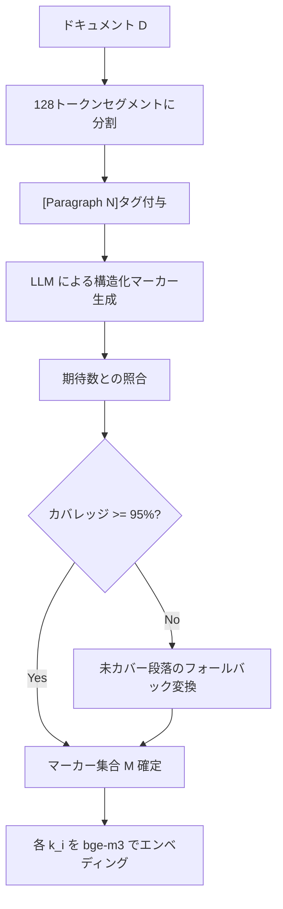

## 論文概要

本記事は arXiv 2603.26667 "M-RAG: Making RAG Faster, Stronger, and More Efficient" の解説記事です。M-RAGは従来のRAG（Retrieval-Augmented Generation）パイプラインにおけるテキストチャンキングを排除し、ドキュメントから「メタマーカー」と呼ばれる構造化されたKey-Value分解ユニットを抽出することで、情報断片化と検索ノイズの問題を同時に解決する手法です。著者らは、LongBenchベンチマークにおいてFixed-Sizeチャンキングやセマンティックチャンキングを含む複数のベースラインに対して安定的な性能向上を報告しています。

この記事は [Zenn記事: PruneRAGの動的チャンク枝刈りで設備保全ナレッジ検索を高速化する](https://zenn.dev/0h_n0/articles/91becffa48ec2e) の深掘りです。

## 情報源

- **arXiv ID**: 2603.26667
- **URL**: [https://arxiv.org/abs/2603.26667](https://arxiv.org/abs/2603.26667)
- **著者**: Sun Xu, Tongkai Xu, Baiheng Xie, et al.
- **発表年**: 2026年
- **分野**: cs.IR（情報検索）, cs.AI（人工知能）

## 背景と動機

RAGにおけるテキストチャンキングは、長いドキュメントを固定長やセマンティック境界で分割し、ベクトル検索に適した単位に変換する標準的な前処理です。しかし、著者らはこのアプローチに2つの構造的問題があると指摘しています。

第一に**情報断片化**の問題です。固定長チャンキングでは文脈をまたぐ情報が複数チャンクに分断され、意味的に完結しない断片が生成されます。セマンティックチャンキングはこの問題を緩和しますが、段落境界やトピック遷移の検出精度に依存するため完全な解決には至りません。

第二に**検索と生成の非分離**の問題です。従来のチャンクは検索用の意味表現と生成用の詳細情報を1つのテキスト断片に混在させています。クエリとの類似度計算に不要な冗長情報がノイズとなり、検索精度を低下させる要因となります。

M-RAGはこれらの課題に対し、チャンキング自体を排除するという根本的に異なるアプローチを提案しています。

## 主要な貢献

- **チャンクフリー検索戦略**: テキストチャンキングを完全に排除し、ドキュメントから構造化されたメタマーカーを抽出する新しいパラダイムを提案。情報断片化の問題を根本から解消
- **K-V分解アーキテクチャ**: 各メタマーカーを軽量なRetrieval Key（検索用意味キュー）とInformation Value（生成用コンテンツ）に明示的に分離。検索と生成の役割を構造的に分離することで、検索ノイズを低減
- **高い検索効率**: Retrieval Keyの平均長が約19トークンと短いため、エンベディング計算とコサイン類似度計算のコストが低減。HNSWインデックスとの組み合わせで高速な近似最近傍探索を実現
- **安定した汎化性能**: LongBenchの複数QAサブタスクにおいて、位置ベースリソート（M-RAG†-P）と類似度ベースリソート（M-RAG†-S）の両方が、Fixed-Sizeチャンキング、セマンティックチャンキング、PIC、DOS RAGの各ベースラインを安定的に上回ることを報告

## 技術的詳細

### K-V分解の数学的定式化

M-RAGの中核は、ドキュメント $D$ からメタマーカー集合 $\mathcal{M} = \{m_1, m_2, \ldots, m_n\}$ を抽出するプロセスです。各メタマーカー $m_i$ は以下のように定義されます。

$$
m_i = k_i \oplus v_i
$$

ここで、
- $k_i$: Retrieval Key（検索キー）。クエリとの意味的マッチングに特化した軽量な意味キュー。平均長は約19-20トークン（標準偏差 $\sigma \approx 2\text{-}3$）
- $v_i$: Information Value（情報値）。生成モデルへのコンテキストとなる詳細情報。平均長は約50-65トークン
- $\oplus$: テキスト連結演算子

この分離により、検索フェーズでは $k_i$ のみを用いた軽量な類似度計算が可能になり、生成フェーズでは $v_i$ に含まれる豊富なコンテキストを活用できます。

### マーカー抽出パイプライン

マーカー抽出は以下の手順で行われます。



1. **セグメント分割**: ドキュメントを128トークンのセグメントに分割し、各セグメントに `[Paragraph N]` タグを付与
2. **LLMによるマーカー生成**: DeepSeek-V3.2を用いて、構造化プロンプトでメタマーカーを生成。期待マーカー数は以下の式で算出

$$
n_{\text{expected}} = \left\lfloor \frac{|D|_{\text{tokens}}}{\text{segment\_size}} \right\rfloor
$$

ここで $|D|_{\text{tokens}}$ はドキュメントのトークン数、$\text{segment\_size} = 128$ です。

3. **カバレッジ検証**: 生成されたマーカーがドキュメントの95%以上をカバーしているかを検証。カバレッジが不足する場合はフォールバック処理で未カバー段落をマーカーに変換
4. **エンベディング**: 各Retrieval Key $k_i$ をBAAI/bge-m3モデルでベクトル化

### 検索メカニズムの数式

クエリ $q$ に対する検索は以下の手順で行われます。

まずクエリをエンベディングします。

$$
\mathbf{e}_q = E(q)
$$

ここで $E$ はbge-m3エンコーダです。

次に、全Retrieval Keyのエンベディング集合 $\mathbf{e}_K = \{E(k_1), E(k_2), \ldots, E(k_n)\}$ に対してコサイン類似度を計算します。

$$
\hat{M}_c = \sigma(\mathbf{e}_q, \mathbf{e}_K)
$$

ここで $\sigma$ はコサイン類似度関数です。実際にはHNSW（Hierarchical Navigable Small World）による近似最近傍探索で高速化されます。

トークンバジェット $B$ を設定し、上位マーカーを動的に選択します。

$$
\mathcal{M}_{\text{selected}} = \arg\max_{\mathcal{S} \subseteq \hat{M}_c} \sum_{m_i \in \mathcal{S}} \sigma(\mathbf{e}_q, E(k_i)) \quad \text{s.t.} \quad \sum_{m_i \in \mathcal{S}} |m_i|_{\text{tokens}} \leq B
$$

最終的に、選択されたマーカーを位置ベース（原文の出現順）または類似度ベース（スコア降順）でリソートし、生成モデルに入力します。

### 実装例（Pythonコード）

```python
from dataclasses import dataclass
import numpy as np
from typing import Optional


@dataclass(frozen=True)
class MetaMarker:
    """M-RAGのメタマーカー（k-v分解ユニット）

    Attributes:
        key: 検索用の軽量な意味キュー（約19トークン）
        value: 生成用のコンテキストリッチなコンテンツ（約50-65トークン）
        paragraph_idx: 元ドキュメントにおける段落インデックス
    """
    key: str
    value: str
    paragraph_idx: int

    @property
    def full_text(self) -> str:
        """k ⊕ v のテキスト連結を返す"""
        return f"{self.key} {self.value}"


class MRAGRetriever:
    """M-RAGのチャンクフリー検索エンジン

    Args:
        embedding_model: bge-m3等のエンベディングモデル
        segment_size: セグメント分割サイズ（デフォルト128トークン）
        coverage_threshold: カバレッジ検証の閾値（デフォルト0.95）
    """

    def __init__(
        self,
        embedding_model: "EmbeddingModel",
        segment_size: int = 128,
        coverage_threshold: float = 0.95,
    ) -> None:
        self.embedding_model = embedding_model
        self.segment_size = segment_size
        self.coverage_threshold = coverage_threshold
        self._marker_embeddings: Optional[np.ndarray] = None
        self._markers: list[MetaMarker] = []

    def extract_markers(
        self, document: str, llm: "LLMClient"
    ) -> list[MetaMarker]:
        """ドキュメントからメタマーカーを抽出する

        Args:
            document: 入力ドキュメント全文
            llm: マーカー生成に使用するLLMクライアント

        Returns:
            抽出されたメタマーカーのリスト
        """
        segments = self._split_segments(document)
        expected_count = len(segments)

        # LLMによる構造化マーカー生成
        markers = llm.generate_markers(segments)

        # カバレッジ検証とフォールバック
        coverage = self._compute_coverage(markers, segments)
        if coverage < self.coverage_threshold:
            uncovered = self._find_uncovered_segments(markers, segments)
            fallback_markers = self._fallback_convert(uncovered, llm)
            markers.extend(fallback_markers)

        self._markers = markers
        self._marker_embeddings = self.embedding_model.encode(
            [m.key for m in markers]
        )
        return markers

    def retrieve(
        self,
        query: str,
        token_budget: int,
        sort_by: str = "position",
    ) -> list[MetaMarker]:
        """クエリに対して関連マーカーを検索する

        Args:
            query: 検索クエリ
            token_budget: トークンバジェット上限
            sort_by: リソート方式（"position" or "similarity"）

        Returns:
            選択されたメタマーカーのリスト
        """
        query_embedding = self.embedding_model.encode([query])[0]

        # コサイン類似度の計算
        similarities = self._cosine_similarity(
            query_embedding, self._marker_embeddings
        )
        ranked_indices = np.argsort(similarities)[::-1]

        # トークンバジェットに収まるまで上位マーカーを選択
        selected: list[MetaMarker] = []
        total_tokens = 0
        for idx in ranked_indices:
            marker = self._markers[idx]
            marker_tokens = len(marker.full_text.split())  # 簡易トークン数
            if total_tokens + marker_tokens > token_budget:
                break
            selected.append(marker)
            total_tokens += marker_tokens

        # リソート
        if sort_by == "position":
            selected.sort(key=lambda m: m.paragraph_idx)
        # sort_by == "similarity" の場合はスコア降順のまま

        return selected

    def _split_segments(self, document: str) -> list[str]:
        """ドキュメントを128トークンセグメントに分割"""
        words = document.split()
        segments = []
        for i in range(0, len(words), self.segment_size):
            segment = " ".join(words[i : i + self.segment_size])
            segments.append(f"[Paragraph {len(segments) + 1}] {segment}")
        return segments

    @staticmethod
    def _cosine_similarity(
        query: np.ndarray, keys: np.ndarray
    ) -> np.ndarray:
        """コサイン類似度を計算"""
        query_norm = query / (np.linalg.norm(query) + 1e-8)
        keys_norm = keys / (
            np.linalg.norm(keys, axis=1, keepdims=True) + 1e-8
        )
        return keys_norm @ query_norm

    def _compute_coverage(
        self, markers: list[MetaMarker], segments: list[str]
    ) -> float:
        """マーカーのドキュメントカバレッジを算出"""
        covered = {m.paragraph_idx for m in markers}
        return len(covered) / len(segments) if segments else 0.0

    def _find_uncovered_segments(
        self, markers: list[MetaMarker], segments: list[str]
    ) -> list[str]:
        """カバーされていないセグメントを返す"""
        covered = {m.paragraph_idx for m in markers}
        return [
            seg for i, seg in enumerate(segments) if i not in covered
        ]

    def _fallback_convert(
        self, uncovered: list[str], llm: "LLMClient"
    ) -> list[MetaMarker]:
        """未カバーセグメントをフォールバックでマーカーに変換"""
        return llm.generate_markers(uncovered)
```

## 実装のポイント

### セグメントサイズの選択

著者らは128トークンをデフォルトのセグメントサイズとして採用しています。これは論文中で `128×1` 構成として表記されており、セグメントサイズ128トークン、セグメントあたり1マーカーの構成を意味します。セグメントサイズが小さすぎるとマーカー数が増大してインデックスサイズが膨張し、大きすぎるとマーカーの粒度が粗くなり検索精度が低下します。

### カバレッジ検証の重要性

著者らの報告によると、ドキュメントカバレッジは99.8-99.93%に達し、フォールバック使用率は1%未満です。カバレッジ閾値を95%に設定することで、LLMのマーカー生成における漏れを検出し、フォールバック処理で補完する設計となっています。実装時には、カバレッジが閾値を下回った場合のログ出力とアラート設定を推奨します。

### エンベディングモデルの選択

論文ではBAAI/bge-m3を使用しています。bge-m3は多言語対応のエンベディングモデルであり、日本語ドキュメントへの適用においても適切な選択肢です。Retrieval Keyが約19トークンと短いため、エンベディング計算の負荷は従来のチャンク（通常256-512トークン）と比較して大幅に低減されます。

### リソート戦略の使い分け

位置ベースリソート（M-RAG†-P）は、マーカーを原文の出現順に並べ替えることで文脈の連続性を保持します。一方、類似度ベースリソート（M-RAG†-S）は、最も関連性の高いマーカーを先頭に配置します。著者らの実験では、データセットによって優位性が異なることが報告されており（論文Table参照）、タスク特性に応じた選択が求められます。

## Production Deployment Guide

### AWS実装パターン（コスト最適化重視）

M-RAGのチャンクフリー検索パイプラインをAWS上にデプロイする際の、トラフィック量別の推奨構成を示します。2026年7月時点のap-northeast-1（東京）リージョン料金に基づく概算値です。実際のコストはトラフィックパターン、バースト使用量により変動するため、最新料金はAWS料金計算ツールで確認してください。

| 構成 | トラフィック | 主要サービス | 月額概算 |
|------|-------------|-------------|---------|
| **Small** | ~100 req/日 | Lambda + Bedrock + OpenSearch Serverless | $80-180 |
| **Medium** | ~1,000 req/日 | ECS Fargate + OpenSearch + ElastiCache | $400-900 |
| **Large** | 10,000+ req/日 | EKS + Spot Instances + OpenSearch + ElastiCache | $2,500-5,500 |

**Small構成の内訳**:
- Lambda（マーカー抽出・検索）: $5-15/月（128MB、平均実行時間2秒）
- Bedrock（DeepSeek相当のLLM推論）: $30-80/月（マーカー生成時のみ）
- OpenSearch Serverless（HNSWインデックス）: $30-60/月（2 OCU最小構成）
- DynamoDB（マーカーストア）: $5-15/月（On-Demandモード）
- S3（ドキュメント格納）: $1-3/月

**Medium構成の内訳**:
- ECS Fargate（検索API）: $80-150/月（0.5vCPU, 1GB RAM × 2タスク）
- OpenSearch（HNSWインデックス）: $150-300/月（r6g.large.search × 2ノード）
- ElastiCache（クエリキャッシュ）: $50-100/月（cache.t4g.medium）
- Bedrock: $80-250/月
- DynamoDB + S3: $20-40/月

**Large構成の内訳**:
- EKS（コントロールプレーン）: $73/月
- EC2 Spot Instances（ワーカー）: $300-800/月（c6i.2xlarge × 3-5台、Spot適用）
- OpenSearch: $500-1,200/月（r6g.xlarge.search × 3ノード、専用マスター付き）
- ElastiCache: $150-300/月（cache.r6g.large × 2ノード）
- Bedrock: $500-1,500/月
- ALB + NAT Gateway: $50-100/月

**コスト削減テクニック**:
- Spot Instances活用: EKSワーカーノードでSpotを優先利用し最大90%削減
- Reserved Instances: OpenSearchの1年リザーブドで最大38%削減
- Bedrock Batch API: 非リアルタイムのマーカー生成バッチ処理で50%削減
- Prompt Caching: 同一ドキュメントの再抽出時にキャッシュ活用で30-90%削減

### Terraformインフラコード

**Small構成（Serverless）**:

```hcl
# M-RAG Small構成: Lambda + Bedrock + OpenSearch Serverless
# 2026年7月時点の構成

terraform {
  required_version = ">= 1.9"
  required_providers {
    aws = {
      source  = "hashicorp/aws"
      version = "~> 5.60"
    }
  }
}

provider "aws" {
  region = "ap-northeast-1"
}

# --- IAMロール（最小権限） ---
resource "aws_iam_role" "mrag_lambda" {
  name = "mrag-lambda-role"
  assume_role_policy = jsonencode({
    Version = "2012-10-17"
    Statement = [{
      Action = "sts:AssumeRole"
      Effect = "Allow"
      Principal = { Service = "lambda.amazonaws.com" }
    }]
  })
}

resource "aws_iam_role_policy" "mrag_lambda_policy" {
  name = "mrag-lambda-policy"
  role = aws_iam_role.mrag_lambda.id
  policy = jsonencode({
    Version = "2012-10-17"
    Statement = [
      {
        Effect   = "Allow"
        Action   = ["logs:CreateLogGroup", "logs:CreateLogStream", "logs:PutLogEvents"]
        Resource = "arn:aws:logs:ap-northeast-1:*:*"
      },
      {
        Effect   = "Allow"
        Action   = ["bedrock:InvokeModel", "bedrock:InvokeModelWithResponseStream"]
        Resource = "arn:aws:bedrock:ap-northeast-1::foundation-model/*"
      },
      {
        Effect   = "Allow"
        Action   = ["dynamodb:GetItem", "dynamodb:PutItem", "dynamodb:Query", "dynamodb:BatchWriteItem"]
        Resource = aws_dynamodb_table.mrag_markers.arn
      },
      {
        Effect   = "Allow"
        Action   = ["aoss:APIAccessAll"]
        Resource = aws_opensearchserverless_collection.mrag_index.arn
      }
    ]
  })
}

# --- DynamoDB（マーカーストア） ---
resource "aws_dynamodb_table" "mrag_markers" {
  name         = "mrag-markers"
  billing_mode = "PAY_PER_REQUEST"  # コスト最適化: On-Demand
  hash_key     = "doc_id"
  range_key    = "marker_id"

  attribute {
    name = "doc_id"
    type = "S"
  }
  attribute {
    name = "marker_id"
    type = "S"
  }

  server_side_encryption {
    enabled = true  # KMS暗号化
  }

  point_in_time_recovery {
    enabled = true
  }
}

# --- OpenSearch Serverless（HNSWインデックス） ---
resource "aws_opensearchserverless_collection" "mrag_index" {
  name = "mrag-vector-index"
  type = "VECTORSEARCH"
}

# --- Lambda関数 ---
resource "aws_lambda_function" "mrag_retriever" {
  function_name = "mrag-retriever"
  runtime       = "python3.12"
  handler       = "handler.retrieve"
  role          = aws_iam_role.mrag_lambda.arn
  timeout       = 30
  memory_size   = 512  # bge-m3推論に必要

  environment {
    variables = {
      DYNAMODB_TABLE     = aws_dynamodb_table.mrag_markers.name
      OPENSEARCH_ENDPOINT = aws_opensearchserverless_collection.mrag_index.collection_endpoint
      EMBEDDING_MODEL    = "BAAI/bge-m3"
      SEGMENT_SIZE       = "128"
      COVERAGE_THRESHOLD = "0.95"
    }
  }
}

# --- CloudWatchアラーム（コスト監視） ---
resource "aws_cloudwatch_metric_alarm" "lambda_duration" {
  alarm_name          = "mrag-lambda-high-duration"
  comparison_operator = "GreaterThanThreshold"
  evaluation_periods  = 3
  metric_name         = "Duration"
  namespace           = "AWS/Lambda"
  period              = 300
  statistic           = "Average"
  threshold           = 10000  # 10秒
  alarm_actions       = []     # SNSトピックARNを設定

  dimensions = {
    FunctionName = aws_lambda_function.mrag_retriever.function_name
  }
}
```

**Large構成（Container）**:

```hcl
# M-RAG Large構成: EKS + Karpenter + Spot Instances
# 2026年7月時点の構成

module "eks" {
  source  = "terraform-aws-modules/eks/aws"
  version = "~> 20.24"

  cluster_name    = "mrag-cluster"
  cluster_version = "1.31"

  vpc_id     = module.vpc.vpc_id
  subnet_ids = module.vpc.private_subnets

  # コスト最適化: マネージドノードグループ不使用、Karpenterで管理
  cluster_endpoint_public_access = false
}

# --- Karpenter Provisioner（Spot優先） ---
resource "kubectl_manifest" "karpenter_nodepool" {
  yaml_body = yamlencode({
    apiVersion = "karpenter.sh/v1"
    kind       = "NodePool"
    metadata   = { name = "mrag-workers" }
    spec = {
      template = {
        spec = {
          requirements = [
            { key = "karpenter.sh/capacity-type", operator = "In", values = ["spot", "on-demand"] },
            { key = "node.kubernetes.io/instance-type", operator = "In",
              values = ["c6i.2xlarge", "c6a.2xlarge", "c7i.2xlarge"] },
          ]
          nodeClassRef = { name = "default" }
        }
      }
      limits   = { cpu = "64", memory = "128Gi" }
      disruption = {
        consolidationPolicy = "WhenEmptyOrUnderutilized"
        consolidateAfter    = "30s"
      }
    }
  })
}

# --- Secrets Manager（Bedrock設定） ---
resource "aws_secretsmanager_secret" "mrag_config" {
  name                    = "mrag/bedrock-config"
  recovery_window_in_days = 7
}

# --- AWS Budgets（予算アラート） ---
resource "aws_budgets_budget" "mrag_monthly" {
  name         = "mrag-monthly-budget"
  budget_type  = "COST"
  limit_amount = "5000"
  limit_unit   = "USD"
  time_unit    = "MONTHLY"

  notification {
    comparison_operator       = "GREATER_THAN"
    threshold                 = 80
    threshold_type            = "PERCENTAGE"
    notification_type         = "ACTUAL"
    subscriber_email_addresses = ["ops-team@example.com"]
  }
}
```

### 運用・監視設定

**CloudWatch Logs Insights クエリ**:

```
# コスト異常検知: 1時間あたりのBedrock呼び出し回数とトークン使用量
fields @timestamp, @message
| filter @message like /bedrock/
| stats count() as invocations,
        sum(input_tokens) as total_input_tokens,
        sum(output_tokens) as total_output_tokens
  by bin(1h) as hour
| sort hour desc

# レイテンシ分析: マーカー検索のP95/P99
fields @timestamp, duration_ms
| filter event = "marker_retrieval"
| stats percentile(duration_ms, 95) as p95,
        percentile(duration_ms, 99) as p99,
        avg(duration_ms) as avg_ms
  by bin(5m)
```

**CloudWatchアラーム設定（Python）**:

```python
import boto3


def create_mrag_alarms(sns_topic_arn: str) -> None:
    """M-RAGパイプライン用CloudWatchアラームを作成する

    Args:
        sns_topic_arn: 通知先のSNSトピックARN
    """
    client = boto3.client("cloudwatch", region_name="ap-northeast-1")

    # Bedrock トークン使用量スパイク検知
    client.put_metric_alarm(
        AlarmName="mrag-bedrock-token-spike",
        MetricName="InputTokenCount",
        Namespace="AWS/Bedrock",
        Statistic="Sum",
        Period=3600,
        EvaluationPeriods=1,
        Threshold=500000,
        ComparisonOperator="GreaterThanThreshold",
        AlarmActions=[sns_topic_arn],
    )

    # Lambda 実行時間異常検知
    client.put_metric_alarm(
        AlarmName="mrag-lambda-timeout-risk",
        MetricName="Duration",
        Namespace="AWS/Lambda",
        Statistic="p99",
        Period=300,
        EvaluationPeriods=3,
        Threshold=25000,  # 25秒（タイムアウト30秒の83%）
        ComparisonOperator="GreaterThanThreshold",
        Dimensions=[
            {"Name": "FunctionName", "Value": "mrag-retriever"},
        ],
        AlarmActions=[sns_topic_arn],
    )
```

**X-Ray トレーシング設定（Python）**:

```python
from aws_xray_sdk.core import xray_recorder, patch_all


def configure_xray_tracing() -> None:
    """X-Rayの自動計装を設定する"""
    xray_recorder.configure(
        service="mrag-retriever",
        sampling=True,
        context_missing="LOG_ERROR",
    )
    patch_all()  # boto3, requests等を自動計装


def traced_retrieve(
    query: str, token_budget: int
) -> dict:
    """X-Rayトレース付きのマーカー検索

    Args:
        query: 検索クエリ
        token_budget: トークンバジェット上限

    Returns:
        検索結果を含む辞書
    """
    subsegment = xray_recorder.begin_subsegment("marker_retrieval")
    subsegment.put_annotation("query_length", len(query))
    subsegment.put_metadata("token_budget", token_budget)

    try:
        results = retriever.retrieve(query, token_budget)
        subsegment.put_annotation("markers_found", len(results))
        return {"markers": results, "count": len(results)}
    except Exception as e:
        subsegment.add_exception(e, stack=True)
        raise
    finally:
        xray_recorder.end_subsegment()
```

**Cost Explorer自動レポート（Python）**:

```python
import boto3
from datetime import datetime, timedelta


def daily_cost_report(sns_topic_arn: str) -> dict:
    """日次コストレポートを取得しSNS通知する

    Args:
        sns_topic_arn: 通知先のSNSトピックARN

    Returns:
        コストレポートの辞書
    """
    ce = boto3.client("ce", region_name="us-east-1")
    sns = boto3.client("sns", region_name="ap-northeast-1")

    today = datetime.utcnow().strftime("%Y-%m-%d")
    yesterday = (datetime.utcnow() - timedelta(days=1)).strftime("%Y-%m-%d")

    response = ce.get_cost_and_usage(
        TimePeriod={"Start": yesterday, "End": today},
        Granularity="DAILY",
        Metrics=["UnblendedCost"],
        GroupBy=[{"Type": "DIMENSION", "Key": "SERVICE"}],
    )

    total_cost = 0.0
    service_costs: dict[str, float] = {}
    for group in response["ResultsByTime"][0]["Groups"]:
        service = group["Keys"][0]
        cost = float(group["Metrics"]["UnblendedCost"]["Amount"])
        service_costs[service] = cost
        total_cost += cost

    # $100/日 超過で通知
    if total_cost > 100.0:
        sns.publish(
            TopicArn=sns_topic_arn,
            Subject=f"[ALERT] M-RAG Daily Cost: ${total_cost:.2f}",
            Message=(
                f"日次コスト: ${total_cost:.2f}\n"
                + "\n".join(
                    f"  {svc}: ${c:.2f}"
                    for svc, c in sorted(
                        service_costs.items(),
                        key=lambda x: x[1],
                        reverse=True,
                    )[:5]
                )
            ),
        )

    return {"total": total_cost, "services": service_costs}
```

### コスト最適化チェックリスト

**アーキテクチャ選択**:
- [ ] トラフィック量に応じた構成を選択（~100 req/日: Serverless、~1,000: Hybrid、10,000+: Container）
- [ ] マーカー生成（バッチ）と検索（リアルタイム）でコンピュートを分離

**リソース最適化**:
- [ ] EC2/EKSワーカー: Spot Instances優先（c6i/c6a/c7iファミリー、最大90%削減）
- [ ] OpenSearch: Reserved Instances 1年コミット（最大38%削減）
- [ ] Savings Plans: Compute Savings Plans検討（Fargate/Lambda横断で最大17%削減）
- [ ] Lambda: メモリサイズをPower Tuningで最適化（512MB-1024MB範囲で検証）
- [ ] ECS/EKS: 夜間・休日のスケールダウン（Karpenter consolidation設定）
- [ ] OpenSearch Serverless: 最小OCU設定の見直し

**LLMコスト削減**:
- [ ] Bedrock Batch API: 非リアルタイムのマーカー生成バッチをBatch APIに移行（50%削減）
- [ ] Prompt Caching: 同一ドキュメントの再処理時にキャッシュ活用（30-90%削減）
- [ ] モデル選択ロジック: 短いドキュメントは軽量モデル、長いドキュメントは高性能モデル
- [ ] トークン数制限: セグメントサイズ128トークンでマーカー生成プロンプトを最小化
- [ ] マーカーキャッシュ: 生成済みマーカーをDynamoDBに永続化し再抽出を回避

**監視・アラート**:
- [ ] AWS Budgets: 月次予算アラート設定（80%/100%閾値）
- [ ] CloudWatch アラーム: Bedrockトークン使用量・Lambdaタイムアウト
- [ ] Cost Anomaly Detection: 有効化（MLベースの異常検知）
- [ ] 日次コストレポート: Cost Explorer APIで自動取得、SNS通知
- [ ] X-Ray: エンドツーエンドのレイテンシトレーシング

**リソース管理**:
- [ ] 未使用リソース削除: 定期的なCleanupスクリプト実行
- [ ] タグ戦略: `Project=mrag`, `Environment=prod/dev`, `CostCenter=xxx` タグ付与
- [ ] ライフサイクルポリシー: S3バケットの古いドキュメントにIntelligent-Tiering適用
- [ ] 開発環境夜間停止: EventBridge Schedulerで22:00-08:00停止
- [ ] CloudFormation/Terraform State: リモートバックエンド（S3 + DynamoDB Lock）で管理

## 実験結果

著者らはLongBenchベンチマークのQAサブタスクで評価を行っています。以下は論文から報告されている `128×1` トークン構成（セグメントサイズ128、セグメントあたり1マーカー）での結果です。

| Dataset | M-RAG†-P | M-RAG†-S | Fixed-Size | 備考 |
|---|---|---|---|---|
| NarrativeQA | **0.0736** | 0.0644 | baseline | +11.5%改善（論文Table参照） |
| Qasper | 0.1806 | **0.1820** | - | 類似度ベースリソートが優位 |
| 2WikiMultihopQA | 0.2232 | **0.2321** | - | マルチホップで類似度ソートが有効 |

著者らはM-RAGが以下のベースラインを上回ったと報告しています: Fixed-Sizeチャンキング、Semanticチャンキング、PIC（Proposition-based Indexing & Chunking）、DOS RAG。

**分析ポイント**:
- NarrativeQAのような物語理解タスクでは位置ベースリソート（M-RAG†-P）が有効であり、著者らはこれを文脈の連続性が重要なタスク特性によるものと考察しています
- マルチホップ推論が求められる2WikiMultihopQAでは類似度ベースリソート（M-RAG†-S）が優位となっており、最も関連性の高いマーカーを優先的に提示することの重要性を示唆しています
- ドキュメントカバレッジは99.8-99.93%であり、フォールバック使用率は1%未満と報告されています。これはLLMによるマーカー生成の高い被覆率を示しています

## 実運用への応用

関連Zenn記事「PruneRAGの動的チャンク枝刈りで設備保全ナレッジ検索を高速化する」で扱われている設備保全ナレッジ検索のシナリオにおいて、M-RAGのチャンクフリー戦略は以下の点で有効と考えられます。

設備保全マニュアルは手順・注意事項・部品仕様が文書内で相互参照される構造を持ち、固定長チャンキングでは手順の途中で分断されるリスクがあります。M-RAGのメタマーカーは「手順全体」を1つのValue、「手順の目的」をKeyとして構造化できるため、手順の完全性を保持した検索が可能になります。

PruneRAGが「不要チャンクの動的枝刈り」でノイズを削減するアプローチであるのに対し、M-RAGは「チャンクを生成しない」ことでノイズの発生自体を防ぐアプローチです。両手法は相補的な関係にあり、M-RAGのメタマーカーに対してPruneRAG的な動的フィルタリングを適用する組み合わせも検討に値します。

## 関連研究

- **PruneRAG**: 動的チャンク枝刈りによりRAG検索時のノイズを削減する手法。M-RAGがチャンキング自体を排除するのに対し、PruneRAGは生成されたチャンクから不要なものをフィルタリングするアプローチであり、問題へのアプローチが異なる
- **Provence（PROcessing Very Extensive Narrative Collections Efficiently）**: 長文ドキュメントのRAG処理を効率化する手法。M-RAGと同様に長距離文脈依存関係の保持を目指すが、アーキテクチャは異なる
- **DOS RAG（Document Structure-based RAG）**: ドキュメントの構造情報（見出し、段落、リスト等）を活用してチャンキングを改善する手法。M-RAGはドキュメント構造をLLMで解釈しメタマーカーに変換する点で、より柔軟なアプローチを採用
- **PIC（Proposition-based Indexing & Chunking）**: テキストを命題単位に分解してインデックスする手法。M-RAGのKey-Value分解と類似した発想だが、PICは命題を独立した検索単位とするのに対し、M-RAGはKeyとValueを明示的に分離する点が異なる

## まとめと今後の展望

M-RAGは、RAGにおけるテキストチャンキングの構造的問題に対し、チャンクフリーという根本的に異なるアプローチで解決を試みた研究です。K-V分解メタマーカーにより、検索精度と生成品質のトレードオフを構造的に解消しつつ、Retrieval Keyの軽量化による検索効率の向上を実現しています。

今後の展望として、マーカー抽出に使用するLLMの選択がコストと品質のトレードオフに直結する点が実用上の課題です。また、著者らの評価はLongBenchに限定されており、ドメイン特化タスク（設備保全、法務文書、医療記録等）での検証は今後の研究に委ねられています。チャンクベースの手法（PruneRAG等）との組み合わせや、マーカーの動的更新戦略も有望な研究方向です。

## 参考文献

- **arXiv**: [https://arxiv.org/abs/2603.26667](https://arxiv.org/abs/2603.26667)
- **Related Zenn article**: [PruneRAGの動的チャンク枝刈りで設備保全ナレッジ検索を高速化する](https://zenn.dev/0h_n0/articles/91becffa48ec2e)
