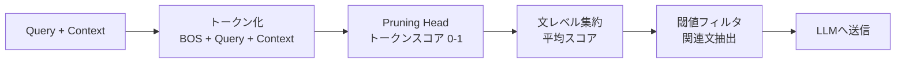

## ブログ概要（Summary）

本記事はMilvus公式ブログ「Semantic Highlighting for RAG Context Pruning and Token Saving」（Zilliz、2026年1月公開）の解説記事です。RAG（Retrieval-Augmented Generation）パイプラインにおいて、検索済みドキュメントからクエリに意味的に関連する文のみを抽出し、LLMへの入力トークンを70-80%削減するセマンティックハイライティングモデル `zilliz/semantic-highlight-bilingual-v1` の技術的詳細を解説します。BGE-M3 Reranker v2をベースとした0.6Bパラメータのencoder-onlyモデルで、トークンレベルの関連度スコアリングを文レベルに集約するアプローチを採用しています。

この記事は [Zenn記事: PruneRAGの動的チャンク枝刈りで設備保全ナレッジ検索を高速化する](https://zenn.dev/0h_n0/articles/91becffa48ec2e) の深掘りです。

## 情報源

- **種別**: 企業テックブログ
- **URL**: [https://milvus.io/blog/semantic-highlighting-model-for-rag-context-pruning-and-token-saving.md](https://milvus.io/blog/semantic-highlighting-model-for-rag-context-pruning-and-token-saving.md)
- **組織**: Zilliz / Milvus
- **発表日**: 2026年1月

## 技術的背景（Technical Background）

RAGパイプラインでは、ユーザーのクエリに対してベクトル検索で関連ドキュメントを取得し、LLMのコンテキストとして渡すことで回答精度を向上させる。しかし、取得されたドキュメントにはクエリと無関係な文が多数含まれており、これがトークンコストの増大とLLMの注意力分散を引き起こす。典型的なRAGパイプラインではTop-K（K=5-20）のチャンクを取得するが、各チャンクの中でクエリに直接関連する文は全体の20-30%程度に過ぎないことが多い。残りの70-80%はLLMに不要なノイズとなり、回答精度の低下とコスト増大の双方を引き起こす。

この問題に対する従来のコンテキスト枝刈り手法は主に3つのアプローチに分類される。第1にキーワードマッチングベースの手法（BM25等）はlexical gapの問題があり、意味的に関連するが語彙が異なる文を見逃す。たとえば「心臓発作の予防法」というクエリに対して「冠動脈疾患のリスクファクター管理」という文は意味的に関連するが、BM25ではスコアが低くなる。第2にLLM自体にコンテキストの要約・圧縮を依頼する手法（LLMLingua等）はLLM呼び出しのオーバーヘッドが発生し、トークンコスト削減のためにトークンを消費するという矛盾を抱える。第3にリランカーベースの手法はドキュメントレベルの関連度は評価できるが、ドキュメント内の文レベルの粒度で枝刈りを行うことは設計上困難である。リランカーはドキュメント全体に対して単一のスコアを出力するため、内部のどの文が関連しているかを特定できない。

Zillizのセマンティックハイライティングモデルは、ICLR 2025で発表されたProvence（Context Pruning via Token-level Relevance Estimation）の着想をベースに、枝刈り問題をトークンレベルの関連度スコアリングタスクとして再定式化することでこれらの制約を克服している。Provenceはコンテキスト中の各トークンに対して関連度スコアを予測するという定式化を最初に提案した研究であり、Zillizのモデルはこれをバイリンガル対応・大規模学習データ・実用的なAPIとして発展させたものと位置づけられる。

## 実装アーキテクチャ（Architecture）

### モデル構成

セマンティックハイライティングモデルはBAAI/bge-reranker-v2-m3をベースモデルとし、既存のRerank Headに加えてPruning Headを追加したデュアルヘッド構成となっている。学習時にはPruning Headのみを訓練し、Rerank Headの重みは凍結する。この設計により、リランキング機能を維持したまま文レベルの枝刈り能力を追加できる。

| 項目 | 仕様 |
|------|------|
| **ベースモデル** | BGE-M3 Reranker v2 |
| **パラメータ数** | 0.6B（encoder-only） |
| **コンテキストウィンドウ** | 8,192トークン |
| **対応言語** | 英語・中国語（バイリンガル） |
| **ライセンス** | MIT（商用利用可） |
| **HuggingFace** | `zilliz/semantic-highlight-bilingual-v1` |
| **学習GPU** | 8 x A100 |
| **学習時間** | 約9時間（3エポック） |
| **学習対象** | Pruning Headのみ（Rerank Headは凍結） |

Pruning Headはencoder出力のhidden statesを入力とし、各トークン位置に対してシグモイド関数を通じて0-1の関連度スコアを出力する。数式で表すと、トークン $t$ の関連度スコア $r(t)$ は以下のように定義される。

$$
r(t) = \sigma(W_p \cdot h_t + b_p)
$$

ここで $h_t$ はencoderの最終層におけるトークン $t$ のhidden state、$W_p$ と $b_p$ はPruning Headの学習パラメータ、$\sigma$ はシグモイド関数である。クエリ部分のトークンにはスコアが割り当てられず、コンテキスト部分のトークンのみがスコアリング対象となる。

### 推論パイプライン

推論は以下の5ステップで実行される。



**Step 1**: クエリとコンテキストを連結し、`[BOS] + Query + Context`の形式でトークン化する。

**Step 2**: encoder-onlyモデルがコンテキスト部分の各トークンに対して0から1の関連度スコアを出力する。スコアが高いほどクエリとの意味的関連性が強い。

**Step 3**: トークンレベルのスコアを文レベルに集約する。具体的には、各文に含まれるトークンのスコアの平均値を文の関連度スコアとする。文 $s_i$ のスコアは以下で定義される。

$$
\text{score}(s_i) = \frac{1}{|s_i|} \sum_{t \in s_i} r(t)
$$

ここで $r(t)$ はトークン $t$ の関連度スコア（0-1）、$|s_i|$ は文 $s_i$ に含まれるトークン数を表す。

**Step 4**: 閾値 $\tau$（デフォルト0.5）以上のスコアを持つ文を関連文として抽出する。閾値フィルタリングは以下の判定式で行われる。

$$
\text{highlight}(s_i) = \begin{cases} 1 & \text{if } \text{score}(s_i) \geq \tau \\ 0 & \text{otherwise} \end{cases}
$$

**Step 5**: 抽出された文のみをLLMのコンテキストとして送信する。元のドキュメント中の文の順序は保持される。これにより、LLMは文脈の流れを維持したまま、関連情報のみに集中できる。

### スコアリングの具体例

ブログが示すケーススタディでは、映画「The Killing of a Sacred Deer」に関するクエリに対して以下のスコアが割り当てられている。

| 文 | Zillizモデルスコア | XProvenceスコア | 内容 |
|----|-------------------|-----------------|------|
| Sentence 1（正解文） | 0.915 | 0.133 | 映画の説明 |
| Sentence 3（ディストラクター） | 0.719 | 0.947 | 無関係な情報 |

XProvenceでは正解文のスコア（0.133）がディストラクター文のスコア（0.947）を下回る逆転現象が発生しているが、Zillizモデルでは正解文に高いスコア（0.915）を適切に割り当てている。この安定性がバイリンガル環境での一貫した性能につながっている。

### Pythonによる実装例

HuggingFace Transformersを用いた基本的な使用方法を示す。

```python
from transformers import AutoModel


def highlight_context(
    question: str,
    context: str,
    threshold: float = 0.5,
) -> dict:
    """セマンティックハイライティングでコンテキストを枝刈りする。

    Args:
        question: ユーザーのクエリ文字列。
        context: 検索で取得したドキュメントテキスト。
        threshold: 関連文の判定閾値（0-1）。デフォルトは0.5。

    Returns:
        ハイライト結果を含む辞書。highlighted_sentences, compression_rate,
        sentence_metrics を含む。
    """
    model = AutoModel.from_pretrained(
        "zilliz/semantic-highlight-bilingual-v1",
        trust_remote_code=True,
    )

    result = model.process(
        question=question,
        context=context,
        threshold=threshold,
        return_sentence_metrics=True,
    )
    return result
```

返り値には以下のフィールドが含まれる。

- `highlighted_sentences`: 関連と判定された文のリスト
- `compression_rate`: 元テキストに対する圧縮率
- `sentence_metrics`（`return_sentence_metrics=True`時）: 各文の関連度スコア

バッチ処理での利用例を示す。

```python
from transformers import AutoModel


def batch_highlight(
    question: str,
    documents: list[str],
    threshold: float = 0.5,
) -> list[str]:
    """複数ドキュメントに対してセマンティックハイライティングを適用する。

    Args:
        question: ユーザーのクエリ文字列。
        documents: 検索で取得したドキュメントのリスト。
        threshold: 関連文の判定閾値（0-1）。

    Returns:
        各ドキュメントからハイライトされた文を結合したリスト。
    """
    model = AutoModel.from_pretrained(
        "zilliz/semantic-highlight-bilingual-v1",
        trust_remote_code=True,
    )

    highlighted_parts: list[str] = []
    for doc in documents:
        result = model.process(
            question=question,
            context=doc,
            threshold=threshold,
            return_sentence_metrics=True,
        )
        highlighted_parts.extend(result["highlighted_sentences"])

    return highlighted_parts
```

### RAGパイプラインへの統合例

既存のRAGパイプラインにセマンティックハイライティングを組み込む際の典型的な実装パターンを示す。検索後・LLM呼び出し前のフィルタリングステップとして挿入する。

```python
from transformers import AutoModel


class SemanticHighlightRAG:
    """セマンティックハイライティングを組み込んだRAGパイプライン。

    検索結果に対してセマンティックハイライティングを適用し、
    関連文のみをLLMコンテキストとして使用する。

    Attributes:
        highlight_model: セマンティックハイライティングモデル。
        threshold: 関連文の判定閾値。
    """

    def __init__(self, threshold: float = 0.5) -> None:
        self.highlight_model = AutoModel.from_pretrained(
            "zilliz/semantic-highlight-bilingual-v1",
            trust_remote_code=True,
        )
        self.threshold = threshold

    def prune_context(
        self,
        query: str,
        retrieved_docs: list[str],
    ) -> tuple[str, float]:
        """検索結果をハイライティングで枝刈りする。

        Args:
            query: ユーザーのクエリ。
            retrieved_docs: 検索で取得したドキュメントのリスト。

        Returns:
            枝刈り後のコンテキスト文字列と圧縮率のタプル。
        """
        pruned_sentences: list[str] = []
        total_original = 0
        total_pruned = 0

        for doc in retrieved_docs:
            result = self.highlight_model.process(
                question=query,
                context=doc,
                threshold=self.threshold,
                return_sentence_metrics=True,
            )
            pruned_sentences.extend(result["highlighted_sentences"])
            total_original += len(doc)
            total_pruned += sum(len(s) for s in result["highlighted_sentences"])

        compression_rate = 1.0 - (total_pruned / total_original) if total_original > 0 else 0.0
        context = "\n".join(pruned_sentences)
        return context, compression_rate
```

このパイプラインでは、ベクトル検索でTop-Kのドキュメントを取得した後、各ドキュメントに対してセマンティックハイライティングを適用し、関連文のみを結合してLLMのコンテキストとする。圧縮率を同時に返すことで、運用時のトークン削減効果をモニタリングできる。

## Production Deployment Guide

セマンティックハイライティングモデルをプロダクション環境に導入する際のAWS構成、インフラコード、監視設定を解説する。本モデルは0.6Bパラメータのencoder-onlyモデルであり、GPUなしでもCPU推論が可能だが、レイテンシ要件によってはGPU利用を推奨する。

### AWS実装パターン（コスト最適化重視）

以下の料金は2026年7月時点のAWS ap-northeast-1（東京）リージョンの概算値である。実際のコストはトラフィックパターン、リージョン、バースト使用量により変動する。最新料金はAWS料金計算ツールで確認を推奨する。

| 項目 | Small (~100 req/日) | Medium (~1,000 req/日) | Large (10,000+ req/日) |
|------|---------------------|------------------------|------------------------|
| **コンピュート** | Lambda (ARM, 2048MB) | ECS Fargate (2vCPU, 8GB) | EKS + g5.xlarge Spot |
| **モデルホスティング** | Lambda Layer or S3 | ECR + Fargate Task | ECR + GPU Node |
| **ベクトルDB** | Milvus Lite (EFS) | Milvus Standalone (EBS) | Milvus Cluster (EKS) |
| **キャッシュ** | DynamoDB (On-Demand) | ElastiCache Redis | ElastiCache Redis Cluster |
| **月額概算** | $80-150 | $400-900 | $2,500-6,000 |

**Small構成（~100 req/日）**: Lambda + S3にモデル重みを配置。コールドスタート時にモデルロードが発生するため、Provisioned Concurrency（1インスタンス）の利用を推奨する。0.6Bモデルは約2.4GBのメモリを消費するため、Lambda関数のメモリを2048MB以上に設定する。月額の内訳はLambda実行$10-20、S3ストレージ$1、DynamoDB$5-10、CloudWatch$5程度。

**Medium構成（~1,000 req/日）**: ECS Fargateでモデルサービングコンテナを常時稼働させる。CPU推論で平均レイテンシ200-500ms程度。ALB経由でリクエストを分散し、ECS Service Auto Scalingで負荷に応じてタスク数を調整する。月額の内訳はFargateタスク（2vCPU, 8GB x 2台）$200-400、ALB$20、ElastiCache Redis$50-100、ECR$5、CloudWatch$20程度。

**Large構成（10,000+ req/日）**: EKS上にGPU対応ノード（g5.xlarge、Spot Instance）を配置し、GPU推論で平均レイテンシ50-100msを実現する。Karpenter（Spotを優先するProvisioner）でノード管理を自動化し、コストをOn-Demandと比較して最大70%削減する。月額の内訳はEKSクラスタ$73、GPU Spot Instances（g5.xlarge x 2-4台）$430-860、システムノード$150、ElastiCache Redis Cluster$200-400、ALB$50、CloudWatch$30程度。Milvus Clusterの運用コストも含めると$2,500-6,000の範囲となる。

**コスト削減テクニック**:
- Spot Instances活用: g5.xlarge On-Demand $1.006/h → Spot約$0.30/h（約70%削減）
- ハイライト結果のキャッシュ: 同一クエリ+ドキュメントの組み合わせをRedisにキャッシュし、重複推論を排除
- モデル量子化: INT8量子化で推論速度1.5-2倍、メモリ使用量50%削減

### Terraformインフラコード

#### Small構成（Serverless: Lambda + S3）

```hcl
# --- Small構成: Lambda + S3 ---

terraform {
  required_version = ">= 1.5"
  required_providers {
    aws = {
      source  = "hashicorp/aws"
      version = "~> 5.0"
    }
  }
}

provider "aws" {
  region = "ap-northeast-1"
}

# S3: モデル重み格納
resource "aws_s3_bucket" "model_weights" {
  bucket = "semantic-highlight-model-weights"
}

resource "aws_s3_bucket_versioning" "model_weights" {
  bucket = aws_s3_bucket.model_weights.id
  versioning_configuration {
    status = "Enabled"
  }
}

# IAMロール: Lambda実行用（最小権限）
resource "aws_iam_role" "lambda_exec" {
  name = "semantic-highlight-lambda-role"

  assume_role_policy = jsonencode({
    Version = "2012-10-17"
    Statement = [{
      Action = "sts:AssumeRole"
      Effect = "Allow"
      Principal = {
        Service = "lambda.amazonaws.com"
      }
    }]
  })
}

resource "aws_iam_role_policy" "lambda_s3_read" {
  name = "s3-model-read"
  role = aws_iam_role.lambda_exec.id

  policy = jsonencode({
    Version = "2012-10-17"
    Statement = [
      {
        Effect   = "Allow"
        Action   = ["s3:GetObject"]
        Resource = "${aws_s3_bucket.model_weights.arn}/*"
      },
      {
        Effect   = "Allow"
        Action   = ["logs:CreateLogGroup", "logs:CreateLogStream", "logs:PutLogEvents"]
        Resource = "arn:aws:logs:*:*:*"
      }
    ]
  })
}

# Lambda関数
resource "aws_lambda_function" "highlight" {
  function_name = "semantic-highlight-inference"
  runtime       = "python3.12"
  handler       = "handler.lambda_handler"
  role          = aws_iam_role.lambda_exec.arn
  memory_size   = 2048
  timeout       = 60
  architectures = ["arm64"]

  environment {
    variables = {
      MODEL_BUCKET = aws_s3_bucket.model_weights.id
      MODEL_KEY    = "models/semantic-highlight-bilingual-v1/"
      THRESHOLD    = "0.5"
    }
  }
}

# DynamoDBキャッシュテーブル
resource "aws_dynamodb_table" "highlight_cache" {
  name         = "semantic-highlight-cache"
  billing_mode = "PAY_PER_REQUEST"
  hash_key     = "cache_key"

  attribute {
    name = "cache_key"
    type = "S"
  }

  ttl {
    attribute_name = "ttl"
    enabled        = true
  }
}

# CloudWatchアラーム: Lambda実行時間
resource "aws_cloudwatch_metric_alarm" "lambda_duration" {
  alarm_name          = "semantic-highlight-lambda-duration"
  comparison_operator = "GreaterThanThreshold"
  evaluation_periods  = 3
  metric_name         = "Duration"
  namespace           = "AWS/Lambda"
  period              = 300
  statistic           = "Average"
  threshold           = 30000
  alarm_description   = "Lambda推論時間が30秒を超過"

  dimensions = {
    FunctionName = aws_lambda_function.highlight.function_name
  }
}
```

#### Large構成（Container: EKS + Karpenter + Spot）

```hcl
# --- Large構成: EKS + Karpenter + Spot ---

module "eks" {
  source          = "terraform-aws-modules/eks/aws"
  version         = "~> 20.0"
  cluster_name    = "semantic-highlight-cluster"
  cluster_version = "1.30"

  vpc_id     = module.vpc.vpc_id
  subnet_ids = module.vpc.private_subnets

  eks_managed_node_groups = {
    system = {
      instance_types = ["m7g.large"]
      min_size       = 2
      max_size       = 4
      desired_size   = 2
      capacity_type  = "ON_DEMAND"
    }
  }
}

# Karpenter Provisioner: GPU Spot優先
resource "kubectl_manifest" "karpenter_provisioner" {
  yaml_body = yamlencode({
    apiVersion = "karpenter.sh/v1beta1"
    kind       = "NodePool"
    metadata = {
      name = "gpu-spot-pool"
    }
    spec = {
      template = {
        spec = {
          requirements = [
            {
              key      = "karpenter.sh/capacity-type"
              operator = "In"
              values   = ["spot", "on-demand"]
            },
            {
              key      = "node.kubernetes.io/instance-type"
              operator = "In"
              values   = ["g5.xlarge", "g5.2xlarge"]
            }
          ]
          nodeClassRef = {
            name = "default"
          }
        }
      }
      limits = {
        cpu    = "64"
        memory = "256Gi"
      }
      disruption = {
        consolidationPolicy = "WhenUnderutilized"
      }
    }
  })
}

# Secrets Manager: APIキー管理
resource "aws_secretsmanager_secret" "api_keys" {
  name = "semantic-highlight/api-keys"
}

# Cost Explorerアラート
resource "aws_budgets_budget" "monthly" {
  name         = "semantic-highlight-monthly"
  budget_type  = "COST"
  limit_amount = "5000"
  limit_unit   = "USD"
  time_unit    = "MONTHLY"

  notification {
    comparison_operator       = "GREATER_THAN"
    threshold                 = 80
    threshold_type            = "PERCENTAGE"
    notification_type         = "ACTUAL"
    subscriber_email_addresses = ["ops-team@example.com"]
  }
}
```

### 運用・監視設定

#### CloudWatch Logs Insights クエリ

```
# コスト異常検知: トークン使用量の急増を検出
fields @timestamp, @message
| filter @message like /token_count/
| stats avg(token_count) as avg_tokens,
        max(token_count) as max_tokens,
        sum(token_count) as total_tokens
        by bin(1h)
| sort @timestamp desc

# レイテンシ分析: P50/P95/P99
fields @timestamp, duration_ms
| filter event = "highlight_inference"
| stats percentile(duration_ms, 50) as p50,
        percentile(duration_ms, 95) as p95,
        percentile(duration_ms, 99) as p99
        by bin(5m)
```

#### CloudWatch アラーム設定

```python
import boto3


def create_highlight_alarms(function_name: str, sns_topic_arn: str) -> None:
    """セマンティックハイライティングサービス用のCloudWatchアラームを作成する。

    Args:
        function_name: 監視対象のLambda関数名。
        sns_topic_arn: アラート通知先のSNSトピックARN。
    """
    cloudwatch = boto3.client("cloudwatch", region_name="ap-northeast-1")

    # 推論レイテンシアラーム
    cloudwatch.put_metric_alarm(
        AlarmName=f"{function_name}-high-latency",
        MetricName="Duration",
        Namespace="AWS/Lambda",
        Statistic="p95",
        Period=300,
        EvaluationPeriods=3,
        Threshold=10000,
        ComparisonOperator="GreaterThanThreshold",
        AlarmActions=[sns_topic_arn],
        Dimensions=[{"Name": "FunctionName", "Value": function_name}],
    )

    # エラー率アラーム
    cloudwatch.put_metric_alarm(
        AlarmName=f"{function_name}-error-rate",
        MetricName="Errors",
        Namespace="AWS/Lambda",
        Statistic="Sum",
        Period=300,
        EvaluationPeriods=2,
        Threshold=5,
        ComparisonOperator="GreaterThanThreshold",
        AlarmActions=[sns_topic_arn],
        Dimensions=[{"Name": "FunctionName", "Value": function_name}],
    )
```

#### X-Ray トレーシング設定

```python
from aws_xray_sdk.core import xray_recorder
from aws_xray_sdk.core import patch_all


# boto3等の自動計装
patch_all()


@xray_recorder.capture("highlight_inference")
def traced_highlight(question: str, context: str) -> dict:
    """X-Rayトレース付きのハイライト推論を実行する。

    Args:
        question: ユーザーのクエリ。
        context: ドキュメントコンテキスト。

    Returns:
        ハイライト結果とメタデータを含む辞書。
    """
    subsegment = xray_recorder.current_subsegment()
    subsegment.put_annotation("model", "semantic-highlight-bilingual-v1")
    subsegment.put_metadata("input_length", len(context))

    result = highlight_context(question, context)

    subsegment.put_metadata("compression_rate", result.get("compression_rate"))
    subsegment.put_metadata("highlighted_count", len(result.get("highlighted_sentences", [])))
    return result
```

### コスト最適化チェックリスト

**アーキテクチャ選択**:
- [ ] トラフィック量に応じた構成を選定（~100 req/日: Serverless、~1,000: Fargate、10,000+: EKS）
- [ ] CPU推論 vs GPU推論のレイテンシ要件を確認
- [ ] コールドスタート許容度を評価（Lambda利用時）

**リソース最適化**:
- [ ] GPU利用時はSpot Instanceを優先（g5.xlarge Spot: 約70%削減）
- [ ] Karpenterの`consolidationPolicy: WhenUnderutilized`で未使用ノードを自動削除
- [ ] INT8量子化でメモリ使用量を50%削減
- [ ] ARM64アーキテクチャ（Graviton）でCPU推論コストを20%削減

**LLMコスト削減**:
- [ ] セマンティックハイライティングによる70-80%トークン削減を確認
- [ ] ハイライト結果のRedis/DynamoDBキャッシュでモデル推論の重複排除
- [ ] 閾値チューニングで精度とコストのバランスを最適化
- [ ] バッチリクエストの集約処理を検討

**監視・アラート**:
- [ ] CloudWatch Logs Insightsでトークン使用量の異常検知を設定
- [ ] AWS Budgetsで月額上限アラートを設定（80%到達時に通知）
- [ ] X-Rayトレーシングでレイテンシのボトルネックを可視化
- [ ] Cost Anomaly Detectionを有効化

**リソース管理**:
- [ ] 未使用のECRイメージにライフサイクルポリシーを設定
- [ ] DynamoDBキャッシュにTTLを設定（24-72時間推奨）
- [ ] CloudWatch Logsの保持期間を設定（30日推奨）
- [ ] タグ戦略を統一（`project:semantic-highlight`, `env:prod`）

## パフォーマンス最適化（Performance）

### ベンチマーク結果

ブログによれば、`zilliz/semantic-highlight-bilingual-v1`は4つのベンチマークデータセットで既存手法を上回る性能を示している。

| データセット | 言語 | 評価内容 |
|-------------|------|---------|
| multispanqa | 英語 | 複数スパンQA |
| wikitext2 | 英語 | Wikipedia文書 |
| multispanqa_zh | 中国語 | 複数スパンQA |
| wikitext2_zh | 中国語 | Wikipedia文書 |

比較対象モデルにはOpen Provence、Naver XProvence、OpenSearchのsemantic-highlighterが含まれる。ブログが示す具体例として、映画「The Killing of a Sacred Deer」に関するクエリでは、正解文（Sentence 1）にスコア0.915、ディストラクター文（Sentence 3）にスコア0.719が割り当てられ、XProvenceの0.133/0.947（逆転ケース）と比較して安定したスコアリングを実現している。

### 圧縮率

セマンティックハイライティングにより、元のコンテキストから70-80%のトークンを削減できるとブログは報告している。これはハイライトされた文のみをLLMに送信することで実現される。仮にGPT-4oの入力トークン単価$2.50/1Mトークンで計算すると、1リクエストあたり平均2,000トークンのコンテキストを送信するRAGシステムでは、月間100万リクエストで約$3,750-$4,000のトークンコスト削減が見込める。

## 運用での学び（Production Lessons）

### 閾値チューニングの実践

デフォルト閾値0.5は汎用的な設定だが、ドメインによって最適値は異なる。ブログの知見を踏まえると、以下の指針が有効である。

| ユースケース | 推奨閾値 | 圧縮率目安 | 優先事項 |
|-------------|---------|-----------|---------|
| 法律文書・医療文書 | 0.3-0.4 | 50-60% | 関連文の取りこぼし防止 |
| 技術文書検索（汎用） | 0.5 | 70-80% | 精度とコストのバランス |
| FAQ検索・バッチ処理 | 0.6-0.7 | 80-90% | コスト最優先 |
| 社内ナレッジベース | 0.4-0.5 | 60-75% | 網羅性重視 |

閾値を変更した場合は、ドメイン固有の評価セットを用いてRecall、Precision、F1スコアを計測し、精度劣化がないことを確認すべきである。特にRecallの低下は回答品質に直結するため、閾値を上げる際はRecallの変化を注視する必要がある。

チューニングの手順としては、まず50-100件の評価データセット（クエリ、ドキュメント、正解文のアノテーション）を作成し、閾値を0.3から0.7まで0.05刻みで変化させてF1スコアの変化を観察する。多くの場合、F1スコアは0.4-0.6の範囲でピークを示す。

### バイリンガル対応と日本語への展望

本モデルは英語・中国語のバイリンガルモデルであり、ブログによればバイリンガルで一貫した性能を示す点が既存モデルとの差別化要因である。比較対象のOpen ProvenceやXProvenceは英語のみ、あるいは英語で高い性能を示すが中国語では大幅に劣化するという問題があった。Zillizモデルはバイリンガル学習データ（500万サンプル以上）と、ベースモデルであるBGE-M3の多言語能力を活用することで、この問題を解決している。

日本語ドキュメントへの直接適用は公式にはサポートされていない。日本語RAGで利用する場合は以下の選択肢がある。

1. **fine-tuning**: 日本語のQAデータセット（JQaRA、JAQKET等）を用いてPruning Headを追加学習する。BGE-M3自体は日本語のエンコーディング能力を持つため、Pruning Headの追加学習のみで対応できる可能性がある
2. **翻訳パイプライン**: 日本語ドキュメントを英語に翻訳してからハイライティングを適用し、対応する日本語文を抽出する。翻訳コストが追加されるが、モデル改変は不要
3. **別モデルとの併用**: 日本語対応のリランカー（例: multilingual-e5-large-instruct）で文レベルのスコアリングを行い、擬似的にハイライティングを実現する

### 学習データと再現性

学習データは500万以上のバイリンガルサンプルで構成される。英語側はMS MARCO、Natural Questions、GooAQから、中国語側はDuReader、Chinese Wikipedia、mmarco_chineseから取得されている。HuggingFaceでは公開データセットとして以下の3つが確認できる。

- `msmarco-context-relevance`: 約262,000サンプル
- `gooaq-context-relevance`: 約129,000サンプル
- `natural_questions-context-relevance`: 約13,400サンプル

アノテーションにはQwen3 8Bによるreasoning-basedラベリングが使用されている。従来の単純なバイナリラベル（関連/非関連）ではなく、各ラベルに対して「なぜこのトークンが関連/非関連と判定されるか」の推論過程（reasoning trace）が付与されている点が特徴的である。アノテーション用のLLM推論はクラウドAPIではなくローカルのvLLMサービスで実行されており、大規模アノテーションのコストを抑えている。

学習は8基のA100 GPUで3エポック、約9時間で完了する。Pruning Headのみの学習であるため、ベースモデル全体をfine-tuningする場合と比較して学習コストは大幅に低い。この設計は、ドメイン固有のfine-tuningを行う際にも利点となる。ユーザーが独自のデータセットでPruning Headのみを追加学習する場合、単一のA100 GPUでも数時間で完了する規模である。

## 学術研究との関連（Academic Connection）

セマンティックハイライティングの基盤となるアイデアはProvence（ICLR 2025）に由来する。Provenceはコンテキスト枝刈りをトークンレベルの関連度推定タスクとして定式化した研究であり、Zillizのモデルはこのアプローチをバイリンガルに拡張し、BGE-M3 Rerankerをベースモデルとして採用することで実用性を高めている。ブログによれば、Open ProvenanceおよびNaver XProvenceの実装も比較対象として評価されており、Zillizモデルはこれらを上回る性能を示している。

関連する研究との位置づけを整理する。

| 手法 | アプローチ | 枝刈りタイミング | 追加LLM呼び出し | バイリンガル |
|------|-----------|----------------|----------------|------------|
| **Zilliz Semantic Highlight** | トークンレベルスコアリング | LLM呼び出し前 | 不要 | 英語・中国語 |
| Provence (ICLR 2025) | トークンレベルスコアリング | LLM呼び出し前 | 不要 | 英語のみ |
| LLMLingua (Microsoft, 2023) | Perplexityベース圧縮 | LLM呼び出し前 | 必要（圧縮用） | 英語のみ |
| AttentionRAG | Attention重みベース | LLM呼び出し後 | 不要（事後分析） | モデル依存 |
| OpenSearch semantic-highlighter | ハイライティング | LLM呼び出し前 | 不要 | 英語のみ |

LLMLingua（Microsoft、2023）はLLM自体のPerplexityを用いたプロンプト圧縮を提案しているが、圧縮にLLM推論が必要でオーバーヘッドが大きい。AttentionRAGはLLMのAttention重みを利用した事後枝刈りを行うが、LLMに全コンテキストを一度入力する必要があるためトークン削減効果は限定的である。Zillizのセマンティックハイライティングはこれらに対し、0.6Bパラメータの軽量モデルによるLLM呼び出し前の前処理として機能する点で差別化されている。

## まとめと実践への示唆

Zillizのセマンティックハイライティングモデルは、RAGパイプラインのトークンコスト問題に対して実用的な解決策を提供する。0.6Bパラメータの軽量モデルでLLM送信前にコンテキストを70-80%圧縮でき、MIT Licenseで商用利用が可能である。既存のRAGパイプラインへの導入は、検索後・LLM呼び出し前のフィルタリングステップとして追加するだけで実現できる。コンテキストウィンドウ8,192トークンのencoder-onlyモデルであるため、推論レイテンシも数百ミリ秒程度に収まり、プロダクション環境での利用に適している。日本語対応は2026年7月時点で公式サポート外のため、fine-tuningまたは翻訳パイプラインの検討が必要である。導入を検討する場合は、まず自社のRAGパイプラインで数十件のクエリに対して圧縮率と回答品質を計測し、閾値チューニングを行った上で段階的に展開することを推奨する。

## 参考文献

- **Blog URL**: [Semantic Highlighting for RAG Context Pruning and Token Saving](https://milvus.io/blog/semantic-highlighting-model-for-rag-context-pruning-and-token-saving.md) - Milvus Blog, Zilliz, 2026年1月
- **HuggingFace Model**: [zilliz/semantic-highlight-bilingual-v1](https://huggingface.co/zilliz/semantic-highlight-bilingual-v1) - MIT License
- **Provence (ICLR 2025)**: Context Pruning via Token-level Relevance Estimation
- **BGE-M3 Reranker v2**: [BAAI/bge-reranker-v2-m3](https://huggingface.co/BAAI/bge-reranker-v2-m3)
- **Related Zenn article**: [PruneRAGの動的チャンク枝刈りで設備保全ナレッジ検索を高速化する](https://zenn.dev/0h_n0/articles/91becffa48ec2e)
