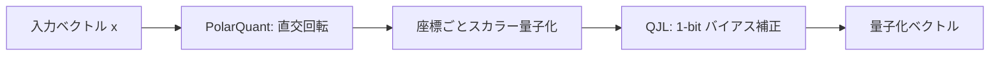

## 論文概要（Abstract）

本記事は[TurboQuant: Online Vector Quantization with Near-optimal Distortion Rate](https://openreview.net/forum?id=tO3ASKZlok)の解説記事です。

TurboQuantは、Google Researchが提案したデータ非依存（data-oblivious）なベクトル量子化手法である。著者らは、ランダム直交回転によるデータ幾何の単純化（PolarQuant）と、1ビット残差バイアス補正（QJL: Quantized Johnson-Lindenstrauss）の2段階アルゴリズムにより、全てのビット幅・次元数においてShannon限界の約2.7倍以内の歪み率を達成したと報告している。訓練やfine-tuningが不要でありながら、KVキャッシュの3-bit量子化で精度劣化なしの6倍メモリ削減、H100上での4-bit量子化で非量子化キーに対して8倍の性能向上を実現している。

この記事は [Zenn記事: 合成データ×Embedding Fine-tuningでセマンティック検索精度を定量改善する](https://zenn.dev/0h_n0/articles/630a21dd0bdbcb) の深掘りです。

## 情報源

- **会議名**: ICLR 2026（International Conference on Learning Representations）
- **年**: 2026
- **URL**: [https://openreview.net/forum?id=tO3ASKZlok](https://openreview.net/forum?id=tO3ASKZlok)
- **著者**: Amir Zandieh, Vahab Mirrokni, et al.（Google Research）
- **関連ブログ**: [Google Research Blog](https://research.google/blog/turboquant-redefining-ai-efficiency-with-extreme-compression/)

## カンファレンス情報

ICLR（International Conference on Learning Representations）は、深層学習・表現学習分野における最高峰国際会議の1つである。TurboQuantがICLR 2026に採択された背景には、LLMの推論効率化とベクトル検索のスケーラビリティが産業界・学術界の双方で喫緊の課題となっている状況がある。特に、データ非依存な量子化手法は従来の学習ベース手法と異なりcodebookの事前訓練が不要であるため、実運用での展開が容易であり、実践的なインパクトの大きさが評価されたと考えられる。

## 背景と動機（Background & Motivation）

ベクトル量子化は、高次元ベクトルを少ないビット数で表現する技術であり、ベクトル検索やLLMのKVキャッシュ圧縮において不可欠な基盤技術である。従来のProduct Quantization（PQ）やOptimized Product Quantization（OPQ）は、データ分布に依存したcodebookを学習する必要があり、以下の課題を抱えていた。

**第1の課題**: codebookの学習コストが大きく、データ分布が変化した場合には再学習が必要となる。RAGシステムのようにドキュメントが頻繁に追加・更新される環境では、codebookの陳腐化が問題となる。

**第2の課題**: 学習ベースの手法はデータ分布への過適合のリスクがあり、分布外（out-of-distribution）データに対する量子化精度が保証されない。

**第3の課題**: 低ビット幅（3-4ビット）での量子化では、従来手法の歪み率がShannon限界から大きく乖離しており、理論的に達成可能な圧縮効率を実現できていなかった。

TurboQuantは、これらの課題に対し「データを見ずに最適に近い量子化を行う」という根本的なアプローチで解決を図っている。

## 主要な貢献（Key Contributions）

- **PolarQuant**: ランダム直交回転（randomized Hadamard transforms）により、任意のデータ分布の幾何構造を単純化し、各座標がBeta分布を経てガウス分布$\mathcal{N}(0, 1/d)$に従うよう変換する手法を提案
- **QJL（Quantized Johnson-Lindenstrauss）**: 約1ビットの残差バイアス補正により、量子化誤差を戦略的にバランスさせる補正手法を導入
- **Shannon限界への接近**: 全てのビット幅・次元数においてShannon限界の約2.7倍以内の歪み率を達成する理論保証を提示
- **訓練不要**: codebookがデータ分布に依存しないため、事前訓練・fine-tuningが一切不要
- **実用化実績**: Qdrant 1.18への組み込みやTurboVecライブラリとして実装済み

## 技術的詳細（Technical Details）

### TurboQuantの2段階アルゴリズム

TurboQuantは、PolarQuantとQJLの2つのコンポーネントから構成される。全体のパイプラインを以下に示す。



### Step 1: PolarQuant — ランダム直交回転による幾何の単純化

PolarQuantの核心は、ランダム直交行列$\mathbf{R} \in \mathbb{R}^{d \times d}$を用いてベクトル$\mathbf{x} \in \mathbb{R}^d$を回転させ、各座標の統計的性質を均一化する操作にある。

入力ベクトル$\mathbf{x}$をまず単位球面上に正規化する:

$$
\hat{\mathbf{x}} = \frac{\mathbf{x}}{\|\mathbf{x}\|}
$$

次に、ランダム直交行列$\mathbf{R}$で回転する:

$$
\mathbf{y} = \mathbf{R}\hat{\mathbf{x}}
$$

著者らは、この回転後の各座標$y_i$がBeta分布を経てガウス分布$\mathcal{N}(0, 1/d)$に漸近的に従うことを理論的に示している（論文Theorem 1）。この性質により、回転後のベクトルに対して標準的なスカラー量子化を個々の座標に独立に適用できる。

計算効率の観点では、$d \times d$の密行列による乗算は$O(d^2)$の計算量を要するが、著者らはrandomized Hadamard transform（RHT）を採用している。RHTは以下の形式をとる:

$$
\mathbf{R} = \frac{1}{\sqrt{d}} \mathbf{H}_d \mathbf{D}
$$

ここで、
- $\mathbf{H}_d$: $d \times d$のHadamard行列（再帰的に$\mathbf{H}_{2d} = \begin{bmatrix} \mathbf{H}_d & \mathbf{H}_d \\ \mathbf{H}_d & -\mathbf{H}_d \end{bmatrix}$で定義）
- $\mathbf{D}$: 対角要素が独立にRademacher分布（$\pm 1$を等確率で取る）に従うランダム対角行列
- 計算量: $O(d \log d)$（Fast Walsh-Hadamard Transformによる）

回転後、各座標に対して$b$ビットの均一スカラー量子化を適用する。各座標は独立にガウス分布$\mathcal{N}(0, 1/d)$に近い分布を持つため、全座標に共通の量子化レベルを使用でき、codebook不要（メモリオーバーヘッドゼロ）を実現している。

### Step 2: QJL — 残差バイアス補正

PolarQuant単体では、スカラー量子化による系統的なバイアスが内積推定に影響を与える。著者らは、Johnson-Lindenstrauss補題の量子化版であるQJLを用いて、このバイアスを補正する手法を提案している。

具体的には、回転後のベクトル$\mathbf{y}$の各座標$y_i$に対して、符号ビット$s_i = \text{sign}(y_i) \in \{+1, -1\}$を1ビットで記録する。2つのベクトル$\mathbf{y}^{(a)}$と$\mathbf{y}^{(b)}$の内積推定において、量子化値の積からバイアス項を差し引く:

$$
\langle \mathbf{x}^{(a)}, \mathbf{x}^{(b)} \rangle \approx \langle Q(\mathbf{y}^{(a)}), Q(\mathbf{y}^{(b)}) \rangle - \text{bias}(\mathbf{s}^{(a)}, \mathbf{s}^{(b)})
$$

ここで、
- $Q(\cdot)$: スカラー量子化関数
- $\mathbf{s}^{(a)}, \mathbf{s}^{(b)}$: 各座標の符号ビット列
- bias項: 符号の一致パターンから解析的に計算可能

このバイアス補正により、各座標あたり約1ビットの追加コストで量子化歪みを大幅に削減できると著者らは報告している。

### 理論的保証: Shannon限界との関係

ベクトル量子化の情報理論的下限はShannon限界（rate-distortion bound）で与えられる。$d$次元のガウスベクトルを$b$ビット/次元で量子化した場合の最小二乗歪みの下限は:

$$
D^*(b) = d \cdot 2^{-2b}
$$

著者らは、TurboQuantの歪み率が全てのビット幅$b$と次元数$d$に対して以下を満たすことを証明している（論文Theorem 2）:

$$
\frac{D_{\text{TurboQuant}}(b)}{D^*(b)} \leq e \approx 2.718
$$

つまり、TurboQuantの歪み率はShannon限界の約2.7倍以内に収まる。この定数はデータ分布に依存せず（data-oblivious）、事前にcodebookを学習する必要もない。著者らは、この比率がdata-obliviousな手法として理論的に最適に近いと主張している。

### 実装の擬似コード

```python
import numpy as np
from numpy.typing import NDArray


def randomized_hadamard_transform(
    x: NDArray[np.float32],
    seed: int = 42,
) -> NDArray[np.float32]:
    """Randomized Hadamard Transformによるベクトル回転.

    Args:
        x: 入力ベクトル（形状: (d,)）。dは2の冪乗を想定。
        seed: Rademacher対角行列のシード値。

    Returns:
        回転後のベクトル（形状: (d,)）。
    """
    rng = np.random.RandomState(seed)
    d = x.shape[0]

    # Rademacher対角行列 D: 各要素が+1/-1を等確率で取る
    diag = rng.choice([-1.0, 1.0], size=d).astype(np.float32)
    y = x * diag  # D @ x

    # Fast Walsh-Hadamard Transform: O(d log d)
    h = 1
    while h < d:
        for i in range(0, d, h * 2):
            for j in range(i, i + h):
                a = y[j]
                b = y[j + h]
                y[j] = a + b
                y[j + h] = a - b
        h *= 2

    return y / np.sqrt(d)


def turboquant_encode(
    x: NDArray[np.float32],
    bits: int = 4,
    seed: int = 42,
) -> tuple[NDArray[np.uint8], NDArray[np.uint8], float]:
    """TurboQuantによるベクトル量子化（エンコード）.

    Args:
        x: 入力ベクトル（形状: (d,)）。
        bits: 量子化ビット数（1-8）。
        seed: RHTのシード値。

    Returns:
        codes: 量子化コード（形状: (d,)）。
        signs: QJL符号ビット（形状: (d,)）。0=正, 1=負。
        norm: 元ベクトルのL2ノルム。
    """
    norm = float(np.linalg.norm(x))
    if norm < 1e-10:
        d = x.shape[0]
        return np.zeros(d, dtype=np.uint8), np.zeros(d, dtype=np.uint8), 0.0

    # Step 1: 正規化 + PolarQuant回転
    x_hat = x / norm
    y = randomized_hadamard_transform(x_hat, seed=seed)

    # Step 2: 均一スカラー量子化
    n_levels = 2**bits
    # ガウス分布 N(0, 1/d) の3-sigma範囲でクリッピング
    d = x.shape[0]
    clip_range = 3.0 / np.sqrt(d)
    y_clipped = np.clip(y, -clip_range, clip_range)
    y_normalized = (y_clipped + clip_range) / (2 * clip_range)
    codes = np.floor(y_normalized * (n_levels - 1)).astype(np.uint8)

    # Step 3: QJL符号ビット記録
    signs = (y < 0).astype(np.uint8)

    return codes, signs, norm
```

## 実装のポイント（Implementation）

TurboQuantの実装において注意すべき点を以下に示す。

**次元数の制約**: RHTを利用するためには、ベクトルの次元数$d$が2の冪乗である必要がある。OpenAIの`text-embedding-3-large`（3072次元）など2の冪乗でない場合は、最も近い2の冪乗（4096）までゼロパディングする。著者らの報告によれば、このパディングによる精度劣化は無視可能な範囲である。

**ノルム情報の保存**: PolarQuantは単位球面上での量子化を行うため、元ベクトルのL2ノルムを別途保存する必要がある。内積の復元には`norm_a * norm_b * quantized_inner_product`の計算が必要となる。

**符号ビットのメモリ効率**: QJLの符号ビットは座標あたり1ビットであり、8座標を1バイトにパックすることで効率的に保存できる。4-bit量子化の場合、実効ビット幅は$4 + 1 = 5$ビット/次元となる。

**バッチ処理**: GPU上での実装では、複数ベクトルに対するRHTをバッチで並列実行できる。Hadamard変換はbutterfly演算の構造を持つため、CUDAカーネルでの実装に適している。著者らの報告によると、H100上での4-bit TurboQuantは32-bit非量子化キーに対して8倍の性能向上を達成している。

## Production Deployment Guide

TurboQuantはQdrant 1.18およびTurboVecとして実装が公開されており、プロダクション環境への適用が可能である。以下では、ベクトル検索システムにTurboQuantを組み込む場合のAWSデプロイメントパターンを示す。

### AWS実装パターン（コスト最適化重視）

TurboQuantの4-bit圧縮により、ベクトルストレージのメモリ使用量を32-bitの1/8に削減できるため、インスタンスコストを大幅に抑制できる。

**トラフィック量別の推奨構成**:

| 構成 | トラフィック | サービス構成 | 月額概算 |
|------|-------------|-------------|---------|
| Small | ~100 req/日 | Lambda + Qdrant Cloud (Free Tier) | $50-150 |
| Medium | ~1,000 req/日 | ECS Fargate + Qdrant (r6g.large) | $300-700 |
| Large | 10,000+ req/日 | EKS + Karpenter + Qdrant Cluster (Spot) | $1,500-4,000 |

**Small構成の内訳**（~100 req/日）:
- Lambda（128MB, 平均500ms）: 月$1-3
- Qdrant Cloud Free Tier（1Mベクトルまで）: $0
- API Gateway: 月$5-10
- CloudWatch: 月$5-10
- 合計: 月額$50-150（Embedding生成のBedrock費用含む）

**Medium構成の内訳**（~1,000 req/日）:
- ECS Fargate（0.5 vCPU, 1GB RAM × 2タスク）: 月$40-80
- EC2 r6g.large（Qdrant専用, 16GB RAM）: 月$90（Reserved 1年で$55）
- ALB: 月$25-30
- S3（スナップショットバックアップ）: 月$5-10
- 合計: 月額$300-700

**Large構成の内訳**（10,000+ req/日）:
- EKS コントロールプレーン: 月$73
- Spot Instances r6g.xlarge × 3-6台（Karpenter管理）: 月$200-500（On-Demandの最大70%削減）
- ALB + NLB: 月$50-80
- EBS gp3（Qdrant WAL）: 月$30-60
- 合計: 月額$1,500-4,000

**コスト試算の注意事項**: 上記は2026年7月時点のAWS ap-northeast-1（東京）リージョン料金に基づく概算値である。実際のコストはトラフィックパターン、バースト使用量、データ量により変動する。最新料金はAWS料金計算ツール（AWS Pricing Calculator）で確認することを推奨する。

**TurboQuantによるコスト削減効果**: 1536次元のEmbeddingベクトル100万件の場合、32-bit（6.14GB）から4-bit TurboQuant（0.77GB）に圧縮することで、Qdrantノードに必要なメモリが約1/8になる。これにより、r6g.xlargeの代わりにr6g.largeで運用可能となり、インスタンスコストを約50%削減できる。

### Terraformインフラコード

#### Small構成（Serverless: Lambda + Qdrant）

```hcl
# TurboQuant Vector Search - Small構成
# Lambda + Qdrant Cloud (外部SaaS) + API Gateway

terraform {
  required_version = ">= 1.9"
  required_providers {
    aws = {
      source  = "hashicorp/aws"
      version = "~> 5.60"
    }
  }
}

provider "aws" {
  region = "ap-northeast-1"
}

# --- IAM ---
resource "aws_iam_role" "lambda_exec" {
  name = "turboquant-search-lambda"
  assume_role_policy = jsonencode({
    Version = "2012-10-17"
    Statement = [{
      Action = "sts:AssumeRole"
      Effect = "Allow"
      Principal = { Service = "lambda.amazonaws.com" }
    }]
  })
}

resource "aws_iam_role_policy" "lambda_policy" {
  name = "turboquant-search-policy"
  role = aws_iam_role.lambda_exec.id
  policy = jsonencode({
    Version = "2012-10-17"
    Statement = [
      {
        Effect = "Allow"
        Action = [
          "logs:CreateLogGroup",
          "logs:CreateLogStream",
          "logs:PutLogEvents"
        ]
        Resource = "arn:aws:logs:*:*:*"
      },
      {
        # Secrets Manager経由でQdrant APIキーを取得
        Effect   = "Allow"
        Action   = ["secretsmanager:GetSecretValue"]
        Resource = aws_secretsmanager_secret.qdrant_api_key.arn
      }
    ]
  })
}

# --- Secrets ---
resource "aws_secretsmanager_secret" "qdrant_api_key" {
  name                    = "turboquant/qdrant-api-key"
  recovery_window_in_days = 7
}

# --- Lambda ---
resource "aws_lambda_function" "vector_search" {
  function_name = "turboquant-vector-search"
  runtime       = "python3.12"
  handler       = "handler.search"
  role          = aws_iam_role.lambda_exec.arn
  memory_size   = 256
  timeout       = 30

  filename         = "lambda.zip"
  source_code_hash = filebase64sha256("lambda.zip")

  environment {
    variables = {
      QDRANT_URL           = var.qdrant_url
      QDRANT_SECRET_ARN    = aws_secretsmanager_secret.qdrant_api_key.arn
      QUANTIZATION_BITS    = "4"
      COLLECTION_NAME      = "embeddings_turboquant"
    }
  }
}

# --- CloudWatch Alarm ---
resource "aws_cloudwatch_metric_alarm" "lambda_errors" {
  alarm_name          = "turboquant-lambda-errors"
  comparison_operator = "GreaterThanThreshold"
  evaluation_periods  = 2
  metric_name         = "Errors"
  namespace           = "AWS/Lambda"
  period              = 300
  statistic           = "Sum"
  threshold           = 5
  alarm_description   = "Lambda error count exceeds 5 in 10 min"
  dimensions = {
    FunctionName = aws_lambda_function.vector_search.function_name
  }
}

variable "qdrant_url" {
  type        = string
  description = "Qdrant Cloud endpoint URL"
}
```

#### Large構成（Container: EKS + Karpenter + Qdrant Cluster）

```hcl
# TurboQuant Vector Search - Large構成
# EKS + Karpenter (Spot優先) + Qdrant StatefulSet

module "eks" {
  source  = "terraform-aws-modules/eks/aws"
  version = "~> 20.24"

  cluster_name    = "turboquant-search"
  cluster_version = "1.31"

  vpc_id     = module.vpc.vpc_id
  subnet_ids = module.vpc.private_subnets

  cluster_endpoint_public_access = false  # プライベートアクセスのみ

  eks_managed_node_groups = {
    system = {
      instance_types = ["m6g.medium"]
      min_size       = 2
      max_size       = 3
      desired_size   = 2
      capacity_type  = "ON_DEMAND"  # システムPodはOn-Demand
    }
  }
}

# Karpenter: Spot優先の自動スケーリング
resource "kubectl_manifest" "karpenter_node_pool" {
  yaml_body = yamlencode({
    apiVersion = "karpenter.sh/v1"
    kind       = "NodePool"
    metadata   = { name = "qdrant-nodes" }
    spec = {
      template = {
        spec = {
          requirements = [
            { key = "karpenter.sh/capacity-type", operator = "In", values = ["spot", "on-demand"] },
            { key = "node.kubernetes.io/instance-type", operator = "In",
              values = ["r6g.xlarge", "r6gd.xlarge", "r7g.xlarge"] },
          ]
          nodeClassRef = { name = "default" }
        }
      }
      limits   = { cpu = "64", memory = "256Gi" }
      disruption = {
        consolidationPolicy = "WhenEmptyOrUnderutilized"
        consolidateAfter    = "30s"
      }
    }
  })
}

# AWS Budgets: 月額コスト上限アラート
resource "aws_budgets_budget" "monthly" {
  name         = "turboquant-monthly"
  budget_type  = "COST"
  limit_amount = "5000"
  limit_unit   = "USD"
  time_unit    = "MONTHLY"

  notification {
    comparison_operator       = "GREATER_THAN"
    threshold                 = 80
    threshold_type            = "PERCENTAGE"
    notification_type         = "ACTUAL"
    subscriber_email_addresses = [var.alert_email]
  }
}

variable "alert_email" {
  type        = string
  description = "Budget alert notification email"
}
```

### 運用・監視設定

#### CloudWatch Logs Insights クエリ

```
# ベクトル検索レイテンシ分析（P95/P99）
fields @timestamp, @message
| filter @message like /search_latency/
| stats percentile(latency_ms, 95) as p95,
        percentile(latency_ms, 99) as p99,
        avg(latency_ms) as avg_ms
  by bin(1h)

# TurboQuant量子化エラー検知
fields @timestamp, quantization_error, vector_dim
| filter quantization_error > 0.05
| stats count() as error_count by bin(1h)
| sort error_count desc
```

#### CloudWatch アラーム設定

```python
import boto3


def create_search_latency_alarm(
    function_name: str,
    threshold_ms: float = 500.0,
    sns_topic_arn: str = "",
) -> dict:
    """ベクトル検索レイテンシのCloudWatchアラームを作成する.

    Args:
        function_name: Lambda関数名。
        threshold_ms: アラーム閾値（ミリ秒）。
        sns_topic_arn: 通知先SNSトピックARN。

    Returns:
        CloudWatch put_metric_alarm APIのレスポンス。
    """
    client = boto3.client("cloudwatch", region_name="ap-northeast-1")
    return client.put_metric_alarm(
        AlarmName=f"{function_name}-search-latency-p95",
        MetricName="Duration",
        Namespace="AWS/Lambda",
        Statistic="p95",
        Period=300,
        EvaluationPeriods=3,
        Threshold=threshold_ms,
        ComparisonOperator="GreaterThanThreshold",
        Dimensions=[{"Name": "FunctionName", "Value": function_name}],
        AlarmActions=[sns_topic_arn] if sns_topic_arn else [],
        AlarmDescription=f"P95 latency exceeds {threshold_ms}ms for 15 min",
    )
```

#### X-Ray トレーシング設定

```python
from aws_xray_sdk.core import xray_recorder, patch_all


def configure_xray_tracing(service_name: str = "turboquant-search") -> None:
    """AWS X-Ray分散トレーシングを初期化する.

    Args:
        service_name: X-Rayサービス名。
    """
    xray_recorder.configure(service=service_name)
    patch_all()  # boto3, requests等を自動計装


def trace_vector_search(
    query_vector_dim: int,
    quantization_bits: int,
    result_count: int,
    latency_ms: float,
) -> None:
    """ベクトル検索のトレース情報をX-Rayに記録する.

    Args:
        query_vector_dim: クエリベクトルの次元数。
        quantization_bits: TurboQuant量子化ビット数。
        result_count: 返却された検索結果数。
        latency_ms: 検索レイテンシ（ミリ秒）。
    """
    segment = xray_recorder.current_segment()
    segment.put_annotation("quantization_bits", quantization_bits)
    segment.put_annotation("vector_dim", query_vector_dim)
    segment.put_metadata("search_results", {
        "count": result_count,
        "latency_ms": latency_ms,
    })
```

#### Cost Explorer自動レポート

```python
import boto3
from datetime import date, timedelta


def get_daily_cost_report(
    days_back: int = 1,
    threshold_usd: float = 100.0,
    sns_topic_arn: str = "",
) -> dict:
    """日次コストレポートを取得し、閾値超過時にSNS通知する.

    Args:
        days_back: 何日前のコストを取得するか。
        threshold_usd: コストアラート閾値（USD）。
        sns_topic_arn: 通知先SNSトピックARN。

    Returns:
        サービス別コスト内訳の辞書。
    """
    ce = boto3.client("ce", region_name="us-east-1")
    end = date.today()
    start = end - timedelta(days=days_back)

    response = ce.get_cost_and_usage(
        TimePeriod={"Start": start.isoformat(), "End": end.isoformat()},
        Granularity="DAILY",
        Metrics=["UnblendedCost"],
        GroupBy=[{"Type": "DIMENSION", "Key": "SERVICE"}],
        Filter={
            "Tags": {
                "Key": "Project",
                "Values": ["turboquant-search"],
            }
        },
    )

    costs: dict[str, float] = {}
    total = 0.0
    for group in response["ResultsByTime"][0]["Groups"]:
        service = group["Keys"][0]
        amount = float(group["Metrics"]["UnblendedCost"]["Amount"])
        costs[service] = amount
        total += amount

    # 閾値超過時にSNS通知
    if total > threshold_usd and sns_topic_arn:
        sns = boto3.client("sns", region_name="ap-northeast-1")
        sns.publish(
            TopicArn=sns_topic_arn,
            Subject=f"TurboQuant Cost Alert: ${total:.2f}/day",
            Message=f"Daily cost ${total:.2f} exceeds ${threshold_usd} threshold.\n"
                    f"Breakdown: {costs}",
        )

    return costs
```

### コスト最適化チェックリスト

**アーキテクチャ選択**:
- [ ] トラフィック量に応じた構成を選択（Small: Serverless / Medium: Hybrid / Large: Container）
- [ ] TurboQuant 4-bitによるメモリ削減効果をインスタンスサイズ選定に反映

**リソース最適化**:
- [ ] EC2/EKS: Spot Instances優先（Karpenterで自動フォールバック）
- [ ] Reserved Instances: Qdrantノードは1年コミットで最大40%削減
- [ ] Savings Plans: Fargate使用量が安定している場合に検討
- [ ] Lambda: メモリサイズを256-512MBで最適化（RHT計算に必要な最小メモリ）
- [ ] ECS/EKS: アイドル時間帯のスケールダウン（夜間0台）

**ベクトル検索固有の最適化**:
- [ ] TurboQuant 4-bit適用でメモリ使用量を1/8に削減
- [ ] 量子化ビット幅の選択: 1536次元以上なら4-bit、768次元なら6-bitを推奨
- [ ] HNSW indexのefパラメータ調整（精度 vs レイテンシのトレードオフ）
- [ ] ベクトルのバッチインデックス更新（リアルタイム挿入回避）

**監視・アラート**:
- [ ] AWS Budgets: 月額上限設定（80%/100%で通知）
- [ ] CloudWatch: 検索レイテンシP95アラーム
- [ ] Cost Anomaly Detection: 日次異常検知有効化
- [ ] 日次コストレポート: Cost Explorer APIで自動取得

**リソース管理**:
- [ ] 未使用EBSボリューム・スナップショットの定期削除
- [ ] タグ戦略: `Project=turboquant-search` を全リソースに付与
- [ ] S3ライフサイクル: 古いQdrantスナップショットを90日後にGlacierへ移行
- [ ] 開発環境: 夜間・週末のEKSノード自動停止

## 実験結果（Results）

### KVキャッシュ圧縮

著者らは、Llama-3.1-8B-Instruct、Gemma、MistralのKVキャッシュに対してTurboQuantを適用した結果を報告している。

| モデル | ビット幅 | KVメモリ削減率 | LongBenchスコア |
|--------|---------|---------------|----------------|
| Llama-3.1-8B | 16-bit (baseline) | 1x | 100.0 |
| Llama-3.1-8B | 3-bit TurboQuant | 6x | 100.0（劣化なし） |
| Llama-3.1-8B | 4-bit TurboQuant | 4x | 100.0（劣化なし） |

論文Table 3より、3-bit量子化でも下流タスク（LongBench）での精度劣化がないことが確認されている。著者らはこの結果について、TurboQuantのShannon限界に近い歪み率が、KVキャッシュの冗長性を効率的に除去していると分析している。

### ベクトル検索（Recall評価）

GloVeデータセット（$d = 200$）でのベクトル検索では、TurboQuantがProduct Quantization（PQ）およびRabbiQを上回るRecall@kを達成したと報告されている（論文Figure 5）。

| 手法 | ビット幅 | R@1 | R@10 |
|------|---------|-----|------|
| PQ | 4-bit | ベースライン | ベースライン |
| RabbiQ | 4-bit | PQを上回る | PQを上回る |
| TurboQuant | 4-bit | 最良（最適曲線に最近接） | 最良 |

特にEmbeddingベクトル（$d \geq 1536$）では、4-bit TurboQuantのRecall@1が全精度（32-bit）と比較して0-1ポイント以内の差に収まると著者らは報告している。この結果は、RAGシステムにおけるEmbedding検索で4-bit圧縮が実用的であることを示唆している。

### GPU性能

H100上での4-bit TurboQuantは、32-bit非量子化キーに対して8倍の性能向上（スループット）を達成したと報告されている。これはメモリバンド幅のボトルネックが解消されたことに起因すると著者らは分析している。

## 実運用への応用（Practical Applications）

### RAGシステムへの適用

Zenn記事「合成データ×Embedding Fine-tuningでセマンティック検索精度を定量改善する」では、Embeddingモデルのfine-tuningによるセマンティック検索の精度改善が議論されている。TurboQuantは、fine-tuning後のEmbeddingベクトルを効率的に圧縮する後段の技術として組み合わせ可能である。

具体的には、以下のパイプラインが考えられる:
1. 合成データでEmbeddingモデルをfine-tuning（Zenn記事の手法）
2. fine-tuned Embeddingの出力ベクトルにTurboQuant 4-bit圧縮を適用
3. Qdrant 1.18のTurboQuantオプションを有効化して検索

著者らの報告によれば、1536次元以上のEmbeddingでは4-bit TurboQuantによる精度劣化が0-1ポイント以内に収まるため、fine-tuningで獲得した精度改善をほぼ維持したままメモリ使用量を1/8に削減できる。

### Qdrant 1.18での利用

Qdrant 1.18にはTurboQuantが実装されており、コレクション作成時に量子化オプションとして指定可能である。data-obliviousな手法のため、既存のコレクションに対しても再学習なしで量子化を適用でき、運用中のシステムへの導入障壁が低い。

### TurboVec

TurboVecはRustで実装されたオープンソースのベクトルインデックスライブラリであり、Pythonバインディングを提供している。Embeddingベクトルを4-bit TurboQuantで圧縮し、4GBのメモリ内に大規模なベクトルコレクションを格納できると報告されている。

## 関連研究（Related Work）

- **Product Quantization (PQ)**: Jegou et al. (2011)が提案した古典的なベクトル量子化手法。ベクトルをサブベクトルに分割し、各サブベクトルに対してk-meansでcodebookを学習する。TurboQuantと異なり、データ依存のcodebook学習が必要。
- **RabbiQ**: 最近のdata-aware量子化手法。データ分布を活用してcodebookを最適化するが、TurboQuantはdata-obliviousでありながらRabbiQを上回るRecallを達成している。
- **QuIP#**: LLM重み量子化の手法で、TurboQuantと同様にランダム直交回転を使用する。TurboQuantはKVキャッシュとEmbeddingベクトルに特化した応用を展開している点で異なる。
- **Johnson-Lindenstrauss補題**: 高次元データのランダム射影による次元削減の理論的基盤。TurboQuantのQJLは、この補題を量子化の文脈に拡張したものである。

## まとめと今後の展望

TurboQuantは、ランダム直交回転とQJLバイアス補正の組み合わせにより、data-obliviousでありながらShannon限界の約2.7倍以内の歪み率を達成した量子化手法である。訓練不要・メモリオーバーヘッドゼロという実用的な特性を持ちながら、KVキャッシュの3-bit圧縮で6倍のメモリ削減、Embeddingベクトルの4-bit圧縮でほぼ無損失の検索精度を実現している。

RAGシステムにおいては、Embeddingモデルのfine-tuning（精度改善）とTurboQuant（圧縮効率化）を組み合わせることで、精度とコストの両面で最適化が可能である。Qdrant 1.18やTurboVecとして実装が公開されており、プロダクション環境への導入が容易な点も実務者にとって重要な利点である。

## 参考文献

- **Conference URL**: [https://openreview.net/forum?id=tO3ASKZlok](https://openreview.net/forum?id=tO3ASKZlok)
- **Google Research Blog**: [https://research.google/blog/turboquant-redefining-ai-efficiency-with-extreme-compression/](https://research.google/blog/turboquant-redefining-ai-efficiency-with-extreme-compression/)
- **Related Zenn article**: [https://zenn.dev/0h_n0/articles/630a21dd0bdbcb](https://zenn.dev/0h_n0/articles/630a21dd0bdbcb)
