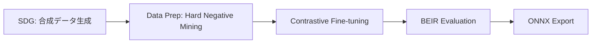

本記事は [Fine-Tuning Embedding Models for Enterprise Retrieval: A Practical Guide with NVIDIA Nemotron Recipe](https://blogs.cisco.com/ai/fine-tuning-embedding-models-for-enterprise-retrieval-a-practical-guide-with-nvidia-nemotron-recipe) の解説記事です。

## ブログ概要（Summary）

Ciscoのエンジニアリングチーム（Md Rahman, Arkaprabho Ghosh, Navin Bilwar, Desh Shukla）は、エンタープライズ環境における情報検索の精度向上を目的として、NVIDIA Nemotron Embeddingモデルの Fine-tuning パイプラインを構築した事例を2026年3月に公開した。著者らは、オンプレミスの120Bパラメータ LLM を用いて合成データを生成し、1Bパラメータの Embedding モデル（NV-EmbedQA）を Contrastive Learning で Fine-tuning することで、NDCG@1 が +7.1 〜 +7.3 ポイント（相対 +9.9% 〜 +11.1%）改善したと報告している。パイプライン全体は単一の NVIDIA H200 GPU（143GB）上で 2-5 時間で完了し、外部 API コストはゼロである。

この記事は [Zenn記事: 合成データ×Embedding Fine-tuningでセマンティック検索精度を定量改善する](https://zenn.dev/0h_n0/articles/630a21dd0bdbcb) の深掘りです。

## 情報源

- **種別**: 企業テックブログ
- **URL**: [https://blogs.cisco.com/ai/fine-tuning-embedding-models-for-enterprise-retrieval-a-practical-guide-with-nvidia-nemotron-recipe](https://blogs.cisco.com/ai/fine-tuning-embedding-models-for-enterprise-retrieval-a-practical-guide-with-nvidia-nemotron-recipe)
- **組織**: Cisco（AI / ML Engineering）
- **著者**: Md Rahman, Arkaprabho Ghosh, Navin Bilwar, Desh Shukla
- **発表日**: 2026年3月24日

## 技術的背景（Technical Background）

エンタープライズ環境では、社内ドキュメント・ナレッジベース・技術仕様書などのドメイン固有コーパスに対する情報検索が求められる。汎用的な Embedding モデルはオープンドメインのベンチマークでは高い性能を示すが、企業固有の用語（バグID、製品識別子、ファームウェアバージョン等）を含むクエリでは精度が低下する。著者らは、従来のキーワード検索が依然として必要とされるケースが残っていたと報告している。

従来の Fine-tuning アプローチでは、ハイパーパラメータの手動調整に数週間から数か月の反復サイクルを要し、安定した改善を得ることが困難だった。この問題に対して、NVIDIA が提供する NeMo Retriever の Embed Fine-tune Recipe は、合成データ生成（SDG）からモデルの ONNX エクスポートまでを一貫したパイプラインとして提供しており、反復サイクルを大幅に短縮できる。

学術的には、Contrastive Learning による Embedding の Fine-tuning は多数の研究で有効性が示されており、特に合成データを用いた手法は人手のラベリングコストを排除できる点で注目されている。Cisco のブログは、これらの研究知見をエンタープライズ規模で実践した事例として位置づけられる。

## 実装アーキテクチャ（Architecture）

### パイプライン全体像

著者らは 5 段階のパイプラインを構築している。各ステージは独立したモジュールとして設計されており、個別の修正・拡張が可能な構成となっている。



### Stage 1: 合成データ生成（SDG）

オンプレミスに配置された 120B パラメータの LLM を使用して、企業固有コーパスから質問-回答ペアを自動生成する。著者らは約 925 文書から約 9,200 の QA ペアを生成し、そこから約 7,800 のトレーニング例を抽出したと報告している。外部 API を一切使用しないため、機密性の高い企業データがオンプレミスから外部に出ることはない。

### Stage 2: データ準備と Hard Negative Mining

生成された QA ペアに対して、Hard Negative Mining を適用する。Hard Negative とは、クエリに対して「意味的に類似しているが正解ではない」文書のことで、モデルが微妙な差異を学習するために不可欠な訓練信号である。著者らは初期設定で 1 クエリあたり 5 個の Hard Negative を使用し、今後 10 個への増加を計画していると述べている。

Hard Negative Mining の数式的な意味は以下の通りである。クエリ $q$ に対して、正例文書 $d^+$ と Hard Negative 文書集合 $\{d^-_1, d^-_2, \ldots, d^-_k\}$ を構成する。ここで $k$ は Hard Negative の数（著者らの設定では $k=5$）である。

$$
d^-_j = \arg\max_{d \in \mathcal{D} \setminus \{d^+\}} \text{sim}(f(q), f(d))
$$

ここで、
- $\mathcal{D}$: 文書コーパス全体
- $f(\cdot)$: ベースモデルの Embedding 関数
- $\text{sim}(\cdot, \cdot)$: コサイン類似度

すなわち、ベースモデルが「正解に近い」と誤判定する文書を上位から $k$ 個選択する。

### Stage 3: Contrastive Fine-tuning

InfoNCE（Noise Contrastive Estimation）ベースの損失関数を用いた Contrastive Learning で Embedding モデルを Fine-tuning する。損失関数は以下の形式となる。

$$
\mathcal{L} = -\log \frac{\exp(\text{sim}(f(q), f(d^+)) / \tau)}{\exp(\text{sim}(f(q), f(d^+)) / \tau) + \sum_{j=1}^{k} \exp(\text{sim}(f(q), f(d^-_j)) / \tau)}
$$

ここで、
- $\tau$: 温度パラメータ（スケーリング係数）
- $f(q)$: クエリの Embedding ベクトル
- $f(d^+)$: 正例文書の Embedding ベクトル
- $f(d^-_j)$: $j$ 番目の Hard Negative 文書の Embedding ベクトル

この損失関数は、正例ペアの類似度を最大化し、Hard Negative ペアの類似度を最小化する方向にモデルパラメータを更新する。

著者らは初期実験でエポック数 3 を使用し、学習率はデフォルト値を採用したと報告している。今後の計画として、エポック数 5 への増加、学習率のハーフ・ダブルテスト、10% ウォームアップ付きコサイン減衰スケジュールの導入を挙げている。

### Stage 4: BEIR 評価

BEIR（Benchmarking Information Retrieval）フレームワークを用いて、Fine-tuning 前後のモデル性能を定量評価する。BEIR は標準化された評価プロトコルを提供し、異なるデータセット間での公平な比較を可能にする。

### Stage 5: ONNX エクスポート

Fine-tuning 済みモデルを ONNX 形式でエクスポートし、本番環境へのデプロイを容易にする。ONNX 形式は推論エンジン（NVIDIA TensorRT、ONNX Runtime 等）との互換性が高く、推論速度の最適化に寄与する。

### 使用モデルとインフラ

| 項目 | 詳細 |
|------|------|
| Embedding モデル | NVIDIA Llama Nemotron Embed 1B（NV-EmbedQA） |
| SDG 用 LLM | 120B パラメータモデル（オンプレミス） |
| GPU | NVIDIA H200（143GB VRAM） |
| サーバー | Cisco UCS 885A |
| フレームワーク | NVIDIA NeMo Retriever |

### スケーリング戦略

著者らのアーキテクチャは単一 GPU 上で動作するが、以下の観点でスケーリングが考慮されている。

- **データスケーリング**: 334 文書 → 925 文書の 2 パターンで実験し、性能改善が安定していることを確認。今後 100K QA ペアへの拡大を計画
- **コスト効率**: 外部 API コストゼロ、パイプライン全体 2-5 時間で完了
- **再現性**: モジュール式パイプラインにより、各ステージを独立して改善可能

## パフォーマンス最適化（Performance）

### 評価指標と結果

著者らは BEIR フレームワークを用いて、ベースモデルと Fine-tuning 済みモデルの性能を比較している。以下に主要な評価指標の改善幅を示す。

| 評価指標 | 絶対改善幅 | 相対改善率 |
|----------|-----------|-----------|
| NDCG@1 | +7.1 〜 +7.3 pt | +9.9% 〜 +11.1% |
| Recall@10 | 最大 +6.8 pt | +8.5% |
| MAP@10 | 最大 +6.5 pt | +9.7% |

これらの数値はブログの Table 1 に基づく。著者らは、334 文書と 925 文書の両方のデータセットサイズにおいて改善が安定していたと報告している。

### 評価指標の解説

**NDCG@k（Normalized Discounted Cumulative Gain）** は、検索結果の上位 $k$ 件における順位を考慮した指標である。

$$
\text{NDCG@k} = \frac{\text{DCG@k}}{\text{IDCG@k}}, \quad \text{DCG@k} = \sum_{i=1}^{k} \frac{2^{rel_i} - 1}{\log_2(i + 1)}
$$

ここで、$rel_i$ は位置 $i$ の文書の関連度スコア、IDCG@k は理想的な並び順での DCG@k である。NDCG@1 は最上位の結果が正解かどうかを直接反映するため、ユーザー体験に直結する指標である。

**Recall@k** は、正解文書のうち上位 $k$ 件に含まれる割合を表す。

$$
\text{Recall@k} = \frac{|\text{relevant documents in top-k}|}{|\text{total relevant documents}|}
$$

**MAP@k（Mean Average Precision）** は、各クエリの Average Precision を全クエリで平均した指標で、検索結果の順序と網羅性の両方を評価する。

### パフォーマンス分析

著者らが報告した結果について、注目すべき点が3つある。

第一に、改善がデータセットサイズに依存しない安定性を示した点である。334 文書と 925 文書の両方で NDCG@1 が +7.1 〜 +7.3 ポイント改善しており、データ量を増やしても改善幅が維持されている。

第二に、改善がレアトークン識別子クエリ（バグ ID、製品コード等）にも汎化した点である。汎用 Embedding モデルが苦手とするドメイン固有のクエリタイプでも精度向上が確認されたことは、エンタープライズ利用における実用性を裏付ける。

第三に、著者ら自身がこの結果を「初期ベースラインであり、完全に最適化された成果ではない」と位置づけている点である。エポック数の増加、学習率の調整、Hard Negative 数の増加、SDG データの拡大など、複数の改善余地が明示されている。

### チューニング計画

著者らは今後の最適化として以下を計画していると述べている。

- エポック数: 3 → 5
- Hard Negative 数: 5 → 10 個/クエリ
- 学習率: デフォルト値のハーフ・ダブルをテスト
- ウォームアップ: 10% ウォームアップ + コサイン減衰
- SDG データ: 約 100K QA ペアへ拡大
- SDG 品質: より高品質な LLM の使用
- プロンプト改善: ドメイン固有用語（バグ ID、ファームウェアバージョン等）への対応

## 運用での学び（Production Lessons）

### 従来アプローチの課題

著者らは、Nemotron Recipe 導入以前の Fine-tuning において、以下の課題に直面していたと報告している。

- **長い反復サイクル**: ハイパーパラメータの手動調整に数週間から数か月を要した
- **安定性の欠如**: 学習率やバッチサイズの変更で性能が不安定に変動
- **評価の一貫性**: 実験間で評価セットが統一されておらず、比較が困難

### Nemotron Recipe による改善

モジュール式パイプラインの導入により、以下の運用上の改善が得られた。

- **高速な反復**: パイプライン全体が 2-5 時間で完了し、1 日に複数回の実験が可能
- **データプライバシー**: 全処理がオンプレミスで完結するため、機密性の高い企業データの外部送信が不要
- **再現性**: 5 段階のパイプラインが自動化されており、実験の再現が容易

### 合成データによるラベリングコスト排除

従来の Embedding Fine-tuning では、ドメイン専門家による QA ペアの手動作成が必要であり、これがボトルネックとなっていた。著者らは 120B パラメータ LLM による合成データ生成で約 9,200 QA ペアを自動生成し、手動ラベリングのコストを完全に排除した。この結果、外部 API コストもゼロとなっている。

## Production Deployment Guide

以下は、Cisco のブログで紹介されている Embedding Fine-tuning パイプラインを AWS 上でデプロイする場合の構成例である。

### AWS 実装パターン（コスト最適化重視）

**トラフィック量別の推奨構成**:

| 構成 | トラフィック | サービス構成 | 月額概算 |
|------|-------------|-------------|---------|
| Small | ~100 req/日 | Lambda + S3 + OpenSearch Serverless | $80-180 |
| Medium | ~1,000 req/日 | ECS Fargate + OpenSearch + ElastiCache | $400-900 |
| Large | 10,000+ req/日 | EKS + Spot GPU Instances + OpenSearch | $2,500-5,500 |

**Small 構成（~100 req/日）**:
- AWS Lambda（ARM64, 1024MB）: Embedding 推論（ONNX Runtime）
- S3: Fine-tuning 済みモデルファイル格納
- OpenSearch Serverless: ベクトルインデックス
- CloudWatch: モニタリング
- 月額概算: $80-180（2026年7月時点、ap-northeast-1 リージョン）

**Medium 構成（~1,000 req/日）**:
- ECS Fargate（2 vCPU, 8GB RAM x 2 タスク）: 推論サービス
- OpenSearch（r6g.large.search x 2 ノード）: ベクトル検索
- ElastiCache（cache.t4g.micro）: クエリキャッシュ
- ALB: ロードバランシング
- 月額概算: $400-900（2026年7月時点、ap-northeast-1 リージョン）

**Large 構成（10,000+ req/日）**:
- EKS + Karpenter: コンテナオーケストレーション
- g5.xlarge Spot Instances: GPU 推論（最大 90% 削減）
- OpenSearch（r6g.xlarge.search x 3 ノード）: 分散ベクトル検索
- ElastiCache Cluster: 分散キャッシュ
- 月額概算: $2,500-5,500（2026年7月時点、ap-northeast-1 リージョン）

**コスト試算の注意事項**: 上記は 2026年7月時点の AWS ap-northeast-1（東京）リージョン料金に基づく概算値である。実際のコストはトラフィックパターン、リージョン、バースト使用量により変動する。最新料金は [AWS Pricing Calculator](https://calculator.aws/) で確認を推奨する。

**コスト削減テクニック**:
- Spot Instances 活用: GPU 推論ワーカーを Spot で実行し最大 90% 削減
- Reserved Instances: OpenSearch の 1 年予約で最大 40% 削減
- ONNX Runtime 最適化: Fine-tuning 済みモデルの ONNX エクスポートにより CPU 推論でも高速化
- クエリキャッシュ: 同一クエリの Embedding 計算を ElastiCache でキャッシュし推論コスト削減

### Terraform インフラコード

**Small 構成（Serverless）**:

```hcl
# Small構成: Lambda + S3 + OpenSearch Serverless
# 月額概算: $80-180 (ap-northeast-1, 2026年7月時点)

terraform {
  required_version = ">= 1.9"
  required_providers {
    aws = {
      source  = "hashicorp/aws"
      version = "~> 5.60"
    }
  }
}

provider "aws" {
  region = "ap-northeast-1"
}

# --- S3: モデルファイル格納 ---
resource "aws_s3_bucket" "model_store" {
  bucket = "embedding-model-store-${var.environment}"

  tags = {
    Project     = "embedding-finetune"
    Environment = var.environment
    CostCenter  = "ml-inference"
  }
}

resource "aws_s3_bucket_server_side_encryption_configuration" "model_store" {
  bucket = aws_s3_bucket.model_store.id
  rule {
    apply_server_side_encryption_by_default {
      sse_algorithm = "aws:kms"
    }
  }
}

# --- IAM: Lambda 実行ロール（最小権限） ---
resource "aws_iam_role" "lambda_inference" {
  name = "embedding-inference-lambda-${var.environment}"
  assume_role_policy = jsonencode({
    Version = "2012-10-17"
    Statement = [{
      Action = "sts:AssumeRole"
      Effect = "Allow"
      Principal = { Service = "lambda.amazonaws.com" }
    }]
  })
}

resource "aws_iam_role_policy" "lambda_inference" {
  name = "embedding-inference-policy"
  role = aws_iam_role.lambda_inference.id
  policy = jsonencode({
    Version = "2012-10-17"
    Statement = [
      {
        Effect   = "Allow"
        Action   = ["s3:GetObject"]
        Resource = "${aws_s3_bucket.model_store.arn}/*"
      },
      {
        Effect   = "Allow"
        Action   = ["logs:CreateLogGroup", "logs:CreateLogStream", "logs:PutLogEvents"]
        Resource = "arn:aws:logs:*:*:*"
      }
    ]
  })
}

# --- Lambda: ONNX 推論 ---
resource "aws_lambda_function" "embedding_inference" {
  function_name = "embedding-inference-${var.environment}"
  role          = aws_iam_role.lambda_inference.arn
  handler       = "handler.lambda_handler"
  runtime       = "python3.12"
  architectures = ["arm64"]
  memory_size   = 1024
  timeout       = 30

  environment {
    variables = {
      MODEL_BUCKET = aws_s3_bucket.model_store.id
      MODEL_KEY    = "models/nv-embedqa-finetuned.onnx"
    }
  }

  tags = {
    Project    = "embedding-finetune"
    CostCenter = "ml-inference"
  }
}

# --- CloudWatch アラーム ---
resource "aws_cloudwatch_metric_alarm" "lambda_errors" {
  alarm_name          = "embedding-lambda-errors-${var.environment}"
  comparison_operator = "GreaterThanThreshold"
  evaluation_periods  = 2
  metric_name         = "Errors"
  namespace           = "AWS/Lambda"
  period              = 300
  statistic           = "Sum"
  threshold           = 5
  alarm_description   = "Lambda inference error rate exceeded threshold"

  dimensions = {
    FunctionName = aws_lambda_function.embedding_inference.function_name
  }
}

variable "environment" {
  type    = string
  default = "dev"
}
```

**Large 構成（Container）**:

```hcl
# Large構成: EKS + Karpenter + Spot GPU Instances
# 月額概算: $2,500-5,500 (ap-northeast-1, 2026年7月時点)

module "eks" {
  source  = "terraform-aws-modules/eks/aws"
  version = "~> 20.24"

  cluster_name    = "embedding-inference-${var.environment}"
  cluster_version = "1.31"

  vpc_id     = var.vpc_id
  subnet_ids = var.private_subnet_ids

  cluster_endpoint_public_access = false

  eks_managed_node_groups = {
    system = {
      instance_types = ["m7g.large"]
      min_size       = 2
      max_size       = 3
      desired_size   = 2
      capacity_type  = "ON_DEMAND"

      labels = { role = "system" }
    }
  }

  tags = {
    Project    = "embedding-finetune"
    CostCenter = "ml-inference"
  }
}

# --- Karpenter: Spot GPU 優先スケーリング ---
resource "kubectl_manifest" "karpenter_nodepool" {
  yaml_body = yamlencode({
    apiVersion = "karpenter.sh/v1"
    kind       = "NodePool"
    metadata   = { name = "gpu-inference" }
    spec = {
      template = {
        spec = {
          requirements = [
            { key = "karpenter.sh/capacity-type", operator = "In", values = ["spot", "on-demand"] },
            { key = "node.kubernetes.io/instance-type", operator = "In", values = ["g5.xlarge", "g5.2xlarge"] },
          ]
          nodeClassRef = { name = "default" }
        }
      }
      limits   = { cpu = "64", "nvidia.com/gpu" = "8" }
      disruption = {
        consolidationPolicy = "WhenEmptyOrUnderutilized"
        consolidateAfter    = "30s"
      }
    }
  })
}

# --- Secrets Manager: 設定管理 ---
resource "aws_secretsmanager_secret" "model_config" {
  name        = "embedding-model-config-${var.environment}"
  description = "Embedding model configuration"
  kms_key_id  = var.kms_key_id
}

# --- AWS Budgets: コストアラート ---
resource "aws_budgets_budget" "monthly" {
  name         = "embedding-inference-monthly"
  budget_type  = "COST"
  limit_amount = "5500"
  limit_unit   = "USD"
  time_unit    = "MONTHLY"

  notification {
    comparison_operator       = "GREATER_THAN"
    threshold                 = 80
    threshold_type            = "PERCENTAGE"
    notification_type         = "ACTUAL"
    subscriber_email_addresses = [var.alert_email]
  }
}

variable "environment" {
  type    = string
  default = "prod"
}

variable "vpc_id" { type = string }
variable "private_subnet_ids" { type = list(string) }
variable "kms_key_id" { type = string }
variable "alert_email" { type = string }
```

### 運用・監視設定

**CloudWatch Logs Insights クエリ（推論レイテンシ分析）**:

```
fields @timestamp, @message
| filter @message like /inference_latency/
| stats avg(latency_ms) as avg_latency,
        pct(latency_ms, 95) as p95_latency,
        pct(latency_ms, 99) as p99_latency,
        count(*) as request_count
  by bin(1h)
| sort @timestamp desc
```

**CloudWatch アラーム設定（Python）**:

```python
import boto3

def create_inference_alarms(function_name: str, sns_topic_arn: str) -> list[str]:
    """Embedding推論Lambda用のCloudWatchアラームを作成する。

    Args:
        function_name: 監視対象のLambda関数名
        sns_topic_arn: 通知先のSNSトピックARN

    Returns:
        作成されたアラームのARNリスト
    """
    client = boto3.client("cloudwatch", region_name="ap-northeast-1")
    alarm_arns: list[str] = []

    # レイテンシアラーム（P95 > 5秒）
    client.put_metric_alarm(
        AlarmName=f"{function_name}-high-latency",
        MetricName="Duration",
        Namespace="AWS/Lambda",
        Statistic="p95",
        Period=300,
        EvaluationPeriods=2,
        Threshold=5000,
        ComparisonOperator="GreaterThanThreshold",
        Dimensions=[{"Name": "FunctionName", "Value": function_name}],
        AlarmActions=[sns_topic_arn],
    )
    alarm_arns.append(f"{function_name}-high-latency")

    # エラーレートアラーム
    client.put_metric_alarm(
        AlarmName=f"{function_name}-error-rate",
        MetricName="Errors",
        Namespace="AWS/Lambda",
        Statistic="Sum",
        Period=300,
        EvaluationPeriods=2,
        Threshold=10,
        ComparisonOperator="GreaterThanThreshold",
        Dimensions=[{"Name": "FunctionName", "Value": function_name}],
        AlarmActions=[sns_topic_arn],
    )
    alarm_arns.append(f"{function_name}-error-rate")

    return alarm_arns
```

**X-Ray トレーシング設定（Python）**:

```python
from aws_xray_sdk.core import xray_recorder, patch_all
from aws_xray_sdk.core.models.subsegment import Subsegment

# boto3 自動計装
patch_all()

def trace_embedding_inference(query: str, model_path: str) -> dict:
    """Embedding推論をX-Rayトレーシング付きで実行する。

    Args:
        query: 検索クエリ文字列
        model_path: ONNXモデルのS3パス

    Returns:
        推論結果とメタデータを含む辞書
    """
    subsegment: Subsegment = xray_recorder.begin_subsegment("embedding_inference")
    subsegment.put_annotation("model_format", "onnx")
    subsegment.put_metadata("query_length", len(query))
    subsegment.put_metadata("model_path", model_path)

    try:
        # 推論処理（実装は環境に依存）
        result = {"embedding": [], "latency_ms": 0}
        subsegment.put_annotation("status", "success")
        return result
    except Exception as e:
        subsegment.put_annotation("status", "error")
        subsegment.put_metadata("error_type", type(e).__name__)
        raise
    finally:
        xray_recorder.end_subsegment()
```

**Cost Explorer 日次レポート（Python）**:

```python
import boto3
from datetime import datetime, timedelta

def get_daily_embedding_cost(sns_topic_arn: str, threshold_usd: float = 100.0) -> dict:
    """Embedding推論関連の日次コストを取得し、閾値超過時にSNS通知する。

    Args:
        sns_topic_arn: 通知先のSNSトピックARN
        threshold_usd: コスト閾値（USD）

    Returns:
        サービス別コスト内訳の辞書
    """
    ce = boto3.client("ce", region_name="us-east-1")
    sns = boto3.client("sns", region_name="ap-northeast-1")

    end = datetime.utcnow().strftime("%Y-%m-%d")
    start = (datetime.utcnow() - timedelta(days=1)).strftime("%Y-%m-%d")

    response = ce.get_cost_and_usage(
        TimePeriod={"Start": start, "End": end},
        Granularity="DAILY",
        Metrics=["UnblendedCost"],
        Filter={
            "Tags": {
                "Key": "Project",
                "Values": ["embedding-finetune"],
            }
        },
        GroupBy=[{"Type": "DIMENSION", "Key": "SERVICE"}],
    )

    costs: dict[str, float] = {}
    total = 0.0
    for group in response["ResultsByTime"][0]["Groups"]:
        service = group["Keys"][0]
        amount = float(group["Metrics"]["UnblendedCost"]["Amount"])
        costs[service] = amount
        total += amount

    if total > threshold_usd:
        sns.publish(
            TopicArn=sns_topic_arn,
            Subject=f"Embedding Cost Alert: ${total:.2f}/day",
            Message=f"Daily cost ${total:.2f} exceeded ${threshold_usd} threshold.\n{costs}",
        )

    return costs
```

### コスト最適化チェックリスト

**アーキテクチャ選択**:
- [ ] トラフィック量に応じた構成を選択（~100 req/日: Serverless、~1,000 req/日: Hybrid、10,000+ req/日: Container）
- [ ] ONNX Runtime による CPU 推論が許容レイテンシ内か検証（GPU 不要な場合はコスト大幅削減）

**リソース最適化**:
- [ ] GPU 推論ワーカーに Spot Instances を使用（最大 90% 削減）
- [ ] OpenSearch の Reserved Instances を 1 年コミットで購入（最大 40% 削減）
- [ ] Savings Plans の適用を検討
- [ ] Lambda メモリサイズを 1024MB から Power Tuning で最適化
- [ ] ECS/EKS のアイドル時スケールダウンポリシーを設定
- [ ] Karpenter の consolidation を有効化し未使用ノードを自動削除

**Embedding 推論コスト削減**:
- [ ] クエリ Embedding をキャッシュ（ElastiCache）し重複計算を排除
- [ ] バッチ推論対応（複数クエリを1回の推論でまとめて処理）
- [ ] ONNX モデルの量子化（INT8）で推論速度向上・メモリ削減
- [ ] モデルサイズに応じた適切なインスタンスタイプ選択（1B パラメータ ONNX は CPU 推論でも高速）

**監視・アラート**:
- [ ] AWS Budgets で月額上限アラート設定（80% / 100% 閾値）
- [ ] CloudWatch アラームでレイテンシ・エラーレート監視
- [ ] Cost Anomaly Detection 有効化
- [ ] 日次コストレポートの自動配信設定
- [ ] X-Ray トレーシングで推論ボトルネック特定

**リソース管理**:
- [ ] 未使用の Embedding モデルバージョンを S3 から削除
- [ ] タグ戦略の統一（Project, CostCenter, Environment）
- [ ] S3 ライフサイクルポリシーで古いモデルファイルを Glacier 移行
- [ ] 開発環境の夜間・週末自動停止

## 学術研究との関連（Academic Connection）

Cisco のブログで採用されている技術は、以下の学術研究に基づいている。

- **Contrastive Learning for Embeddings**: Karpukhin et al. (2020) の DPR（Dense Passage Retrieval）に代表される、クエリと文書の Embedding を対照学習で最適化する手法が基盤となっている
- **Synthetic Data Generation for IR**: Bonifacio et al. (2022) の InPars に代表される、LLM を用いた合成クエリ生成により、手動ラベリングなしで検索モデルを改善する手法が適用されている
- **Hard Negative Mining**: Xiong et al. (2020) の ANCE で提案された、モデル自身の予測に基づく Hard Negative の動的選択が、Nemotron Recipe のパイプラインに組み込まれている

著者らのアプローチは、これらの研究知見をエンタープライズ規模で統合し、単一パイプラインとして自動化した実践例である。

## まとめと実践への示唆

Cisco のブログは、エンタープライズ環境における Embedding モデル Fine-tuning の実践的なガイドとして、以下の示唆を提供している。

第一に、合成データ生成による手動ラベリングの完全排除が、エンタープライズ規模でも有効であることが示された。925 文書から約 9,200 QA ペアを自動生成し、NDCG@1 で +7.1 〜 +7.3 ポイントの改善を達成している。

第二に、モジュール式パイプラインの採用により、従来数週間から数か月を要していた反復サイクルが 2-5 時間に短縮された。各ステージが独立しているため、データ拡大やハイパーパラメータ調整を個別に実施できる。

第三に、オンプレミスでの完結が企業のデータプライバシー要件を満たしつつ、外部 API コストゼロという経済的メリットをもたらしている。

著者ら自身が述べている通り、この結果は初期ベースラインであり、エポック数の増加、Hard Negative 数の拡大、SDG データの拡充により更なる改善が期待される。

## 参考文献

- **Blog URL**: [https://blogs.cisco.com/ai/fine-tuning-embedding-models-for-enterprise-retrieval-a-practical-guide-with-nvidia-nemotron-recipe](https://blogs.cisco.com/ai/fine-tuning-embedding-models-for-enterprise-retrieval-a-practical-guide-with-nvidia-nemotron-recipe)
- **NVIDIA NeMo Retriever**: [https://github.com/NVIDIA-NeMo/Nemotron](https://github.com/NVIDIA-NeMo/Nemotron)（embed-finetune-recipe）
- **Related Zenn article**: [https://zenn.dev/0h_n0/articles/630a21dd0bdbcb](https://zenn.dev/0h_n0/articles/630a21dd0bdbcb)
