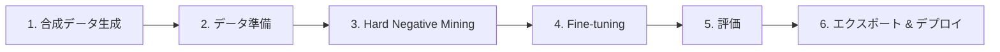

本記事は [Build a Domain-Specific Embedding Model in Under a Day](https://huggingface.co/blog/nvidia/domain-specific-embedding-finetune) （NVIDIA、HuggingFace Blog掲載）の解説記事です。

## ブログ概要（Summary）

NVIDIAが公開したNemotron Embedding Fine-tuningレシピは、ドメイン固有のドキュメントコーパスからEmbeddingモデルを1日以内にFine-tuningするための6段階パイプラインである。LLMを活用した合成QAペア生成、Hard Negative Mining、Contrastive Lossによる学習、BEIR準拠の評価、ONNX/TensorRTエクスポート、NVIDIA NIMデプロイまでを一貫して実行できる。著者らは、NVIDIA社内ドキュメントデータセット（NVDocs）においてnDCG@10が0.555から0.616へ+10.9%改善、さらにAtlassianのJiraデータセットではRecall@60が0.751から0.951へ+26.7%改善したと報告している。

この記事は [Zenn記事: 合成データ×Embedding Fine-tuningでセマンティック検索精度を定量改善する](https://zenn.dev/0h_n0/articles/630a21dd0bdbcb) の深掘りです。

## 情報源

- **種別**: 企業テックブログ
- **URL**: [https://huggingface.co/blog/nvidia/domain-specific-embedding-finetune](https://huggingface.co/blog/nvidia/domain-specific-embedding-finetune)
- **組織**: NVIDIA（HuggingFace Blog掲載）
- **ベースモデル**: Llama-Nemotron-Embed-1B-v2（1Bパラメータ）

## 技術的背景（Technical Background）

汎用Embeddingモデルは大規模なWebコーパスで事前学習されているため、一般的なセマンティック検索タスクでは高い性能を示す。しかし、企業固有の技術文書、法律文書、医療記録など、ドメイン特化のコーパスに対しては語彙の分布や文脈の差異により検索精度が低下する問題がある。

従来のドメイン適応アプローチでは、人手によるQAペアの作成が必要であり、数百〜数千件のアノテーションコストが障壁となっていた。NVIDIAのNemotronレシピは、NeMo Data Designerを用いてLLMによる合成データ生成（Synthetic Data Generation: SDG）を自動化することで、この障壁を解消している。さらに、Hard Negative Miningと95%マージンフィルタリングという独自の戦略により、学習の質を担保している。

学術的には、Contrastive Learningに基づくBiencoder Fine-tuning（Karpukhin et al., 2020; Xiong et al., 2021）の流れを汲みつつ、合成データ生成とMulti-hop推論の組み合わせが実用上の新規性である。

## 実装アーキテクチャ（Architecture）

### 6段階パイプラインの全体像

著者らが提示するパイプラインは以下の6段階で構成される。



### Step 1: 合成データ生成（SDG）

NeMo Data DesignerがLLMを用いてドキュメントからQAペアを自動生成する。著者らは以下の設定が可能であると報告している。

- **複雑度レベル**: 2〜5（数値が大きいほど高度な推論を要する質問を生成）
- **Multi-hop推論**: 1〜3ホップ（複数ドキュメントを跨ぐ質問を生成）
- **品質スコアリング**: 各QAペアに品質スコアを付与し、低品質なペアをフィルタリング

Multi-hop推論は、複数の文書断片を結合して回答を導出する必要があるため、モデルがドキュメント間の意味的関連性をより深く学習できる。

### Step 2: データ準備

生成されたQAペアに対して以下の処理を行う。

- **Train/Test分割**: 80/20の比率で分割
- **Multi-hopアンローリング**: Multi-hopの例を個別のQuery-Passageペアに展開
- **マージンフィルタリング**: 品質スコアに基づく閾値フィルタリング

### Step 3: Hard Negative Mining

Hard Negative Miningは、Contrastive Learningの学習効率を大幅に向上させる手法である。著者らの手法を数式で表現すると以下のようになる。

全てのクエリ $q_i$ とパッセージ $p_j$ をEmbeddingし、コサイン類似度を計算する。

$$
\text{sim}(q_i, p_j) = \frac{\mathbf{e}_{q_i} \cdot \mathbf{e}_{p_j}}{\|\mathbf{e}_{q_i}\| \|\mathbf{e}_{p_j}\|}
$$

ここで、
- $\mathbf{e}_{q_i}$: クエリ $q_i$ のEmbeddingベクトル
- $\mathbf{e}_{p_j}$: パッセージ $p_j$ のEmbeddingベクトル

正例パッセージをマスクした上で、類似度上位 $k$ 件（デフォルト: $k=5$）を各クエリのHard Negativeとして選択する。ただし、95%マージン上限を設ける。

$$
\text{margin}(q_i, p_j) = \text{sim}(q_i, p_j^+) - \text{sim}(q_i, p_j)
$$

$$
\text{valid\_negative}(p_j) = \begin{cases} \text{True} & \text{if } \text{sim}(q_i, p_j) < 0.95 \cdot \text{sim}(q_i, p_j^+) \\ \text{False} & \text{otherwise} \end{cases}
$$

ここで $p_j^+$ はクエリ $q_i$ の正例パッセージである。この95%マージン上限は、正例に極めて近い類似度を持つパッセージ（偽陰性の可能性が高い）をHard Negativeから除外する役割を果たす。

```python
import numpy as np


def hard_negative_mining(
    query_embeds: np.ndarray,
    passage_embeds: np.ndarray,
    positive_indices: list[int],
    top_k: int = 5,
    margin_ceiling: float = 0.95,
) -> list[list[int]]:
    """各クエリに対し95%マージン上限付きHard Negativeを選択する.

    Args:
        query_embeds: クエリEmbedding (num_queries, dim)
        passage_embeds: パッセージEmbedding (num_passages, dim)
        positive_indices: 各クエリの正例インデックス
        top_k: Hard Negative数
        margin_ceiling: 正例類似度に対する上限比率

    Returns:
        各クエリのHard NegativeインデックスのList
    """
    # コサイン類似度行列
    q_norm = query_embeds / np.linalg.norm(query_embeds, axis=1, keepdims=True)
    p_norm = passage_embeds / np.linalg.norm(passage_embeds, axis=1, keepdims=True)
    sim = q_norm @ p_norm.T

    results: list[list[int]] = []
    for i, pos_idx in enumerate(positive_indices):
        s = sim[i].copy()
        threshold = margin_ceiling * s[pos_idx]
        s[pos_idx] = -1.0           # 正例をマスク
        s[s >= threshold] = -1.0    # 95%マージン上限
        results.append(np.argsort(s)[::-1][:top_k].tolist())
    return results
```

### Step 4: Fine-tuning

Biencoderアーキテクチャ上でContrastive Lossを用いて学習を行う。著者らが報告しているハイパーパラメータは以下の通りである。

| パラメータ | 値 |
|-----------|-----|
| 温度 $\tau$ | 0.02 |
| エポック数 | 3 |
| 学習率 | 1e-5 |
| グローバルバッチサイズ | 128 |
| クエリあたりパッセージ数 | 5（正例1 + Hard Negative 4） |

Contrastive Loss（InfoNCE）は以下の式で定義される。

$$
\mathcal{L} = -\frac{1}{N} \sum_{i=1}^{N} \log \frac{\exp(\text{sim}(q_i, p_i^+) / \tau)}{\exp(\text{sim}(q_i, p_i^+) / \tau) + \sum_{j=1}^{K} \exp(\text{sim}(q_i, p_{i,j}^-) / \tau)}
$$

ここで、
- $N$: バッチ内のクエリ数
- $q_i$: $i$ 番目のクエリ
- $p_i^+$: $q_i$ の正例パッセージ
- $p_{i,j}^-$: $q_i$ の $j$ 番目のHard Negative
- $K$: Hard Negativeの数（$K=4$）
- $\tau$: 温度パラメータ（$\tau=0.02$）

温度 $\tau = 0.02$ は非常に小さい値であり、類似度の差を鋭く拡大する効果がある。これにより、正例と負例の識別がより厳密になる。

### Step 5: 評価

BEIRフレームワークに準拠した評価を行う。使用される指標は以下の通り。

- **nDCG@k**: Normalized Discounted Cumulative Gain（k=1, 5, 10, 100）
- **Recall@k**: 上位k件に含まれる関連文書の割合
- **Precision@k**: 上位k件中の関連文書の割合
- **MAP@k**: Mean Average Precision

### Step 6: エクスポートとデプロイ

Fine-tuning後のモデルをONNX形式でエクスポートし、オプションでTensorRTによる最適化を行う。デプロイにはNVIDIA NIMを使用し、OpenAI互換APIとして提供できる。

## パフォーマンス最適化（Performance）

### NVDocsデータセットの結果

著者らはNVIDIA社内ドキュメントデータセット（NVDocs）上でLlama-Nemotron-Embed-1B-v2をFine-tuningし、以下の結果を報告している。

| 指標 | ベースモデル | Fine-tuning後 | 改善率 |
|------|-------------|--------------|--------|
| nDCG@1 | 0.552 | 0.608 | +10.2% |
| nDCG@5 | 0.519 | 0.577 | +11.2% |
| nDCG@10 | 0.555 | 0.616 | +10.9% |
| Recall@1 | 0.285 | 0.315 | +10.8% |
| Recall@5 | 0.545 | 0.603 | +10.6% |
| Recall@10 | 0.630 | 0.693 | +10.0% |

ブログ内の結果表より引用。全指標で約10〜11%の改善が確認されている。

### Atlassian Jiraデータセットでの検証

著者らは外部検証として、AtlassianのJiraデータセット上でも評価を行っている。

- **Recall@60**: 0.751 → 0.951（**+26.7%改善**）

この結果は、Nemotronレシピがチケット管理システムのようなドメインにも汎化できることを示唆している。

### 計算リソース

著者らは以下のリソースで実行可能であると報告している。

- **ハードウェア**: A100 80GB または H100 80GB（単一GPU）
- **所要時間**: 約500件のドキュメントコーパスで2〜3時間、1日以内に完了

## 運用での学び（Production Lessons）

### Multi-hop学習の効果

Multi-hop推論を含むQAペアで学習させることにより、単一パッセージでは回答できない複合的な質問に対する検索精度が向上する。これは、企業内のナレッジベース検索で頻出する「複数のドキュメントを参照しないと回答できない質問」に対応するために有用である。

### 95%マージン戦略の意義

Hard Negative Miningにおいて、正例に対する類似度が95%を超えるパッセージを除外する戦略は、偽陰性（実際には関連性のあるパッセージ）をNegativeとして誤って学習することを防ぐ。著者らはこの戦略により学習の安定性が向上したと報告している。

### SDGの品質管理

合成データの品質はFine-tuningの成否を左右する。著者らのパイプラインでは、各QAペアに品質スコアを付与し、低品質なペアを除外するフィルタリング機構を備えている。複雑度レベル（2〜5）により、ドメインの難易度に合わせた調整が可能である。

## Production Deployment Guide

### AWS実装パターン（コスト最適化重視）

NemotronレシピによるEmbedding Fine-tuningパイプラインをAWSで運用する場合のトラフィック量別推奨構成を示す。以下のコスト試算は2026年7月時点のAWS ap-northeast-1（東京）リージョン料金に基づく概算値であり、実際のコストはトラフィックパターン、リージョン、バースト使用量により変動する。最新料金はAWS料金計算ツールでの確認を推奨する。

| 構成 | トラフィック | サービス構成 | 月額概算 |
|------|-------------|-------------|---------|
| Small | ~100 req/日 | Lambda + SageMaker Serverless Inference + S3 | $50-150 |
| Medium | ~1,000 req/日 | ECS Fargate + SageMaker Real-time Endpoint (ml.g5.xlarge) + ElastiCache | $300-800 |
| Large | 10,000+ req/日 | EKS + SageMaker Multi-Model Endpoint (ml.g5.2xlarge x2) + OpenSearch | $2,000-5,000 |

**Small構成の内訳**:
- Lambda（推論ゲートウェイ）: $5-10/月
- SageMaker Serverless Inference（Embeddingモデル）: $30-80/月
- S3（ドキュメントストレージ）: $5-10/月
- CloudWatch: $5-10/月

**コスト削減テクニック**:
- SageMaker Spot Training: Fine-tuning時にSpotインスタンスを利用し最大90%削減
- SageMaker Savings Plans: 推論エンドポイントに1年コミットで最大64%削減
- バッチ推論: リアルタイム性が不要な場合、SageMaker Batch Transformで処理単価を削減
- モデル量子化: INT8量子化でメモリ使用量を半減し、より小さいインスタンスで運用

### Terraformインフラコード

#### Small構成（Serverless）

```hcl
# Small構成: Lambda + SageMaker Serverless + S3

terraform {
  required_version = ">= 1.9"
  required_providers {
    aws = { source = "hashicorp/aws", version = "~> 5.60" }
  }
}

provider "aws" { region = "ap-northeast-1" }

resource "aws_s3_bucket" "model_artifacts" {
  bucket = "nemotron-embed-model-artifacts"
}

resource "aws_s3_bucket_server_side_encryption_configuration" "enc" {
  bucket = aws_s3_bucket.model_artifacts.id
  rule { apply_server_side_encryption_by_default { sse_algorithm = "aws:kms" } }
}

# IAM: SageMaker実行ロール（最小権限）
resource "aws_iam_role" "sagemaker_execution" {
  name = "nemotron-embed-sagemaker-role"
  assume_role_policy = jsonencode({
    Version = "2012-10-17"
    Statement = [{ Action = "sts:AssumeRole", Effect = "Allow",
      Principal = { Service = "sagemaker.amazonaws.com" } }]
  })
}

# SageMaker Serverless Inference Endpoint
resource "aws_sagemaker_endpoint_configuration" "serverless" {
  name = "nemotron-embed-serverless-config"
  production_variants {
    variant_name = "primary"
    model_name   = aws_sagemaker_model.embedding_model.name
    serverless_config { max_concurrency = 5, memory_size_in_mb = 4096 }
  }
}
```

#### Large構成（Container）

```hcl
# Large構成: EKS + Karpenter + Spot GPU

module "eks" {
  source  = "terraform-aws-modules/eks/aws"
  version = "~> 20.24"
  cluster_name    = "nemotron-embed-cluster"
  cluster_version = "1.31"
  vpc_id     = module.vpc.vpc_id
  subnet_ids = module.vpc.private_subnets

  eks_managed_node_groups = {
    gpu_spot = {
      instance_types = ["g5.xlarge", "g5.2xlarge"]
      capacity_type  = "SPOT"
      min_size = 1, max_size = 5, desired_size = 2
    }
  }
}

# Karpenter: GPU Spot自動スケーリング
resource "kubectl_manifest" "karpenter_provisioner" {
  yaml_body = yamlencode({
    apiVersion = "karpenter.sh/v1", kind = "NodePool"
    metadata = { name = "gpu-spot-pool" }
    spec = {
      template = { spec = { requirements = [
        { key = "karpenter.sh/capacity-type", operator = "In", values = ["spot"] },
        { key = "node.kubernetes.io/instance-type", operator = "In", values = ["g5.xlarge", "g5.2xlarge"] }
      ] } }
      limits = { cpu = "64", memory = "256Gi" }
      disruption = { consolidationPolicy = "WhenEmpty", consolidateAfter = "30s" }
    }
  })
}

# AWS Budgets: 月額$5,000アラート
resource "aws_budgets_budget" "embedding_service" {
  name = "nemotron-embed-monthly"
  budget_type = "COST", limit_amount = "5000", limit_unit = "USD", time_unit = "MONTHLY"
  notification {
    comparison_operator = "GREATER_THAN", threshold = 80, threshold_type = "PERCENTAGE"
    notification_type = "ACTUAL"
    subscriber_email_addresses = ["ops-team@example.com"]
  }
}
```

### 運用・監視設定

#### CloudWatch Logs Insights クエリ

```
# Embedding推論のレイテンシ分析（P95, P99）
fields @timestamp, @message
| filter @message like /embedding_inference/
| stats percentile(duration_ms, 95) as p95,
        percentile(duration_ms, 99) as p99,
        avg(duration_ms) as avg_latency
  by bin(1h)
| sort @timestamp desc
```

#### CloudWatch アラーム設定

```python
import boto3


def create_embedding_latency_alarm(
    endpoint_name: str, sns_topic_arn: str, threshold_ms: float = 500.0
) -> dict:
    """Embedding推論のP99レイテンシ異常検知アラームを作成する.

    Args:
        endpoint_name: SageMakerエンドポイント名
        sns_topic_arn: 通知先SNSトピックのARN
        threshold_ms: レイテンシ閾値（ミリ秒）

    Returns:
        CloudWatch APIレスポンス
    """
    cw = boto3.client("cloudwatch", region_name="ap-northeast-1")
    return cw.put_metric_alarm(
        AlarmName=f"{endpoint_name}-latency-p99",
        MetricName="ModelLatency", Namespace="AWS/SageMaker",
        Dimensions=[{"Name": "EndpointName", "Value": endpoint_name}],
        Statistic="p99", Period=300, EvaluationPeriods=3,
        Threshold=threshold_ms * 1000,
        ComparisonOperator="GreaterThanThreshold",
        AlarmActions=[sns_topic_arn],
    )
```

#### X-Rayトレーシング設定

```python
from aws_xray_sdk.core import xray_recorder, patch_all


def configure_xray_tracing(service_name: str = "nemotron-embed") -> None:
    """X-Rayトレーシングの初期設定を行う.

    Args:
        service_name: X-Rayサービス名
    """
    xray_recorder.configure(service=service_name)
    patch_all()  # boto3等の自動計装
```

#### Cost Explorer自動レポート

```python
import boto3
from datetime import datetime, timedelta


def get_daily_embedding_cost(days: int = 7) -> list[dict]:
    """直近N日間のEmbeddingサービスコストを取得する.

    Args:
        days: 取得する日数

    Returns:
        日別コスト情報のリスト。$100/日超過時はalert=Trueとなる。
    """
    client = boto3.client("ce", region_name="us-east-1")
    end = datetime.utcnow().strftime("%Y-%m-%d")
    start = (datetime.utcnow() - timedelta(days=days)).strftime("%Y-%m-%d")
    resp = client.get_cost_and_usage(
        TimePeriod={"Start": start, "End": end}, Granularity="DAILY",
        Metrics=["UnblendedCost"],
        Filter={"Tags": {"Key": "Project", "Values": ["nemotron-embed"]}},
    )
    return [{"date": r["TimePeriod"]["Start"],
             "cost_usd": (c := float(r["Total"]["UnblendedCost"]["Amount"])),
             "alert": c > 100.0} for r in resp["ResultsByTime"]]
```

### コスト最適化チェックリスト

#### アーキテクチャ選択
- [ ] トラフィック量に応じた構成を選択（~100 req/日: Serverless、~1,000 req/日: Hybrid、10,000+ req/日: Container）
- [ ] Fine-tuningジョブはSageMaker Training Job（Spot）で実行

#### リソース最適化
- [ ] EC2/SageMaker: Spotインスタンス優先（Fine-tuning時に最大90%削減）
- [ ] Reserved Instances: 推論エンドポイントに1年コミットで最大64%削減
- [ ] Savings Plans: SageMaker ML Savings Plansの適用を検討
- [ ] Lambda: メモリサイズをプロファイリング結果に基づき最適化
- [ ] ECS/EKS: Karpenterによるアイドル時自動スケールダウン

#### 推論コスト削減
- [ ] バッチ推論: リアルタイム性不要なケースはSageMaker Batch Transform使用
- [ ] モデル量子化: INT8量子化でインスタンスサイズを縮小
- [ ] キャッシュ: 同一クエリのEmbedding結果をElastiCacheでキャッシュ
- [ ] Multi-Model Endpoint: 複数モデルを1エンドポイントに集約

#### 監視・アラート
- [ ] AWS Budgets: 月額予算の80%/100%でアラート設定
- [ ] CloudWatch: 推論レイテンシP99の異常検知アラーム
- [ ] Cost Anomaly Detection: サービス別の異常コスト検知を有効化
- [ ] 日次コストレポート: Cost Explorerで自動取得、$100/日超過でSNS通知

#### リソース管理
- [ ] 未使用SageMakerエンドポイントの削除（自動スケジュール設定）
- [ ] タグ戦略: 全リソースに`Project=nemotron-embed`タグを付与
- [ ] S3ライフサイクルポリシー: 古いモデルアーティファクトをGlacierへ移行
- [ ] 開発環境: 夜間・週末のエンドポイント自動停止

## 学術研究との関連（Academic Connection）

- **DPR**: Karpukhin et al., 2020。Biencoderによる密検索の基礎。NemotronレシピはこのBiencoder構造に合成データとMulti-hop学習を追加している。
- **ANCE**: Xiong et al., 2021。Hard Negative Miningの有効性を示した研究。Nemotronの95%マージン戦略はこのアプローチの発展形である。
- **E5/GTE系列**: Wang et al., 2024; Li et al., 2023。合成データによるEmbedding学習の有効性を示した研究。

## まとめと実践への示唆

NVIDIAのNemotron Embedding Fine-tuningレシピは、合成データ生成からデプロイまでの一貫した6段階パイプラインを提供し、ドメイン特化Embeddingモデルの構築を大幅に効率化する。著者らの報告によれば、NVDocsでnDCG@10が+10.9%、Atlassian JiraでRecall@60が+26.7%改善され、単一GPU・1日以内での実行が可能である。

実務的には、RAGシステムの検索精度改善において、汎用モデルの限界を超える有力な手段となる。特に企業固有の技術文書や社内ナレッジベースに対するセマンティック検索の改善に適している。95%マージンHard Negative Mining戦略とMulti-hop学習の組み合わせは、今後のEmbedding Fine-tuningの標準的なプラクティスとなる可能性がある。

## 参考文献

- **Blog URL**: [https://huggingface.co/blog/nvidia/domain-specific-embedding-finetune](https://huggingface.co/blog/nvidia/domain-specific-embedding-finetune)
- **Model**: [nvidia/Llama-Nemotron-Embed-1B-v2](https://huggingface.co/nvidia/Llama-Nemotron-Embed-1B-v2)
- **NeMo Framework**: [https://github.com/NVIDIA/NeMo](https://github.com/NVIDIA/NeMo)
- **BEIR Benchmark**: [https://github.com/beir-cellar/beir](https://github.com/beir-cellar/beir)
- **Related Zenn article**: [https://zenn.dev/0h_n0/articles/630a21dd0bdbcb](https://zenn.dev/0h_n0/articles/630a21dd0bdbcb)
