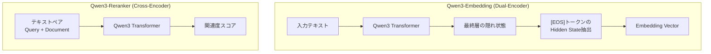
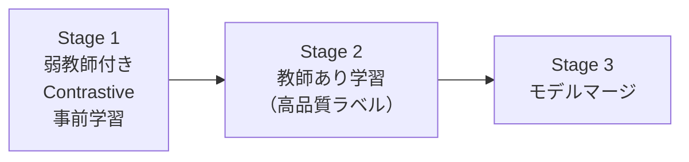

## ブログ概要

本記事は[Qwen3 Embedding: Advancing Text Embedding and Reranking Through Foundation Models](https://qwenlm.github.io/blog/qwen3-embedding/)の解説記事です。

Alibaba Qwen Teamは2025年6月5日、Qwen3シリーズの基盤モデルをベースとしたテキストEmbeddingモデル群「Qwen3-Embedding」とリランキングモデル群「Qwen3-Reranker」を公開した。Qwen3-Embedding-8Bは公開時点でMTEB多言語リーダーボードにおいて総合スコア70.58で1位を獲得したと報告されている。3段階の学習パイプライン（弱教師付きContrastive事前学習、教師あり学習、モデルマージ）、命令対応（Instruction-Aware）アーキテクチャ、Matryoshka Representation Learning（MRL）による可変次元出力をサポートし、0.6BモデルはApache 2.0ライセンスで商用利用可能である。

この記事は [Zenn記事: 合成データ×Embedding Fine-tuningでセマンティック検索精度を定量改善する](https://zenn.dev/0h_n0/articles/630a21dd0bdbcb) の深掘りです。

## 情報源

- **種別**: 企業テックブログ
- **URL**: [https://qwenlm.github.io/blog/qwen3-embedding/](https://qwenlm.github.io/blog/qwen3-embedding/)
- **組織**: Qwen Team（Alibaba Group）
- **発表日**: 2025年6月5日

## 技術的背景

### Embeddingモデルの課題と動機

セマンティック検索やRAGパイプラインにおいて、テキストEmbeddingモデルの品質は検索精度を左右する。従来のEmbeddingモデルには以下の課題が存在した。

**多言語対応の不足**: 英語中心のモデルが多く、100言語以上を高精度でカバーするモデルは限定的であった。特にコード検索を含む多様なドメインへの対応は不十分であった。

**タスク適応性の制約**: 従来のEmbeddingモデルは単一のEmbedding空間に全てのタスクをマッピングするため、検索・分類・クラスタリングなど異なるタスクの要求を同時に最適化することが困難であった。

**次元数の固定**: 多くのモデルはEmbeddingの次元数が固定されており、ストレージ容量やレイテンシ要件に応じた柔軟な調整ができなかった。

Qwen3-Embeddingはこれらの課題に対して、基盤LLMの多言語能力の活用、命令対応アーキテクチャ、MRLによる可変次元出力という3つのアプローチで対処している。

### 学術研究との関連

Embeddingモデルの学習手法は、Contrastive Learning（対照学習）の研究に基づいている。SimCLR（Chen et al., 2020）やMoCo（He et al., 2020）に端を発する対照学習のフレームワークが、テキストEmbeddingではDPR（Karpukhin et al., 2020）やContriever（Izacard et al., 2022）で発展した。Qwen3-Embeddingの3段階学習はこの系譜を発展させ、LLMの生成能力を弱教師データ作成に活用する点が特徴的である。

## 実装アーキテクチャ

### Dual-EncoderとCross-Encoder

Qwen3シリーズはEmbeddingモデル（Dual-Encoder）とリランキングモデル（Cross-Encoder）の2種類で構成される。



**Embeddingモデル**は、入力テキストをQwen3 Transformerに通し、最終層の`[EOS]`トークンに対応するHidden State（隠れ状態ベクトル）を意味表現として抽出する。`[EOS]`トークンはシーケンス末尾に位置するため、Self-Attentionを通じて入力全体の文脈情報を集約している。

**リランキングモデル**はCross-Encoderアーキテクチャを採用し、QueryとDocumentのテキストペアを同時に入力して関連度スコアを直接出力する。Dual-Encoderが独立にEmbeddingを計算するのに対し、Cross-EncoderはQueryとDocumentの相互作用を明示的にモデル化するため、精度は高いがレイテンシも大きい。

### モデルサイズと仕様

Qwen Teamは3種類のパラメータサイズでモデルを提供している。

| モデル | パラメータ数 | レイヤー数 | 最大系列長 | Embedding次元 | MRL対応 | ライセンス |
|--------|-------------|-----------|-----------|--------------|---------|-----------|
| Qwen3-Embedding-0.6B | 0.6B | 28 | 32K | 1024 | 32-1024 | Apache 2.0 |
| Qwen3-Embedding-4B | 4B | 36 | 32K | 2560 | 32-2560 | Apache 2.0 |
| Qwen3-Embedding-8B | 8B | 36 | 32K | 4096 | 32-4096 | Apache 2.0 |

著者らによると、全サイズでApache 2.0ライセンスが適用され、商用利用が可能である。

### 命令対応（Instruction-Aware）アーキテクチャ

Qwen3-Embeddingの特徴的な設計として、ユーザーがタスク固有の命令を入力に付与できる命令対応アーキテクチャがある。Embeddingの計算時に、タスクの目的・言語・シナリオを指示として含めることで、同一モデルが異なるタスクに適応する。

命令フォーマットは以下の形式を取る。

```
Instruct: {task_description}
Query:{query_text}
```

具体例として、検索タスクでは次のように入力する。

```python
def get_detailed_instruct(task_description: str, query: str) -> str:
    """命令付きクエリを生成する。

    Args:
        task_description: タスクの説明文
        query: 検索クエリテキスト

    Returns:
        命令フォーマットに整形されたクエリ文字列
    """
    return f'Instruct: {task_description}\nQuery:{query}'

# 検索タスクの例
task = "Given a web search query, retrieve relevant passages that answer the query"
query = "What is the capital of China?"
formatted_query = get_detailed_instruct(task, query)
# => "Instruct: Given a web search query, retrieve relevant passages...\nQuery:What is the capital of China?"
```

著者らは、命令を付与した場合に命令なしと比較して1-5%の精度改善が得られると報告している（HuggingFaceモデルカードより）。ドキュメント側には命令を付与せず、クエリ側のみに命令を付与する設計である。

### Matryoshka Representation Learning（MRL）

MRLは、Embeddingベクトルの先頭$d'$次元を切り出しても意味的な情報が保持されるように学習する手法である。Kusupati et al.（2022）が提案したこの手法により、ストレージやレイテンシの制約に応じてEmbeddingの次元数を柔軟に調整できる。

$$
\mathbf{e}_{d'} = \mathbf{e}[1:d'], \quad d' \in \{32, 64, 128, 256, 512, \ldots, D_{\max}\}
$$

ここで、
- $\mathbf{e}$: 元のEmbeddingベクトル（$D_{\max}$次元）
- $\mathbf{e}_{d'}$: 先頭$d'$次元を切り出したベクトル
- $D_{\max}$: モデル固有の最大次元数（0.6B: 1024、4B: 2560、8B: 4096）

MRL対応により、0.6Bモデルでは32から1024までの任意の次元数でEmbeddingを利用できる。次元数を小さくすることでベクトルDBのストレージ使用量を削減し、類似度計算のレイテンシを低減できる。

## 3段階学習パイプライン

Qwen3-Embeddingの学習は3段階のパイプラインで構成される。



### Stage 1: 弱教師付きContrastive事前学習

第1段階では、大規模な弱教師付きデータを用いたContrastive Learning（対照学習）で事前学習を行う。著者らは、Qwen3の生成能力を活用して、タスクと言語を跨いだ弱教師付きテキストペアを動的に生成する手法を採用したと報告している。

Contrastive Learningの損失関数は、一般にInfoNCE損失が用いられる。

$$
\mathcal{L}_{\text{InfoNCE}} = -\log \frac{\exp(\text{sim}(\mathbf{q}, \mathbf{d}^+) / \tau)}{\exp(\text{sim}(\mathbf{q}, \mathbf{d}^+) / \tau) + \sum_{j=1}^{K} \exp(\text{sim}(\mathbf{q}, \mathbf{d}_j^-) / \tau)}
$$

ここで、
- $\mathbf{q}$: クエリのEmbedding
- $\mathbf{d}^+$: 正例（関連ドキュメント）のEmbedding
- $\mathbf{d}_j^-$: 負例のEmbedding（$K$個）
- $\tau$: 温度パラメータ
- $\text{sim}(\cdot, \cdot)$: コサイン類似度

LLMを用いた弱教師データ生成は、従来の手法（タイトル-本文ペアの自動抽出やBM25による疑似ラベリングなど）と比較して、多言語・多タスクにわたる多様なペアを生成できる点で優位性がある。

### Stage 2: 教師あり学習

第2段階では、高品質なラベル付きデータを用いた教師あり学習を行う。人手でアノテーションされたデータセットやベンチマークのトレーニングスプリットなどを活用し、Embeddingの品質を向上させる。

### Stage 3: モデルマージ

第3段階では、複数の候補モデルをマージ戦略によって統合する。モデルマージは、異なるデータやハイパーパラメータで学習された複数のモデルのパラメータを組み合わせることで、単一モデルの弱点を補完する手法である。近年のLLM研究では、TIES-Merging（Yadav et al., 2024）やDAREなどのマージ手法が提案されており、Fine-tuningの成果を効率的に統合できることが示されている。

### リランキングモデルの学習

リランキングモデル（Qwen3-Reranker）は、3段階のうちStage 1（弱教師付き事前学習）を省略し、高品質なラベル付きデータによる直接的な教師あり学習のみで訓練される。Cross-Encoderアーキテクチャの特性上、テキストペアを同時に入力するため、Contrastive Learningのバッチ内負例サンプリングとは異なる学習設計が必要となるためである。

## パフォーマンス最適化

### ベンチマーク結果: MTEB多言語

MTEB（Massive Text Embedding Benchmark）多言語リーダーボードにおけるスコアを以下に示す（ブログ記事およびHuggingFaceモデルカードより）。

| モデル | パラメータ | Mean (Task) | Retrieval | STS | Classification |
|--------|-----------|-------------|-----------|-----|----------------|
| **Qwen3-Embedding-8B** | **8B** | **70.58** | **86.40** | **81.08** | **74.00** |
| Qwen3-Embedding-4B | 4B | 69.45 | 85.05 | 80.86 | 72.33 |
| gemini-embedding-exp-03-07 | - | 68.37 | 83.63 | 79.40 | - |
| Qwen3-Embedding-0.6B | 0.6B | 64.33 | 64.64 | 76.17 | 66.83 |
| gte-Qwen2-7B-instruct | 7.6B | 62.51 | 85.13 | 73.98 | - |

著者らは、Qwen3-Embedding-8Bが2025年6月5日時点でMTEB多言語リーダーボード1位（スコア70.58）を獲得したと報告している。

### ベンチマーク結果: MTEB英語v2

| モデル | パラメータ | Mean (Task) | Retrieval | STS | Classification |
|--------|-----------|-------------|-----------|-----|----------------|
| **Qwen3-Embedding-8B** | **8B** | **75.22** | **69.44** | **88.58** | **90.43** |
| Qwen3-Embedding-4B | 4B | 74.60 | 68.46 | 88.72 | 89.84 |
| gemini-embedding-exp-03-07 | - | 73.30 | 64.35 | - | - |
| Qwen3-Embedding-0.6B | 0.6B | 70.70 | 61.83 | 86.57 | 85.76 |
| gte-Qwen2-7B-instruct | 7.6B | 70.72 | 58.09 | - | - |

MTEB英語v2では8Bモデルが75.22を達成し、0.6Bモデルでも70.70と、7.6BのGTE-Qwen2-7B-instructと同等のスコアを記録している。

### ベンチマーク結果: C-MTEB（中国語）

| モデル | パラメータ | Mean (Task) | Retrieval | Clustering | STS |
|--------|-----------|-------------|-----------|-----------|-----|
| **Qwen3-Embedding-8B** | **8B** | **73.84** | **78.21** | **80.08** | **63.53** |
| Qwen3-Embedding-4B | 4B | 72.27 | 77.03 | 77.89 | 61.26 |
| gte-Qwen2-7B-instruct | 7.6B | 71.62 | - | - | - |
| Qwen3-Embedding-0.6B | 0.6B | 66.33 | 71.03 | 68.74 | 54.52 |

中国語ベンチマークでも8Bモデルが73.84で最高スコアを記録している。

### リランキングモデルのベンチマーク

| モデル | パラメータ | MTEB-R | CMTEB-R | MMTEB-R | MLDR | MTEB-Code |
|--------|-----------|--------|---------|---------|------|-----------|
| **Qwen3-Reranker-8B** | **8B** | 69.02 | **77.45** | **72.94** | **70.19** | **81.22** |
| **Qwen3-Reranker-4B** | **4B** | **69.76** | 75.94 | 72.74 | 69.97 | 81.20 |
| Qwen3-Reranker-0.6B | 0.6B | 65.80 | 71.31 | 66.36 | 67.28 | 73.42 |
| BGE-reranker-v2-m3 | 0.6B | 57.03 | 72.16 | 58.36 | 59.51 | 41.38 |

リランキングモデルでは、MTEB-Codeで81.22を達成しており、コード検索タスクにも高い性能を示していると著者らは報告している。

## Fine-tuning手法

### LoRAによるFine-tuning

著者らは、基盤モデルの能力を保持するためにLoRA（Low-Rank Adaptation）によるFine-tuningを推奨している。Full Fine-tuningと比較して、LoRAは以下の利点がある。

- **メモリ効率**: 学習パラメータ数を大幅に削減（全パラメータの0.1-1%程度）
- **基盤能力の保持**: 元のモデルの多言語・長文理解能力を維持
- **タスク適応**: 特定ドメインのデータで効率的にFine-tuning可能

```python
from transformers import AutoModel, AutoTokenizer
from peft import LoraConfig, get_peft_model

def create_lora_embedding_model(
    model_name: str = "Qwen/Qwen3-Embedding-0.6B",
    lora_rank: int = 16,
    lora_alpha: int = 32,
    target_modules: list[str] | None = None,
) -> tuple:
    """LoRA適用済みのEmbeddingモデルを作成する。

    Args:
        model_name: ベースモデルのHuggingFace ID
        lora_rank: LoRAのランク（低ランク近似の次元数）
        lora_alpha: LoRAのスケーリング係数
        target_modules: LoRAを適用する対象モジュール名のリスト

    Returns:
        (peft_model, tokenizer) のタプル
    """
    if target_modules is None:
        target_modules = ["q_proj", "v_proj"]

    tokenizer = AutoTokenizer.from_pretrained(
        model_name, padding_side="left"
    )
    base_model = AutoModel.from_pretrained(model_name)

    lora_config = LoraConfig(
        r=lora_rank,
        lora_alpha=lora_alpha,
        target_modules=target_modules,
        lora_dropout=0.05,
        bias="none",
        task_type="FEATURE_EXTRACTION",
    )
    peft_model = get_peft_model(base_model, lora_config)
    peft_model.print_trainable_parameters()
    return peft_model, tokenizer
```

### 弱教師付きデータ生成

Qwen3-Embeddingの学習で採用された弱教師付きテキストペア生成は、Fine-tuningにも応用可能である。Qwen3の生成能力を活用して、ドメイン固有のクエリ-ドキュメントペアを自動生成する。

```python
from dataclasses import dataclass


@dataclass(frozen=True)
class TextPair:
    """弱教師付き学習用のテキストペア。

    Attributes:
        query: 検索クエリテキスト
        positive: 関連する正例ドキュメント
        negative: 関連しない負例ドキュメント（オプション）
    """
    query: str
    positive: str
    negative: str | None = None


def generate_synthetic_pairs(
    documents: list[str],
    llm_client: object,
    task_description: str = "semantic search",
    num_queries_per_doc: int = 3,
) -> list[TextPair]:
    """LLMを用いてドキュメントから合成クエリ-ドキュメントペアを生成する。

    Qwen3-Embeddingの学習で採用された弱教師付きデータ生成を
    Fine-tuning向けに適用した実装例。

    Args:
        documents: 元となるドキュメントのリスト
        llm_client: LLM APIクライアント（generate メソッドを持つ）
        task_description: 生成するクエリのタスク種別
        num_queries_per_doc: 各ドキュメントから生成するクエリ数

    Returns:
        生成されたTextPairのリスト
    """
    pairs: list[TextPair] = []

    prompt_template = (
        "Given the following document, generate {n} diverse search queries "
        "that this document would be relevant for.\n"
        "Task type: {task}\n"
        "Document: {doc}\n"
        "Output each query on a separate line."
    )

    for doc in documents:
        prompt = prompt_template.format(
            n=num_queries_per_doc,
            task=task_description,
            doc=doc[:2000],
        )
        response = llm_client.generate(prompt)
        queries = [q.strip() for q in response.strip().split("\n") if q.strip()]

        for query in queries[:num_queries_per_doc]:
            pairs.append(TextPair(query=query, positive=doc))

    return pairs
```

この手法は、Zenn記事「合成データ×Embedding Fine-tuningでセマンティック検索精度を定量改善する」で紹介されている合成データによるFine-tuningと共通する考え方であり、ドメイン固有データの不足を補う有効な手段である。

## 運用での学び

### モデルサイズ選択のガイドライン

著者らの報告に基づくと、モデルサイズの選択は以下の基準で判断できる。

- **0.6B（推奨: エッジ・低コスト環境）**: MTEB英語70.70、C-MTEB 66.33。7.6BのGTE-Qwen2と同等の英語性能を10分の1以下のパラメータで実現。Apache 2.0で商用利用可能。GPU VRAM 2-4GB程度で推論可能。
- **4B（推奨: バランス型）**: MTEB英語74.60、C-MTEB 72.27。精度とコストのバランスが良い。GPU VRAM 8-16GB程度。
- **8B（推奨: 精度最優先）**: MTEB英語75.22、C-MTEB 73.84。MTEB多言語1位。GPU VRAM 16-32GB程度。

### Embedding + Reranker 2段階パイプライン

実運用では、Dual-EncoderによるEmbedding検索（高速・大規模）で候補を絞り込み、Cross-Encoderによるリランキング（高精度・低速）で最終順位を決定する2段階パイプラインが標準的である。

```python
import numpy as np
from sentence_transformers import SentenceTransformer, CrossEncoder


def two_stage_retrieval(
    query: str,
    corpus: list[str],
    corpus_embeddings: np.ndarray,
    embedding_model: SentenceTransformer,
    reranker: CrossEncoder,
    top_k_retrieval: int = 100,
    top_k_final: int = 10,
) -> list[tuple[int, float]]:
    """Embedding + Rerankerの2段階検索パイプライン。

    Stage 1でDual-Encoderにより候補を絞り込み、
    Stage 2でCross-Encoderにより精密なリランキングを行う。

    Args:
        query: 検索クエリ
        corpus: ドキュメントのリスト
        corpus_embeddings: 事前計算済みのコーパスEmbedding
        embedding_model: Qwen3-Embedding等のDual-Encoder
        reranker: Qwen3-Reranker等のCross-Encoder
        top_k_retrieval: Stage 1で取得する候補数
        top_k_final: 最終的に返す上位件数

    Returns:
        (ドキュメントインデックス, リランキングスコア) のリスト
    """
    # Stage 1: Embedding検索（Dual-Encoder）
    query_embedding = embedding_model.encode(
        [query], prompt_name="query"
    )
    similarities = embedding_model.similarity(
        query_embedding, corpus_embeddings
    )[0]
    top_k_indices = np.argsort(-similarities.numpy())[:top_k_retrieval]

    # Stage 2: リランキング（Cross-Encoder）
    candidate_pairs = [
        [query, corpus[idx]] for idx in top_k_indices
    ]
    rerank_scores = reranker.predict(candidate_pairs)

    # スコア順にソート
    scored = list(zip(top_k_indices, rerank_scores))
    scored.sort(key=lambda x: x[1], reverse=True)

    return scored[:top_k_final]
```

### MRLによるストレージ最適化

MRL対応により、精度とストレージ容量のトレードオフを柔軟に調整できる。例えば、0.6Bモデルの最大次元1024を256次元に削減すると、ベクトルDBのストレージ使用量を約75%削減できる。精度への影響はタスクとデータに依存するが、検索タスクでは次元数を半分にしても大きな劣化が見られないケースが多いことが先行研究で報告されている。

```python
import torch
import torch.nn.functional as F
from transformers import AutoModel, AutoTokenizer


def encode_with_mrl(
    texts: list[str],
    model: AutoModel,
    tokenizer: AutoTokenizer,
    target_dim: int = 256,
    max_length: int = 512,
) -> torch.Tensor:
    """MRL対応のEmbeddingを指定次元で取得する。

    Args:
        texts: エンコード対象のテキストリスト
        model: Qwen3-Embeddingモデル
        tokenizer: 対応するトークナイザ
        target_dim: 出力Embedding次元（32-max_dim）
        max_length: 最大トークン数

    Returns:
        L2正規化済みの(batch_size, target_dim) テンソル
    """
    inputs = tokenizer(
        texts,
        padding=True,
        truncation=True,
        max_length=max_length,
        return_tensors="pt",
    )
    with torch.no_grad():
        outputs = model(**inputs)
        # [EOS]トークンのHidden Stateを取得
        last_hidden = outputs.last_hidden_state
        # 各シーケンスの最後のトークン位置を特定
        eos_mask = inputs["input_ids"].eq(
            tokenizer.eos_token_id
        )
        embeddings = last_hidden[eos_mask]

    # MRL: 先頭target_dim次元を切り出し
    embeddings_mrl = embeddings[:, :target_dim]
    # L2正規化
    embeddings_mrl = F.normalize(embeddings_mrl, p=2, dim=1)

    return embeddings_mrl
```

## 学術研究との関連

Qwen3-Embeddingの技術的基盤には、複数の重要な先行研究がある。

- **E5（Wang et al., 2024）**: Microsoftが提案したテキストEmbeddingモデル。命令付きEmbeddingの先駆的な研究であり、Qwen3-Embeddingの命令対応アーキテクチャはこの系譜に位置づけられる。
- **GTE（Li et al., 2023）**: Alibabaが先行して開発したGeneral Text Embedding。Qwen3-EmbeddingはGTEシリーズの後継として、Qwen3基盤モデルへの移行と学習パイプラインの刷新を行っている。
- **Matryoshka Representation Learning（Kusupati et al., 2022）**: 可変次元Embeddingの学習手法。先頭$d'$次元の切り出しで情報が保持されるよう、複数の次元数で同時に損失を計算する。Qwen3-Embeddingはこの手法をサポートしている。
- **TIES-Merging（Yadav et al., 2024）**: モデルマージ手法の一つ。Stage 3のモデルマージではこうした手法が活用されていると推測される（具体的な手法は未公開）。

## Production Deployment Guide

### AWS実装パターン（コスト最適化重視）

Qwen3-Embeddingを本番環境にデプロイするためのAWS構成を、トラフィック量別に示す。コスト試算は2026年7月時点のAWS ap-northeast-1（東京）リージョンの概算値であり、実際のコストはトラフィックパターンやリージョンにより変動する。

**Small構成（~100 req/日）: Serverless**
- **Lambda + SageMaker Serverless Inference**: Qwen3-Embedding-0.6Bを使用
- Lambda: リクエスト受付・前処理（128MB、タイムアウト30秒）
- SageMaker Serverless: モデル推論（4GB メモリ、コールドスタート時GPUなしCPU推論）
- DynamoDB: Embeddingキャッシュ（On-Demand課金）
- 月額概算: $80-150（SageMaker $50-80、Lambda $5-10、DynamoDB $10-30、CloudWatch $5-10）
- コスト削減: Provisioned Concurrencyでコールドスタート回避

**Medium構成（~1,000 req/日）: GPU Inference**
- **ECS Fargate + SageMaker Real-Time Endpoint**: Qwen3-Embedding-4Bを使用
- SageMaker: ml.g5.xlarge（GPU 1基、24GB VRAM）Real-Timeエンドポイント
- ECS Fargate: API Gateway + 前処理（0.5 vCPU、1GB RAM）
- ElastiCache Redis: Embedding結果キャッシュ
- 月額概算: $500-800（SageMaker $400-500、ECS $30-50、ElastiCache $50-100、その他 $50-100）

**Large構成（10,000+ req/日）: EKS + Spot**
- **EKS + Karpenter + Spot Instances**: Qwen3-Embedding-8Bを使用
- EKS: g5.2xlargeのSpot Instances（Karpenterで自動スケーリング）
- vLLMまたはTEI（Text Embeddings Inference）でバッチ推論最適化
- OpenSearch: ベクトルDB（3ノードクラスタ）
- 月額概算: $2,500-5,000（EKS Spot $1,000-2,000、OpenSearch $800-1,500、その他 $500-1,000）

**コスト削減テクニック**:
- Spot Instances活用でGPUインスタンスコストを最大90%削減
- SageMaker Savings Plans: 1年コミットで最大64%削減
- Embeddingキャッシュ: 同一テキストの再計算を回避し推論コストを30-50%削減
- バッチ推論: リアルタイム不要な場合はSageMaker Batch Transformで50%削減

### Terraformインフラコード

**Small構成（Serverless）**:

```hcl
# Qwen3-Embedding Serverless構成
# 2026年7月時点の設定

terraform {
  required_version = ">= 1.9"
  required_providers {
    aws = {
      source  = "hashicorp/aws"
      version = "~> 5.60"
    }
  }
}

provider "aws" {
  region = "ap-northeast-1"
}

# --- IAMロール（最小権限） ---
resource "aws_iam_role" "lambda_embedding" {
  name = "qwen3-embedding-lambda-role"
  assume_role_policy = jsonencode({
    Version = "2012-10-17"
    Statement = [{
      Action = "sts:AssumeRole"
      Effect = "Allow"
      Principal = { Service = "lambda.amazonaws.com" }
    }]
  })
}

resource "aws_iam_role_policy" "lambda_embedding_policy" {
  name = "qwen3-embedding-lambda-policy"
  role = aws_iam_role.lambda_embedding.id
  policy = jsonencode({
    Version = "2012-10-17"
    Statement = [
      {
        Effect   = "Allow"
        Action   = ["logs:CreateLogGroup", "logs:CreateLogStream", "logs:PutLogEvents"]
        Resource = "arn:aws:logs:ap-northeast-1:*:*"
      },
      {
        Effect   = "Allow"
        Action   = ["dynamodb:GetItem", "dynamodb:PutItem", "dynamodb:Query"]
        Resource = aws_dynamodb_table.embedding_cache.arn
      },
      {
        Effect   = "Allow"
        Action   = ["sagemaker:InvokeEndpoint"]
        Resource = "*"
      }
    ]
  })
}

# --- DynamoDB（Embeddingキャッシュ） ---
resource "aws_dynamodb_table" "embedding_cache" {
  name         = "qwen3-embedding-cache"
  billing_mode = "PAY_PER_REQUEST"  # On-Demandでコスト最適化
  hash_key     = "text_hash"

  attribute {
    name = "text_hash"
    type = "S"
  }

  ttl {
    attribute_name = "expires_at"
    enabled        = true
  }

  server_side_encryption {
    enabled = true  # KMS暗号化
  }

  tags = {
    Project     = "qwen3-embedding"
    Environment = "production"
    CostCenter  = "ml-inference"
  }
}

# --- CloudWatchアラーム ---
resource "aws_cloudwatch_metric_alarm" "lambda_errors" {
  alarm_name          = "qwen3-embedding-lambda-errors"
  comparison_operator = "GreaterThanThreshold"
  evaluation_periods  = 2
  metric_name         = "Errors"
  namespace           = "AWS/Lambda"
  period              = 300
  statistic           = "Sum"
  threshold           = 5
  alarm_description   = "Lambda関数のエラー数が閾値を超過"
  alarm_actions       = [aws_sns_topic.alerts.arn]

  dimensions = {
    FunctionName = "qwen3-embedding-handler"
  }
}

resource "aws_sns_topic" "alerts" {
  name              = "qwen3-embedding-alerts"
  kms_master_key_id = "alias/aws/sns"
}
```

**Large構成（EKS + Spot）**:

```hcl
# Qwen3-Embedding EKS + Spot構成

module "eks" {
  source          = "terraform-aws-modules/eks/aws"
  version         = "~> 20.0"
  cluster_name    = "qwen3-embedding-cluster"
  cluster_version = "1.31"

  vpc_id     = module.vpc.vpc_id
  subnet_ids = module.vpc.private_subnets

  # Karpenter用IAM
  enable_cluster_creator_admin_permissions = true

  cluster_endpoint_public_access = false  # プライベートアクセスのみ

  cluster_encryption_config = {
    provider_key_arn = aws_kms_key.eks.arn
    resources        = ["secrets"]
  }

  tags = {
    Project     = "qwen3-embedding"
    Environment = "production"
  }
}

# --- Karpenter Provisioner（Spot優先） ---
resource "kubectl_manifest" "karpenter_nodepool" {
  yaml_body = yamlencode({
    apiVersion = "karpenter.sh/v1"
    kind       = "NodePool"
    metadata   = { name = "gpu-spot" }
    spec = {
      template = {
        spec = {
          requirements = [
            { key = "karpenter.sh/capacity-type", operator = "In", values = ["spot", "on-demand"] },
            { key = "node.kubernetes.io/instance-type", operator = "In", values = ["g5.xlarge", "g5.2xlarge"] },
            { key = "topology.kubernetes.io/zone", operator = "In", values = ["ap-northeast-1a", "ap-northeast-1c"] }
          ]
          nodeClassRef = { group = "karpenter.k8s.aws", kind = "EC2NodeClass", name = "gpu" }
        }
      }
      limits   = { cpu = "64", memory = "256Gi", "nvidia.com/gpu" = "8" }
      disruption = {
        consolidationPolicy = "WhenEmptyOrUnderutilized"
        consolidateAfter    = "30s"
      }
    }
  })
}

# --- AWS Budgets ---
resource "aws_budgets_budget" "monthly" {
  name         = "qwen3-embedding-monthly"
  budget_type  = "COST"
  limit_amount = "5000"
  limit_unit   = "USD"
  time_unit    = "MONTHLY"

  notification {
    comparison_operator       = "GREATER_THAN"
    threshold                 = 80
    threshold_type            = "PERCENTAGE"
    notification_type         = "ACTUAL"
    subscriber_email_addresses = ["ml-team@example.com"]
  }
}
```

### 運用・監視設定

**CloudWatch Logs Insightsクエリ（推論レイテンシ分析）**:

```
fields @timestamp, @message
| filter @message like /embedding_latency/
| stats avg(latency_ms) as avg_latency,
        pct(latency_ms, 95) as p95_latency,
        pct(latency_ms, 99) as p99_latency,
        count(*) as request_count
  by bin(1h)
| sort @timestamp desc
```

**CloudWatchアラーム設定（Python）**:

```python
import boto3


def create_embedding_alarms(
    function_name: str = "qwen3-embedding-handler",
    sns_topic_arn: str = "",
) -> list[dict]:
    """Qwen3-Embedding推論のCloudWatchアラームを作成する。

    Args:
        function_name: Lambda関数名またはSageMakerエンドポイント名
        sns_topic_arn: アラート通知先のSNSトピックARN

    Returns:
        作成されたアラームの情報リスト
    """
    cloudwatch = boto3.client("cloudwatch", region_name="ap-northeast-1")
    alarms = []

    # レイテンシ異常検知
    cloudwatch.put_metric_alarm(
        AlarmName=f"{function_name}-high-latency",
        MetricName="Duration",
        Namespace="AWS/Lambda",
        Statistic="p95",
        Period=300,
        EvaluationPeriods=3,
        Threshold=10000,  # 10秒
        ComparisonOperator="GreaterThanThreshold",
        AlarmActions=[sns_topic_arn],
        Dimensions=[{"Name": "FunctionName", "Value": function_name}],
    )
    alarms.append({"name": f"{function_name}-high-latency", "threshold": "10s p95"})

    # エラー率監視
    cloudwatch.put_metric_alarm(
        AlarmName=f"{function_name}-error-rate",
        MetricName="Errors",
        Namespace="AWS/Lambda",
        Statistic="Sum",
        Period=300,
        EvaluationPeriods=2,
        Threshold=10,
        ComparisonOperator="GreaterThanThreshold",
        AlarmActions=[sns_topic_arn],
        Dimensions=[{"Name": "FunctionName", "Value": function_name}],
    )
    alarms.append({"name": f"{function_name}-error-rate", "threshold": "10 errors/5min"})

    return alarms
```

**X-Rayトレーシング設定**:

```python
from aws_xray_sdk.core import xray_recorder, patch_all


def configure_xray_tracing(service_name: str = "qwen3-embedding") -> None:
    """X-Rayトレーシングを設定する。

    Args:
        service_name: X-Rayのサービス名
    """
    xray_recorder.configure(service=service_name)
    patch_all()  # boto3等の自動計装


@xray_recorder.capture("encode_text")
def encode_with_tracing(
    text: str,
    model_name: str = "Qwen3-Embedding-0.6B",
) -> list[float]:
    """X-Rayトレース付きでテキストをエンコードする。

    Args:
        text: エンコード対象のテキスト
        model_name: 使用するモデル名

    Returns:
        Embeddingベクトル（floatのリスト）
    """
    subsegment = xray_recorder.current_subsegment()
    if subsegment:
        subsegment.put_annotation("model", model_name)
        subsegment.put_metadata("text_length", len(text))

    # 推論処理（実装省略）
    embedding: list[float] = []
    return embedding
```

**Cost Explorer自動レポート**:

```python
import boto3
from datetime import datetime, timedelta


def get_daily_cost_report(
    days_back: int = 1,
    cost_threshold: float = 100.0,
    sns_topic_arn: str = "",
) -> dict:
    """日次コストレポートを取得し、閾値超過時にSNS通知する。

    Args:
        days_back: 何日前のコストを取得するか
        cost_threshold: アラート閾値（USD/日）
        sns_topic_arn: SNSトピックARN

    Returns:
        サービス別コストの辞書
    """
    ce = boto3.client("ce", region_name="us-east-1")
    end = datetime.utcnow().strftime("%Y-%m-%d")
    start = (datetime.utcnow() - timedelta(days=days_back)).strftime("%Y-%m-%d")

    response = ce.get_cost_and_usage(
        TimePeriod={"Start": start, "End": end},
        Granularity="DAILY",
        Metrics=["UnblendedCost"],
        GroupBy=[{"Type": "DIMENSION", "Key": "SERVICE"}],
        Filter={
            "Tags": {
                "Key": "Project",
                "Values": ["qwen3-embedding"],
            }
        },
    )

    costs: dict[str, float] = {}
    total = 0.0
    for group in response["ResultsByTime"][0]["Groups"]:
        service = group["Keys"][0]
        amount = float(group["Metrics"]["UnblendedCost"]["Amount"])
        costs[service] = amount
        total += amount

    if total > cost_threshold and sns_topic_arn:
        sns = boto3.client("sns", region_name="ap-northeast-1")
        sns.publish(
            TopicArn=sns_topic_arn,
            Subject=f"Qwen3-Embedding: Daily cost ${total:.2f} exceeds ${cost_threshold}",
            Message=f"Service breakdown: {costs}",
        )

    return costs
```

### コスト最適化チェックリスト

**アーキテクチャ選択**:
- [ ] トラフィック量に基づいた構成選択（~100/日: Serverless、~1,000/日: GPU Inference、10,000+/日: EKS + Spot）
- [ ] モデルサイズの適切な選択（0.6B/4B/8Bのうち精度要件を満たす最小モデル）
- [ ] MRLによるEmbedding次元の最適化（ストレージ・レイテンシ要件に応じて削減）

**リソース最適化**:
- [ ] GPU Spot Instances優先（g5.xlarge/g5.2xlarge、最大90%削減）
- [ ] SageMaker Savings Plans検討（1年コミットで最大64%削減）
- [ ] ECS/EKSのアイドル時スケールダウン設定
- [ ] Lambda メモリサイズの最適化（Power Tuningで実測）
- [ ] Karpenterの consolidationPolicy 設定（未使用ノードの自動削除）

**推論コスト削減**:
- [ ] Embeddingキャッシュ（DynamoDB/Redis）による再計算回避
- [ ] バッチ推論の活用（リアルタイム不要な場合）
- [ ] TEI（Text Embeddings Inference）によるバッチ最適化
- [ ] vLLMのContinuous Batching活用
- [ ] MRL次元削減による推論高速化

**監視・アラート**:
- [ ] AWS Budgets月次予算設定
- [ ] CloudWatch アラーム（レイテンシ・エラー率）
- [ ] Cost Anomaly Detection有効化
- [ ] 日次コストレポートのSNS通知
- [ ] X-Rayトレーシングによるボトルネック特定

**リソース管理**:
- [ ] 未使用SageMakerエンドポイントの削除
- [ ] Project/Environmentタグの統一的付与
- [ ] DynamoDB TTLによるキャッシュのライフサイクル管理
- [ ] 開発環境のスケジュール停止（夜間・週末）
- [ ] CloudWatch Logsの保持期間設定（30日以上は S3 へアーカイブ）

## まとめと実践への示唆

Qwen3-Embeddingは、Qwen3基盤モデルの多言語能力を活かした3段階学習パイプライン、命令対応アーキテクチャ、MRLによる可変次元出力を備えたEmbeddingモデルである。8BモデルがMTEB多言語リーダーボードで70.58（2025年6月5日時点1位）を記録したと著者らは報告している。

実務への示唆として、以下の3点が挙げられる。

1. **Fine-tuningのベースモデルとして**: Apache 2.0ライセンスの0.6Bモデルは、ドメイン固有のFine-tuningベースとして軽量かつ高品質な選択肢である。Zenn記事で紹介されている合成データ×Fine-tuning手法との組み合わせが有効と考えられる。
2. **2段階検索パイプライン**: Qwen3-Embedding（Dual-Encoder）+ Qwen3-Reranker（Cross-Encoder）の組み合わせにより、高速性と高精度を両立した検索システムを構築できる。
3. **コスト-精度トレードオフ**: MRLによる次元削減と0.6B/4B/8Bのモデルサイズ選択を組み合わせることで、要件に応じたコスト最適化が可能である。

## 参考文献

- **Blog URL**: [https://qwenlm.github.io/blog/qwen3-embedding/](https://qwenlm.github.io/blog/qwen3-embedding/)
- **HuggingFace**: [Qwen/Qwen3-Embedding-0.6B](https://huggingface.co/Qwen/Qwen3-Embedding-0.6B), [Qwen/Qwen3-Embedding-8B](https://huggingface.co/Qwen/Qwen3-Embedding-8B)
- **Related Papers**: Kusupati et al., "Matryoshka Representation Learning" (NeurIPS 2022); Wang et al., "Text Embeddings by Weakly-Supervised Contrastive Pre-training" (2024)
- **Related Zenn article**: [https://zenn.dev/0h_n0/articles/630a21dd0bdbcb](https://zenn.dev/0h_n0/articles/630a21dd0bdbcb)
