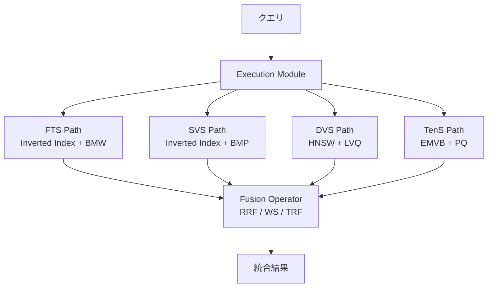
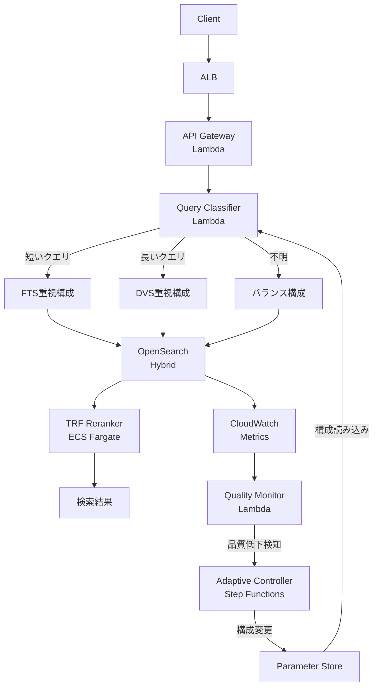

## 論文概要（Abstract）

本記事は [arXiv:2508.01405](https://arxiv.org/abs/2508.01405) の解説記事です。

ハイブリッド検索（lexical検索とsemantic検索の統合）は、Retrieval-Augmented Generation（RAG）をはじめとする現代の情報検索システムにおける基盤技術となっている。しかし、その設計空間は広大かつ複雑であり、検索パラダイム・融合手法・リランキング手法の間のトレードオフに関する体系的な理解は欠如していた。著者らは、オープンソースデータベースInfinityの開発経験を踏まえ、Full-Text Search（FTS）、Sparse Vector Search（SVS）、Dense Vector Search（DVS）、Tensor Search（TenS）の4つの検索パラダイムを11のデータセットで評価し、「Weakest Link」現象の実証、Tensor-based Re-ranking Fusion（TRF）の有効性の検証など、ハイブリッド検索アーキテクチャに関する初の体系的実験分析を報告している。

## 情報源

- **arXiv ID**: 2508.01405
- **URL**: [https://arxiv.org/abs/2508.01405](https://arxiv.org/abs/2508.01405)
- **著者**: Mengzhao Wang, Boyu Tan, Yunjun Gao, Hai Jin, Yingfeng Zhang, Xiangyu Ke, Xiaoliang Xu, Yifan Zhu（8名）
- **発表年**: 2025（v1: 2025年8月2日、v2: 2025年11月3日更新）
- **分野**: cs.DB
- **実装基盤**: Infinityオープンソースデータベース

## Zenn記事との関連

この記事は [Zenn記事: BM25×ベクトル検索のハイブリッド検索をRRFで実装しRAG精度を改善する](https://zenn.dev/0h_n0/articles/f22adb0924b5cf) の深掘りです。

Zenn記事では、BM25のトークナイザが言語に適合していない場合にハイブリッド検索の精度が単独ベクトル検索を下回る「失敗パターン」を実験的に示している（Hit Rate@10が0.8355から0.7819に低下）。本論文はこの現象を「Weakest Link」として11データセット、複数の融合手法・メトリクスにわたって体系的に実証しており、Zenn記事の知見を理論的・実験的に補強する内容となっている。

## 背景と動機（Background & Motivation）

RAGの普及により、検索精度の改善がLLMの回答品質に直結する時代となった。単一の検索手法では、語彙的なマッチングに強いBM25は同義語や概念的な類似性を捉えられず、ベクトル検索は固有名詞やID文字列の正確な一致が苦手という、相互補完的な弱点が知られている。

この課題に対し、複数の検索パラダイムの結果を融合する「ハイブリッド検索」が広く採用されるようになった。しかし、現実の設計空間は単純な「BM25 + ベクトル検索」にとどまらない。検索パラダイムだけでもFTS、SVS、DVS、TenSの4種が存在し、融合手法（RRF、Weighted Sum等）、リランキング手法（Cross-Encoder、TRF等）を組み合わせると、可能な構成は膨大になる。さらに、どの構成が最適かはデータセットの特性、クエリの長さ、利用可能な計算資源に依存する。

著者らは、このような複雑な設計空間において「どの検索パスを組み合わせるべきか」「融合手法は何を使うべきか」「リランキングは必要か」という実務的な問いに対し、体系的な実験的知見が不足していることを問題提起している。特に、品質の低い検索パスを組み合わせた場合に精度が低下する「Weakest Link」現象は、直感に反する重要な知見であり、実運用上の注意喚起として価値が高い。

## 主要な貢献（Key Contributions）

- **Weakest Link現象の実証**: 品質の低い検索パスが全体の精度を大幅に低下させる現象を、11データセット、複数のメトリクス・融合手法にわたって体系的に確認。候補リストサイズ $$k_0$$ の増加では緩和できないことを示した
- **4検索パラダイム×融合手法×リランキングの網羅的評価**: FTS、SVS、DVS、TenSの全11組み合わせ（2パス6通り、3パス4通り、4パス1通り）を精度・レイテンシ・メモリの3軸で比較し、万能な最適構成は存在しないことを示した
- **Tensor-based Re-ranking Fusion（TRF）の提案と有効性の検証**: 全パスのTensor Search実行と比べてメモリを86%削減しながら、RRFやWeighted Sumを上回る精度を達成するコスト効率の高い融合手法を示した

## 技術的詳細（Technical Details）

### 4つの検索パラダイム

著者らが評価した4つの検索パラダイムの定義とスコアリング関数を以下に示す。

**Full-Text Search（FTS）** は、BM25スコアリング関数に基づく語彙検索である。スコアは以下の式で計算される。

$$
\text{sim}(Q, D) = \sum_{i} \text{IDF}(q_i) \cdot \frac{f(q_i, D) \cdot (k_1 + 1)}{f(q_i, D) + k_1 \cdot \left(1 - b + b \cdot \frac{|D|}{\text{avgdl}}\right)}
$$

ここで $$f(q_i, D)$$ はクエリ語 $$q_i$$ の文書 $$D$$ 内での出現頻度、$$k_1 = 1.2$$ は飽和パラメータ、$$b = 0.75$$ は文書長正規化の強度である。Block-Max WAND（BMW）動的プルーニングにより検索を高速化している。

**Sparse Vector Search（SVS）** は、SPLADEなどの学習済みモデルにより生成された高次元スパースベクトル間の内積で関連度を算出する。

$$
\text{sim}(Q, D) = \mathbf{q}^\top \mathbf{d} = \sum_i q_i d_i
$$

BM25と異なり、学習により語彙を拡張（term expansion）するため、文書中に出現しない関連語にも重みを付与できる。ブロックサイズ8のBlock-Max Pruning（BMP）とhybrid inverted-forward indexingにより効率化されている。

**Dense Vector Search（DVS）** は、bi-encoderにより文書全体を単一の固定次元ベクトルに圧縮し、コサイン類似度やドット積で検索する。著者らの実装では $$M = 16$$、$$\text{ef\_construction} = 200$$ のHNSWグラフインデックスに、Locally-adaptive Vector Quantization（LVQ）による圧縮を組み合わせている。

**Tensor Search（TenS）** は、ColBERTのlate-interactionアーキテクチャに基づき、トークンレベルの多ベクトル表現でMaxSimスコアを計算する。

$$
\text{sim}(Q, D) = \sum_{i=1}^{N} \max_{j=1}^{M} \mathbf{q}_i^\top \mathbf{d}_j
$$

ここで $$N$$ はクエリのトークン数、$$M$$ は文書のトークン数である。トークン単位の細粒度マッチングにより高い精度が得られるが、全トークンのベクトルを保存するためストレージコストが桁違いに大きい。著者らは8192個のセントロイドと32サブスペースのProduct Quantization（PQ）を用いたEMVB手法で圧縮している。

### 融合手法

著者らは主に2つの融合手法を評価している。

**Reciprocal Rank Fusion（RRF）** は、各検索パスでの順位のみからスコアを算出するscore-agnosticな手法である。

$$
\text{RRF}(c) = \sum_{i=1}^{n} \frac{1}{\kappa + \text{rank}_i(c)}
$$

ここで $$\kappa = 60$$ は平滑化パラメータ、$$n$$ はパス数である。スコアの正規化が不要で実装が容易だが、各パスのスコア分布の情報を破棄するという制約がある。

**Weighted Sum（WS）** は、各パスのスコアを重み付き線形結合する手法である。

$$
\text{WS}(c) = \sum_{i=1}^{n} w_i \cdot \text{score}_i(c)
$$

重み $$w_i$$ は各パスの単独nDCG@10を使用している。スコア分布の情報を保持するが、スコアの正規化と重みの設定が必要となる。

### Tensor-based Re-ranking Fusion（TRF）

TRFは、初期検索パス（FTS、SVS、DVSの任意の組み合わせ）で取得した候補プールに対し、Tensor SearchのMaxSim計算をリランキングとして適用する手法である。全文書に対するTensor Searchを実行する4パス構成と比較して、候補プールの文書のみにMaxSimを適用するためメモリ使用量を86%削減できると著者らは報告している。同時に、トークンレベルのセマンティック検証により、RRFやWSを上回る精度を達成する。

### Infinityシステムのアーキテクチャ

著者らの評価基盤であるInfinityは、2モジュール構成を採用している。



Storage Moduleはカラムナーストレージ上に各パラダイム専用のインデックスを保持し、Execution ModuleはDAGベースのパイプラインでプッシュ型の並列実行を行う。各検索パスは並行して実行されるため、P99レイテンシは最も遅いパスに支配される。

## 実装のポイント: Weakest Link回避策

本論文の核心的な知見である「Weakest Link」現象は、実運用上きわめて重要な示唆を含んでいる。

### Weakest Link現象とは何か

著者らの実験において、TOUC(en)データセットではFTS単独のnDCG@10が0.650、DVS単独が0.390であった。この2パスをRRFで融合すると0.604となり、最良の単一パス（FTS: 0.650）を下回った。一方、DBPE(en)データセットではFTS（0.565）とSVS（0.479）の組み合わせがRRFで0.608となり、相乗的な改善が得られている（論文の実験結果より）。

この現象は以下の特性を持つと著者らは報告している。

1. **融合手法に依存しない**: RRF（rank-based）でもWS（score-aware）でも発生する
2. **候補数の増加では緩和できない**: 候補リストサイズ $$k_0$$ を増やしても改善しない
3. **複数のメトリクスで一貫**: nDCG@10、Recall@10、MRR@10のいずれでも確認される
4. **クエリ長と相関**: セマンティック検索は長い記述的クエリで優位、語彙検索は短いキーワードクエリで優位。クエリ特性により「弱いパス」が決まる

### 実務での回避策

Zenn記事で示した「BM25単独の品質をHit Rate 0.7以上で事前検証」というアプローチは、本論文の知見と整合する。具体的には以下の手順が推奨される。

1. **パスごとの品質評価を必ず行う**: 各検索パス単独でのnDCG@10を計測し、ベースラインを把握する
2. **弱いパスは除外する**: 最良パスとの差が大きい場合（目安として40%以上劣る場合）、そのパスの追加は精度低下リスクがある
3. **クエリ特性に応じた動的切り替えを検討する**: 短いキーワードクエリにはFTS重視、長い自然文クエリにはDVS重視といった条件分岐が有効
4. **TRFによるリランキングで緩和を試みる**: Weakest Link現象が発生するケースでも、TRFによるリランキングが精度低下を部分的に補償できる可能性がある

## Production Deployment Guide: アダプティブ・ハイブリッド検索アーキテクチャ

本論文の知見を実運用に適用する際、最大の課題は「Weakest Link」現象をリアルタイムに検知し、検索構成をデータ駆動で適応させることである。ここでは、AWSを基盤としたアダプティブ・ハイブリッド検索アーキテクチャの設計と実装を示す。

### アーキテクチャ概要



### コンポーネント設計

#### 1. Query Classifier: クエリ特性に基づく動的ルーティング

本論文が示すクエリ長とパス品質の相関を活用し、クエリ特性に基づいて検索構成を動的に選択する。

```python
"""Query Classifier: クエリ特性に基づく検索構成の動的選択."""

from dataclasses import dataclass
from enum import Enum


class SearchProfile(Enum):
    """検索プロファイル定義."""

    FTS_HEAVY = "fts_heavy"
    DVS_HEAVY = "dvs_heavy"
    BALANCED = "balanced"


@dataclass(frozen=True)
class SearchConfig:
    """検索構成パラメータ.

    Attributes:
        profile: 検索プロファイル種別
        fts_weight: FTSパスの重み（0.0-1.0）
        dvs_weight: DVSパスの重み（0.0-1.0）
        use_trf: TRFリランキングの有無
        candidate_k: 各パスの候補取得数
    """

    profile: SearchProfile
    fts_weight: float
    dvs_weight: float
    use_trf: bool
    candidate_k: int


# 論文の知見に基づくプロファイル定義
PROFILES: dict[SearchProfile, SearchConfig] = {
    SearchProfile.FTS_HEAVY: SearchConfig(
        profile=SearchProfile.FTS_HEAVY,
        fts_weight=0.7,
        dvs_weight=0.3,
        use_trf=False,
        candidate_k=20,
    ),
    SearchProfile.DVS_HEAVY: SearchConfig(
        profile=SearchProfile.DVS_HEAVY,
        fts_weight=0.3,
        dvs_weight=0.7,
        use_trf=True,
        candidate_k=30,
    ),
    SearchProfile.BALANCED: SearchConfig(
        profile=SearchProfile.BALANCED,
        fts_weight=0.5,
        dvs_weight=0.5,
        use_trf=True,
        candidate_k=20,
    ),
}


def classify_query(query: str) -> SearchConfig:
    """クエリ特性からプロファイルを選択する.

    論文の知見: 短いキーワードクエリではFTSが優位、
    長い記述的クエリではDVSが優位。

    Args:
        query: ユーザーのクエリ文字列

    Returns:
        選択された検索構成
    """
    token_count = len(query.split())

    if token_count <= 3:
        return PROFILES[SearchProfile.FTS_HEAVY]
    elif token_count >= 10:
        return PROFILES[SearchProfile.DVS_HEAVY]
    else:
        return PROFILES[SearchProfile.BALANCED]
```

#### 2. Quality Monitor: パスごとの品質をリアルタイム計測

Weakest Link検知の核心は、各検索パスの品質を継続的にモニタリングすることである。ユーザーのクリックログやLLM応答の引用率をimplicit relevance feedbackとして活用する。

```python
"""Quality Monitor: パスごとの検索品質をリアルタイム計測."""

import json
import logging
from dataclasses import dataclass
from datetime import UTC, datetime

import boto3

logger = logging.getLogger(__name__)

cloudwatch = boto3.client("cloudwatch")
ssm = boto3.client("ssm")


@dataclass(frozen=True)
class PathQualityMetrics:
    """各検索パスの品質メトリクス.

    Attributes:
        path_name: 検索パス名（fts, dvs, svs）
        ndcg_at_10: 推定nDCG@10（クリックログベース）
        mrr_at_10: 推定MRR@10
        sample_count: 計測サンプル数
        measured_at: 計測時刻
    """

    path_name: str
    ndcg_at_10: float
    mrr_at_10: float
    sample_count: int
    measured_at: str


def compute_implicit_ndcg(
    search_results: list[dict],
    clicked_doc_ids: set[str],
    k: int = 10,
) -> float:
    """クリックログからimplicit nDCG@kを推定する.

    Args:
        search_results: 検索結果リスト（順位順）
        clicked_doc_ids: クリックされた文書IDの集合
        k: 評価対象の上位件数

    Returns:
        推定nDCG@k値
    """
    import math

    dcg = 0.0
    for i, result in enumerate(search_results[:k]):
        if result["doc_id"] in clicked_doc_ids:
            dcg += 1.0 / math.log2(i + 2)

    # Ideal DCG: クリックされた文書が全て上位に来た場合
    ideal_dcg = sum(
        1.0 / math.log2(i + 2)
        for i in range(min(len(clicked_doc_ids), k))
    )

    if ideal_dcg == 0:
        return 0.0
    return dcg / ideal_dcg


def publish_path_quality(metrics: PathQualityMetrics) -> None:
    """CloudWatchにパス品質メトリクスを送信する.

    Args:
        metrics: パス品質メトリクス
    """
    cloudwatch.put_metric_data(
        Namespace="HybridSearch/PathQuality",
        MetricData=[
            {
                "MetricName": "nDCG@10",
                "Dimensions": [
                    {"Name": "SearchPath", "Value": metrics.path_name}
                ],
                "Value": metrics.ndcg_at_10,
                "Timestamp": datetime.now(tz=UTC),
            },
            {
                "MetricName": "MRR@10",
                "Dimensions": [
                    {"Name": "SearchPath", "Value": metrics.path_name}
                ],
                "Value": metrics.mrr_at_10,
                "Timestamp": datetime.now(tz=UTC),
            },
        ],
    )
    logger.info(
        "Published quality metrics",
        extra={
            "event": "path_quality_published",
            "path": metrics.path_name,
            "ndcg": metrics.ndcg_at_10,
        },
    )


def detect_weakest_link(
    path_metrics: list[PathQualityMetrics],
    degradation_threshold: float = 0.4,
) -> list[str]:
    """Weakest Linkとなるパスを検知する.

    論文の知見: 最良パスと比較して品質が大幅に劣るパスは
    融合時に全体の精度を低下させる。

    Args:
        path_metrics: 各パスの品質メトリクス
        degradation_threshold: 最良パスからの許容劣化率

    Returns:
        Weakest Linkとして検知されたパス名のリスト
    """
    if not path_metrics:
        return []

    best_ndcg = max(m.ndcg_at_10 for m in path_metrics)
    weak_paths = []

    for m in path_metrics:
        relative_gap = (best_ndcg - m.ndcg_at_10) / best_ndcg
        if relative_gap > degradation_threshold:
            weak_paths.append(m.path_name)
            logger.warning(
                "Weakest link detected",
                extra={
                    "event": "weakest_link_detected",
                    "path": m.path_name,
                    "ndcg": m.ndcg_at_10,
                    "best_ndcg": best_ndcg,
                    "gap": relative_gap,
                },
            )

    return weak_paths
```

#### 3. Adaptive Controller: 検索構成の自動調整

Weakest Linkを検知した場合に、検索構成を自動で調整する。AWS Step Functionsで安全なロールバックを含むワークフローを構築する。

```python
"""Adaptive Controller: Weakest Link検知時の構成自動調整."""

import json
import logging
from dataclasses import dataclass

import boto3

logger = logging.getLogger(__name__)

ssm = boto3.client("ssm")
sns = boto3.client("sns")

PARAM_PREFIX = "/hybrid-search/config"
SNS_TOPIC_ARN = "arn:aws:sns:ap-northeast-1:123456789012:hybrid-search-alerts"


@dataclass(frozen=True)
class AdaptiveAction:
    """構成変更アクション.

    Attributes:
        action_type: アクション種別
        target_path: 対象パス名
        previous_weight: 変更前の重み
        new_weight: 変更後の重み
        reason: 変更理由
    """

    action_type: str
    target_path: str
    previous_weight: float
    new_weight: float
    reason: str


def adjust_for_weakest_link(
    weak_paths: list[str],
    current_weights: dict[str, float],
) -> list[AdaptiveAction]:
    """Weakest Linkパスの重みを低減する.

    論文の知見に基づき、品質の低いパスの重みを下げ、
    強いパスに重みを再配分する。

    Args:
        weak_paths: Weakest Linkとして検知されたパス名
        current_weights: 現在の重み設定

    Returns:
        実行するアクションのリスト
    """
    actions: list[AdaptiveAction] = []
    strong_paths = [p for p in current_weights if p not in weak_paths]

    if not strong_paths:
        logger.error(
            "All paths detected as weak — skipping adjustment",
            extra={"event": "all_paths_weak", "paths": weak_paths},
        )
        return actions

    for weak_path in weak_paths:
        old_weight = current_weights.get(weak_path, 0.0)
        # 重みを半減（完全除外ではなく段階的に）
        new_weight = old_weight * 0.5
        redistributed = (old_weight - new_weight) / len(strong_paths)

        actions.append(
            AdaptiveAction(
                action_type="reduce_weight",
                target_path=weak_path,
                previous_weight=old_weight,
                new_weight=new_weight,
                reason=f"Weakest link detected: {weak_path}",
            )
        )

        for strong_path in strong_paths:
            strong_old = current_weights.get(strong_path, 0.0)
            actions.append(
                AdaptiveAction(
                    action_type="increase_weight",
                    target_path=strong_path,
                    previous_weight=strong_old,
                    new_weight=strong_old + redistributed,
                    reason=f"Redistributed from weak path: {weak_path}",
                )
            )

    return actions


def apply_actions(actions: list[AdaptiveAction]) -> None:
    """構成変更を Parameter Store に反映する.

    Args:
        actions: 実行するアクションのリスト
    """
    new_weights: dict[str, float] = {}
    for action in actions:
        new_weights[action.target_path] = action.new_weight

    ssm.put_parameter(
        Name=f"{PARAM_PREFIX}/weights",
        Value=json.dumps(new_weights),
        Type="String",
        Overwrite=True,
    )

    # 変更通知
    sns.publish(
        TopicArn=SNS_TOPIC_ARN,
        Subject="Hybrid Search: Configuration Adjusted",
        Message=json.dumps(
            [
                {
                    "action": a.action_type,
                    "path": a.target_path,
                    "old_weight": a.previous_weight,
                    "new_weight": a.new_weight,
                    "reason": a.reason,
                }
                for a in actions
            ],
            indent=2,
        ),
    )
    logger.info(
        "Configuration adjusted",
        extra={
            "event": "config_adjusted",
            "actions_count": len(actions),
        },
    )
```

#### 4. CloudWatch アラーム設定

パス品質の急激な低下を検知するCloudWatchアラームを設定する。

```python
"""CloudWatch Alarm: パス品質劣化のアラーム設定."""

import boto3

cloudwatch = boto3.client("cloudwatch")

SNS_TOPIC_ARN = "arn:aws:sns:ap-northeast-1:123456789012:hybrid-search-alerts"


def create_path_quality_alarm(
    path_name: str,
    threshold: float = 0.3,
) -> None:
    """パス品質低下アラームを作成する.

    Args:
        path_name: 監視対象の検索パス名
        threshold: nDCG@10のアラーム閾値
    """
    cloudwatch.put_metric_alarm(
        AlarmName=f"HybridSearch-WeakestLink-{path_name}",
        AlarmDescription=(
            f"Search path '{path_name}' nDCG@10 dropped below "
            f"{threshold} — potential Weakest Link"
        ),
        Namespace="HybridSearch/PathQuality",
        MetricName="nDCG@10",
        Dimensions=[{"Name": "SearchPath", "Value": path_name}],
        Statistic="Average",
        Period=300,
        EvaluationPeriods=3,
        Threshold=threshold,
        ComparisonOperator="LessThanThreshold",
        AlarmActions=[SNS_TOPIC_ARN],
        TreatMissingData="notBreaching",
    )


# 各パスにアラームを設定
for path in ["fts", "dvs", "svs"]:
    create_path_quality_alarm(path)
```

#### 5. OpenSearch ハイブリッド検索の実装

AWS OpenSearch Serviceでのハイブリッド検索実装例を示す。本論文のRRF融合をOpenSearchのsearch pipelineで実現する。

```python
"""OpenSearch Hybrid Search: 論文のRRF融合をOpenSearchで実装."""

from dataclasses import dataclass

from opensearchpy import OpenSearch


@dataclass(frozen=True)
class HybridSearchResult:
    """ハイブリッド検索結果.

    Attributes:
        doc_id: 文書ID
        title: 文書タイトル
        content: 文書本文
        hybrid_score: 融合スコア
        fts_rank: FTSでの順位（該当なしはNone）
        dvs_rank: DVSでの順位（該当なしはNone）
    """

    doc_id: str
    title: str
    content: str
    hybrid_score: float
    fts_rank: int | None
    dvs_rank: int | None


def hybrid_search(
    client: OpenSearch,
    index: str,
    query_text: str,
    query_vector: list[float],
    fts_weight: float = 0.5,
    dvs_weight: float = 0.5,
    k: int = 10,
) -> list[HybridSearchResult]:
    """RRFベースのハイブリッド検索を実行する.

    Args:
        client: OpenSearchクライアント
        index: インデックス名
        query_text: テキストクエリ
        query_vector: クエリの埋め込みベクトル
        fts_weight: FTSパスの重み
        dvs_weight: DVSパスの重み
        k: 取得件数

    Returns:
        ハイブリッド検索結果のリスト
    """
    body = {
        "size": k,
        "query": {
            "hybrid": {
                "queries": [
                    {
                        "match": {
                            "content": {
                                "query": query_text,
                                "boost": fts_weight,
                            }
                        }
                    },
                    {
                        "knn": {
                            "embedding": {
                                "vector": query_vector,
                                "k": k * 2,
                                "boost": dvs_weight,
                            }
                        }
                    },
                ]
            }
        },
        "search_pipeline": "hybrid-search-pipeline",
    }

    response = client.search(index=index, body=body)
    results = []
    for hit in response["hits"]["hits"]:
        results.append(
            HybridSearchResult(
                doc_id=hit["_id"],
                title=hit["_source"].get("title", ""),
                content=hit["_source"].get("content", ""),
                hybrid_score=hit["_score"],
                fts_rank=None,
                dvs_rank=None,
            )
        )
    return results
```

### デプロイ時の注意事項

本論文のレイテンシ計測結果（Table 6より）から、以下の点に注意する必要がある。

- **P99レイテンシは最も遅いパスに支配される**: 並列実行のため、平均レイテンシは改善するがP99は最遅パスに引きずられる。MLDR(en)ではFTS単独の0.53msに対し、4パス構成で1.01msと報告されている
- **TenSのメモリコストは桁違い**: MLDR(en)でDVSが791MBに対し、TenSは94GB（約119倍）。TRFリランキング方式を採用することで、TenSの精度恩恵をメモリ86%削減で享受できる
- **2パス構成が実務的なバランス点**: 3パス以上は精度の限界改善に対してリソース増加が大きく、diminishing returnsとなる

## 実験結果（Experimental Results）

著者らは11のデータセットで4パラダイム×融合手法×リランキングの網羅的な評価を行っている。以下に主要な結果を示す。

### データセット一覧

| データセット | ドメイン | タスク | コーパスサイズ |
|:---|:---|:---|---:|
| MSMA(en) | 雑多 | パッセージ検索 | 8.8M |
| DBPE(en) | Wikipedia | エンティティ検索 | 4.6M |
| MCCN(zh) | ニュース | 質問応答 | 935K |
| TOUC(en) | 雑多 | 議論検索 | 383K |
| MLDR(zh) | Wiki/Wudao | 長文書検索 | 200K |
| MLDR(en) | Wikipedia | 長文書検索 | 200K |
| TREC(en) | バイオメディカル | 医療情報検索 | 171K |
| FIQA(en) | 金融 | 質問応答 | 58K |
| CQAD(en) | StackExchange | 重複質問検索 | 40K |
| SCID(en) | 科学 | 引用予測 | 26K |
| SCIF(en) | 科学 | ファクトチェック | 5.2K |

### 主要な定量的結果

DBPE(en)データセットにおける2パス構成のnDCG@10比較（論文の実験結果より）:

| 構成 | RRF | TRF | 改善幅 |
|:---|:---:|:---:|:---:|
| FTS + SVS | 0.608 | 0.835 | +37.3% |
| FTS + DVS | 0.668 | 0.722 | +8.1% |
| DVS + SVS | 0.674 | 0.711 | +5.5% |

MLDR(en)データセットにおける3パス構成:

| 構成 | RRF | TRF |
|:---|:---:|:---:|
| FTS + SVS + DVS | 0.624 | 0.693 |

TRFがRRFを一貫して上回っていることが確認できる。特にFTS + SVSの組み合わせでは37.3%もの改善が得られており、Tensor Searchのトークンレベルマッチングの効果が顕著である。

### レイテンシとリソースのトレードオフ

MLDR(en)でのレイテンシ計測（論文Table 6より）:

| 構成 | 平均レイテンシ | P99レイテンシ |
|:---|:---:|:---:|
| FTS単独 | 0.37ms | 0.53ms |
| 4パス（FTS+SVS+DVS+TenS） | 0.87ms | 1.01ms |

メモリ使用量（MLDR(en)、論文の実験結果より）:

| パラダイム | インデックスサイズ |
|:---|:---:|
| FTS | 3.1GB |
| SVS | 4.4GB |
| DVS | 791MB |
| TenS | 94GB |

TenSのインデックスサイズはDVSの約119倍であり、全文書のトークンベクトルを保持するコストの大きさが明確である。

## 実運用への応用（Practical Implications）

本論文の知見から、実運用のハイブリッド検索システム設計に対して以下の示唆が得られる。

**構成選択のフレームワーク**: 万能な最適構成は存在しないため、精度・レイテンシ・メモリの3軸でトレードオフを明示的に評価する必要がある。まず2パス構成（FTS + DVS）から始め、評価データセットで十分な精度が得られるか確認し、不足する場合のみパスの追加やTRFリランキングを検討するのが合理的である。

**Weakest Link回避の運用フロー**: 新しいドメインやデータセットに対してハイブリッド検索を導入する際は、(1) 各パス単独の品質計測、(2) パス間の品質差の確認、(3) 品質差が大きい場合の弱パス除外またはTRFによるリランキング、という段階的なアプローチが推奨される。Zenn記事で示したように、日本語のBM25ではトークナイザの選択が品質を大きく左右するため、言語固有の前処理品質が特に重要となる。

**TRFの実務的価値**: Cross-Encoderリランカーは論文の計測で100倍以上遅く、512トークンの入力制限により長文書で品質が低下する。TRFはトークンレベルのセマンティック検証を低コストで提供するため、レイテンシ制約の厳しい本番環境での実用性が高い。

## 関連研究（Related Work）

ハイブリッド検索の融合手法としては、RRF（Cormack et al., 2009）が広く使われている。Weaviateのrelative score fusionや、min-max正規化後の加重合計も実用的な選択肢である。リランキングの文脈では、Cross-Encoderベースの手法（BGE-reranker、GTE-reranker等）が高精度だが推論コストが高い。ColBERTv2（Santhanam et al., 2022）のlate-interactionアーキテクチャは本論文のTensor Searchの基盤となっている。SPLADEv2（Formal et al., 2021）はSparse Vector Searchの代表的なモデルであり、語彙拡張により語彙検索とセマンティック検索の橋渡しを行う。

本論文の独自性は、これらの個別技術を横断的に組み合わせた設計空間の体系的評価にある。従来研究の多くが特定の融合手法やリランキング手法の改善に焦点を当てていたのに対し、本論文はシステム全体のトレードオフを実証的に明らかにしている点で貢献がある。

## まとめ

本論文は、ハイブリッド検索の設計空間における精度・レイテンシ・メモリのトレードオフを、4つの検索パラダイムと11のデータセットにわたって体系的に評価した。核心的な知見である「Weakest Link」現象は、品質の低い検索パスの追加が融合結果を悪化させるという、直感に反するが実務上きわめて重要な事実を実証している。

実運用においては、(1) パスごとの品質を事前に評価すること、(2) クエリ特性に応じた動的な構成選択を検討すること、(3) TRFリランキングをコスト効率の高い精度向上手段として活用すること、が推奨される。Zenn記事で示した「BM25の品質が低いとハイブリッド検索が逆効果」という知見は、本論文により11データセットで追認されたことになる。

## 参考文献

1. Wang, M., Tan, B., Gao, Y., Jin, H., Zhang, Y., Ke, X., Xu, X., & Zhu, Y. (2025). Balancing the Blend: An Experimental Analysis of Trade-offs in Hybrid Search. arXiv:2508.01405. [https://arxiv.org/abs/2508.01405](https://arxiv.org/abs/2508.01405)
2. Cormack, G. V., Clarke, C. L., & Buettcher, S. (2009). Reciprocal rank fusion outperforms condorcet and individual rank learning methods. SIGIR.
3. Santhanam, K., Khattab, O., Saad-Falcon, J., Potts, C., & Zaharia, M. (2022). ColBERTv2: Effective and Efficient Retrieval via Lightweight Late Interaction. NAACL.
4. Formal, T., Piwowarski, B., & Clinchant, S. (2021). SPLADE v2: Sparse Lexical and Expansion Model for Information Retrieval. arXiv:2109.10086.
5. Infinity Database. [https://github.com/infiniflow/infinity](https://github.com/infiniflow/infinity)
6. BM25×ベクトル検索のハイブリッド検索をRRFで実装しRAG精度を改善する. [https://zenn.dev/0h_n0/articles/f22adb0924b5cf](https://zenn.dev/0h_n0/articles/f22adb0924b5cf)
