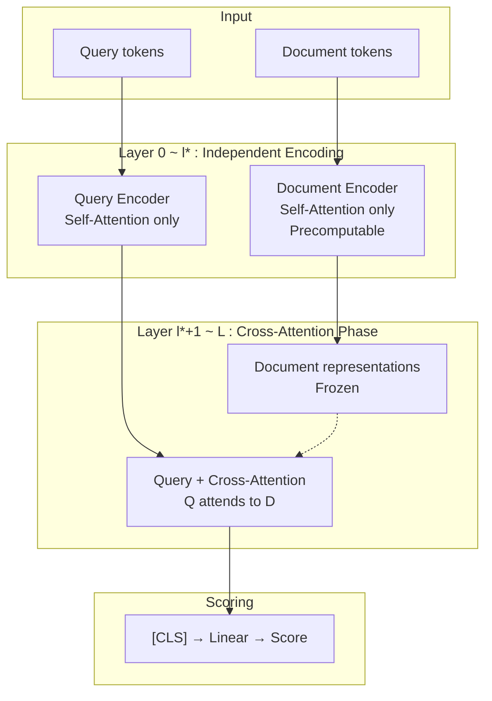

## 論文概要

本記事は [arXiv:2602.16299](https://arxiv.org/abs/2602.16299) の解説記事です。

MICE（Minimal Interaction Cross-Encoders）は、標準的なCross-Encoderから「有害または不要なインタラクション」を段階的に除去することで、Late Interactionに近いアーキテクチャを導出する手法である。著者らは、Cross-Encoderの内部Attention構造を分析し、クエリ・ドキュメント間の全結合的なAttentionの多くが性能に寄与していないことを示した。MICEはCross-Encoderと比較して推論レイテンシを4分の1に削減しつつ、ColBERTと同等以上の検索精度を達成し、特にドメイン外データセットでの汎化性能において優位性を示すと報告されている。

この記事は [Zenn記事: BM25×ベクトル検索のハイブリッド検索をRRFで実装しRAG精度を改善する](https://zenn.dev/0h_n0/articles/f22adb0924b5cf) の深掘りです。

## 情報源

- **arXiv ID**: 2602.16299
- **URL**: [https://arxiv.org/abs/2602.16299](https://arxiv.org/abs/2602.16299)
- **著者**: Mathias Vast, Victor Morand, Benjamin Piwowarski et al.（Sorbonne Universite, CNRS）
- **発表年**: 2026
- **分野**: cs.IR（Information Retrieval）
- **コード**: [https://github.com/xpmir/mice](https://github.com/xpmir/mice)

## 背景と動機

情報検索（IR）における検索精度とレイテンシのトレードオフは、長年にわたる課題である。現代のRAGパイプラインでは、BM25やベクトル検索による一次検索の後にRerankerを適用する二段階構成が一般的だが、このRerankerの推論コストがパイプライン全体のボトルネックとなっている。

検索モデルは大きく3つのカテゴリに分類される。

**Bi-Encoder**はクエリとドキュメントを独立にエンコードし、単一ベクトルの内積やコサイン類似度でスコアリングする。事前にドキュメントベクトルを計算しておけるため高速だが、クエリとドキュメント間の細粒度なインタラクションを捉えられず精度に限界がある。

**Cross-Encoder**はクエリとドキュメントを連結して1つのTransformerに入力し、全トークン間のFull Attentionで関連度を計算する。最高精度を達成するが、ドキュメントごとにフォワードパスが必要なため、100件のリランキングで50〜200msのレイテンシが発生する。

**Late Interaction（ColBERT）**はクエリとドキュメントを独立にエンコードした後、トークンレベルのMaxSim演算で類似度を計算する。ドキュメント表現を事前計算できるためCross-Encoderより高速だが、Full Attentionがないため精度はCross-Encoderに及ばない。

MICEはこの3つの中間に位置する新しいアプローチとして、「Cross-Encoderの精度を可能な限り維持しながら、Late Interactionに匹敵する速度を実現する」ことを目指す。著者らの着眼点は、Cross-Encoderの内部Attention構造を詳細に分析すれば、性能に寄与しないインタラクションを特定・除去できるという仮説である。

## 主要な貢献

- **貢献1: Cross-Encoder内部のインタラクション分析**: 著者らはCross-Encoderのself-attention maskを段階的に制限する体系的な実験を行い、クエリ-ドキュメント間のどのインタラクションが性能維持に不可欠で、どれが除去可能かを明らかにした
- **貢献2: MICEアーキテクチャの提案**: 分析結果に基づき、初期レイヤでは独立エンコーディング、後半レイヤではクエリからドキュメントへの一方向Cross-Attentionのみを許容する効率的なアーキテクチャを設計した。ドキュメント表現の事前計算により、Cross-Encoderの4倍の速度を達成する
- **貢献3: ドメイン外汎化性能の向上**: MICEはインタラクションを制限することで過学習が抑制され、BEIR 13データセットでの平均nDCG@10がベースラインCross-Encoderを上回る。MiniLMベースではベースラインの44.7から50.4へと+5.7ポイント改善した

## 技術的詳細

### Cross-Encoderのインタラクション構造

標準的なCross-Encoderへの入力は以下の形式で構成される。

$$
\text{input} = [\text{CLS}] \; q_1 \ldots q_n \; [\text{SEP}_1] \; d_1 \ldots d_m \; [\text{SEP}_2]
$$

ここで $q_1, \ldots, q_n$ はクエリトークン、$d_1, \ldots, d_m$ はドキュメントトークンである。標準的なself-attentionでは、各トークンは入力系列中の全トークンにattendできるため、クエリとドキュメント間で双方向の情報伝達が行われる。

著者らはこの情報伝達を $Y \leftarrow X$（XからYへの情報流入を許可）と $Y \nleftarrow X$（XからYへの情報流入を遮断）という記法で整理し、以下の段階的なマスキングステップを設計した。

### 段階的マスキング

**Step 0: 特殊トークンの分離**

$$
[\text{SEP}] \nleftarrow \{[\text{CLS}], Q, D\}, \quad \{Q, [\text{SEP}], D\} \nleftarrow [\text{CLS}]
$$

[SEP]トークンと[CLS]トークンを他のトークンから分離する。ただし、クエリトークンは$[\text{SEP}_1]$にのみ、ドキュメントトークンは$[\text{SEP}_2]$にのみattendできるようにする（attention sink機構）。

**Step 1: [CLS]からドキュメントへの直接アクセス遮断**

$$
[\text{CLS}] \nleftarrow \{D, [\text{SEP}_2]\}
$$

Step 0に加え、分類トークン[CLS]がドキュメントトークンを直接参照することを禁止する。これにより[CLS]はクエリ情報のみを保持する。著者らは、この制約がドメイン外汎化性能を大幅に改善することを発見した。MiniLMではBEIR平均nDCG@10が49.5から48.0へわずかに低下する一方、再学習後は50.2へと改善した。

**Step 2: ドキュメントからクエリへの情報流入遮断**

$$
D \nleftarrow Q
$$

ドキュメントトークンがクエリトークンを参照することを禁止する。これにより、ドキュメント表現がクエリに依存しなくなり、事前計算が可能になる。

**Step 3: クエリからドキュメントへの情報流入を部分的に遮断**

$$
Q \nleftarrow D \quad (\text{layer } 0 \text{ to } \ell^*)
$$

初期レイヤ（$0$からレイヤ$\ell^*$まで）では、クエリとドキュメントを完全に独立にエンコードする。レイヤ$\ell^*$以降でのみ、クエリからドキュメントへのcross-attentionを許可する。最適な$\ell^*$はモデルごとに異なり、MiniLM-L12では$\ell^* = 4$（12レイヤ中）、Ettin-32Mでは$\ell^* = 6$（10レイヤ中）、Ettin-17Mでは$\ell^* = 3$（7レイヤ中）と報告されている。

### MICEアーキテクチャの全体像



MICEの推論時、ドキュメント表現はレイヤ$\ell^*$までの独立エンコーディング結果を事前計算・キャッシュしておける。クエリが入力されると、クエリのみをレイヤ$\ell^*$まで独立にエンコードし、レイヤ$\ell^*$以降でキャッシュ済みドキュメント表現との一方向cross-attentionを計算する。

### レイヤドロッピング

著者らはさらに、バックボーンモデルの後半レイヤ（元々Masked Language Modelingタスクに特化していた層）が不要であることを発見し、これを除去する。具体的な構成は以下の通りである。

| モデル | 総レイヤ数 | 独立層 ($\ell^*$) | Cross-Attention層 | 最終構成 | パラメータ数 |
|--------|-----------|-------------------|-------------------|----------|-------------|
| MiniLM-L12 | 12 | 4 | 3 | MICE-$\ell$4+3 | 26.3M |
| Ettin-32M | 10 | 6 | 3 | MICE-$\ell$6+3 | 32M |
| Ettin-17M | 7 | 3 | 3 | MICE-$\ell$3+3 | 17M |

MiniLM MICE-$\ell$4+3は、12レイヤ中7レイヤのみを使用し（4層の独立エンコーディング + 3層のcross-attention）、パラメータ数を33.4Mから26.3Mに削減している。

### 学習手法

MICEの学習にはMarginMSE損失関数が使用される。教師モデルのスコア$s_{\text{teacher}}$と生徒モデルのスコア$s_{\text{student}}$について、正例ペア$(q, d^+)$と負例ペア$(q, d^-)$のマージンを保持するように学習する。

$$
\mathcal{L}_{\text{MarginMSE}} = \left( (s_{\text{teacher}}^+ - s_{\text{teacher}}^-) - (s_{\text{student}}^+ - s_{\text{student}}^-) \right)^2
$$

ここで$s^+$は正例に対するスコア、$s^-$は負例に対するスコアを表す。教師信号にはMS MARCO passage ranking datasetのRe-rankerスコアが使用された。学習ステップ数125,000、バッチサイズ32、学習率$7 \times 10^{-6}$、ウォームアップ5,000ステップで訓練が行われたと報告されている。

## 実装のポイント

MICEを既存システムに適用する際の重要な実装上の考慮点を整理する。

**ドキュメント表現の事前計算**: MICEの速度優位性はドキュメント表現の事前計算に大きく依存する。レイヤ$\ell^*$までのTransformer出力をオフラインで計算し、ベクトルストアに格納しておく必要がある。512トークンのドキュメントの場合、MiniLMベースでは$512 \times 384$次元（384はhidden dimension）の行列をドキュメントごとに保存する。ColBERTの圧縮済みトークン埋め込みと比較してストレージコストが増大する点に注意が必要である。

**Attention Maskの実装**: 標準的なTransformerライブラリ（HuggingFace Transformers等）のself-attention実装に対してカスタムattention maskを適用する必要がある。具体的にはマスク対象のlogitを$-\infty$に設定し、softmax後にゼロになるようにする。PyTorchの`torch.nn.functional.scaled_dot_product_attention`のattn_maskパラメータを使用できる。

**Cross-Attention層の初期化**: レイヤ$\ell^*$以降のcross-attention重みは、元のself-attention重みから初期化される。新たなアーキテクチャ固有の重みを追加するのではなく、既存の重みを流用してマスキングで挙動を変更するため、学習の収束が速い。

**既存Cross-Encoderからの移行**: 著者らは既訓練のCross-Encoderに直接マスクを適用した場合（off-the-shelf適用）の性能劣化も調査している。MiniLMベースではStep 0〜1のマスキングで大きな劣化は見られなかったが（nDCG@10: 45.7→44.4）、Step 2では大幅に低下した（27.8）。Ettin系モデルではStep 0でも壊滅的な性能低下が観測された。したがって、MICEの適用には再学習が不可欠である。

## Production Deployment Guide

MICEモデルをリランキングサービスとしてAWSにデプロイする方法を解説する。MICEの最大の利点であるドキュメント表現の事前計算を活用し、推論レイテンシとコストを最適化する構成を示す。

### AWS実装パターン（コスト最適化重視）

MICEは26.3M〜33.4Mパラメータの軽量モデルであり、GPU推論が必須ではないケースもある。トラフィック量に応じた3パターンを示す。

**Small構成（〜100 req/日）: Lambda + S3**

- AWS Lambda（ARM64、1024MB メモリ）でMICEモデルを推論
- S3にドキュメント事前計算済みベクトルを保存
- API Gateway経由でリクエストを受信
- 月額概算: $30-80（Lambda実行料 + S3ストレージ + API Gateway）
- MICEの26.3Mパラメータ（約100MB）はLambdaのメモリ制限内で動作可能
- コールドスタート対策としてProvisioned Concurrencyを1に設定（月額+$15程度）

**Medium構成（〜1000 req/日）: ECS Fargate + ElastiCache**

- ECS Fargate（2vCPU、4GB メモリ）でMICEモデルをサービング
- ElastiCache（Redis）にドキュメントベクトルをキャッシュ
- ALB経由でリクエストを分散
- 月額概算: $200-500
- Auto Scaling: CPU使用率70%を閾値に1-4タスクでスケーリング
- ドキュメントベクトルのRedisキャッシュにより、S3アクセスを削減

**Large構成（10000+ req/日）: EKS + GPU Spot Instances**

- EKS上でTriton Inference Serverを使用
- g5.xlarge（NVIDIA A10G）Spot Instancesで推論
- Karpenterによるノードの自動プロビジョニング
- 月額概算: $1,500-3,500（Spot利用時）
- バッチ推論でGPU使用率を最大化
- 事前計算済みドキュメントベクトルはEFSに格納

**コスト削減テクニック**:

- **Spot Instances活用**: g5.xlargeのSpot価格はオンデマンドの60-70%引き。GPU推論ワークロードはステートレスなため、Spot中断時も再試行で対応可能
- **ONNX Runtime最適化**: MICEモデルをONNX形式に変換し、CPU推論の場合でもONNX Runtimeにより2-3倍の高速化が可能
- **バッチ処理**: 複数クエリのリランキングリクエストをバッチ化し、GPU使用率を向上。MICEの場合、ドキュメント表現は事前計算済みのため、クエリ側のバッチ処理のみで効率化できる

### Terraformインフラコード

**Small構成（Serverless）**

```hcl
# Lambda + S3 構成
terraform {
  required_providers {
    aws = {
      source  = "hashicorp/aws"
      version = "~> 5.0"
    }
  }
}

provider "aws" {
  region = "ap-northeast-1"
}

# S3: ドキュメント事前計算ベクトル格納
resource "aws_s3_bucket" "doc_vectors" {
  bucket = "mice-reranker-doc-vectors"
}

resource "aws_s3_bucket_lifecycle_configuration" "doc_vectors_lifecycle" {
  bucket = aws_s3_bucket.doc_vectors.id

  rule {
    id     = "transition-to-ia"
    status = "Enabled"

    transition {
      days          = 30
      storage_class = "STANDARD_IA"
    }
  }
}

# IAM Role for Lambda
resource "aws_iam_role" "mice_lambda_role" {
  name = "mice-reranker-lambda-role"

  assume_role_policy = jsonencode({
    Version = "2012-10-17"
    Statement = [{
      Action = "sts:AssumeRole"
      Effect = "Allow"
      Principal = { Service = "lambda.amazonaws.com" }
    }]
  })
}

resource "aws_iam_role_policy_attachment" "lambda_basic" {
  role       = aws_iam_role.mice_lambda_role.name
  policy_arn = "arn:aws:iam::aws:policy/service-role/AWSLambdaBasicExecutionRole"
}

resource "aws_iam_role_policy" "s3_read" {
  name = "s3-doc-vectors-read"
  role = aws_iam_role.mice_lambda_role.id

  policy = jsonencode({
    Version = "2012-10-17"
    Statement = [{
      Effect   = "Allow"
      Action   = ["s3:GetObject"]
      Resource = "${aws_s3_bucket.doc_vectors.arn}/*"
    }]
  })
}

# Lambda Function
resource "aws_lambda_function" "mice_reranker" {
  function_name = "mice-reranker"
  role          = aws_iam_role.mice_lambda_role.arn
  handler       = "handler.lambda_handler"
  runtime       = "python3.12"
  architectures = ["arm64"]
  memory_size   = 1024
  timeout       = 30
  filename      = "lambda_package.zip"

  environment {
    variables = {
      DOC_VECTORS_BUCKET = aws_s3_bucket.doc_vectors.bucket
      MODEL_PATH         = "/opt/mice_model"
      MICE_LAYERS        = "4+3"
    }
  }
}

# API Gateway
resource "aws_apigatewayv2_api" "mice_api" {
  name          = "mice-reranker-api"
  protocol_type = "HTTP"
}

resource "aws_apigatewayv2_integration" "lambda_integration" {
  api_id             = aws_apigatewayv2_api.mice_api.id
  integration_type   = "AWS_PROXY"
  integration_uri    = aws_lambda_function.mice_reranker.invoke_arn
  payload_format_version = "2.0"
}

resource "aws_apigatewayv2_route" "rerank_route" {
  api_id    = aws_apigatewayv2_api.mice_api.id
  route_key = "POST /rerank"
  target    = "integrations/${aws_apigatewayv2_integration.lambda_integration.id}"
}

# CloudWatch Alarm: Lambda Duration
resource "aws_cloudwatch_metric_alarm" "lambda_duration" {
  alarm_name          = "mice-reranker-high-latency"
  comparison_operator = "GreaterThanThreshold"
  evaluation_periods  = 3
  metric_name         = "Duration"
  namespace           = "AWS/Lambda"
  period              = 300
  statistic           = "Average"
  threshold           = 5000
  alarm_description   = "MICE reranker latency exceeds 5s"

  dimensions = {
    FunctionName = aws_lambda_function.mice_reranker.function_name
  }
}
```

**Large構成（Container）**

```hcl
# EKS + Karpenter + Spot 構成
module "eks" {
  source          = "terraform-aws-modules/eks/aws"
  version         = "~> 20.0"
  cluster_name    = "mice-reranker-cluster"
  cluster_version = "1.31"
  vpc_id          = module.vpc.vpc_id
  subnet_ids      = module.vpc.private_subnets

  eks_managed_node_groups = {
    system = {
      instance_types = ["m7i.large"]
      min_size       = 2
      max_size       = 3
      desired_size   = 2
    }
  }
}

# Karpenter Provisioner: GPU Spot優先
resource "kubectl_manifest" "karpenter_provisioner" {
  yaml_body = yamlencode({
    apiVersion = "karpenter.sh/v1"
    kind       = "NodePool"
    metadata   = { name = "mice-gpu" }
    spec = {
      template = {
        spec = {
          requirements = [
            { key = "karpenter.sh/capacity-type", operator = "In", values = ["spot", "on-demand"] },
            { key = "node.kubernetes.io/instance-type", operator = "In", values = ["g5.xlarge", "g5.2xlarge"] },
          ]
          nodeClassRef = { name = "default" }
        }
      }
      limits   = { cpu = "64", memory = "256Gi", "nvidia.com/gpu" = "8" }
      disruption = {
        consolidationPolicy = "WhenEmptyOrUnderutilized"
        consolidateAfter    = "30s"
      }
    }
  })
}

# Secrets Manager: Model Registry Credentials
resource "aws_secretsmanager_secret" "model_registry" {
  name = "mice-reranker/model-registry"
}

# Cost Explorer Budget Alert
resource "aws_budgets_budget" "mice_monthly" {
  name         = "mice-reranker-monthly"
  budget_type  = "COST"
  limit_amount = "4000"
  limit_unit   = "USD"
  time_unit    = "MONTHLY"

  notification {
    comparison_operator       = "GREATER_THAN"
    threshold                 = 80
    threshold_type            = "PERCENTAGE"
    notification_type         = "ACTUAL"
    subscriber_email_addresses = ["ops@example.com"]
  }
}
```

### 運用・監視設定

**CloudWatch Logs Insights クエリ: レイテンシ分析**

```
fields @timestamp, @message
| filter @message like /rerank_latency/
| stats avg(latency_ms) as avg_latency,
        p50(latency_ms) as p50,
        p95(latency_ms) as p95,
        p99(latency_ms) as p99
  by bin(1h)
| sort @timestamp desc
```

**CloudWatch Logs Insights クエリ: MICE vs Cross-Encoderコスト比較**

```
fields @timestamp, model_type, latency_ms, doc_count
| filter model_type in ["mice", "cross_encoder"]
| stats avg(latency_ms) as avg_latency,
        count(*) as request_count
  by model_type, bin(1d)
```

**CloudWatch アラーム: 推論レイテンシ**

```json
{
  "AlarmName": "mice-reranker-p95-latency",
  "MetricName": "InferenceLatency",
  "Namespace": "MICEReranker",
  "Statistic": "p95",
  "Period": 300,
  "EvaluationPeriods": 3,
  "Threshold": 200,
  "ComparisonOperator": "GreaterThanThreshold",
  "AlarmActions": ["arn:aws:sns:ap-northeast-1:ACCOUNT:ops-alerts"]
}
```

**X-Ray トレーシング設定**

```python
from aws_xray_sdk.core import xray_recorder, patch_all

patch_all()

@xray_recorder.capture("mice_rerank")
def rerank(query: str, documents: list[str]) -> list[float]:
    subsegment = xray_recorder.current_subsegment()
    subsegment.put_annotation("doc_count", len(documents))
    subsegment.put_annotation("model", "mice-l4+3")

    # ドキュメントベクトル取得
    with xray_recorder.capture("fetch_doc_vectors"):
        doc_vectors = fetch_precomputed_vectors(documents)

    # MICE推論
    with xray_recorder.capture("mice_inference"):
        scores = mice_model.score(query, doc_vectors)

    subsegment.put_metadata("latency_breakdown", {
        "vector_fetch_ms": vector_fetch_time,
        "inference_ms": inference_time,
    })
    return scores
```

### コスト最適化チェックリスト

**アーキテクチャ選択**: トラフィック量で判断。100 req/日以下ならServerless（Lambda）、1000 req/日前後ならFargate、10000+ならEKS+GPU。MICEの軽量さ（26.3M params）を活かし、CPU推論で済む場合はGPUコストを回避する。

**MICEの事前計算活用**: ドキュメントベクトルの事前計算はMICEの最大の強み。新規ドキュメント追加時のみバッチ処理でベクトルを計算し、S3/ElastiCacheに格納する。これにより推論時のGPU使用を「クエリエンコーディング + 3層のcross-attention」に限定できる。

**ONNX/TensorRT変換**: MICEモデルをONNX Runtime（CPU）またはTensorRT（GPU）に変換することで、PyTorch比で2-4倍の高速化が可能。特にカスタムattention maskの最適化が重要であり、静的maskのためコンパイル時に最適化できる。

**監視・アラート**: AWS Budgets（月額上限）、CloudWatch（レイテンシp95）、Cost Anomaly Detection（日次異常検知）を設定。MICE導入前後でのコスト比較を日次レポートで可視化し、Cross-Encoder比でのコスト削減効果を定量的に追跡する。

**リソース管理**: 未使用のドキュメントベクトルはS3ライフサイクルポリシーで自動アーカイブ。タグ戦略として`Project=mice-reranker`、`Environment=prod/staging`を統一適用。夜間トラフィック減少時はFargate/EKSのスケールインを積極的に設定する。

## 実験結果

### In-Domain性能（MS MARCO, TREC DL19, DL20）

著者らはMS MARCO passage ranking、TREC Deep Learning 2019/2020の3データセットでin-domain性能を評価している。以下に主要な結果を示す（nDCG@10、5シードの平均値）。

| モデル | MSM | DL19 | DL20 | ID平均 |
|--------|-----|------|------|--------|
| MiniLM Cross-Encoder | 45.7 | 75.5 | 73.6 | 64.9 |
| MiniLM MICE-$\ell$4+3 | 42.1 | 72.6 | 69.3 | 61.3 |
| ColBERTv2（110M） | 45.0 | 74.6 | 73.4 | 64.3 |
| ColBERTv2（MiniLM再現） | 37.3 | 67.8 | 66.3 | 57.2 |
| BM25 | - | - | - | 42.5 |

MiniLM MICE-$\ell$4+3はベースラインCross-Encoderから3.6ポイントの低下（64.9→61.3）に留まっている。同一バックボーン（MiniLM）のColBERTv2再現と比較すると、+4.1ポイントの優位性を示す。

### Out-of-Domain性能（BEIR 13データセット）

ドメイン外汎化性能がMICEの最も顕著な強みである。

| モデル | BEIR nDCG@10平均 |
|--------|-----------------|
| MiniLM Cross-Encoder | 44.7 |
| MiniLM Mask [1]（再学習） | 50.2 |
| MiniLM MICE-$\ell$4+3 | **50.4** |
| ColBERTv2（110M） | 47.8 |
| ColBERTv2（MiniLM再現） | 42.6 |
| BM25 | 43.0 |

著者らによると、MiniLM MICE-$\ell$4+3はベースラインCross-Encoderを+5.7ポイント上回り、110Mパラメータの標準ColBERTv2をも+2.6ポイント上回っている。この結果は、Cross-Encoderの全結合的なAttentionがドメイン外データで過学習を引き起こしており、インタラクションの制限がregularization効果を持つことを示唆している。

### レイテンシ比較

12GB NVIDIA TITAN-V GPUでのバッチサイズ128、512トークンドキュメントにおけるレイテンシ測定結果が以下の通り報告されている。

| モデル | パラメータ | レイテンシ (ms) | スループット (docs/sec) | ピークメモリ | 事前計算 |
|--------|-----------|----------------|----------------------|-------------|---------|
| Cross-Encoder | 33.4M | 470.22 | 267 | 1193 MB | 不可 |
| MICE-$\ell$4+3 | 26.3M | 113.28 | 1,130 | 598 MB | あり |
| ColBERT | 33.4M | 130.36 | 982 | 332 MB | あり |
| MICE（事前計算なし） | 33.4M | 241.05 | 531 | 1072 MB | なし |

事前計算ありの構成で、MICEはCross-Encoderの約4.2倍の速度を達成し、ColBERTとほぼ同等のレイテンシ（113ms vs 130ms）で動作する。メモリ使用量はColBERTの332MBに対して598MBと大きいが、Cross-Encoderの1193MBからは半減している。

## 実運用への応用

MICEはハイブリッド検索パイプラインのリランキング段階に直接適用できる。BM25とベクトル検索をRRFで統合した一次検索（本Zenn記事で解説されている構成）の後段に配置することで、リランキングのレイテンシを大幅に削減できる。

**リランキングパイプラインの構成例**: 一次検索（BM25 + ベクトル検索 + RRF）で候補100件を取得し、MICEで上位10〜20件にリランキングする。Cross-Encoderでは100件のリランキングに約470msかかるところ、MICEでは約113ms（事前計算あり）で完了する。これはRAGアプリケーションにおけるユーザ体感レイテンシに直接影響する改善である。

**適用が有効なシナリオ**: ドメイン外クエリが多い汎用検索システム（社内ナレッジベースなど）ではMICEの汎化性能が活きる。一方、特定ドメインに特化した検索（医療文献検索など）では、ドメイン内性能が約3.6ポイント低下することを許容できるか検討が必要である。

**制約と注意点**: MICEのドキュメント事前計算はリアルタイム更新が頻繁なコンテンツには不向きである。ドキュメントが更新されるたびにレイヤ$\ell^*$までのフォワードパスを再計算する必要がある。また、MICEは現時点では小〜中規模モデル（17M〜33Mパラメータ）でのみ検証されており、大規模モデルでの効果は今後の検証が待たれる。

## 関連研究

MICEは以下の研究の延長線上に位置づけられる。

**ColBERTv2**（Santhanam et al., 2022）はLate Interactionの代表的手法であり、トークンレベルのMaxSim演算でクエリ-ドキュメント類似度を計算する。MICEはCross-Encoderの構造からLate Interactionに近いアーキテクチャを「導出」するという点でアプローチが異なる。

**jina-reranker-v3**（Wang et al., 2025; arXiv:2509.25085）は0.6Bパラメータのリスト単位リランカーであり、BEIR nDCG@10で61.94を達成している。「last but not late」と呼ばれる手法で、因果的attentionを用いて複数ドキュメントを同時にスコアリングする。MICEとは規模・アプローチが異なるが、Cross-Encoderの効率化という共通の課題に取り組んでいる。

**PreTTR**（MacAvaney et al., 2020）やSparse CE（Schlatt et al., 2024）もCross-Encoderの効率化を目指した先行研究であり、MICEはこれらの手法と比較してより体系的なインタラクション分析に基づく設計が特徴とされている。

## まとめ

MICEは、Cross-Encoderのself-attention構造を段階的に分析・制限することで、Late Interactionに匹敵する推論効率とCross-Encoderに近い検索精度を両立するアーキテクチャである。特に注目すべきは、インタラクションの制限がドメイン外汎化性能を改善するという発見であり、BEIR 13データセットでベースラインCross-Encoderを+5.7ポイント上回ったと報告されている。

ハイブリッド検索パイプラインにおけるリランキングのボトルネック解消に向けて、MICEは「Cross-Encoderの精度をどこまで維持しつつ速度を改善できるか」という問いに対する実践的な回答を提供している。26.3Mパラメータという軽量さとドキュメント表現の事前計算可能性は、プロダクション環境での実用性を高める重要な特性である。

## 参考文献

1. Vast, M., Morand, V., van Cooten, B., Soulier, L., Mothe, J., & Piwowarski, B. (2026). MICE: Minimal Interaction Cross-Encoders for efficient Re-ranking. arXiv:2602.16299. [https://arxiv.org/abs/2602.16299](https://arxiv.org/abs/2602.16299)
2. Santhanam, K., Khattab, O., Potts, C., & Zaharia, M. (2022). ColBERTv2: Effective and Efficient Retrieval via Lightweight Late Interaction. arXiv:2112.01488. [https://arxiv.org/abs/2112.01488](https://arxiv.org/abs/2112.01488)
3. Wang, B. et al. (2025). jina-reranker-v3: Last but Not Late Interaction for Listwise Document Reranking. arXiv:2509.25085. [https://arxiv.org/abs/2509.25085](https://arxiv.org/abs/2509.25085)
4. MacAvaney, S. et al. (2020). Efficient Document Re-Ranking for Transformers by Precomputing Term Representations (PreTTR). SIGIR 2020.
5. Hofstätter, S. et al. (2020). Improving Efficient Neural Ranking Models with Cross-Architecture Knowledge Distillation. arXiv:2010.02666.
6. Schlatt, F. et al. (2024). Sparsifying Cross-Encoders for Efficient Retrieval.
7. MICE GitHub Repository: [https://github.com/xpmir/mice](https://github.com/xpmir/mice)
