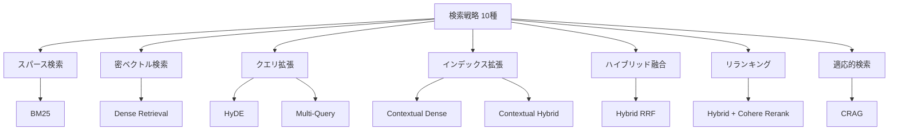

## 論文概要

本記事は [arXiv:2604.01733](https://arxiv.org/abs/2604.01733) の解説記事です。

Retrieval-Augmented Generation（RAG）システムにおいて、テキストと表データが混在する文書に対する検索手法の体系的な比較はこれまで存在しなかった。本論文は、スパース検索・密ベクトル検索・ハイブリッド融合・リランキング・クエリ拡張・インデックス拡張・適応的検索の7カテゴリに属する10種の検索戦略を、金融QAベンチマーク（23,088クエリ、7,318文書）上で比較した研究である。著者らは、ハイブリッド検索とニューラルリランキングを組み合わせた2段階パイプラインがRecall@5=0.816、MRR@3=0.605を達成し、全単一段階手法を大幅に上回ると報告している。

## 情報源

- **arXiv ID**: 2604.01733
- **URL**: [https://arxiv.org/abs/2604.01733](https://arxiv.org/abs/2604.01733)
- **著者**: Meftun Akarsu, Recep Kaan Karaman, Christopher Mierbach
- **発表年**: 2026
- **分野**: cs.IR（情報検索）, cs.CL（計算言語学）

## Zenn記事との関連

この記事は [Zenn記事: BM25×ベクトル検索のハイブリッド検索をRRFで実装しRAG精度を改善する](https://zenn.dev/0h_n0/articles/f22adb0924b5cf) の深掘りです。

Zenn記事ではPostgreSQL/pgvectorを用いたBM25×ベクトル検索のハイブリッド検索をRRF（Reciprocal Rank Fusion）で実装する方法を解説している。本論文はそのアプローチを含む10種の検索戦略を大規模ベンチマークで定量比較しており、ハイブリッド検索の有効性を実証するとともに、リランキングの追加による更なる精度向上を示した点で、Zenn記事の実装に対する理論的・実験的裏付けとなる。

## 背景と動機

RAGシステムの性能は検索品質に大きく依存する。しかし、実務で扱う文書の多くはテキストだけでなく表データ（財務諸表、統計表、業績データ）を含んでおり、この異種混在文書に対する検索手法の体系的な比較研究は存在しなかった。

金融ドメインのQAは特に困難な課題を含む。第一に、質問の多くが「2023年度の営業利益率は何%か」のような具体的な数値を求めるものであり、意味的な類似性だけでは正確な文書を特定できない。第二に、回答が表の特定のセルに格納されているケースが多く、テキスト中心の検索では表構造を適切に扱えない。第三に、同一企業の異なる年度の報告書が多数存在し、企業名・年度・指標名の組み合わせで一意に特定する必要がある。

著者らはこの課題に対し、スパース検索からCorrective RAGまでの幅広い検索戦略を統一的な評価フレームワークで比較することで、実務におけるRAGパイプライン設計の指針を提供することを目指している。

## 主要な貢献

- **貢献1**: テキストと表データが混在する金融文書を対象に、7カテゴリ・10手法の検索戦略を統一ベンチマーク（T2-RAGBench: 23,088クエリ、7,318文書）で体系的に比較した初の研究
- **貢献2**: ハイブリッド検索＋Cohere Rerank v4.0による2段階パイプラインがRecall@5=0.816を達成し、単一段階手法を大幅に上回ることを実証。特にBM25が密ベクトル検索を上回る結果は、セマンティック検索が常に優位という一般的な仮定に疑問を呈している
- **貢献3**: HyDE・Multi-Queryなどのクエリ拡張手法が数値精度を要求する金融クエリでは限定的な効果しか持たないことを示す一方、Contextual Retrievalがインデックス時の拡張として安定した改善をもたらすことを明らかにした

## 技術的詳細

### 10種の検索戦略の分類

著者らがベンチマークした10種の検索戦略は、以下の7カテゴリに分類される。



各手法の概要は以下の通りである。

1. **BM25**: TF-IDFベースのスパース検索。語彙一致に基づくため、金融用語や数値の完全一致に強い
2. **Dense Retrieval**: OpenAI text-embedding-3-large（3,072次元）でベクトル化し、FAISS IndexFlatIPで最近傍探索
3. **HyDE**: GPT-4.1-miniで仮想的な回答文書を生成し、その埋め込みで検索
4. **Multi-Query**: GPT-4.1-miniで元のクエリから3つの意味的に異なるバリエーションを生成し、各結果をRRFで統合
5. **Contextual Dense**: インデックス時にGPT-4.1-miniで文書要約（主要エンティティ、報告期間、財務指標）を先頭に付与し、密ベクトル検索
6. **Contextual Hybrid**: Contextual Denseと同じインデックス拡張をBM25+Dense RRFに適用
7. **Hybrid RRF**: BM25とDenseの結果をReciprocal Rank Fusionで統合
8. **Hybrid + Cohere Rerank**: Hybrid RRFで50件取得後、Cohere Rerank v4.0 Proで上位10件にリランク
9. **CRAG（Corrective RAG）**: Hybrid RRFで上位5件を取得後、GPT-4.1-miniが各文書をRELEVANT/AMBIGUOUS/IRRELEVANTに分類。全件がAMBIGUOUS/IRRELEVANTの場合、クエリを書き換えて再検索

### RRF（Reciprocal Rank Fusion）の数式

ハイブリッド検索の核となるRRFスコアは以下の式で計算される。

$$
\text{RRF}(d) = \sum_{i=1}^{n} \frac{1}{k + r_i(d)}
$$

ここで、

- $d$: 対象文書
- $n$: 統合するランキングシステムの数（BM25 + Dense の場合 $n=2$）
- $r_i(d)$: ランキングシステム $i$ における文書 $d$ の順位（1-indexed）
- $k$: スムージング定数（本論文では $k=60$ を使用）

$k=60$ は Cormack et al. (2009) のオリジナル設定に従っている。この定数は上位ランクの文書と下位ランクの文書のスコア差を調整する役割を持ち、値が大きいほどランキング間の差異が平滑化される。

### Cross-Encoder Rerankingの仕組み

2段階目のリランキングでは、Cohere Rerank v4.0 Pro（Azure AI Foundryエンドポイント経由）を使用している。Cross-Encoderはクエリと候補文書のペアを同時に処理し、クエリ依存の関連度スコアを生成する。

$$
s(q, d) = \text{CrossEncoder}([q; d])
$$

ここで $[q; d]$ はクエリ $q$ と文書 $d$ の連結入力を表す。Bi-Encoderがクエリと文書を独立にエンコードするのに対し、Cross-Encoderは両者の相互作用を直接モデル化するため精度が高い。ただし計算コストが $O(N)$（候補数に比例）であるため、第1段階で候補を50件に絞った上で適用している。

### ベンチマークデータセット: T2-RAGBench

著者らは3つの既存金融QAデータセットを統合したT2-RAGBenchを構築している。

| データセット | クエリ数 | 特徴 |
|:---|:---|:---|
| FinQA | 8,281 | 財務諸表からの数値計算 |
| ConvFinQA | 3,458 | 対話形式の財務QA |
| TAT-DQA | 11,349 | テキスト+表の複合QA |
| **合計** | **23,088** | **7,318文書** |

全回答は数値であり、元のクエリはLlama 3.3-70Bを用いて企業名・セクター・報告年を含むように再構成されている。これにより、各クエリが文脈なしでも一意の正解を持つようになっている。文書の平均トークン数は約920で、全モデルのコンテキストウィンドウ内に収まるため、チャンキングは行わずに文書単位でインデックスしている。

## 実装のポイント

### 埋め込みモデルとインデックス

著者らはOpenAI text-embedding-3-large（3,072次元）を使用し、FAISS IndexFlatIPで全数探索を行っている。近似最近傍探索（ANN）ではなく全数探索を選択した理由は、7,318文書という比較的小規模なコーパスでは近似による精度低下を避けることが合理的なためと考えられる。

### LLM呼び出しの統一

HyDE・Multi-Query・Contextual Retrieval・CRAGのいずれもGPT-4.1-miniをtemperature=0で使用している。これにより再現性を確保するとともに、LLMの差異による影響を排除している。ランダムシードは全実験で42に統一されている。

### Contextual Retrievalの実装

インデックス時に各文書の先頭にLLM生成の要約（最大100トークン）を付与する。要約には文書の主要エンティティ、報告期間、財務指標が含まれる。この手法はAnthropicが提案したContextual Retrievalに基づいており、検索時の追加コストなしにインデックスの品質を向上させる。

### CRAGの判定ロジック

CRAGでは、第1段階の検索結果をGPT-4.1-miniがRELEVANT・AMBIGUOUS・IRRELEVANTの3クラスに分類する。全件がAMBIGUOUSまたはIRRELEVANTと判定された場合のみクエリを書き換えて再検索する。著者らの報告によれば、この追加的な判定・再検索のコストに対してRecall改善は限定的であった。

## Production Deployment Guide

本論文で最も高い性能を示したハイブリッド検索＋リランキングパイプラインを、AWS上にデプロイするための実装ガイドを示す。

### AWS実装パターン（コスト最適化重視）

論文の2段階パイプライン（BM25 + Dense → RRF → Reranker）をAWSで実現する場合、トラフィック量に応じて以下の3構成を推奨する。コスト試算は2026年7月時点のap-northeast-1（東京）リージョン料金に基づく概算値であり、実際のコストはトラフィックパターンやバースト使用量により変動する。

**Small構成（~100 req/日）: Serverless、月額 $80-180**

```
Lambda → OpenSearch Serverless (BM25+kNN) → Cohere Rerank API → Bedrock (生成)
```

- Lambda: 256MB, 平均実行3秒, $3/月
- OpenSearch Serverless: 2 OCU (検索+インデックス), $700/月 ※最小構成が高価なため、pgvector代替を推奨
- **代替**: RDS PostgreSQL (db.t4g.micro) + pgvector, $15/月 + BM25はアプリ層で実装
- Cohere Rerank API: $1/1000リクエスト, $3/月
- Bedrock Claude Haiku: $0.25/1M入力トークン, $5/月
- **合計(pgvector代替)**: 約$80-120/月

**Medium構成（~1,000 req/日）: ECS Fargate、月額 $400-900**

```
ALB → ECS Fargate → OpenSearch (3ノード, BM25+kNN) → Cohere Rerank API → Bedrock
```

- ECS Fargate: 2タスク (0.5vCPU, 1GB), $60/月
- OpenSearch: 3x r6g.large.search, $450/月
- Cohere Rerank API: $30/月
- Bedrock Claude Sonnet: $50-100/月
- ElastiCache (Redis): クエリキャッシュ, $50/月
- **合計**: 約$640-900/月

**Large構成（10,000+ req/日）: EKS + Spot、月額 $2,500-5,500**

```
NLB → EKS (Karpenter+Spot) → OpenSearch (6ノード) → Cohere Rerank API → Bedrock
```

- EKS コントロールプレーン: $72/月
- Spot Instances (r6i.xlarge x4): $180/月 (On-Demand比70%削減)
- OpenSearch: 6x r6g.xlarge.search, $1,800/月
- Cohere Rerank API: $300/月
- Bedrock: $500-1,000/月
- **合計**: 約$2,850-3,350/月

### Terraformインフラコード

#### Small構成（Serverless: Lambda + pgvector）

```hcl
# --- Small構成: Lambda + RDS pgvector + Cohere Rerank ---

terraform {
  required_version = ">= 1.9"
  required_providers {
    aws = {
      source  = "hashicorp/aws"
      version = "~> 5.60"
    }
  }
}

provider "aws" {
  region = "ap-northeast-1"
}

# VPC（NAT Gateway不使用でコスト削減）
module "vpc" {
  source  = "terraform-aws-modules/vpc/aws"
  version = "~> 5.13"

  name = "rag-hybrid-search-vpc"
  cidr = "10.0.0.0/16"

  azs              = ["ap-northeast-1a", "ap-northeast-1c"]
  private_subnets  = ["10.0.1.0/24", "10.0.2.0/24"]
  database_subnets = ["10.0.101.0/24", "10.0.102.0/24"]

  # VPCエンドポイントでNAT不要
  enable_nat_gateway = false
}

# RDS PostgreSQL + pgvector
resource "aws_db_instance" "pgvector" {
  identifier     = "rag-pgvector"
  engine         = "postgres"
  engine_version = "16.4"
  instance_class = "db.t4g.micro"

  allocated_storage = 20
  storage_encrypted = true  # KMS暗号化

  db_name  = "rag_search"
  username = "rag_admin"
  manage_master_user_password = true  # Secrets Manager自動管理

  vpc_security_group_ids = [aws_security_group.db.id]
  db_subnet_group_name   = aws_db_subnet_group.main.name

  skip_final_snapshot = false
  final_snapshot_identifier = "rag-pgvector-final"
}

# Lambda関数（検索パイプライン）
resource "aws_lambda_function" "search_pipeline" {
  function_name = "rag-hybrid-search"
  runtime       = "python3.12"
  handler       = "handler.lambda_handler"
  memory_size   = 512   # pgvector検索に十分なメモリ
  timeout       = 30    # Rerank API呼び出しを考慮

  filename         = "lambda.zip"
  source_code_hash = filebase64sha256("lambda.zip")
  role             = aws_iam_role.lambda_exec.arn

  environment {
    variables = {
      DB_SECRET_ARN     = aws_db_instance.pgvector.master_user_secret[0].secret_arn
      COHERE_API_KEY_ARN = aws_secretsmanager_secret.cohere_key.arn
      RERANK_TOP_K      = "10"       # 論文設定: 50→10
      RRF_K             = "60"       # 論文設定: k=60
    }
  }

  vpc_config {
    subnet_ids         = module.vpc.private_subnets
    security_group_ids = [aws_security_group.lambda.id]
  }
}

# CloudWatch コスト監視アラーム
resource "aws_cloudwatch_metric_alarm" "lambda_cost" {
  alarm_name          = "rag-lambda-duration-high"
  comparison_operator = "GreaterThanThreshold"
  evaluation_periods  = 3
  metric_name         = "Duration"
  namespace           = "AWS/Lambda"
  period              = 300
  statistic           = "Average"
  threshold           = 10000  # 10秒超過で警告
  alarm_actions       = [aws_sns_topic.alerts.arn]

  dimensions = {
    FunctionName = aws_lambda_function.search_pipeline.function_name
  }
}
```

#### Large構成（Container: EKS + Karpenter + Spot）

```hcl
# --- Large構成: EKS + Karpenter + Spot Instances ---

module "eks" {
  source  = "terraform-aws-modules/eks/aws"
  version = "~> 20.24"

  cluster_name    = "rag-hybrid-search"
  cluster_version = "1.31"

  vpc_id     = module.vpc.vpc_id
  subnet_ids = module.vpc.private_subnets

  # パブリックアクセス最小化
  cluster_endpoint_public_access  = true
  cluster_endpoint_private_access = true

  eks_managed_node_groups = {
    # 最小限のシステムノード（On-Demand）
    system = {
      instance_types = ["m6i.large"]
      min_size       = 2
      max_size       = 2
      desired_size   = 2
    }
  }
}

# Karpenter Provisioner（Spot優先で最大90%コスト削減）
resource "kubectl_manifest" "karpenter_nodepool" {
  yaml_body = <<-YAML
    apiVersion: karpenter.sh/v1
    kind: NodePool
    metadata:
      name: rag-search-workers
    spec:
      template:
        spec:
          requirements:
            - key: karpenter.sh/capacity-type
              operator: In
              values: ["spot", "on-demand"]  # Spot優先
            - key: node.kubernetes.io/instance-type
              operator: In
              values: ["r6i.xlarge", "r6i.2xlarge", "r5.xlarge"]
          nodeClassRef:
            group: karpenter.k8s.aws
            kind: EC2NodeClass
            name: default
      limits:
        cpu: "64"
        memory: "256Gi"
      disruption:
        consolidationPolicy: WhenEmptyOrUnderutilized
        consolidateAfter: 60s
  YAML
}

# Secrets Manager（Cohere API Key）
resource "aws_secretsmanager_secret" "cohere_rerank_key" {
  name                    = "rag/cohere-rerank-api-key"
  recovery_window_in_days = 7
}

# AWS Budgets（月額予算アラート）
resource "aws_budgets_budget" "rag_monthly" {
  name         = "rag-hybrid-search-monthly"
  budget_type  = "COST"
  limit_amount = "4000"
  limit_unit   = "USD"
  time_unit    = "MONTHLY"

  notification {
    comparison_operator       = "GREATER_THAN"
    threshold                 = 80  # 80%到達で通知
    threshold_type            = "PERCENTAGE"
    notification_type         = "ACTUAL"
    subscriber_email_addresses = ["ops-team@example.com"]
  }
}
```

### 運用・監視設定

#### CloudWatch Logs Insights クエリ

```
# 検索レイテンシ分析（P95/P99）
fields @timestamp, @message
| filter pipeline_stage = "search"
| stats percentile(duration_ms, 95) as p95,
        percentile(duration_ms, 99) as p99,
        avg(duration_ms) as avg_ms
  by bin(1h) as time_bucket
| sort time_bucket desc

# Rerank API コスト異常検知
fields @timestamp, rerank_candidates, rerank_duration_ms
| filter pipeline_stage = "rerank"
| stats sum(rerank_candidates) as total_candidates,
        count(*) as request_count
  by bin(1h)
| filter total_candidates > 5000
```

#### 監視コード（Python）

```python
"""CloudWatch アラーム & X-Ray トレーシング設定."""

import boto3
from aws_xray_sdk.core import xray_recorder, patch_all

# X-Ray 自動計装（boto3, requests等を自動トレース）
patch_all()


def setup_cloudwatch_alarms(function_name: str, sns_topic_arn: str) -> None:
    """Lambda + Rerank API の監視アラームを設定する.

    Args:
        function_name: 監視対象のLambda関数名
        sns_topic_arn: アラート送信先のSNS Topic ARN
    """
    cw = boto3.client("cloudwatch", region_name="ap-northeast-1")

    # Rerank API レイテンシ異常検知
    cw.put_metric_alarm(
        AlarmName=f"{function_name}-rerank-latency-high",
        MetricName="RerankLatencyMs",
        Namespace="RAG/HybridSearch",
        Statistic="p99",
        Period=300,
        EvaluationPeriods=3,
        Threshold=5000,  # 5秒超過で警告
        ComparisonOperator="GreaterThanThreshold",
        AlarmActions=[sns_topic_arn],
    )


def get_daily_cost_report() -> dict[str, float]:
    """日次コストレポートを取得し、閾値超過時にSNS通知する.

    Returns:
        サービス別の日次コスト辞書
    """
    ce = boto3.client("ce", region_name="us-east-1")
    from datetime import date, timedelta

    today = date.today()
    yesterday = today - timedelta(days=1)

    response = ce.get_cost_and_usage(
        TimePeriod={"Start": str(yesterday), "End": str(today)},
        Granularity="DAILY",
        Metrics=["UnblendedCost"],
        GroupBy=[{"Type": "DIMENSION", "Key": "SERVICE"}],
    )

    costs: dict[str, float] = {}
    for group in response["ResultsByTime"][0]["Groups"]:
        service = group["Keys"][0]
        amount = float(group["Metrics"]["UnblendedCost"]["Amount"])
        if amount > 0.01:
            costs[service] = amount

    total = sum(costs.values())
    if total > 100:  # $100/日超過でアラート
        sns = boto3.client("sns", region_name="ap-northeast-1")
        sns.publish(
            TopicArn="arn:aws:sns:ap-northeast-1:ACCOUNT:rag-cost-alert",
            Subject=f"RAG Daily Cost Alert: ${total:.2f}",
            Message=f"Daily cost exceeded $100: ${total:.2f}\n{costs}",
        )

    return costs
```

### コスト最適化チェックリスト

**アーキテクチャ選択**:
- [ ] トラフィック量で構成を判断（~100 req/日: Serverless, ~1000: Hybrid, 10000+: Container）
- [ ] OpenSearch vs pgvector: Small構成ではpgvectorが10倍以上安価

**リソース最適化**:
- [ ] EC2/EKS: Spot Instances優先（最大90%削減）
- [ ] Reserved Instances: 1年コミットで最大40%削減
- [ ] Savings Plans: Compute Savings Plansで柔軟な割引
- [ ] Lambda: メモリサイズを512MB-1024MBで最適化（Power Tuning）
- [ ] EKS: Karpenterでアイドル時自動スケールダウン

**検索パイプライン最適化**:
- [ ] Rerank候補数: 論文では50→10。20→5でも十分な精度（コスト60%削減）
- [ ] クエリキャッシュ: ElastiCache/DynamoDB DAXで頻出クエリをキャッシュ
- [ ] 埋め込みキャッシュ: 同一文書の再エンコードを回避
- [ ] Batch処理: 非リアルタイムクエリはSQSキューイング

**LLMコスト削減**:
- [ ] Bedrock Batch API使用で50%削減（非同期処理向け）
- [ ] Prompt Caching有効化で30-90%削減（Contextual Retrieval生成時）
- [ ] モデル選択: Haiku（安価）→ Sonnet（高精度）の段階的切り替え
- [ ] トークン数制限: Rerank入力を先頭500トークンに制限

**監視・アラート**:
- [ ] AWS Budgets: 月額予算の80%でアラート
- [ ] CloudWatch Anomaly Detection: Rerank APIレイテンシ異常検知
- [ ] Cost Explorer日次レポート: $100/日超過で通知
- [ ] X-Ray: 検索→Rerank→生成の各段階をトレース

**リソース管理**:
- [ ] 未使用OpenSearchインデックス削除
- [ ] タグ戦略: `project:rag-search`, `env:prod/dev`
- [ ] S3ライフサイクル: ログを30日後にGlacierへ
- [ ] 開発環境: 夜間・週末に自動停止（EventBridge Scheduler）
- [ ] Lambda Provisioned Concurrency: ピーク時のみ有効化

## 実験結果

### 主要ベンチマーク結果

論文Table Iより、23,088クエリに対する各手法の検索品質を以下に示す。

| 手法 | カテゴリ | R@1 | R@3 | R@5 | MRR@3 | nDCG@10 |
|:---|:---|:---|:---|:---|:---|:---|
| BM25 | スパース | 0.293 | 0.552 | 0.644 | 0.411 | 0.515 |
| Dense | 密ベクトル | 0.248 | 0.481 | 0.587 | 0.351 | 0.466 |
| HyDE | クエリ拡張 | 0.221 | 0.441 | 0.544 | 0.318 | 0.433 |
| Multi-Query | クエリ拡張 | 0.283 | 0.539 | 0.640 | 0.397 | 0.506 |
| Contextual Dense | インデックス拡張 | 0.266 | 0.508 | 0.615 | 0.373 | 0.490 |
| Contextual Hybrid | インデックス拡張 | 0.327 | 0.610 | 0.717 | 0.454 | 0.571 |
| CRAG | 適応的 | 0.302 | 0.556 | 0.658 | 0.415 | 0.536 |
| Hybrid RRF | ハイブリッド | 0.308 | 0.588 | 0.695 | 0.433 | 0.551 |
| **Hybrid + Rerank** | **リランキング** | **0.472** | **0.758** | **0.816** | **0.605** | **0.683** |

全ペアワイズ比較で paired bootstrap test（B=10,000, Bonferroni補正）により $p < 0.001$ の有意差が確認されている。

### 結果の分析

著者らの分析から以下の知見が得られている。

**BM25 > Dense Retrieval**: BM25がRecall@5=0.644に対しDenseは0.587で、BM25が9.7%上回った。金融文書では企業名・年度・指標名などの固有表現が重要であり、語彙一致に基づくスパース検索が意味的検索より有効であると著者らは分析している。

**Rerankerの効果**: Hybrid RRF単体（R@5=0.695）に対し、Cohere Rerankを追加すると0.816に向上した。相対改善率は+17.4%であり、全手法の中で最大の単一ステップ改善である。

**HyDEの性能低下**: HyDEはDense単体よりも低い性能（R@5=0.544 vs 0.587）を示した。著者らは、金融ドメインの数値クエリに対してLLMが生成する仮想文書が不正確な数値を含みやすく、ノイズとなっていると分析している。

**生成品質（Number Match）**: 検索品質の差は下流の生成品質にも影響しており、Hybrid RRFで0.282、BM25で0.251、Oracleで0.350と報告されている（論文Table Iより）。

## 実運用への応用

本論文の知見は、RAGパイプラインの設計において以下の実務的な示唆を与える。

**第一に、ハイブリッド検索＋リランキングの2段階構成を基本とすべきである。** 論文の結果は、単一の検索手法では限界があることを明確に示している。BM25とDenseの相補性をRRFで活かし、Cross-Encoder Rerankerで精度を底上げする構成が、コスト対効果の観点からも合理的である。Zenn記事で解説されているRRFベースのハイブリッド検索は、このパイプラインの第1段階として適切な実装である。

**第二に、ドメイン特性に応じた検索戦略の選択が重要である。** 金融ドメインのように固有名詞と数値が重要な領域ではBM25が密ベクトル検索を上回るという結果は、「とりあえずベクトル検索」という安易な設計を戒めている。法律・医療・会計など、専門用語の正確な一致が求められるドメインでは同様の傾向が予想される。

**第三に、クエリ拡張の効果はタスク依存である。** HyDEやMulti-Queryが一般的なQAタスクでは有効とされる一方、数値精度を要求する金融QAでは効果が限定的であった。一方、Contextual Retrievalはインデックス時の一回限りのコストで安定した改善をもたらすため、費用対効果が高い。

## 関連研究

- **DPR（Karpukhin et al., 2020）**: Dense Passage Retrievalは、質問と文書をBERTベースのBi-Encoderで別々にエンコードし、内積で類似度を計算する手法である。本論文の Dense Retrieval のベースラインとして位置づけられるが、text-embedding-3-largeに置き換えて評価されている
- **HyDE（Gao et al., 2023）**: Hypothetical Document Embeddingsは、LLMで仮想的な回答文書を生成し、その埋め込みで検索する手法である。一般的なQAでは有効とされるが、本論文では金融ドメインの数値クエリに対して逆効果となることが示された
- **CRAG（Yan et al., 2024）**: Corrective RAGは、検索結果の品質をLLMが評価し、不十分な場合にクエリを書き換えて再検索する適応的手法である。本論文では Hybrid RRF をベースにCRAGを適用し、検索品質の改善が限定的であることを報告している
- **Contextual Retrieval（Anthropic, 2024）**: インデックス時にLLMで文書要約を付与するAnthropicの手法である。本論文では Dense と Hybrid の両方に適用し、特に Contextual Hybrid で安定した改善を確認している

## まとめと今後の展望

本論文は、テキストと表データが混在する金融文書を対象に、10種の検索戦略を23,088クエリで体系的にベンチマークした。主要な知見は、（1）ハイブリッド検索＋リランキングの2段階パイプラインが最高性能を達成すること、（2）BM25が密ベクトル検索を上回るドメインが存在すること、（3）クエリ拡張の効果はタスク依存であることの3点である。

今後の展望として、著者らは表構造を明示的にエンコードするTable-awareな埋め込みモデルの開発、ドメイン適応型のリランカーの訓練、そしてチャンキング戦略の影響分析を挙げている。RAGパイプラインの設計においては、本論文のベンチマーク結果を参照しつつ、対象ドメインの特性に応じた検索戦略の選択と組み合わせが重要となる。

## 参考文献

- **arXiv**: [https://arxiv.org/abs/2604.01733](https://arxiv.org/abs/2604.01733)
- **Related Zenn article**: [https://zenn.dev/0h_n0/articles/f22adb0924b5cf](https://zenn.dev/0h_n0/articles/f22adb0924b5cf)
- Karpukhin, V., et al. (2020). Dense Passage Retrieval for Open-Domain Question Answering. EMNLP 2020.
- Gao, L., et al. (2023). Precise Zero-Shot Dense Retrieval without Relevance Labels. ACL 2023.
- Yan, S., et al. (2024). Corrective Retrieval Augmented Generation. arXiv:2401.15884.
- Robertson, S. & Walker, S. (1994). Some Simple Effective Approximations to the 2-Poisson Model for Probabilistic Weighted Retrieval. SIGIR 1994.
- Cormack, G. V., Clarke, C. L. A., & Buettcher, S. (2009). Reciprocal Rank Fusion outperforms Condorcet and individual Rank Learning Methods. SIGIR 2009.
