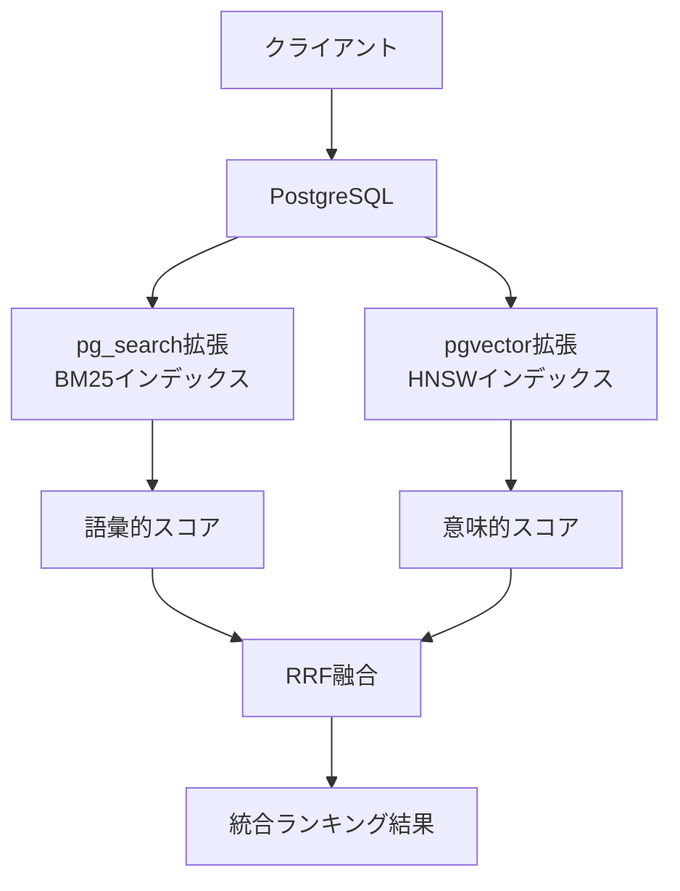
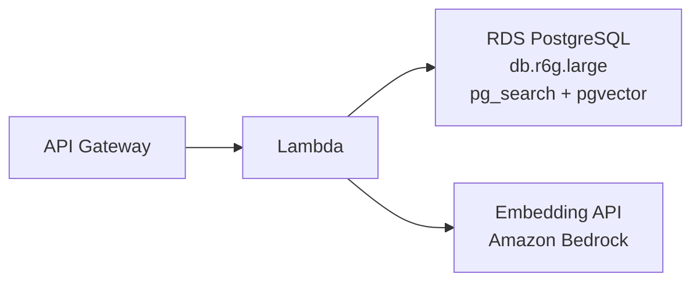
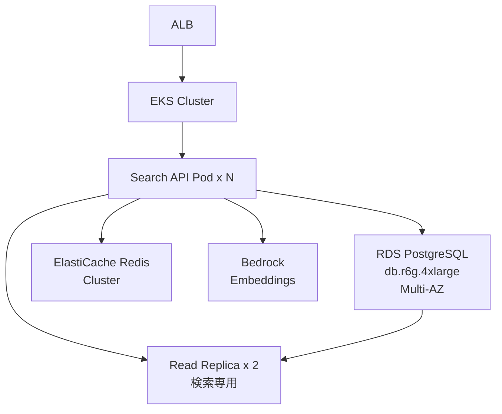

## ブログ概要

本記事は [ParadeDB公式ブログ「Hybrid Search in PostgreSQL: The Missing Manual」](https://www.paradedb.com/blog/hybrid-search-in-postgresql-the-missing-manual) の解説記事です。

著者 James Blackwood-Sewell は、PostgreSQL の拡張機能である pg_search（BM25 全文検索）と pgvector（ベクトル類似度検索）を組み合わせ、外部の検索エンジンを一切使わずに PostgreSQL 内部だけでハイブリッド検索を実現する方法を解説している。BM25 の語彙的マッチングとベクトル検索の意味的マッチングを Reciprocal Rank Fusion（RRF）で融合し、さらに人気度や新着度といった複数シグナルを加えたマルチシグナルランキングまでを SQL だけで実装する手法が体系的にまとめられている。

## 情報源

| 項目 | 詳細 |
|------|------|
| 種別 | 企業テックブログ |
| URL | [paradedb.com/blog/hybrid-search-in-postgresql-the-missing-manual](https://www.paradedb.com/blog/hybrid-search-in-postgresql-the-missing-manual) |
| 組織 | ParadeDB |
| 著者 | James Blackwood-Sewell |
| 発表日 | 2025-10-22 |

## 関連 Zenn 記事

この記事は [Zenn記事: BM25×ベクトル検索のハイブリッド検索をRRFで実装しRAG精度を改善する](https://zenn.dev/0h_n0/articles/f22adb0924b5cf) の深掘りです。Zenn 記事では RAG パイプラインにおけるハイブリッド検索の効果を議論していますが、本記事では ParadeDB ブログに基づき、PostgreSQL ネイティブ実装の具体的な SQL 構文と運用設計に焦点を当てます。

## 技術的背景

### なぜ BM25 とベクトル検索の統合が必要か

検索システムには大きく2つのアプローチがある。語彙的検索（Lexical Search）と意味的検索（Semantic Search）である。

**語彙的検索（BM25）** は、クエリに含まれるキーワードが文書中にどの程度出現するかを統計的にスコアリングする。「PostgreSQL チューニング」と検索すれば、まさにその語句を含む文書を正確に見つけ出す。しかし、ブログでは「database performance optimization」で検索しても「PostgreSQL tuning」を含む文書はヒットしない、という限界が指摘されている。つまり、BM25 は語彙の一致に依存するため、同義語や関連概念を捉えられない。

**意味的検索（ベクトル検索）** は、テキストを高次元ベクトルに変換し、意味的な近さでマッチングする。「database performance optimization」と「PostgreSQL tuning」が意味的に近いことを捉えられる一方、固有名詞やエラーコードのような正確な語彙一致が求められるケースでは精度が落ちる。

これら2つを組み合わせるハイブリッド検索は、語彙的な正確さと意味的な柔軟さの両方を獲得できる。ブログでは、この融合を PostgreSQL の SQL だけで実現する手法が示されている。

## 実装アーキテクチャ

### システム構成

ブログで解説されている構成は、PostgreSQL に2つの拡張機能を追加するシンプルなアーキテクチャである。



### テーブル定義とインデックス作成

ブログで示されているスキーマとインデックスの作成手順を以下に示す。

```sql
-- 拡張機能の有効化
CREATE EXTENSION IF NOT EXISTS pg_search;
CREATE EXTENSION IF NOT EXISTS vector;

-- ドキュメントテーブル
CREATE TABLE documents (
    id SERIAL PRIMARY KEY,
    title TEXT,
    content TEXT,
    embedding vector(1536)
);

-- BM25インデックス（pg_search）
CREATE INDEX idx_documents_bm25 ON documents
USING bm25 (
  id,
  title::pdb.simple('stemmer=english'),
  content::pdb.simple('stemmer=english')
)
WITH (key_field=id);

-- HNSWベクトルインデックス（pgvector）
CREATE INDEX idx_documents_vector ON documents
USING hnsw (embedding vector_cosine_ops);
```

ここで `pdb.simple('stemmer=english')` はステミング（語幹抽出）の設定であり、「running」「runs」「ran」を同一の語幹「run」として扱うことで検索精度を向上させる。`key_field=id` は BM25 インデックスが主キーを参照することを指定している。

### BM25 クエリ構文

ブログでは、`|||` 演算子によるマッチ操作と `::boost()` 修飾子によるフィールド重み付けが紹介されている。

```sql
-- BM25検索：titleフィールドに2倍のブーストを適用
SELECT id, title, pdb.score(id) AS bm25_score
FROM documents
WHERE
  title   ||| 'postgresql search'::boost(2) OR
  content ||| 'postgresql search'
ORDER BY bm25_score DESC;
```

`pdb.score(id)` 関数は BM25 スコアを返す。`::boost(2)` により title フィールドのマッチに2倍の重みが付与される。

### ベクトル類似度検索

pgvector の `<=>` 演算子はコサイン距離を計算する。類似度に変換するには `1 - distance` とする。

```sql
-- ベクトル類似度検索
SELECT
    id,
    title,
    1 - (embedding <=> '[0.1,0.2,...]'::vector) AS similarity
FROM documents
ORDER BY similarity DESC;
```

## Production Deployment Guide

### AWS 実装パターン

ParadeDB ブログで示されたハイブリッド検索アーキテクチャを AWS 上に構築する場合の設計パターンを、規模別に3段階で示す。

#### Small 構成（月間クエリ数 10万以下）



| コンポーネント | スペック | 月額概算 |
|---------------|---------|---------|
| RDS PostgreSQL | db.r6g.large (2 vCPU, 16 GB) | $180 |
| Lambda | 512 MB, 平均 200ms | $5 |
| API Gateway | REST API | $3.50/100万リクエスト |
| Bedrock Embeddings | Titan Embeddings v2 | $2/100万トークン |
| **合計** | | **約 $190-200/月** |

この構成では RDS に pg_search と pgvector の両拡張をインストールし、Lambda からクエリを発行する。文書登録時に Bedrock でエンベディングを生成し、`embedding` カラムに格納する。

#### Medium 構成（月間クエリ数 100万以下）

| コンポーネント | スペック | 月額概算 |
|---------------|---------|---------|
| RDS PostgreSQL | db.r6g.xlarge (4 vCPU, 32 GB) | $360 |
| RDS Read Replica | db.r6g.large (検索専用) | $180 |
| ECS Fargate | 1 vCPU, 2 GB x 2タスク | $70 |
| ALB | Application Load Balancer | $25 |
| ElastiCache Redis | cache.t4g.micro (クエリキャッシュ) | $15 |
| **合計** | | **約 $650/月** |

Read Replica を検索クエリ専用にすることで、書き込み負荷と検索負荷を分離する。頻出クエリの RRF 結果を Redis にキャッシュすることで、データベース負荷を軽減できる。

#### Large 構成（月間クエリ数 1000万以上）



| コンポーネント | スペック | 月額概算 |
|---------------|---------|---------|
| RDS PostgreSQL | db.r6g.4xlarge Multi-AZ (16 vCPU, 128 GB) | $2,880 |
| Read Replica x 2 | db.r6g.2xlarge | $1,440 |
| EKS | コントロールプレーン + ノード | $500 |
| ElastiCache Redis | cache.r6g.large クラスタ | $300 |
| ALB + WAF | | $50 |
| **合計** | | **約 $5,170/月** |

### Terraform 実装例（Small 構成: RDS + Lambda）

```hcl
# terraform/small/main.tf
# Small構成: RDS PostgreSQL + Lambda によるハイブリッド検索

terraform {
  required_version = ">= 1.5"
  required_providers {
    aws = {
      source  = "hashicorp/aws"
      version = "~> 5.0"
    }
  }
}

provider "aws" {
  region = var.aws_region
}

variable "aws_region" {
  description = "AWS region for deployment"
  type        = string
  default     = "ap-northeast-1"
}

variable "db_password" {
  description = "RDS master password"
  type        = string
  sensitive   = true
}

# --- VPC ---
module "vpc" {
  source  = "terraform-aws-modules/vpc/aws"
  version = "~> 5.0"

  name = "hybrid-search-vpc"
  cidr = "10.0.0.0/16"

  azs             = ["${var.aws_region}a", "${var.aws_region}c"]
  private_subnets = ["10.0.1.0/24", "10.0.2.0/24"]
  public_subnets  = ["10.0.101.0/24", "10.0.102.0/24"]

  enable_nat_gateway = true
  single_nat_gateway = true
}

# --- RDS PostgreSQL with pg_search + pgvector ---
resource "aws_db_parameter_group" "hybrid_search" {
  family = "postgres16"
  name   = "hybrid-search-params"

  parameter {
    name  = "shared_preload_libraries"
    value = "pg_search,vector"
  }
}

resource "aws_db_instance" "hybrid_search" {
  identifier     = "hybrid-search-db"
  engine         = "postgres"
  engine_version = "16.4"
  instance_class = "db.r6g.large"

  allocated_storage     = 100
  max_allocated_storage = 500
  storage_type          = "gp3"

  db_name  = "search_db"
  username = "search_admin"
  password = var.db_password

  parameter_group_name = aws_db_parameter_group.hybrid_search.name
  db_subnet_group_name = aws_db_subnet_group.main.name

  vpc_security_group_ids = [aws_security_group.rds.id]

  backup_retention_period = 7
  multi_az               = false
  skip_final_snapshot    = false

  tags = {
    Environment = "production"
    Service     = "hybrid-search"
  }
}

resource "aws_db_subnet_group" "main" {
  name       = "hybrid-search-subnet-group"
  subnet_ids = module.vpc.private_subnets
}

resource "aws_security_group" "rds" {
  name_prefix = "hybrid-search-rds-"
  vpc_id      = module.vpc.vpc_id

  ingress {
    from_port       = 5432
    to_port         = 5432
    protocol        = "tcp"
    security_groups = [aws_security_group.lambda.id]
  }
}

# --- Lambda ---
resource "aws_security_group" "lambda" {
  name_prefix = "hybrid-search-lambda-"
  vpc_id      = module.vpc.vpc_id

  egress {
    from_port   = 0
    to_port     = 0
    protocol    = "-1"
    cidr_blocks = ["0.0.0.0/0"]
  }
}

resource "aws_lambda_function" "search_api" {
  function_name = "hybrid-search-api"
  runtime       = "python3.12"
  handler       = "handler.lambda_handler"
  memory_size   = 512
  timeout       = 30

  filename = "lambda_package.zip"

  vpc_config {
    subnet_ids         = module.vpc.private_subnets
    security_group_ids = [aws_security_group.lambda.id]
  }

  environment {
    variables = {
      DB_HOST     = aws_db_instance.hybrid_search.address
      DB_NAME     = "search_db"
      DB_USER     = "search_admin"
      BEDROCK_REGION = var.aws_region
    }
  }
}
```

### Terraform 実装例（Large 構成: EKS + RDS）

```hcl
# terraform/large/main.tf
# Large構成: EKS + RDS Multi-AZ + Read Replica による大規模ハイブリッド検索

terraform {
  required_version = ">= 1.5"
  required_providers {
    aws = {
      source  = "hashicorp/aws"
      version = "~> 5.0"
    }
  }
}

provider "aws" {
  region = var.aws_region
}

variable "aws_region" {
  description = "AWS region for deployment"
  type        = string
  default     = "ap-northeast-1"
}

variable "db_password" {
  description = "RDS master password"
  type        = string
  sensitive   = true
}

# --- VPC ---
module "vpc" {
  source  = "terraform-aws-modules/vpc/aws"
  version = "~> 5.0"

  name = "hybrid-search-large-vpc"
  cidr = "10.0.0.0/16"

  azs             = ["${var.aws_region}a", "${var.aws_region}c", "${var.aws_region}d"]
  private_subnets = ["10.0.1.0/24", "10.0.2.0/24", "10.0.3.0/24"]
  public_subnets  = ["10.0.101.0/24", "10.0.102.0/24", "10.0.103.0/24"]

  enable_nat_gateway = true
  single_nat_gateway = false
}

# --- RDS PostgreSQL Multi-AZ ---
resource "aws_db_parameter_group" "hybrid_search_large" {
  family = "postgres16"
  name   = "hybrid-search-large-params"

  parameter {
    name  = "shared_preload_libraries"
    value = "pg_search,vector"
  }

  parameter {
    name  = "work_mem"
    value = "256000"  # 256MB for complex RRF queries
  }

  parameter {
    name  = "effective_cache_size"
    value = "98304000"  # 96GB
  }

  parameter {
    name  = "maintenance_work_mem"
    value = "2048000"  # 2GB for index builds
  }
}

resource "aws_db_instance" "primary" {
  identifier     = "hybrid-search-primary"
  engine         = "postgres"
  engine_version = "16.4"
  instance_class = "db.r6g.4xlarge"

  allocated_storage     = 500
  max_allocated_storage = 2000
  storage_type          = "io2"
  iops                  = 10000

  db_name  = "search_db"
  username = "search_admin"
  password = var.db_password

  parameter_group_name = aws_db_parameter_group.hybrid_search_large.name
  db_subnet_group_name = aws_db_subnet_group.main.name

  vpc_security_group_ids = [aws_security_group.rds.id]

  multi_az                = true
  backup_retention_period = 14
  skip_final_snapshot     = false

  performance_insights_enabled = true

  tags = {
    Environment = "production"
    Service     = "hybrid-search"
    Tier        = "large"
  }
}

# --- Read Replicas (検索専用) ---
resource "aws_db_instance" "read_replica" {
  count = 2

  identifier          = "hybrid-search-replica-${count.index}"
  replicate_source_db = aws_db_instance.primary.identifier
  instance_class      = "db.r6g.2xlarge"

  parameter_group_name = aws_db_parameter_group.hybrid_search_large.name
  vpc_security_group_ids = [aws_security_group.rds.id]

  performance_insights_enabled = true

  tags = {
    Environment = "production"
    Role        = "read-replica"
  }
}

resource "aws_db_subnet_group" "main" {
  name       = "hybrid-search-large-subnet-group"
  subnet_ids = module.vpc.private_subnets
}

resource "aws_security_group" "rds" {
  name_prefix = "hybrid-search-large-rds-"
  vpc_id      = module.vpc.vpc_id

  ingress {
    from_port       = 5432
    to_port         = 5432
    protocol        = "tcp"
    security_groups = [aws_security_group.eks_nodes.id]
  }
}

# --- EKS Cluster ---
module "eks" {
  source  = "terraform-aws-modules/eks/aws"
  version = "~> 20.0"

  cluster_name    = "hybrid-search-cluster"
  cluster_version = "1.30"

  vpc_id     = module.vpc.vpc_id
  subnet_ids = module.vpc.private_subnets

  eks_managed_node_groups = {
    search_api = {
      instance_types = ["c6g.xlarge"]
      min_size       = 2
      max_size       = 10
      desired_size   = 3

      labels = {
        role = "search-api"
      }
    }
  }
}

resource "aws_security_group" "eks_nodes" {
  name_prefix = "hybrid-search-eks-nodes-"
  vpc_id      = module.vpc.vpc_id

  egress {
    from_port   = 0
    to_port     = 0
    protocol    = "-1"
    cidr_blocks = ["0.0.0.0/0"]
  }
}

# --- ElastiCache Redis Cluster ---
resource "aws_elasticache_replication_group" "search_cache" {
  replication_group_id = "hybrid-search-cache"
  description          = "Query result cache for hybrid search"

  node_type            = "cache.r6g.large"
  num_cache_clusters   = 2
  engine               = "redis"
  engine_version       = "7.1"

  subnet_group_name    = aws_elasticache_subnet_group.main.name
  security_group_ids   = [aws_security_group.redis.id]

  at_rest_encryption_enabled = true
  transit_encryption_enabled = true
}

resource "aws_elasticache_subnet_group" "main" {
  name       = "hybrid-search-cache-subnet"
  subnet_ids = module.vpc.private_subnets
}

resource "aws_security_group" "redis" {
  name_prefix = "hybrid-search-redis-"
  vpc_id      = module.vpc.vpc_id

  ingress {
    from_port       = 6379
    to_port         = 6379
    protocol        = "tcp"
    security_groups = [aws_security_group.eks_nodes.id]
  }
}
```

### 監視設計

ハイブリッド検索システムの監視では、以下のメトリクスを重点的に追跡する。

```python
"""CloudWatch メトリクス設計 for ハイブリッド検索システム."""

from dataclasses import dataclass


@dataclass(frozen=True)
class SearchMetric:
    """検索システムの監視メトリクス定義.

    Attributes:
        name: メトリクス名
        namespace: CloudWatch 名前空間
        unit: 測定単位
        alarm_threshold: アラーム閾値
        description: メトリクスの説明
    """

    name: str
    namespace: str
    unit: str
    alarm_threshold: float
    description: str


# 検索レイテンシ
SEARCH_LATENCY = SearchMetric(
    name="SearchLatencyP99",
    namespace="HybridSearch",
    unit="Milliseconds",
    alarm_threshold=500.0,
    description="RRF融合を含む検索クエリのP99レイテンシ",
)

# BM25インデックス健全性
BM25_INDEX_SIZE = SearchMetric(
    name="BM25IndexSizeMB",
    namespace="HybridSearch",
    unit="Megabytes",
    alarm_threshold=10000.0,
    description="pg_search BM25インデックスのディスクサイズ",
)

# ベクトルインデックス健全性
HNSW_RECALL = SearchMetric(
    name="HNSWRecallRate",
    namespace="HybridSearch",
    unit="Percent",
    alarm_threshold=95.0,
    description="HNSWインデックスの近似最近傍探索リコール率",
)

# RRF融合品質
RRF_FUSION_TIME = SearchMetric(
    name="RRFFusionTimeMs",
    namespace="HybridSearch",
    unit="Milliseconds",
    alarm_threshold=100.0,
    description="RRFスコア計算と結果統合の所要時間",
)
```

主要な監視ポイントとして、以下の4項目を CloudWatch ダッシュボードに配置することを推奨する。

1. **検索レイテンシ**: BM25 検索、ベクトル検索、RRF 融合それぞれの P50/P95/P99
2. **インデックスサイズ**: BM25 インデックスと HNSW インデックスのディスク使用量推移
3. **キャッシュヒット率**: Redis キャッシュの hit/miss 比率
4. **データベース接続数**: RDS のアクティブ接続数と最大接続数の比率

### コスト最適化の戦略

構成選択の判断基準を以下に整理する。

| 判断基準 | Small | Medium | Large |
|---------|-------|--------|-------|
| 月間クエリ数 | ~10万 | ~100万 | 1000万~ |
| 文書数 | ~10万件 | ~100万件 | 1000万件~ |
| レイテンシ要件 | < 1秒 | < 500ms | < 200ms |
| 可用性 | 99.5% | 99.9% | 99.95% |
| 月額コスト | ~$200 | ~$650 | ~$5,200 |

コスト削減のための主要施策は以下の通りである。

- **Reserved Instances**: RDS は1年/3年予約で最大40%割引が得られる
- **クエリキャッシュ**: 頻出クエリの RRF 結果を Redis にキャッシュし、DB 負荷を削減
- **LIMIT の適切な設定**: ブログでは検索シグナルの候補セットを `LIMIT 20` に制限しており、これがコスト効率に直結する
- **エンベディング生成の最適化**: バッチ処理で Bedrock 呼び出しを集約し、API コストを削減

## BM25 アルゴリズムの詳細

ブログでは BM25 の3つの主要シグナルが解説されている。

### Term Frequency（語彙頻度）

ブログでは「Documents mentioning query terms more often are more relevant, but with diminishing returns」と述べられている。BM25 における TF の一般的な定式化は以下の通りである。

$$
\text{TF}(t, d) = \frac{f(t, d) \cdot (k_1 + 1)}{f(t, d) + k_1}
$$

ここで $$f(t, d)$$ は文書 $$d$$ における語彙 $$t$$ の出現回数、$$k_1$$ は飽和パラメータ（一般的に 1.2）である。出現回数が増えるほどスコアは上昇するが、対数的に収束する「diminishing returns」の特性を持つ。

### Inverse Document Frequency（逆文書頻度）

ブログでは「Rare terms matter more than common ones」と説明されている。IDF は全文書中での語彙の稀少性を表す。

$$
\text{IDF}(t) = \log \frac{N - n(t) + 0.5}{n(t) + 0.5}
$$

ここで $$N$$ は全文書数、$$n(t)$$ は語彙 $$t$$ を含む文書数である。「the」や「is」のような高頻度語は低い IDF 値を持ち、専門用語や固有名詞は高い IDF 値を持つ。

### Document Length Normalization（文書長正規化）

ブログでは「Shorter, concise documents are preferred over long ones」と述べられている。これは長い文書が単に語彙の出現回数で有利になることを防ぐための補正である。

$$
\text{norm} = 1 - b + b \cdot \frac{|d|}{\text{avgdl}}
$$

ここで $$|d|$$ は文書 $$d$$ の長さ、$$\text{avgdl}$$ は全文書の平均長、$$b$$ は正規化の強度パラメータ（一般的に 0.75）である。

## RRF によるスコア融合

### Reciprocal Rank Fusion の数式

ブログで示された RRF の数式は以下の通りである。

$$
\text{RRF}(d) = \sum_{i} \frac{1}{k + \text{rank}_i(d)}
$$

ここで $$k$$ は定数（ブログでは60が推奨されている）、$$\text{rank}_i(d)$$ は $$i$$ 番目の検索システムにおける文書 $$d$$ の順位である。

$$k = 60$$ の意味するところは、上位にランクされた文書のスコア差を適度に圧縮することである。$$k$$ が小さいと上位文書間のスコア差が大きくなり、$$k$$ が大きいと差が圧縮される。

### SQL による RRF 実装

ブログで示された RRF の SQL 実装を以下に示す。

```sql
-- Reciprocal Rank Fusion: BM25 + ベクトル検索の統合
WITH
fulltext AS (
  -- BM25による語彙的検索
  SELECT id, ROW_NUMBER() OVER (ORDER BY pdb.score(id) DESC) AS r
  FROM documents
  WHERE content ||| 'keyboard'
  LIMIT 20
),

semantic AS (
  -- pgvectorによる意味的検索
  SELECT id, ROW_NUMBER() OVER (ORDER BY embedding <=> '[1,2,3]') AS r
  FROM documents
  LIMIT 20
),

rrf AS (
  -- RRFスコアの計算（k=60）
  SELECT id, 1.0 / (60 + r) AS s FROM fulltext
  UNION ALL
  SELECT id, 1.0 / (60 + r) AS s FROM semantic
)

SELECT
  m.id,
  SUM(s) AS score,
  m.content
FROM rrf
JOIN documents AS m USING (id)
GROUP BY m.id, m.content
ORDER BY score DESC
LIMIT 5;
```

この実装のポイントは以下の通りである。

1. **CTE（Common Table Expressions）**: 各検索を独立した CTE として定義し、可読性を確保
2. **ROW_NUMBER()**: 各検索結果に順位を付与
3. **UNION ALL**: 両方のスコアを1つのテーブルに統合
4. **SUM(s) + GROUP BY**: 同一文書の RRF スコアを合算
5. **LIMIT 20**: 各検索の候補セットを制限し、計算コストを抑制

### 重み付き RRF

ブログでは、語彙的検索と意味的検索のバランスを調整する重み付き RRF も紹介されている。

```sql
-- 重み付きRRF: 語彙的検索70%、意味的検索30%
rrf AS (
  SELECT id, 0.7 * 1.0 / (60 + r) AS s FROM fulltext
  UNION ALL
  SELECT id, 0.3 * 1.0 / (60 + r) AS s FROM semantic
)
```

重み配分はドメインやユースケースに依存する。ブログの例では70/30（語彙優先）が示されているが、この比率は検索ログやA/Bテストに基づいて調整すべきとされている。

### マルチシグナルランキング

ブログでは BM25 とベクトル検索に加え、人気度や新着度といったビジネスシグナルも RRF に統合する手法が示されている。

```sql
-- マルチシグナルRRF: 検索 + 人気度 + 新着度
popularity AS (
  SELECT id, ROW_NUMBER() OVER (ORDER BY view_count DESC) AS r
  FROM documents
  LIMIT 1000
),

recency AS (
  SELECT id, ROW_NUMBER() OVER (ORDER BY created_at DESC) AS r
  FROM documents
  LIMIT 1000
),
```

ブログでは、検索シグナルの候補セットは `LIMIT 20`、非検索シグナル（人気度、新着度）は `LIMIT 1000` と異なる制限が設定されている。これは、検索シグナルは精度が重要で少数の上位候補で十分である一方、非検索シグナルは広い候補プールからの公平なランキングが必要なためと考えられる。

## パフォーマンス最適化

ブログの実装から読み取れるパフォーマンス最適化のポイントを整理する。

**インデックス設計**:
- BM25 インデックスでは `pdb.simple` アナライザにステミング設定を含めることで、語形変化による検索漏れを防止
- HNSW インデックスは `vector_cosine_ops` を指定し、コサイン距離に最適化

**クエリ最適化**:
- 各検索シグナルの `LIMIT` を適切に設定（検索: 20、非検索: 1000）し、不要な計算を削減
- CTE を活用してクエリプランナーの最適化を促進
- `::boost()` 修飾子でフィールドの重みを SQL レベルで制御し、アプリケーション側のロジックを不要に

**スケーリング戦略**:
- Read Replica を検索専用に活用し、書き込みと読み取りの負荷を分離
- Redis キャッシュで頻出クエリの結果を TTL 付きで保持
- コネクションプーリング（PgBouncer 等）で接続数を制御

## 運用での学び

ブログの実装アプローチから得られる運用上の示唆を以下にまとめる。

**SQL ベースの透明性**: ブログで繰り返し強調されているのは、全てのランキングロジックが SQL で表現されている点である。Elasticsearch のような外部検索エンジンでは、スコアリングがブラックボックスになりがちだが、PostgreSQL の SQL では `EXPLAIN ANALYZE` でクエリプランを確認し、各ステップのコストを可視化できる。これはデバッグや性能改善において大きな利点となる。

**拡張機能の組み合わせ**: pg_search と pgvector はそれぞれ独立した PostgreSQL 拡張機能であり、同一データベース内で共存できる。これにより、データの二重管理が不要になり、トランザクション整合性も PostgreSQL の MVCC によって保証される。

**段階的な導入**: BM25 のみで開始し、後からベクトル検索を追加し、さらに RRF で融合するという段階的なアプローチが可能である。既存の PostgreSQL インフラを活かしつつ、検索品質を漸進的に向上させられる。

**重みの調整**: 重み付き RRF の比率は固定値ではなく、ドメイン知識とユーザーフィードバックに基づいて継続的に調整すべきパラメータである。A/B テストのフレームワークと組み合わせることで、データ駆動型の最適化が可能になる。

## 学術研究との関連

RRF は Cormack, Clarke, and Butt (2009) によって提案された手法であり、異なるランキングシステムの結果を統合するメタ検索の文脈で広く研究されている。ブログで示された $$k = 60$$ という値も、この原論文で推奨されたパラメータである。

BM25 は Robertson and Zaragoza (2009) の「The Probabilistic Relevance Framework」に基づく確率的情報検索モデルであり、数十年にわたる研究の蓄積がある。近年の Dense Retrieval（ベクトル検索）の台頭にもかかわらず、BM25 は特に語彙的一致が重要なドメイン（法律文書、医療記録、技術仕様書等）で依然として有効性が確認されている。

ハイブリッド検索の有効性については、RAG（Retrieval-Augmented Generation）の文脈でも活発に研究されており、BM25 と Dense Retrieval の組み合わせが単独手法を上回ることが複数の研究で報告されている。

## まとめと実践への示唆

ParadeDB ブログは、PostgreSQL の拡張機能だけでハイブリッド検索を実現する具体的な手法を体系的に示している。pg_search による BM25 検索、pgvector によるベクトル検索、そして RRF による融合という3つのレイヤーが、全て標準的な SQL で記述できる点が最大の特徴である。外部検索エンジンへの依存を排除することで、運用の複雑さとコストを削減しつつ、検索品質の透明性を確保できる。既に PostgreSQL を利用しているシステムにとって、ハイブリッド検索の導入障壁を下げる実践的なアプローチと言える。

## 参考文献

- Blackwood-Sewell, J. (2025). "Hybrid Search in PostgreSQL: The Missing Manual." ParadeDB Blog. [https://www.paradedb.com/blog/hybrid-search-in-postgresql-the-missing-manual](https://www.paradedb.com/blog/hybrid-search-in-postgresql-the-missing-manual)
- Cormack, G. V., Clarke, C. L. A., & Butt, S. (2009). "Reciprocal Rank Fusion outperforms Condorcet and individual Rank Learning Methods." *Proceedings of the 32nd International ACM SIGIR Conference on Research and Development in Information Retrieval*, pp. 758-759.
- Robertson, S. E., & Zaragoza, H. (2009). "The Probabilistic Relevance Framework: BM25 and Beyond." *Foundations and Trends in Information Retrieval*, 3(4), pp. 333-389.
- pgvector. "Open-source vector similarity search for Postgres." [https://github.com/pgvector/pgvector](https://github.com/pgvector/pgvector)
- ParadeDB. "pg_search: Full text search for PostgreSQL using BM25." [https://github.com/paradedb/paradedb](https://github.com/paradedb/paradedb)
