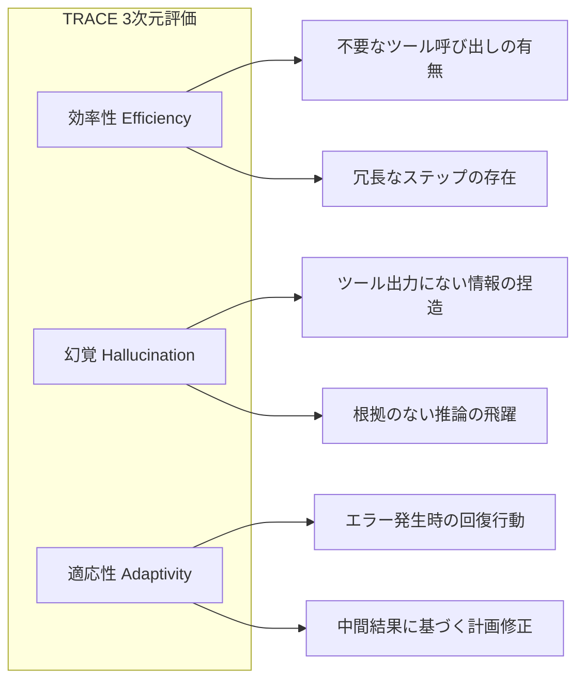

本記事は [Beyond the Final Answer: Evaluating the Reasoning Trajectories of Tool-Augmented Agents](https://arxiv.org/abs/2510.02837) の解説記事です。

## 論文概要（Abstract）

従来のエージェント評価ベンチマークは最終回答の正誤（answer matching）に焦点を当てているが、ツール利用エージェントの推論プロセスには**効率性（efficiency）**、**幻覚（hallucination）**、**適応性（adaptivity）**という重要な品質次元が存在する。著者らは、正解軌跡の網羅的アノテーションを必要としない**参照フリー**の評価フレームワークTRACE（Trajectory-based Reasoning Assessment and Comprehensive Evaluation）を提案している。Evidence Bank機構により、逐次的なステップの情報を蓄積しながら軌跡全体の品質を多次元で判定する。

この記事は [Zenn記事: LangSmithの評価・テスト機能でAIエージェントの品質を継続的に改善する](https://zenn.dev/0h_n0/articles/b46cecc0f08af9) の深掘りです。

## 情報源

- **会議名**: ICML 2026（International Conference on Machine Learning）
- **年**: 2026
- **URL**: https://arxiv.org/abs/2510.02837
- **著者**: Wonjoong Kim, Sangwu Park, Yeonjun In, Sein Kim, Dongha Lee, Chanyoung Park
- **arXiv ID**: 2510.02837

## カンファレンス情報

**ICML** は機械学習分野の最高峰会議の1つで、採択率は通常25%程度である。本論文は、ツール利用エージェントの評価という実用性の高いテーマについて、理論的に新規な参照フリー評価手法を提案している。

## 技術的詳細（Technical Details）

### 評価の3次元：効率性・幻覚・適応性

TRACEは、最終回答の正誤に加えて以下の3次元で軌跡品質を評価する：



**効率性（Efficiency）**:

$$
\text{Eff}(T) = 1 - \frac{|\{s_i \in T \mid \text{redundant}(s_i)\}|}{|T|}
$$

ここで、$T$は軌跡（ステップ列）、$s_i$は個別ステップ、$\text{redundant}(s_i)$はステップ$s_i$が最終目標達成に不要であるかの判定関数。

**幻覚（Hallucination）**:

$$
\text{Hal}(T) = \frac{1}{|T|} \sum_{i=1}^{|T|} \mathbb{1}[\text{grounded}(s_i, \text{EB}_i)]
$$

ここで、$\text{EB}_i$はステップ$i$時点のEvidence Bank（蓄積された事実情報）、$\text{grounded}(s_i, \text{EB}_i)$はステップ$s_i$の主張がEvidence Bankの情報に裏付けられているかの判定。

**適応性（Adaptivity）**:

$$
\text{Adp}(T) = \frac{|\{s_i \mid \text{error}(s_{i-1}) \land \text{recovery}(s_i)\}|}{|\{s_i \mid \text{error}(s_{i-1})\}|}
$$

エラー発生後に適切な回復行動を取った割合。

### Evidence Bank機構

TRACEの核となる技術的貢献は**Evidence Bank**機構である。これは、軌跡を逐次処理しながら「確認済み事実」を蓄積するデータ構造で、参照軌跡なしに各ステップの妥当性を判定可能にする。

```python
from dataclasses import dataclass, field


@dataclass
class EvidenceBank:
    """軌跡評価のための証拠蓄積機構"""
    facts: list[str] = field(default_factory=list)
    tool_outputs: dict[str, str] = field(default_factory=dict)
    contradictions: list[tuple[str, str]] = field(default_factory=list)

    def add_tool_output(self, tool_name: str, output: str) -> None:
        """ツール出力を証拠として蓄積"""
        self.tool_outputs[tool_name] = output
        self.facts.append(f"Tool '{tool_name}' returned: {output}")

    def check_grounded(self, claim: str) -> bool:
        """主張がEvidence Bankの情報に裏付けられるか判定

        Args:
            claim: エージェントの主張（ステップの出力）

        Returns:
            裏付けが存在する場合True
        """
        for fact in self.facts:
            if self._entails(fact, claim):
                return True
        return False

    def _entails(self, premise: str, hypothesis: str) -> bool:
        """含意関係の判定（LLMまたはNLIモデルで実装）"""
        ...


def evaluate_trajectory_trace(
    trajectory: list[dict],
    evaluator_model: str = "openai:o3-mini",
) -> dict[str, float]:
    """TRACE方式で軌跡を参照フリー評価する

    Args:
        trajectory: エージェントの実行軌跡
        evaluator_model: 評価に使用するモデル

    Returns:
        3次元スコアの辞書
    """
    eb = EvidenceBank()
    efficiency_violations = 0
    hallucination_count = 0
    error_recovery_attempts = 0
    error_count = 0

    for i, step in enumerate(trajectory):
        if step["type"] == "tool_output":
            eb.add_tool_output(step["tool"], step["content"])
        elif step["type"] == "agent_reasoning":
            if not eb.check_grounded(step["content"]):
                hallucination_count += 1
            if is_redundant(step, trajectory[:i], eb):
                efficiency_violations += 1
        elif step["type"] == "error":
            error_count += 1
            if i + 1 < len(trajectory) and is_recovery(trajectory[i + 1]):
                error_recovery_attempts += 1

    n = len(trajectory)
    return {
        "efficiency": 1.0 - efficiency_violations / max(n, 1),
        "hallucination_free": hallucination_count == 0,
        "hallucination_rate": hallucination_count / max(n, 1),
        "adaptivity": error_recovery_attempts / max(error_count, 1),
    }
```

### 参照フリー評価の利点

従来のTrajectory Match方式（LangSmithの`agentevals`が提供するstrict/unordered/subset/supersetモード）は**正解軌跡のアノテーション**を必要とする。しかし実運用では：

1. 同一タスクに対して複数の正解軌跡が存在する（例：並列呼び出しの順序）
2. ツール追加・変更のたびに正解軌跡を更新する必要がある
3. 探索的なエージェント（検索→分析→再検索）では正解軌跡が定義困難

TRACEの参照フリー評価は、**正解軌跡のメンテナンスコストを排除**しつつ、効率性・幻覚・適応性という実務的に重要な品質次元を捉える。

## 実装のポイント（Implementation）

TRACEをLangSmithのカスタムEvaluatorとして実装する際の要点：

1. **Evidence Bankの初期化**: 各評価実行の冒頭で、システムプロンプトやツール定義を初期事実として登録
2. **含意判定の実装**: `_entails`関数にはNLIモデル（DeBERTa-v3-large等）を使用するとLLM呼び出しコストを削減できる
3. **冗長性判定のヒューリスティック**: 同一ツールの同一引数での再呼び出し、前ステップで得た情報を無視した行動を冗長と判定
4. **適応性の閾値設定**: エラー回復率0.5未満を「低適応性」としてフラグを立てるのが著者らの推奨

## Production Deployment Guide

### AWS実装パターン（コスト最適化重視）

参照フリー軌跡評価パイプラインのAWS構成：

| 規模 | 月間評価数 | 推奨構成 | 月額コスト | 主要サービス |
|------|-----------|---------|-----------|------------|
| **Small** | ~3,000回 | Serverless | $70-180 | Lambda + Bedrock + DynamoDB |
| **Medium** | ~30,000回 | Hybrid | $400-1,000 | Lambda + ECS + SageMaker |
| **Large** | 300,000回+ | Container | $2,500-6,000 | EKS + SageMaker + Batch |

**Small構成の詳細**（月額$70-180）:
- **Lambda**: Evidence Bank管理、軌跡評価実行（$25/月）
- **Bedrock**: 含意判定（Claude 3.5 Haiku）、冗長性判定（$100/月）
- **DynamoDB**: Evidence Bank状態保存、評価結果（$15/月）
- **S3**: 軌跡ログ保存（$5/月）

**コスト削減テクニック**:
- 含意判定にNLIモデル（SageMaker Inference）使用でLLM呼び出し90%削減
- Evidence Bankの差分更新（前回評価からの差分ステップのみ処理）
- バッチ軌跡評価（Bedrock Batch API 50%割引）

**コスト試算の注意事項**: 上記は2026年7月時点のAWS ap-northeast-1料金に基づく概算です。軌跡長（ステップ数）が長いほど1評価あたりのコストが増加します。平均10ステップの軌跡を想定しています。

### Terraformインフラコード

```hcl
resource "aws_lambda_function" "trace_evaluator" {
  filename      = "trace_eval.zip"
  function_name = "trace-reference-free-eval"
  role          = aws_iam_role.eval_lambda.arn
  handler       = "handler.evaluate_trace"
  runtime       = "python3.12"
  timeout       = 180
  memory_size   = 1024

  environment {
    variables = {
      BEDROCK_MODEL_ID     = "anthropic.claude-3-5-haiku-20241022-v1:0"
      EVIDENCE_BANK_TABLE  = aws_dynamodb_table.evidence_bank.name
      NLI_ENDPOINT         = aws_sagemaker_endpoint.nli_model.name
      EFFICIENCY_THRESHOLD = "0.8"
      ADAPTIVITY_THRESHOLD = "0.5"
    }
  }
}

resource "aws_dynamodb_table" "evidence_bank" {
  name         = "trace-evidence-bank"
  billing_mode = "PAY_PER_REQUEST"
  hash_key     = "session_id"
  range_key    = "step_index"

  attribute {
    name = "session_id"
    type = "S"
  }
  attribute {
    name = "step_index"
    type = "N"
  }

  ttl {
    attribute_name = "expire_at"
    enabled        = true
  }
}
```

### コスト最適化チェックリスト

- [ ] NLIモデルで含意判定（LLM呼び出し90%削減）
- [ ] Evidence Bank差分更新（全再計算を回避）
- [ ] Bedrock Batch API（非リアルタイム評価で50%削減）
- [ ] 軌跡長制限: 20ステップ超は要約してから評価
- [ ] DynamoDB TTL: 30日で古いEvidence Bank自動削除
- [ ] SageMaker Serverless Inference: 低頻度時のNLI推論コスト削減

## 実験結果（Results）

著者らは、複数のツール利用エージェント（ReAct, Toolformer, TaskWeaver等）をTRACEで評価した結果を報告している。

### メタ評価データセット

著者らは、意図的に欠陥を含む軌跡（inefficient, hallucinated, non-adaptive）を収集し、多次元のアノテーションを付与したメタ評価データセットを構築している。

### 主要な発見

著者らの報告による主要な発見：

1. **最終回答正解でも軌跡に問題があるケース**: 最終回答が正しいにもかかわらず、効率性スコアが0.5未満の軌跡が全体の23%を占める
2. **幻覚の発生パターン**: ツール出力を待たずに先走って推論するケースで幻覚が集中。特にReActパターンでThought→Actionの間に根拠のない仮定が混入しやすい
3. **適応性の重要性**: エラー回復率が高いエージェント（Adaptivity > 0.7）は、最終的なタスク成功率も12pp高い

### オープンソースモデルでの実行可能性

著者らは、TRACE評価自体をオープンソースモデル（Llama 3.1 70B等）で実行した場合でも、GPT-4oと比較して評価結果の相関が高い（Spearman ρ > 0.85）ことを報告しており、プロプライエタリモデルへの依存を排除できることを示している。

## 実運用への応用（Practical Applications）

TRACEの知見をLangSmithの評価パイプラインに統合する方法：

**参照フリー評価の適用場面**:
- Zenn記事で解説されたTrajectory Matchの`strict`/`superset`モードで対応困難なケース（正解軌跡が定義できない探索的エージェント）
- 新規ドメインへのエージェント適用初期（正解軌跡データが蓄積されていない段階）
- Automation Rulesのオンライン評価（本番トレースに対するリアルタイム品質評価）

**LangSmithカスタムEvaluatorとしての実装**:
- `openevals`の`create_llm_as_judge`を拡張し、Evidence Bank状態を維持するステートフル評価器を構築
- 効率性・幻覚・適応性の3スコアをLangSmithダッシュボードに記録し、時系列で品質ドリフトを可視化

**CI/CDでの活用**:
- 正解軌跡メンテナンス不要のため、ツール追加・変更時のテスト更新コストを大幅削減
- 効率性スコア低下の検出により、不要なAPI呼び出しによるコスト増加を早期に発見

## 関連研究（Related Work）

- **TRAJECT-Bench**（He et al., 2025）: 参照ベースの軌跡評価。正解軌跡との比較が核。TRACEは参照フリーであり相補的
- **AgentEval DAG**（Guo et al., 2026）: ステップレベル評価とエラー伝播追跡。TRACEのEvidence Bankはステップ間の情報伝達を追跡する類似の発想
- **ToolEmu**（Ruan et al., 2024）: LLMサンドボックスでのツール実行安全性評価。TRACEは安全性ではなく推論品質に焦点
- **FActScore**（Min et al., 2023）: 文レベルの事実性評価。TRACEのHallucination評価はFActScoreの発想を軌跡評価に拡張したもの

## まとめと今後の展望

TRACEは、正解軌跡のアノテーションなしにエージェントの推論品質を多次元で評価する手法を確立した。著者らが示した「最終回答正解でも軌跡に問題があるケースが23%」という知見は、最終回答のみの評価では品質管理が不十分であることを定量的に裏付けている。LangSmithの`agentevals`（参照ベース）とTRACE（参照フリー）を組み合わせることで、開発初期から本番運用まで一貫した軌跡品質管理が実現できる。

## 参考文献

- **arXiv**: https://arxiv.org/abs/2510.02837
- **会議**: ICML 2026
- **Related Zenn article**: https://zenn.dev/0h_n0/articles/b46cecc0f08af9
- **agentevals (LangChain)**: https://github.com/langchain-ai/agentevals
- **openevals (LangChain)**: https://github.com/langchain-ai/openevals
