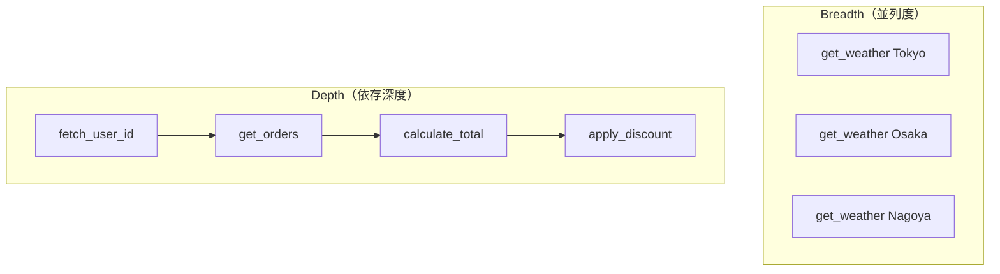

本記事は [TRAJECT-Bench: A Trajectory-Aware Benchmark for Evaluating Agentic Tool Use](https://arxiv.org/abs/2510.04550) の解説記事です。

## 論文概要（Abstract）

TRAJECT-Benchは、LLMエージェントのツール使用能力を**軌跡レベル**で評価するベンチマークである。従来のベンチマークが最終回答の正誤のみを評価していたのに対し、本ベンチマークはツールが正しく選択されたか、引数が正確か、依存関係の順序が守られているかを細粒度で測定する。著者らは、プロダクションスタイルのAPIを用いた多様なタスクを設計し、並列呼び出し（breadth）と逐次依存チェーン（depth）の両軸で軌跡を合成・評価している。

この記事は [Zenn記事: LangSmithの評価・テスト機能でAIエージェントの品質を継続的に改善する](https://zenn.dev/0h_n0/articles/b46cecc0f08af9) の深掘りです。

## 情報源

- **arXiv ID**: 2510.04550
- **URL**: https://arxiv.org/abs/2510.04550
- **著者**: Pengfei He, Zhenwei Dai, Bing He, Hui Liu et al.
- **発表年**: 2025
- **分野**: cs.AI
- **ライセンス**: CC BY 4.0

## 背景と動機（Background & Motivation）

LLMエージェントの評価において、最終回答の正確性だけでは品質を十分に捉えられないという問題が指摘されている。例えば、天気情報を正しく返すエージェントであっても、不要なWeb検索を3回行った後に正しいAPIを呼び出すパターンは、直接正しいAPIを1回呼び出すパターンと比較してレイテンシとコストの面で劣っている。

従来のベンチマーク（ToolBench, API-Bank等）は最終出力の正誤を測定するのみであり、**どのツールを、どの引数で、どの順序で呼び出したか**という軌跡の品質を体系的に評価する手法が欠けていた。これは、Zenn記事で解説したLangSmithの`agentevals`ライブラリが解決しようとしている課題と同一である。

著者らは、この「軌跡盲点（trajectory blindness）」問題を解決するため、ツール選択・引数指定・依存順序の3軸で軌跡品質を定量化するベンチマークを提案した。

## 主要な貢献（Key Contributions）

- **貢献1**: プロダクションスタイルのAPIを用いた軌跡対応評価フレームワークの設計。実行可能なツール群を用意し、各タスクに対して正解軌跡を定義
- **貢献2**: breadth（並列ツール呼び出し）とdepth（逐次依存チェーン）の2軸で軌跡複雑度を体系的に制御するデータ合成手法
- **貢献3**: ツール選択正確度・引数正確度・依存順序遵守率の3つの細粒度メトリクスの定義と、短→中長軌跡への遷移がボトルネックとなることの実証

## 技術的詳細（Technical Details）

### 評価メトリクスの定義

TRAJECT-Benchでは、従来の最終回答精度（Final Accuracy）に加えて、以下の軌跡レベルメトリクスを定義している。

**ツール選択正確度（Tool Selection Accuracy）**:

$$
\text{TSA} = \frac{|\hat{T} \cap T^*|}{|T^*|}
$$

ここで、
- $\hat{T}$: エージェントが実際に呼び出したツールの集合
- $T^*$: 正解軌跡で期待されるツールの集合

**引数正確度（Argument Accuracy）**:

$$
\text{AA} = \frac{1}{|T^*|} \sum_{t \in \hat{T} \cap T^*} \mathbb{1}[\text{args}(t) = \text{args}^*(t)]
$$

ここで、$\text{args}(t)$はツール$t$に渡された引数、$\text{args}^*(t)$は期待される引数を示す。

**依存順序遵守率（Dependency Order Compliance）**:

$$
\text{DOC} = \frac{|\{(t_i, t_j) \in E^* \mid \text{pos}(\hat{t}_i) < \text{pos}(\hat{t}_j)\}|}{|E^*|}
$$

ここで、$E^*$は正解軌跡における依存エッジ（$t_i$が$t_j$より先に実行されるべき関係）の集合、$\text{pos}(\hat{t})$はエージェント出力における実行位置を示す。

### 軌跡複雑度の2軸設計



著者らは、タスクを以下の複雑度レベルで分類している：

| レベル | Breadth | Depth | 軌跡長 | 例 |
|--------|---------|-------|--------|-----|
| Short | 1-2 | 1-2 | 2-4ステップ | 単一API呼び出し |
| Mid | 2-4 | 2-3 | 4-8ステップ | 並列取得→集約 |
| Long | 3-6 | 3-5 | 8-15ステップ | 複雑なワークフロー |

### アルゴリズム：軌跡合成パイプライン

```python
from dataclasses import dataclass
from typing import Sequence


@dataclass
class ToolCall:
    """ツール呼び出しの表現"""
    name: str
    args: dict
    depends_on: list[str]


def synthesize_trajectory(
    tools: list[dict],
    breadth: int,
    depth: int,
) -> Sequence[ToolCall]:
    """指定された複雑度パラメータで軌跡を合成する

    Args:
        tools: 利用可能なツール定義のリスト
        breadth: 並列呼び出しの最大幅
        depth: 依存チェーンの最大深度

    Returns:
        合成された正解軌跡
    """
    trajectory = []
    for d in range(depth):
        parallel_calls = select_compatible_tools(tools, breadth)
        for tool in parallel_calls:
            args = generate_valid_args(tool, trajectory)
            deps = [t.name for t in trajectory if requires(tool, t)]
            trajectory.append(
                ToolCall(name=tool["name"], args=args, depends_on=deps)
            )
    return trajectory
```

このパイプラインは、ツール間の入出力型の互換性を検証しながら、指定されたbreadth/depthを満たす有効な軌跡を自動生成する。

## 実装のポイント（Implementation）

TRAJECT-Benchを実際のエージェント評価に適用する際の要点：

1. **ツール定義の忠実度**: プロダクションAPIのOpenAPIスキーマからツール定義を自動抽出し、引数の型制約・必須/任意の区別を保持する
2. **部分マッチングの設計**: Strictモード（完全一致）とRelaxedモード（順序無視・部分引数一致）を使い分ける。LangSmithの`agentevals`でいう`strict`と`superset`モードに相当する
3. **依存グラフの構築**: ツール間のデータフロー（あるツールの出力が別のツールの入力になる関係）を静的に解析し、DAGとして表現する
4. **非決定性への対応**: 同一タスクに対する複数の正解軌跡（例: 並列呼び出しの順序違い）を許容するために、正規化関数を適用してから比較する

## Production Deployment Guide

### AWS実装パターン（コスト最適化重視）

エージェント軌跡評価パイプラインをAWS上に構築する場合の推奨構成を示す。

| 規模 | 月間評価数 | 推奨構成 | 月額コスト | 主要サービス |
|------|-----------|---------|-----------|------------|
| **Small** | ~3,000回 | Serverless | $80-200 | Lambda + Bedrock + DynamoDB |
| **Medium** | ~30,000回 | Hybrid | $400-1,000 | Lambda + ECS Fargate + ElastiCache |
| **Large** | 300,000回+ | Container | $2,500-6,000 | EKS + Karpenter + EC2 Spot |

**Small構成の詳細**（月額$80-200）:
- **Lambda**: 評価実行関数、1GB RAM、60秒タイムアウト（$25/月）
- **Bedrock**: Claude 3.5 Haiku（LLM-as-Judge用）、Prompt Caching有効（$100/月）
- **DynamoDB**: 評価結果・軌跡データ保存、On-Demand（$15/月）
- **S3**: 軌跡ログ・ベンチマークデータ保存（$5/月）
- **Step Functions**: 評価ワークフロー制御（$10/月）

**コスト削減テクニック**:
- Bedrock Batch API使用で50%削減（非リアルタイム評価時）
- Prompt Caching有効化で30-90%削減（評価プロンプト固定部分）
- DynamoDB TTL設定で古い評価結果を自動削除

**コスト試算の注意事項**: 上記は2026年7月時点のAWS ap-northeast-1（東京）リージョン料金に基づく概算値です。実際のコストはトラフィックパターン、リージョン、バースト使用量により変動します。最新料金は [AWS料金計算ツール](https://calculator.aws/) で確認してください。

### Terraformインフラコード

**Small構成（Serverless）: 評価パイプライン**

```hcl
module "vpc" {
  source  = "terraform-aws-modules/vpc/aws"
  version = "~> 5.0"

  name = "agent-eval-vpc"
  cidr = "10.0.0.0/16"
  azs  = ["ap-northeast-1a", "ap-northeast-1c"]
  private_subnets = ["10.0.1.0/24", "10.0.2.0/24"]

  enable_nat_gateway   = false
  enable_dns_hostnames = true
}

resource "aws_iam_role" "eval_lambda" {
  name = "agent-eval-lambda-role"

  assume_role_policy = jsonencode({
    Version = "2012-10-17"
    Statement = [{
      Action    = "sts:AssumeRole"
      Effect    = "Allow"
      Principal = { Service = "lambda.amazonaws.com" }
    }]
  })
}

resource "aws_iam_role_policy" "bedrock_eval" {
  role = aws_iam_role.eval_lambda.id
  policy = jsonencode({
    Version = "2012-10-17"
    Statement = [{
      Effect   = "Allow"
      Action   = ["bedrock:InvokeModel", "bedrock:InvokeModelWithResponseStream"]
      Resource = "arn:aws:bedrock:ap-northeast-1::foundation-model/anthropic.claude-3-5-haiku*"
    }]
  })
}

resource "aws_lambda_function" "trajectory_evaluator" {
  filename      = "eval_lambda.zip"
  function_name = "trajectory-evaluator"
  role          = aws_iam_role.eval_lambda.arn
  handler       = "handler.evaluate"
  runtime       = "python3.12"
  timeout       = 60
  memory_size   = 1024

  environment {
    variables = {
      BEDROCK_MODEL_ID = "anthropic.claude-3-5-haiku-20241022-v1:0"
      DYNAMODB_TABLE   = aws_dynamodb_table.eval_results.name
      EVAL_MODE        = "trajectory"
    }
  }
}

resource "aws_dynamodb_table" "eval_results" {
  name         = "agent-eval-results"
  billing_mode = "PAY_PER_REQUEST"
  hash_key     = "eval_id"
  range_key    = "timestamp"

  attribute {
    name = "eval_id"
    type = "S"
  }
  attribute {
    name = "timestamp"
    type = "S"
  }

  ttl {
    attribute_name = "expire_at"
    enabled        = true
  }
}
```

### 運用・監視設定

```python
import boto3

cloudwatch = boto3.client('cloudwatch')

cloudwatch.put_metric_alarm(
    AlarmName='eval-token-spike',
    ComparisonOperator='GreaterThanThreshold',
    EvaluationPeriods=1,
    MetricName='TokenUsage',
    Namespace='Custom/AgentEval',
    Period=3600,
    Statistic='Sum',
    Threshold=200000,
    AlarmActions=['arn:aws:sns:ap-northeast-1:123456789:eval-alerts'],
    AlarmDescription='軌跡評価トークン使用量異常'
)
```

### コスト最適化チェックリスト

- [ ] ~100評価/日 → Lambda + Bedrock（Serverless）$80-200/月
- [ ] ~1000評価/日 → ECS Fargate + Bedrock（Hybrid）$400-1,000/月
- [ ] Bedrock Batch API: 非リアルタイム評価で50%削減
- [ ] Prompt Caching: 評価基準プロンプト固定で30-90%削減
- [ ] DynamoDB TTL: 90日超の結果自動削除
- [ ] Lambda メモリ最適化: CloudWatch Insights分析

## 実験結果（Results）

著者らは、GPT-4o、Claude 3.5 Sonnet、Gemini 1.5 Pro等の主要LLMをTRAJECT-Benchで評価した結果を報告している。

| モデル | Final Acc. | TSA | AA | DOC |
|--------|-----------|-----|-----|-----|
| GPT-4o | 78.3% | 85.1% | 72.4% | 68.9% |
| Claude 3.5 Sonnet | 81.2% | 87.3% | 75.8% | 71.2% |
| Gemini 1.5 Pro | 76.5% | 82.7% | 69.1% | 65.4% |

（論文Table 2より引用。数値はShort+Mid+Long軌跡の平均）

著者らが報告した主要な発見：

1. **Short→Mid軌跡への遷移がボトルネック**: 軌跡長が4ステップを超えると、全モデルでTSA・AA・DOCが急激に低下する。著者らはこれを「mid-length trajectory cliff」と呼んでいる
2. **類似ツール混同（Similar Tool Confusion）**: 機能が類似するツール（例: `search_web` vs `search_docs`）の選択で誤りが頻発
3. **引数盲目選択（Parameter-Blind Selection）**: ツール自体は正しく選択するが、引数の型制約や必須パラメータを無視するケースが多い

## 実運用への応用（Practical Applications）

TRAJECT-Benchの知見は、LangSmithのagentevalsを用いたエージェント評価パイプライン構築に直接適用できる。

**CI/CDパイプラインへの統合**:
- TRAJECT-Benchのメトリクス（TSA, AA, DOC）をLangSmithのカスタムEvaluatorとして実装し、`client.evaluate()`で自動実行
- 「mid-length trajectory cliff」を意識し、4ステップ以上のワークフローに重点的なテストケースを配置
- プロンプト変更時にTSAが5%以上低下した場合にCIを失敗させる品質ゲート設計

**本番モニタリング**:
- Automation Rulesで「DOCが0.7未満のトレース」をAnnotation Queueに自動ルーティング
- 類似ツール混同の検出には、ツール名のレーベンシュタイン距離ベースのフィルタが有効

## 関連研究（Related Work）

- **ToolBench**（Qin et al., 2023）: 16,000以上のAPIを対象とするツール使用ベンチマーク。最終回答精度のみを評価し、軌跡品質は未考慮
- **API-Bank**（Li et al., 2023）: API呼び出しの正確性を評価するが、依存順序の評価は含まない
- **AgentBoard**（Ma et al., 2024）: Progress Rateメトリクスを提案し、軌跡の部分的な進捗を測定。TRAJECT-Benchはこれを3軸に細分化した拡張と位置づけられる
- **T-Eval**（Chen et al., 2024）: 次ステップ予測による推論能力の評価。TRAJECT-Benchとは相補的な関係にある

## まとめと今後の展望

TRAJECT-Benchは、エージェントの軌跡品質を定量的に評価するための基盤を提供している。著者らが示した「mid-length trajectory cliff」は、実務においてエージェントのワークフロー設計（タスク分割粒度）に直接的な示唆を与える。今後は、マルチエージェント協調における軌跡評価や、動的に変化するAPIスキーマへの適応が研究課題として挙げられている。

## 参考文献

- **arXiv**: https://arxiv.org/abs/2510.04550
- **Related Zenn article**: https://zenn.dev/0h_n0/articles/b46cecc0f08af9
- **agentevals (LangChain)**: https://github.com/langchain-ai/agentevals
