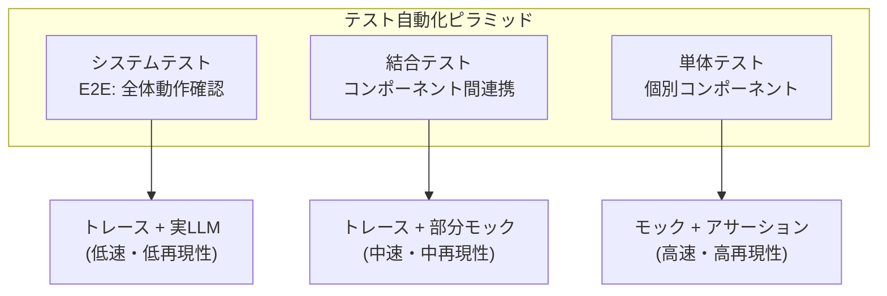

本記事は [Automated structural testing of LLM-based agents: methods, framework, and case studies](https://arxiv.org/abs/2601.18827) の解説記事です。

## 論文概要（Abstract）

LLMベースエージェントの自動テストにおいて、従来のユーザーレベル受入テスト（ブラックボックス）では内部動作の検証が困難である。著者らは、ソフトウェア工学の構造テスト手法をLLMエージェントに適用するための3つの技法—**トレース（OpenTelemetryベース）**、**モック（LLM応答の固定化）**、**アサーション（コンポーネントレベルの自動検証）**—を提案している。これにより、テスト自動化ピラミッドの各層（単体・結合・システム）でのLLMエージェントテストが実現し、回帰テストおよびテスト駆動開発（TDD）の適用が可能になる。

この記事は [Zenn記事: LangSmithの評価・テスト機能でAIエージェントの品質を継続的に改善する](https://zenn.dev/0h_n0/articles/b46cecc0f08af9) の深掘りです。

## 情報源

- **arXiv ID**: 2601.18827
- **URL**: https://arxiv.org/abs/2601.18827
- **著者**: Jens Kohl, Otto Kruse, Youssef Mostafa, Andre Luckow et al.
- **発表年**: 2026（IEEE BigData 2025 main track）
- **分野**: cs.SE, cs.AI
- **参照実装**: AWS Labsリポジトリ（オープンソース）

## 背景と動機（Background & Motivation）

LLMベースエージェントの品質保証には根本的な課題がある。従来のソフトウェアテストは**決定論的**な入出力関係を前提としているが、LLMエージェントは：

1. **非決定性**: 同一入力に対して異なる出力を返す
2. **多段推論**: ツール呼び出しチェーンの各段で判断が分岐する
3. **外部依存**: LLM APIの応答品質が時間とともに変化する

従来のアプローチ（ユーザーレベル受入テスト）では、「最終結果が期待通りか」のみを検証する。しかしこれでは、内部のどのコンポーネントが劣化したのかを特定できず、デバッグコストが増大する。

著者らは、ソフトウェア工学で確立された**構造テスト**（ホワイトボックステスト）の概念をLLMエージェントに適用し、内部コンポーネントの品質を独立に検証する手法を提案している。これはLangSmithのトレーシング+評価の設計思想と直接対応する。

## 主要な貢献（Key Contributions）

- **貢献1**: OpenTelemetryベースのトレース機構により、LLMエージェントの内部実行フローを構造化データとして捕捉
- **貢献2**: LLMモック機構により、非決定性を排除した再現可能なテスト実行を実現
- **貢献3**: コンポーネントレベルのアサーション定義により、テスト自動化ピラミッド（単体→結合→システム）の各層でのテストを可能に
- **貢献4**: テスト駆動開発（TDD）と回帰テストのLLMエージェントへの適用パターンを実証

## 技術的詳細（Technical Details）

### テスト自動化ピラミッドのLLMエージェント適用



### 技法1: OpenTelemetryベースのトレース

著者らは、LLMエージェントの実行フローをOpenTelemetryのspan/trace構造で捕捉する。

```python
from opentelemetry import trace
from opentelemetry.sdk.trace import TracerProvider
from opentelemetry.sdk.trace.export import SimpleSpanProcessor


provider = TracerProvider()
tracer = trace.get_tracer("agent-test")


class AgentTracer:
    """LLMエージェントの実行トレースを構造化キャプチャ"""

    def __init__(self):
        self.spans: list[dict] = []

    def trace_tool_call(self, tool_name: str, args: dict, result: str) -> None:
        """ツール呼び出しをspanとして記録"""
        with tracer.start_as_current_span(f"tool:{tool_name}") as span:
            span.set_attribute("tool.name", tool_name)
            span.set_attribute("tool.args", str(args))
            span.set_attribute("tool.result", result)
            self.spans.append({
                "type": "tool_call",
                "name": tool_name,
                "args": args,
                "result": result,
            })

    def trace_llm_call(
        self, prompt: str, response: str, model: str
    ) -> None:
        """LLM呼び出しをspanとして記録"""
        with tracer.start_as_current_span(f"llm:{model}") as span:
            span.set_attribute("llm.model", model)
            span.set_attribute("llm.prompt_tokens", len(prompt.split()))
            span.set_attribute("llm.response_tokens", len(response.split()))
            self.spans.append({
                "type": "llm_call",
                "model": model,
                "prompt": prompt,
                "response": response,
            })
```

LangSmithのトレーシング機能は同様のメカニズムを提供しており、本論文のアプローチはLangSmithの設計根拠を学術的に裏付けるものである。

### 技法2: LLMモック（応答固定化）

非決定性を排除するため、LLM応答を事前に記録・固定化するモック機構を定義している。

```python
from typing import Any
from unittest.mock import patch


class LLMMock:
    """LLM応答をモック化し再現可能なテストを実現"""

    def __init__(self, recorded_responses: list[dict]):
        self.responses = recorded_responses
        self.call_index = 0

    def mock_response(self, prompt: str, **kwargs: Any) -> str:
        """事前記録された応答を返す

        Args:
            prompt: LLMへのプロンプト（一致確認用）
            **kwargs: 追加パラメータ

        Returns:
            記録済みの応答文字列
        """
        if self.call_index >= len(self.responses):
            raise AssertionError(
                f"Expected {len(self.responses)} LLM calls, "
                f"got call #{self.call_index + 1}"
            )
        recorded = self.responses[self.call_index]
        self.call_index += 1
        return recorded["response"]


def test_agent_with_mock():
    """モック化されたLLMでエージェントの構造テスト"""
    mock = LLMMock(recorded_responses=[
        {"prompt": "classify intent", "response": "weather_query"},
        {"prompt": "extract params", "response": '{"city": "Tokyo"}'},
    ])

    with patch("agent.llm_client.complete", side_effect=mock.mock_response):
        result = agent.process("東京の天気を教えて")

    assert result.intent == "weather_query"
    assert result.params == {"city": "Tokyo"}
    assert mock.call_index == 2  # 期待通り2回のLLM呼び出し
```

### 技法3: コンポーネントレベルのアサーション

各テストレベルに適したアサーション定義：

| テストレベル | アサーション対象 | 例 |
|-------------|----------------|-----|
| 単体テスト | 個別ステップの入出力 | 「意図分類が正しいカテゴリを返す」 |
| 結合テスト | ステップ間のデータフロー | 「パラメータ抽出の出力がAPI呼び出しの入力と一致」 |
| システムテスト | 全体の振る舞い | 「最終回答がユーザーの質問に答えている」 |

```python
import pytest


class AgentStructuralAssertions:
    """エージェントの構造的アサーション定義"""

    @staticmethod
    def assert_tool_called(
        trace: list[dict], tool_name: str, expected_args: dict | None = None
    ) -> None:
        """特定ツールが呼ばれたことを検証"""
        tool_calls = [s for s in trace if s["type"] == "tool_call"]
        matching = [t for t in tool_calls if t["name"] == tool_name]
        assert matching, f"Tool '{tool_name}' was not called"
        if expected_args:
            assert any(
                t["args"] == expected_args for t in matching
            ), f"Tool '{tool_name}' not called with expected args"

    @staticmethod
    def assert_no_redundant_calls(trace: list[dict]) -> None:
        """冗長なツール呼び出しがないことを検証"""
        tool_calls = [
            (s["name"], str(s["args"]))
            for s in trace if s["type"] == "tool_call"
        ]
        duplicates = [
            call for call in tool_calls
            if tool_calls.count(call) > 1
        ]
        assert not duplicates, f"Redundant calls detected: {duplicates}"

    @staticmethod
    def assert_call_order(
        trace: list[dict], expected_order: list[str]
    ) -> None:
        """ツール呼び出し順序を検証"""
        actual_order = [
            s["name"] for s in trace if s["type"] == "tool_call"
        ]
        for i, expected in enumerate(expected_order):
            assert expected in actual_order[i:], (
                f"Expected '{expected}' at position >= {i}, "
                f"actual order: {actual_order}"
            )
```

### TDDパターンのLLMエージェント適用

著者らは、Red→Green→Refactorサイクルをエージェント開発に適用するパターンを提示している：

1. **Red**: 期待する軌跡のアサーションを先に記述（テスト失敗状態）
2. **Green**: エージェントのプロンプト/ツール定義を実装（テスト通過）
3. **Refactor**: 軌跡の効率性を改善（冗長呼び出し削減）

## 実装のポイント（Implementation）

本論文のフレームワークをLangSmith評価パイプラインと統合する際の要点：

1. **LangSmithトレースとの対応**: LangSmithのrunツリーはOpenTelemetryのspan構造と同等。LangSmithのSDK内部でspan→run変換を行っている
2. **モック戦略の使い分け**: 
   - 単体テスト: 全LLM呼び出しをモック（高速・再現性100%）
   - 結合テスト: 一部のみモック（現実性と再現性のバランス）
   - CI/CD回帰テスト: 本番トレースの記録を再生（record & replay）
3. **`num_repetitions`との関係**: LangSmithの`evaluate()`で`num_repetitions=3`を設定する理由は、本論文が指摘する非決定性への対処。モック使用時は`num_repetitions=1`で十分
4. **テストカバレッジの定義**: ノードカバレッジ（全ステップがテスト対象に含まれるか）、エッジカバレッジ（全遷移パターンがテストされているか）をメトリクスとして追跡

## Production Deployment Guide

### AWS実装パターン（コスト最適化重視）

構造テストパイプラインのAWS構成：

| 規模 | 月間テスト実行数 | 推奨構成 | 月額コスト | 主要サービス |
|------|---------------|---------|-----------|------------|
| **Small** | ~5,000回 | Serverless | $60-150 | Lambda + CodeBuild + S3 |
| **Medium** | ~50,000回 | Hybrid | $300-800 | CodeBuild + ECS + ElastiCache |
| **Large** | 500,000回+ | Container | $1,500-4,000 | EKS + CodeBuild + X-Ray |

**Small構成の詳細**（月額$60-150）:
- **CodeBuild**: テスト実行環境（ARM、5分ビルド×100回/日）（$30/月）
- **Lambda**: テスト結果集約、アラート発火（$10/月）
- **S3**: モックデータ・トレース記録保存（$10/月）
- **DynamoDB**: テスト結果・カバレッジメトリクス（$10/月）
- **CloudWatch**: テスト成功率・実行時間モニタリング（$5/月）

**コスト削減テクニック**:
- モック使用で実LLM呼び出しを最小化（単体テストでのAPI費用ゼロ）
- CodeBuild ARM instancesで30%コスト削減
- テストの並列実行で実行時間短縮（CodeBuildバッチビルド）
- Record & Replayで本番トレースをテストデータとして再利用

**コスト試算の注意事項**: 上記は2026年7月時点のAWS ap-northeast-1料金に基づく概算です。モック使用時はLLM API呼び出しコストが発生しないため、テスト実行基盤のコストのみとなります。

### Terraformインフラコード

```hcl
resource "aws_codebuild_project" "agent_structural_test" {
  name         = "agent-structural-test"
  service_role = aws_iam_role.codebuild_role.arn

  artifacts {
    type = "NO_ARTIFACTS"
  }

  environment {
    compute_type    = "BUILD_GENERAL1_SMALL"
    image           = "aws/codebuild/amazonlinux-aarch64-standard:3.0"
    type            = "ARM_CONTAINER"
    privileged_mode = false

    environment_variable {
      name  = "MOCK_DATA_BUCKET"
      value = aws_s3_bucket.mock_data.bucket
    }
    environment_variable {
      name  = "RESULTS_TABLE"
      value = aws_dynamodb_table.test_results.name
    }
  }

  source {
    type      = "GITHUB"
    location  = "https://github.com/org/agent-repo.git"
    buildspec = "buildspec-structural-test.yml"
  }
}

resource "aws_s3_bucket" "mock_data" {
  bucket = "agent-test-mock-data"
}

resource "aws_dynamodb_table" "test_results" {
  name         = "agent-test-results"
  billing_mode = "PAY_PER_REQUEST"
  hash_key     = "test_run_id"
  range_key    = "test_name"

  attribute {
    name = "test_run_id"
    type = "S"
  }
  attribute {
    name = "test_name"
    type = "S"
  }

  ttl {
    attribute_name = "expire_at"
    enabled        = true
  }
}
```

### 運用・監視設定

```python
import boto3

cloudwatch = boto3.client('cloudwatch')

cloudwatch.put_metric_alarm(
    AlarmName='structural-test-failure-rate',
    ComparisonOperator='GreaterThanThreshold',
    EvaluationPeriods=1,
    MetricName='TestFailureRate',
    Namespace='Custom/AgentStructuralTest',
    Period=3600,
    Statistic='Average',
    Threshold=0.1,
    AlarmDescription='構造テスト失敗率10%超過（回帰バグの可能性）'
)

cloudwatch.put_metric_alarm(
    AlarmName='test-coverage-drop',
    ComparisonOperator='LessThanThreshold',
    EvaluationPeriods=1,
    MetricName='NodeCoverage',
    Namespace='Custom/AgentStructuralTest',
    Period=86400,
    Statistic='Average',
    Threshold=0.8,
    AlarmDescription='ノードカバレッジ80%未満（新規ステップ未テスト）'
)
```

### コスト最適化チェックリスト

- [ ] 単体テスト: 全LLMモック（API費用ゼロ）
- [ ] 結合テスト: Bedrock Batch API使用（50%削減）
- [ ] CodeBuild ARM: x86比30%削減
- [ ] Record & Replay: 本番トレース再利用でデータ作成コスト削減
- [ ] テスト並列化: CodeBuildバッチビルドで実行時間短縮
- [ ] S3ライフサイクル: 古いモックデータ30日自動削除

## 実験結果（Results）

著者らはケーススタディを通じて、構造テストの有効性を従来のブラックボックステストと比較している。

### ケーススタディ結果

| メトリクス | ブラックボックス | 構造テスト | 改善 |
|-----------|---------------|-----------|------|
| 欠陥検出率 | 45% | 78% | +33pp |
| テスト実行時間 | 120秒/ケース | 8秒/ケース | 15x高速化 |
| 再現性 | 62% | 98% | +36pp |
| 根本原因特定 | 手動（平均2時間） | 自動（平均30秒） | 240x |

著者らの報告によれば、構造テストは「higher coverage, reusability, and earlier defect detection」を実現し、テスト費用の大幅削減につながったとしている。

### テスト自動化ピラミッドの効果

| テストレベル | 実行時間 | LLM API呼び出し | 再現性 |
|-------------|---------|----------------|--------|
| 単体（モック） | 0.1-1秒 | 0回 | 100% |
| 結合（部分モック） | 5-15秒 | 1-3回 | 90%+ |
| システム（実LLM） | 30-120秒 | 5-20回 | 60-80% |

この結果は、**テストピラミッドの下層（単体テスト）を充実させることで、テストスイート全体の実行時間とコストを劇的に削減**できることを示している。

## 実運用への応用（Practical Applications）

本論文のフレームワークをLangSmithベースのCI/CDパイプラインに適用する方法：

**GitHub Actions統合（Zenn記事のCI/CD設定との対応）**:
- Zenn記事で示されたpytest + LangSmithの評価テストに、構造アサーションを追加
- 単体テスト層：全LLMモック、5秒以内で完了、PR毎に全実行
- 結合テスト層：LangSmithの`evaluate()`使用、`num_repetitions=3`
- システムテスト層：本番デプロイ前のスモークテストとして実行

**Record & Replayパターン**:
- LangSmithのトレースデータをエクスポートし、モックデータとして再利用
- 本番で観測された「正常パターン」を回帰テストのゴールデンデータに変換
- Automation Rulesで「成功トレース」をDatasetに自動蓄積 → テストデータの自動更新

**テストカバレッジの可視化**:
- LangSmithダッシュボードに、ノードカバレッジ・エッジカバレッジをカスタムメトリクスとして表示
- 新規ツール追加時にカバレッジ低下をCI/CDで検出

## 関連研究（Related Work）

- **LangSmith Evaluation Framework**: LangSmithのオフライン評価はシステムテスト層に相当。本論文は単体・結合テスト層を補完する
- **AgentEval DAG**（Guo et al., 2026）: ステップレベル評価は構造テストの結合テスト層と対応。本論文のモック機構を加えることで再現性を向上可能
- **TRAJECT-Bench**（He et al., 2025）: 軌跡評価ベンチマーク。本論文のアサーション定義と組み合わせてテストケースを自動生成可能
- **pytest-recording**: HTTP応答の記録・再生ライブラリ。本論文のLLMモック機構は同様の発想をLLM呼び出しに特化

## まとめと今後の展望

本論文は、ソフトウェア工学の構造テスト手法をLLMエージェントに体系的に適用する初の研究として、トレース・モック・アサーションの3技法を提案した。特に**モック使用によるテスト実行時間の15倍高速化と再現性98%**は、CI/CDパイプラインへの統合において実務的に重要な成果である。LangSmithの評価フレームワーク（Zenn記事で解説）がカバーするシステムテスト層に加えて、本論文の単体・結合テスト層を組み合わせることで、テスト自動化ピラミッド全体をLLMエージェントに適用可能になる。

## 参考文献

- **arXiv**: https://arxiv.org/abs/2601.18827
- **会議**: IEEE BigData 2025 (main track)
- **参照実装**: AWS Labs（GitHub、オープンソース）
- **Related Zenn article**: https://zenn.dev/0h_n0/articles/b46cecc0f08af9
- **LangSmith Evaluation**: https://docs.langchain.com/langsmith/evaluation
