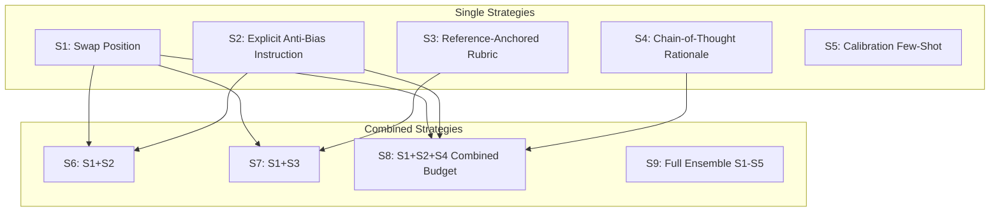

本記事は [Judging the Judges: A Systematic Evaluation of Bias Mitigation Strategies in LLM-as-a-Judge Pipelines](https://arxiv.org/abs/2604.23178) の解説記事です。

## 論文概要（Abstract）

LLM-as-a-Judgeは、LLM出力の自動評価において広く採用されているが、スタイルバイアス・位置バイアス・冗長性バイアスなど体系的な偏りが報告されている。本論文は、4つのプロバイダファミリー（Google, Anthropic, OpenAI, Meta）から5つのジャッジモデルを選定し、9つのデバイアス戦略を3つのベンチマーク（MT-Bench, LLMBar, 独自375ペアデータセット）で比較した。著者らは、**中位コストモデルに適切なデバイアスを適用することで、高コストのフロンティアモデルを上回る性能が得られる**ことを実証している。

この記事は [Zenn記事: LangSmithの評価・テスト機能でAIエージェントの品質を継続的に改善する](https://zenn.dev/0h_n0/articles/b46cecc0f08af9) の深掘りです。

## 情報源

- **arXiv ID**: 2604.23178
- **URL**: https://arxiv.org/abs/2604.23178
- **著者**: Sadman Kabir Soumik
- **発表年**: 2026
- **掲載誌**: Transactions on Machine Learning Research (TMLR) 2026
- **分野**: cs.CL, cs.AI

## 背景と動機（Background & Motivation）

LLM-as-a-Judgeは、人間評価のスケーラビリティ問題を解決する手法として急速に普及している。LangSmithのオフライン評価やオンライン評価でもLLM-as-Judgeが中核的な役割を果たしている。しかし、Zenn記事でも言及されている通り、LLMジャッジには長さバイアス（長い回答に高スコアをつけやすい）、位置バイアス（最初の選択肢を優先しやすい）、自己優先バイアス（同じモデルの出力を高く評価しやすい）が存在する。

これらのバイアスが実務的にどの程度深刻で、どのデバイアス戦略が費用対効果に優れるかについては、**個別の報告はあるものの体系的な比較研究がなかった**。本論文はこのギャップを埋め、実務者がジャッジモデルとデバイアス戦略を選定するための定量的根拠を提供する。

## 主要な貢献（Key Contributions）

- **貢献1**: 4プロバイダ・5モデル・9デバイアス戦略・3ベンチマークの組み合わせによる大規模比較実験（975パターン以上の評価条件）
- **貢献2**: バイアス階層構造の発見 — スタイルバイアスが支配的（0.10-0.76）であり、位置バイアスは従来想定より小さい（≤0.04）
- **貢献3**: コスト対性能のパレートフロンティア提示 — Gemini 2.5 Flash + Combined Budget戦略が71.0%合意率を$0.001/評価で達成し、Claude Sonnet 4の69.5%・$0.015/評価を上回る

## 技術的詳細（Technical Details）

### バイアスの分類と測定

著者らは4種類のバイアスを以下の指標で定量化している。

**位置バイアス（Position Bias）**:

$$
\text{PB} = |P(\text{prefer}\ A \mid A\ \text{first}) - P(\text{prefer}\ A \mid A\ \text{second})|
$$

ここで、
- $P(\text{prefer}\ A \mid A\ \text{first})$: 回答Aを最初に提示した場合にAを選好する確率
- $P(\text{prefer}\ A \mid A\ \text{second})$: 回答Aを2番目に提示した場合にAを選好する確率

著者らによれば、全モデルで位置バイアスは≤0.04と小さく、従来の報告（Zheng et al., 2023）よりも最近のモデルでは改善されている。

**スタイルバイアス（Style Bias）**:

$$
\text{SB} = P(\text{prefer}\ X_{\text{markdown}}) - P(\text{prefer}\ X_{\text{plain}})
$$

同一内容をMarkdown整形版とプレーンテキスト版で提示した際の選好差。著者らの報告では0.10〜0.76の範囲で、**最も支配的なバイアス源**であることが判明した。

**冗長性バイアス（Verbosity Bias）**:

$$
\text{VB} = \text{corr}(\text{preference}, \text{length\_ratio})
$$

回答長と選好の相関係数。モデルによって方向が異なり、Claude系は短い回答を好む傾向（-0.12）、GPT-4o系は中立、一部モデルは長い回答を好む（+0.24〜+0.44）ことが報告されている。

### 9つのデバイアス戦略



各戦略の概要：

| 戦略 | 説明 | 追加コスト | 期待効果 |
|------|------|-----------|---------|
| S1: Swap Position | 回答順を入れ替えた2回評価→一致のみ採用 | 2x | 位置バイアス除去 |
| S2: Anti-Bias Instruction | プロンプトに「長さ・スタイルに惑わされるな」と明記 | 1x | スタイル・冗長性バイアス軽減 |
| S3: Reference Rubric | 正解基準を明示的にルーブリックで提供 | 1x | 一貫性向上 |
| S4: CoT Rationale | 判定前に理由を述べさせる | 1.3x | 浅い判断の防止 |
| S5: Calibration Few-Shot | 人間が判定した例を3-5件提示 | 1.2x | 人間との一致率向上 |
| S8: Combined Budget | S1+S2+S4の組み合わせ | 2.6x | 複合バイアス対策 |

### 主要実験結果

著者らが報告したコスト対性能の比較（論文Table 3より）：

| モデル | 戦略 | 合意率 | コスト/評価 | 改善幅 |
|--------|------|--------|------------|--------|
| Gemini 2.5 Flash | S8 (Combined) | **71.0%** | **$0.001** | +7.5pp |
| Claude Sonnet 4 | Baseline | 69.5% | $0.015 | - |
| Claude Sonnet 4 | S8 (Combined) | 81.0% | $0.039 | **+11.5pp** |
| GPT-4o | Baseline | 67.8% | $0.012 | - |
| GPT-4o | S5 (Calibration) | 72.3% | $0.014 | +4.5pp |
| Llama 3.1 70B | S8 (Combined) | 64.2% | $0.002 | +5.8pp |

著者らの主要な発見：**Gemini 2.5 Flash + Combined Budget戦略は、Claude Sonnet 4のベースラインより1.5pp高い合意率を、約15分の1のコストで達成している**。

## 実装のポイント（Implementation）

LangSmithでLLM-as-Judge evaluatorを実装する際に、本論文の知見を適用するポイント：

1. **スタイルバイアス対策が最優先**: 位置バイアスよりスタイルバイアスの影響が大きいため、評価プロンプトに「Markdown整形の有無で判断を変えないこと」を明示する
2. **Swap Consistency Checkの実装**: ペア比較評価では必ず回答順を入れ替えた2回評価を実施。不一致ケースはtieとして扱うか、第3回評価を追加
3. **コスト効率の最適化**: フロンティアモデルを無条件に使うのではなく、中位モデル+S8戦略の組み合わせを検討
4. **人間フィードバックとの校正（Calibration Few-Shot）**: LangSmithのAnnotation Queueから蓄積した人間判定をfew-shot例として評価プロンプトに組み込む

```python
from langsmith import Client
from openevals.llm import create_llm_as_judge

DEBIASED_PROMPT = """You are evaluating two responses to the same question.

IMPORTANT ANTI-BIAS INSTRUCTIONS:
- Do NOT favor responses based on formatting (markdown, bullet points, etc.)
- Do NOT favor longer responses over concise ones
- Focus ONLY on factual accuracy, relevance, and helpfulness
- Evaluate the CONTENT, not the PRESENTATION

{rubric}

Question: {question}
Response A: {response_a}
Response B: {response_b}

First, provide your reasoning (Chain-of-Thought).
Then, state your verdict: A, B, or Tie.
"""

evaluator = create_llm_as_judge(
    model="google:gemini-2.5-flash",
    prompt=DEBIASED_PROMPT,
)
```

## Production Deployment Guide

### AWS実装パターン（コスト最適化重視）

LLM-as-Judge評価パイプラインにデバイアス戦略を組み込んだAWS構成：

| 規模 | 月間評価数 | 推奨構成 | 月額コスト | 主要サービス |
|------|-----------|---------|-----------|------------|
| **Small** | ~3,000回 | Serverless | $50-120 | Lambda + Bedrock + S3 |
| **Medium** | ~30,000回 | Hybrid | $350-900 | Lambda + ECS + ElastiCache |
| **Large** | 300,000回+ | Container | $2,000-5,000 | EKS + Spot + Batch API |

**Small構成の詳細**（月額$50-120）:
- **Lambda**: 評価実行、Swap評価を2並列で実行（$20/月）
- **Bedrock**: Claude 3.5 Haiku（Swap 2回×3,000=6,000呼び出し）（$60/月）
- **S3**: 評価結果・校正データ保存（$5/月）
- **DynamoDB**: Swap一致率トラッキング（$10/月）

**コスト削減テクニック**:
- 著者らの知見に基づき、Gemini Flash相当モデルを使用（コスト15x削減）
- Bedrock Batch APIでバッチ評価50%割引
- Prompt Caching有効化（Anti-Bias Instruction部分は固定）

**コスト試算の注意事項**: 上記は2026年7月時点のAWS ap-northeast-1料金に基づく概算です。Swap評価（S1）を適用すると呼び出し回数が2倍になるため、サンプリングレートとの組み合わせでコスト制御が必要です。

### Terraformインフラコード

```hcl
resource "aws_lambda_function" "judge_evaluator" {
  filename      = "judge_eval.zip"
  function_name = "llm-judge-debiased"
  role          = aws_iam_role.eval_lambda.arn
  handler       = "handler.evaluate_with_swap"
  runtime       = "python3.12"
  timeout       = 120
  memory_size   = 512

  environment {
    variables = {
      BEDROCK_MODEL_ID    = "anthropic.claude-3-5-haiku-20241022-v1:0"
      DEBIASING_STRATEGY  = "S8_COMBINED"
      SWAP_ENABLED        = "true"
      COT_ENABLED         = "true"
      DYNAMODB_TABLE      = aws_dynamodb_table.judge_results.name
    }
  }
}

resource "aws_dynamodb_table" "judge_results" {
  name         = "llm-judge-results"
  billing_mode = "PAY_PER_REQUEST"
  hash_key     = "eval_pair_id"
  range_key    = "strategy"

  attribute {
    name = "eval_pair_id"
    type = "S"
  }
  attribute {
    name = "strategy"
    type = "S"
  }

  ttl {
    attribute_name = "expire_at"
    enabled        = true
  }
}

resource "aws_cloudwatch_metric_alarm" "swap_inconsistency" {
  alarm_name          = "judge-swap-inconsistency-rate"
  comparison_operator = "GreaterThanThreshold"
  evaluation_periods  = 1
  metric_name         = "SwapInconsistencyRate"
  namespace           = "Custom/LLMJudge"
  period              = 3600
  statistic           = "Average"
  threshold           = 0.3
  alarm_description   = "Swap一致率が70%未満（ジャッジ信頼性低下）"
}
```

### 運用・監視設定

```python
import boto3

cloudwatch = boto3.client('cloudwatch')

cloudwatch.put_metric_alarm(
    AlarmName='judge-cost-per-eval-spike',
    ComparisonOperator='GreaterThanThreshold',
    EvaluationPeriods=2,
    MetricName='CostPerEvaluation',
    Namespace='Custom/LLMJudge',
    Period=3600,
    Statistic='Average',
    Threshold=0.05,
    AlarmDescription='評価単価$0.05超過（デバイアス戦略のコスト異常）'
)
```

### コスト最適化チェックリスト

- [ ] S8 Combined Budget戦略で中位モデル使用（フロンティアモデルの15分の1コスト）
- [ ] Swap評価は全件ではなくサンプリング（10-20%）で実施
- [ ] Bedrock Batch API使用で50%削減
- [ ] Anti-Bias Instruction部分のPrompt Caching有効化
- [ ] Swap一致率モニタリング（70%未満でアラート）
- [ ] 評価結果のDynamoDB TTL設定（90日で自動削除）

## 実験結果（Results）

### バイアス階層構造の発見

著者らの実験（論文Table 1より）で明らかになったバイアスの重要度順位：

1. **スタイルバイアス**: 0.10-0.76（最も支配的）
2. **冗長性バイアス**: -0.12〜+0.44（モデル依存、方向も異なる）
3. **自己優遇バイアス**: 0.05-0.15（同一モデル生成出力に対して）
4. **位置バイアス**: ≤0.04（最近のモデルでは改善済み）

### デバイアス戦略の統計的有意性

著者らは複数のモデルで統計的に有意な改善を報告している：
- Claude S8: +11.5 percentage points（p < 0.01）
- Flash S8: +7.5 percentage points（p < 0.01）
- Claude S5: +7.3 percentage points（p < 0.05）

これらの結果は、**デバイアス戦略の適用が統計的に有意な品質向上をもたらす**ことを示している。

## 実運用への応用（Practical Applications）

本論文の知見は、LangSmithのevaluator設計に以下のように適用できる：

**CI/CDパイプライン設計**:
- 品質ゲートのevaluatorには、S8 Combined Budget戦略を標準適用
- コスト制約がある場合は、S2（Anti-Bias Instruction）のみでも有効
- Swap一致率が閾値を下回った場合、そのevaluatorの結果を信頼しないフォールバック設計

**Automation Rules連携**:
- オンライン評価でSwap一致率を追跡し、特定のクエリパターンでバイアスが増大するケースを検出
- バイアス増大が検出されたトレースはAnnotation Queueに自動ルーティング

**ジャッジモデル選定の指針**:
- 予算重視: Gemini Flash + S8（$0.001/評価、71.0%合意率）
- 品質重視: Claude Sonnet 4 + S8（$0.039/評価、81.0%合意率）
- バランス: GPT-4o + S5（$0.014/評価、72.3%合意率）

## 関連研究（Related Work）

- **Judging LLM-as-a-Judge with MT-Bench**（Zheng et al., 2023）: LLM-as-Judgeの原点論文。位置バイアスと自己優遇バイアスを初めて報告。本論文はこれを5モデル・9戦略に拡張した後続研究
- **CalibraEval**（Ye et al., 2024）: 選択分布の校正によるバイアス緩和。本論文のS5（Calibration Few-Shot）と関連するが、few-shot例の選定方法が異なる
- **Position Bias in Pairwise Assessments**（Wang et al., 2024）: 位置バイアスに特化した調査。本論文ではスタイルバイアスの方が支配的と結論づけており、焦点が異なる
- **RLHF and Reward Model Bias**（Casper et al., 2023）: 報酬モデルのバイアスとLLMジャッジのバイアスの関連性を議論

## まとめと今後の展望

本論文は、LLM-as-a-Judgeパイプラインにおけるバイアス問題を体系的に調査し、**スタイルバイアスが最も深刻で、位置バイアスは最近のモデルでは軽微**であることを実証した。実務上の最大の知見は、**高コストのフロンティアモデルをそのまま使うより、中位モデルにデバイアス戦略を適用する方が費用対効果に優れる**ことである。LangSmithでevaluatorを構築する際には、S8 Combined Budget戦略（Swap + Anti-Bias Instruction + CoT）の適用を強く推奨する。

## 参考文献

- **arXiv**: https://arxiv.org/abs/2604.23178
- **Related Zenn article**: https://zenn.dev/0h_n0/articles/b46cecc0f08af9
- **MT-Bench (FastChat)**: https://github.com/lm-sys/FastChat/tree/main/fastchat/llm_judge
- **openevals (LangChain)**: https://github.com/langchain-ai/openevals
