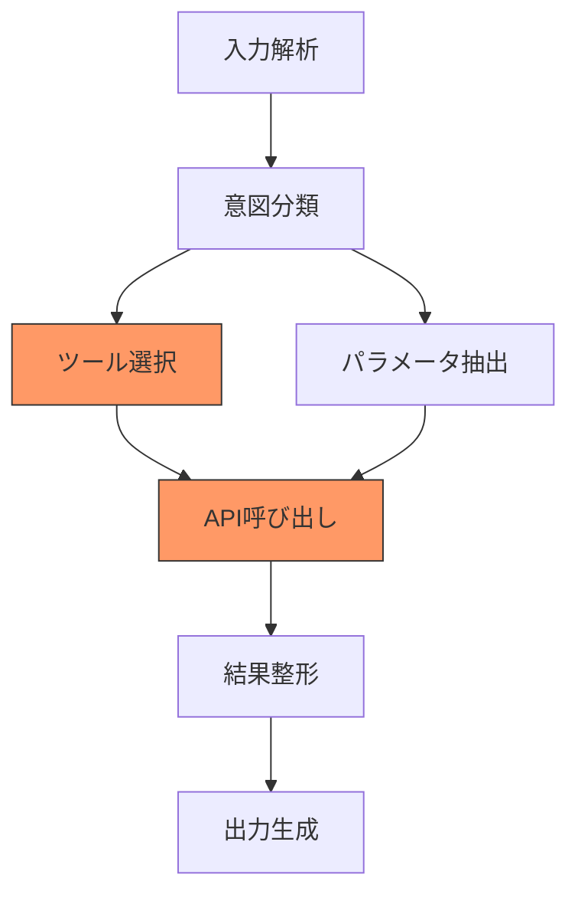

本記事は [AgentEval: DAG-Structured Step-Level Evaluation for Agentic Workflows with Error Propagation Tracking](https://arxiv.org/abs/2604.23581) の解説記事です。

## 論文概要（Abstract）

AgentEvalは、マルチステップAIエージェントシステムの評価において、実行フローをDAG（有向非巡回グラフ）としてモデル化し、各ステップの品質を独立に評価するとともに、ステップ間の依存関係を通じてエラーの伝播経路と根本原因を自動特定するフレームワークである。従来のエンドツーエンド評価と比較して、障害検出再現率を2.17倍（0.89 vs 0.41）に向上させ、根本原因特定時間を中央値4.2時間から22分に短縮したことが報告されている。

この記事は [Zenn記事: LangSmithの評価・テスト機能でAIエージェントの品質を継続的に改善する](https://zenn.dev/0h_n0/articles/b46cecc0f08af9) の深掘りです。

## 情報源

- **会議名**: ACL 2026（Industry Track）
- **年**: 2026
- **URL**: https://arxiv.org/abs/2604.23581
- **著者**: Dongxin Guo, Jikun Wu, Siu Ming Yiu
- **発表形式**: Industry Track Paper

## カンファレンス情報

**ACL（Association for Computational Linguistics）** は自然言語処理分野の最高峰会議の1つで、Industry Trackは学術的な新規性に加えて実務での有効性を重視する。本論文は、18名のエンジニアによる4ヶ月のCI/CDパイロット運用を含む産業実証を伴っている点が特徴的である。

## 技術的詳細（Technical Details）

### DAGベースのワークフロー表現

AgentEvalの核となるアイデアは、エージェントの実行フローを**線形シーケンスではなくDAG**として表現することにある。



上図では、ノードCで「ツール選択」の障害が発生した場合、依存関係を通じてノードE「API呼び出し」にも障害が伝播する。AgentEvalはこの依存構造を活用し、ノードEの障害がノードC由来の**二次障害**であることを自動判定する。

### ステップ品質スコアの計算

各ノード（ステップ）$v_i$に対して、品質スコア$q_i$は以下のように計算される：

$$
q_i = \text{Judge}(v_i, \text{rubric}(v_i), \text{context}(v_i))
$$

ここで、
- $v_i$: ステップ$i$の入出力データ
- $\text{rubric}(v_i)$: ステップ$i$に対するドメイン固有の評価基準
- $\text{context}(v_i)$: 親ノードの出力を含むコンテキスト
- $\text{Judge}$: 校正済みGPT-4oジャッジ（Cohen's κ = 0.84で人間と一致）

### エラー伝播追跡アルゴリズム

障害ノードが特定された後、根本原因を以下のアルゴリズムで特定する：

$$
\text{RootCause}(v_i) = \begin{cases}
v_i & \text{if } \forall v_j \in \text{parents}(v_i): q_j \geq \tau \\
\text{RootCause}(\arg\min_{v_j \in \text{parents}(v_i)} q_j) & \text{otherwise}
\end{cases}
$$

ここで、$\tau$は品質閾値、$\text{parents}(v_i)$はDAG上で$v_i$に直接依存するノードの集合を表す。

```python
from dataclasses import dataclass
from typing import Optional


@dataclass
class StepNode:
    """DAG上のステップノード"""
    id: str
    parents: list[str]
    quality_score: float
    failure_type: Optional[str] = None


def trace_root_cause(
    node: StepNode,
    dag: dict[str, StepNode],
    threshold: float = 0.7,
) -> StepNode:
    """障害ノードから根本原因ノードを再帰的に探索する

    Args:
        node: 障害が検出されたノード
        dag: DAG全体のノード辞書
        threshold: 品質閾値（これ未満で障害と判定）

    Returns:
        根本原因ノード
    """
    failed_parents = [
        dag[pid] for pid in node.parents
        if dag[pid].quality_score < threshold
    ]

    if not failed_parents:
        return node

    worst_parent = min(failed_parents, key=lambda n: n.quality_score)
    return trace_root_cause(worst_parent, dag, threshold)
```

### 障害分類タクソノミー

著者らは21のサブカテゴリを持つ3階層の障害分類を定義している：

| レベル1 | レベル2 | 例 |
|---------|---------|-----|
| 入力処理障害 | 意図誤認識 | ユーザー要求の誤解析 |
| | パラメータ欠損 | 必須引数の未抽出 |
| 推論障害 | ツール選択誤り | 類似ツールの混同 |
| | 計画不整合 | ステップ順序の論理的矛盾 |
| 実行障害 | API呼び出し失敗 | タイムアウト、認証エラー |
| | 結果解釈誤り | JSONパース失敗、型変換エラー |

## 実装のポイント（Implementation）

AgentEvalをLangSmithベースのCI/CDパイプラインに統合する際の要点：

1. **DAG構造の自動抽出**: LangGraphの実行グラフからDAGを自動構築。`extract_langgraph_trajectory_from_thread`と同様のメカニズムで依存関係を取得
2. **ルーブリック設計**: 各ノードタイプに対応する評価基準を事前定義。LangSmithのDatasetにルーブリックを保存し、バージョン管理
3. **閾値チューニング**: $\tau=0.7$は著者らの推奨値だが、ドメインによって調整が必要。偽陽性率と偽陰性率のトレードオフを監視
4. **CI/CD統合**: プルリクエスト時に変更されたノードの周辺ステップのみを再評価するインクリメンタル評価が可能

## Production Deployment Guide

### AWS実装パターン（コスト最適化重視）

DAGベースのステップ評価パイプラインをAWSに構築する場合：

| 規模 | 月間評価数 | 推奨構成 | 月額コスト | 主要サービス |
|------|-----------|---------|-----------|------------|
| **Small** | ~3,000回 | Serverless | $100-250 | Step Functions + Lambda + Bedrock |
| **Medium** | ~30,000回 | Hybrid | $500-1,200 | Step Functions + ECS + ElastiCache |
| **Large** | 300,000回+ | Container | $3,000-7,000 | EKS + Step Functions + Neptune |

**Small構成の詳細**（月額$100-250）:
- **Step Functions**: DAGワークフロー制御、ステップ間依存を表現（$25/月）
- **Lambda**: 各ステップのジャッジ実行、エラー伝播追跡（$30/月）
- **Bedrock**: GPT-4o相当のジャッジモデル（$120/月）
- **DynamoDB**: DAG構造・評価結果・障害タクソノミー保存（$15/月）
- **SNS**: 根本原因特定時のアラート通知（$5/月）

**コスト削減テクニック**:
- インクリメンタル評価: 変更されたノードの依存グラフのみ再評価
- ジャッジモデル階層化: 明確な障害はルールベース、曖昧なケースのみLLMジャッジ
- 結果キャッシュ: 同一入力パターンの評価結果をElastiCacheに保持

**コスト試算の注意事項**: 上記は2026年7月時点のAWS ap-northeast-1料金に基づく概算です。DAGの複雑度（ノード数・エッジ数）により1評価あたりのジャッジ呼び出し回数が変動するため、実コストはワークフロー構造に依存します。

### Terraformインフラコード

```hcl
resource "aws_sfn_state_machine" "agent_eval_dag" {
  name     = "agent-eval-dag-pipeline"
  role_arn = aws_iam_role.sfn_role.arn

  definition = jsonencode({
    StartAt = "ExtractDAG"
    States = {
      ExtractDAG = {
        Type     = "Task"
        Resource = aws_lambda_function.extract_dag.arn
        Next     = "EvaluateSteps"
      }
      EvaluateSteps = {
        Type = "Map"
        ItemsPath = "$.nodes"
        Iterator = {
          StartAt = "JudgeStep"
          States = {
            JudgeStep = {
              Type     = "Task"
              Resource = aws_lambda_function.judge_step.arn
              End      = true
            }
          }
        }
        Next = "TraceRootCause"
      }
      TraceRootCause = {
        Type     = "Task"
        Resource = aws_lambda_function.trace_root_cause.arn
        End      = true
      }
    }
  })
}

resource "aws_lambda_function" "judge_step" {
  filename      = "judge_step.zip"
  function_name = "dag-step-judge"
  role          = aws_iam_role.eval_lambda.arn
  handler       = "handler.judge"
  runtime       = "python3.12"
  timeout       = 90
  memory_size   = 512

  environment {
    variables = {
      BEDROCK_MODEL_ID = "anthropic.claude-3-5-haiku-20241022-v1:0"
      QUALITY_THRESHOLD = "0.7"
      TAXONOMY_TABLE   = aws_dynamodb_table.failure_taxonomy.name
    }
  }
}

resource "aws_dynamodb_table" "failure_taxonomy" {
  name         = "agent-eval-failures"
  billing_mode = "PAY_PER_REQUEST"
  hash_key     = "workflow_id"
  range_key    = "node_id"

  attribute {
    name = "workflow_id"
    type = "S"
  }
  attribute {
    name = "node_id"
    type = "S"
  }
}
```

### 運用・監視設定

```python
import boto3

cloudwatch = boto3.client('cloudwatch')

cloudwatch.put_metric_alarm(
    AlarmName='dag-eval-root-cause-time',
    ComparisonOperator='GreaterThanThreshold',
    EvaluationPeriods=1,
    MetricName='RootCauseIdentificationTime',
    Namespace='Custom/AgentEvalDAG',
    Period=3600,
    Statistic='p95',
    Threshold=60000,
    AlarmDescription='根本原因特定時間P95が60秒超過'
)
```

### コスト最適化チェックリスト

- [ ] インクリメンタル評価: 変更ノードの±2ホップのみ再評価
- [ ] ジャッジ階層化: ルールベース→LLMの2段階構成
- [ ] Step Functions Express: 短時間ワークフローはExpress（コスト1/10）
- [ ] 評価結果キャッシュ: ElastiCache/DynamoDB活用
- [ ] Batch評価: 非リアルタイムはBedrock Batch API（50%削減）
- [ ] DAG複雑度制限: 1ワークフロー20ノード以下を推奨

## 実験結果（Results）

著者らは450テストケース・3プロダクションワークフロー・2つのエージェントモデルファミリーで評価を実施した（論文Table 4-5より）。

| メトリクス | End-to-End評価 | AgentEval | 改善率 |
|-----------|---------------|-----------|--------|
| 障害検出再現率 | 0.41 | **0.89** | 2.17x |
| Cohen's κ（人間一致） | 0.52 | **0.84** | +0.32 |
| 根本原因正確度 | 38% | **72%** | +34pp |
| 人間上限（根本原因） | - | 81% | 72/81=89% |

**DAGベース依存モデリングの寄与**:
- 障害検出再現率: +22 percentage points
- 根本原因正確度: +34 percentage points

著者らは、「DAG-based dependency modelingだけで、障害検出再現率に+22pp、根本原因正確度に+34ppの寄与がある」と報告している。

### CI/CDパイロット運用結果

18名のエンジニアによる4ヶ月のパイロットで報告された成果：
- 23件のプレリリース回帰バグを検出
- 根本原因特定の中央値時間: 4.2時間 → 22分（91%短縮）
- 2つのワークフローで障害率の測定可能な低減を確認

## 実運用への応用（Practical Applications）

AgentEvalの知見をLangSmithベースのCI/CDパイプラインに適用する方法：

**LangGraphとの統合**:
- LangGraphのノード遷移をDAGとして自動抽出し、各ノードに対してカスタムEvaluatorを設定
- `agentevals`のGraph Trajectory評価と組み合わせ、ノード遷移パターンの正確性と各ステップの品質を同時に評価

**Automation Rules連携**:
- 障害検出されたトレースの根本原因ノードを自動タグ付け
- 同一根本原因が反復出現する場合、Webhookで開発チームに通知
- 根本原因ノードの出力パターンをDatasetに自動追加（回帰テスト蓄積）

**プロンプト変更の影響分析**:
- プロンプト変更が影響するノードとその下流ノードを特定
- 下流ノードの品質スコア変化を追跡し、意図しない副作用を検出

## 関連研究（Related Work）

- **TRAJECT-Bench**（He et al., 2025）: 軌跡レベルの細粒度評価。AgentEvalはこれを依存構造に拡張した上位互換と位置づけられる
- **tau-bench**（Sierra Research, 2024）: ツール呼び出し+ユーザーインタラクションの軌跡評価。AgentEvalのDAG表現で依存関係を明示化可能
- **Process Reward Models**（Lightman et al., 2023）: ステップレベルの報酬付与。AgentEvalはこれを障害診断に特化させた応用
- **SWE-bench**（Jimenez et al., 2024）: コーディングエージェントのベンチマーク。AgentEvalのtransferabilityはSWE-benchでも検証済み（再現率≥0.78）

## まとめと今後の展望

AgentEvalは、エージェント評価を「最終結果が正しいか」から「どのステップでなぜ失敗したか」に深化させるフレームワークである。著者らが実証した91%の根本原因特定時間短縮は、LangSmithのAnnotation Queueレビューやオンライン評価のアラート設計において直接的な実務価値を持つ。今後は、マルチエージェントシステムにおけるエージェント間のエラー伝播追跡や、動的に変化するDAG構造への適応が課題として挙げられている。

## 参考文献

- **arXiv**: https://arxiv.org/abs/2604.23581
- **会議**: ACL 2026 Industry Track
- **Related Zenn article**: https://zenn.dev/0h_n0/articles/b46cecc0f08af9
- **agentevals (LangChain)**: https://github.com/langchain-ai/agentevals
