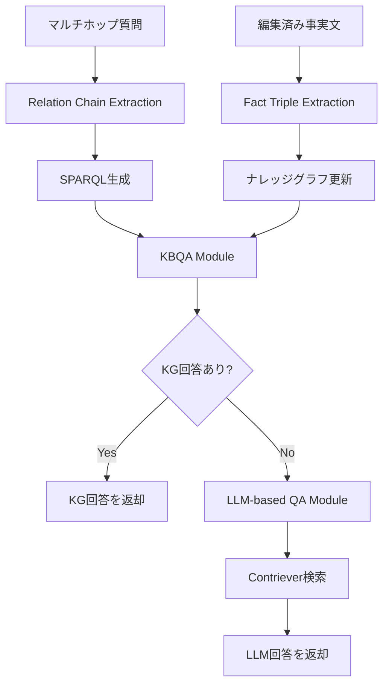

## 論文概要

本記事は [LLM-Based Multi-Hop Question Answering with Knowledge Graph Integration in Evolving Environments](https://aclanthology.org/2024.findings-emnlp.844/)（Chen et al., EMNLP 2024 Findings）の解説記事です。

大規模言語モデル（LLM）は広範な知識を内部パラメータに保持しているが、現実世界の事実は絶えず変化するため、静的なパラメトリック知識では対応できない場面がある。既存の知識編集手法（MEND、ROME、MEMIT等）はパラメータを直接書き換えるアプローチを取るが、複数の事実が連鎖するマルチホップ推論においては性能が急激に劣化する。本論文では、著者らがGMeLLo（Graph Memory-based Editing for Large Language Models）を提案し、ナレッジグラフ（KG）の明示的な知識表現とLLMの言語的柔軟性を統合することで、知識更新環境下でのマルチホップ質問応答の精度を大幅に向上させたと報告している。MQuAKEベンチマークにおいて、特に大量の知識編集が行われるシナリオで既存手法を顕著に上回る性能を達成している。

この記事は [Zenn記事: GraphRAG×Neo4jでマルチホップQAの検索精度を向上させる実装手法](https://zenn.dev/0h_n0/articles/6d0864d1a0f732) の深掘りです。

## 情報源

- **会議名**: EMNLP 2024（Findings of the Association for Computational Linguistics）
- **年**: 2024
- **URL**: [https://aclanthology.org/2024.findings-emnlp.844/](https://aclanthology.org/2024.findings-emnlp.844/)
- **著者**: Ruirui Chen, Weifeng Jiang, Chengwei Qin, Ishaan Singh Rawal, Cheston Tan, Dongkyu Choi, Bo Xiong, Bo Ai
- **ページ**: 14438--14451
- **DOI**: 10.18653/v1/2024.findings-emnlp.844
- **arXiv**: [2408.15903](https://arxiv.org/abs/2408.15903)

## カンファレンス情報

**EMNLP（Empirical Methods in Natural Language Processing）** は自然言語処理分野における主要国際会議の一つであり、ACL（Association for Computational Linguistics）が主催している。2024年はフロリダ州マイアミで開催された。本論文はFindings trackに採択されている。Findings trackはメインカンファレンスの採択基準には届かなかったものの、十分な学術的価値があると認められた論文が収録される枠であり、査読プロセスを経た査読付き論文である。

## 技術的詳細

### 課題: 知識更新環境下でのマルチホップ推論

LLMの知識は学習時点で固定されるため、以下の課題がある。

1. **知識の陳腐化**: 国家元首の交代、企業の合併など、時間経過で変わる事実に対応できない
2. **マルチホップ推論の困難さ**: 「Eeyoreの作者の子供の国籍の首都は？」のように、複数の事実を連鎖的に辿る推論が必要な質問では、一箇所の事実変更が最終回答に波及する
3. **大量編集時の性能劣化**: 既存のパラメータ編集手法は少数の編集には対応できるが、数百〜数千件の知識更新が蓄積すると急激に性能が低下する

### GMeLLoフレームワークの全体像

GMeLLoは4つのモジュールから構成される。



#### モジュール1: Fact Triple Extraction（事実トリプル抽出）

編集された事実を自然言語文からKGトリプルに変換するモジュールである。LLMのin-context learningを用いて、自由形式の文から $(s, r, o)$（主語、関係、目的語）のトリプルを抽出する。

具体的には以下の手順を取る。

1. 編集済み事実文をLLMに入力し、エンティティと関係を抽出
2. Contriever（Facebook Researchが開発した教師なし密検索モデル）を用いて、LLMが生成した関係を事前定義された関係リストにマッピング
3. 構造化されたトリプル $(s, r, o)$ をKGに登録

事前定義関係リストはMQuAKE-CFでは50種類、MQuAKE-Tでは35種類が使用されている。関係の選定にはGPT-3.5-Turboを用いてWikidataの上位500プロパティからテスト問題に関連するものを頻度順にランキングしている。

#### モジュール2: Relation Chain Extraction（関係チェーン抽出）

マルチホップ質問から推論に必要な関係チェーンを抽出する。例として以下のような変換が行われる。

**質問**: 「Eeyoreの作者の子供の国籍の首都は？」

**関係チェーン**:
$$
\text{Eeyore} \xrightarrow{\text{creator}} ?x \xrightarrow{\text{child}} ?y \xrightarrow{\text{country of citizenship}} ?z \xrightarrow{\text{capital}} ?m
$$

LLMはin-context learningにより、質問中の既知エンティティを起点として、未知変数に向かう関係の連鎖を生成する。MQuAKE-CFでは4-shot（2-hop 1例、3-hop 1例、4-hop 2例）、MQuAKE-Tでは3-shot（各ホップ数1例ずつ）の学習例を使用している。

出力フォーマットには「->」区切りの文字列が用いられ、ヒューリスティックなルールで関係チェーンを解析する。具体的には、「->」で分割し、「?」で始まるセグメントをスキップして関係名を抽出する。

#### モジュール3: KBQA Module（知識ベース質問応答）

抽出された関係チェーンをSPARQLクエリに変換し、更新済みKGに対して実行する。

```sparql
PREFIX ent: <http://www.kg/entity/>
PREFIX rel: <http://www.kg/relation/>
SELECT DISTINCT ?id ?label WHERE {
  ent:Eeyore rel:creator ?x .
  ?x rel:child ?y .
  ?y rel:country_of_citizenship ?z .
  ?z rel:capital ?id .
  ?id rdfs:label ?label .
}
LIMIT 1
```

KGにはWikidataが使用されており、オンラインクエリで回答を取得する。KGが正しく更新されていれば、シンボリックな推論により正確な回答が得られる。

#### モジュール4: LLM-based QA Module（LLMベース質問応答）

KBQAモジュールが回答を返せない場合のフォールバックとして機能する。Contrieverを用いて編集済み事実の中から質問に関連する上位$x$件を検索し、それらをコンテキストとしてLLMに回答を生成させる。

検索件数$x$のハイパーパラメータは、MQuAKE-CF（$k > 1$のとき）では6件、MQuAKE-T（$k > 1$のとき）では1件に設定されている。

#### 統合戦略

GMeLLoの最終回答は以下のルールで決定される。

$$
\text{answer} = \begin{cases} \text{KBQA}(q, \text{KG}') & \text{if KBQA returns a result} \\ \text{LLM-QA}(q, \text{retrieve}(q, E)) & \text{otherwise} \end{cases}
$$

ここで、$q$は入力質問、$\text{KG}'$は更新済みナレッジグラフ、$E$は編集済み事実の集合、$\text{retrieve}(q, E)$はContrieverによる関連事実の検索結果を表す。KBQAの回答を優先し、KBQAが結果を返せない場合にのみLLM-QAにフォールバックする設計である。

### KG更新メカニズム

KGの更新は以下の手順で行われる。

1. 編集済み事実文からトリプル $(s, r, o_{\text{new}})$ を抽出
2. KG内で $(s, r)$ に一致する既存の接続 $(s, r, o_{\text{old}})$ を検索
3. 既存の接続を切断
4. 新しいトリプル $(s, r, o_{\text{new}})$ を挿入

この操作はLLMのパラメータを一切変更しないため、再学習やファインチューニングが不要である。KGの更新はオンラインのWikidataクエリで約1秒/件で実行できると著者らは報告している。

## アルゴリズム

GMeLLoの処理フローを擬似コードで示す。

```python
from dataclasses import dataclass
from typing import Optional


@dataclass
class FactTriple:
    """ナレッジグラフのトリプル表現"""
    subject: str
    relation: str
    obj: str


def gmello_pipeline(
    question: str,
    edited_facts: list[str],
    kg: "KnowledgeGraph",
    llm: "LanguageModel",
    retriever: "Contriever",
    relation_list: list[str],
) -> str:
    """GMeLLoのメインパイプライン

    Args:
        question: マルチホップ質問
        edited_facts: 編集済み事実文のリスト
        kg: ベースナレッジグラフ (Wikidata)
        llm: 言語モデル (GPT-J-6B or Vicuna-7B)
        retriever: 密検索モデル (Contriever)
        relation_list: 事前定義された関係リスト

    Returns:
        質問に対する回答文字列
    """
    # Phase 1: KG更新 — 編集済み事実をトリプルに変換しKGに反映
    for fact_sentence in edited_facts:
        triple = extract_triple(llm, fact_sentence, relation_list, retriever)
        kg.update(triple)

    # Phase 2: 関係チェーン抽出 — 質問から推論パスを生成
    relation_chain = extract_relation_chain(llm, question, relation_list)

    # Phase 3: KBQA — SPARQLクエリでKGから回答取得を試行
    sparql_query = build_sparql(relation_chain)
    kbqa_answer = kg.execute_sparql(sparql_query)

    if kbqa_answer is not None:
        return kbqa_answer

    # Phase 4: LLM-QAフォールバック — 検索ベースで回答生成
    relevant_facts = retriever.retrieve(question, edited_facts, top_k=6)
    llm_answer = llm.generate_answer(question, context=relevant_facts)
    return llm_answer


def extract_triple(
    llm: "LanguageModel",
    fact_sentence: str,
    relation_list: list[str],
    retriever: "Contriever",
) -> FactTriple:
    """事実文からKGトリプルを抽出

    Args:
        llm: in-context learningに使用するLLM
        fact_sentence: 編集済み事実の自然言語文
        relation_list: 事前定義された関係リスト
        retriever: 関係マッピング用の密検索モデル

    Returns:
        抽出されたFactTriple
    """
    # LLMで主語・関係・目的語を生成
    raw_triple = llm.extract_entities_and_relation(fact_sentence)

    # Contrieverで生成された関係を事前定義リストにマッピング
    mapped_relation = retriever.find_closest(
        raw_triple.relation, relation_list
    )

    return FactTriple(
        subject=raw_triple.subject,
        relation=mapped_relation,
        obj=raw_triple.obj,
    )


def extract_relation_chain(
    llm: "LanguageModel",
    question: str,
    relation_list: list[str],
) -> list[tuple[str, str]]:
    """質問から関係チェーンを抽出

    Args:
        llm: few-shot promptingに使用するLLM
        question: マルチホップ質問
        relation_list: 事前定義された関係リスト

    Returns:
        (エンティティまたは変数, 関係) のペアリスト
    """
    # Few-shot prompting で関係チェーンを生成
    # 出力例: "Eeyore->creator->?x->child->?y->citizenship->?z"
    chain_str = llm.generate_relation_chain(question)

    # ヒューリスティックルールで解析
    segments = chain_str.split("->")
    chain = []
    for i in range(0, len(segments) - 1, 2):
        entity = segments[i]
        relation = segments[i + 1] if i + 1 < len(segments) else ""
        chain.append((entity, relation))

    return chain
```

## 実装のポイント

### 事前定義関係リストの設計

GMeLLoの性能はKGのスキーマ設計に強く依存する。著者らはWikidataの上位500アイテムプロパティからGPT-3.5-Turboを用いてテスト問題に関連する関係を選定し、頻度順にランキングしている。MQuAKE-CFでは50関係（country of origin, sport, country of citizenship, capital, continent, official language, head of state等）、MQuAKE-Tでは35関係（head of government, country of citizenship, head of state等）が使用されている。

実応用では対象ドメインに応じた関係リストの設計が必要になる。

### Contrieverによる関係マッピング

LLMが生成する関係表現は事前定義リストと一致しないことがあるため、Contriever（教師なし対照学習ベースの密検索モデル）を用いて最も類似度の高い事前定義関係にマッピングする。この仕組みにより、LLMの出力の揺れに対する頑健性を確保している。

### エラーパターンと対策

著者らのエラー分析によると、以下のパターンが確認されている。

- **関係チェーンの順序逆転**: Vicunaでは「Richard Dawkins->author->Misery」のように主語と目的語の方向が逆転するケースがある（正しくは「Misery->author->Richard Dawkins」）
- **関係の粒度不一致**: 「citizenship->country->head of state」と出力すべきところを「country of citizenship->head of state」と1ステップにまとめてしまう問題
- **Wikidataのループ構造**: KG内のループが誤った関係抽出を隠蔽してしまう場合がある

### 温度パラメータとプロンプト設計

すべての実験でtemperature=0を使用しており、再現性を重視した設定となっている。プロンプトはin-context learningの例示を含むfew-shot形式で、MQuAKE-CFでは4-shot、MQuAKE-Tでは3-shotが使用されている。

## 実験結果

### 使用データセット: MQuAKE

**MQuAKE-CF（Counterfactual Edits）**: 反事実的な知識編集を含む3,000インスタンス（2-hop: 1,000件、3-hop: 1,000件、4-hop: 1,000件）。各インスタンスに3つの意味的に等価な質問が付与されている。編集バッチサイズ$k \in \{1, 100, 1000, 3000\}$で評価。

**MQuAKE-T（Temporal Updates）**: 実世界の時間経過による事実変更を含む1,868インスタンス（2-hop: 1,421件、3-hop: 445件、4-hop: 2件）。編集バッチサイズ$k \in \{1, 100, 500, 1868\}$で評価。

### 主要結果（論文Table 1より）

#### GPT-J-6BにおけるMQuAKE-CF

| 手法 | $k=1$ | $k=100$ | $k=1000$ | $k=3000$ |
|------|-------|---------|----------|----------|
| MEMIT | 12.3% | 9.8% | 8.1% | 1.8% |
| MEND | 11.5% | 9.1% | 4.3% | 3.5% |
| MeLLo | 20.3% | 12.5% | 10.4% | 9.8% |
| **GMeLLo** | **76.3%** | **53.4%** | **49.5%** | **49.0%** |

$k=3000$の大量編集シナリオで、GMeLLoは49.0%の精度を達成しており、次点のMeLLo（9.8%）と比較して約5倍の性能差がある。パラメータ修正型手法（MEMIT: 1.8%、MEND: 3.5%）は大量編集下でほぼ機能しなくなっている。

#### GPT-J-6BにおけるMQuAKE-T

| 手法 | $k=1$ | $k=100$ | $k=500$ | $k=1868$ |
|------|-------|---------|---------|----------|
| MEMIT | 4.8% | 1.0% | 0.2% | 0.0% |
| MEND | 38.2% | 17.4% | 12.7% | 4.6% |
| MeLLo | 85.9% | 45.7% | 33.8% | 30.7% |
| **GMeLLo** | **86.9%** | **82.1%** | **81.5%** | **81.5%** |

時系列的な事実更新を扱うMQuAKE-Tでは、GMeLLoの性能劣化が極めて小さい。$k=1$の86.9%から$k=1868$の81.5%まで、5.4ポイントの低下にとどまっている。一方MeLLoは55.2ポイント低下（85.9% -> 30.7%）しており、編集数増加への頑健性に大きな差がある。

#### Vicuna-7BにおけるMQuAKE-CF

| 手法 | $k=1$ | $k=100$ | $k=1000$ | $k=3000$ |
|------|-------|---------|----------|----------|
| MeLLo | 20.3% | 11.9% | 11.0% | 10.2% |
| PokeMQA | 45.8% | 38.8% | -- | 31.6% |
| **GMeLLo** | **71.3%** | **46.5%** | **42.5%** | **41.9%** |

#### Vicuna-7BにおけるMQuAKE-T

| 手法 | $k=1$ | $k=100$ | $k=500$ | $k=1868$ |
|------|-------|---------|---------|----------|
| MeLLo | 84.4% | 56.3% | 52.6% | 51.3% |
| PokeMQA | 74.6% | -- | -- | 73.1% |
| **GMeLLo** | **97.1%** | **86.3%** | **85.4%** | **85.1%** |

Vicuna-7BではMQuAKE-Tにおいて$k=1$で97.1%という高い精度を達成している。

### アブレーション分析（論文Table 2より）

各モジュールの寄与を分離するため、KBQAのみ・LLM-QAのみの性能も報告されている。

**GPT-J-6B, MQuAKE-CF**:

| 構成 | $k=1$ | $k=100$ | $k=1000$ | $k=3000$ |
|------|-------|---------|----------|----------|
| LLM-QAのみ | 71.0% | 24.2% | 14.3% | 12.2% |
| KBQAのみ | 43.3% | 43.3% | 43.3% | 43.3% |
| **GMeLLo (統合)** | **76.3%** | **53.4%** | **49.5%** | **49.0%** |

注目すべき点として、KBQAのみの精度は編集数$k$に依存せず一定（43.3%）である。これはKGが正しく更新されていれば、シンボリック推論の精度は編集の量に影響されないことを示している。一方、LLM-QAのみでは$k$の増加に伴い71.0%から12.2%へ急落する。両者の統合により、少量編集時にはLLM-QAの高精度を活かし、大量編集時にはKBQAの安定性で補完する相補的な構造が実現されている。

### ホップ数別性能（論文Table 6より、$k=1$, GPT-J-6B, MQuAKE-CF）

| 手法 | 2-hop | 3-hop | 4-hop |
|------|-------|-------|-------|
| MEMIT | 22.5% | 6.0% | 8.4% |
| MEND | 13.9% | 11.3% | 9.5% |
| **GMeLLo** | **89.5%** | **73.7%** | **65.6%** |

ホップ数が増えるにつれ性能は低下するものの、4-hopでも65.6%を維持しており、既存手法との差は依然として大きい。

### KBQAとLLM-QAの不一致分析（論文Table 3より）

KBQAとLLM-QAの回答が異なるケースにおいて、どちらが正しいかを分析している（GPT-J-6B, MQuAKE-CF）。

| シナリオ | $k=1$ | $k=100$ | $k=1000$ | $k=3000$ |
|---------|-------|---------|----------|----------|
| LLM誤り・KG正解（改善） | 8.1% | 22.9% | 24.9% | 25.0% |
| LLM正解・KG誤り（劣化） | 12.5% | 2.4% | 1.2% | 0.7% |

$k$が小さい場合はLLM-QAの方が正確なケースが多いが、$k$が大きくなるとKBQAによる改善効果が劣化効果を大きく上回る。$k=3000$ではKBQAによる改善が25.0%に対し劣化は0.7%にとどまっており、KG統合の価値が大量編集時に顕著に現れている。

### 大規模モデルでの検証（$k=3000$, MQuAKE-CF）

著者らはGPT-3.5-Turbo系モデルでも検証を行っている。

| 構成 | 精度 |
|------|------|
| MeLLo + GPT-3.5-Turbo-Instruct | 30.7% |
| **GMeLLo + GPT-3.5-Turbo-Instruct** | **51.4%** |
| **GMeLLo + GPT-3.5-Turbo** | **66.4%** |

より大規模なモデルを使用した場合でもGMeLLoの優位性が確認されており、特にGPT-3.5-Turboとの組み合わせでは66.4%を達成している。

## 実運用への応用

### GraphRAGとの関連

Zenn記事で解説されているGraphRAG + Neo4jのアーキテクチャは、GMeLLoの設計思想と共通する部分がある。両者ともナレッジグラフを用いてLLMの推論能力を補強するアプローチであり、特にマルチホップ推論の精度向上を目指している点が一致する。

GMeLLoの知見を実運用に活かす際の考慮点は以下の通りである。

### 知識更新が頻繁なドメインへの適用

GMeLLoはLLMのパラメータを変更せずにKGを更新するだけで知識を反映できるため、以下のようなドメインに適している。

- **ニュース・時事情報QA**: 政治家の交代、企業の買収などリアルタイムに事実が変化する分野
- **社内ナレッジベース**: 組織変更、製品仕様変更が頻繁に発生する企業内QAシステム
- **法規制・コンプライアンス**: 法改正に伴う規制情報の更新が必要なシステム

### 実装上の課題

- **KGの品質管理**: 事実トリプルの抽出精度がシステム全体の性能を左右する。関係リストの設計とContrieverによるマッピング精度の継続的な改善が必要
- **スケーラビリティ**: Wikidataへのオンラインクエリは1件あたり約1秒であり、大規模リアルタイムシステムではローカルKGの構築やキャッシュ戦略が必要になる
- **関係リストの管理**: ドメイン固有の関係を網羅的に定義する必要があり、未知の関係タイプへの対応が課題

## 関連研究

### ROME (Rank-One Model Editing)

Meng et al. (2022) が提案したROMEは、LLM内のMLPレイヤーにおける事実の保存メカニズムを特定し、ランク1の更新で特定ニューロンの重みを直接書き換える手法である。単一の事実編集には有効だが、10件程度の編集を超えると急激に性能が劣化する。GMeLLoはパラメータを変更しないため、この制約を回避している。

### MEMIT (Mass-Editing Memory in a Transformer)

Meng et al. (2023) によるMEMITは、ROMEを拡張して複数レイヤーにまたがるバッチ編集を可能にした手法である。最小二乗近似により複数の事実を同時に更新できる。40件程度の編集までは安定するが、MQuAKE-CFの$k=3000$ではGPT-J-6Bで1.8%まで低下しており、大量編集への対応は限定的である。

### MeLLo (Memory-based Editing for LLMs)

Zhong et al. (2023, EMNLP 2023) が提案したMeLLoは、編集済み事実を外部メモリに保存し、LLMのパラメータを変更しないアプローチを取る。質問をサブ質問に分解し、各サブ質問の回答がメモリ内の編集済み事実と矛盾しないかを逐次チェックする。GMeLLoとの主な違いは、MeLLoがサブ質問分割+逐次検証のパイプラインを採用しているのに対し、GMeLLoはKGによるシンボリック推論を中心に据えている点である。GMeLLoはMeLLoの上位互換として位置づけられており、特に大量編集シナリオで優位性が顕著である。

### PokeMQA (Programmable Knowledge Editing for MQA)

Gu et al. (2024, ACL 2024) によるPokeMQAは、スコープ検出器（scope detector）を用いて外部の矛盾信号に応じてLLMの挙動を調整する軽量な手法である。Wikidataとのリンクによるエンティティ認識と知識プロンプトの構築を行う。MQuAKE-CFの$k=3000$でVicuna-7Bにおいて31.6%を達成しているが、GMeLLo（41.9%）には及ばない。

## まとめ

GMeLLoは、ナレッジグラフのシンボリック推論とLLMの言語理解を相補的に統合することで、知識更新環境下でのマルチホップ質問応答において既存手法を大幅に上回る性能を達成した手法である。特にMQuAKEベンチマークの$k=3000$（大量編集）シナリオにおいて、パラメータ修正型手法（MEMIT: 1.8%）やメモリベース手法（MeLLo: 9.8%）に対してGMeLLoは49.0%を達成しており、その差は顕著である（いずれもGPT-J-6B, MQuAKE-CF, 論文Table 1より）。

一方で、著者らはGMeLLoが初期段階の研究であることを認めており、事前定義関係リストの手動設計やWikidataへの依存など、実用化に向けた課題も残されている。今後の方向性として、Chain-of-Thought（CoT）プロンプティングの活用による推論精度の向上、関係リストの自動拡張、歴史的情報クエリへのKG強化が挙げられている。

GraphRAGのような実用的なKG+LLM統合システムを構築する際に、GMeLLoの「KG優先・LLMフォールバック」という設計原則と、知識更新をKG操作のみで完結させるアーキテクチャは、有力な参考設計となるだろう。

## 参考文献

- **Conference URL**: [https://aclanthology.org/2024.findings-emnlp.844/](https://aclanthology.org/2024.findings-emnlp.844/)
- **arXiv**: [https://arxiv.org/abs/2408.15903](https://arxiv.org/abs/2408.15903)
- **MQuAKE Benchmark**: Zhong et al., "MQuAKE: Assessing Knowledge Editing in Language Models via Multi-Hop Questions," EMNLP 2023. [https://arxiv.org/abs/2305.14795](https://arxiv.org/abs/2305.14795)
- **ROME**: Meng et al., "Locating and Editing Factual Associations in GPT," NeurIPS 2022.
- **MEMIT**: Meng et al., "Mass-Editing Memory in a Transformer," ICLR 2023.
- **MeLLo**: Zhong et al., "MQuAKE: Assessing Knowledge Editing in Language Models via Multi-Hop Questions," EMNLP 2023.
- **PokeMQA**: Gu et al., "PokeMQA: Programmable knowledge editing for Multi-hop Question Answering," ACL 2024. [https://aclanthology.org/2024.acl-long.438/](https://aclanthology.org/2024.acl-long.438/)
- **Contriever**: Izacard et al., "Unsupervised Dense Information Retrieval with Contrastive Learning," TMLR 2022. [https://arxiv.org/abs/2112.09118](https://arxiv.org/abs/2112.09118)
- **Related Zenn article**: [https://zenn.dev/0h_n0/articles/6d0864d1a0f732](https://zenn.dev/0h_n0/articles/6d0864d1a0f732)
