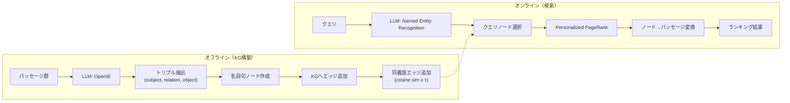

本記事は [HippoRAG: Neurobiologically Inspired Long-Term Memory for Large Language Models](https://arxiv.org/abs/2405.14831) の解説記事です。

## 論文概要（Abstract）

HippoRAGは、人間の海馬における記憶インデキシング理論（Hippocampal Memory Indexing Theory）をRAG（Retrieval-Augmented Generation）に応用したフレームワークである。著者らは、LLMをneocortex（大脳新皮質）、スキーマレスなナレッジグラフ（KG）をhippocampal index（海馬インデックス）、密検索エンコーダをparahippocampal regions（海馬傍回）に対応付けている。オフライン段階ではOpenIEにより名詞句ベースのトリプルを抽出してKGを構築し、オンライン段階ではクエリからエンティティを抽出した上でPersonalized PageRank（PPR）によりKG上を探索してパッセージランキングを行う。マルチホップQAベンチマーク（MuSiQue, 2WikiMultiHopQA, HotpotQA）において、著者らは単体の検索手法としてRecall@2で最大20%の改善を報告している（論文Table 2より）。

この記事は [Zenn記事: GraphRAG×Neo4jでマルチホップQAの検索精度を向上させる実装手法](https://zenn.dev/0h_n0/articles/6d0864d1a0f732) の深掘りです。

## 情報源

- **会議名**: NeurIPS 2024（Neural Information Processing Systems）
- **年**: 2024（arXivプレプリント: 2024年5月）
- **URL**: [https://arxiv.org/abs/2405.14831](https://arxiv.org/abs/2405.14831)
- **著者**: Bernal Jimenez Gutierrez, Yiheng Shu, Yu Gu, Michihiro Yasunaga, Yu Su
- **コード**: [https://github.com/OSU-NLP-Group/HippoRAG](https://github.com/OSU-NLP-Group/HippoRAG)

## カンファレンス情報

**NeurIPS（Conference on Neural Information Processing Systems）** は機械学習・人工知能分野の最高峰国際会議の1つであり、採択率は通常25-30%程度と競争が激しい。HippoRAGはNeurIPS 2024に採択されており、RAGの根本的な設計をneuro-inspired（神経科学に着想を得た）アプローチで再構成する点が評価されている。オハイオ州立大学のNLP研究グループ（OSU-NLP-Group）を中心とした研究チームによる成果である。

## 技術的詳細（Technical Details）

### 海馬記憶インデキシング理論との対応

HippoRAGの設計は、認知神経科学における海馬記憶インデキシング理論（Teyler & DiScenna, 1986）に基づく。人間の長期記憶では、知覚情報がneocortexで処理された後、海馬がインデックスとして機能し、関連する記憶の断片を統合する。著者らはこの仕組みを以下のようにRAGコンポーネントに対応付けている。

| 海馬記憶システム | HippoRAGコンポーネント | 機能 |
|---|---|---|
| Neocortex（大脳新皮質） | LLM（GPT-3.5-turbo-1106） | 知覚入力の処理、エンティティ・関係の抽出 |
| Hippocampal Index（海馬インデックス） | Open Knowledge Graph | 離散的な知識表現の格納・検索 |
| Parahippocampal Regions（海馬傍回） | Dense Retrieval Encoders | 連続的な類似度ベースの照合 |
| Pattern Separation（パターン分離） | OpenIEによる名詞句抽出 | 入力から離散的な名詞句を切り出す |
| Pattern Completion（パターン完成） | Personalized PageRank | クエリノードから関連ノードへ確率を伝播 |



### オフライン段階: KG構築

#### トリプル抽出（Pattern Separation）

各パッセージ $p_i$ に対し、LLM（GPT-3.5-turbo-1106）をOpenIE（Open Information Extraction）として使用し、$(s, r, o)$ 形式のトリプルを抽出する。ここで $s$ はsubject（主語名詞句）、$r$ はrelation（関係）、$o$ はobject（目的語名詞句）である。

抽出された名詞句はKGのノード $e_i \in N$ として登録され、トリプルはエッジとして追加される。著者らの報告によれば、MuSiQueデータセット（11,656パッセージ）から91,729個のユニークノードと21,714本のエッジが生成された（論文Section 4.1より）。

#### 同義語エッジ（Synonymy Edges）

異なるパッセージで同一概念が異なる表現で記述されることに対処するため、ノード間のコサイン類似度が閾値 $\tau$ 以上のペアに同義語エッジを追加する。

$$
\text{synonymy}(e_i, e_j) = \begin{cases} 1 & \text{if } \cos(M(e_i), M(e_j)) \geq \tau \\ 0 & \text{otherwise} \end{cases}
$$

ここで、
- $M(e_i)$: ノード $e_i$ の名詞句に対する密検索エンコーダの埋め込みベクトル
- $\tau$: 同義語判定の閾値（論文ではデフォルト $\tau = 0.8$）

この同義語エッジにより、「Stanford University」と「Stanford」のような表記揺れが接続され、マルチホップ推論時にパッセージ間の橋渡しが可能になる。

### オンライン段階: 検索

#### クエリノード選択

クエリ $q$ に対してLLMで固有表現（Named Entities）を抽出し、各抽出エンティティ $c_i$ に対応するKGノード $r_i$ を密検索エンコーダのコサイン類似度で選択する。

$$
r_i = e_k \quad \text{where} \quad k = \arg\max_j \cos(M(c_i), M(e_j))
$$

ここで、
- $c_i$: クエリから抽出された $i$ 番目のエンティティ
- $e_j$: KG上の $j$ 番目のノード
- $M(\cdot)$: 密検索エンコーダによる埋め込み関数

#### ノード特異度（Node Specificity）

全ノードを等しく扱うのではなく、IDF（逆文書頻度）に類似したノード特異度スコアを導入している。

$$
s_i = |P_i|^{-1}
$$

ここで、
- $s_i$: ノード $e_i$ の特異度スコア
- $|P_i|$: ノード $e_i$ が出現するパッセージ数

頻出ノード（例: 「the United States」）は低い特異度を持ち、特定の文脈にのみ出現するノード（例: 「HippoRAG」）は高い特異度を持つ。これにより、PPRの初期確率分布において情報量の高いノードが優遇される。

#### Personalized PageRank（PPR）

選択されたクエリノード群を起点として、PPRアルゴリズムによりKG全体に確率を伝播させる。

PPRの更新式は以下の通り：

$$
\mathbf{n}^{(t+1)} = \alpha \cdot \mathbf{n}^{(0)} + (1 - \alpha) \cdot A \cdot \mathbf{n}^{(t)}
$$

ここで、
- $\mathbf{n}^{(t)}$: 反復 $t$ におけるノードの確率分布ベクトル（$|N|$ 次元）
- $\mathbf{n}^{(0)}$: 初期確率分布（クエリノードに特異度スコアで重み付け）
- $\alpha$: ダンピングファクター（論文では $\alpha = 0.5$）
- $A$: KGの正規化隣接行列

収束後のノード確率分布 $\mathbf{n}'$ を用いて、パッセージランキングスコアを計算する。

$$
\mathbf{p} = P \cdot \mathbf{n}'
$$

ここで、
- $P$: $|N| \times |P|$ のノード-パッセージ対応行列（ノード $e_i$ がパッセージ $p_j$ に出現する場合 $P_{ij} = 1$）
- $\mathbf{p}$: 各パッセージのランキングスコアベクトル

### アルゴリズム

以下にHippoRAGの検索パイプライン全体を擬似コードで示す。

```python
from dataclasses import dataclass
import numpy as np


@dataclass
class KnowledgeGraph:
    """スキーマレスナレッジグラフ

    Attributes:
        nodes: 名詞句ノードのリスト
        adjacency: 正規化隣接行列 (|N| x |N|)
        node_passage_map: ノード→パッセージ対応行列 (|N| x |P|)
        embeddings: 各ノードの埋め込みベクトル (|N| x d)
    """
    nodes: list[str]
    adjacency: np.ndarray
    node_passage_map: np.ndarray
    embeddings: np.ndarray


def hipporag_retrieve(
    query: str,
    kg: KnowledgeGraph,
    llm,
    encoder,
    alpha: float = 0.5,
    tau: float = 0.8,
    top_k: int = 5,
    max_iter: int = 50,
    tol: float = 1e-6,
) -> list[int]:
    """HippoRAG検索パイプライン

    Args:
        query: 検索クエリ
        kg: 構築済みナレッジグラフ
        llm: Named Entity Recognition用LLM
        encoder: 密検索エンコーダ
        alpha: PPRダンピングファクター
        tau: 同義語判定閾値（KG構築時に使用済み）
        top_k: 返却パッセージ数
        max_iter: PPR最大反復回数
        tol: PPR収束閾値

    Returns:
        上位top_kパッセージのインデックスリスト
    """
    # Step 1: クエリからNamed Entity抽出
    query_entities: list[str] = llm.extract_named_entities(query)

    # Step 2: クエリノード選択（コサイン類似度）
    query_node_indices: list[int] = []
    for entity in query_entities:
        entity_emb = encoder.encode(entity)
        similarities = kg.embeddings @ entity_emb
        best_node = int(np.argmax(similarities))
        query_node_indices.append(best_node)

    # Step 3: 初期確率分布（ノード特異度で重み付け）
    n = np.zeros(len(kg.nodes))
    for idx in query_node_indices:
        passage_count = kg.node_passage_map[idx].sum()
        specificity = 1.0 / max(passage_count, 1)
        n[idx] = specificity
    n_initial = n / (n.sum() + 1e-10)  # 正規化

    # Step 4: Personalized PageRank
    n_current = n_initial.copy()
    for _ in range(max_iter):
        n_next = alpha * n_initial + (1 - alpha) * kg.adjacency @ n_current
        if np.linalg.norm(n_next - n_current) < tol:
            break
        n_current = n_next

    # Step 5: ノード確率 → パッセージランキング
    passage_scores = kg.node_passage_map.T @ n_current
    top_passages = np.argsort(passage_scores)[::-1][:top_k]

    return top_passages.tolist()
```

## 実装のポイント

### KG構築のスケーラビリティ

著者らはGPT-3.5-turbo-1106をOpenIEに使用しているが、11,656パッセージから91,729ノードが生成されるため、大規模コーパスではLLM呼び出し回数がボトルネックとなる。実装時の注意点は以下の通り。

- **バッチ処理**: OpenIEのLLM呼び出しはパッセージ単位で独立しているため、非同期バッチ処理で並列化可能
- **同義語エッジの計算量**: 全ノードペアのコサイン類似度計算は $O(|N|^2)$ であり、91,729ノードでは約42億ペアになる。FAISSやScaNNによる近似最近傍探索で閾値 $\tau$ 以上のペアのみを効率的に列挙する必要がある
- **PPRの実装**: NetworkXの`pagerank`や`pagerank_scipy`が使用可能だが、大規模KGではiGraphやgraph-toolの方がパフォーマンスが良い

### ハイパーパラメータの推奨値

論文の実験設定に基づく推奨値（論文Section 4.1より）：

| パラメータ | 値 | 説明 |
|---|---|---|
| LLM | GPT-3.5-turbo-1106 | OpenIE・NER用 |
| 密検索エンコーダ | ColBERTv2 / Contriever | ノード埋め込み |
| $\tau$（同義語閾値） | 0.8 | コサイン類似度ベース |
| $\alpha$（ダンピングファクター） | 0.5 | 標準PPRの0.85より低い値 |

ダンピングファクター $\alpha = 0.5$ は、通常のPageRank（$\alpha = 0.85$）より低く設定されている。これは、クエリノードからの局所的な探索を重視しつつも、KG全体へ十分に確率を伝播させるためのバランスである。

## Production Deployment Guide

HippoRAGは、KG構築（オフライン）と検索（オンライン）が分離されたアーキテクチャであるため、プロダクション環境への展開が比較的容易である。

### AWS実装パターン（コスト最適化重視）

**コスト試算の前提**: 以下は2026年7月時点のAWS ap-northeast-1（東京）リージョン料金に基づく概算値である。実際のコストはトラフィックパターン、リージョン、バースト使用量により変動する。最新料金は[AWS料金計算ツール](https://calculator.aws/)で確認を推奨する。

| 構成 | トラフィック | 主要サービス | 月額概算 |
|---|---|---|---|
| Small | ~100 req/日 | Lambda + Neptune Serverless + Bedrock | $80-200 |
| Medium | ~1,000 req/日 | ECS Fargate + Neptune + OpenSearch | $400-900 |
| Large | 10,000+ req/日 | EKS + Neptune + ElastiCache + Spot | $2,500-6,000 |

**Small構成（~100 req/日）**:
- **Lambda** (512MB, 30秒タイムアウト): クエリ処理・PPR計算。月100リクエストで約$0.05
- **Neptune Serverless**: KG格納。最小2 NCU、月額約$45
- **Bedrock (Claude 3.5 Haiku)**: NER抽出。1リクエストあたり約500トークン、月額約$5
- **S3**: ノード埋め込みベクトル格納。月額約$1

**Medium構成（~1,000 req/日）**:
- **ECS Fargate** (1vCPU, 2GB): PPR計算用常駐コンテナ。月額約$50
- **Neptune** (db.r6g.large): KG格納。月額約$260
- **OpenSearch Serverless**: ベクトル検索。月額約$100
- **Bedrock**: NER抽出。月額約$50

**Large構成（10,000+ req/日）**:
- **EKS + Spot Instances** (r6g.xlarge): PPR計算ワーカー。Spot活用で月額約$400
- **Neptune** (db.r6g.2xlarge, Multi-AZ): KG格納。月額約$800
- **ElastiCache (Redis)**: PPR結果キャッシュ。月額約$100
- **Bedrock Batch API**: NER抽出バッチ処理で50%削減。月額約$150

**コスト削減テクニック**:
- **Spot Instances**: EKSワーカーノードでSpot活用により最大90%削減
- **Reserved Instances**: Neptune/ElastiCacheで1年コミットにより最大40%削減
- **Bedrock Batch API**: 非リアルタイムのKG構築フェーズで50%削減
- **PPR結果キャッシュ**: 同一クエリエンティティのPPR結果をRedisにキャッシュし、Neptune/計算コストを削減

### Terraformインフラコード

**Small構成（Serverless）**:

```hcl
# HippoRAG Small構成: Lambda + Neptune Serverless + Bedrock
# コスト最適化: NAT Gateway不使用、Neptune Serverless最小構成

terraform {
  required_version = ">= 1.9"
  required_providers {
    aws = {
      source  = "hashicorp/aws"
      version = "~> 5.60"
    }
  }
}

provider "aws" {
  region = "ap-northeast-1"
}

# VPC（NAT Gateway不使用でコスト削減）
resource "aws_vpc" "hipporag" {
  cidr_block           = "10.0.0.0/16"
  enable_dns_support   = true
  enable_dns_hostnames = true
  tags = { Name = "hipporag-vpc", Project = "hipporag" }
}

resource "aws_subnet" "private" {
  count             = 2
  vpc_id            = aws_vpc.hipporag.id
  cidr_block        = "10.0.${count.index + 1}.0/24"
  availability_zone = data.aws_availability_zones.available.names[count.index]
  tags = { Name = "hipporag-private-${count.index}" }
}

data "aws_availability_zones" "available" {
  state = "available"
}

# Neptune Serverless（KG格納）
resource "aws_neptune_cluster" "kg" {
  cluster_identifier                  = "hipporag-kg"
  engine                              = "neptune"
  serverless_v2_scaling_configuration {
    min_capacity = 2.0   # 最小NCU（コスト削減）
    max_capacity = 8.0
  }
  vpc_security_group_ids = [aws_security_group.neptune.id]
  skip_final_snapshot    = true
  storage_encrypted      = true  # KMS暗号化
  tags = { Project = "hipporag" }
}

# IAMロール（最小権限）
resource "aws_iam_role" "lambda_hipporag" {
  name = "hipporag-lambda-role"
  assume_role_policy = jsonencode({
    Version = "2012-10-17"
    Statement = [{
      Action = "sts:AssumeRole"
      Effect = "Allow"
      Principal = { Service = "lambda.amazonaws.com" }
    }]
  })
}

resource "aws_iam_role_policy" "lambda_permissions" {
  name = "hipporag-lambda-permissions"
  role = aws_iam_role.lambda_hipporag.id
  policy = jsonencode({
    Version = "2012-10-17"
    Statement = [
      {
        Effect   = "Allow"
        Action   = ["neptune-db:ReadDataViaQuery", "neptune-db:WriteDataViaQuery"]
        Resource = aws_neptune_cluster.kg.arn
      },
      {
        Effect   = "Allow"
        Action   = ["bedrock:InvokeModel"]
        Resource = "arn:aws:bedrock:ap-northeast-1::foundation-model/anthropic.claude-3-5-haiku-*"
      },
      {
        Effect   = "Allow"
        Action   = ["logs:CreateLogGroup", "logs:CreateLogStream", "logs:PutLogEvents"]
        Resource = "arn:aws:logs:ap-northeast-1:*:*"
      }
    ]
  })
}

# Lambda関数（クエリ処理 + PPR計算）
resource "aws_lambda_function" "hipporag_query" {
  function_name = "hipporag-query"
  runtime       = "python3.12"
  handler       = "handler.lambda_handler"
  role          = aws_iam_role.lambda_hipporag.arn
  memory_size   = 512    # PPR計算に必要
  timeout       = 30
  filename      = "lambda_package.zip"

  environment {
    variables = {
      NEPTUNE_ENDPOINT = aws_neptune_cluster.kg.endpoint
      PPR_ALPHA        = "0.5"
      SYNONYMY_TAU     = "0.8"
    }
  }

  vpc_config {
    subnet_ids         = aws_subnet.private[*].id
    security_group_ids = [aws_security_group.lambda.id]
  }

  tags = { Project = "hipporag" }
}

# CloudWatchアラーム（コスト監視）
resource "aws_cloudwatch_metric_alarm" "lambda_duration" {
  alarm_name          = "hipporag-lambda-high-duration"
  comparison_operator = "GreaterThanThreshold"
  evaluation_periods  = 3
  metric_name         = "Duration"
  namespace           = "AWS/Lambda"
  period              = 300
  statistic           = "Average"
  threshold           = 15000  # 15秒超過でアラート
  dimensions = {
    FunctionName = aws_lambda_function.hipporag_query.function_name
  }
}

# セキュリティグループ
resource "aws_security_group" "neptune" {
  name_prefix = "hipporag-neptune-"
  vpc_id      = aws_vpc.hipporag.id
  ingress {
    from_port       = 8182
    to_port         = 8182
    protocol        = "tcp"
    security_groups = [aws_security_group.lambda.id]
  }
}

resource "aws_security_group" "lambda" {
  name_prefix = "hipporag-lambda-"
  vpc_id      = aws_vpc.hipporag.id
  egress {
    from_port   = 0
    to_port     = 0
    protocol    = "-1"
    cidr_blocks = ["0.0.0.0/0"]
  }
}
```

**Large構成（Container）**:

```hcl
# HippoRAG Large構成: EKS + Karpenter + Neptune + ElastiCache
# コスト最適化: Spot優先、ElastiCacheでPPR結果キャッシュ

module "eks" {
  source          = "terraform-aws-modules/eks/aws"
  version         = "~> 20.24"
  cluster_name    = "hipporag-cluster"
  cluster_version = "1.31"
  vpc_id          = aws_vpc.hipporag.id
  subnet_ids      = aws_subnet.private[*].id

  # パブリックアクセス最小化
  cluster_endpoint_public_access = false

  tags = { Project = "hipporag" }
}

# Karpenter Provisioner（Spot優先）
resource "kubectl_manifest" "karpenter_provisioner" {
  yaml_body = yamlencode({
    apiVersion = "karpenter.sh/v1"
    kind       = "NodePool"
    metadata   = { name = "hipporag-workers" }
    spec = {
      template = {
        spec = {
          requirements = [
            { key = "karpenter.sh/capacity-type", operator = "In", values = ["spot", "on-demand"] },
            { key = "node.kubernetes.io/instance-type", operator = "In",
              values = ["r6g.xlarge", "r6g.2xlarge", "r7g.xlarge"] },
          ]
          nodeClassRef = { name = "default" }
        }
      }
      limits   = { cpu = "64", memory = "256Gi" }
      disruption = {
        consolidationPolicy = "WhenEmptyOrUnderutilized"
        consolidateAfter    = "30s"
      }
    }
  })
}

# ElastiCache（PPR結果キャッシュ）
resource "aws_elasticache_replication_group" "ppr_cache" {
  replication_group_id = "hipporag-ppr-cache"
  description          = "PPR result cache for HippoRAG"
  engine               = "redis"
  engine_version       = "7.1"
  node_type            = "cache.r7g.large"
  num_cache_clusters   = 2
  at_rest_encryption_enabled = true  # KMS暗号化
  transit_encryption_enabled = true

  tags = { Project = "hipporag" }
}

# Secrets Manager（Bedrock設定）
resource "aws_secretsmanager_secret" "bedrock_config" {
  name = "hipporag/bedrock-config"
  tags = { Project = "hipporag" }
}

# AWS Budgets（予算アラート）
resource "aws_budgets_budget" "hipporag_monthly" {
  name         = "hipporag-monthly-budget"
  budget_type  = "COST"
  limit_amount = "5000"
  limit_unit   = "USD"
  time_unit    = "MONTHLY"

  notification {
    comparison_operator       = "GREATER_THAN"
    threshold                 = 80
    threshold_type            = "PERCENTAGE"
    notification_type         = "ACTUAL"
    subscriber_email_addresses = ["alert@example.com"]
  }
}
```

### 運用・監視設定

**CloudWatch Logs Insights クエリ**（コスト異常検知・レイテンシ分析）:

```
# PPR計算レイテンシのP95/P99分析
fields @timestamp, @duration, ppr_nodes_visited
| filter function_name = "hipporag-query"
| stats percentile(@duration, 95) as p95,
        percentile(@duration, 99) as p99,
        avg(ppr_nodes_visited) as avg_nodes
  by bin(1h)

# Bedrockトークン使用量の1時間あたり集計
fields @timestamp, bedrock_input_tokens, bedrock_output_tokens
| filter event_type = "ner_extraction"
| stats sum(bedrock_input_tokens) as total_input,
        sum(bedrock_output_tokens) as total_output
  by bin(1h)
| sort total_input desc
```

**CloudWatch アラーム設定（Python）**:

```python
import boto3


def setup_hipporag_alarms(sns_topic_arn: str) -> None:
    """HippoRAG用CloudWatchアラームを設定

    Args:
        sns_topic_arn: 通知先SNSトピックのARN
    """
    cw = boto3.client("cloudwatch", region_name="ap-northeast-1")

    # Bedrockトークン使用量スパイク検知
    cw.put_metric_alarm(
        AlarmName="hipporag-bedrock-token-spike",
        MetricName="InputTokenCount",
        Namespace="AWS/Bedrock",
        Statistic="Sum",
        Period=3600,
        EvaluationPeriods=1,
        Threshold=100000,  # 1時間10万トークン超過
        ComparisonOperator="GreaterThanThreshold",
        AlarmActions=[sns_topic_arn],
    )

    # PPR計算タイムアウト検知
    cw.put_metric_alarm(
        AlarmName="hipporag-ppr-timeout",
        MetricName="Duration",
        Namespace="AWS/Lambda",
        Statistic="p99",
        Period=300,
        EvaluationPeriods=2,
        Threshold=25000,  # 25秒超過（タイムアウト30秒の83%）
        ComparisonOperator="GreaterThanThreshold",
        AlarmActions=[sns_topic_arn],
        Dimensions=[{"Name": "FunctionName", "Value": "hipporag-query"}],
    )
```

**X-Ray トレーシング設定（Python）**:

```python
from aws_xray_sdk.core import xray_recorder, patch_all

# boto3自動計装
patch_all()


@xray_recorder.capture("hipporag_retrieve")
def traced_retrieve(query: str, kg, llm, encoder) -> list[int]:
    """X-Rayトレーシング付きHippoRAG検索

    Args:
        query: 検索クエリ
        kg: ナレッジグラフ
        llm: NER用LLM
        encoder: 密検索エンコーダ

    Returns:
        上位パッセージのインデックスリスト
    """
    subsegment = xray_recorder.current_subsegment()
    subsegment.put_annotation("query_length", len(query))

    # NER抽出
    with xray_recorder.in_subsegment("ner_extraction"):
        entities = llm.extract_named_entities(query)
        xray_recorder.current_subsegment().put_metadata(
            "entities", entities
        )

    # PPR計算
    with xray_recorder.in_subsegment("ppr_computation"):
        results = hipporag_retrieve(query, kg, llm, encoder)
        xray_recorder.current_subsegment().put_annotation(
            "result_count", len(results)
        )

    return results
```

**Cost Explorer自動レポート（Python）**:

```python
import boto3
from datetime import datetime, timedelta


def daily_cost_report(sns_topic_arn: str, threshold: float = 100.0) -> dict:
    """日次コストレポート取得、閾値超過でSNS通知

    Args:
        sns_topic_arn: 通知先SNSトピックのARN
        threshold: 日次コスト閾値（USD）

    Returns:
        サービス別コスト辞書
    """
    ce = boto3.client("ce", region_name="us-east-1")
    today = datetime.utcnow().strftime("%Y-%m-%d")
    yesterday = (datetime.utcnow() - timedelta(days=1)).strftime("%Y-%m-%d")

    response = ce.get_cost_and_usage(
        TimePeriod={"Start": yesterday, "End": today},
        Granularity="DAILY",
        Metrics=["UnblendedCost"],
        Filter={
            "Tags": {
                "Key": "Project",
                "Values": ["hipporag"],
            }
        },
        GroupBy=[{"Type": "DIMENSION", "Key": "SERVICE"}],
    )

    costs = {}
    total = 0.0
    for group in response["ResultsByTime"][0]["Groups"]:
        service = group["Keys"][0]
        amount = float(group["Metrics"]["UnblendedCost"]["Amount"])
        costs[service] = amount
        total += amount

    # 閾値超過でSNS通知
    if total > threshold:
        sns = boto3.client("sns", region_name="ap-northeast-1")
        sns.publish(
            TopicArn=sns_topic_arn,
            Subject=f"HippoRAG Daily Cost Alert: ${total:.2f}",
            Message=f"日次コストが${threshold}を超過: ${total:.2f}\n{costs}",
        )

    return costs
```

### コスト最適化チェックリスト

**アーキテクチャ選択**:
- [ ] トラフィック量に応じた構成選択（Small: Serverless / Medium: Hybrid / Large: Container）
- [ ] KG構築（オフライン）と検索（オンライン）のリソース分離

**リソース最適化**:
- [ ] EKSワーカー: Spot Instances優先（r6g/r7gファミリー、最大90%削減）
- [ ] Neptune: Reserved Instances 1年コミット（最大40%削減）
- [ ] ElastiCache: Reserved Nodes検討
- [ ] Lambda: メモリサイズ最適化（PPR計算に512MB推奨）
- [ ] Karpenter: アイドル時自動スケールダウン（consolidateAfter: 30s）

**LLMコスト削減**:
- [ ] Bedrock Batch API: KG構築フェーズのOpenIE処理で50%削減
- [ ] Prompt Caching: 同一フォーマットのNERプロンプトで30-90%削減
- [ ] モデル選択: NER用はClaude 3.5 Haiku、高精度OpenIE用のみClaude Sonnet
- [ ] トークン数制限: OpenIE出力の最大トリプル数を制限

**監視・アラート**:
- [ ] AWS Budgets: 月次予算アラート設定（80%/100%閾値）
- [ ] CloudWatch: Bedrockトークン使用量、Lambda実行時間のアラーム
- [ ] Cost Anomaly Detection: 自動異常検知有効化
- [ ] 日次コストレポート: Cost Explorer APIで自動取得、SNS通知

**リソース管理**:
- [ ] 未使用Neptune スナップショット削除
- [ ] タグ戦略: 全リソースに `Project=hipporag` タグ付与
- [ ] S3ライフサイクルポリシー: 古いKGバックアップの自動削除（90日）
- [ ] 開発環境: Neptune Serverless最小NCU設定、夜間Lambda無効化
- [ ] CloudTrail/Config有効化: セキュリティ監査対応

## 実験結果（Results）

### Single-Step Retrieval（単一ステップ検索）

著者らは、マルチホップQAの検索精度をRecall@2およびRecall@5で評価している。以下は論文Table 2からの引用である。

| 手法 | MuSiQue R@2 | MuSiQue R@5 | 2Wiki R@2 | 2Wiki R@5 | HotpotQA R@2 | HotpotQA R@5 |
|---|---|---|---|---|---|---|
| ColBERTv2 | 37.9 | 49.2 | 59.2 | 68.2 | 64.7 | 79.3 |
| Contriever | 36.4 | 47.8 | 57.6 | 66.7 | 62.4 | 76.1 |
| HippoRAG (ColBERTv2) | **40.9** | **51.9** | **70.7** | **89.1** | 60.5 | 77.7 |
| HippoRAG (Contriever) | 38.5 | 49.4 | 68.8 | 86.9 | 58.5 | 74.5 |

2WikiMultiHopQAにおいてHippoRAG (ColBERTv2) はRecall@2で+11.5ポイント、Recall@5で+20.9ポイントの改善を示している（論文Table 2より）。一方、HotpotQAではベースラインのColBERTv2に対して微減（Recall@2で-4.2ポイント）となっており、著者らはHotpotQAのクエリが比較的単純なため、KG経由の間接的な検索がオーバーヘッドとなる場合があると分析している。

### QA Performance（質問応答精度）

論文Table 4より、GPT-3.5-turboをリーダーモデルとした場合のExact Match (EM) / F1スコアを以下に示す。

| 手法 | MuSiQue EM/F1 | 2Wiki EM/F1 | HotpotQA EM/F1 |
|---|---|---|---|
| ColBERTv2 | 15.5 / 26.4 | 33.4 / 43.3 | 43.4 / 57.7 |
| HippoRAG (ColBERTv2) | 19.2 / 29.8 | 46.6 / 59.5 | 41.8 / 55.0 |
| IRCoT + HippoRAG | **21.9** / **33.3** | **47.7** / **62.7** | **45.7** / **59.2** |

IRCoT（Interleaving Retrieval with Chain-of-Thought）との組み合わせにより、全データセットで更なる改善が得られている。特にMuSiQueではEMが+6.4ポイント向上しており、マルチホップ推論が必要な困難なクエリにおけるHippoRAGの有効性が示されている。

### All-Recall（全関連パッセージ検索）

論文Table 6では、マルチホップQAに必要な全ての関連パッセージを同時に取得できるかを評価するAll-Recall（AR）メトリクスが報告されている。

| 手法 | 2Wiki AR@2 | 2Wiki AR@5 |
|---|---|---|
| ColBERTv2 | 18.8 | 37.1 |
| HippoRAG (ColBERTv2) | **55.0** | **75.7** |

2WikiにおけるAR@5でHippoRAGは75.7%を達成し、ColBERTv2の37.1%に対して2倍以上の改善を示している（論文Table 6より）。これはPPRによるKG上の探索が、単一の質問に対して複数の関連パッセージを同時に発見する能力に優れていることを示唆している。

### Ablation Study

論文Table 5では、PPRの代替手法との比較が報告されている。

| 手法 | MuSiQue R@2 | 2Wiki R@2 |
|---|---|---|
| Query Nodes Only（PPRなし） | 35.2 | 67.8 |
| 1-hop Neighbors | 37.1 | 69.5 |
| Full PPR | **40.9** | **70.7** |
| Full PPR（特異度なし） | 38.3 | 70.5 |

Full PPRがQuery Nodes OnlyやHop Neighborsを上回っており、グラフ全体への確率伝播が検索精度に寄与していることが確認できる。また、ノード特異度を除去するとMuSiQueで-2.6ポイント低下しており、IDF的な重み付けがノイズの多いクエリノードのフィルタリングに有効であることが示されている。

### 効率性

著者らは、HippoRAGがIRCoT（反復的なLLM呼び出しを伴う検索手法）と比較して大幅に効率的であると報告している（論文Section 4.3より）。

- **コスト**: IRCoTの10-30分の1（LLM呼び出し回数の削減による）
- **速度**: IRCoTの6-13倍高速（オンライン段階でのLLM呼び出しがNERの1回のみ）

この効率性は、知識の構造化をオフラインのKG構築段階で行い、オンライン段階ではPPRというグラフアルゴリズムに委ねる設計に起因する。

## 実運用への応用（Practical Applications）

### Zenn記事との関連

関連Zenn記事「[GraphRAG×Neo4jでマルチホップQAの検索精度を向上させる実装手法](https://zenn.dev/0h_n0/articles/6d0864d1a0f732)」で解説されているNeo4jベースのGraphRAGは、HippoRAGのKGコンポーネントと直接対応する。Zenn記事のNeo4j実装をHippoRAGフレームワーク内のhippocampal indexとして位置づけ、PPRを追加することで、検索精度の改善が期待できる。

### スケーリング戦略

- **KGサイズ**: 論文の実験は11,656パッセージ（91,729ノード）規模だが、実務では数十万〜数百万パッセージが対象となる。Neptune Serverlessのオートスケーリング、またはNeo4j Auraでの分散KGが選択肢となる
- **PPR計算**: ノード数の増加に伴いPPR収束時間が増加する。graph-toolやiGraphのC実装、またはApache SparkのGraphXによる分散PPRが必要となる場合がある
- **新規パッセージの追加**: HippoRAGのKG構築はインクリメンタルに実行可能であり、新規パッセージのトリプルを既存KGに追加し、同義語エッジを再計算するだけでよい

### レイテンシとコスト

HippoRAGの検索レイテンシは主に2つの要因に分解される。

1. **NER抽出（LLM呼び出し）**: GPT-3.5-turboで200-500ms程度
2. **PPR計算**: ノード数10万規模で50-200ms程度（NetworkX実装の場合）

IRCoTが複数回のLLM呼び出しを要するのに対し、HippoRAGのオンライン段階でのLLM呼び出しはNERの1回のみであるため、レイテンシ・コストの両面で優位性がある。

### 運用上の課題

- **KG品質**: OpenIEの抽出精度がKG品質に直結する。LLMの出力が不安定な場合、トリプルの品質が低下し、検索精度に影響する。定期的なKG品質監視（ノード次数分布の異常検知等）が必要
- **同義語閾値の調整**: $\tau = 0.8$ はデフォルト値だが、ドメインによっては調整が必要。医療・法律等の専門用語が多い分野では、より厳密な閾値が適切な場合がある
- **KGの鮮度**: 情報の更新に伴いKGの再構築が必要。差分更新の仕組みを設計しておくことが運用上重要

## 関連研究（Related Work）

- **IRCoT (Trivedi et al., 2023)**: Chain-of-Thoughtと検索を交互に実行するマルチホップRAG手法。高精度だがLLM呼び出し回数が多く、HippoRAGの10-30倍のコストがかかる
- **RAPTOR (Sarthi et al., 2024)**: 文書をクラスタリングして階層的に要約するRAG手法。トップダウンのアプローチであり、HippoRAGのボトムアップなKG構築とは対照的
- **GraphRAG (Microsoft, 2024)**: コミュニティ検出によるグラフベースRAG。HippoRAGとの違いは、GraphRAGがLLMによるコミュニティ要約を使用するのに対し、HippoRAGはPPRによるグラフ探索を使用する点。HippoRAGはLLM呼び出し回数が少なく効率的
- **KAPING (Baek et al., 2023)**: KGトリプルをプロンプトに直接注入する手法。HippoRAGはPPRによるグラフ全体の探索により、より広範な知識の統合が可能

## まとめと今後の展望

HippoRAGは、海馬の記憶インデキシング理論をRAGフレームワークに対応付けた点で独創的であり、LLM + KG + PPRの3コンポーネントによりマルチホップQAの検索精度を改善している。特に、2WikiMultiHopQAにおけるAll-Recall@5の75.7%（ColBERTv2の37.1%に対して2倍以上）は、KGを介したパッセージ間の橋渡しがマルチホップ推論に有効であることを示している。

一方で、HotpotQAのような比較的単純なクエリではベースラインに対して微減となるケースもあり、クエリの複雑度に応じたルーティング（単純クエリは密検索、複雑クエリはHippoRAG）が実運用では有効と考えられる。著者らは今後の方向性として、KGの継続的学習（新規情報の差分追加）と、より洗練されたパターン分離・完成メカニズムの開発を挙げている。

## 参考文献

- **arXiv**: [https://arxiv.org/abs/2405.14831](https://arxiv.org/abs/2405.14831)
- **Code**: [https://github.com/OSU-NLP-Group/HippoRAG](https://github.com/OSU-NLP-Group/HippoRAG)
- **NeurIPS 2024 Proceedings**: [https://proceedings.neurips.cc/](https://proceedings.neurips.cc/)
- **Related Zenn article**: [https://zenn.dev/0h_n0/articles/6d0864d1a0f732](https://zenn.dev/0h_n0/articles/6d0864d1a0f732)
