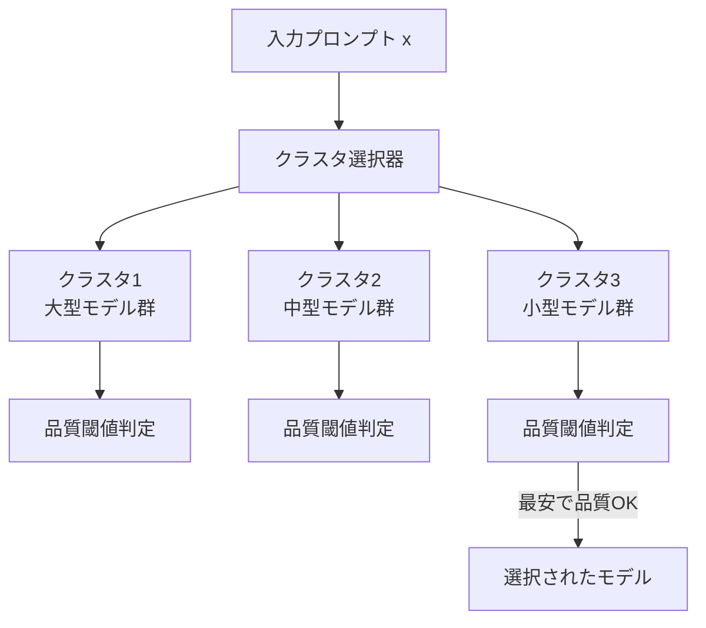

本記事は [Universal Model Routing for Efficient LLM Inference](https://arxiv.org/abs/2502.08773) の解説記事です。

## 論文概要（Abstract）

モデルルーティングは、LLMプールを維持し、各プロンプトを最小コストで処理可能なLLMにルーティングすることで推論コストを削減する手法である。著者らは、テスト時に未知のLLMが利用可能になる動的な環境に対応するため、各LLMを**代表的プロンプト集合に対する予測結果から導出される特徴ベクトル**で表現する**UniRoute**を提案している。クラスタベースルーティングと学習済みクラスタマップの2つの実装を提供し、理論的な超過リスク限界を証明するとともに、30以上の未知LLMを対象とした実験で有効性を実証している。

この記事は [Zenn記事: Azure OpenAI負荷分散2026年版](https://zenn.dev/0h_n0/articles/2fe007c8e2b1b0) の深掘りです。

## 情報源

- **arXiv ID**: 2502.08773
- **URL**: [https://arxiv.org/abs/2502.08773](https://arxiv.org/abs/2502.08773)
- **著者**: Wittawat Jitkrittum, Harikrishna Narasimhan, Ankit Singh Rawat, Jeevesh Juneja, Congchao Wang, Zifeng Wang, Alec Go, Chen-Yu Lee, Pradeep Shenoy, Rina Panigrahy, Aditya Krishna Menon, Sanjiv Kumar
- **発表年**: 2025年2月（v2: 2025年7月改訂）
- **分野**: cs.CL（計算言語学）, cs.LG（機械学習）

## 背景と動機（Background & Motivation）

LLMの推論コスト削減において、モデルルーティングは有力なアプローチである。簡単なプロンプトを小型モデルに、複雑なプロンプトを大型モデルにルーティングすることで、品質を維持しつつコストを削減できる。

しかし、既存のルーティング手法には重大な制約がある。著者らは以下の問題を指摘している。

1. **固定モデルプール前提**: 従来手法はルーティング対象のLLMが訓練時に固定されていることを前提としている。しかし実際には、新しいモデルが頻繁にリリースされ、モデルプールは動的に変化する
2. **再訓練の非効率性**: 新モデル追加のたびにルーターの再訓練が必要となり、コストと時間がかかる
3. **汎用性の欠如**: 特定のモデルペア（例: GPT-4 vs GPT-3.5）に特化した手法では、新モデルへの適応が困難

Azure OpenAIのModel Routerは2026年7月時点で28モデルをルーティング対象としているが、モデルカタログは継続的に拡大している。UniRouteの「未知モデルへの汎用ルーティング」は、こうした動的な環境に対する学術的基盤を提供する。

## 主要な貢献（Key Contributions）

- **貢献1**: LLMを代表的プロンプト集合に対する予測結果から導出される特徴ベクトルで表現する手法の提案
- **貢献2**: クラスタベースルーティングと学習済みクラスタマップの2つの実装の提供
- **貢献3**: 超過リスク限界（excess risk bound）による理論的保証の証明
- **貢献4**: 30以上の未知LLMを対象とした実験での有効性実証

## 技術的詳細（Technical Details）

### LLMの特徴ベクトル表現

UniRouteの核心は、各LLM $m$ を有限次元の特徴ベクトル $\mathbf{v}_m \in \mathbb{R}^d$ で表現する手法である。

代表的プロンプト集合 $\mathcal{P} = \{p_1, p_2, \ldots, p_d\}$ を用意し、各LLMにこれらのプロンプトを処理させ、その結果（正答率、品質スコアなど）を特徴ベクトルとして集約する。

$$
\mathbf{v}_m = \left[ q(m, p_1), q(m, p_2), \ldots, q(m, p_d) \right]
$$

ここで、
- $q(m, p_i)$: LLM $m$ がプロンプト $p_i$ を処理した際の品質スコア
- $d$: 代表的プロンプトの数（特徴次元数）

この表現により、訓練時に存在しなかった新しいLLMも、代表的プロンプト集合に対する評価結果さえあれば特徴ベクトルに変換でき、既存のルーティング機構にそのまま組み込める。

### クラスタベースルーティング

著者らは特徴ベクトル空間上でLLMをクラスタリングし、各プロンプトに対して最適なクラスタ（モデル群）を選択するアプローチを提案している。

$$
m^*(x) = \arg\min_{m \in \mathcal{C}_{k^*(x)}} \text{cost}(m)
$$

ここで、
- $x$: 入力プロンプト
- $k^*(x) = \arg\max_k P(\text{quality} \geq \tau \mid x, \mathcal{C}_k)$: プロンプト$x$に対して品質閾値$\tau$を満たす確率が最も高いクラスタ
- $\mathcal{C}_k$: クラスタ$k$に属するLLMの集合
- $\text{cost}(m)$: モデル$m$の推論コスト

この方式では、品質閾値を満たすクラスタ内で最もコストが低いモデルが選択される。



### 学習済みクラスタマップ

2つ目の実装として、プロンプトからクラスタへのマッピングを学習する関数$h: \mathcal{X} \rightarrow \{1, \ldots, K\}$を訓練するアプローチが提案されている。

$$
h^* = \arg\min_h \mathbb{E}_{x \sim \mathcal{D}} \left[ \text{cost}(m^*_{h(x)}) + \lambda \cdot \mathbb{1}[q(m^*_{h(x)}, x) < \tau] \right]
$$

ここで、
- $\lambda$: 品質違反に対するペナルティ係数
- $m^*_{h(x)}$: クラスタ$h(x)$内の最安モデル
- $\mathbb{1}[\cdot]$: 指示関数

### 理論的保証：超過リスク限界

著者らは、UniRouteの超過リスク（最適ルーティング規則との性能差）に対する理論的限界を証明している。代表的プロンプト集合のサイズ$d$とクラスタ数$K$に依存する形で、サンプル数$n$に対して超過リスクが減少することが保証されている。

$$
\text{ExcessRisk}(\hat{h}_n) \leq O\left(\sqrt{\frac{K \cdot d \cdot \log n}{n}}\right)
$$

この理論的保証により、十分な代表的プロンプトとサンプルがあれば、UniRouteは最適ルーティング規則に漸近的に収束することが保証される。

```python
class UniRoute:
    """未知LLMにも対応する汎用モデルルーター"""

    def __init__(
        self,
        representative_prompts: list[str],
        quality_threshold: float = 0.8,
    ):
        self.rep_prompts = representative_prompts
        self.quality_threshold = quality_threshold
        self.model_features: dict[str, list[float]] = {}
        self.cluster_map = None

    def register_model(self, model_name: str, model_fn: callable) -> None:
        """新規LLMを代表プロンプトで評価し、特徴ベクトルを構築"""
        features = []
        for prompt in self.rep_prompts:
            score = self._evaluate_quality(model_fn, prompt)
            features.append(score)
        self.model_features[model_name] = features

    def route(self, prompt: str) -> str:
        """プロンプトを最適なLLMにルーティング"""
        if self.cluster_map is None:
            self._build_clusters()

        cluster_id = self.cluster_map.predict(prompt)
        cluster_models = self._get_cluster_models(cluster_id)

        best_model = min(
            cluster_models,
            key=lambda m: self._get_cost(m),
        )
        return best_model

    def _build_clusters(self) -> None:
        """特徴ベクトル空間上でLLMをクラスタリング"""
        from sklearn.cluster import KMeans
        import numpy as np

        features = np.array(list(self.model_features.values()))
        n_clusters = min(len(self.model_features), 5)
        kmeans = KMeans(n_clusters=n_clusters, random_state=42)
        kmeans.fit(features)
        self.cluster_labels = kmeans.labels_
```

## 実装のポイント（Implementation）

**代表的プロンプト集合の選定**: 特徴ベクトルの品質は代表的プロンプト集合に依存する。著者らは、対象ドメインの多様性を反映するプロンプト集合の選定が重要であると指摘している。Azure OpenAIのModel Routerでは、28モデルの能力差が顕在化するプロンプトが内部的に使用されていると推察される。

**新モデル追加時のコスト**: 新モデル登録時に代表的プロンプト集合での評価が必要であり、このコストは$d$（プロンプト数）に比例する。$d$が大きいほど特徴ベクトルの表現力は高まるが、登録コストも増大する。

**クラスタ数の選定**: クラスタ数$K$は品質-コストトレードオフに影響する。$K$が小さいとコスト削減効果が限定的になり、大きすぎるとクラスタ内のモデル多様性が低下する。

**品質閾値の設定**: 品質閾値$\tau$はModel RouterのBalanced/Cost/Qualityモードに対応する。Balancedモードは高い$\tau$（品質差1-2%）、Costモードは低い$\tau$（品質差5-6%）に相当する。

## 実験結果（Results）

著者らは30以上の未知（訓練時に使用していない）LLMを対象とした実験を実施している。

**主要な知見**:
- UniRouteは未知LLMに対しても有効なルーティングを実現し、訓練時のLLMに限定された従来手法を上回る汎用性を示している
- クラスタベースルーティングと学習済みクラスタマップの両実装が有効であり、後者は推論時のオーバーヘッドが小さい
- 理論的限界と一致する形で、代表的プロンプト数$d$の増加に伴いルーティング精度が向上している

著者らはGoogle Researchの研究者であり、大規模なモデル評価基盤を活用した実験が行われている。

## 実運用への応用（Practical Applications）

**Azure OpenAI Model Routerとの対応**: Model Routerは内部的にプロンプト特性を分析してモデルを選択するが、UniRouteのアプローチは「モデル側の能力プロファイル」に基づくルーティングを行う点で相補的である。Model Routerのモデルサブセット機能は、UniRouteのクラスタリングと類似した「使用可能モデルの制限」を実現している。

**マルチプロバイダー環境での応用**: Unified Model API経由でOpenAI、Anthropic、Google等のモデルを利用する場合、UniRouteの特徴ベクトル表現により、異なるプロバイダーのモデルを統一的に評価・比較できる。新規プロバイダーのモデル追加時にルーターの再訓練が不要な点は、実運用における大きなメリットである。

**コスト最適化**: クラスタ内の最安モデルを自動選択する機構は、Costモードの実装に直接応用可能であり、品質閾値の調整によりBalanced/Qualityモードも実現できる。

## 関連研究（Related Work）

- **RouteLLM** (Ong et al., ICLR 2025): preference dataを使用したルーティング学習。固定モデルペアに特化しており、UniRouteの「未知モデル対応」が差別化要因
- **LLMRouterBench** (2026): LLMルーティングの統合ベンチマーク。UniRouteの評価にも活用可能なフレームワーク
- **FrugalGPT** (Chen et al., 2023): LLMカスケードによるコスト削減。UniRouteがプロンプト単位でモデルを選択するのに対し、カスケード方式は順次試行する

## まとめと今後の展望

UniRouteは、LLMの特徴ベクトル表現という新たなアプローチにより、未知のLLMにも対応可能な汎用ルーティング手法を実現している。理論的保証（超過リスク限界）と30以上のLLMでの実証により、その有効性が示されている。

Azure OpenAIのModel Routerのようなプロダクションルーティングシステムにおいて、モデルプールの拡大に対するスケーラビリティを確保するための設計原則として、本論文の知見は重要な参考となる。

## 参考文献

- **arXiv**: [https://arxiv.org/abs/2502.08773](https://arxiv.org/abs/2502.08773)
- **Related Zenn article**: [https://zenn.dev/0h_n0/articles/2fe007c8e2b1b0](https://zenn.dev/0h_n0/articles/2fe007c8e2b1b0)
