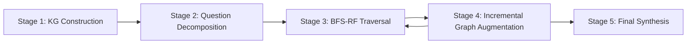

## 論文概要（Abstract）

本記事は [arXiv:2510.02827](https://arxiv.org/abs/2510.02827) の解説記事です。

StepChain GraphRAGは、マルチホップ質問応答（Multi-hop QA）において、質問分解（Question Decomposition）とナレッジグラフ上のBFS Reasoning Flow（BFS-RF）を組み合わせた検索拡張生成フレームワークである。著者らは、従来のRAG手法が複数の推論ステップを必要とする質問に対して十分な性能を発揮できない問題に対し、5段階のパイプライン（KG構築、質問分解、BFS-RF走査、漸進的グラフ拡張、最終合成）を提案している。MuSiQue・2WikiMultihopQA・HotpotQAの3つのベンチマークにおいて、GPT-4o使用時に平均Exact Match 57.67%、F1 68.53%を達成し、既存手法であるHopRAGを平均EM +2.57%、F1 +2.13%上回ったと報告している。

この記事は [Zenn記事: GraphRAG×Neo4jでマルチホップQAの検索精度を向上させる実装手法](https://zenn.dev/0h_n0/articles/6d0864d1a0f732) の深掘りです。

## 情報源

- **arXiv ID**: 2510.02827
- **URL**: [https://arxiv.org/abs/2510.02827](https://arxiv.org/abs/2510.02827)
- **著者**: Tengjun Ni, Xin Yuan, Shenghong Li et al.
- **発表年**: 2025年10月
- **分野**: cs.CL（計算言語学）, cs.IR（情報検索）

## 背景と動機（Background & Motivation）

マルチホップ質問応答とは、「AlbertがノーベルX賞を受賞した年に、Yで何が起きたか」のように、回答に到達するまでに複数の推論ステップ（ホップ）を必要とする課題である。従来のRAG手法は、単一のクエリでドキュメントを検索し回答を生成するため、複数のエンティティ間の関係を辿る推論には構造的に不向きである。

著者らは従来手法の限界として以下の3点を指摘している。第一に、BM25やBGEなどの密/疎ベクトル検索は質問全体を単一のクエリとして扱うため、中間推論に必要な文脈を見落とす。第二に、Microsoft GraphRAGのようなグラフベース手法はコミュニティ要約に依存するため、エンティティ間の細粒度な関係を捉えきれない。第三に、質問分解のみのアプローチは各サブ質問を独立に処理するため、先行するサブ質問の回答を後続の検索に活用できない。

StepChain GraphRAGは、質問分解によるサブ質問生成とKG上のBFS走査を統合し、各推論ステップの回答を次のステップの検索に反映させる「チェーン型推論」を実現することで、上記の課題に対処している。

## 主要な貢献（Key Contributions）

- **BFS Reasoning Flow（BFS-RF）の提案**: ナレッジグラフ上で幅優先探索を行い、開始エンティティから深さ$h$以内のサブグラフを取得した後、LLMが各パスの関連性を評価してエビデンスチェーンを構築する手法を提案している
- **質問分解との統合パイプライン**: 複合質問をサブ質問に分解し、各サブ質問の回答を次のサブ質問のコンテキストとして漸進的に伝播させるStepChainアーキテクチャを構築している
- **漸進的グラフ拡張（Incremental Graph Augmentation）**: 各推論ステップで得られた新規エンティティや関係をKGに動的に追加し、後続の検索精度を向上させる仕組みを導入している

## 技術的詳細（Technical Details）

### アーキテクチャ/手法

StepChain GraphRAGは5つのステージで構成される。



#### Stage 1: ナレッジグラフ構築

ドキュメントコーパスからナレッジグラフを構築する。まず、各ドキュメント$\tau_i$をチャンクに分割する。

$$
D_i = \text{Chunk}(\tau_i) = \{c_{i,1}, c_{i,2}, \ldots\}
$$

ここで、
- $\tau_i$: $i$番目のドキュメント
- $c_{i,j}$: $i$番目のドキュメントの$j$番目のチャンク
- チャンクサイズ: 1200トークン、オーバーラップ: 100トークン

次に、各チャンクからエンティティと関係を抽出する。

$$
\text{Extract}(c_{i,j}) = \{(e, \alpha_e) \mid e \text{ appears in } c_{i,j}\}
$$

ここで、
- $e$: 抽出されたエンティティ
- $\alpha_e$: エンティティの属性情報（型、説明等）

抽出されたエンティティと関係をノードとエッジとしてグラフ$G = (V, E)$を構築する。各エッジには元のチャンクへの参照が保持される。

#### Stage 2: 質問分解

複合質問$q$をLLMにより$n$個のサブ質問に分解する。

$$
\{q_1, q_2, \ldots, q_n\} = \text{Decompose}(q)
$$

各サブ質問$q_j$は、先行するサブ質問の回答$A_{j-1}$をコンテキストとして受け取る。これにより、「Aの出身国の首都は？」という質問は「Aの出身国は？」と「[出身国]の首都は？」に分解され、最初の回答が2番目に伝播する。

#### Stage 3: BFS Reasoning Flow走査

各サブ質問$q_j$に対し、KGからシードエンティティ$s_u$を特定し、BFS走査を行う。

$$
\text{BFS}(s_u, h) = \{v \in V \mid \text{dist}(s_u, v) \leq h\}
$$

ここで、
- $s_u$: サブ質問から特定されたシードエンティティ
- $h$: BFS探索の最大深度（論文では$h = 2$を使用）
- $\text{dist}(s_u, v)$: $s_u$から$v$までのグラフ距離

BFSで到達した各パス$\pi$に対し、LLMがそのパスのテキスト記述$\text{Desc}(\pi)$を生成し、関連性を評価する。関連パスの記述を結合してエビデンスチェーンを構築する。

$$
C_{q_j} = \| \text{Desc}(\pi) \|_{\pi \in \bigcup \Pi_{s_u}}
$$

ここで、
- $C_{q_j}$: サブ質問$q_j$に対するエビデンスチェーン
- $\Pi_{s_u}$: シードエンティティ$s_u$からの関連パス集合
- $\|$: テキスト結合演算子

#### Stage 4: 漸進的グラフ拡張

各サブ質問の回答から新たに発見されたエンティティや関係をKGに追加する。これにより、後続のサブ質問の検索範囲が動的に拡張される。

#### Stage 5: 最終合成

全サブ質問の回答を統合し、最終回答を生成する。

$$
A_{\text{final}} = \mathcal{M}(q \| A_{\text{merge}})
$$

ここで、
- $q$: 元の複合質問
- $A_{\text{merge}}$: 全サブ質問の回答を統合したテキスト
- $\mathcal{M}$: LLMによる最終合成関数
- $\|$: テキスト結合演算子

### アルゴリズム

StepChain GraphRAGの全体処理フローを以下の擬似コードで示す。

```python
from typing import Any
from dataclasses import dataclass


@dataclass
class KnowledgeGraph:
    """ナレッジグラフの表現"""
    nodes: dict[str, dict[str, Any]]  # entity_id -> attributes
    edges: list[tuple[str, str, dict[str, Any]]]  # (src, dst, attrs)


def stepchain_graphrag(
    query: str,
    corpus: list[str],
    llm: Any,
    bfs_depth: int = 2,
    chunk_size: int = 1200,
    chunk_overlap: int = 100,
) -> str:
    """StepChain GraphRAGによるマルチホップQA

    Args:
        query: 複合質問文
        corpus: ドキュメントコーパス
        llm: LLMインスタンス
        bfs_depth: BFS探索の最大深度
        chunk_size: チャンクサイズ（トークン数）
        chunk_overlap: チャンク間のオーバーラップ（トークン数）

    Returns:
        最終回答テキスト
    """
    # Stage 1: KG構築
    chunks = chunk_documents(corpus, chunk_size, chunk_overlap)
    kg = build_knowledge_graph(chunks, llm)

    # Stage 2: 質問分解
    sub_questions = llm.decompose(query)  # [q1, q2, ..., qn]

    # Stage 3-4: BFS-RF + 漸進的グラフ拡張
    context = ""
    all_answers: list[str] = []

    for sub_q in sub_questions:
        # コンテキスト付きサブ質問の構築
        augmented_q = f"{context}\n{sub_q}" if context else sub_q

        # シードエンティティの特定
        seed_entities = identify_seeds(augmented_q, kg)

        # BFS走査でサブグラフ取得
        evidence_chains: list[str] = []
        for seed in seed_entities:
            subgraph = bfs_traverse(kg, seed, depth=bfs_depth)
            paths = extract_paths(subgraph, seed)
            for path in paths:
                desc = llm.describe_path(path)
                relevance = llm.score_relevance(desc, augmented_q)
                if relevance > 0.5:
                    evidence_chains.append(desc)

        # サブ質問への回答
        sub_answer = llm.answer(augmented_q, evidence_chains)
        all_answers.append(sub_answer)

        # コンテキスト更新
        context += f"\n{sub_q}: {sub_answer}"

        # 漸進的グラフ拡張
        new_entities = llm.extract_entities(sub_answer)
        kg = augment_graph(kg, new_entities)

    # Stage 5: 最終合成
    merged = "\n".join(all_answers)
    final_answer = llm.synthesize(query, merged)
    return final_answer
```

## 実装のポイント（Implementation）

著者らが論文中で報告している実装上の主要なパラメータと設計判断を以下にまとめる。

**チャンク分割の設計**: チャンクサイズ1200トークン、オーバーラップ100トークンが採用されている。著者らによれば、チャンクが小さすぎるとエンティティ間の関係が分断され、大きすぎると無関係な情報が混入する。1200トークンはこのバランスを取った値である。

**BFS深度の選択**: $h = 2$が採用されている。深度1では直接接続のエンティティしか取得できず2ホップ以上の推論に不十分であり、深度3以上では計算コストが指数的に増大する。著者らの報告では、グラフ操作のオーバーヘッドは3秒未満に抑えられている。

**LLM呼び出しの最適化**: 各サブ質問に対しBFS走査で得られた全パスの関連性をLLMで評価するため、LLM呼び出し回数が多くなる。著者らの報告によれば、GPT-4o API使用時のクエリあたりの推論時間は約80秒である。バッチ処理やキャッシュの導入が実用化の際の検討事項となる。

**ハードウェア構成**: 著者らはRTX 6000 Ada GPU 2基を使用して実験を行っている。ローカルLLM（Llama 3.3 70B等）を使用する場合は同等以上のGPUメモリが必要となる。

## Production Deployment Guide

### AWS実装パターン（コスト最適化重視）

StepChain GraphRAGのプロダクション環境をAWS上に構築する場合の構成を、トラフィック量別に示す。以下のコスト試算は2026年7月時点のAWS ap-northeast-1（東京）リージョン料金に基づく概算値であり、実際のコストはトラフィックパターン、リージョン、バースト使用量により変動する。最新料金はAWS料金計算ツールで確認を推奨する。

| 構成 | トラフィック | 主要サービス | 月額概算 |
|------|------------|------------|---------|
| Small | ~100 req/日 | Lambda + Bedrock + Neptune Serverless | $150-300 |
| Medium | ~1,000 req/日 | ECS Fargate + Bedrock + Neptune | $800-1,500 |
| Large | 10,000+ req/日 | EKS + Spot + Neptune + Bedrock Batch | $3,000-6,000 |

**Small構成（~100 req/日）**: Lambda（1024MB、タイムアウト120s）でリクエストを受け、Amazon Bedrock（Claude 3.5 Sonnet）でLLM推論、Neptune ServerlessでKGを格納する。Lambda $5、Bedrock $80-150（トークン量依存）、Neptune Serverless $50-100、DynamoDB（キャッシュ用）$5。合計月額$150-300。

**Medium構成（~1,000 req/日）**: ECS Fargate（2 vCPU、8GB RAM）でアプリケーションをホスト。Neptune DB r6g.large インスタンスでKGを格納。Bedrock呼び出しは同期実行。Fargate $150、Neptune $300-400、Bedrock $300-600、ALB $30。合計月額$800-1,500。

**Large構成（10,000+ req/日）**: EKS上でKarpenterによるSpot Instance自動スケーリング。Neptune r6g.xlarge マルチAZクラスタ。Bedrock Batch APIで非同期処理を活用し50%コスト削減。EKS + Spot $800-1,500、Neptune $800-1,200、Bedrock Batch $1,000-2,500、ALB + CloudFront $200。合計月額$3,000-6,000。

**コスト削減テクニック**: Spot Instances活用で最大90%削減、Reserved Instances（1年）で最大72%削減、Bedrock Batch API使用で50%削減、Prompt Caching有効化で30-90%削減。

### Terraformインフラコード

**Small構成（Serverless）**:

```hcl
# StepChain GraphRAG - Small構成 (Lambda + Bedrock + Neptune Serverless)
terraform {
  required_version = ">= 1.9"
  required_providers {
    aws = { source = "hashicorp/aws", version = "~> 5.60" }
  }
}

provider "aws" { region = "ap-northeast-1" }

# --- VPC（NAT Gateway不使用でコスト削減）---
resource "aws_vpc" "main" {
  cidr_block           = "10.0.0.0/16"
  enable_dns_hostnames = true
  tags = { Name = "stepchain-graphrag-vpc", Project = "stepchain-graphrag" }
}

resource "aws_subnet" "private" {
  count             = 2
  vpc_id            = aws_vpc.main.id
  cidr_block        = cidrsubnet(aws_vpc.main.cidr_block, 8, count.index)
  availability_zone = data.aws_availability_zones.available.names[count.index]
  tags = { Name = "stepchain-private-${count.index}" }
}

data "aws_availability_zones" "available" { state = "available" }

# --- IAMロール（最小権限）---
resource "aws_iam_role" "lambda_role" {
  name = "stepchain-graphrag-lambda"
  assume_role_policy = jsonencode({
    Version = "2012-10-17"
    Statement = [{ Effect = "Allow", Principal = { Service = "lambda.amazonaws.com" }, Action = "sts:AssumeRole" }]
  })
}

resource "aws_iam_role_policy" "lambda_policy" {
  name = "stepchain-graphrag-lambda-policy"
  role = aws_iam_role.lambda_role.id
  policy = jsonencode({
    Version = "2012-10-17"
    Statement = [
      { Effect = "Allow", Action = ["bedrock:InvokeModel"], Resource = "arn:aws:bedrock:ap-northeast-1::foundation-model/anthropic.claude-3-5-sonnet-*" },
      { Effect = "Allow", Action = ["neptune-db:*"], Resource = aws_neptune_cluster.main.arn },
      { Effect = "Allow", Action = ["dynamodb:GetItem", "dynamodb:PutItem", "dynamodb:Query"], Resource = aws_dynamodb_table.cache.arn },
      { Effect = "Allow", Action = ["logs:CreateLogGroup", "logs:CreateLogStream", "logs:PutLogEvents"], Resource = "arn:aws:logs:*:*:*" },
    ]
  })
}

# --- Lambda関数 ---
resource "aws_lambda_function" "stepchain" {
  function_name = "stepchain-graphrag"
  runtime       = "python3.12"
  handler       = "handler.lambda_handler"
  role          = aws_iam_role.lambda_role.arn
  timeout       = 120  # BFS走査+LLM推論で最大80s
  memory_size   = 1024
  filename      = "lambda.zip"  # デプロイパッケージ

  environment {
    variables = {
      NEPTUNE_ENDPOINT = aws_neptune_cluster.main.endpoint
      CACHE_TABLE      = aws_dynamodb_table.cache.name
      BFS_DEPTH        = "2"
      CHUNK_SIZE       = "1200"
    }
  }
}

# --- Neptune Serverless ---
resource "aws_neptune_cluster" "main" {
  cluster_identifier  = "stepchain-kg"
  engine              = "neptune"
  serverless_v2_scaling_configuration {
    min_capacity = 1.0
    max_capacity = 4.0
  }
  storage_encrypted = true  # KMS暗号化
}

# --- DynamoDB（エビデンスチェーンキャッシュ）---
resource "aws_dynamodb_table" "cache" {
  name         = "stepchain-cache"
  billing_mode = "PAY_PER_REQUEST"
  hash_key     = "query_hash"

  attribute { name = "query_hash"; type = "S" }

  server_side_encryption { enabled = true }  # KMS暗号化
  ttl { attribute_name = "ttl"; enabled = true }
}

# --- CloudWatchアラーム ---
resource "aws_cloudwatch_metric_alarm" "lambda_errors" {
  alarm_name          = "stepchain-lambda-errors"
  comparison_operator = "GreaterThanThreshold"
  evaluation_periods  = 2
  metric_name         = "Errors"
  namespace           = "AWS/Lambda"
  period              = 300
  statistic           = "Sum"
  threshold           = 5
  dimensions          = { FunctionName = aws_lambda_function.stepchain.function_name }
}
```

**Large構成（Container）**:

```hcl
# StepChain GraphRAG - Large構成 (EKS + Karpenter + Spot)
module "eks" {
  source          = "terraform-aws-modules/eks/aws"
  version         = "~> 20.24"
  cluster_name    = "stepchain-graphrag"
  cluster_version = "1.31"
  vpc_id          = aws_vpc.main.id
  subnet_ids      = aws_subnet.private[*].id

  # コントロールプレーンのみ（ノードはKarpenterで管理）
  cluster_endpoint_public_access = false
}

# --- Karpenter Provisioner（Spot優先）---
resource "kubectl_manifest" "karpenter_nodepool" {
  yaml_body = yamlencode({
    apiVersion = "karpenter.sh/v1"
    kind       = "NodePool"
    metadata   = { name = "stepchain-spot" }
    spec = {
      template = {
        spec = {
          requirements = [
            { key = "karpenter.sh/capacity-type", operator = "In", values = ["spot", "on-demand"] },
            { key = "node.kubernetes.io/instance-type", operator = "In", values = ["m6i.xlarge", "m6a.xlarge", "m7i.xlarge"] },
          ]
          nodeClassRef = { name = "default" }
        }
      }
      limits   = { cpu = "64", memory = "256Gi" }
      disruption = { consolidationPolicy = "WhenEmptyOrUnderutilized" }
    }
  })
}

# --- Secrets Manager（Bedrock設定）---
resource "aws_secretsmanager_secret" "bedrock_config" {
  name       = "stepchain/bedrock-config"
  kms_key_id = aws_kms_key.main.arn
}

# --- AWS Budgets（予算アラート）---
resource "aws_budgets_budget" "monthly" {
  name         = "stepchain-monthly"
  budget_type  = "COST"
  limit_amount = "6000"
  limit_unit   = "USD"
  time_unit    = "MONTHLY"

  notification {
    comparison_operator       = "GREATER_THAN"
    threshold                 = 80
    threshold_type            = "PERCENTAGE"
    notification_type         = "ACTUAL"
    subscriber_email_addresses = ["alert@example.com"]
  }
}
```

### 運用・監視設定

**CloudWatch Logs Insights クエリ**（コスト異常検知）:

```
fields @timestamp, @message
| filter @message like /bedrock/
| stats sum(input_tokens) as total_input, sum(output_tokens) as total_output by bin(1h)
| sort @timestamp desc
```

**CloudWatch Logs Insights クエリ**（レイテンシ分析）:

```
fields @timestamp, duration_ms, stage
| filter event = "stepchain_query"
| stats avg(duration_ms) as avg_latency,
        percentile(duration_ms, 95) as p95,
        percentile(duration_ms, 99) as p99
  by stage
| sort avg_latency desc
```

**CloudWatch アラーム設定**（Python）:

```python
import boto3

cloudwatch = boto3.client("cloudwatch", region_name="ap-northeast-1")

def create_bedrock_token_alarm(function_name: str, sns_topic_arn: str) -> None:
    """Bedrockトークン使用量スパイク検知アラームを作成する"""
    cloudwatch.put_metric_alarm(
        AlarmName=f"stepchain-{function_name}-token-spike",
        MetricName="InputTokenCount",
        Namespace="AWS/Bedrock",
        Statistic="Sum",
        Period=3600,
        EvaluationPeriods=1,
        Threshold=500000,
        ComparisonOperator="GreaterThanThreshold",
        AlarmActions=[sns_topic_arn],
    )
```

**X-Ray トレーシング設定**（Python）:

```python
from aws_xray_sdk.core import xray_recorder, patch_all

patch_all()  # boto3自動計装

@xray_recorder.capture("stepchain_bfs_traversal")
def bfs_traverse_traced(kg: dict, seed: str, depth: int) -> dict:
    """BFS走査をX-Rayトレース付きで実行する"""
    subsegment = xray_recorder.current_subsegment()
    subsegment.put_annotation("seed_entity", seed)
    subsegment.put_annotation("bfs_depth", depth)

    result = bfs_traverse(kg, seed, depth)

    subsegment.put_metadata("paths_found", len(result.get("paths", [])))
    return result
```

**Cost Explorer自動レポート**（Python）:

```python
import boto3
from datetime import datetime, timedelta

ce = boto3.client("ce", region_name="us-east-1")
sns = boto3.client("sns", region_name="ap-northeast-1")

def daily_cost_report(sns_topic_arn: str) -> None:
    """日次コストレポートを取得しSNS通知する"""
    end = datetime.utcnow().strftime("%Y-%m-%d")
    start = (datetime.utcnow() - timedelta(days=1)).strftime("%Y-%m-%d")

    response = ce.get_cost_and_usage(
        TimePeriod={"Start": start, "End": end},
        Granularity="DAILY",
        Metrics=["UnblendedCost"],
        Filter={"Tags": {"Key": "Project", "Values": ["stepchain-graphrag"]}},
        GroupBy=[{"Type": "DIMENSION", "Key": "SERVICE"}],
    )

    total = sum(
        float(g["Metrics"]["UnblendedCost"]["Amount"])
        for r in response["ResultsByTime"]
        for g in r["Groups"]
    )

    if total > 100:
        sns.publish(
            TopicArn=sns_topic_arn,
            Subject="StepChain GraphRAG: Daily cost alert",
            Message=f"Daily cost: ${total:.2f} (threshold: $100)",
        )
```

### コスト最適化チェックリスト

**アーキテクチャ選択**:
- [ ] トラフィック量に応じた構成（~100 req/日: Serverless、~1,000 req/日: Hybrid、10,000+: Container）
- [ ] Neptune Serverlessの最小/最大キャパシティを適切に設定

**リソース最適化**:
- [ ] EC2/EKSノード: Spot Instances優先（m6i/m6a/m7iファミリー）
- [ ] Reserved Instances: 1年コミットで最大72%削減
- [ ] Savings Plans: Compute Savings Plansの検討
- [ ] Lambda: メモリサイズ最適化（1024MB推奨、Power Tuningで検証）
- [ ] ECS/EKS: Karpenterでアイドル時自動スケールダウン

**LLMコスト削減**:
- [ ] Bedrock Batch API: 非リアルタイム処理で50%削減
- [ ] Prompt Caching有効化: 同一KGへの繰り返しクエリで30-90%削減
- [ ] モデル選択ロジック: 単純なサブ質問にはHaikuクラス、複雑な合成にはSonnetクラス
- [ ] トークン数制限: エビデンスチェーンの最大長を設定

**監視・アラート**:
- [ ] AWS Budgets: 月額上限アラート（80%/100%閾値）
- [ ] CloudWatch アラーム: Bedrockトークンスパイク、Lambda/ECSエラー率
- [ ] Cost Anomaly Detection: 自動異常検知の有効化
- [ ] 日次コストレポート: Cost Explorer APIによるSNS通知

**リソース管理**:
- [ ] 未使用Neptuneスナップショットの定期削除
- [ ] タグ戦略: `Project=stepchain-graphrag` を全リソースに付与
- [ ] DynamoDBキャッシュ: TTL設定でライフサイクル管理
- [ ] 開発環境: Neptune Serverless最小キャパシティ設定、夜間はLambda同時実行数を制限
- [ ] CloudWatch Logs: 保持期間を30日に設定

## 実験結果（Results）

### 主要ベンチマーク結果

著者らは3つのマルチホップQAベンチマーク（MuSiQue、2WikiMultihopQA、HotpotQA）で評価を行っている。以下の結果は論文Table 1より、GPT-4o使用・上位20パッセージ取得時の値である。

| 手法 | MuSiQue EM/F1 | 2Wiki EM/F1 | HotpotQA EM/F1 | 平均 EM/F1 |
|------|-------------|-----------|--------------|---------|
| BM25 | 13.80/21.50 | 40.30/44.83 | 41.20/53.23 | 31.77/39.85 |
| BGE | 20.80/30.10 | 40.10/44.96 | 47.60/60.36 | 36.17/45.14 |
| GraphRAG | 12.10/20.22 | 22.50/27.49 | 31.70/42.74 | 22.10/30.15 |
| RAPTOR | 36.40/49.09 | 53.80/61.45 | 58.00/73.08 | 49.40/61.21 |
| SiReRAG | 40.50/53.08 | 59.60/67.94 | 61.70/76.48 | 53.93/65.83 |
| HopRAG | 42.20/54.90 | 61.10/68.26 | 62.00/76.06 | 55.10/66.40 |
| **StepChain GraphRAG** | **43.90/55.38** | **62.40/70.72** | **66.70/79.50** | **57.67/68.53** |

StepChain GraphRAGはHopRAGと比較して、平均EM +2.57%、F1 +2.13%の改善を達成している。特にHotpotQAでの改善が顕著であり、EM +4.70%、F1 +3.44%と報告されている。

注目すべき点として、Microsoft GraphRAG（コミュニティ要約ベース）はBM25やBGEよりも低い性能を示している。著者らはこれについて、コミュニティ要約がエンティティ間の細粒度な関係を捨象するためと分析している。

### アブレーション分析

論文Table 3より、各コンポーネントの寄与度を示す。

| 構成 | 平均 EM/F1 |
|------|---------|
| GPT-4oベースライン | 20.77/28.20 |
| + GraphRAG | 22.10/30.15 |
| + Question Decomposition | 36.33/45.80 |
| + GraphRAG + Decomposition | 48.03/60.21 |
| + GraphRAG + Reasoning | 50.13/62.24 |
| **Full System** | **57.67/68.53** |

このアブレーションから、質問分解の追加（+14.23% EM）がGraphRAGの追加（+1.33% EM）よりも大きな改善をもたらしていることが読み取れる。しかし、両者を組み合わせ、さらにBFS Reasoning Flowを追加することで相乗効果が生まれ、Full Systemでは各コンポーネント単体の合計を上回る性能が得られている。

### LLMロバストネス

論文Table 2より、HotpotQAにおける異なるLLMでの結果を示す。

| LLM | HotpotQA EM/F1 |
|-----|--------------|
| Llama 3.3 70B | 54.00/68.77 |
| Qwen 2.5 72B | 59.30/71.33 |
| GPT-4o | 66.70/79.50 |

GPT-4oが最も高い性能を示しているが、Llama 3.3 70BやQwen 2.5 72Bのようなオープンソースモデルでも一定の性能が確認されている。著者らはStepChain GraphRAGがLLMの選択に対してロバストであると主張している。

### 推論コスト

著者らの報告によれば、GPT-4o API使用時のクエリあたりの推論時間は約80秒であり、そのうちグラフ操作のオーバーヘッドは3秒未満である。推論時間の大部分はLLM呼び出し（質問分解、パス関連性評価、回答生成）に費やされている。

## 実運用への応用（Practical Applications）

StepChain GraphRAGのアーキテクチャは、以下のようなマルチホップ推論を必要とするプロダクション環境に適用可能である。

**企業ナレッジベース検索**: 社内ドキュメント、Slack履歴、Confluenceページなどから構築したKGに対し、「プロジェクトXの技術的意思決定の根拠と、それが後のプロジェクトYに与えた影響は？」のような複雑な質問に回答するシステムに応用できる。

**医療・法律ドメインのQA**: 複数の診療ガイドラインや判例を横断して回答を導く必要があるドメインでは、質問分解とBFS走査の組み合わせが有効と考えられる。

**スケーリングの課題**: クエリあたり約80秒の推論時間はリアルタイムアプリケーションには課題となる。Zenn記事で解説されているNeo4jベースの実装と組み合わせ、BFS走査結果のキャッシュやサブ質問の並列処理により、レイテンシの削減が期待できる。コストについては、Bedrock Batch APIやPrompt Cachingの活用で大幅な削減が可能である。

**制約事項**: KG構築フェーズでのエンティティ抽出精度がシステム全体の性能の上限を決定する。ドメイン固有のエンティティ（化学物質名、法律用語等）に対しては、事前定義されたオントロジーとの統合が必要になる可能性がある。

## 関連研究（Related Work）

- **Microsoft GraphRAG** (Edge et al., 2024): ドキュメントからコミュニティ構造を抽出し、階層的な要約を生成するグラフベースRAG手法。StepChain GraphRAGとの違いは、GraphRAGがコミュニティ単位の要約を使うのに対し、StepChainがエンティティ単位のBFS走査を行う点にある。論文Table 1では、GraphRAGの平均EM 22.10%に対しStepChainは57.67%と、マルチホップQAタスクにおいて大きな差が確認されている

- **HopRAG** (Li et al., 2025): グラフ探索を用いたマルチホップ検索手法。StepChain GraphRAGの直接の比較対象であり、著者らはBFS Reasoning Flowと質問分解の統合により、HopRAGを平均EM +2.57%上回ったと報告している

- **RAPTOR** (Sarthi et al., 2024): ドキュメントを再帰的にクラスタリングし、階層的な要約木を構築する手法。マルチホップ推論において従来のフラットな検索より優れた性能を示すが、StepChain GraphRAGはRAPTORの平均EM 49.40%に対し57.67%と、より高い性能を示している（論文Table 1より）

- **SiReRAG** (Zhang et al., 2025): 類似性と関連性を組み合わせたグラフベース検索手法。StepChain GraphRAGとの差は平均EM +3.74%である

## まとめと今後の展望

StepChain GraphRAGは、質問分解とBFS Reasoning Flowの統合により、マルチホップQAにおいて既存手法を上回る性能を達成したフレームワークである。特に、各サブ質問の回答を次のステップのコンテキストとして伝播させるチェーン型推論と、漸進的グラフ拡張の組み合わせが性能向上に寄与している。

今後の研究方向として、著者らの報告や論文の制約から以下が考えられる。第一に、クエリあたり約80秒の推論時間の削減（BFS走査の並列化、LLM呼び出しのバッチ処理）。第二に、KG構築フェーズでのエンティティ抽出精度の向上（ドメイン固有オントロジーとの統合）。第三に、動的に更新されるドキュメントコーパスへの対応（インクリメンタルなKG更新戦略）。実務への適用においては、Zenn記事で解説されているNeo4jベースの実装パターンとの組み合わせが有効であろう。

## 参考文献

- **arXiv**: [https://arxiv.org/abs/2510.02827](https://arxiv.org/abs/2510.02827)
- **Related Zenn article**: [https://zenn.dev/0h_n0/articles/6d0864d1a0f732](https://zenn.dev/0h_n0/articles/6d0864d1a0f732)
- Edge, D., Trinh, H., et al. (2024). "From Local to Global: A Graph RAG Approach to Query-Focused Summarization." arXiv:2404.16130
- Sarthi, P., et al. (2024). "RAPTOR: Recursive Abstractive Processing for Tree-Organized Retrieval." ICLR 2024
- Li, Y., et al. (2025). "HopRAG: Multi-Hop Reasoning over Knowledge Graphs for Retrieval-Augmented Generation."
