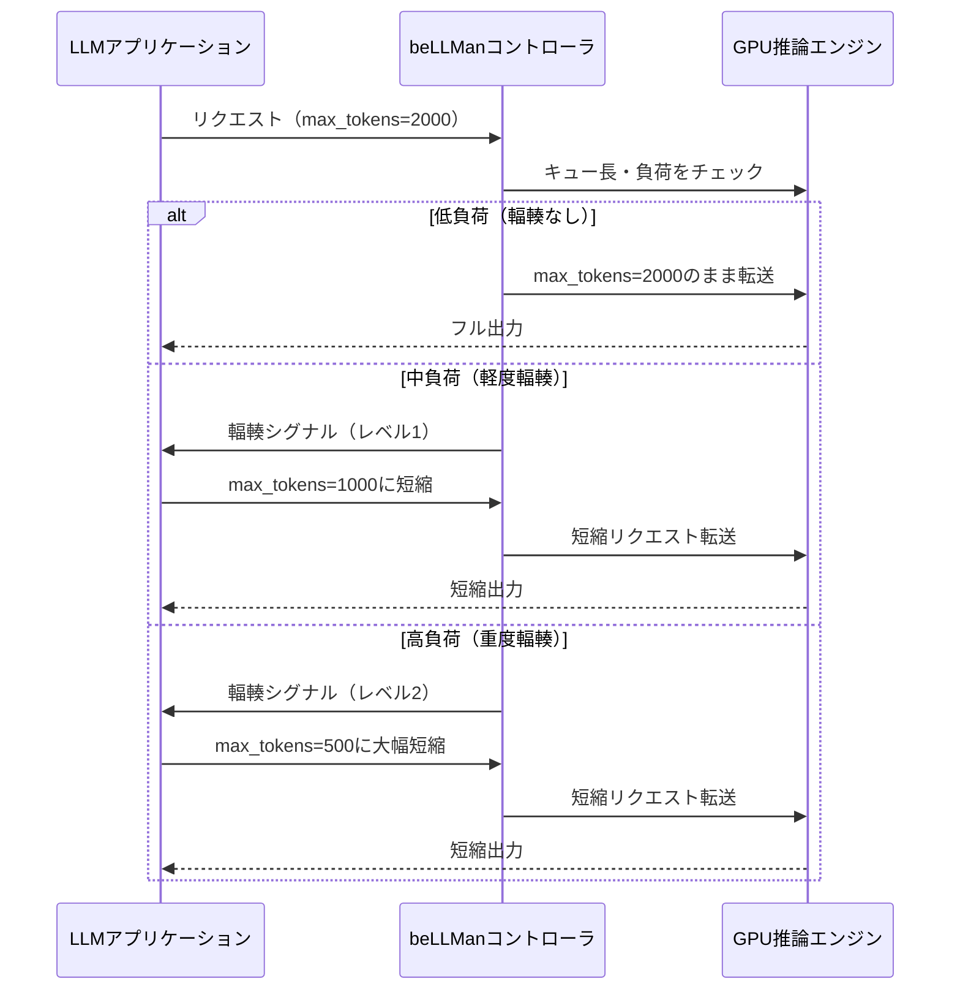

本記事は [BeLLMan: Controlling LLM Congestion](https://arxiv.org/abs/2510.15330) の解説記事です。

## 論文概要（Abstract）

LLMアプリケーションはインフラストラクチャの負荷状態に関知せず、自己回帰的にトークンを生成し続ける。これにより、高負荷時に推論レイテンシが増大し、ユーザー体験が悪化する。著者らは、LLMインフラからアプリケーションに対して負荷状況をシグナリングし、**出力長を動的に調整**させる制御システム**beLLMan**を提案している。H100 GPUを用いた実験環境において、要約ワークロードでの輻輳時に最大8倍のエンドツーエンドレイテンシ削減、25%のエネルギー消費削減（同時に19%多くのリクエストを処理）を達成したと報告されている。

この記事は [Zenn記事: Azure OpenAI負荷分散2026年版](https://zenn.dev/0h_n0/articles/2fe007c8e2b1b0) の深掘りです。

## 情報源

- **arXiv ID**: 2510.15330
- **URL**: [https://arxiv.org/abs/2510.15330](https://arxiv.org/abs/2510.15330)
- **著者**: Tella Rajashekhar Reddy, Atharva Deshmukh, Karan Tandon, Rohan Gandhi, Anjaly Parayil, Debopam Bhattacherjee
- **発表年**: 2025年10月
- **分野**: cs.DC, cs.AI, cs.CL, cs.NI
- **発表会議**: FAISYS 2025

## 背景と動機（Background & Motivation）

従来のネットワーク通信では、TCP/IPの輻輳制御（Congestion Control）がネットワーク帯域幅を効率的に共有するための基盤技術として確立されている。送信者はネットワークの輻輳状態に応じて送信レートを調整し、全体のスループットと公平性を最適化する。

著者らは、LLM推論環境に同様の輻輳制御メカニズムが欠如していることを指摘している。現在のLLMアプリケーションは以下の問題を抱えている。

1. **盲目的なトークン生成**: アプリケーションはインフラの負荷状態を認識せず、指定された`max_tokens`まで（または自然停止まで）トークンを生成し続ける
2. **レイテンシ膨張**: 高負荷時にGPUのバッチ処理キューが溜まり、全リクエストのレイテンシが悪化する
3. **不公平なリソース配分**: 長い出力を生成するリクエストがGPUリソースを長時間占有し、短いリクエストも巻き添えで遅延する

この問題はAzure OpenAIのTPM制限やAPIM AI Gatewayのトークンレート制限と密接に関連する。TPM制限はAPI利用者側のレート制限（需要側）であるのに対し、beLLManはインフラ側からの供給量調整（供給側）というアプローチを取っている。

## 主要な貢献（Key Contributions）

- **貢献1**: LLM推論におけるインフラ→アプリケーション間の輻輳シグナリングメカニズムの提案
- **貢献2**: 出力長の動的調整による輻輳緩和アルゴリズムの設計
- **貢献3**: H100 GPU実環境での実証（レイテンシ8倍削減、エネルギー25%削減、スループット19%向上）
- **貢献4**: ネットワーク輻輳制御の概念をLLM推論に適用する学術的フレームワークの確立

## 技術的詳細（Technical Details）

### 輻輳シグナリングの設計

beLLManの中核は、インフラからアプリケーションへの**輻輳シグナル**である。TCP/IPのECN（Explicit Congestion Notification）に着想を得て、LLMインフラがアプリケーションに「現在の負荷レベル」を伝達し、出力長の調整を促す。



### 輻輳制御の数理モデル

著者らは、LLM推論の輻輳制御を以下のフレームワークで定式化していると考えられる。

GPU推論エンジンの処理能力を$C$（tokens/second）、現在のキューに蓄積されたトークン数を$Q(t)$とすると、キューの蓄積速度は以下で表される。

$$
\frac{dQ(t)}{dt} = \sum_{i=1}^{N} \lambda_i(t) \cdot L_i(t) - C
$$

ここで、
- $N$: 同時リクエスト数
- $\lambda_i(t)$: リクエスト$i$の到着率
- $L_i(t)$: リクエスト$i$の出力長（beLLManが調整する変数）
- $C$: GPU処理容量（tokens/second）

beLLManの制御則は、キュー長$Q(t)$に基づいて出力長$L_i(t)$を調整する。

$$
L_i^{\text{adjusted}}(t) = L_i^{\text{max}} \cdot \alpha(Q(t))
$$

ここで$\alpha(Q(t)) \in (0, 1]$は輻輳レベルに応じた減衰係数であり、キューが長いほど小さい値となる。

$$
\alpha(Q) = \begin{cases}
1 & \text{if } Q \leq Q_{\text{low}} \\
\frac{Q_{\text{high}} - Q}{Q_{\text{high}} - Q_{\text{low}}} & \text{if } Q_{\text{low}} < Q < Q_{\text{high}} \\
\alpha_{\text{min}} & \text{if } Q \geq Q_{\text{high}}
\end{cases}
$$

- $Q_{\text{low}}$: 輻輳開始閾値（この値以下ではフル出力）
- $Q_{\text{high}}$: 重度輻輳閾値（この値以上では最小出力長）
- $\alpha_{\text{min}}$: 最小減衰係数（品質の最低保証）

### アプリケーション側の適応

beLLManの重要な設計決定は、**出力長の短縮をアプリケーションに委ねる**点である。インフラ側が一方的にトークン生成を中断するのではなく、アプリケーションが輻輳シグナルに基づいて`max_tokens`を自主的に調整する。

```python
class BeLLManClient:
    """beLLMan対応LLMクライアント"""

    def __init__(self, default_max_tokens: int = 2000):
        self.default_max_tokens = default_max_tokens
        self.congestion_level = 0.0

    def generate(self, prompt: str) -> str:
        """輻輳レベルに応じて出力長を調整して推論リクエストを送信"""
        adjusted_max_tokens = int(
            self.default_max_tokens * self._decay_factor()
        )
        adjusted_max_tokens = max(adjusted_max_tokens, 100)

        response = self._call_llm(
            prompt=prompt,
            max_tokens=adjusted_max_tokens,
        )

        self.congestion_level = response.headers.get(
            "x-bellman-congestion", 0.0
        )
        return response.text

    def _decay_factor(self) -> float:
        """輻輳レベルから減衰係数を計算"""
        if self.congestion_level <= 0.3:
            return 1.0
        elif self.congestion_level >= 0.8:
            return 0.25
        else:
            return 1.0 - (self.congestion_level - 0.3) * 1.5
```

この設計により、たとえば要約タスクでは「輻輳時は簡潔な要約を生成」、QAタスクでは「輻輳時は短い回答で対応」といったアプリケーション固有の適応が可能になる。

## 実装のポイント（Implementation）

**段階的シグナリング**: 著者らは輻輳シグナルを段階的に発行する設計を採用している。急激な出力長変更はアプリケーション品質を損なうため、徐々に制限を強化する。

**アプリケーション互換性**: beLLManはファーストパーティアプリケーション（インフラ所有者が制御可能なアプリケーション）を対象としている。サードパーティアプリケーションには従来のTPM制限やSpilloverが適用される。

**推論エンジンとの統合**: beLLManコントローラはGPU推論エンジン（vLLM等）のキュー長やバッチ状態を監視する必要がある。推論エンジンAPIとの連携が実装の鍵となる。

**品質の最低保証**: $\alpha_{\text{min}}$の設定により、輻輳時でも最低限の出力品質を保証する。要約タスクでは最低100トークン、QAでは最低50トークンなど、タスクに応じた下限設定が推奨される。

## Production Deployment Guide

### AWS実装パターン（コスト最適化重視）

beLLManの輻輳制御をAWS上で実装する場合のパターンを示す。

| 規模 | 月間リクエスト | 推奨構成 | 月額コスト概算 | 主要サービス |
|------|--------------|---------|-------------|------------|
| **Small** | ~3,000 (100/日) | Serverless | $50-150 | Lambda + Bedrock + CloudWatch |
| **Medium** | ~30,000 (1,000/日) | Hybrid | $300-800 | ECS Fargate + Bedrock + ElastiCache |
| **Large** | 300,000+ (10,000/日) | Container | $2,000-5,000 | EKS + Karpenter + EC2 Spot |

**Small構成の詳細** (月額$50-150):
- **Lambda**: beLLManコントローラ + 輻輳レベル計算（1GB RAM, $20/月）
- **Bedrock**: Claude 3.5 Haiku（動的max_tokens制御, $80/月）
- **CloudWatch**: キュー長・輻輳レベルメトリクス（$5/月）
- **DynamoDB**: 輻輳状態ストア（On-Demand, $10/月）

**コスト試算の注意事項**: 上記は2026年7月時点のAWS ap-northeast-1料金に基づく概算値です。beLLManの効果により、同一GPU予算で19%多くのリクエスト処理が期待できます。最新料金は [AWS料金計算ツール](https://calculator.aws/) で確認してください。

### Terraformインフラコード

```hcl
resource "aws_lambda_function" "bellman_controller" {
  filename      = "bellman.zip"
  function_name = "bellman-congestion-controller"
  role          = aws_iam_role.bellman_lambda.arn
  handler       = "index.handler"
  runtime       = "python3.12"
  timeout       = 30
  memory_size   = 512

  environment {
    variables = {
      Q_LOW_THRESHOLD  = "100"
      Q_HIGH_THRESHOLD = "500"
      ALPHA_MIN        = "0.25"
      DYNAMODB_TABLE   = aws_dynamodb_table.congestion_state.name
    }
  }
}

resource "aws_dynamodb_table" "congestion_state" {
  name         = "bellman-congestion-state"
  billing_mode = "PAY_PER_REQUEST"
  hash_key     = "endpoint_id"

  attribute {
    name = "endpoint_id"
    type = "S"
  }

  ttl {
    attribute_name = "expire_at"
    enabled        = true
  }
}

resource "aws_cloudwatch_metric_alarm" "congestion_sustained" {
  alarm_name          = "bellman-sustained-congestion"
  comparison_operator = "GreaterThanThreshold"
  evaluation_periods  = 6
  metric_name         = "CongestionLevel"
  namespace           = "BeLLMan"
  period              = 300
  statistic           = "Average"
  threshold           = 0.7
  alarm_description   = "持続的輻輳：GPU容量増強またはSpillover設定を検討"
}
```

### コスト最適化チェックリスト

- [ ] beLLManにより同一GPU予算で19%多くのリクエスト処理（論文報告値）
- [ ] 輻輳時の出力長短縮によりトークンコスト自動削減
- [ ] Bedrock Batch API: 非リアルタイム処理で50%割引
- [ ] EC2 Spot Instances: GPU推論で最大90%削減
- [ ] Reserved Instances: 予測可能負荷に1年コミット
- [ ] AWS Budgets: 月額予算80%で警告
- [ ] CloudWatch: 輻輳レベル・キュー長・レイテンシ監視
- [ ] Cost Anomaly Detection: 自動異常検知
- [ ] 日次コストレポート: SNS/Slack送信
- [ ] エネルギー効率: 輻輳制御で25%削減（論文報告値）
- [ ] Lambda: メモリサイズ最適化
- [ ] DynamoDB: TTL設定
- [ ] タグ戦略: エンドポイント別コスト可視化
- [ ] 未使用リソース: Trusted Advisor活用
- [ ] セキュリティ: IAM最小権限、KMS暗号化

## 実験結果（Results）

著者らはH100 GPUを用いた実環境で、要約ワークロードでの輻輳期間における評価を実施している。

| 指標 | beLLManあり | beLLManなし | 改善 |
|------|-----------|-----------|------|
| エンドツーエンドレイテンシ | — | — | 最大8倍削減 |
| エネルギー消費 | — | — | 25%削減 |
| 処理リクエスト数 | — | — | 19%増加 |

著者らは、**レイテンシ削減とエネルギー削減が同時に達成される**点を強調している。出力長の短縮によりGPUの処理時間が減少し、キューの蓄積が緩和されることで、待機時間（=レイテンシ）と電力消費の両方が低下する。

「最大8倍のレイテンシ削減」は輻輳のピーク時における数値であり、平均的な改善幅はワークロードパターンに依存する点に留意が必要である。

## 実運用への応用（Practical Applications）

beLLManのアプローチは、Azure OpenAIの負荷分散アーキテクチャにおいて以下の位置づけで応用可能である。

**TPM制限との相補性**: Azure OpenAIのTPM制限はAPI利用者側のレート制限であり、クォータ超過時に429エラーを返す。beLLManはインフラ側から「輻輳シグナル」を発信し、アプリケーションが自主的に出力量を調整する点で相補的である。両者を組み合わせることで、429エラー発生前に負荷を緩和できる。

**Spilloverとの連携**: PTU枯渇時のSpillover（Standard自動フォールバック）は「需要をリダイレクト」するアプローチだが、beLLManは「需要自体を調整」するアプローチである。Spillover前にbeLLManによる出力長短縮が行われれば、PTU枯渇の発生頻度自体を低減できる可能性がある。

**サーキットブレーカーとの違い**: APIM AI Gatewayのサーキットブレーカーはバックエンド障害時に全リクエストを遮断する。beLLManは遮断ではなく「品質のグレースフルデグラデーション」を提供し、全てのリクエストに対してサービスを継続する。

## 関連研究（Related Work）

- **TCP Congestion Control** (Jacobson, 1988): ネットワーク輻輳制御の基礎理論。beLLManはこの概念をLLM推論に適用した初の試み
- **Intelligent Router** (Jain et al., 2024): 同じ著者グループ（Anjaly Parayil）を含む研究。Intelligent Routerが「ルーティング先の最適化」を扱うのに対し、beLLManは「出力量の最適化」を扱う
- **vLLM Continuous Batching** (Kwon et al., 2023): PagedAttentionによるメモリ効率化。beLLManはvLLMのような推論エンジン上でのキュー監視を前提としている

## まとめと今後の展望

beLLManは、ネットワーク輻輳制御の概念をLLM推論に適用し、インフラ→アプリケーション間の輻輳シグナリングによる出力長動的調整を提案した研究である。H100 GPUでの実証により、レイテンシ8倍削減・エネルギー25%削減・スループット19%向上という改善が報告されている。

Azure OpenAIの負荷分散アーキテクチャにおいて、TPM制限やSpilloverが「需要側/リダイレクト型」の対策であるのに対し、beLLManは「供給調整型」の新たなアプローチを提示しており、将来的にこれらの組み合わせによるより精密な負荷管理が期待される。

## 参考文献

- **arXiv**: [https://arxiv.org/abs/2510.15330](https://arxiv.org/abs/2510.15330)
- **発表会議**: FAISYS 2025
- **Related Zenn article**: [https://zenn.dev/0h_n0/articles/2fe007c8e2b1b0](https://zenn.dev/0h_n0/articles/2fe007c8e2b1b0)
