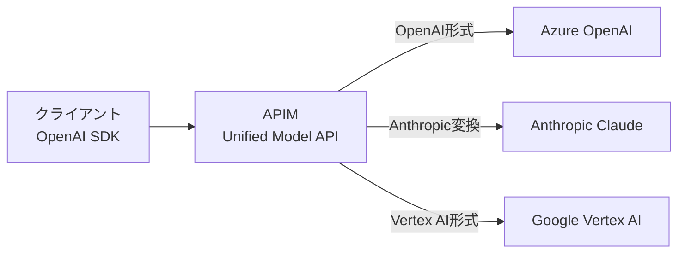

本記事は [AI gateway capabilities in Azure API Management (Microsoft Learn)](https://learn.microsoft.com/en-us/azure/api-management/genai-gateway-capabilities) の解説記事です。最終更新日: 2026年5月29日。

## ブログ概要（Summary）

Azure API Management（APIM）のAI Gatewayは、LLMのAPI管理に特化した機能群である。Microsoft公式ドキュメントによると、AI Gatewayは既存のAPI Gatewayの拡張として提供され、トークンレート制限、セマンティックキャッシュ、バックエンドロードバランサー、サーキットブレーカー、Unified Model API、トークンメトリクスなどの機能を統合的に提供する。OpenAI Chat Completions API、Anthropic Messages API、Google Vertex AI APIに対応し、Microsoft Foundryとの直接統合も可能である。

この記事は [Zenn記事: Azure OpenAI負荷分散2026年版](https://zenn.dev/0h_n0/articles/2fe007c8e2b1b0) の深掘りです。

## 情報源

- **種別**: Microsoft公式ドキュメント
- **URL**: [https://learn.microsoft.com/en-us/azure/api-management/genai-gateway-capabilities](https://learn.microsoft.com/en-us/azure/api-management/genai-gateway-capabilities)
- **組織**: Microsoft（Azure API Management チーム）
- **最終更新日**: 2026年5月29日

## 技術的背景（Technical Background）

企業におけるAI導入が進むにつれ、複数のアプリケーション・チーム・テナントがLLMバックエンドを共有する状況が一般化している。この環境では、以下の課題が顕在化する。

**トークンクォータの公平配分**: Microsoft FoundryやOpenAIなどのプロバイダーはTPM（Tokens Per Minute）単位でクォータを割り当てる。単一アプリケーションなら直接制限で管理できるが、複数アプリケーションが同一エンドポイントを共有する場合、特定アプリケーションがクォータを独占するリスクがある。

**マルチプロバイダー管理**: OpenAI、Anthropic、Google Vertex AIなど異なるAPI仕様のプロバイダーを統合管理する必要性が増加している。

**コスト可視性**: LLMのコストはトークン消費に比例するため、チーム別・アプリケーション別のトークン使用量を正確に計測し、コスト配分（チャージバック）を行う仕組みが求められる。

AI Gatewayはこれらの課題に対し、API管理レイヤーでの統合的な解決策を提供する。ドキュメントでは「AI gatewayはAPI Managementの既存のAPI gatewayを拡張するものであり、別製品ではない」と明記されている。

## 実装アーキテクチャ（Architecture）

### トークンレート制限（Token Rate Limiting）

`llm-token-limit` ポリシーにより、APIコンシューマー単位でTPM制限を設定できる。ドキュメントによると、このポリシーはサブスクリプションキー、IPアドレス、または任意のカウンターキーに基づいてトークン制限を適用可能である。

```xml
<inbound>
    <llm-token-limit
        counter-key="@(context.Subscription.Id)"
        tokens-per-minute="50000"
        estimate-prompt-tokens="true"
        remaining-tokens-variable-name="remainingTokens">
    </llm-token-limit>
</inbound>
```

`estimate-prompt-tokens="true"` を設定すると、ゲートウェイ側でプロンプトトークン数を事前推定し、制限超過の場合はバックエンドに到達する前にリクエストを拒否する。ドキュメントでは「バックエンドに到達しないため、拒否されたリクエストに対するバックエンド課金が発生しない」と説明されている。

### セマンティックキャッシュ（Semantic Caching）

セマンティックキャッシュは、過去のプロンプトとのベクトル類似度を比較し、類似リクエストにキャッシュ済み応答を返す機能である。ドキュメントによると、Azure Managed Redis（またはRediSearch互換の外部キャッシュ）とEmbeddings APIを使用して実装される。

```xml
<inbound>
    <llm-semantic-cache-lookup
        score-threshold="0.8"
        embeddings-backend-id="embedding-backend"
        embeddings-backend-auth="system-assigned" />
</inbound>
<outbound>
    <llm-semantic-cache-store duration="3600" />
</outbound>
```

`score-threshold` パラメータでベクトル類似度の閾値を制御する。値が高いほど厳密な一致を要求し、低いほど緩やかな一致でキャッシュヒットとなる。

**セマンティックキャッシュの数理的基盤**:

セマンティックキャッシュの類似度判定は、埋め込みベクトル間のコサイン類似度に基づく。

$$
\text{sim}(\mathbf{q}, \mathbf{c}) = \frac{\mathbf{q} \cdot \mathbf{c}}{|\mathbf{q}| \cdot |\mathbf{c}|}
$$

ここで、
- $\mathbf{q}$: 新規プロンプトの埋め込みベクトル
- $\mathbf{c}$: キャッシュ済みプロンプトの埋め込みベクトル

$\text{sim}(\mathbf{q}, \mathbf{c}) \geq \text{score\_threshold}$ の場合にキャッシュヒットとなり、LLMバックエンドへのリクエストが不要になる。

### バックエンドロードバランサー

ドキュメントでは4種類のロードバランシング方式がサポートされている。

| 方式 | 説明 | ユースケース |
|------|------|------------|
| ラウンドロビン | 順番にバックエンドに分散 | 均一なバックエンド構成 |
| 加重 | 重み付きで分散 | 異なる容量のバックエンド |
| 優先度ベース | 優先度順にフォールバック | PTU → Standard構成 |
| セッションアウェア | 同一セッションを同一バックエンドに固定 | ステートフルな対話 |

```json
{
  "properties": {
    "type": "Pool",
    "pool": {
      "services": [
        {
          "id": "/backends/ptu-eastus",
          "weight": 3,
          "priority": 1
        },
        {
          "id": "/backends/ptu-westus",
          "weight": 3,
          "priority": 1
        },
        {
          "id": "/backends/payg-eastus",
          "weight": 1,
          "priority": 2
        }
      ]
    }
  }
}
```

この構成では、PTUデプロイメント（priority 1）を優先使用し、PTU枯渇時にpriority 2のPAYGデプロイメントにフォールバックする。

### サーキットブレーカー

ドキュメントによると、AI Gatewayのサーキットブレーカーは**動的トリップ期間**を備えている。バックエンドからの`Retry-After`ヘッダーを読み取り、トリップ期間に反映する。従来の固定タイムアウトと異なり、Azure OpenAI側が返す待機推奨時間に正確に追従するため、過剰な遮断を防ぎつつバックエンドを保護できる。

### Unified Model API（プレビュー）

Unified Model APIは、複数のLLMプロバイダーを単一のOpenAI互換エンドポイントで統合する機能である。ドキュメントでは「OpenAI Chat Completions API」と「Anthropic Messages API」の2つのバックエンドAPIフォーマットをサポートしていると記載されている。



### トークンメトリクス出力

`llm-emit-token-metric` ポリシーにより、トークン消費メトリクスにカスタムディメンション（クライアントIP、API ID、チームIDなど）を付与し、Azure MonitorやApplication Insightsに送信できる。

```xml
<outbound>
    <llm-emit-token-metric namespace="llm-metrics">
        <dimension name="Client IP" value="@(context.Request.IpAddress)" />
        <dimension name="API ID" value="@(context.Api.Id)" />
        <dimension name="Team" value="@(context.Request.Headers.GetValueOrDefault('x-team-id', 'unknown'))" />
    </llm-emit-token-metric>
</outbound>
```

## Production Deployment Guide

### AWS実装パターン（コスト最適化重視）

APIMのAI Gateway機能群をAWS上で再現する場合のアーキテクチャパターンを示す。

| 規模 | 月間リクエスト | 推奨構成 | 月額コスト概算 | 主要サービス |
|------|--------------|---------|-------------|------------|
| **Small** | ~3,000 (100/日) | Serverless | $50-150 | API Gateway + Lambda + Bedrock + ElastiCache |
| **Medium** | ~30,000 (1,000/日) | Hybrid | $400-1,000 | ALB + ECS Fargate + ElastiCache + Bedrock |
| **Large** | 300,000+ (10,000/日) | Container | $2,500-6,000 | EKS + Karpenter + ElastiCache Cluster + Bedrock |

**Small構成の詳細** (月額$50-150):
- **API Gateway**: REST API + 使用量プラン（トークンレート制限の代替, $5/月）
- **Lambda**: ルーティングロジック + セマンティックキャッシュルックアップ（1GB RAM, $20/月）
- **Bedrock**: Claude 3.5 Haiku推論（$80/月）
- **ElastiCache Redis**: cache.t3.micro（セマンティックキャッシュストア, $15/月）
- **DynamoDB**: メトリクス・設定ストア（On-Demand, $10/月）

**Large構成の詳細** (月額$2,500-6,000):
- **EKS**: API Gatewayプロキシ + ルーティングロジック（$72/月 コントロールプレーン）
- **EC2 Spot**: g5.xlarge × 2-4台（推論ワーカー, 平均$800/月）
- **ElastiCache Redis**: r6g.large クラスタ（セマンティックキャッシュ, $300/月）
- **Bedrock**: Claude 3.5 Sonnet + Batch API 50%割引（$2,000/月）
- **CloudWatch + X-Ray**: 詳細監視（$100/月）

**コスト試算の注意事項**: 上記は2026年7月時点のAWS ap-northeast-1（東京）リージョン料金に基づく概算値です。実際のコストはトラフィックパターンにより変動します。最新料金は [AWS料金計算ツール](https://calculator.aws/) で確認してください。

### Terraformインフラコード

**Small構成: API Gateway + Lambda + ElastiCache**

```hcl
module "vpc" {
  source  = "terraform-aws-modules/vpc/aws"
  version = "~> 5.0"

  name = "ai-gateway-vpc"
  cidr = "10.0.0.0/16"
  azs  = ["ap-northeast-1a", "ap-northeast-1c"]
  private_subnets = ["10.0.1.0/24", "10.0.2.0/24"]

  enable_nat_gateway   = false
  enable_dns_hostnames = true
}

resource "aws_iam_role" "lambda_gateway" {
  name = "lambda-ai-gateway-role"
  assume_role_policy = jsonencode({
    Version = "2012-10-17"
    Statement = [{
      Action    = "sts:AssumeRole"
      Effect    = "Allow"
      Principal = { Service = "lambda.amazonaws.com" }
    }]
  })
}

resource "aws_iam_role_policy" "gateway_permissions" {
  role = aws_iam_role.lambda_gateway.id
  policy = jsonencode({
    Version = "2012-10-17"
    Statement = [
      {
        Effect   = "Allow"
        Action   = ["bedrock:InvokeModel"]
        Resource = "arn:aws:bedrock:ap-northeast-1::foundation-model/*"
      },
      {
        Effect   = "Allow"
        Action   = ["elasticache:Connect"]
        Resource = "*"
      }
    ]
  })
}

resource "aws_lambda_function" "ai_gateway" {
  filename      = "gateway.zip"
  function_name = "ai-gateway-proxy"
  role          = aws_iam_role.lambda_gateway.arn
  handler       = "index.handler"
  runtime       = "python3.12"
  timeout       = 120
  memory_size   = 1024

  environment {
    variables = {
      REDIS_ENDPOINT          = aws_elasticache_cluster.cache.cache_nodes[0].address
      SEMANTIC_CACHE_THRESHOLD = "0.8"
      TOKEN_RATE_LIMIT_TPM    = "50000"
    }
  }
}

resource "aws_elasticache_cluster" "cache" {
  cluster_id           = "ai-semantic-cache"
  engine               = "redis"
  node_type            = "cache.t3.micro"
  num_cache_nodes      = 1
  parameter_group_name = "default.redis7"
  port                 = 6379
}

resource "aws_cloudwatch_metric_alarm" "token_spike" {
  alarm_name          = "ai-gateway-token-spike"
  comparison_operator = "GreaterThanThreshold"
  evaluation_periods  = 1
  metric_name         = "TokenUsage"
  namespace           = "AIGateway"
  period              = 3600
  statistic           = "Sum"
  threshold           = 500000
  alarm_description   = "トークン使用量異常（コスト急増の可能性）"
}
```

### 運用・監視設定

```python
import boto3

cloudwatch = boto3.client('cloudwatch')

cloudwatch.put_metric_alarm(
    AlarmName='semantic-cache-hit-rate',
    ComparisonOperator='LessThanThreshold',
    EvaluationPeriods=6,
    MetricName='CacheHitRate',
    Namespace='AIGateway',
    Period=3600,
    Statistic='Average',
    Threshold=0.3,
    AlarmDescription='セマンティックキャッシュヒット率低下（閾値調整を検討）'
)

cloudwatch.put_metric_alarm(
    AlarmName='rate-limit-rejections',
    ComparisonOperator='GreaterThanThreshold',
    EvaluationPeriods=2,
    MetricName='RateLimitRejections',
    Namespace='AIGateway',
    Period=300,
    Statistic='Sum',
    Threshold=100,
    AlarmDescription='トークンレート制限による拒否が増加'
)
```

### コスト最適化チェックリスト

- [ ] ~100 req/日 → API Gateway + Lambda (Serverless) - $50-150/月
- [ ] ~1000 req/日 → ALB + ECS Fargate (Hybrid) - $400-1,000/月
- [ ] 10000+ req/日 → EKS + Spot (Container) - $2,500-6,000/月
- [ ] セマンティックキャッシュ有効化（繰り返しクエリで30-70%コスト削減）
- [ ] キャッシュ閾値チューニング（0.7-0.9でヒット率とのバランス）
- [ ] Bedrock Batch API: 非同期処理で50%割引
- [ ] Prompt Caching有効化: システムプロンプト固定で30-90%削減
- [ ] トークンレート制限: テナント別TPM上限設定
- [ ] EC2 Spot Instances: 最大90%削減（Karpenter自動管理）
- [ ] Reserved Instances: 1年コミットで最大72%削減
- [ ] AWS Budgets: 月額予算80%で警告設定
- [ ] Cost Anomaly Detection: 自動異常検知有効化
- [ ] 日次コストレポート: SNS/Slackへ送信
- [ ] CloudWatch: キャッシュヒット率・レート制限拒否率の監視
- [ ] ElastiCache: キャッシュTTL最適化（過剰保持のコスト回避）
- [ ] Lambda: メモリサイズ最適化
- [ ] タグ戦略: テナント別・API別でコスト可視化
- [ ] 未使用リソース: Trusted Advisor活用で定期確認
- [ ] 開発環境: ElastiCache夜間停止
- [ ] ライフサイクルポリシー: 古いキャッシュエントリ自動削除

## パフォーマンス最適化（Performance）

ドキュメントおよび関連Microsoft Community Hubの記事から読み取れるパフォーマンス特性を整理する。

**セマンティックキャッシュの効果**: キャッシュヒット時はLLMバックエンドへのリクエストが不要となるため、応答レイテンシがミリ秒オーダーまで短縮される。FAQチャットボットや定型的なドキュメント要約など、類似プロンプトが繰り返されるユースケースで有効である。

**トークンレート制限のオーバーヘッド**: `estimate-prompt-tokens="true"` によるゲートウェイ側でのトークン推定は、バックエンドへの不要なリクエストを削減するが、推定精度とのトレードオフが存在する。推定は厳密なトークナイザーによるカウントではなく近似値であるため、制限値の設定にはマージンを考慮する必要がある。

**ロードバランサーの優先度設定**: PTU（priority 1）→ PAYG（priority 2）の構成では、PTU枯渇時のフォールバックレイテンシに注意が必要である。PTUは低レイテンシ変動を提供するが、PAYGは負荷に応じてレイテンシが変動する可能性がある。

## 運用での学び（Production Lessons）

ドキュメントの「Labs and code samples」セクションで提供されている [AI Gateway capabilities labs](https://github.com/Azure-Samples/ai-gateway) は、各機能のハンズオン環境を提供しており、本番導入前の検証に活用できる。

**セマンティックキャッシュの閾値設定**: `score-threshold` が高すぎるとキャッシュヒット率が低下し、低すぎると意味的に異なるプロンプトに対して不正確な応答を返すリスクがある。ドキュメントのトラブルシューティングセクションでも「閾値を0.7〜0.8に調整する」ことが推奨されている。

**マルチリージョン構成**: ドキュメントでは「マルチリージョン構成の場合、バックエンドAIサービスをAPI Managementゲートウェイと同じリージョンにデプロイすることが推奨」されている。リージョン間のネットワークレイテンシがLLM応答時間に上乗せされるためである。

**Unified Model APIの制約**: ドキュメントでは2026年5月時点でパブリックプレビューであり、全機能の透過的サポートは保証されていない。ツール呼び出しや画像入力など一部機能は対応状況の確認が必要である。

## 学術研究との関連（Academic Connection）

Azure APIM AI Gatewayの各機能は、LLMサービング分野の学術研究と密接に関連している。

**ロードバランシング**: 優先度ベースのロードバランシングは、Jain et al. (2024) "Intelligent Router for LLM Workloads" で提案されたワークロード認識型ルーティングと同様の設計思想を持つ。

**セマンティックキャッシュ**: ベクトル類似度に基づくキャッシュ機構は、GPTCache (2023) やMeanCache (2024) などのオープンソース実装と技術的基盤を共有している。

**トークンレート制限**: beLLMan (Reddy et al., 2025) で提案された輻輳制御メカニズムは、APIMのトークンレート制限をアプリケーション側にまで拡張した概念と捉えることができる。

## まとめと実践への示唆

Azure APIM AI Gatewayは、LLMのAPI管理に必要な機能（トークン制御、キャッシュ、ロードバランシング、サーキットブレーカー、マルチプロバイダー統合）を統合的に提供するエンタープライズ向けソリューションである。ドキュメントでは「AI gatewayは既存のAPI gatewayの拡張」と位置づけられており、新規インフラ構築ではなく既存APIMへの機能追加として導入可能である。

マルチテナント環境でのトークン公平配分やコスト可視化を必要とするエンタープライズユースケースにおいて、これらの機能の適切な組み合わせが重要となる。

## 参考文献

- **Blog URL**: [https://learn.microsoft.com/en-us/azure/api-management/genai-gateway-capabilities](https://learn.microsoft.com/en-us/azure/api-management/genai-gateway-capabilities)
- **AI Gateway Labs**: [https://github.com/Azure-Samples/ai-gateway](https://github.com/Azure-Samples/ai-gateway)
- **Unified AI Gateway Design Pattern**: [https://techcommunity.microsoft.com/blog/integrationsonazureblog/azure-api-management---unified-ai-gateway-design-pattern/4495436](https://techcommunity.microsoft.com/blog/integrationsonazureblog/azure-api-management---unified-ai-gateway-design-pattern/4495436)
- **Related Zenn article**: [https://zenn.dev/0h_n0/articles/2fe007c8e2b1b0](https://zenn.dev/0h_n0/articles/2fe007c8e2b1b0)
