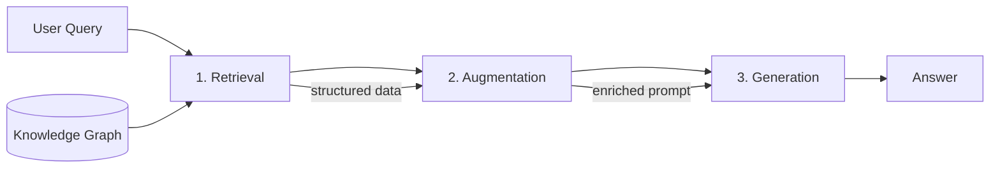
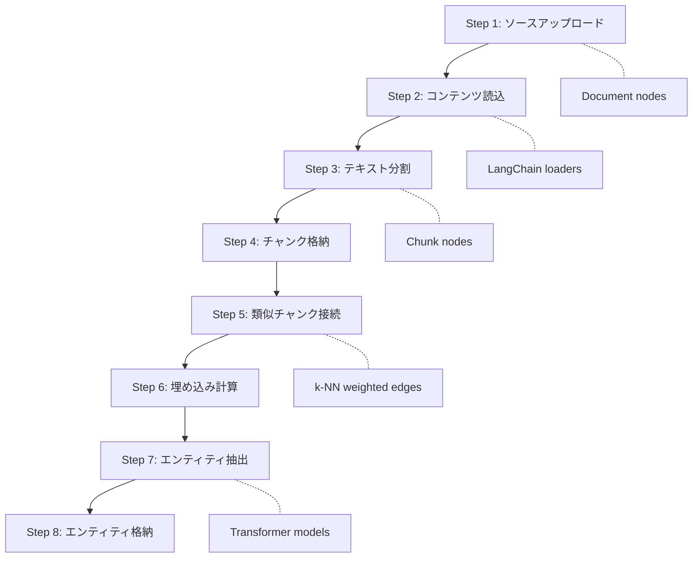

本記事は [Neo4j Developer Blog: How to improve multi-hop reasoning with knowledge graphs and LLMs](https://neo4j.com/blog/genai/knowledge-graph-llm-multi-hop-reasoning/) の解説記事です。

## ブログ概要（Summary）

Neo4jのGraph ML and GenAI ResearchチームのTomaž Bratanič氏は、従来のベクトル類似度検索に基づくRAG（Retrieval-Augmented Generation）がマルチホップ推論に失敗する問題を指摘し、ナレッジグラフ（KG）を統合したGraphRAGアーキテクチャによる解決手法を解説している。ブログでは、GraphRAGの3段階パイプライン（Retrieval / Augmentation / Generation）と、Neo4j LLM Knowledge Graph Builderの8ステップ構築プロセスが示されている。さらに、Chain-of-Thought統合によるLLMエージェントの複雑なクエリ分解手法についても言及されている。

この記事は [Zenn記事: GraphRAG×Neo4jでマルチホップQAの検索精度を向上させる実装手法](https://zenn.dev/0h_n0/articles/6d0864d1a0f732) の深掘りです。

## 情報源

| 項目 | 内容 |
|------|------|
| 種別 | 企業テックブログ |
| URL | [Neo4j Developer Blog](https://neo4j.com/blog/genai/knowledge-graph-llm-multi-hop-reasoning/) |
| 組織 | Neo4j（Graph ML and GenAI Research チーム） |
| 著者 | Tomaž Bratanič |
| 公開日 | 2025年6月18日 |

## 技術的背景（Technical Background）

### 従来RAGのマルチホップ推論における限界

RAG（Retrieval-Augmented Generation）は、外部知識をLLMの生成プロセスに統合する手法として広く使われている。標準的なRAGでは、ユーザクエリをベクトル埋め込みに変換し、ベクトルストアからコサイン類似度が高い上位$N$件のチャンクを取得する。

$$
\text{similarity}(\mathbf{q}, \mathbf{d}_i) = \frac{\mathbf{q} \cdot \mathbf{d}_i}{\|\mathbf{q}\| \cdot \|\mathbf{d}_i\|}
$$

ここで、$\mathbf{q}$はクエリの埋め込みベクトル、$\mathbf{d}_i$はドキュメントチャンク$i$の埋め込みベクトルである。

Bratanič氏は、この手法がマルチホップクエリ（複数の情報片を横断して推論する必要があるクエリ）で失敗する理由として、**Top-N結果の偏り**を指摘している。例えば「企業Aの創業者が設立した別の企業の所在地は？」というクエリでは、ベクトル類似度で上位に来るチャンクが全て「企業A」に関する情報に集中し、「創業者」「別の企業」「所在地」といった間接的に必要な情報が取得されない。

この問題は、ベクトル類似度検索が本質的に**単一ホップの情報取得**に最適化されている点に起因する。クエリと文書間の表層的な類似性しか捕捉できないため、複数のエンティティを経由する推論パスを辿ることができない。

### ナレッジグラフによるギャップの補完

ナレッジグラフ（KG）は、エンティティ（ノード）とリレーション（エッジ）のトリプル$(h, r, t)$としてデータを格納する。ここで$h$はヘッドエンティティ、$r$は関係タイプ、$t$はテールエンティティである。

KGの構造的な特性により、ベクトル検索では到達できない**関係のトラバーサル**（グラフ走査）が可能になる。Bratanič氏は、KGが従来のRAGに対して持つ以下の利点を挙げている。

- **関係ナビゲーション**: Top-N結果に限定されず、エッジを辿って関連エンティティに到達できる
- **コンテキスト対応フィルタリング**: クエリの意図に基づいて検索範囲を構造的に絞り込める
- **説明可能性の保持**: 推論パスがグラフの経路として可視化できる
- **集約・ソートを伴う分析クエリ**: Cypherクエリにより集計やランキングが直接実行できる
- **マルチドキュメント推論**: 複数文書にまたがる情報を、手動でコンテキストを繋ぎ合わせることなく統合できる
- **クエリ時レイテンシの削減**: 前処理段階でエンティティ抽出と関係構築を完了しておくことで、検索時の計算コストを抑制できる

## 実装アーキテクチャ（Architecture）

### GraphRAG 3段階パイプライン

Bratanič氏は、GraphRAGアーキテクチャを3つのステージで構成されるパイプラインとして説明している。



**Stage 1: Retrieval（検索）**

KGから関連コンテンツを特定するステージである。Bratanič氏は、以下の3つの検索戦略を提示している。

1. **ベクトル類似度検索**: KG内のノードやチャンクに付与された埋め込みベクトルに対するコサイン類似度検索
2. **構造化クエリ**: Cypherクエリ等によるグラフトラバーサル。特定の関係パスを明示的に指定できる
3. **ハイブリッドアプローチ**: ベクトル検索で候補を絞り、グラフクエリで関連エンティティを展開する組み合わせ

ハイブリッドアプローチでは、まずベクトル類似度でシードノードを特定し、そこからグラフ上の近傍ノードをトラバースすることで、Top-N制約を超えた情報取得が可能になる。

**Stage 2: Augmentation（拡張）**

検索された情報を元のユーザクエリおよびタスク固有の指示と組み合わせるステージである。プロンプトエンジニアリングの観点から、検索結果のフォーマット変換、コンテキストの構造化、タスク指示の付加が行われる。

**Stage 3: Generation（生成）**

LLMが、拡張されたコンテキストに基づいて回答を生成するステージである。従来のRAGと同様、生成はグラウンディングされた（検索結果に裏付けられた）情報に基づくため、ハルシネーションの抑制が期待される。

### Neo4j LLM Knowledge Graph Builder: 8ステップ構築プロセス

Bratanič氏は、非構造化データからKGを自動構築するNeo4j LLM Knowledge Graph Builderの処理フローを、以下の8ステップで解説している。



**Step 1-2: ソース取り込み**

多様な入力形式（PDF、HTML、トランスクリプト、URL、クラウドバケット）がサポートされている。アップロードされたソースはDocumentノードとして格納され、LangChainのドキュメントローダーを使ってコンテンツが読み込まれる。Bratanič氏は、このマルチモーダル対応により、異なる形式のデータソースを統一的にKGに統合できると述べている。

**Step 3-4: テキスト分割とチャンク格納**

テキストはチャンク（断片）に分割され、Chunkノードとして格納される。各ChunkノードはDocumentノードへの接続および前後のChunkノードとの順序関係が保持される。この接続構造により、チャンク単体では失われる文脈情報をグラフ上で復元できる。

**Step 5-6: 類似チャンク接続と埋め込み**

k-nearest neighbor（k-NN）アルゴリズムにより、意味的に類似するチャンク間に重み付きリレーションシップが作成される。同時に、各チャンクの埋め込みベクトルが計算されベクトルインデックスに登録される。これにより、ベクトル類似度検索とグラフトラバーサルの両方が同一データ上で実行可能になる。

**Step 7-8: エンティティ・リレーション抽出と格納**

Transformerモデルを使用して、テキストからエンティティ（人名、組織名、技術用語等）とそれらの関係が抽出される。抽出されたエンティティはKGノードとして格納され、出典チャンクへの接続が維持される。Bratanič氏によれば、スキーマの柔軟性として以下の3つのモードが提供されている。

1. **プリセットスキーマ**: 事前定義されたエンティティタイプと関係タイプを使用
2. **既存Neo4jスキーマ**: 既にNeo4j上に存在するスキーマを継承
3. **LLM動的推論**: LLMがテキスト内容に基づいてスキーマを自動推定

### Chain-of-Thought統合

Bratanič氏は、マルチホップ推論をさらに強化する手法として、LLMエージェントによるChain-of-Thought（CoT）統合を解説している。

CoT統合では、LLMエージェントが複雑な質問を複数のサブクエスチョンに分解し、段階的にKGへクエリを発行する。例えば「企業Xの創業者が設立した別の企業の従業員数は？」という質問は、以下のように分解される。

1. 企業Xの創業者は誰か？ → KGクエリ → 結果: 「Person A」
2. Person Aが設立した別の企業は？ → KGクエリ（前ステップの結果を使用）→ 結果: 「企業Y」
3. 企業Yの従業員数は？ → KGクエリ → 結果: 「500名」

```python
from typing import TypedDict


class SubQuestion(TypedDict):
    """マルチホップ推論のサブクエスチョン"""
    question: str
    depends_on: list[int]  # 依存するサブクエスチョンのインデックス
    tool: str  # 使用するツール（kg_query, vector_search, api_call等）


def decompose_multi_hop_query(
    query: str,
    available_tools: list[str],
) -> list[SubQuestion]:
    """複雑なクエリをサブクエスチョンに分解する

    Args:
        query: ユーザのマルチホップクエリ
        available_tools: 利用可能なツール一覧

    Returns:
        依存関係を持つサブクエスチョンのリスト
    """
    # LLMによるクエリ分解（概念的な擬似コード）
    # 実際にはLLMのfunction calling等で実装
    sub_questions: list[SubQuestion] = [
        {
            "question": "企業Xの創業者は誰か？",
            "depends_on": [],
            "tool": "kg_query",
        },
        {
            "question": "{result_0}が設立した別の企業は？",
            "depends_on": [0],
            "tool": "kg_query",
        },
        {
            "question": "{result_1}の従業員数は？",
            "depends_on": [1],
            "tool": "kg_query",
        },
    ]
    return sub_questions
```

Bratanič氏は、このアプローチではLLMエージェントが複数のツール（API、ベクトルDB、KG）を活用でき、各ステップで発見した情報を後続クエリに反映させることが可能であると述べている。

## Production Deployment Guide

GraphRAGシステムをAWS上でプロダクション運用する際の構成パターンを解説する。Neo4j AuraまたはセルフホステッドNeo4jを基盤とし、LLM呼び出しにAmazon Bedrockを使用する構成を前提とする。

### AWS実装パターン（コスト最適化重視）

**トラフィック量別の推奨構成**:

| 構成 | トラフィック | 主要サービス | 月額概算 |
|------|-------------|-------------|---------|
| Small | ~100 req/日 | Lambda + Bedrock + Neo4j Aura Free | $50-150 |
| Medium | ~1,000 req/日 | ECS Fargate + Bedrock + Neo4j Aura Pro | $400-900 |
| Large | 10,000+ req/日 | EKS + Spot + Bedrock + Neo4j Aura Enterprise | $2,500-6,000 |

**Small構成 (~100 req/日)**:
- **Compute**: Lambda（メモリ512MB、タイムアウト60秒）。GraphRAGの検索・拡張・生成パイプラインを1関数で実行
- **LLM**: Amazon Bedrock（Claude 3.5 Sonnet）。エンティティ抽出とクエリ分解に使用
- **Graph DB**: Neo4j Aura Free Tier（ノード数20万まで）またはEC2上のDocker Compose
- **Vector Index**: Neo4j内蔵ベクトルインデックス（別途ベクトルDB不要）
- **月額**: Bedrock $30-80（トークン量依存）+ Lambda $5-20 + Neo4j Aura Free $0 = $35-100

**Medium構成 (~1,000 req/日)**:
- **Compute**: ECS Fargate（vCPU 0.5、RAM 1GB）。常時起動でコールドスタートを回避
- **LLM**: Amazon Bedrock + Prompt Caching有効化
- **Graph DB**: Neo4j Aura Professional（ノード数400万、RAM 4GB）
- **月額**: Bedrock $200-500 + ECS $50-100 + Neo4j Aura Pro $65 + NAT Gateway $35 = $350-700

**Large構成 (10,000+ req/日)**:
- **Compute**: EKS + Karpenter（Spot Instances優先、自動スケーリング）
- **LLM**: Amazon Bedrock Batch API（非リアルタイム処理）+ 通常API（リアルタイム処理）
- **Graph DB**: Neo4j Aura Enterprise（専用インフラ、SLA 99.95%）
- **月額**: Bedrock $1,000-2,500 + EKS $500-1,200 + Neo4j Enterprise $400-1,500 = $1,900-5,200

**コスト試算の注意事項**: 上記は2026年7月時点のAWS ap-northeast-1（東京）リージョン料金に基づく概算値である。実際のコストはトラフィックパターン、LLMトークン使用量、Neo4jのノード数・クエリ負荷により変動する。最新料金は[AWS料金計算ツール](https://calculator.aws/)で確認することを推奨する。

**コスト削減テクニック**:
- Bedrock Prompt Caching: GraphRAGのシステムプロンプト部分をキャッシュし30-90%削減
- Bedrock Batch API: KG構築時のエンティティ抽出バッチ処理で50%削減
- Spot Instances: EKSワーカーノードで最大90%削減（KG構築ジョブ向け）
- Reserved Instances: Neo4j EC2セルフホストの場合、1年コミットで最大72%削減

### Terraformインフラコード

**Small構成（Serverless）**: Lambda + Bedrock + DynamoDB

```hcl
# GraphRAG Serverless構成 - Small (~100 req/日)
# 2026-07 時点の構成

terraform {
  required_version = ">= 1.9"
  required_providers {
    aws = {
      source  = "hashicorp/aws"
      version = "~> 5.60"
    }
  }
}

provider "aws" {
  region = "ap-northeast-1"
}

# --- IAM Role (最小権限) ---
resource "aws_iam_role" "graphrag_lambda" {
  name = "graphrag-lambda-role"
  assume_role_policy = jsonencode({
    Version = "2012-10-17"
    Statement = [{
      Action = "sts:AssumeRole"
      Effect = "Allow"
      Principal = { Service = "lambda.amazonaws.com" }
    }]
  })
}

resource "aws_iam_role_policy" "graphrag_bedrock" {
  name = "graphrag-bedrock-access"
  role = aws_iam_role.graphrag_lambda.id
  policy = jsonencode({
    Version = "2012-10-17"
    Statement = [
      {
        Effect   = "Allow"
        Action   = ["bedrock:InvokeModel", "bedrock:InvokeModelWithResponseStream"]
        Resource = "arn:aws:bedrock:ap-northeast-1::foundation-model/anthropic.claude-3-5-sonnet-*"
      },
      {
        Effect   = "Allow"
        Action   = ["dynamodb:GetItem", "dynamodb:PutItem", "dynamodb:Query"]
        Resource = aws_dynamodb_table.graphrag_cache.arn
      },
      {
        Effect   = "Allow"
        Action   = ["secretsmanager:GetSecretValue"]
        Resource = aws_secretsmanager_secret.neo4j_credentials.arn
      }
    ]
  })
}

resource "aws_iam_role_policy_attachment" "lambda_basic" {
  role       = aws_iam_role.graphrag_lambda.name
  policy_arn = "arn:aws:iam::aws:policy/service-role/AWSLambdaBasicExecutionRole"
}

# --- Secrets Manager (Neo4j接続情報) ---
resource "aws_secretsmanager_secret" "neo4j_credentials" {
  name                    = "graphrag/neo4j-credentials"
  recovery_window_in_days = 7
}

# --- DynamoDB (クエリキャッシュ / On-Demand) ---
resource "aws_dynamodb_table" "graphrag_cache" {
  name         = "graphrag-query-cache"
  billing_mode = "PAY_PER_REQUEST"  # コスト最適化: On-Demandモード
  hash_key     = "query_hash"

  attribute {
    name = "query_hash"
    type = "S"
  }

  ttl {
    attribute_name = "expires_at"
    enabled        = true
  }

  server_side_encryption {
    enabled = true  # KMS暗号化
  }
}

# --- Lambda Function ---
resource "aws_lambda_function" "graphrag_handler" {
  function_name = "graphrag-query-handler"
  runtime       = "python3.12"
  handler       = "handler.lambda_handler"
  role          = aws_iam_role.graphrag_lambda.arn
  timeout       = 60
  memory_size   = 512  # コスト最適化: 512MBで十分

  environment {
    variables = {
      NEO4J_SECRET_ARN = aws_secretsmanager_secret.neo4j_credentials.arn
      CACHE_TABLE      = aws_dynamodb_table.graphrag_cache.name
      BEDROCK_MODEL_ID = "anthropic.claude-3-5-sonnet-20241022-v2:0"
    }
  }

  tracing_config {
    mode = "Active"  # X-Ray有効化
  }
}

# --- CloudWatch Alarm (コスト監視) ---
resource "aws_cloudwatch_metric_alarm" "lambda_duration" {
  alarm_name          = "graphrag-lambda-high-duration"
  comparison_operator = "GreaterThanThreshold"
  evaluation_periods  = 3
  metric_name         = "Duration"
  namespace           = "AWS/Lambda"
  period              = 300
  statistic           = "Average"
  threshold           = 30000  # 30秒超過でアラート
  alarm_description   = "GraphRAG Lambda execution time exceeds 30s"

  dimensions = {
    FunctionName = aws_lambda_function.graphrag_handler.function_name
  }
}
```

**Large構成（Container）**: EKS + Karpenter + Spot Instances

```hcl
# GraphRAG Container構成 - Large (10,000+ req/日)

module "eks" {
  source  = "terraform-aws-modules/eks/aws"
  version = "~> 20.24"

  cluster_name    = "graphrag-cluster"
  cluster_version = "1.31"

  vpc_id     = module.vpc.vpc_id
  subnet_ids = module.vpc.private_subnets

  cluster_endpoint_public_access = false  # セキュリティ: プライベートのみ

  eks_managed_node_groups = {
    system = {
      instance_types = ["m7i.large"]
      min_size       = 2
      max_size       = 3
      desired_size   = 2
    }
  }
}

# --- Karpenter Provisioner (Spot優先) ---
resource "kubectl_manifest" "karpenter_nodepool" {
  yaml_body = yamlencode({
    apiVersion = "karpenter.sh/v1"
    kind       = "NodePool"
    metadata   = { name = "graphrag-spot" }
    spec = {
      template = {
        spec = {
          requirements = [
            { key = "karpenter.sh/capacity-type", operator = "In", values = ["spot", "on-demand"] },
            { key = "node.kubernetes.io/instance-type", operator = "In",
              values = ["m7i.xlarge", "m6i.xlarge", "m5.xlarge", "c7i.xlarge"] },
          ]
          nodeClassRef = { name = "default" }
        }
      }
      limits   = { cpu = "100", memory = "400Gi" }
      disruption = {
        consolidationPolicy = "WhenEmptyOrUnderutilized"
        consolidateAfter    = "30s"
      }
    }
  })
}

# --- AWS Budgets (予算アラート) ---
resource "aws_budgets_budget" "graphrag_monthly" {
  name         = "graphrag-monthly-budget"
  budget_type  = "COST"
  limit_amount = "5000"
  limit_unit   = "USD"
  time_unit    = "MONTHLY"

  notification {
    comparison_operator       = "GREATER_THAN"
    threshold                 = 80
    threshold_type            = "PERCENTAGE"
    notification_type         = "FORECASTED"
    subscriber_email_addresses = ["ops-team@example.com"]
  }
}
```

### 運用・監視設定

**CloudWatch Logs Insights クエリ**: GraphRAGパイプラインの各ステージのレイテンシとトークン使用量を可視化する。

```
# コスト異常検知: 1時間あたりのBedrockトークン使用量
fields @timestamp, @message
| filter @message like /bedrock_tokens/
| stats sum(input_tokens) as total_input, sum(output_tokens) as total_output by bin(1h)
| sort @timestamp desc

# レイテンシ分析: GraphRAGパイプライン P95/P99
fields @timestamp, duration_ms, stage
| filter stage in ["retrieval", "augmentation", "generation"]
| stats percentile(duration_ms, 95) as p95, percentile(duration_ms, 99) as p99 by stage
```

**CloudWatch アラーム設定（Python boto3）**:

```python
import boto3


def create_bedrock_token_alarm(sns_topic_arn: str) -> dict:
    """Bedrockトークン使用量スパイク検知アラームを作成する

    Args:
        sns_topic_arn: 通知先SNSトピックのARN

    Returns:
        作成されたアラームのレスポンス
    """
    cw = boto3.client("cloudwatch", region_name="ap-northeast-1")
    return cw.put_metric_alarm(
        AlarmName="graphrag-bedrock-token-spike",
        MetricName="InputTokenCount",
        Namespace="AWS/Bedrock",
        Statistic="Sum",
        Period=3600,
        EvaluationPeriods=2,
        Threshold=500000,  # 1時間50万トークン超過
        ComparisonOperator="GreaterThanThreshold",
        AlarmActions=[sns_topic_arn],
    )
```

**X-Ray トレーシング設定（Python）**:

```python
from aws_xray_sdk.core import xray_recorder, patch_all

# boto3の自動計装
patch_all()


@xray_recorder.capture("graphrag_pipeline")
def run_graphrag_pipeline(query: str, neo4j_driver) -> str:
    """GraphRAGパイプラインをX-Rayトレース付きで実行する

    Args:
        query: ユーザクエリ
        neo4j_driver: Neo4jドライバインスタンス

    Returns:
        生成された回答
    """
    subsegment = xray_recorder.current_subsegment()
    subsegment.put_annotation("query_type", "multi_hop")
    subsegment.put_metadata("query", query)

    # Stage 1: Retrieval
    with xray_recorder.in_subsegment("retrieval") as seg:
        results = retrieve_from_kg(query, neo4j_driver)
        seg.put_metadata("result_count", len(results))

    # Stage 2: Augmentation
    with xray_recorder.in_subsegment("augmentation"):
        context = augment_query(query, results)

    # Stage 3: Generation
    with xray_recorder.in_subsegment("generation") as seg:
        answer = generate_with_bedrock(context)
        seg.put_metadata("output_tokens", len(answer.split()))

    return answer
```

**Cost Explorer自動レポート（Python）**:

```python
import boto3
from datetime import datetime, timedelta


def get_daily_graphrag_cost(sns_topic_arn: str, threshold: float = 100.0) -> dict:
    """日次GraphRAGコストレポートを取得し、閾値超過時にSNS通知する

    Args:
        sns_topic_arn: 通知先SNSトピックのARN
        threshold: アラート閾値（USD/日）

    Returns:
        サービス別コスト辞書
    """
    ce = boto3.client("ce", region_name="us-east-1")
    today = datetime.utcnow().strftime("%Y-%m-%d")
    yesterday = (datetime.utcnow() - timedelta(days=1)).strftime("%Y-%m-%d")

    resp = ce.get_cost_and_usage(
        TimePeriod={"Start": yesterday, "End": today},
        Granularity="DAILY",
        Metrics=["UnblendedCost"],
        Filter={
            "Tags": {"Key": "Project", "Values": ["graphrag"]},
        },
        GroupBy=[{"Type": "DIMENSION", "Key": "SERVICE"}],
    )

    costs = {}
    total = 0.0
    for group in resp["ResultsByTime"][0]["Groups"]:
        service = group["Keys"][0]
        amount = float(group["Metrics"]["UnblendedCost"]["Amount"])
        costs[service] = amount
        total += amount

    if total > threshold:
        sns = boto3.client("sns", region_name="ap-northeast-1")
        sns.publish(
            TopicArn=sns_topic_arn,
            Subject=f"GraphRAG Daily Cost Alert: ${total:.2f}",
            Message=f"Daily cost ${total:.2f} exceeds ${threshold}.\n{costs}",
        )

    return costs
```

### コスト最適化チェックリスト

**アーキテクチャ選択**:
- [ ] トラフィック100 req/日以下 → Serverless（Lambda + Bedrock）
- [ ] トラフィック100-5,000 req/日 → Hybrid（ECS Fargate + Bedrock）
- [ ] トラフィック5,000 req/日超 → Container（EKS + Spot）

**リソース最適化**:
- [ ] EC2/EKS: Spot Instances優先（KG構築バッチは中断耐性あり）
- [ ] Reserved Instances: Neo4jセルフホスト用EC2は1年コミットで最大72%削減
- [ ] Savings Plans: Fargate/Lambdaの一定使用量にCompute Savings Plans適用
- [ ] Lambda: メモリサイズをPower Tuningで最適化（512MB-1024MB推奨）
- [ ] ECS/EKS: アイドル時はDesired Count 0にスケールダウン

**LLMコスト削減**:
- [ ] Bedrock Batch API: KG構築時のエンティティ抽出に使用（50%削減）
- [ ] Prompt Caching: GraphRAGシステムプロンプトをキャッシュ（30-90%削減）
- [ ] モデル選択ロジック: 単純なエンティティ抽出はHaiku、複雑な推論はSonnetに振り分け
- [ ] トークン数制限: KG検索結果のコンテキストを最大4,000トークンに制限
- [ ] DynamoDBキャッシュ: 同一クエリの再実行を回避（TTL 24時間）

**監視・アラート**:
- [ ] AWS Budgets: 月額予算設定（80%予測超過で通知）
- [ ] CloudWatch Alarm: Bedrockトークン使用量スパイク検知
- [ ] Cost Anomaly Detection: 自動異常検知有効化
- [ ] 日次コストレポート: Cost Explorerから自動取得・SNS通知

**リソース管理**:
- [ ] 未使用NAT Gateway削除（VPCエンドポイントで代替可能なサービスは移行）
- [ ] タグ戦略: `Project=graphrag`タグで全リソースにコスト配賦
- [ ] S3ライフサイクル: KG構築ログは30日後にGlacierへ移行
- [ ] 開発環境: 夜間・休日はEKSノードグループをスケールダウン
- [ ] Neo4j Aura: 開発環境はFree Tier使用、本番のみPro/Enterprise

## パフォーマンス最適化（Performance）

### ベクトル検索 vs. グラフトラバーサルのレイテンシ特性

Bratanič氏はブログ内で具体的なベンチマーク数値を提示していないが、GraphRAGにおけるパフォーマンス最適化の観点として以下のポイントが示唆されている。

**前処理（インデキシング）時のコスト**:
- KG構築の8ステップのうち、Step 7（エンティティ抽出）がLLM呼び出しを伴うためコスト・時間共に支配的
- 事前にエンティティ抽出と関係構築を完了しておくことで、**クエリ時レイテンシの削減**が可能（Bratanič氏はこれをGraphRAGの利点の1つとして挙げている）

**クエリ時の最適化戦略**:

| 戦略 | 手法 | 効果 |
|------|------|------|
| ベクトルインデックス | HNSW（Neo4j内蔵） | ANN検索でO(log N)の近似最近傍探索 |
| グラフトラバーサル最適化 | Cypherクエリプランニング | インデックスヒントによるスキャン回避 |
| キャッシュ | クエリ結果キャッシュ | 同一クエリの再実行をDynamoDB/Redisで回避 |
| モデル選択 | タスク別LLM振り分け | 簡単なクエリ分解にHaiku、複雑な推論にSonnet |

**チューニング上の注意点**:
- k-NNのk値が大きいほど類似チャンク間のエッジが増加し、トラバーサル時の探索空間が拡大する。Bratanič氏のブログではk値の推奨値は明示されていないが、一般的にはk=5-10程度が使用される
- チャンクサイズとエンティティ抽出の粒度はトレードオフの関係にある。チャンクが小さすぎるとコンテキスト不足でエンティティ間の関係が捕捉できず、大きすぎると埋め込みの精度が低下する

## 運用での学び（Production Lessons）

Bratanič氏のブログは主にアーキテクチャ設計に焦点を当てているが、プロダクション運用において考慮すべき課題を以下にまとめる。

### KGの鮮度維持

ナレッジグラフは構築後に静的になりがちである。新しいドキュメントが追加された場合、以下の運用フローが必要になる。

1. **差分更新**: 新規ドキュメントのみStep 1-8を実行し、既存グラフにマージ
2. **エンティティ解決（Entity Resolution）**: 新規抽出されたエンティティが既存エンティティと同一かどうかを判定。名寄せ（"Google LLC" と "Google" を同一視）の精度がKGの品質を左右する
3. **スキーマ進化**: データソースの変化に伴い、新しいエンティティタイプや関係タイプが必要になる場合がある

### エンティティ抽出の品質管理

Bratanič氏はTransformerモデルによるエンティティ抽出を使用すると述べているが、抽出精度はドメインに強く依存する。

- **ドメイン固有用語**: 医療・法律・金融等の専門ドメインでは、汎用モデルではエンティティの見落としや誤抽出が発生しやすい
- **関係タイプの曖昧性**: 「AはBと関連する」のような曖昧な関係は、具体的な関係タイプ（"founded_by", "located_in"等）への分類が困難な場合がある
- **対策**: プリセットスキーマの使用、few-shotプロンプトによるLLM抽出の精度向上、人間によるサンプリングレビューが有効

### マルチホップ推論の制約

GraphRAGはマルチホップ推論を改善するが、以下の制約が存在する。

- **ホップ数の上限**: グラフトラバーサルのホップ数が増えるとノイズが増加し、関連性の低いエンティティが混入する。一般的に3-4ホップが実用的な上限とされる
- **欠損エッジ問題**: KG構築時にエンティティ間の関係が抽出されなかった場合、その推論パスは利用できない。KGのカバレッジ（網羅性）が推論精度の上限を決定する
- **クエリ分解の精度**: CoT統合でのサブクエスチョン分解が不適切な場合、途中段階で誤った結果が伝播し、最終回答の品質が低下する（エラー伝播問題）

## 学術研究との関連（Academic Connection）

GraphRAGの概念は、グラフベースの質問応答に関する複数の研究を背景としている。

- **KGQA（Knowledge Graph Question Answering）**: ナレッジグラフ上の質問応答は自然言語処理の長年の研究テーマであり、SPARQL生成やグラフニューラルネットワーク（GNN）を活用した手法が研究されてきた。GraphRAGはこれらの手法とLLMを統合する実用的なアプローチとして位置づけられる

- **Microsoft GraphRAG（Edge et al., 2024）**: Microsoftが提案したGraphRAG（[arXiv:2404.16130](https://arxiv.org/abs/2404.16130)）は、テキストからエンティティグラフを構築し、コミュニティ検出によるクラスタリングでグローバルな要約を生成するアプローチを採用している。Bratanič氏のブログで解説されているNeo4jのGraphRAGとは実装詳細が異なるが、KGとLLMの統合という基本的なコンセプトを共有している

- **Graph-of-Thought / Tree-of-Thought**: LLMの推論を木構造やグラフ構造で展開する手法は、CoT統合によるマルチホップ推論と関連する。GraphRAGでは外部知識グラフが推論の根拠を提供する点で、LLM単体の推論拡張手法とは相補的な関係にある

- **RAG-Fusion / Corrective RAG**: 検索結果の質を向上させるRAGの発展手法も関連研究として挙げられる。GraphRAGはこれらの手法と組み合わせて使用することも可能であり、例えばCorrective RAGでの検索結果の妥当性判定にKGの構造情報を活用できる

## まとめと実践への示唆

Bratanič氏のブログは、従来のベクトル類似度検索ベースのRAGがマルチホップ推論で直面する根本的な制約を明確にし、ナレッジグラフの統合がその解決策となることを示している。GraphRAGの3段階パイプライン（Retrieval / Augmentation / Generation）は、既存のRAGシステムに段階的にKGを導入する際の設計指針として実用的である。

**実践上の示唆**:
- **全てのRAGをGraphRAGに置き換える必要はない**: 単一ドキュメント内の単純な事実検索には従来のベクトル検索で十分であり、マルチホップ推論が必要なユースケースでKGを導入する判断が重要
- **KG構築コストの考慮**: エンティティ抽出はLLM呼び出しを伴うため、大規模データセットでは構築コストが非自明になる。バッチ処理とモデル選択の最適化が不可欠
- **スキーマ設計の重要性**: LLM動的推論は柔軟だが、プロダクション環境ではプリセットスキーマによる抽出の一貫性確保が推奨される
- **段階的導入**: 既存のRAGシステムにハイブリッド検索として KGを追加し、効果を測定しながら拡大するアプローチが現実的

## 参考文献

- **Blog URL**: [Neo4j Developer Blog: How to improve multi-hop reasoning with knowledge graphs and LLMs](https://neo4j.com/blog/genai/knowledge-graph-llm-multi-hop-reasoning/)
- **Neo4j LLM Knowledge Graph Builder**: [GitHub: neo4j-labs/llm-graph-builder](https://github.com/neo4j-labs/llm-graph-builder)
- **Microsoft GraphRAG**: [arXiv:2404.16130 - From Local to Global: A Graph RAG Approach to Query-Focused Summarization](https://arxiv.org/abs/2404.16130)
- **Neo4j Aura**: [https://neo4j.com/cloud/platform/aura-graph-database/](https://neo4j.com/cloud/platform/aura-graph-database/)
- **Related Zenn article**: [GraphRAG×Neo4jでマルチホップQAの検索精度を向上させる実装手法](https://zenn.dev/0h_n0/articles/6d0864d1a0f732)
