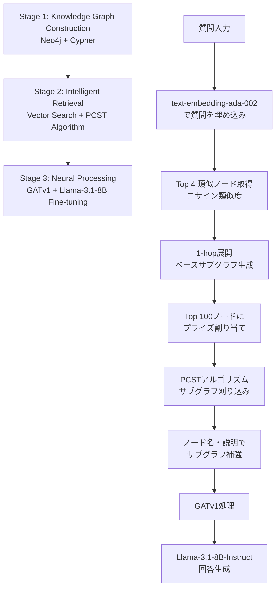

## ブログ概要

本記事は [NVIDIA Developer Blog: "Boosting Q&A Accuracy with GraphRAG Using PyG and Graph Databases"](https://developer.nvidia.com/blog/boosting-qa-accuracy-with-graphrag-using-pyg-and-graph-databases/)（2025年3月26日公開、Brian Shi, Alfred Clemedtson, Zach Blumenfeld, Rishi Puri 著）の解説記事です。

NVIDIAの技術ブログでは、知識グラフ（Knowledge Graph）とGNN（Graph Neural Network）をRAGパイプラインに統合する**G-Retriever**アーキテクチャを紹介している。著者らは、Neo4jグラフデータベース、PyTorch Geometric（PyG）によるGATv1、Prize-Collecting Steiner Tree（PCST）アルゴリズムを組み合わせることで、STaRK-Prime生物医学ベンチマークにおいてHits@1で32.09%を達成し、ベースライン（15.57%）の約2倍の精度向上を報告している。

この記事は [Zenn記事: GraphRAG×Neo4jでマルチホップQAの検索精度を向上させる実装手法](https://zenn.dev/0h_n0/articles/6d0864d1a0f732) の深掘りです。

## 情報源

- **種別**: 企業テックブログ（NVIDIA Developer Blog）
- **URL**: [Boosting Q&A Accuracy with GraphRAG Using PyG and Graph Databases](https://developer.nvidia.com/blog/boosting-qa-accuracy-with-graphrag-using-pyg-and-graph-databases/)
- **組織**: NVIDIA
- **著者**: Brian Shi, Alfred Clemedtson, Zach Blumenfeld, Rishi Puri
- **発表日**: 2025年3月26日

---

## 技術的背景

### ベクトル検索のみのRAGの限界

従来のRAGパイプラインは、ドキュメントをチャンク分割し、埋め込みベクトルで類似度検索を行うベクトル検索ベースのアプローチを採用している。しかし、このアプローチにはマルチホップ推論における根本的な限界がある。

**問題例**: 「タンパク質Xに関連する遺伝子が関与する疾患は何か」という質問に対して、ベクトル検索はタンパク質X単体に関するチャンクを取得できるが、「タンパク質X → 遺伝子Y → 疾患Z」という複数ステップの関係性を捉えることが困難である。各チャンクが独立した文書断片であるため、エンティティ間の構造的関係がベクトル空間に十分にエンコードされない。

### GraphRAGの必要性

知識グラフはエンティティ間の関係を明示的にエッジとして表現するため、マルチホップの推論パスを辿ることが可能である。GraphRAGは、この知識グラフの構造情報をRAGパイプラインに統合し、以下の利点を実現する。

- **関係性の保持**: ノード間のエッジが明示的な関係を表現
- **マルチホップ探索**: グラフトラバーサルにより複数ステップの推論パスを取得
- **文脈の豊かさ**: サブグラフ単位でLLMに提供することで、孤立したチャンクよりも豊かな文脈を生成

ただし、知識グラフ全体をLLMのコンテキストウィンドウに入力することは現実的ではない。質問に関連するサブグラフを効率的に同定し、適切なサイズに刈り込む必要がある。G-Retrieverはこの課題に対するアーキテクチャとして提案されている。

---

## 実装アーキテクチャ

### G-Retrieverの3段階パイプライン

ブログで紹介されているG-Retrieverアーキテクチャは、以下の3段階で構成される。



#### Stage 1: Knowledge Graph Construction

ドメイン知識をNeo4jグラフデータベースに構造化して格納する。ブログではSTaRK-Prime生物医学データセットを使用しており、遺伝子、タンパク質、疾患などのエンティティとそれらの関係性がグラフとして表現されている。

Neo4jでは一意性制約を設定し、データ整合性を確保する。

```cypher
CREATE CONSTRAINT unique_geneorprotein_nodeid IF NOT EXISTS
FOR (n:GeneOrProtein) REQUIRE n.nodeId IS UNIQUE
```

各ノードにはOpenAIの`text-embedding-ada-002`で生成した埋め込みベクトルが付与され、Neo4jのベクトルインデックスでコサイン類似度検索が可能となる。

#### Stage 2: Intelligent Retrieval（PCST アルゴリズム）

検索プロセスは以下の手順で進行する。

1. **質問の埋め込み**: `text-embedding-ada-002`で質問テキストをベクトル化
2. **類似ノード検索**: Neo4jのベクトルインデックスからコサイン類似度でtop 4ノードを取得
3. **1-hop展開**: 取得した4ノードから1-hopで展開し、ベースサブグラフを生成
4. **プライズ割り当て**: ベースサブグラフ内のtop 100関連ノードにベクトル類似度でプライズを割り当て（4.0から0.0まで、0.04間隔）
5. **PCST実行**: Neo4j Graph Data Science（GDS）上でPCSTアルゴリズムを実行し、最適サブグラフを抽出
6. **サブグラフ補強**: 抽出されたサブグラフのノードに名前と説明を付与

**PCST（Prize-Collecting Steiner Tree）アルゴリズム**は、ノードに割り当てられたプライズを最大化しつつ、サブグラフのサイズ（エッジコスト）を最小化する最適化問題を解く。形式的には以下の目的関数を最適化する。

$$
\max_{T \subseteq G} \left( \sum_{v \in V(T)} p(v) - \sum_{e \in E(T)} c(e) \right)
$$

ここで、
- $T$: 抽出されるサブツリー
- $G$: ベースサブグラフ
- $p(v)$: ノード$v$のプライズ値（ベクトル類似度に基づく、0.0〜4.0）
- $c(e)$: エッジ$e$のコスト

プライズ値は質問との意味的類似度に比例し、関連性の高いノードほど大きなプライズが割り当てられる。PCSTはこれらのノードを効率的に接続するサブツリーを見つけ、無関係なノードを刈り落とす。

#### Stage 3: Neural Processing（GATv1 + LLM Fine-tuning）

抽出されたサブグラフをGATv1（Graph Attention Network v1）で処理し、ノード間の注意重みを学習する。GATv1の注意スコアは以下の式で計算される。

$$
\alpha_{ij} = \frac{\exp(\text{LeakyReLU}(\mathbf{a}^T [\mathbf{W}\mathbf{h}_i \| \mathbf{W}\mathbf{h}_j]))}{\sum_{k \in \mathcal{N}(i)} \exp(\text{LeakyReLU}(\mathbf{a}^T [\mathbf{W}\mathbf{h}_i \| \mathbf{W}\mathbf{h}_k]))}
$$

ここで、
- $\mathbf{h}_i$: ノード$i$の特徴ベクトル
- $\mathbf{W}$: 学習可能な重み行列
- $\mathbf{a}$: 注意メカニズムの重みベクトル
- $\|$: ベクトルの連結演算
- $\mathcal{N}(i)$: ノード$i$の近傍ノード集合

GATv1で処理されたサブグラフ表現は、LLM（meta-llama/Llama-3.1-8B-Instruct、128kコンテキスト長）のfine-tuning時に統合される。GNNレイヤーがLLMの注意機構と連携し、検索された文脈への注意を最適化する。

### 学習プロセス

学習はトリプレット $\{(Q_i, A_i, G_i)\}$ の形式で行われる。

- $Q_i$: マルチホップ自然言語質問
- $A_i$: 回答ノードの集合
- $G_i = (V_i, E_i)$: 関連サブグラフ

著者らは、6,000件のQ&Aペアで学習、4,000件で評価を行い、4台のA100 40GB GPUで約2時間の学習時間を報告している。学習時間はサンプル数に対して線形にスケールすると述べられている。

---

## Production Deployment Guide

G-Retrieverパイプラインをプロダクション環境にデプロイするためのAWS構成ガイドを示す。GraphRAGではグラフDB（Neo4j）、GNNモデル推論（GPU）、LLM推論の3コンポーネントが必要となり、それぞれのリソース要件が異なる点に留意が必要である。

### AWS実装パターン（コスト最適化重視）

**コスト試算の注意事項**: 以下は2026年7月時点のAWS ap-northeast-1（東京）リージョン料金に基づく概算値であり、実際のコストはトラフィックパターン、リージョン、バースト使用量により変動する。最新料金はAWS料金計算ツールで確認を推奨する。

| 構成 | トラフィック | 主要サービス | 月額概算 |
|------|-------------|-------------|---------|
| Small | ~100 req/日 | Lambda + Neptune Serverless + Bedrock | $150-300 |
| Medium | ~1,000 req/日 | ECS Fargate + Neptune + g5.xlarge | $800-1,500 |
| Large | 10,000+ req/日 | EKS + Neptune + g5.2xlarge Spot | $3,000-6,000 |

**Small構成（~100 req/日）**:
- Lambda（GNN推論をCPUフォールバック）+ Amazon Neptune Serverless（グラフDB）+ Bedrock（LLM推論）
- Neptune Serverlessは使用量に応じた課金でアイドル時のコストを抑制
- Bedrock Batch APIで非リアルタイム処理のコストを50%削減
- 月額内訳: Lambda $5-10、Neptune Serverless $50-100、Bedrock $80-150、S3/CloudWatch $15-40

**Medium構成（~1,000 req/日）**:
- ECS Fargate（GNN推論用g5.xlarge GPU Task）+ Neptune（プロビジョンド）+ SageMaker Endpoint（LLM）
- GNN推論をGPUで実行しレイテンシを改善（ブログ報告のGNN+LLM推論: 0.41-0.56秒）
- SageMaker Endpointで自動スケーリング

**Large構成（10,000+ req/日）**:
- EKS + Karpenter（g5.2xlarge Spot優先）+ Neptune（マルチAZ）+ vLLMコンテナ
- Spot Instancesで最大90%のGPUコスト削減
- KarpenterによるGPUノードの自動プロビジョニング

**コスト削減テクニック**:
- Spot Instances活用でGPUコスト最大90%削減
- Reserved Instances（1年コミット）でNeptuneコスト最大40%削減
- Bedrock Batch API使用で50%削減
- Prompt Caching有効化で30-90%削減
- Neptune Serverless採用でアイドル時のコストをゼロに近づける

### Terraformインフラコード

#### Small構成（Serverless）

```hcl
# GraphRAG Small構成: Lambda + Neptune Serverless
# 月額概算: $150-300

terraform {
  required_version = ">= 1.9"
  required_providers {
    aws = {
      source  = "hashicorp/aws"
      version = "~> 5.60"
    }
  }
}

provider "aws" {
  region = "ap-northeast-1"
}

# VPC（NAT Gateway不使用でコスト削減）
module "vpc" {
  source  = "terraform-aws-modules/vpc/aws"
  version = "~> 5.13"

  name = "graphrag-small-vpc"
  cidr = "10.0.0.0/16"

  azs             = ["ap-northeast-1a", "ap-northeast-1c"]
  private_subnets = ["10.0.1.0/24", "10.0.2.0/24"]
  public_subnets  = ["10.0.101.0/24", "10.0.102.0/24"]

  enable_nat_gateway = false  # コスト削減
}

# Neptune Serverless（グラフDB）
resource "aws_neptune_cluster" "graphrag" {
  cluster_identifier = "graphrag-neptune"
  engine             = "neptune"
  serverless_v2_scaling_configuration {
    min_capacity = 1.0   # アイドル時最小
    max_capacity = 8.0   # ピーク時スケールアップ
  }
  vpc_security_group_ids = [aws_security_group.neptune.id]
  storage_encrypted      = true  # KMS暗号化
}

# Lambda関数（GNN推論 + PCST処理）
resource "aws_lambda_function" "graphrag_inference" {
  function_name = "graphrag-inference"
  runtime       = "python3.12"
  handler       = "handler.lambda_handler"
  memory_size   = 3008  # GNN推論用に最大メモリ
  timeout       = 60    # PCST処理の最大3.5秒 + マージン

  environment {
    variables = {
      NEPTUNE_ENDPOINT = aws_neptune_cluster.graphrag.endpoint
      BEDROCK_MODEL_ID = "meta.llama3-1-8b-instruct-v1:0"
    }
  }
}

# CloudWatch アラーム（コスト監視）
resource "aws_cloudwatch_metric_alarm" "lambda_cost" {
  alarm_name          = "graphrag-lambda-invocations-high"
  comparison_operator = "GreaterThanThreshold"
  evaluation_periods  = 1
  metric_name         = "Invocations"
  namespace           = "AWS/Lambda"
  period              = 86400  # 1日
  statistic           = "Sum"
  threshold           = 500    # 日次上限
  alarm_actions       = [aws_sns_topic.alerts.arn]
}

resource "aws_sns_topic" "alerts" {
  name = "graphrag-cost-alerts"
}
```

#### Large構成（Container）

```hcl
# GraphRAG Large構成: EKS + Karpenter + Spot Instances
# 月額概算: $3,000-6,000

module "eks" {
  source  = "terraform-aws-modules/eks/aws"
  version = "~> 20.24"

  cluster_name    = "graphrag-large"
  cluster_version = "1.31"

  vpc_id     = module.vpc.vpc_id
  subnet_ids = module.vpc.private_subnets

  cluster_endpoint_public_access = false  # セキュリティ強化
}

# Karpenter Provisioner（Spot優先、GPU自動スケーリング）
resource "kubectl_manifest" "karpenter_nodepool" {
  yaml_body = <<-YAML
    apiVersion: karpenter.sh/v1
    kind: NodePool
    metadata:
      name: graphrag-gpu
    spec:
      template:
        spec:
          requirements:
            - key: "karpenter.k8s.aws/instance-family"
              operator: In
              values: ["g5"]
            - key: "karpenter.sh/capacity-type"
              operator: In
              values: ["spot", "on-demand"]  # Spot優先
          limits:
            cpu: "128"
            nvidia.com/gpu: "8"
  YAML
}

# Secrets Manager（API Key管理）
resource "aws_secretsmanager_secret" "openai_key" {
  name                    = "graphrag/openai-api-key"
  recovery_window_in_days = 7
}

# AWS Budgets（月次予算アラート）
resource "aws_budgets_budget" "graphrag" {
  name         = "graphrag-monthly"
  budget_type  = "COST"
  limit_amount = "6000"
  limit_unit   = "USD"
  time_unit    = "MONTHLY"

  notification {
    comparison_operator       = "GREATER_THAN"
    threshold                 = 80
    threshold_type            = "PERCENTAGE"
    notification_type         = "ACTUAL"
    subscriber_sns_topic_arns = [aws_sns_topic.alerts.arn]
  }
}
```

### 運用・監視設定

#### CloudWatch Logs Insights クエリ

```
# PCST処理時間の異常検知（P95 > 2秒でアラート）
fields @timestamp, component, duration_ms
| filter component = "pcst"
| stats percentile(duration_ms, 95) as p95_latency by bin(1h)
| filter p95_latency > 2000

# Cypher クエリレイテンシ分析
fields @timestamp, component, duration_ms, node_count
| filter component = "cypher_query"
| stats avg(duration_ms) as avg_latency,
        percentile(duration_ms, 99) as p99_latency,
        avg(node_count) as avg_nodes
  by bin(1h)
```

#### CloudWatch アラーム設定（Python）

```python
import boto3

cloudwatch = boto3.client("cloudwatch")

# GNN+LLM推論レイテンシ監視（ブログ報告値: 0.41-0.56秒）
cloudwatch.put_metric_alarm(
    AlarmName="graphrag-gnn-llm-latency-high",
    Namespace="GraphRAG",
    MetricName="GNNLLMLatency",
    Statistic="p95",
    Period=300,
    EvaluationPeriods=3,
    Threshold=1000,  # 1秒（報告値の約2倍を閾値）
    ComparisonOperator="GreaterThanThreshold",
    AlarmActions=["arn:aws:sns:ap-northeast-1:ACCOUNT:graphrag-alerts"],
)
```

#### X-Ray トレーシング設定（Python）

```python
from aws_xray_sdk.core import xray_recorder, patch_all

patch_all()  # boto3自動計装

@xray_recorder.capture("graphrag_inference")
def inference_pipeline(question: str) -> str:
    """GraphRAG推論パイプライン（X-Rayトレース付き）"""
    subsegment = xray_recorder.begin_subsegment("cypher_query")
    subsegment.put_annotation("question_length", len(question))
    base_subgraph = run_cypher_query(question)
    xray_recorder.end_subsegment()

    subsegment = xray_recorder.begin_subsegment("pcst_pruning")
    subsegment.put_metadata("node_count", len(base_subgraph.nodes))
    pruned_subgraph = run_pcst(base_subgraph)
    xray_recorder.end_subsegment()

    subsegment = xray_recorder.begin_subsegment("gnn_llm_forward")
    answer = run_gnn_llm(pruned_subgraph, question)
    xray_recorder.end_subsegment()

    return answer
```

#### Cost Explorer 自動レポート（Python）

```python
import boto3
from datetime import datetime, timedelta

ce = boto3.client("ce")
sns = boto3.client("sns")

def daily_cost_report() -> None:
    """日次コストレポート取得・アラート"""
    end = datetime.utcnow().strftime("%Y-%m-%d")
    start = (datetime.utcnow() - timedelta(days=1)).strftime("%Y-%m-%d")

    result = ce.get_cost_and_usage(
        TimePeriod={"Start": start, "End": end},
        Granularity="DAILY",
        Metrics=["UnblendedCost"],
        Filter={
            "Tags": {
                "Key": "Project",
                "Values": ["graphrag"],
            }
        },
        GroupBy=[{"Type": "DIMENSION", "Key": "SERVICE"}],
    )

    total = sum(
        float(g["Metrics"]["UnblendedCost"]["Amount"])
        for g in result["ResultsByTime"][0]["Groups"]
    )

    if total > 100:
        sns.publish(
            TopicArn="arn:aws:sns:ap-northeast-1:ACCOUNT:graphrag-alerts",
            Subject="GraphRAG Daily Cost Alert",
            Message=f"Daily cost: ${total:.2f} (threshold: $100)",
        )
```

### コスト最適化チェックリスト

**アーキテクチャ選択**:
- [ ] トラフィック量に応じた構成選択（Small: Serverless / Medium: Hybrid / Large: Container）
- [ ] Neptune ServerlessとプロビジョンドのBreak-even分析実施
- [ ] GNN推論のCPU/GPU判断（Small構成ではCPUフォールバックで十分か検証）

**リソース最適化**:
- [ ] EC2/EKS: Spot Instances優先（g5ファミリー、最大90%削減）
- [ ] Neptune: Reserved Instances（1年コミットで最大40%削減）
- [ ] Savings Plans: Compute Savings Plans検討
- [ ] Lambda: メモリサイズ最適化（Power Tuning実施）
- [ ] EKS: Karpenterでアイドル時自動スケールダウン
- [ ] 不要なNAT Gatewayの排除（VPC Endpoint活用）

**LLMコスト削減**:
- [ ] Bedrock Batch API使用（非リアルタイム処理で50%削減）
- [ ] Prompt Caching有効化（類似質問で30-90%削減）
- [ ] モデル選択ロジック（簡易質問はHaikuクラス、複雑質問は8Bモデル）
- [ ] トークン数制限（サブグラフコンテキストの最大長設定）
- [ ] PCSTでのサブグラフ刈り込みによるコンテキスト長最適化

**監視・アラート**:
- [ ] AWS Budgets設定（月次予算の80%で警告）
- [ ] CloudWatchアラーム（PCST P95レイテンシ、GNN+LLM推論時間）
- [ ] Cost Anomaly Detection有効化
- [ ] 日次コストレポート（SNS通知）
- [ ] X-Rayトレーシング（コンポーネント別レイテンシ可視化）

**リソース管理**:
- [ ] 未使用Neptuneクラスタスナップショットの定期削除
- [ ] プロジェクトタグ戦略（`Project=graphrag`で全リソースにタグ付け）
- [ ] S3ライフサイクルポリシー（埋め込みキャッシュの自動削除）
- [ ] 開発環境の夜間・週末停止（Neptune Serverlessは自動）
- [ ] ECRイメージのライフサイクルポリシー

---

## パフォーマンス最適化

### 推論時間の内訳

ブログでは、推論パイプラインの各コンポーネントの処理時間が報告されている。

| コンポーネント | 最小値 | 中央値 | 最大値 |
|---------------|--------|--------|--------|
| Cypherクエリ（Neo4j） | 0.056秒 | 0.069秒 | 1.179秒 |
| PCST処理 | 0.044秒 | 0.166秒 | 3.573秒 |
| GNN+LLMフォワードパス | 0.410秒 | 0.497秒 | 0.562秒 |

著者らの報告によれば、典型的なクエリでは全体で約0.7秒（中央値ベース: 0.069 + 0.166 + 0.497 = 0.732秒）で推論が完了する。一方で、PCST処理は最大3.573秒と大きなばらつきを示しており、サブグラフのサイズが処理時間に直接影響することがわかる。

### ボトルネック分析

**PCST処理の変動**（0.044〜3.573秒）: ベースサブグラフのサイズ（1-hop展開後のノード数・エッジ数）に依存する。密に接続されたグラフ領域ではサブグラフが大きくなり、PCSTの計算量が増大する。

**Cypherクエリの外れ値**（最大1.179秒）: Neo4jのコールドキャッシュ時やインデックスが効かないクエリパターンで発生する可能性がある。

**GNN+LLM推論の安定性**（0.410〜0.562秒）: GPU上でのバッチ処理が安定しており、ばらつきが小さい。これはモデルのフォワードパスが入力サイズに対して比較的一定の計算量であることを示している。

### 最適化のポイント

- **PCSTのプライズ閾値調整**: 下限プライズを引き上げることで対象ノード数を削減し、PCST処理時間を短縮可能
- **Neo4jインデックス最適化**: ベクトルインデックスに加え、グラフトラバーサル用の複合インデックスを設定
- **サブグラフキャッシュ**: 頻出質問パターンに対するPCST結果のキャッシュ

---

## 運用での学び

### ブログで報告されている課題

著者らは、G-Retrieverアーキテクチャの実運用における以下の課題を報告している。

**1. ハイパーパラメータの複雑性**

G-Retrieverには多数の相互依存するハイパーパラメータがあり、離散的な探索空間が大きいと述べられている。具体的には以下のパラメータの調整が必要である。

- hop数（1-hop展開 vs 2-hop展開）
- 類似ノード取得数（ブログではtop 4）
- プライズ割り当て対象ノード数（ブログではtop 100）
- プライズ値の範囲と間隔（ブログでは4.0〜0.0、0.04間隔）
- PCSTアルゴリズムのコストパラメータ

これらのパラメータはドメインやグラフ構造に依存するため、新しいデータセットへの適用時に再チューニングが必要となる。

**2. 多義語・同義語の処理**

ベクトル類似度ベースの検索では、多義語（同じ表記で異なる意味を持つ語）や同義語（異なる表記で同じ意味を持つ語）の処理が課題となる。生物医学ドメインでは特に顕著であり、遺伝子名やタンパク質名には多数のエイリアスが存在する。

**3. ベンチマークの限界**

著者らは、現在のベンチマーク（STaRK-Primeを含む）が4-hop以下の質問に限定されていることを指摘している。実運用ではより多段のマルチホップ推論が必要となる場面があり、ベンチマーク結果が実運用性能を過大評価している可能性がある。

**4. 回答形式の仮定**

G-Retrieverは回答がグラフのノード（単一エンティティ）であることを仮定しているが、実際にはサブグラフ（複数ノードの組み合わせ）やノード属性の組み合わせが回答となるケースも多い。

**5. 完全知識グラフの仮定**

アーキテクチャは知識グラフにエッジの欠損がないことを仮定しているが、実運用の知識グラフは不完全であることが一般的であり、この仮定は制約となる。

---

## 実験結果

### STaRK-Primeベンチマーク

ブログでは、STaRK-Prime生物医学データセットでの評価結果が報告されている（STaRK-Primeベンチマーク結果より）。

| 手法 | Hits@1 | Hits@5 | Recall@20 | MRR |
|------|--------|--------|-----------|-----|
| Pipeline（G-Retriever + サブグラフ補強） | 32.09 | 48.34 | 47.85 | 38.48 |
| G-Retriever（単体） | 32.27±0.3 | 37.92±0.2 | 27.16±0.1 | 34.73±0.3 |
| Subgraph Pruning（LLM凍結、fine-tuningなし） | 12.60 | 31.60 | 35.93 | 20.96 |
| Baseline | 15.57 | 33.42 | 39.09 | 24.11 |

**分析**:

著者らは、Pipeline手法（G-Retrieverの出力にサブグラフコンテキストのノードを追加する方式）がHits@1で32.09%を達成し、ベースラインの15.57%から約2倍の精度向上を示したと報告している。

注目すべき点として、G-Retriever単体はHits@1で32.27%と高いが、Hits@5（37.92%）やRecall@20（27.16%）ではPipeline手法（Hits@5: 48.34%、Recall@20: 47.85%）に劣る。これはG-Retrieverのサブグラフ刈り込みが厳しすぎる場合に関連ノードが除外される可能性を示唆しており、Pipeline手法がこれを補完していると考えられる。

Subgraph Pruningのみ（LLM凍結、fine-tuningなし）の結果はHits@1で12.60%にとどまり、GNNとLLMの共同fine-tuningの重要性が確認されている。

---

## 学術研究との関連

### G-Retriever論文

本ブログの実装はHe et al.による**G-Retriever**論文（"Retrieval-Augmented Generation for Textual Graph Understanding and Q&A", arXiv: 2402.07630）に基づいている。G-Retriever論文はテキスト属性付きグラフに対するRAGフレームワークを提案しており、NVIDIAブログではこれをNeo4j + PyGの実用的なスタックに落とし込んでいる。

### PCST（Prize-Collecting Steiner Tree）

PCSTは組合せ最適化の古典的問題であり、通信ネットワーク設計やVLSIチップ設計などで広く研究されている。G-Retrieverでの応用は、意味的類似度をプライズ値としてエンコードし、グラフ刈り込みを最適化問題として定式化するアプローチが特徴的である。

### STaRK ベンチマーク

STaRK（Semi-structured Retrieval with Knowledge graphs）はStanford大学が公開したベンチマークであり、Prime（生物医学）、MAG（学術論文）、Amazon（eコマース）の3つのドメインを含む。本ブログではSTaRK-Primeが評価に使用されている。

### GNN×LLM統合の研究動向

GNNとLLMの統合は活発な研究分野であり、Stanford CS224W（Machine Learning with Graphs）の講義でも取り上げられている。G-Retrieverのアプローチは、GNNをLLMの入力エンコーダとして使用する**GNN-as-encoder**パターンに分類され、GraphSAGEやGATなどのGNNアーキテクチャをLLMのfine-tuning時に統合する流れの中に位置づけられる。

---

## まとめと実践への示唆

NVIDIAの技術ブログは、G-Retrieverアーキテクチャを用いたGraphRAGパイプラインの実装詳細と評価結果を提供している。主要な知見は以下の通りである。

1. **PCST + GNN + LLMの3段階パイプライン**がマルチホップQAにおいて有効であり、STaRK-Primeベンチマークでベースライン比約2倍のHits@1精度を達成したと報告されている
2. **推論レイテンシ**は中央値ベースで約0.7秒であり、リアルタイムQAシステムへの適用が現実的な範囲にある
3. **ハイパーパラメータの複雑性**や**多義語処理**、**不完全グラフへの対応**など、実運用に向けた課題が明確に示されている

**実践への示唆として、以下のポイントが重要である**:

- マルチホップ推論が必要なQAシステムでは、ベクトル検索のみのRAGに比べてGraphRAGが精度面で優位である可能性が高い。ただし、知識グラフの構築・維持コストとのトレードオフを評価する必要がある
- Neo4j + PyGの組み合わせは本番環境での実績があるスタックであり、Neo4jのGDS（Graph Data Science）ライブラリがPCSTの効率的な実行を支援する
- 4-hop以上のマルチホップ推論や回答がサブグラフとなるケースについては、ベンチマークでの評価が不十分であり、実運用前にドメイン固有のテストが必要である

---

## 参考文献

- **NVIDIA Blog**: [Boosting Q&A Accuracy with GraphRAG Using PyG and Graph Databases](https://developer.nvidia.com/blog/boosting-qa-accuracy-with-graphrag-using-pyg-and-graph-databases/)
- **G-Retriever Paper**: He et al., "Retrieval-Augmented Generation for Textual Graph Understanding and Q&A", [arXiv:2402.07630](https://arxiv.org/abs/2402.07630)
- **STaRK Benchmark**: [stark.stanford.edu](https://stark.stanford.edu/)
- **GNN+LLM Stanford Lecture**: [CS224W Lecture 18](https://web.stanford.edu/class/cs224w/slides/18-LLMs+GNN.pdf)
- **Related Zenn article**: [GraphRAG×Neo4jでマルチホップQAの検索精度を向上させる実装手法](https://zenn.dev/0h_n0/articles/6d0864d1a0f732)
