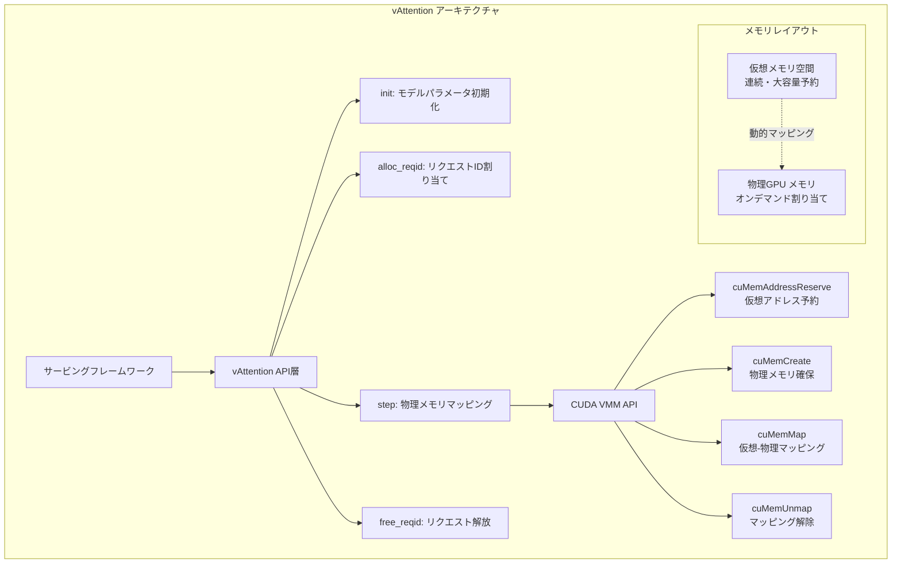

本記事は [vAttention: Dynamic Memory Management for Serving LLMs without PagedAttention](https://arxiv.org/abs/2405.04437) の解説記事です。

## 論文概要

vAttentionは、LLM推論サービングにおけるKVキャッシュのメモリ管理を根本から再設計した手法である。従来のPagedAttentionがKVキャッシュの仮想メモリ上の連続性を犠牲にして物理メモリの断片化に対処していたのに対し、vAttentionはCUDA Virtual Memory Management（VMM）APIを活用して仮想メモリの連続性を保ったまま物理メモリの動的割り当てを実現する。この設計により、既存のAttentionカーネル（FlashAttention-2、FlashAttention-3等）をそのまま利用でき、PagedAttention対応カーネルと比較して最大1.23倍のスループット改善を達成している。

## 情報源

- **論文タイトル**: vAttention: Dynamic Memory Management for Serving LLMs without PagedAttention
- **著者**: Ramya Prabhu, Ajay Nayak, Jayashree Mohan, Ramachandran Ramjee, Ashish Panwar（Microsoft Research Lab - India）
- **発表会議**: ASPLOS 2025（第30回 ACM International Conference on Architectural Support for Programming Languages and Operating Systems）
- **arXiv ID**: 2405.04437（2024年5月投稿、2025年3月会議発表）
- **論文URL**: [https://arxiv.org/abs/2405.04437](https://arxiv.org/abs/2405.04437)
- **実装**: [https://github.com/microsoft/vattention](https://github.com/microsoft/vattention)
- **採択率**: ASPLOS 2025全体で19%

## カンファレンス情報

ASPLOS（Architectural Support for Programming Languages and Operating Systems）は、コンピュータアーキテクチャ、プログラミング言語、オペレーティングシステムの3分野が交差する領域を対象としたACMのトップカンファレンスである。2025年はオランダ・ロッテルダムで3月30日から4月3日にかけて開催された。ハードウェアとソフトウェアの境界を跨ぐシステム研究を重視しており、vAttentionのようなGPUメモリ管理とLLMサービングの両方にまたがる研究は、まさにASPLOSの守備範囲と言える。採択率は19%であり、高い競争率を有するカンファレンスとして知られている。

## 技術的詳細

### PagedAttentionの課題

vLLMが導入したPagedAttentionは、LLM推論におけるKVキャッシュのメモリ管理において大きな前進をもたらした。しかし、著者らはPagedAttentionに以下の構造的な課題があると指摘している。

**1. カスタムカーネルの必要性**: PagedAttentionはKVキャッシュを仮想メモリ上で非連続なブロックに分割して管理する。そのため、標準的なAttentionカーネル（FlashAttentionなど）はそのままでは使えず、非連続メモリレイアウトに対応したPagedAttention専用カーネルの実装が必要になる。論文によれば、vLLMのPagedAttentionカーネルはFlashAttention-2と比較して最大2.8倍遅い場合があると報告されている。

**2. Block Tableのオーバーヘッド**: PagedAttentionでは、各リクエストのKVキャッシュがどの物理ブロックにマッピングされているかを管理するBlock Tableを維持する必要がある。このテーブルの作成・更新にはCPUオーバーヘッドが生じ、さらにGPUカーネル内でBlock Tableを参照するための追加の間接参照が発生する。

**3. ブロックサイズへの感度**: vLLMのPagedAttentionカーネルの性能はブロックサイズの選択に敏感であり、最大1.9倍のレイテンシ変動が生じることが報告されている。

**4. 新規カーネルへの移植コスト**: FlashAttention-3のような新しいAttentionカーネルがリリースされた際、PagedAttention対応版が別途実装されるまで、動的メモリ管理との組み合わせが不可能になる。実際、FlashAttention-3のリリース時点ではPagedAttention版は存在しなかったと著者らは述べている。

### vAttentionのアーキテクチャ

vAttentionの核心的なアイデアは、「仮想メモリの連続性は維持しつつ、物理メモリの割り当てだけを動的に行う」という点にある。これはOSの仮想メモリ管理と同じ発想をGPUメモリに適用したものである。



#### CUDA VMM APIの活用

vAttentionは以下のCUDA VMM APIを活用する（論文Table 3より）。

| CUDA標準API | vAttention拡張API | 機能 |
|---|---|---|
| `cuMemAddressReserve` | `vMemReserve` | 仮想アドレス空間の予約 |
| `cuMemCreate` | `vMemCreate` | 物理メモリハンドルの作成 |
| `cuMemMap` + `cuMemSetAccess` | `vMemMap` | 仮想-物理マッピング＋アクセス設定 |
| `cuMemUnmap` | - | マッピング解除 |
| `cuMemRelease` | `vMemRelease` | 物理ページ解放 |
| `cuMemAddressFree` | `vMemFree` | 仮想バッファ解放 |

CUDA標準のVMM APIは2MBページのみをサポートするが、vAttentionはNVIDIAのオープンソース統合メモリドライバを修正し、64KB・128KB・256KBの小さなページサイズもサポートする拡張APIを実装している。

#### 仮想/物理メモリの分離設計

初期化時に、vAttentionはKVキャッシュ用の仮想メモリを大きく予約する。各リクエストのKVキャッシュのサイズ $$S$$ は以下で計算される。

$$
S = L \times H \times D \times P
$$

ここで、$$L$$ は最大コンテキスト長、$$H$$ はワーカーあたりのKVヘッド数、$$D$$ は各KVヘッドの次元数、$$P$$ はモデル精度に基づくバイト数である。

バッチ全体のKVキャッシュには $$2 \times N$$ 個の仮想テンソルが必要となる（$$N$$ はワーカーあたりのレイヤー数、K用とV用で2倍）。各テンソルのサイズは $$B \times S$$（$$B$$ はバッチサイズ）である。

例えば、Yi-34BモデルをTensor Parallelism 2で運用する場合、500バッチ構成で合計約12TBの仮想メモリを予約する。仮想メモリの予約自体は物理メモリを消費しないため、この大きな予約は問題にならない。

各リクエストには一意の `reqId`（0からB-1）が割り当てられ、レイヤー $$l$$ におけるリクエストのKキャッシュオフセットは次のように計算される。

$$
\text{offset} = \text{reqId} \times S
$$

この設計により、Attentionカーネルから見るとKVキャッシュは通常の連続テンソルとして見え、カーネル側の修正は不要となる。

#### メモリ割り当て・解放のフロー

vAttentionのメモリ管理は4つのAPIを通じて行われる。

**1. `init(N, B, L, H, D, P)`**: モデルパラメータに基づき仮想メモリテンソルを予約する。

**2. `alloc_reqid()`**: 新しいリクエストに未使用の `reqId` を割り当てる。

**3. `step()`**: 各イテレーション前に呼び出され、全アクティブリクエストの現在のコンテキスト長に基づき、必要な物理メモリページを仮想アドレスにマッピングする。

**4. `free_reqid()`**: リクエスト完了時に `reqId` を解放する。物理メモリの回収は即座に行わず遅延させることが可能である。

### レイテンシ隠蔽の工夫

著者らは、LLM推論の特性を利用した2つのレイテンシ隠蔽手法を提案している。

**デコードフェーズでのオーバーラップ**: 自己回帰デコードでは、各イテレーションで1トークン分のKVキャッシュが増加するため、次のイテレーションで必要なメモリ量は予測可能である。vAttentionはイテレーション $$i-1$$ の計算中にバックグラウンドスレッドを起動し、イテレーション $$i$$ に必要な物理メモリのマッピングを事前に完了する。デコードの1イテレーションは10-100msかかるため、この時間内にマッピングを完了させることは容易である。論文Table 9によれば、64KBページでもGPUあたり毎秒7.6GBの物理メモリを割り当て可能であり、デコードの最大メモリ割り当て速度（毎秒750MB）を大幅に上回っている。

**遅延回収＋先行割り当て（プリフィルフェーズ）**: リクエストR1が完了しR2が到着した場合、R1の物理メモリマッピングをそのままR2に転用する（`reqId` の再割り当て）ことで、割り当てオーバーヘッドを排除する。さらに、プリフィルフェーズでは少数のページグループを事前に割り当てることで、初期のメモリ確保遅延を軽減している。

### メモリ断片化の軽減

CUDA標準VMM APIの最小ページサイズは2MBであるが、これではKVキャッシュの粒度としては大きすぎる場合がある。論文Table 8によれば、各モデルのページグループあたりのトークン数は以下の通りである。

| モデル | TP構成 | 64KBページ | 2MBページ |
|---|---|---|---|
| Yi-6B | TP-1 | 64トークン | 2048トークン |
| Llama-3-8B | TP-1 | 32トークン | 1024トークン |
| Yi-34B | TP-2 | 64トークン | 2048トークン |

64KBページを使用することで、vLLMが推奨する16-32トークンのブロックサイズに近い粒度でのメモリ管理が可能となる。ドライバ修正なしの代替案として、1つのリクエストの全レイヤーのKVキャッシュを1つの2MBページにまとめる「テンソルスライシング」手法も提案されており、18-128トークンの実効ブロックサイズを実現できると報告されている。

## 実装のポイント

vAttentionはPythonライブラリとして実装されており、内部でCUDA/C++拡張を用いてCUDAドライバとやり取りする。著者らによれば、サービングフレームワーク側の修正は最小限で済み、上述の4つのAPI（`init`、`alloc_reqid`、`step`、`free_reqid`）を適切なタイミングで呼び出すだけでよい。

実装の重要なポイントは以下の通りである。

1. **カーネル非依存性**: vAttentionは既存のAttentionカーネルを一切修正せずに動的メモリ管理を提供する。FlashAttention-2、FlashAttention-3、FlashInferなど、連続メモリレイアウトを前提とする標準カーネルをそのまま利用できる。

2. **NVIDIAドライバ拡張**: 64KBページサポートのためにNVIDIAのオープンソース統合メモリドライバを修正している。ドライバ修正は性能を向上させるが、必須ではなく、テンソルスライシングによる代替手法も提供されている。

3. **GitHub公開**: MicrosoftがGitHub上で実装を公開しており（[microsoft/vattention](https://github.com/microsoft/vattention)）、vLLMベースのサービングフレームワークとの統合例が含まれている。

## Production Deployment Guide

vAttentionの設計原理をオンプレミスやクラウド環境のLLM推論基盤に適用する際の実践的なガイドラインを示す。

### GPU VRAMサイジングの計算

LLM推論基盤を設計する際、KVキャッシュが消費するVRAMを正確に見積もることが重要である。1リクエストあたりのKVキャッシュメモリ要件は以下の式で計算できる。

$$
M_{KV} = 2 \times n_{\text{layers}} \times d_{\text{head}} \times n_{\text{heads}} \times \text{seq\_len} \times \text{sizeof}(\text{dtype})
$$

例として、Llama-3-8Bモデル（32レイヤー、8KVヘッド、ヘッド次元128、FP16精度）でコンテキスト長8192トークンの場合を計算する。

$$
M_{KV} = 2 \times 32 \times 128 \times 8 \times 8192 \times 2 = 1,073,741,824 \text{ bytes} \approx 1\text{GB}
$$

つまり1リクエストで約1GBのKVキャッシュが必要となる。A100 80GBでモデルウェイトに約16GB使用する場合、残りの64GBで同時に処理できるリクエスト数は理論上64程度となる。vAttentionの動的メモリ管理を用いることで、短いリクエストが早期に完了した際のメモリ即時再利用が可能となり、実効的な同時処理数を向上させられる。

### AWS/クラウド環境でのデプロイパターン

#### インスタンス選定

| ユースケース | 推奨インスタンス | GPU | VRAM | 備考 |
|---|---|---|---|---|
| 7-8Bモデル（単一GPU） | `g5.xlarge` | A10G x1 | 24GB | コスト効率重視 |
| 7-8Bモデル（高スループット） | `p4d.24xlarge` | A100 x8 | 640GB | 大バッチ処理 |
| 30B以上のモデル | `p4d.24xlarge` | A100 x8 | 640GB | TP-2以上が必要 |
| 長コンテキスト（64K以上） | `p5.48xlarge` | H100 x8 | 640GB | FlashAttention-3活用 |

vAttentionの論文ではA100（80GB）およびH100での評価が行われている。長コンテキストワークロードではKVキャッシュのメモリ消費が急増するため、大容量VRAMのインスタンスが不可欠である。

#### メモリ管理戦略の実装

```python
# vAttention式のメモリ管理を意識した設計例
# 実際のvAttention APIの利用イメージ

class LLMServingConfig:
    """vAttentionの設計原理に基づくサービング設定"""
    
    def __init__(
        self,
        model_name: str,
        max_batch_size: int,
        max_seq_len: int,
        num_layers: int,
        num_kv_heads: int,
        head_dim: int,
        dtype_bytes: int = 2,  # FP16
    ) -> None:
        self.model_name = model_name
        self.max_batch_size = max_batch_size
        self.max_seq_len = max_seq_len
        self.num_layers = num_layers
        self.num_kv_heads = num_kv_heads
        self.head_dim = head_dim
        self.dtype_bytes = dtype_bytes

    def kv_cache_per_request_bytes(self, seq_len: int) -> int:
        """1リクエストあたりのKVキャッシュサイズを計算する。"""
        return (
            2  # K and V
            * self.num_layers
            * self.num_kv_heads
            * self.head_dim
            * seq_len
            * self.dtype_bytes
        )

    def max_concurrent_requests(
        self, total_vram_bytes: int, model_weight_bytes: int
    ) -> int:
        """同時処理可能なリクエスト数の上限を見積もる。"""
        available = total_vram_bytes - model_weight_bytes
        per_request = self.kv_cache_per_request_bytes(self.max_seq_len)
        return available // per_request
```

#### Docker Composeでの構成例

Ollamaを用いたオンプレLLM推論基盤にvAttentionの設計原理を適用する場合、以下の観点が重要となる。

1. **GPUメモリの予約と制限**: `docker compose` の `deploy.resources.reservations` でGPUを適切に割り当てる。vAttentionが示した「仮想メモリは大きく予約し、物理メモリはオンデマンドで割り当てる」というパターンは、コンテナレベルではGPUメモリの上限設定（`CUDA_VISIBLE_DEVICES` や `nvidia-smi` によるメモリ制限）で間接的に実現できる。

2. **バッチサイズの動的調整**: vAttentionの知見として、デコードフェーズの最大メモリ割り当て速度は毎秒750MB程度である。この値に基づき、バッチサイズの上限を設定することで、メモリ不足によるOOMを防止しつつスループットを確保できる。

3. **モニタリング**: Prometheus + Grafanaによるメモリ使用量の監視が不可欠である。特にKVキャッシュの占有率、物理メモリの断片化率、リクエストあたりのメモリ割り当て/解放頻度を追跡することで、メモリ効率の問題を早期に検出できる。

#### オートスケーリング設計

vAttentionの知見を活かしたオートスケーリング戦略として、以下の指標に基づくスケーリングが考えられる。

- **KVキャッシュ使用率**: 物理メモリの使用率が80%を超えた場合にスケールアウト
- **リクエストキュー長**: 待機リクエスト数がバッチサイズの2倍を超えた場合
- **平均デコードレイテンシ**: P95レイテンシが閾値を超えた場合

### Ollama環境への示唆

Ollamaは現時点でPagedAttentionやvAttentionを直接サポートしていないが、vAttentionの設計思想は以下の点で参考になる。

1. **VRAM使用量の予測**: 上記の計算式を用いて、運用するモデルとバッチサイズに対するVRAM要件を事前に見積もることで、適切なGPU選定とコンテナ設定が可能となる。

2. **複数モデルの同時運用**: Ollamaで複数モデルを同時にロードする場合、各モデルのKVキャッシュ要件を合算してVRAMの余裕を確認する必要がある。vAttentionの動的割り当て思想を参考に、使用していないモデルのKVキャッシュを積極的に解放する運用が望ましい。

3. **長コンテキスト運用の注意点**: コンテキスト長が長くなるとKVキャッシュのメモリ消費が線形に増加するため、vAttentionの論文で評価された64K-192Kコンテキストのワークロードでは、A100 80GB以上のGPUが事実上必須となる。

## 実験結果

著者らは、Yi-6B、Llama-3-8B、Yi-34Bの3モデルを用いて、A100（80GB）およびH100 GPU上で評価を行っている。

**プリフィル性能**（論文の実験結果より）: 192Kコンテキストの長文入力において、FlashAttention-2のvAttention版（FA2_vAttention）はPagedAttention版（FA2_Paged）と比較して、Yi-6Bで1.24倍、Llama-3-8Bで1.26倍、Yi-34Bで1.24倍の高速化を達成している。さらに、vLLMのPagedAttentionカーネルと比較すると、プリフィルで最大3.92倍、FlashInferのPagedAttention版と比較して1.45倍の高速化が報告されている。

**エンドツーエンドのオフラインスループット**（arXiv要約タスク、64K-192Kコンテキスト）: FA2_vAttentionはFA2_Pagedと比較して1.13-1.18倍、FlashInferのPagedAttention版（FI_Paged）と比較して1.14-1.23倍のスループット改善を示している。

**オンラインレイテンシ**（arXiv要約タスク、22K-45Kコンテキスト）: 中央値レイテンシの削減はYi-6Bで最大42%、Llama-3-8Bで28%、Yi-34Bで29%と報告されている。

**デコードスループット**: FA2_vAttentionのデコード性能はFA2_Pagedと同等であり、vLLMと比較してYi-6Bで最大1.99倍、Llama-3-8Bで1.58倍、Yi-34Bで1.53倍の高速化を達成している。

**FlashAttention-3との互換性**（H100 GPU）: FlashAttention-3にはリリース時点でPagedAttention版が存在しなかったが、vAttentionを用いることでコード変更なしにFA3での動的メモリ管理が可能となり、FA2_vAttention比で最大1.35倍の更なる高速化が得られたと報告されている。

## 実運用への応用

本論文の知見は、Ollamaを用いたオンプレLLM推論基盤の設計・運用に複数の示唆を与える。

**VRAM管理の定量化**: vAttentionが示したKVキャッシュのメモリ計算式を活用することで、OllamaのモデルロードやDocker Composeでのリソース制限を定量的に設定できる。特にGPUメモリの80%以上をモデルウェイトとKVキャッシュで消費する場合、OOMリスクが高まるため、モニタリングの閾値設計に役立つ。

**将来のOllama/vLLM統合への展望**: vAttentionはvLLMベースで実装されており、MicrosoftがGitHubで公開している。vLLMやOllamaのバックエンドにvAttentionが統合されれば、オンプレ環境でも既存のFlashAttentionカーネルを活かした高効率なメモリ管理が利用可能になる可能性がある。

**長コンテキストワークロードでの恩恵**: RAG検索結果の全文参照やドキュメント要約など、長いコンテキストを必要とするユースケースでは、vAttentionのプリフィル性能改善（最大1.26倍）が実運用上の意義を持つ。Docker Composeで構築したOllama基盤において、長コンテキストリクエストの処理時間短縮に寄与する可能性がある。

## まとめ

vAttentionは、LLM推論サービングにおけるKVキャッシュのメモリ管理をOS仮想メモリの設計原理に立ち返って再考した研究である。CUDA VMM APIを活用して仮想メモリの連続性を維持しつつ物理メモリを動的に管理するアプローチにより、PagedAttentionが抱えるカスタムカーネル依存やBlock Tableオーバーヘッドを解消し、既存のAttentionカーネルとの互換性を保ちながら最大1.23倍のスループット改善を達成している。オンプレLLM推論基盤を構築・運用する際の、GPUメモリ設計の指針として有用な知見を提供する論文である。

## 参考文献

1. Prabhu, R., Nayak, A., Mohan, J., Ramjee, R., & Panwar, A. (2025). vAttention: Dynamic Memory Management for Serving LLMs without PagedAttention. *Proceedings of the 30th ACM International Conference on Architectural Support for Programming Languages and Operating Systems (ASPLOS 2025)*. [https://arxiv.org/abs/2405.04437](https://arxiv.org/abs/2405.04437)
2. Kwon, W., et al. (2023). Efficient Memory Management for Large Language Model Serving with PagedAttention. *Proceedings of the 29th Symposium on Operating Systems Principles (SOSP 2023)*.
3. Dao, T., et al. (2022). FlashAttention: Fast and Memory-Efficient Exact Attention with IO-Awareness. *NeurIPS 2022*.
4. Dao, T. (2024). FlashAttention-2: Faster Attention with Better Parallelism and Work Partitioning. *ICLR 2024*.
5. Shah, J., et al. (2024). FlashAttention-3: Fast and Accurate Attention with Asynchrony and Low-precision. *arXiv preprint arXiv:2407.08691*.
