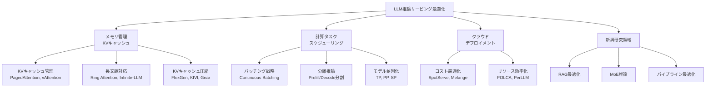

本記事は [LLM Inference Serving: Survey of Recent Advances and Opportunities](https://arxiv.org/abs/2407.12391) の解説記事です。

## 論文概要（Abstract）

本サーベイは、2023年1月から2024年6月にかけて発表されたLLM推論サービングシステムの研究を体系的に整理したものである。著者らは、LLMのコアデコーディング機構を変更せずにパフォーマンスと効率を改善するシステムレベルの最適化に焦点を当てている。ASPLOS、MLSys、OSDI、NeurIPSなどのトップカンファレンスから採録された研究を中心に、メモリ管理、バッチング戦略、スケジューリング、分散推論、クラウドデプロイメントなど多岐にわたる最適化手法を4つの主要カテゴリに分類し、実運用システムの設計判断に直結する知見を提供している。

この記事は [Zenn記事: Ollama v0.31×Docker Composeで構築するオンプレLLM推論基盤](https://zenn.dev/0h_n0/articles/8d8fa50144141d) の深掘りです。

## 情報源

- **arXiv ID**: 2407.12391
- **URL**: [https://arxiv.org/abs/2407.12391](https://arxiv.org/abs/2407.12391)
- **著者**: Baolin Li, Yankai Jiang, Vijay Gadepally, Devesh Tiwari
- **発表年**: 2024年7月
- **分野**: cs.DC（分散・並列・クラスタコンピューティング）, cs.AI（人工知能）

## 背景と動機（Background & Motivation）

LLM推論は、その自己回帰的（autoregressive）な生成特性により、従来のDNN推論とは根本的に異なるシステム設計上の課題を抱えている。著者らは、LLM推論が**prefillフェーズ**と**decodeフェーズ**という計算特性の大きく異なる2つの段階で構成される点を出発点としている。

prefillフェーズでは入力プロンプト$P = [p_1, p_2, \ldots, p_n]$を並列に処理しKVキャッシュ$[(k_1, v_1), (k_2, v_2), \ldots, (k_n, v_n)]$を構築する。この段階は行列積演算が支配的であり、GPU演算性能（FLOPS）がボトルネックとなるcompute-boundな処理である。一方、decodeフェーズではトークンを1つずつ逐次生成し、各ステップでKVキャッシュ全体の読み出しが必要となるため、メモリ帯域幅がボトルネックとなるmemory-bandwidth-boundな処理となる。

この二相性こそが、LLMサービングシステムの設計を困難にしている根本原因であると著者らは分析している。たとえばprefillとdecodeが同一GPU上で混在実行される場合、リソース競合によるパフォーマンス劣化が避けられない。さらに、リクエストごとに入出力長が大きく異なるため、バッチサイズの最適化やメモリ割り当てが静的な手法では対応しきれないという課題がある。

著者らは、2023年以降の研究が急速に蓄積されているにもかかわらず、系統的な整理が不足しているとの問題意識からこのサーベイを執筆したと述べている。

## 主要な貢献（Key Contributions）

- **貢献1**: LLM推論サービングの最適化手法を**メモリ管理**、**計算タスクスケジューリング**、**クラウドデプロイメント**、**新興研究領域**の4カテゴリに体系化した分類体系（taxonomy）の提示
- **貢献2**: 各カテゴリにおける代表的システム（vLLM、TensorRT-LLM、Orca、DeepSpeed-FastGenなど）の設計判断と性能トレードオフの横断的比較
- **貢献3**: 2023年1月〜2024年6月のトップカンファレンス採録論文を中心とした網羅的な文献整理と、実務者（practitioner）向けのデプロイメントガイダンスの提供

## 技術的詳細（Technical Details）

### サーベイの分類体系

著者らはLLM推論サービングの最適化を以下の4カテゴリに大別している。



### Prefill vs Decodeの計算特性

LLM推論の根幹を理解するためには、2つのフェーズの計算特性の違いを定量的に把握する必要がある。

**Prefillフェーズ**では、入力プロンプト全体に対してMulti-Head Attention（MHA）とFeed-Forward Network（FFN）を並列計算する。

$$
\text{Attention}(Q, K, V) = \text{softmax}\left(\frac{QK^T}{\sqrt{d_k}}\right) V
$$

$$
\text{FFN}(x) = \max(0, xW_1 + b_1)W_2 + b_2
$$

ここで$Q, K, V$はそれぞれ入力$X$に重み行列$W^Q, W^K, W^V$を乗じて得られる。prefillフェーズでは$Q$のシーケンス長が入力長$n$であり、$n \times n$サイズのAttention行列を一括計算するため、計算量は$O(n^2 \cdot d)$とスケールする。GPU FLOPSが十分であればスループット向上が期待でき、演算律速（compute-bound）な処理と位置づけられる。

**Decodeフェーズ**では、各ステップで1トークンずつ逐次生成する。自己回帰的に生成トークン$p_{n+i}$を予測し、新たなKVペア$(k_{n+i}, v_{n+i})$をキャッシュに追加する。各ステップの計算量は$O((n+i) \cdot d)$と入力長に比例するが、実質的にはKVキャッシュの読み出し（メモリアクセス）がボトルネックとなる。GPU演算器は処理待ちの時間が多く、メモリ帯域幅律速（memory-bandwidth-bound）な処理となる。

この演算特性の非対称性を**ルーフラインモデル**で理解すると、prefillはルーフラインの演算律速領域（高い演算強度）に、decodeはメモリ帯域律速領域（低い演算強度）に位置する。この差異が、後述する分離推論（disaggregated inference）の設計動機となっている。

### バッチング戦略

#### 静的バッチング（Static Batching）

従来のDNN推論で用いられる手法であり、あらかじめ決められたバッチサイズで複数リクエストをまとめて処理する。しかしLLM推論では各リクエストの出力長が大きく異なるため、短い応答が完了しても長い応答の完了を待つ必要があり、GPU利用率が低下する。

#### 連続バッチング（Continuous Batching）

Orcaによって提案された手法であり、サーベイでは現在のLLM推論サービングにおける事実上の標準手法として位置づけられている。連続バッチングでは、バッチ内のリクエストが完了した時点で即座に新規リクエストを投入する。トークンレベルでのスケジューリングにより、リクエストの入れ替えをイテレーション単位で実施できる。vLLM、TGI（Text Generation Inference）、TensorRT-LLMなど主要なサービングフレームワークがこの方式を採用している。

#### 長さ認識バッチング（Length-Aware Batching）

連続バッチングをさらに改良する手法として、著者らは応答長予測に基づくスケジューリング手法を紹介している。**S³**ではDistilBERTを微調整して応答長を予測し、類似長のリクエストをグルーピングする。予測を超過したリクエストにはプリエンプション（中断・再開）を適用し、バッチ全体の効率を維持する。

#### SplitFuseとStall-Free Batching

**DeepSpeed-FastGen**のSplitFuse手法は、長いプロンプトを複数チャンクに分割し、短いプロンプトと結合してバッチに投入する。これにより、prefillの計算をデコードのイテレーションに分散させ、GPUが常に「高スループット領域」（メモリ帯域幅律速ではなく演算律速な領域）で動作するように調整する。

**Sarathi-Serve**のStall-Free Batchingは、prefillをチャンク分割してデコード処理と同一バッチ内で実行する手法であり、新規リクエスト到着時のdecodeリクエスト停止（stall）を回避する。

### メモリ管理（KVキャッシュ最適化）

LLM推論においてKVキャッシュはメモリ消費の主要因であり、そのサイズはバッチサイズ$B$、コンテキスト長$L$、隠れ層次元$d$、レイヤ数$N_L$、ヘッド数$N_H$に依存する。

$$
\text{KVキャッシュサイズ} = 2 \times B \times L \times d \times N_L \times \text{sizeof(dtype)}
$$

ここで係数2はKeyとValueの両方を保持するためである。たとえばLlama-2 70Bモデルで$B = 32$, $L = 4096$の場合、KVキャッシュだけで数十GBに達しうる。

#### PagedAttention

vLLMで提案されたPagedAttentionは、OSの仮想メモリ管理に着想を得た手法である。従来のKVキャッシュ管理では、各リクエストに対して最大シーケンス長分の連続メモリを事前確保していたため、実際の使用量より遥かに多いメモリが無駄になっていた。PagedAttentionでは、KVキャッシュを固定サイズの「ページ」に分割し、非連続なメモリブロックとして管理する。これにより内部断片化を大幅に削減し、同一GPUメモリ上でより多くのリクエストを同時処理できる。サーベイでは、vLLM、TGI、TensorRT-LLMがこの方式を採用しており、事実上の業界標準となっていると述べられている。

#### vAttention

PagedAttentionの代替としてvAttentionが紹介されている。vAttentionはOSのデマンドページング機構を活用し、仮想的には連続メモリとして管理しつつ、物理メモリの割り当てはオンデマンドで行う。Attentionカーネルの書き換えが不要であり、ソフトウェア実装の複雑性を低減できる利点がある。

#### KVキャッシュ圧縮

サーベイでは複数のKVキャッシュ圧縮手法が紹介されている。

- **FlexGen**: 重みとKVキャッシュの双方をグループ単位で4ビット量子化する手法
- **KIVI**: Keyに対してはチャネル単位（per-channel）、Valueに対してはトークン単位（per-token）の非対称量子化を適用する手法
- **Gear**: 重要度に基づく量子化と低ランク誤差近似を組み合わせたニアロスレス圧縮手法
- **MiniCache**: LLMの中間〜深層レイヤにおけるレイヤ間のKV状態の類似性を活用し、冗長な状態をマージする手法

### スケジューリングとリソース管理

#### リクエストスケジューリングとプリエンプション

連続バッチングの環境下では、トークンレベルのスケジューリングにより細粒度のリソース共有が可能になる。しかし、メモリ不足時にはリクエストのプリエンプション（中断）が必要となる。vLLMでは、優先度の低いリクエストのKVキャッシュをCPUメモリへスワップアウトし、メモリを確保する戦略を採用している。

#### 優先度ベーススケジューリング（Andes）

**Andes**は、ユーザ体感品質（QoE: Quality of Experience）に基づく優先度スケジューリングを提案している。QoEメトリクスは**トークンデリバリタイムライン（TDT）**に基づき定義される。

$$
\text{TDT} = \text{TTFT} + \frac{\text{生成トークン数}}{\text{TDS}}
$$

ここで$\text{TTFT}$はTime-to-First-Token、$\text{TDS}$はToken Delivery Speed（1秒あたりの出力トークン数）である。Andesは期待TDTからの逸脱が大きいリクエストに高い優先度を動的に割り当て、プリエンプションにより緊急度の高いリクエストを優先処理する。スループットを犠牲にせず平均QoEを改善できると報告されている。

### 分離推論（Disaggregated Inference）

prefillとdecodeの計算特性が大きく異なることから、これらを異なるハードウェア上で分離実行する**分離推論**が有望なアプローチとして複数のシステムで提案されている。

- **TetriInfer**: prefillインスタンスとdecodeインスタンスを分離し、予測リソース使用量に基づく2段階スケジューリングを採用。各フェーズに最適化されたバッチサイズと並列度を独立に調整可能とする。
- **Splitwise**: 異種ハードウェア（例：演算性能重視のGPUにprefill、メモリ帯域幅重視のGPUにdecodeを割り当て）を活用する設計。帯域幅が限定された環境ではprefillとdecodeを同一ノードに共配置する戦略も提示している。
- **DistServe**: prefillとdecodeの並列度（テンソル並列、パイプライン並列）を独立に最適化する配置アルゴリズムを提案。高帯域幅クラスタでは物理的分離、帯域幅制限環境では共配置を選択する判断基準を提供している。

### モデル並列化と分散推論

サーベイでは、テンソル並列（TP）、パイプライン並列（PP）、シーケンス並列（SP）の3つの並列化手法が紹介されている。

- **テンソル並列（TP）**: 単一レイヤの重み行列を複数GPUに分割。レイテンシ削減に有効だがGPU間通信オーバーヘッドが発生する。
- **パイプライン並列（PP）**: レイヤ群をステージとして異なるGPUに配置。通信量は少ないがパイプラインバブルの管理が必要。
- **シーケンス並列（SP）**: シーケンス次元で分割し複数GPUに分配。Ring Attentionがこの手法の代表例であり、コンテキスト長をデバイス数に比例して拡張可能。

**Helix**は異種GPU環境（性能・メモリ容量が異なるGPU混在）における最適配置を最大フロー問題として定式化し、GPU間ネットワーク帯域の異質性も考慮した並列化戦略を提案している。

## 実装のポイント（Implementation Highlights）

サーベイの知見から導かれる実装上の重要判断を以下にまとめる。

1. **バッチング方式の選択**: 連続バッチング（continuous batching）は事実上の必須要件。Ollama等のローカル推論でも、同時リクエスト処理時にはこの方式の恩恵が大きい。
2. **KVキャッシュ管理**: PagedAttentionによるメモリ効率化は、同一GPU上での最大同時処理リクエスト数を直接的に増加させる。vLLMベースのバックエンドを採用する際は、ブロックサイズの調整が性能チューニングの起点となる。
3. **量子化とKVキャッシュ圧縮**: メモリ制約が厳しい環境（例：24GBのコンシューマGPU）では、KIVI等の非対称量子化により、モデル品質を大きく損なわずにKVキャッシュの消費メモリを半減できる可能性がある。
4. **プリエンプション戦略**: マルチユーザ環境では、メモリ不足時のリクエスト中断・再開（swap/recomputation）の戦略設計が安定運用の鍵となる。

## Production Deployment Guide

Ollamaを含むLLM推論基盤をDocker Compose上でオンプレミス運用する際、本サーベイの知見は以下の設計判断に直結する。

### GPU メモリの使い切り戦略

サーベイで繰り返し強調されているのは、KVキャッシュがGPUメモリの最大の消費者であるという点である。推論時のGPUメモリ使用量は以下のように分解される。

$$
\text{GPU Memory} = \text{Model Weights} + \text{KV Cache} + \text{Activations}
$$

モデル重みは固定、Activationsは相対的に小さいため、実質的にKVキャッシュのサイズがバッチサイズ（同時処理可能リクエスト数）を決定する。Docker Compose環境でOllamaを運用する場合、`OLLAMA_NUM_PARALLEL`パラメータ（同時処理リクエスト数）の上限は、利用可能GPUメモリからモデル重みとActivationsを差し引いた残容量で決まる。

```yaml
# docker-compose.yml での GPU メモリ制約設定例
services:
  ollama:
    image: ollama/ollama:latest
    deploy:
      resources:
        reservations:
          devices:
            - driver: nvidia
              count: 1
              capabilities: [gpu]
    environment:
      - OLLAMA_NUM_PARALLEL=4       # KVキャッシュ容量に応じて調整
      - OLLAMA_MAX_LOADED_MODELS=2  # 複数モデルロード時のメモリ分割
```

### スループット vs レイテンシのトレードオフ

サーベイの分類体系に基づくと、オンプレミスLLM推論基盤のチューニングは以下の軸で整理できる。

**レイテンシ優先（対話型ユースケース）**:
- `OLLAMA_NUM_PARALLEL`を低めに設定し、リクエストあたりのGPUリソース占有率を上げる
- prefillフェーズのTTFT（Time-to-First-Token）を最小化するため、テンソル並列（複数GPU分割）を検討する
- サーベイで紹介されたAndesのQoEメトリクスの考え方を参考に、TTFTとTDS（Token Delivery Speed）の両方を監視指標とする

**スループット優先（バッチ処理ユースケース）**:
- 連続バッチングの効果を最大化するため、`OLLAMA_NUM_PARALLEL`を可能な限り引き上げる
- DeepSpeed-FastGenのSplitFuse手法が示すように、prefillチャンクを分割してdecodeと混在実行させることで、GPU演算器の稼働率を高く維持する

### マルチGPU・マルチノード構成

サーベイで紹介された分離推論（disaggregated inference）の知見は、Docker Composeでのマルチコンテナ構成設計に応用できる。

```yaml
# 分離推論の概念を応用したマルチコンテナ構成
services:
  # prefill重視: 演算性能の高いGPU
  ollama-prefill:
    image: ollama/ollama:latest
    deploy:
      resources:
        reservations:
          devices:
            - driver: nvidia
              device_ids: ['0']  # 高FLOPS GPU
              capabilities: [gpu]
    environment:
      - OLLAMA_NUM_PARALLEL=2

  # decode重視: メモリ帯域幅の広いGPU
  ollama-decode:
    image: ollama/ollama:latest
    deploy:
      resources:
        reservations:
          devices:
            - driver: nvidia
              device_ids: ['1']  # 高帯域幅 GPU
              capabilities: [gpu]
    environment:
      - OLLAMA_NUM_PARALLEL=8

  # ロードバランサー
  nginx:
    image: nginx:alpine
    ports:
      - "11434:11434"
    depends_on:
      - ollama-prefill
      - ollama-decode
```

なお、Ollama自体は現時点ではprefill/decode分離を直接サポートしていないため、上記はリクエスト特性（プロンプト長 vs 生成長）に基づくルーティングの概念的な構成例である。vLLMやTensorRT-LLMなどのフレームワークではDisaggregated Servingのネイティブサポートが進んでいる。

### 監視指標の設計

サーベイの知見を基にした推論基盤の監視指標体系を以下に示す。

| 指標 | 意味 | サーベイでの位置づけ |
|------|------|----------------------|
| TTFT（Time-to-First-Token） | 最初のトークン出力までの時間 | prefillフェーズの性能指標 |
| TDS（Token Delivery Speed） | 1秒あたりの出力トークン数 | decodeフェーズの性能指標 |
| KVキャッシュ利用率 | GPU VRAM中のKVキャッシュ占有率 | メモリ管理の効率指標 |
| バッチ稼働率 | 実行中バッチの平均充填率 | バッチング戦略の効果指標 |
| プリエンプション頻度 | メモリ不足による中断・再開回数 | スケジューリング安定性の指標 |
| QoE（Quality of Experience） | ユーザ体感品質（Andes指標） | 総合的なサービス品質 |

Docker Compose環境では、Prometheus + Grafanaによる監視パイプラインでこれらの指標を収集し、KVキャッシュ利用率が90%を超えた場合のアラート設定、TTFTの急激な増加を検知した場合の同時処理数自動調整などを検討すべきである。

### KVキャッシュ最適化の実践

サーベイで紹介されたPagedAttention等の知見を、オンプレミス環境に適用する際の判断基準を整理する。

**24GB GPU（RTX 4090等）でLlama-3 8Bを運用する場合の概算**:
- モデル重み（FP16）: 約16GB
- 残りGPUメモリ: 約8GB
- KVキャッシュ1リクエスト分（コンテキスト4096トークン）: 約1GB（レイヤ数・ヘッド数依存）
- 同時処理可能リクエスト数の上限: 約6〜8件

KVキャッシュ圧縮（4ビット量子化）を適用すると、同一メモリ容量で同時処理数をおよそ2倍に引き上げられる可能性がある。ただし、量子化による品質劣化の許容範囲はタスク依存であり、事前に出力品質の評価が必要である。

## 実験結果（Survey Findings）

本サーベイは新規実験を行うものではなく、既存研究の横断的な分析を行っている。著者らの整理によると、以下の知見が導出されている。

連続バッチングの採用は、静的バッチングに比べてスループットを数倍に改善する効果があり、現在の主要サービングフレームワーク（vLLM、TGI、TensorRT-LLM）がすべてこの方式を実装していることが確認されている。PagedAttentionの導入により、メモリ効率が大幅に改善され（従来方式で60〜80%発生していた内部断片化の解消）、同一ハードウェアでの最大バッチサイズが向上するとされている。

分離推論については、DistServeやSplitwise等のシステムがprefillとdecodeの分離により、統合型サービングと比較してTTFTとTDSの双方を改善できることを示している。ただし、分離推論には追加のネットワーク帯域幅とKVキャッシュ転送のオーバーヘッドが発生するため、クラスタのネットワークトポロジに応じた設計判断が求められると著者らは分析している。

## 実運用への応用（Connection to Ollama Docker Compose）

本サーベイの知見は、Ollama × Docker ComposeによるオンプレミスLLM推論基盤の設計・運用に以下の形で活用できる。

**バッチング戦略の理解**: Ollamaは内部的に連続バッチング的な手法で同時リクエストを処理しており、`OLLAMA_NUM_PARALLEL`パラメータがバッチサイズ制御に相当する。サーベイの知見を踏まえると、この値の最適化がスループットとレイテンシのトレードオフ管理の起点となる。

**メモリ制約下での設計**: コンシューマGPU上での運用では、KVキャッシュのメモリ制約が最大の律速要因となる。本サーベイで紹介されたKVキャッシュ圧縮手法の知識は、量子化モデル（GGUF Q4_K_M等）の選択判断や、コンテキスト長制限の設計根拠となる。

**スケールアウトの判断基準**: 単一GPU/コンテナの性能限界を超えた場合のスケールアウト方針として、サーベイの分離推論やモデル並列化の知見が、Docker Composeのマルチコンテナ構成やKubernetes移行の設計判断を支える。

## 関連研究（Related Work）

サーベイでは、本論文の対象範囲外としてデコーディングアルゴリズムの改良（Medusa、Lookahead Decoding等の投機的デコーディング手法）、モデル精度を変更するような手法、学習フェーズの最適化を明示的に除外している。また、FrugalGPTやRouteLLMのようなモデル選択・カスケード手法、FlashAttention-3のようなカーネルレベルの最適化も新興研究として紹介されており、これらはシステムレベルの最適化と組み合わせることで更なる効率化が期待される。

## まとめと今後の展望

本サーベイは、LLM推論サービングの最適化を体系的に4カテゴリに分類し、2023年以降のトップカンファレンス研究を網羅的に整理した貴重な参考文献である。著者らは、KVキャッシュ管理（特にPagedAttention）と連続バッチングがすでに業界標準となっている一方、分離推論、異種ハードウェア対応、長コンテキスト最適化は今後さらに発展が期待される領域であると分析している。OllamaをはじめとするLLM推論基盤の設計・運用において、本サーベイの分類体系はシステム選択やチューニング判断のための実践的なフレームワークとして活用できる。

## 参考文献

- Li, B., Jiang, Y., Gadepally, V., & Tiwari, D. (2024). LLM Inference Serving: Survey of Recent Advances and Opportunities. arXiv:2407.12391.
- Kwon, W., et al. (2023). Efficient Memory Management for Large Language Model Serving with PagedAttention. SOSP 2023.
- Yu, G.-I., et al. (2022). Orca: A Distributed Serving System for Transformer-Based Generative Models. OSDI 2022.
- Zhong, Y., et al. (2024). DistServe: Disaggregating Prefill and Decoding for Goodput-optimized Large Language Model Serving. OSDI 2024.
- Patel, P., et al. (2024). Splitwise: Efficient Generative LLM Inference Using Phase Splitting. ISCA 2024.
- Holmes, C., et al. (2024). DeepSpeed-FastGen: High-throughput Text Generation for LLMs via MII and DeepSpeed-Inference. MLSys 2024.
- Agrawal, A., et al. (2024). Sarathi-Serve: CoPipe Chunk-level Pipeline for Efficient LLM Inference. arXiv:2403.02310.
- Liu, Z., et al. (2024). Andes: Online QoE Optimization for LLM Serving. arXiv:2404.16283.
