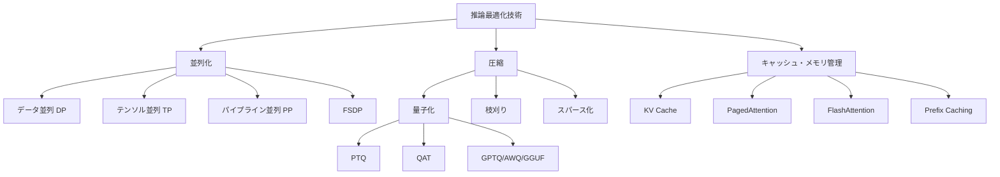

本記事は [A Survey on Inference Engines for Large Language Models: Perspectives on Optimization and Efficiency](https://arxiv.org/abs/2505.01658) の解説記事です。

## 論文概要

本サーベイは、25種のオープンソースおよび商用LLM推論エンジンを、使いやすさ・デプロイ容易性・汎用性・スケーラビリティ・スループット志向・レイテンシ志向の6軸で体系的に評価した論文である。各エンジンが採用する並列化・圧縮・キャッシュの最適化手法を横断的に調査し、ユースケースに応じたエンジン選定の指針を提示している。106ページの包括的分析で、エッジからクラウドまでのLLM推論基盤構築の知識を整理している。

この記事は [Zenn記事: Ollama v0.31×Docker Composeで構築するオンプレLLM推論基盤](https://zenn.dev/0h_n0/articles/8d8fa50144141d) の深掘りです。

## 情報源

- **arXiv ID**: 2505.01658
- **URL**: [https://arxiv.org/abs/2505.01658](https://arxiv.org/abs/2505.01658)
- **著者**: Sihyeong Park, Sungryeol Jeon, Chaelyn Lee et al.
- **発表年**: 2025（v3: 2025年11月）
- **分野**: cs.CL
- **掲載**: ACM Transactions on Intelligent Systems and Technology (TIST), 2026年3月

## 背景と動機

LLMのパラメータ数が数十億から数千億規模に達する中、推論時の計算コストとメモリ消費が実用化の主要なボトルネックとなっている。著者らは、推論エンジンの選択がアプリケーションの性能・コスト・運用性を大きく左右するにもかかわらず、既存の研究では個別エンジンの比較に留まり、最適化手法を横断的に分析した体系的なサーベイが不足していたと指摘している。

オンプレミス環境でのGPUリソース制約下では、バッチ処理戦略、メモリ管理手法、量子化による精度トレードオフなど実運用に直結する技術的判断が求められる。こうした判断を支援する包括的な評価フレームワークの必要性が、本サーベイの動機となっている。

## 主要な貢献

- **貢献1: 6軸評価フレームワークの構築** --- 使いやすさ（Ease-of-Use）、デプロイ容易性（Ease-of-Deployment）、汎用性（General-purpose Support）、スケーラビリティ（Scalability）、スループット志向（Throughput-aware）、レイテンシ志向（Latency-aware）の6次元で25種の推論エンジンを体系的に評価する枠組みを提示している
- **貢献2: 最適化手法の横断的分類** --- 並列化（TP/PP/DP/FSDP）、圧縮（量子化・枝刈り・スパース化）、キャッシュ（PagedAttention・Prefix Caching・FlashAttention）の3カテゴリにわたる最適化技術を整理し、各エンジンの対応状況をマトリクス形式で可視化している
- **貢献3: 実測ベンチマークによる定量評価** --- NVIDIA H100およびJetson Orinを用いた実測実験により、スループット（tokens/s）、初回トークン生成時間（TTFT）、同時接続数ごとのスケーリング特性を定量的に比較している

## 技術的詳細

### 推論エンジンの分類体系

著者らは25種の推論エンジンを以下のように分類している。

**オープンソース（24種）**:

| カテゴリ | エンジン |
|---------|---------|
| コミュニティ主導 | Ollama, llama.cpp, llama2.c, bitnet.cpp, PowerInfer |
| 学術・研究 | vLLM, MLC LLM, SGLang, LightLLM, NanoFlow, DistServe, vAttention, Sarathi-Serve |
| エンタープライズ | DeepSpeed-FastGen, MAX, LMDeploy, TensorRT-LLM, TGI, Unsloth, LitGPT, OpenLLM, Colossal-AI |
| ゲートウェイ | Ferro Labs AI Gateway |

**商用（4種）**: Fireworks AI, Friendli Inference, GroqCloud, Together Inference

さらに、デプロイ形態として単一ノード/マルチノード、同種GPU（Homogeneous）/異種GPU（Heterogeneous）の2x2マトリクスで分類している。

| | 単一ノード | マルチノード |
|---|---|---|
| **異種GPU** | llama.cpp, MAX, MLC LLM, Ollama | DeepSpeed-FastGen, LitGPT, vLLM |
| **同種GPU** | Unsloth, LightLLM, NanoFlow | TensorRT-LLM, GroqCloud |

### 最適化技術の体系

論文では推論最適化を3つの大分類に整理している。



#### 並列化戦略

**テンソル並列（TP）**は、単一レイヤーの重み行列を複数GPUに分割する手法である。Attention層の場合、ヘッド数 $n_h$ を $N$ 台のGPUで分割し、各GPUは $n_h / N$ ヘッドを担当する。

$$
\text{TP通信量} = O(b \times s \times d_{\text{model}})
$$

ここで $b$ はバッチサイズ、$s$ はシーケンス長、$d_{\text{model}}$ はモデル次元数である。All-Reduce通信が各レイヤーで2回発生するため、ノード間ではNVLink等の高速インターコネクトが必要となる。

**パイプライン並列（PP）**は、モデルのレイヤーを複数GPUに分割し、マイクロバッチを順次処理する。レイヤー総数 $L$ を $N$ 台に分割すると、各GPUは $L/N$ レイヤーを担当する。パイプラインバブル（GPUがアイドル状態になる時間）が課題であり、マイクロバッチ数 $m$ を増やすことで緩和できる。

$$
\text{バブル比率} = \frac{N - 1}{m + N - 1}
$$

著者らの調査によると、vLLM、SGLang、TensorRT-LLM、DeepSpeed-FastGenがTP/PPの両方をサポートしており、マルチGPU環境での柔軟な構成が可能である。一方、Ollamaやllama.cppは主に単一GPU（またはCPU）での動作を前提としている。

#### 圧縮技術：量子化

量子化は、FP32/FP16の重みをINT8/INT4等の低ビット表現に変換してメモリ使用量と計算量を削減する手法である。量子化の基本式は以下の通りである。

$$
x_q = \text{round}\left(\frac{x - z}{s}\right), \quad s = \frac{x_{\max} - x_{\min}}{2^b - 1}
$$

ここで $x$ は元の値、$x_q$ は量子化後の値、$s$ はスケールファクタ、$z$ はゼロポイント、$b$ はビット幅である。

論文で言及されている主要な量子化手法を以下に整理する。

| 手法 | 種別 | 対応エンジン | 特徴 |
|------|------|-------------|------|
| GPTQ | PTQ（重みのみ） | vLLM, TGI, SGLang | OBSベースの高精度量子化 |
| AWQ | PTQ（重みのみ） | vLLM, TGI, LMDeploy | Activation-aware、精度維持に優れる |
| GGUF | PTQ（重みのみ） | llama.cpp, Ollama | CPU推論に最適化、Q4_K_M等の多様なフォーマット |
| SmoothQuant | PTQ（W8A8） | TensorRT-LLM, LMDeploy | 活性化の外れ値をスムージング |
| EXL2 | PTQ（混合精度） | TGI | レイヤーごとに異なるビット幅を適用 |

OllamaはGGUFフォーマットを標準的に使用しており、llama.cppの量子化バックエンドを活用している。Q4_K_M（4ビット、K-quant、Mediumサイズ）が精度とメモリ使用量のバランスに優れた設定として広く使われている。

#### KV Cacheとメモリ管理

Transformerの自己回帰推論では、過去のKeyとValueを保持するKV Cacheがメモリの大部分を占める。KV Cacheのメモリ使用量は以下で推定される。

$$
M_{\text{KV}} = 2 \times n_{\text{layers}} \times n_{\text{kv\_heads}} \times d_{\text{head}} \times s \times b \times \text{sizeof}(\text{dtype})
$$

ここで $n_{\text{layers}}$ はレイヤー数、$n_{\text{kv\_heads}}$ はKVヘッド数（GQAの場合はQueryヘッド数より少ない）、$d_{\text{head}}$ はヘッド次元、$s$ はシーケンス長、$b$ はバッチサイズである。例えばLlama-3.1-8Bモデル（32層、8 KVヘッド、$d_{\text{head}}=128$）でバッチサイズ1、シーケンス長4096、FP16の場合は以下の通りである。

$$
M_{\text{KV}} = 2 \times 32 \times 8 \times 128 \times 4096 \times 1 \times 2 = 512 \text{ MB}
$$

**PagedAttention**はvLLMが導入した手法で、KV Cacheを固定サイズのページ（ブロック）に分割し、OSの仮想メモリ管理と同様の方式でメモリを動的に割り当てる。これにより、従来の連続メモリ確保で生じていた内部フラグメンテーションを解消し、メモリ使用効率を大幅に向上させている。著者らによると、vLLM、SGLang、LightLLM、TGIがPagedAttentionを採用している。

**FlashAttention**は、Attention計算のメモリアクセスパターンを最適化する手法である。標準的なAttention計算では $O(s^2)$ のメモリが必要だが、FlashAttentionはタイリングとオンラインソフトマックスにより $O(s)$ に削減する。

$$
\text{Attention}(Q, K, V) = \text{softmax}\left(\frac{QK^T}{\sqrt{d_k}}\right)V
$$

この式の計算を、QKVをブロックに分割してSRAM上で逐次処理することで、HBMへのアクセスを最小化する。FlashAttention-2、FlashAttention-3と進化を重ね、H100のTensor Coreを活用した非同期処理にも対応している。

#### バッチ処理戦略

**連続バッチ処理（Continuous Batching）**は、リクエストの完了を待たずに新しいリクエストをバッチに動的に追加する手法である。静的バッチ処理では最長シーケンスの完了までGPUリソースが拘束されるが、連続バッチ処理では各リクエストが完了次第スロットを解放し、次のリクエストを即座に処理開始する。これにより、GPU利用率とスループットが向上する。

**Chunked Prefill**は、長いプロンプトのPrefill処理を複数チャンクに分割し、Decode処理と交互に実行する手法である。Sarathi-Serveが提唱し、Prefill処理によるDecode処理のブロッキングを防ぐ効果がある。

### ハードウェア対応状況

著者らは各エンジンのハードウェアサポートを12のプラットフォームにわたって調査している。Ollamaが12プラットフォームで最多対応（CUDA、ROCm、Apple Silicon、CPU、Jetson等）、vLLMが11プラットフォーム（CUDA、ROCm、CPU、TPU、Inferentia等）で続いている。エッジデバイス（Jetson Orin等）で実用的に動作するのはOllamaとllama.cppに限定される。TensorRT-LLMはNVIDIA CUDA専用だが、その分最適化の深さで優位に立つ。

## 実装のポイント

推論エンジン選定にあたり、著者らの分析から導出される実践的な指針を以下に整理する。

**シングルGPU・オンプレミス環境**: Ollamaが第一選択肢となる。GGUFフォーマットによる量子化モデルの自動管理、RESTful API、Docker対応により、構築コストが低い。ただし、同時接続数8以上ではllama.cppと同様にスループット低下が顕著であるため、小規模チーム（5-10人）の社内利用に適する。

**マルチGPU・高スループット環境**: vLLMまたはSGLangが推奨される。PagedAttentionによるメモリ効率化、連続バッチ処理、TP/PPサポートにより、同時接続数64以上でも安定したスループットを維持する。

**レイテンシ重視の本番環境**: TensorRT-LLMが最低TTFTを記録している。ただし、NVIDIA GPU専用であり、デプロイの複雑さが増す。

**エッジ・組み込み環境**: 8Bパラメータ以上のモデルはJetson OrinでTTFTが30-40秒と実用困難であり、1B-4Bモデルを同時接続1-2で運用する構成が現実的である。

## Production Deployment Guide

以下ではAWS上での推論基盤構成パターンを示す。

### AWS実装パターン（コスト最適化重視）

トラフィック量に応じた3段階の推奨構成を示す。

| 構成 | トラフィック | アーキテクチャ | GPU | 月額概算 |
|------|------------|--------------|-----|---------|
| Small | ~100 req/日 | ECS Fargate + Ollama | CPU推論（Graviton） | $80-200 |
| Medium | ~1,000 req/日 | ECS + g5.xlarge + vLLM | A10G x1 | $400-1,200 |
| Large | 10,000+ req/日 | EKS + g5.12xlarge + vLLM/SGLang | A10G x4 | $3,000-8,000 |

**Small構成**: 量子化モデル（Q4_K_M）をOllamaでCPU推論。Graviton3 Fargate（4vCPU, 16GB）で7Bモデルを動作可能。レイテンシは5-15秒/リクエストだが低トラフィックなら許容範囲である。

**Medium構成**: g5.xlarge（A10G 24GB VRAM）でvLLMを稼働。FP16で7B、INT4で13Bモデルまで搭載可能。Spot活用で最大72%コスト削減。

**Large構成**: g5.12xlarge（A10G x4、96GB VRAM）でTP=4のvLLM/SGLangを稼働。Karpenterで自動スケーリング。

**コスト削減**: Spot Instances（最大72%削減）、Reserved Instances（最大40%削減）、Graviton CPU推論（GPU不使用で90%以上削減）、夜間スケールイン（Karpenter自動ノード削減）。

**コスト試算の注意事項**: 上記は2026年7月時点のAWS東京リージョン料金に基づく概算値。実際のコストはトラフィックパターン、リージョンにより変動する。最新料金は[AWS料金計算ツール](https://calculator.aws/)で確認を推奨。

### Terraformインフラコード

#### Small構成（ECS Fargate + Ollama）

```hcl
# Small構成: ECS Fargate + Ollama (CPU推論)
# 月額概算: $80-200（東京リージョン、2026年7月時点）

resource "aws_ecs_cluster" "ollama" {
  name = "ollama-inference"
  setting {
    name  = "containerInsights"
    value = "enabled"
  }
}

# Graviton3 ARM64でコスト削減
resource "aws_ecs_task_definition" "ollama" {
  family                   = "ollama-inference"
  network_mode             = "awsvpc"
  requires_compatibilities = ["FARGATE"]
  cpu                      = "4096"  # 4 vCPU
  memory                   = "16384" # 16 GB
  runtime_platform {
    operating_system_family = "LINUX"
    cpu_architecture        = "ARM64"
  }

  container_definitions = jsonencode([{
    name  = "ollama"
    image = "ollama/ollama:latest"
    portMappings = [{ containerPort = 11434, protocol = "tcp" }]
    environment = [
      { name = "OLLAMA_NUM_PARALLEL", value = "2" },
      { name = "OLLAMA_MAX_LOADED_MODELS", value = "1" }
    ]
  }])
}
```

#### Large構成（EKS + vLLM + Karpenter）

```hcl
# Large構成: EKS + vLLM + Spot Instances
# 月額概算: $3,000-8,000（東京リージョン、2026年7月時点）

module "eks" {
  source  = "terraform-aws-modules/eks/aws"
  version = "~> 20.31"
  cluster_name    = "llm-inference-cluster"
  cluster_version = "1.31"
  vpc_id     = module.vpc.vpc_id
  subnet_ids = module.vpc.private_subnets
}

# Karpenter NodePool（Spot優先 + GPU）
resource "kubectl_manifest" "karpenter_nodepool" {
  yaml_body = <<-YAML
    apiVersion: karpenter.sh/v1
    kind: NodePool
    metadata:
      name: gpu-inference
    spec:
      template:
        spec:
          requirements:
            - key: node.kubernetes.io/instance-type
              operator: In
              values: ["g5.xlarge", "g5.2xlarge", "g5.12xlarge"]
            - key: karpenter.sh/capacity-type
              operator: In
              values: ["spot", "on-demand"]
      limits:
        nvidia.com/gpu: "16"
      disruption:
        consolidationPolicy: WhenEmptyOrUnderutilized
        consolidateAfter: 60s
  YAML
}

# 月額予算アラート
resource "aws_budgets_budget" "inference" {
  name         = "llm-inference-monthly"
  budget_type  = "COST"
  limit_amount = "5000"
  limit_unit   = "USD"
  time_unit    = "MONTHLY"

  notification {
    comparison_operator        = "GREATER_THAN"
    threshold                  = 80
    threshold_type             = "PERCENTAGE"
    notification_type          = "ACTUAL"
    subscriber_email_addresses = ["ops-team@example.com"]
  }
}
```

### 運用・監視設定

**CloudWatch Logs Insights クエリ**（推論レイテンシ分析）:

```
fields @timestamp, @message
| filter @message like /inference/
| stats avg(duration_ms) as avg_latency,
        pct(duration_ms, 95) as p95_latency,
        pct(duration_ms, 99) as p99_latency,
        count() as request_count
  by bin(1h) as time_bucket
| sort time_bucket desc
```

**CloudWatch アラーム設定（Python）**:

```python
import boto3

cloudwatch = boto3.client("cloudwatch", region_name="ap-northeast-1")

def create_inference_alarms(cluster_name: str, sns_topic_arn: str) -> None:
    """推論クラスタの監視アラームを設定する。"""
    for metric, threshold in [("GPU_Utilization", 90), ("InferenceLatencyP99", 5000)]:
        cloudwatch.put_metric_alarm(
            AlarmName=f"{cluster_name}-{metric.lower()}",
            MetricName=metric,
            Namespace="ContainerInsights" if "GPU" in metric else "LLMInference",
            Statistic="Average" if "GPU" in metric else "Maximum",
            Period=300,
            EvaluationPeriods=3,
            Threshold=threshold,
            ComparisonOperator="GreaterThanThreshold",
            AlarmActions=[sns_topic_arn],
        )
```

**Cost Explorer 日次レポート（Python）**:

```python
import boto3
from datetime import datetime, timedelta

def get_daily_inference_cost() -> dict[str, float]:
    """直近24時間の推論関連コストをサービス別に取得する。"""
    ce = boto3.client("ce", region_name="us-east-1")
    end = datetime.utcnow().strftime("%Y-%m-%d")
    start = (datetime.utcnow() - timedelta(days=1)).strftime("%Y-%m-%d")

    response = ce.get_cost_and_usage(
        TimePeriod={"Start": start, "End": end},
        Granularity="DAILY",
        Metrics=["UnblendedCost"],
        Filter={"Tags": {"Key": "Project", "Values": ["llm-inference"], "MatchOptions": ["EQUALS"]}},
        GroupBy=[{"Type": "DIMENSION", "Key": "SERVICE"}],
    )
    return {
        g["Keys"][0]: float(g["Metrics"]["UnblendedCost"]["Amount"])
        for g in response["ResultsByTime"][0]["Groups"]
    }
```

### コスト最適化チェックリスト

**アーキテクチャ選択**:
- [ ] トラフィック量に応じた構成選択（Small: CPU推論 / Medium: 単GPU / Large: マルチGPU）
- [ ] GPU不要ならGravitonベースCPU推論を検討
- [ ] レイテンシ要件に応じたエンジン選択（TensorRT-LLM vs vLLM vs Ollama）

**リソース最適化**:
- [ ] Spot Instances優先（g5系で最大72%削減）
- [ ] Reserved Instances / Savings Plans: 安定ワークロードに適用
- [ ] Karpenter: 未使用ノードの自動統合・夜間スケールイン

**LLM推論コスト削減**:
- [ ] 量子化モデル使用（GGUF Q4_K_MでVRAM 50%以上削減）
- [ ] PagedAttention・Prefix Caching有効化
- [ ] タスク難度に応じたモデルサイズ使い分け（7B/13B/70B）
- [ ] 連続バッチ処理の有効化

**監視・リソース管理**:
- [ ] AWS Budgets + Cost Anomaly Detection設定
- [ ] CloudWatch GPU/CPU/レイテンシP99アラーム
- [ ] コストタグ戦略（Project/Environment/Team）
- [ ] 未使用GPUインスタンス自動停止・開発環境夜間停止

## 実験結果

著者らはNVIDIA H100（80GB VRAM）およびJetson Orin（16GB）を用いて、主要エンジンのスループットとレイテンシを測定している。

**H100でのスループット比較**（Llama-2-7B、同時接続64）:

| エンジン | スループット (tok/s) | 備考 |
|---------|-------------------|------|
| TensorRT-LLM | 7,535 | 最低TTFTも記録 |
| LMDeploy | 4,246 | --- |
| vLLM | 4,107 | バランスの取れた性能 |
| Ollama | 588 | Llama-3.1-8B、H100 |
| llama.cpp | 431 | 同時接続8以上で障害率上昇 |

著者らは、TensorRT-LLMが両面で最高性能を記録した一方、NVIDIA専用である制約を指摘している。vLLMはPagedAttentionと連続バッチ処理により高い同時接続数でも安定している。

**Jetson Orinでのエッジ推論**: 8Bパラメータ以上のモデルではTTFTが30-40秒に達し、実用的なレスポンスタイムを確保できない。1B-4Bモデルを同時接続1-2で運用する場合、Ollamaがllama.cppと比較して2.5-3.5倍高速であると報告されている。

## 実運用への応用

本サーベイの知見は、Zenn記事「Ollama v0.31×Docker Composeで構築するオンプレLLM推論基盤」で扱うオンプレミスLLM基盤の設計判断に直接活用できる。

**Ollamaの位置づけ**: 本サーベイはOllamaを「コミュニティ主導のエッジ〜シングルGPU向けエンジン」と位置づけており、Docker Composeによる構築パターンはこの特性に合致する。12プラットフォーム対応という広いハードウェアサポートと、GGUFベースの量子化モデル管理の容易さが、オンプレミス環境での導入障壁を下げている。

**スケールアウト時の移行パス**: 同時接続数が8を超える場合、Ollamaからのスケールアウトが必要となる。本サーベイの分析に基づけば、vLLMやSGLangへの移行が自然な選択肢となる。Docker Compose環境からKubernetes（EKS）への移行は、コンテナイメージの互換性により比較的スムーズに実施可能である。

**量子化戦略の検証**: 本サーベイのベンチマークデータがGGUF Q4_K_M設定の妥当性を裏付けている。VRAM 16GB以下では4ビット量子化が合理的なバランス点である。

## 関連研究

- **Kwon et al. "PagedAttention" (SOSP 2023)**: vLLMの基盤技術。KV Cacheをページ単位で管理し、メモリフラグメンテーションを解消する手法として本サーベイで中核的に扱われている
- **Dao et al. "FlashAttention" (NeurIPS 2022)**: HBMアクセス削減によるAttention高速化。本サーベイで分析された多くのエンジンが組み込んでいる
- **Leviathan et al. "Speculative Decoding" (ICML 2023)**: 小型モデルによるドラフト生成と大型モデルによる検証を組み合わせた推論高速化手法。TensorRT-LLM、SGLang等での実装が分析されている

## まとめと今後の展望

本サーベイは、LLM推論エンジンを6軸で体系的に評価し、最適化手法の横断的分類と実測ベンチマークによる定量比較を提供した。著者らは今後の方向性として、マルチモーダル推論への対応、長コンテキスト処理のメモリ管理、異種アクセラレータ（TPU・NPU・カスタムASIC）のサポート拡充、Chain-of-Thought推論の最適化、LLMベースのマルチエージェントサービスにおけるオーケストレーション、およびプロンプトインジェクション等のセキュリティ対策を挙げている。推論エンジンの選択は固定的なものではなく、モデル規模・ハードウェア制約・レイテンシ要件・コスト制約の4要素を総合的に判断する必要があると結論づけている。
