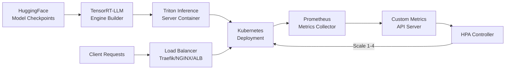
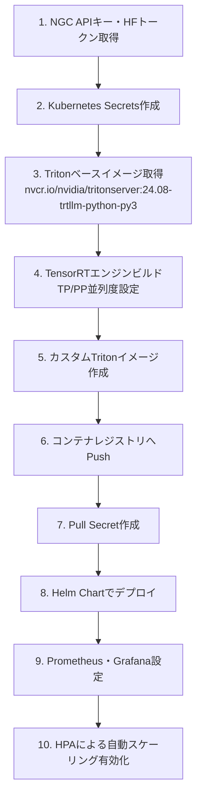

本記事は [Scaling LLMs with NVIDIA Triton and NVIDIA TensorRT-LLM Using Kubernetes](https://developer.nvidia.com/blog/scaling-llms-with-nvidia-triton-and-nvidia-tensorrt-llm-using-kubernetes/) の解説記事です。2024年10月22日公開。

## ブログ概要（Summary）

NVIDIA Developer Blogの本記事では、TensorRT-LLMによるモデル最適化、Triton Inference Serverによる推論サービング、Kubernetes HPAによる自動スケーリングを組み合わせたエンタープライズ規模のLLM推論基盤の構築手法が解説されている。著者らはMaggie Zhang、J Wyman、Indrajit Maloji Bhosale、Wenhan Tanの4名であり、モデルのダウンロードからTensorRTエンジンのビルド、Helmチャートによるデプロイ、Prometheusメトリクスに基づくHPAスケーリングまでのエンドツーエンドのワークフローを実演している。

この記事は [Zenn記事: Ollama v0.31×Docker Composeで構築するオンプレLLM推論基盤](https://zenn.dev/0h_n0/articles/8d8fa50144141d) の深掘りです。Docker ComposeによるシングルノードのLLM推論基盤から、Kubernetesベースのマルチノードスケーリングへと発展させる際の参考情報として位置づけられる。

## 情報源

- **種別**: 企業テックブログ（NVIDIA Developer Blog）
- **URL**: [https://developer.nvidia.com/blog/scaling-llms-with-nvidia-triton-and-nvidia-tensorrt-llm-using-kubernetes/](https://developer.nvidia.com/blog/scaling-llms-with-nvidia-triton-and-nvidia-tensorrt-llm-using-kubernetes/)
- **組織**: NVIDIA（Triton Inference Server / TensorRT-LLM チーム）
- **公開日**: 2024年10月22日
- **著者**: Maggie Zhang, J Wyman, Indrajit Maloji Bhosale, Wenhan Tan

## 技術的背景（Technical Background）

LLM推論をプロダクション環境で運用する際、単一サーバーでの推論では対処できない課題が複数存在する。まず、LLMの推論は計算コストが高く、リクエスト数の増加に応じてGPUリソースを動的に割り当てる仕組みが必要となる。次に、モデルサイズが数十GBに達する場合、単一GPUのメモリに収まらないためテンソル並列（TP）やパイプライン並列（PP）による複数GPU分散が求められる。さらに、推論レイテンシを安定させるためには、リクエストキューの長さとGPU計算時間のバランスを監視し、レプリカ数を自動調整する仕組みが不可欠である。

ブログでは、これらの課題に対してTensorRT-LLMによるモデル最適化、Triton Inference Serverによるサービング、KubernetesのHPAによる自動スケーリングという3層のアーキテクチャを提案している。Docker Composeでオンプレ推論基盤を構築するアプローチ（Zenn記事で解説）と比較すると、Kubernetes基盤は水平スケーリング、ローリングアップデート、リソースクォータ管理など運用面での優位性がある一方、インフラの複雑性が増す点がトレードオフとなる。

## 実装アーキテクチャ（Architecture）

### アーキテクチャ全体像

ブログで解説されているアーキテクチャは、以下の3層で構成される。



### TensorRT-LLM最適化レイヤー

TensorRT-LLMは、LLMの推論性能を最適化するためのPython APIである。ブログでは以下の最適化技術が適用されると解説されている。

**カーネルフュージョン（Kernel Fusion）**: 複数のGPU演算カーネルを単一のカーネルに統合し、カーネル起動のオーバーヘッドとメモリ転送を削減する。Transformerの注意機構やフィードフォワード層に適用される。

**量子化（Quantization）**: モデルの重みをFP16やINT8、INT4などの低精度数値表現に変換し、メモリ使用量と計算量を削減する。精度と速度のトレードオフを制御できる。

**In-flight Batching**: 従来の静的バッチ処理では、バッチ内の全リクエストが完了するまで新しいリクエストを受け付けられない。In-flight Batchingでは、完了したリクエストのスロットに新しいリクエストを動的に挿入し、GPU利用率を向上させる。

**Paged Attention**: KVキャッシュを固定サイズのページに分割し、物理メモリ上に非連続に配置する。これにより、シーケンス長の異なるリクエストが混在する環境でもメモリ断片化を抑制できる。

ブログでは、TensorRT-LLMのエンジンビルド時に `gpt_attention_plugin`、`paged_kv_cache`、`gemm_plugin` などの設定パラメータが使用されることが示されている。

### Triton Inference Serverサービングレイヤー

Triton Inference Server（2025年3月に「NVIDIA Dynamo Triton」に改称）は、最適化されたモデルを推論エンドポイントとして公開するサーバーである。ブログによると、以下の3つのポートを公開する。

| ポート | プロトコル | 用途 |
|--------|-----------|------|
| 8000 | HTTP | 推論リクエスト受付 |
| 8001 | gRPC | 推論リクエスト受付（高スループット用） |
| 8002 | HTTP | Prometheusメトリクス公開 |

Tritonはリアルタイム推論、バッチ推論、アンサンブル、ストリーミングの各クエリタイプに対応する。また、TensorRT以外にもTensorFlow、PyTorch、ONNXなどの推論バックエンドをサポートし、クラウド、データセンター、エッジ環境での展開が可能である。

### Kubernetes Deployment構成

ブログでは、Helmチャートを用いたデプロイが推奨されている。Helmチャートは `chart.yaml`（メタデータ）、`values.yaml`（デフォルトパラメータ）、`deployment.yaml`（Pod仕様）の3ファイルで構成される。

```yaml
# deployment.yaml の主要部分（ブログの構成を基に再構成）
apiVersion: apps/v1
kind: Deployment
metadata:
  name: triton-tensorrtllm
  labels:
    app.kubernetes.io/component: server
spec:
  replicas: 1
  selector:
    matchLabels:
      app.kubernetes.io/component: server
  template:
    metadata:
      labels:
        app.kubernetes.io/component: server
    spec:
      containers:
        - name: triton-server
          image: <custom-triton-trtllm-image>
          ports:
            - containerPort: 8000
              name: http
            - containerPort: 8001
              name: grpc
            - containerPort: 8002
              name: metrics
          resources:
            limits:
              nvidia.com/gpu: 1
              ephemeral-storage: "24Gi"
```

**重要な設計上のポイント**: ブログでは「デプロイ時に生成されたTensorRTエンジンとプランファイルはホストノードに保存され、同一ノード上の全Kubernetes Podにリマップされる」と解説されている。これにより、スケールアップ時に各Podがエンジンを再生成する必要がなく、起動時間が短縮される。

### HPA（Horizontal Pod Autoscaler）構成

HPAはPrometheusから収集されたカスタムメトリクスに基づいてPod数を制御する。

```yaml
# HPA仕様（ブログの設定値を基に再構成）
apiVersion: autoscaling/v2
kind: HorizontalPodAutoscaler
metadata:
  name: triton-tensorrtllm-hpa
spec:
  scaleTargetRef:
    apiVersion: apps/v1
    kind: Deployment
    name: triton-tensorrtllm
  minReplicas: 1
  maxReplicas: 4
  metrics:
    - type: Pods
      pods:
        metric:
          name: queue_to_compute_ratio
        target:
          type: AverageValue
          averageValue: "1000m"
```

### PodMonitor（Prometheus連携）

```yaml
# PodMonitor仕様（ブログの設定を基に再構成）
apiVersion: monitoring.coreos.com/v1
kind: PodMonitor
metadata:
  name: triton-metrics
spec:
  selector:
    matchLabels:
      app.kubernetes.io/component: server
  podMetricsEndpoints:
    - port: metrics
      path: /metrics
      interval: "6s"
```

ブログでは、Prometheusのスクレイプ間隔を6秒に設定しており、メトリクスの粒度とスクレイプ負荷のバランスを取っている。

## Production Deployment Guide

### デプロイメントワークフロー

ブログで解説されているエンドツーエンドのデプロイメントワークフローは、以下のステップで構成される。



### ステップ1: アクセス管理とシークレット

モデルのダウンロードにはNGC APIキーとHugging Faceアクセストークンが必要である。ブログでは、これらをKubernetes Secretsとして管理することが推奨されている。

```bash
# HuggingFaceトークンのSecret作成
kubectl create secret generic hf-model-pull \
  --from-literal=HF_TOKEN=<your-hf-token>

# コンテナレジストリのPull Secret作成
kubectl create secret docker-registry registry-secret \
  --docker-server=<registry-url> \
  --docker-username=<username> \
  --docker-password=<password>
```

### ステップ2: TensorRTエンジンのビルド

ブログによると、ベースイメージとして `nvcr.io/nvidia/tritonserver:24.08-trtllm-python-py3` を使用し、モデルチェックポイントからTensorRTエンジンをビルドする。このとき、テンソル並列度（TP）とパイプライン並列度（PP）を指定する。

```bash
# テンソル並列度2の場合（2 GPU必要）
model.tensorrtLlm.parallelism.tensor=2
model.tensorrtLlm.parallelism.pipeline=1
```

ブログでは「TP x PP 個のGPUがエンジンファイル生成に必要」と明記されている。例えば、TP=2、PP=1であれば、各Podに最低2つのGPUが割り当てられる必要がある。

### ステップ3: Kubernetes前提コンポーネント

ブログでは、以下のKubernetesアドオンが事前にインストールされている必要があると解説されている。

| コンポーネント | 役割 |
|------------|------|
| Node Feature Discovery | ノードのハードウェア特性を自動検出 |
| NVIDIA Device Plugin | GPUリソースをKubernetesに公開 |
| GPU Feature Discovery | GPU種別・ドライバ情報の検出 |
| NVIDIA DCGM Exporter | GPU固有メトリクスの公開 |
| Prometheus | メトリクス収集・保存 |

これらのコンポーネントは、GPUリソースのスケジューリングとモニタリングの基盤となる。Docker Composeでは `--gpus all` フラグで簡易的にGPUを割り当てられるが、Kubernetes環境ではNVIDIA Device Pluginを介した明示的なリソース管理が必要となる点が異なる。

### ステップ4: Helmによるデプロイ

Helmチャートのデプロイは、カスタム `values.yaml` でパラメータを上書きする形式で行われる。

```bash
# Helmデプロイ（ブログの手順を基に再構成）
helm install triton-llm ./triton-chart \
  --set image.repository=<registry>/triton-trtllm \
  --set image.tag=latest \
  --set model.tensorrtLlm.parallelism.tensor=1 \
  --set resources.limits."nvidia\.com/gpu"=1 \
  --set resources.limits.ephemeral-storage=24Gi
```

`ephemeral-storage` にはモデルサイズに応じた容量を指定する。ブログの例ではGPT-2モデルに対して24GBが設定されている。より大規模なモデルでは相応の容量が必要となる。

### ステップ5: モニタリングスタック

ブログでは、Prometheus + Grafanaによるモニタリングスタックの構築が解説されている。Prometheusは6秒間隔でTritonのメトリクスエンドポイント（ポート8002）をスクレイプし、カスタムメトリクスAPIサーバーを介してHPAに提供する。

```bash
# Grafanaダッシュボードへのアクセス（ブログの手順）
kubectl port-forward svc/grafana 8080:80
# ブラウザで localhost:8080 にアクセス
```

Grafanaダッシュボードでは、GPU利用率、推論キュー長、スケーリング状態などの時系列データが可視化される。

### ステップ6: ロードバランシング

ブログでは、推論リクエストの分散に以下のロードバランサーが推奨されている。

**L7（アプリケーション層）ロードバランサー**:
- **Traefik**: Kubernetesネイティブなイングレスコントローラーで、HTTP/gRPCの両方に対応
- **NGINX Plus**: 商用版NGINXで、高度なヘルスチェックとセッション管理を提供

**クラウドネイティブロードバランサー**:
- **AWS Load Balancer Controller**: ALBまたはNLBを自動プロビジョニング
- **Azure Load Balancing**: AKSとの統合
- **GCP Load Balancing**: GKEとの統合

gRPCプロトコル（ポート8001）を使用する場合、L7ロードバランサーがHTTP/2に対応している必要がある点に注意が必要である。

### AWS EKSでのデプロイパターン

ブログでは、AWS EKS上でのマルチノードデプロイについて関連リソースが参照されている。EKSでGPU推論ワークロードを運用する際の主要な考慮事項を以下に整理する。

**GPUインスタンスの選択**: NVIDIA A10G搭載の `g5` インスタンスファミリーや、A100搭載の `p4d`/`p4de` インスタンスがLLM推論に使用される。TP並列度に応じてGPU数の多いインスタンスタイプを選択する必要がある。

**ノードグループ設計**: GPU搭載ノードとCPUノードを別のノードグループに分離し、GPU搭載ノードにはtaintを設定してGPUワークロード以外のPodがスケジュールされないようにする。

```yaml
# GPU NodeGroup taints設定例
taints:
  - key: nvidia.com/gpu
    value: "true"
    effect: NoSchedule
tolerations:
  - key: nvidia.com/gpu
    operator: Exists
    effect: NoSchedule
```

**ストレージ**: TensorRTエンジンファイルはサイズが大きいため、EBS gp3ボリュームを `hostPath` でマウントするか、Amazon FSx for Lustreを共有ストレージとして使用する構成が考えられる。ブログで解説されているホストノードへのエンジンキャッシュは、同一ノード上のPod間でエンジン再生成を回避する仕組みであり、EKSでも同様に機能する。

**Cluster Autoscaler / Karpenter**: HPAがPodレベルのスケーリングを担当する一方、ノードレベルのスケーリングにはCluster AutoscalerまたはKarpenterが必要となる。GPU搭載ノードの起動には数分を要するため、スケーリングのレイテンシに注意が必要である。

## パフォーマンス最適化（Performance Optimization）

### Queue-to-Compute比率メトリクス

ブログでは、HPAのスケーリング指標として「Queue-to-Compute比率」が採用されている。このメトリクスは、推論リクエストのキュー待ち時間と実際の計算時間の比率で定義される。

$$
\text{Queue-to-Compute Ratio} = \frac{\text{rate}(\text{nv\_inference\_queue\_duration\_us}[1\text{m}])}{\text{clamp\_min}(\text{rate}(\text{nv\_inference\_compute\_infer\_duration\_us}[1\text{m}]),\ 1)}
$$

ブログによると、この比率が閾値（1000ミリユニット）を超えると、HPAがレプリカ数を増加させる。分母の `clamp_min(..., 1)` は、計算時間がゼロの場合のゼロ除算を防ぐためのガード条件である。

このメトリクスの利点は、GPU利用率やリクエスト数などの単純な指標と比較して、実際のユーザー体験（レスポンス時間）に直結する点にある。キューが計算時間に対して相対的に長くなった場合にスケールアウトが発動するため、GPUの処理能力に見合ったスケーリングが実現される。

### スケーリング動作の実証

ブログでは、Grafanaダッシュボードによるスケーリング動作の可視化が紹介されている。

1. **初期状態**: 1レプリカ、1 GPU
2. **負荷増加**: 10個の推論クライアントを投入
3. **HPA応答**: レプリカ数が1から4にスケールアウト
4. **結果**: GPU利用率が4つのPodに分散、Queue-to-Compute比率が低下
5. **負荷減少**: クライアントを1に削減すると、レプリカ数が1にスケールイン

この実証では、Queue-to-Compute比率が閾値を超えた時点でHPAが反応し、レプリカ追加によって比率が閾値以下に戻ることが確認されている。

## 運用での学び（Operational Lessons）

ブログから読み取れる運用上の知見を以下に整理する。

**エンジンキャッシュの活用**: TensorRTエンジンのビルドは時間がかかるため、ホストノードへのキャッシュは起動時間の短縮に直結する。ブログでは、同一ノード上の全Podがキャッシュされたエンジンを共有する設計が推奨されている。スケールアウト時に新しいPodが同一ノードに配置されればエンジン再ビルドが不要となる。

**メトリクスのスクレイプ間隔**: 6秒というスクレイプ間隔は、HPAの反応速度とPrometheusの負荷のバランスを取った値である。間隔を短くすればスケーリングの反応は速くなるが、メトリクス収集の負荷が増加する。

**デバッグ手法**: ブログでは、Pod起動に失敗した場合のトラブルシューティングとして `kubectl describe pod`、`kubectl logs <pod> -c init`、`kubectl logs <pod> -c init --previous` の3つのコマンドが紹介されている。initコンテナでのエンジンビルドが失敗するケースが多いため、`--previous` フラグで前回のinitコンテナのログを確認する手順が示されている。

**テンソル並列度の選択**: TP=2に設定すると各Podに2 GPUが必要となり、ノードあたりのGPU数によってはPodの配置が制約される。ブログでは、モデルサイズとGPUメモリの関係からTP値を決定することが推奨されている。

## 学術研究との関連（Related Academic Work）

ブログで採用されている技術要素は、複数の学術研究に基づいている。Paged Attentionは、vLLMの論文（Kwon et al., 2023, "Efficient Memory Management for Large Language Model Serving with PagedAttention"）で提案された手法であり、OSの仮想メモリ管理の概念をKVキャッシュに適用したものである。In-flight Batchingは、Orca（Yu et al., 2022, "Orca: A Distributed Serving System for Transformer-Based Generative Models"）で提案されたイテレーションレベルのスケジューリングに対応する概念である。Kubernetes上でのGPU推論のオートスケーリングについては、MLOps分野で活発に研究されており、KServeやSeldon Coreなどのオープンソースプロジェクトが類似のアプローチを採用している。

## まとめと実践への示唆

ブログでは、TensorRT-LLMによるモデル最適化、Triton Inference Serverによるサービング、Kubernetes HPAによる自動スケーリングの3層アーキテクチャが、プロダクション環境でのLLM推論基盤として実用的であることが示されている。Docker Composeによるシングルノード構成からの発展として、Kubernetes基盤への移行は水平スケーリングと運用自動化の点で有効な選択肢である。Queue-to-Compute比率メトリクスに基づくスケーリングは、GPUリソースの効率的な利用とレスポンス時間の安定化を両立する手法として参考になる。チュートリアルの全コードとデプロイメント手順は [triton-inference-server/tutorials](https://github.com/triton-inference-server/tutorials/tree/main/Deployment/Kubernetes/TensorRT-LLM_Autoscaling_and_Load_Balancing) で公開されている。

## 参考文献

- Maggie Zhang, J Wyman, Indrajit Maloji Bhosale, Wenhan Tan, "Scaling LLMs with NVIDIA Triton and NVIDIA TensorRT-LLM Using Kubernetes," NVIDIA Developer Blog, October 22, 2024. [https://developer.nvidia.com/blog/scaling-llms-with-nvidia-triton-and-nvidia-tensorrt-llm-using-kubernetes/](https://developer.nvidia.com/blog/scaling-llms-with-nvidia-triton-and-nvidia-tensorrt-llm-using-kubernetes/)
- NVIDIA, "TensorRT-LLM Backend for Triton Inference Server," GitHub. [https://github.com/triton-inference-server/tensorrtllm_backend](https://github.com/triton-inference-server/tensorrtllm_backend)
- Woosuk Kwon et al., "Efficient Memory Management for Large Language Model Serving with PagedAttention," SOSP 2023. [https://arxiv.org/abs/2309.06180](https://arxiv.org/abs/2309.06180)
- Gyeong-In Yu et al., "Orca: A Distributed Serving System for Transformer-Based Generative Models," OSDI 2022.
