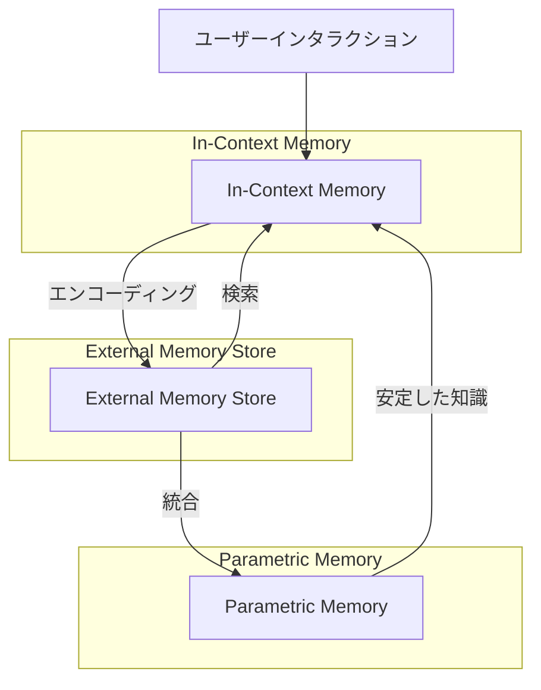

## 論文概要

LLMがテキスト補完ツールから動的環境で動作するエージェントへと進化するなかで、長期的な知識の継続的学習と保持が課題となっている。本論文はポジションペーパーとして、**エピソード記憶（Episodic Memory）がLLMエージェントの長期動作に不可欠な欠落要素である**と主張している。著者らは認知科学におけるエピソード記憶の5つの特性を定義し、現在のLLMメモリシステムがこれらを十分に満たしていないことを示したうえで、エピソード記憶を統合するための3層アーキテクチャと4つのコアプロセスを提案している。ICML 2025に採択された本論文は、LLMエージェントの記憶設計に関する今後の研究方向を体系的に整理している。

> この記事は [arxiv.org/abs/2502.06975](https://arxiv.org/abs/2502.06975) の解説記事です。

## 情報源

| 項目 | 内容 |
|---|---|
| arXiv ID | [2502.06975](https://arxiv.org/abs/2502.06975) |
| タイトル | Position: Episodic Memory is the Missing Piece for Long-Term LLM Agents |
| 著者 | Mathis Pink, Qinyuan Wu, Vy Ai Vo, Javier Turek, Jianing Mu, Alexander Huth, Mariya Toneva |
| 発表年 | 2025年2月 |
| カテゴリ | cs.AI |
| カンファレンス | ICML 2025 |

## 背景と動機

LLMベースのエージェントは、カスタマーサポート、自律的な研究支援、インタラクティブな教育など多様な応用場面で利用が進んでいる。しかし、これらのエージェントが長期間にわたって動作する場合、過去のインタラクションから学習し、文脈に応じた適切な行動をとる能力が求められる。

現在のLLMエージェントのメモリシステムには根本的な限界がある。コンテキストウィンドウは容量制限があり、KVキャッシュ圧縮は情報の忠実性を犠牲にする。RAGベースの外部メモリは文脈的なメタデータ（いつ・どこで・なぜその情報を得たか）を十分に保持できない。パラメトリックメモリ（モデルの重み）の更新はデータセット規模の学習を必要とし、個別のエピソードからの迅速な学習には適さない。

著者らは、認知科学におけるエピソード記憶の研究が、これらの限界を克服するための理論的基盤を提供すると主張している。人間の記憶システムでは、エピソード記憶が個々の経験を文脈情報とともに即座に記録し、必要に応じて想起することで、適応的な行動を可能にしている。この仕組みをLLMエージェントに導入することが、長期動作の鍵であるという立場をとっている。

## 主要な貢献

著者らの主要な貢献は以下の通りである。

- **エピソード記憶の5つの特性の定義**: 認知科学の知見に基づき、LLMエージェントに必要なエピソード記憶の特性を明確に定義した
- **既存メモリシステムの体系的分析**: 現在のLLMメモリ手法（インコンテキスト、外部ストア、パラメトリック）がエピソード記憶の特性をどの程度満たすかを評価した
- **3層メモリアーキテクチャの提案**: インコンテキストメモリ、外部メモリストア、パラメトリックメモリの3層からなる統合フレームワークを示した
- **4つのコアプロセスの定義**: エンコーディング、検索、統合、ベンチマーキングの4プロセスを定義し、各プロセスの研究課題を整理した
- **6つの研究質問による研究ロードマップ**: 今後取り組むべき具体的な研究方向を提示した

## 技術的詳細

### エピソード記憶の5つの特性

著者らは、認知科学の文献からエピソード記憶の本質的な特性を5つ抽出している。

| 特性 | 説明 | LLMエージェントにおける意味 |
|---|---|---|
| 長期保存（Long-term storage） | 拡張された時間スケールにわたって情報を維持する | セッションを超えて過去のインタラクションを記憶する |
| 明示的推論（Explicit reasoning） | 記憶内容について意識的に反映し、意図的に利用できる | 過去の経験を参照して判断根拠を説明できる |
| 単発学習（Single-shot learning） | 一度の経験から情報を取得する | 反復学習なしに個別のユーザー要求や結果を記録する |
| インスタンス固有（Instance-specific） | 特定の出来事に固有の詳細を保持する | 汎化された知識ではなく、具体的なエピソードの詳細を保持する |
| 文脈関係（Contextual relations） | いつ・どこで・なぜという文脈を内容に結合する | 「このユーザーが先週木曜日にこの問題について質問した」という時間的・状況的文脈を保持する |

### メモリタイプの比較

著者らは、エピソード記憶を他のメモリタイプと比較し、エピソード記憶のみが5つの特性すべてを満たすことを示している。

| メモリタイプ | 長期保存 | 明示的推論 | 単発学習 | インスタンス固有 | 文脈関係 |
|---|---|---|---|---|---|
| エピソード記憶 | ○ | ○ | ○ | ○ | ○ |
| 手続き記憶 | ○ | × | × | × | × |
| 意味記憶 | ○ | ○ | × | × | × |
| ワーキングメモリ | × | ○ | ○ | ○ | ○ |

この比較表は重要な示唆を含んでいる。ワーキングメモリ（LLMのコンテキストウィンドウに相当）はエピソード記憶と多くの特性を共有するが、長期保存能力を欠いている。意味記憶（RAGで検索される一般的な知識に相当）は長期保存と明示的推論を持つが、単発学習やインスタンス固有性を欠いている。

### 3層メモリアーキテクチャ

著者らは、LLMエージェントのメモリシステムを3つの層に分けたフレームワークを提案している。

**In-Context Memory（ICM）**: コンテキストウィンドウを高速アクセスのワーキングメモリとして使用する。現在のインタラクションに必要な情報を保持するが、容量に限界がある。

**External Memory Store**: RAGライクな非パラメトリックデータベースとして機能する。メタデータ（タイムスタンプ、ユーザーID、タスクコンテキスト）を付与した形で過去のエピソードを保存する。GraphRAGのような構造化されたアプローチも含まれる。

**Parametric Memory**: LLMの訓練済み重みに埋め込まれた安定した知識を表す。頻繁に利用されるパターンが外部メモリからパラメトリックメモリへと統合される。

### 相補的学習システム理論

このアーキテクチャの理論的基盤として、著者らは認知科学の**相補的学習システム理論（Complementary Learning Systems Theory）**を引用している。この理論では以下の2つのシステムの相補性が提唱されている。

- **高速学習システム**（海馬に相当）: 個々のインスタンスを即座に記録するエピソード記憶
- **低速学習システム**（新皮質に相当）: 反復的な経験から安定した知識構造を構築する意味記憶・手続き記憶

この相補性により、迅速な適応と長期的な安定性の両立が可能になる。LLMエージェントにおいては、External Memory Storeが高速学習システムに、Parametric Memoryが低速学習システムに対応する。

## 実装のポイント

### 4つのコアプロセス

著者らは、エピソード記憶を実現するために4つのコアプロセスを定義している。

**1. エンコーディング（Encoding）**

インコンテキストメモリから外部ストレージへの転送プロセスである。著者らは2つのアプローチを提示している。

- **サプライズベースのバンドリング**: 予測誤差が高い（驚きの度合いが大きい）時点でエピソード境界を設定し、情報をまとめて保存する。情報理論的には、モデルの予測確率 $p(x_t \mid x_{<t})$ が低い時点がエピソード境界の候補となる
- **イベントセグメンテーション**: 連続的な経験を意味のある単位に分割する。文脈の変化（話題の転換、新しいタスクの開始）を検出してセグメント境界を決定する

**2. 検索（Retrieval）**

過去のエピソードから現在の文脈に関連するものを選択し、インコンテキストメモリに復元するプロセスである。著者らは3つの方法を挙げている。

- **トークンのプリペンディング**: 検索結果をプロンプトの先頭に追加する（標準的なRAGアプローチ）
- **メモリトークン**: 専用のメモリトークンを導入し、圧縮された形式でエピソードを表現する
- **内部表現の適応**: モデルの中間層の活性化を直接修正して、過去のエピソードの情報を注入する

**3. 統合（Consolidation）**

外部メモリの内容をベースパラメータにマージするプロセスである。このプロセスは、メモリのオーバーフローを防ぎ、汎化を可能にする。

- **コンテキスト蒸留**: 外部メモリの内容をモデルの重みに蒸留する。頻繁にアクセスされるエピソードを優先的に統合する
- **知識編集**: LoRAやモデル編集技術を用いて、特定の知識をパラメータに直接書き込む

ただし、著者らは統合プロセスにおける**壊滅的忘却（catastrophic forgetting）**の問題を指摘しており、新しい知識の統合が既存の知識を上書きしないための手法が必要であると述べている。

**4. ベンチマーキング（Benchmarking）**

エピソード記憶の有効性を評価するためのフレームワークである。著者らは以下の評価観点を提案している。

- 遅延後の想起精度（delayed recall accuracy）
- 時間順序の保持（temporal order preservation）
- 現実世界の複雑さの反映（real-world complexity incorporation）

## 実験結果

本論文はポジションペーパーであるため、独自の実験結果は含まれていない。代わりに、著者らはエピソード記憶の評価に向けたベンチマーキングフレームワークを提案している。

### 提案された評価フレームワーク

著者らは、既存のベンチマークがエピソード記憶の5つの特性を網羅的に評価できていないと指摘している。現在のベンチマークの多くは、検索精度や生成品質を単一のタスクで測定するものであり、以下の側面が不足していると述べている。

- **時間的遅延を伴う想起テスト**: エピソードが保存されてから一定期間後に正確に想起できるかを評価する。例えば、100ターンの対話後に初期のエピソードを正しく参照できるかを測定する
- **時間順序の判断**: 複数のエピソードが発生した時間的順序を正しく判断できるかを評価する。「AとBのどちらが先に起きたか」を問うタスクが想定される
- **文脈情報の保持**: エピソードの内容だけでなく、いつ・どこで・なぜという文脈情報が正しく保持されているかを評価する
- **干渉への耐性**: 類似したエピソードが複数存在する場合に、特定のエピソードを正しく区別して想起できるかを測定する

著者らは、これらの側面を統合的に評価できるベンチマークの開発が今後の重要な研究課題であると位置づけている。

### 6つの研究質問

著者らは以下の研究質問（RQ）をロードマップとして提示している。

| RQ | 問い | 対応するプロセス |
|---|---|---|
| RQ1 | 文脈的に豊かな情報をどのように外部に保存するか | エンコーディング |
| RQ2 | 連続的なストリームをどのようにエピソードに分割するか | エンコーディング |
| RQ3 | どのメカニズムでエピソードを選択するか | 検索 |
| RQ4 | ロングコンテキストの進展はどのように検索を加速するか | 検索 |
| RQ5 | 壊滅的忘却なしにパラメータへどう統合するか | 統合 |
| RQ6 | 有効性を評価するベンチマークは何か | ベンチマーキング |

## 実運用への応用

### LLMエージェントのメモリ設計への示唆

本論文の提案するフレームワークは、実運用のLLMエージェント設計に対して具体的な示唆を与えている。

著者らは応用シナリオとして、**自律的な研究支援**、**パーソナライズされたカスタマーサポート**、**インタラクティブな教育**、**大規模ソフトウェアプロジェクト**の4つを挙げている。

例えばカスタマーサポートエージェントにおいては、以下のような要件がエピソード記憶の5つの特性と対応する。

- **長期保存**: ユーザーの過去の問い合わせ履歴をセッションを超えて保持する
- **単発学習**: 一度のインタラクションでユーザーの好みや状況を記録する
- **インスタンス固有**: 「先週のチケット#1234で報告されたエラー」のような具体的なエピソードを区別する
- **文脈関係**: そのエピソードがいつ、どのような状況で発生したかを結合して保持する
- **明示的推論**: 過去のエピソードを参照して「以前同様の問題がありましたが、その際は〜で解決しました」と推論する

### 関連Zenn記事との関連

関連記事「[LangGraph永続メモリでCSエージェントの長期文脈保持と応答精度を改善する](https://zenn.dev/0h_n0/articles/5b6f9454f72459)」で扱っているLangGraphの永続メモリは、本論文のフレームワークにおけるExternal Memory Storeに位置づけられる。LangGraphのチェックポイント機構は会話状態の保存を実現するが、本論文が指摘するエピソード記憶の5つの特性すべてを満たしているわけではない。特に、サプライズベースのエンコーディングや、パラメトリックメモリへの統合プロセスは、現在のLangGraphの枠組みでは対応が難しい領域である。

### 現在の限界と実装上の課題

著者らは、現在のメモリシステムの限界を以下のように整理している。

- **In-Context**: KVキャッシュ圧縮は情報の忠実性を犠牲にする。状態空間モデル（SSM）は拡大する履歴の処理に困難がある
- **External**: RAGは豊かな文脈的メタデータを欠く。スロットベースのメモリは容量に制限がある
- **Parametric**: 効率的なファインチューニングにはデータセット規模のデータが必要であり、知識編集は文脈に依存しない事実の修正に限定される

## 関連研究

本論文は、以下の研究領域と関連している。

**認知科学のメモリモデル**: Tulving（1972）のエピソード記憶の概念を基盤とし、McClelland et al.（1995）の相補的学習システム理論をLLMアーキテクチャに適用している。

**LLMのメモリ拡張**: MemoryBank、MemGPT、Reflexionなどの既存手法は、エピソード記憶の一部の特性を実現しているが、5つの特性を包括的にカバーする手法は提案されていない。

**検索拡張生成（RAG）**: RAGは外部メモリストアの一形態であるが、著者らはRAGが文脈的関係性の保持において不十分であると指摘している。GraphRAGのようなグラフ構造を用いたアプローチが、より豊かな文脈表現を可能にする方向性として示されている。

**ロングコンテキストモデル**: コンテキストウィンドウの拡大（100K+トークン）はワーキングメモリの容量を増やすが、長期保存の問題は解決しない。

## まとめと今後の展望

本論文は、LLMエージェントの長期動作において、認知科学に基づくエピソード記憶の統合が重要であるという立場を明確に示した。提案された5つの特性、3層アーキテクチャ、4つのコアプロセスは、今後のメモリシステム設計の指針となる。

著者らが提示した6つの研究質問は、エピソード記憶の実現に向けた具体的な道筋を示している。特にRQ5（壊滅的忘却なしの統合）とRQ6（評価ベンチマーク）は、実用的なエピソード記憶システムの実現に向けた重要な障壁であり、今後の研究の進展が期待される。ポジションペーパーとしての本論文の価値は、散在していたメモリ研究を統一的なフレームワークで整理し、今後の研究方向を明確にした点にある。

## 参考文献

- Pink, M., Wu, Q., Vo, V. A., Turek, J., Mu, J., Huth, A., & Toneva, M. (2025). Position: Episodic Memory is the Missing Piece for Long-Term LLM Agents. *ICML 2025*. [arXiv:2502.06975](https://arxiv.org/abs/2502.06975)
- Tulving, E. (1972). Episodic and semantic memory. *Organization of Memory*.
- McClelland, J. L., McNaughton, B. L., & O'Reilly, R. C. (1995). Why there are complementary learning systems in the hippocampus and neocortex. *Psychological Review*, 102(3), 419-457.
