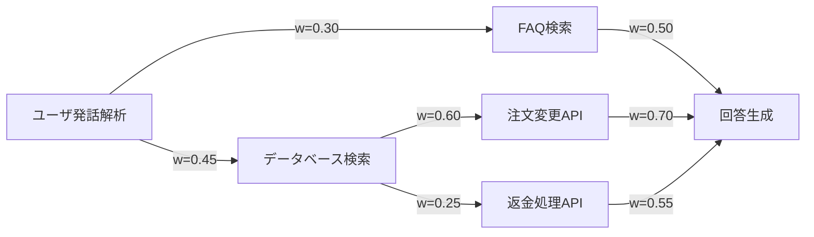
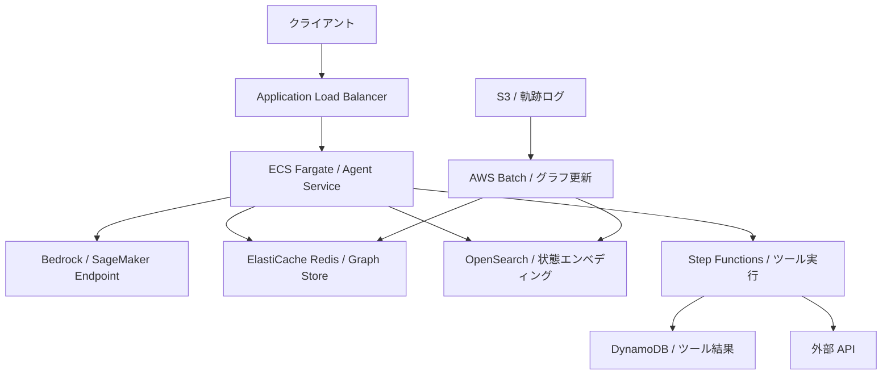

## 論文概要

大規模言語モデル（LLM）を用いたツール利用エージェントは、複数ターンの対話を通じて外部ツールを呼び出しながらタスクを解決する。しかし既存手法では過去の経験を体系的に活用する仕組みが不十分であり、同じツール選択の失敗を繰り返すという課題がある。本論文で提案される H-EPM（Hybrid Episodic-Procedural Memory）は、成功した軌跡からエピソード記憶と手続き記憶を統合したツール遷移グラフを構築し、推論時にエージェントの次のツール選択をガイドする。τ-Bench（通信ドメイン）において GPT-4.1-mini ベースで 22.2% の精度向上が報告されている。

本記事は [https://arxiv.org/abs/2512.07287](https://arxiv.org/abs/2512.07287) の解説記事です。

## 情報源

| 項目 | 内容 |
|------|------|
| arXiv ID | [2512.07287](https://arxiv.org/abs/2512.07287) |
| タイトル | Experience-Evolving Multi-Turn Tool-Use Agent with Hybrid Episodic-Procedural Memory |
| 著者 | Sijia Li, Yuchen Huang, Zifan Liu, Zijian Li, Jingjing Fu, Lei Song, Jiang Bian, Jun Zhang, Rui Wang |
| 発表年 | 2025年12月（2026年1月改訂） |
| カンファレンス | ICML 2026 |
| カテゴリ | cs.AI |

## 背景と動機

LLM ベースのエージェントが複数のツール（API、データベース検索、計算機能など）を組み合わせてタスクを解決する「マルチターンツール利用」は、カスタマーサポートや情報検索など多くの実用シナリオで求められている。

既存のアプローチには大きく2つの課題がある。第一に、ReAct や Reflexion といった手法はツール選択の履歴を構造化して保持しないため、過去の成功パターンを再利用できない。第二に、ToolNet のようにツールグラフを構築する手法は存在するが、対話の文脈（状態）を考慮しないため、同じツール遷移でも状況によって適切な選択が異なるケースに対応できない。

著者らはこの問題に対し、認知科学における「エピソード記憶」（特定の経験の記憶）と「手続き記憶」（繰り返しにより自動化されたスキル）の区分に着想を得て、両者をツール遷移グラフ上で統合するフレームワーク H-EPM を提案している。エピソード記憶は状態に紐づいた具体的な成功経験を保持し、手続き記憶はツール間の頻出遷移パターンをエッジの重みとして集約する。

## 主要な貢献

著者らは以下の貢献を主張している。

- **H-EPM フレームワークの提案**: エピソード記憶と手続き記憶をツール遷移グラフ上で統合し、推論時にツール選択をガイドする仕組みを構築
- **状態アノテーション付きグラフ**: 単なるツール間遷移だけでなく、対話・ツール履歴の圧縮要約をノードに付与することで、文脈依存のツール選択を実現
- **精度と効率を統合した重み関数**: 成功回数だけでなく、ロールアウトステップ数（効率性）を組み合わせた重み付けを導入
- **記憶ガイド付き RL 学習（GRPO）**: 構築したグラフの知識を強化学習の探索バイアスとして活用し、小規模モデル（Qwen3-4B/8B）の性能を向上
- **複数ベンチマークでの検証**: τ-Bench、τ²-Bench、ToolSandbox の3つのベンチマークで既存手法を上回る結果を報告

## 技術的詳細

### ツール遷移グラフ G=(V, E, W, S)

H-EPM の中核は、成功した軌跡（trajectory）から構築される状態アノテーション付きツール遷移グラフである。

- **ノード V**: 成功軌跡に含まれるツール呼び出しアクション。各ツールタイプが1つのノードに対応する
- **エッジ E**: 軌跡中で連続して呼び出されたツール間の有向接続
- **重み W**: 精度と効率を組み合わせたスコア（後述）
- **状態アノテーション S**: 各エッジに紐づく、対話履歴・ツール呼び出し結果の圧縮要約



上図はカスタマーサポートドメインにおけるツール遷移グラフの概念図である。各エッジの重みは成功頻度と効率性を反映している。

### 重み関数

エッジの重みは以下の式で計算される（論文 Section 3.2 より）。

$$
w'(\tau_t, \tau_{t+1}) = N(\tau_t, \tau_{t+1}) + c \cdot \sum_{k=1}^{N(\tau_t, \tau_{t+1})} \frac{1}{n_k(\tau_t, \tau_{t+1})}
$$

各変数の定義は以下の通りである。

| 変数 | 意味 |
|------|------|
| $$N(\tau_t, \tau_{t+1})$$ | ツール $$\tau_t$$ から $$\tau_{t+1}$$ への遷移が成功軌跡に出現した回数 |
| $$n_k(\tau_t, \tau_{t+1})$$ | $$k$$ 番目の成功軌跡におけるロールアウトステップ数（少ないほど効率的） |
| $$c$$ | 効率性の重要度を制御するハイパーパラメータ |

第1項 $$N(\tau_t, \tau_{t+1})$$ は精度（成功頻度）を、第2項はステップ数の逆数の和として効率性を表現する。正規化は以下で行われる。

$$
w(\tau_t, \tau_{t+1}) = \frac{w'(\tau_t, \tau_{t+1})}{\sum_{\tau'} w'(\tau_t, \tau')}
$$

### エピソード記憶と手続き記憶

**手続き記憶**はグラフのエッジ重み $$w$$ に集約される。多くの成功軌跡で繰り返し観察されるツール遷移パターンは高い重みを持ち、「このツールの後はこのツールを使うべき」という一般的なスキルを表現する。

**エピソード記憶**は各エッジに付与される状態アノテーション $$S$$ として保持される。具体的には、タプル $$(s_t, a_t, a_{t+1})$$ の形で、対話履歴の圧縮状態 $$s_t$$、現在のアクション $$a_t$$、次のアクション $$a_{t+1}$$ を記録する。これにより「このような状況でこのツール遷移が成功した」という個別の経験を保持できる。

### 推論アルゴリズム

推論時の動作は以下の手順で行われる。

1. エージェントの直近のツール呼び出しに対応するノードをグラフ上で特定する
2. エージェント自身が、現在の状態で要約ベースのマッチング（エピソード記憶の参照）が必要かどうかを判断する
3. **要約を使用する場合**: 現在の対話状態を all-MiniLM-L6-v2 でエンコードし、保存済みの状態アノテーションとのコサイン類似度を計算、上位 k 件を取得する
4. **要約を使用しない場合**: エッジの重み $$w$$ のみに基づいて上位 k 件のツール遷移を選択する
5. 最終的に上位2件の候補をシステムプロンプトのガイダンスとしてエージェントに提供する

## アルゴリズム（疑似コード）

以下は推論時のツール選択ガイダンス生成の疑似コードである（論文 Algorithm 1 に基づく）。

```python
from dataclasses import dataclass
import numpy as np
from sentence_transformers import SentenceTransformer


@dataclass
class ToolTransitionGraph:
    """状態アノテーション付きツール遷移グラフ"""
    nodes: dict[str, list[str]]          # tool_name -> [successor tools]
    weights: dict[tuple[str, str], float] # (src, dst) -> normalized weight
    state_annotations: dict[tuple[str, str], list[tuple[str, np.ndarray]]]
    # (src, dst) -> [(summary_text, embedding)]


def get_tool_suggestions(
    graph: ToolTransitionGraph,
    last_tool: str,
    current_state: str,
    use_summarization: bool,
    encoder: SentenceTransformer,
    top_k: int = 2,
) -> list[str]:
    """H-EPM 推論: 次のツール候補を返す

    Args:
        graph: 構築済みのツール遷移グラフ
        last_tool: 直近に呼び出したツール名
        current_state: 現在の対話状態の要約テキスト
        use_summarization: エピソード記憶を使用するか（エージェントが判断）
        encoder: all-MiniLM-L6-v2 等の文埋め込みモデル
        top_k: 返す候補数

    Returns:
        上位 top_k 件のツール名リスト
    """
    successors = graph.nodes.get(last_tool, [])
    if not successors:
        return []

    if use_summarization:
        # エピソード記憶: コサイン類似度による状態マッチング
        state_emb = encoder.encode(current_state)
        scores: dict[str, float] = {}
        for succ in successors:
            key = (last_tool, succ)
            annotations = graph.state_annotations.get(key, [])
            if annotations:
                similarities = [
                    float(np.dot(state_emb, ann_emb)
                          / (np.linalg.norm(state_emb) * np.linalg.norm(ann_emb)))
                    for _, ann_emb in annotations
                ]
                scores[succ] = max(similarities)
            else:
                scores[succ] = 0.0
    else:
        # 手続き記憶: エッジ重みによる選択
        scores = {
            succ: graph.weights.get((last_tool, succ), 0.0)
            for succ in successors
        }

    ranked = sorted(scores.items(), key=lambda x: x[1], reverse=True)
    return [tool for tool, _ in ranked[:top_k]]
```

## 実装のポイント

H-EPM を実装する際の技術的なポイントを整理する。

**グラフ構築のデータ要件**: グラフは成功軌跡のみから構築される。著者らは τ-Bench の場合、各タスクに対して5回のロールアウトを実行し、成功した軌跡を収集している。失敗軌跡はグラフに含めないことで、ノイズの混入を防いでいる。

**状態要約の生成**: 状態アノテーションは LLM 自身に対話履歴の圧縮要約を生成させる。要約には「ユーザの意図」「これまでのツール呼び出し結果」「残りのタスク」といった意思決定に関連する情報が含まれる。

**エンコーダの選択**: 状態マッチングには all-MiniLM-L6-v2（384次元）が使用されている。軽量で推論コストが低いため、リアルタイムのツール選択ガイダンスに適している。

**RL 学習時の工夫**: GRPO（Group Relative Policy Optimization）による学習では、スキップ率 $$p_{\text{skip}} \in [0.8, 1.0]$$ を導入し、記憶ガイダンスを確率的にマスクすることで、モデルが記憶に過度に依存しないようにしている。

## Production Deployment Guide

H-EPM のようなツール遷移グラフベースのエージェントを AWS 上で本番運用するためのアーキテクチャパターンを解説する。

### 全体アーキテクチャ

マルチターンツール利用エージェントの本番環境は、大きく以下の4つのレイヤーで構成される。

1. **推論レイヤー**: LLM 呼び出しとツール選択ガイダンスの生成
2. **記憶レイヤー**: ツール遷移グラフの永続化と検索
3. **ツール実行レイヤー**: 外部 API・データベースへのアクセス
4. **学習パイプライン**: 成功軌跡の収集とグラフ更新



### 推論レイヤーの設計

エージェントサービスは ECS Fargate で運用する。ツール選択ガイダンスの生成は低レイテンシが求められるため、グラフ検索と LLM 呼び出しを分離する。

```hcl
# Terraform: ECS タスク定義（エージェントサービス）
resource "aws_ecs_task_definition" "agent_service" {
  family                   = "hpm-agent-service"
  requires_compatibilities = ["FARGATE"]
  network_mode             = "awsvpc"
  cpu                      = 2048
  memory                   = 4096

  container_definitions = jsonencode([
    {
      name      = "agent"
      image     = "${aws_ecr_repository.agent.repository_url}:latest"
      essential = true
      portMappings = [
        {
          containerPort = 8080
          protocol      = "tcp"
        }
      ]
      environment = [
        { name = "GRAPH_STORE_HOST", value = aws_elasticache_replication_group.graph.primary_endpoint_address },
        { name = "VECTOR_STORE_ENDPOINT", value = aws_opensearch_domain.state_vectors.endpoint },
        { name = "LLM_ENDPOINT", value = "bedrock" },
        { name = "TOP_K_SUGGESTIONS", value = "2" },
      ]
      logConfiguration = {
        logDriver = "awslogs"
        options = {
          "awslogs-group"         = aws_cloudwatch_log_group.agent.name
          "awslogs-region"        = var.region
          "awslogs-stream-prefix" = "agent"
        }
      }
    }
  ])
}
```

### 記憶レイヤーの設計

ツール遷移グラフの保存先として、以下の2つのストアを使い分ける。

**ElastiCache Redis（手続き記憶）**: ツール間の遷移重みをハッシュとして保存する。推論時のエッジ重み検索は O(1) で完了し、レイテンシ要件を満たせる。

```python
import redis
import json


class ProceduralMemoryStore:
    """Redis ベースの手続き記憶ストア"""

    def __init__(self, host: str, port: int = 6379) -> None:
        self.client = redis.Redis(host=host, port=port, decode_responses=True)

    def get_successors(self, tool_name: str) -> dict[str, float]:
        """ツールの後続候補と重みを取得"""
        key = f"graph:edges:{tool_name}"
        raw = self.client.hgetall(key)
        return {k: float(v) for k, v in raw.items()}

    def update_weight(
        self, src: str, dst: str, weight: float
    ) -> None:
        """エッジ重みを更新"""
        key = f"graph:edges:{src}"
        self.client.hset(key, dst, str(weight))
```

**OpenSearch（エピソード記憶）**: 状態アノテーションのベクトル検索には OpenSearch Service の k-NN プラグインを使用する。all-MiniLM-L6-v2 の 384 次元ベクトルを格納し、コサイン類似度検索を行う。

```python
from opensearchpy import OpenSearch


class EpisodicMemoryStore:
    """OpenSearch ベースのエピソード記憶ストア"""

    INDEX_NAME = "state_annotations"

    def __init__(self, host: str, port: int = 443) -> None:
        self.client = OpenSearch(
            hosts=[{"host": host, "port": port}],
            use_ssl=True,
        )

    def search_similar_states(
        self,
        state_embedding: list[float],
        edge_key: tuple[str, str],
        top_k: int = 3,
    ) -> list[dict]:
        """状態ベクトルの類似検索"""
        src, dst = edge_key
        query = {
            "size": top_k,
            "query": {
                "bool": {
                    "must": [
                        {"term": {"src_tool": src}},
                        {"term": {"dst_tool": dst}},
                    ],
                    "should": [
                        {
                            "knn": {
                                "state_vector": {
                                    "vector": state_embedding,
                                    "k": top_k,
                                }
                            }
                        }
                    ],
                }
            },
        }
        resp = self.client.search(index=self.INDEX_NAME, body=query)
        return [hit["_source"] for hit in resp["hits"]["hits"]]
```

### ツール実行レイヤー

ツール呼び出しは AWS Step Functions で管理する。各ツールを Lambda 関数として実装し、タイムアウト・リトライ・エラーハンドリングを Step Functions の状態マシンで制御する。

```hcl
# Terraform: Step Functions 状態マシン（ツール実行）
resource "aws_sfn_state_machine" "tool_executor" {
  name     = "hpm-tool-executor"
  role_arn = aws_iam_role.sfn_role.arn

  definition = jsonencode({
    StartAt = "SelectTool"
    States = {
      SelectTool = {
        Type    = "Choice"
        Choices = [
          {
            Variable     = "$.tool_name"
            StringEquals = "database_search"
            Next         = "DatabaseSearch"
          },
          {
            Variable     = "$.tool_name"
            StringEquals = "order_modify"
            Next         = "OrderModify"
          },
        ]
        Default = "UnsupportedTool"
      }
      DatabaseSearch = {
        Type     = "Task"
        Resource = aws_lambda_function.db_search.arn
        TimeoutSeconds = 30
        Retry = [
          {
            ErrorEquals     = ["States.TaskFailed"]
            IntervalSeconds = 2
            MaxAttempts     = 3
            BackoffRate     = 2.0
          }
        ]
        Next = "RecordResult"
      }
      OrderModify = {
        Type     = "Task"
        Resource = aws_lambda_function.order_modify.arn
        TimeoutSeconds = 30
        Retry = [
          {
            ErrorEquals     = ["States.TaskFailed"]
            IntervalSeconds = 2
            MaxAttempts     = 3
            BackoffRate     = 2.0
          }
        ]
        Next = "RecordResult"
      }
      UnsupportedTool = {
        Type  = "Fail"
        Error = "UnsupportedToolError"
        Cause = "Requested tool is not registered"
      }
      RecordResult = {
        Type     = "Task"
        Resource = aws_lambda_function.record_result.arn
        End      = true
      }
    }
  })
}
```

### 学習パイプライン（グラフ更新）

成功軌跡からのグラフ更新は、バッチ処理として AWS Batch で日次実行する。

```hcl
# Terraform: AWS Batch ジョブ定義（グラフ更新）
resource "aws_batch_job_definition" "graph_updater" {
  name = "hpm-graph-updater"
  type = "container"

  container_properties = jsonencode({
    image   = "${aws_ecr_repository.graph_updater.repository_url}:latest"
    vcpus   = 4
    memory  = 16384
    command = ["python", "update_graph.py", "--source-bucket", var.trajectory_bucket]
    environment = [
      { name = "GRAPH_STORE_HOST", value = aws_elasticache_replication_group.graph.primary_endpoint_address },
      { name = "VECTOR_STORE_ENDPOINT", value = aws_opensearch_domain.state_vectors.endpoint },
    ]
  })
}
```

### モニタリング

ツール選択の精度を継続的に監視するため、以下のメトリクスを CloudWatch に出力する。

```python
import boto3
import time
from dataclasses import dataclass


@dataclass
class ToolSelectionMetrics:
    """ツール選択メトリクス"""
    suggestion_used: bool      # ガイダンスが採用されたか
    suggestion_rank: int       # 採用された候補の順位（1 or 2）
    memory_type: str           # "episodic" or "procedural"
    latency_ms: float          # ガイダンス生成のレイテンシ
    task_success: bool         # タスク全体の成否


cloudwatch = boto3.client("cloudwatch")


def publish_metrics(metrics: ToolSelectionMetrics) -> None:
    """CloudWatch にメトリクスを送信"""
    cloudwatch.put_metric_data(
        Namespace="HPM/Agent",
        MetricData=[
            {
                "MetricName": "SuggestionAcceptanceRate",
                "Value": 1.0 if metrics.suggestion_used else 0.0,
                "Unit": "None",
                "Dimensions": [
                    {"Name": "MemoryType", "Value": metrics.memory_type},
                ],
                "Timestamp": time.time(),
            },
            {
                "MetricName": "GuidanceLatency",
                "Value": metrics.latency_ms,
                "Unit": "Milliseconds",
            },
            {
                "MetricName": "TaskSuccessRate",
                "Value": 1.0 if metrics.task_success else 0.0,
                "Unit": "None",
            },
        ],
    )
```

**ダッシュボードで監視すべき指標**:

| メトリクス | 閾値 | アラート条件 |
|-----------|------|-------------|
| SuggestionAcceptanceRate | > 0.6 | 5分間平均が 0.4 以下 |
| GuidanceLatency (p99) | < 100ms | p99 が 200ms 超過 |
| TaskSuccessRate | > 0.5 | 15分間平均が 0.3 以下 |
| GraphNodeCount | 増加傾向 | 24h 変化なし |

### スケーリング戦略

マルチターン対話のため、セッション維持が重要である。ALB のスティッキーセッションと ECS のオートスケーリングを組み合わせる。

```hcl
resource "aws_appautoscaling_target" "agent_ecs" {
  max_capacity       = 20
  min_capacity       = 2
  resource_id        = "service/${aws_ecs_cluster.main.name}/${aws_ecs_service.agent.name}"
  scalable_dimension = "ecs:service:DesiredCount"
  service_namespace  = "ecs"
}

resource "aws_appautoscaling_policy" "agent_cpu" {
  name               = "agent-cpu-scaling"
  policy_type        = "TargetTrackingScaling"
  resource_id        = aws_appautoscaling_target.agent_ecs.resource_id
  scalable_dimension = aws_appautoscaling_target.agent_ecs.scalable_dimension
  service_namespace  = aws_appautoscaling_target.agent_ecs.service_namespace

  target_tracking_scaling_policy_configuration {
    predefined_metric_specification {
      predefined_metric_type = "ECSServiceAverageCPUUtilization"
    }
    target_value = 60.0
  }
}
```

## 実験結果

### τ-Bench（通信ドメイン）

論文 Table 1 より、著者らは以下の結果を報告している。

| モデル | ベースライン | H-EPM | 改善率 |
|--------|-------------|-------|--------|
| GPT-4.1-mini | 0.541 | 0.661 | +22.2% |
| Qwen3-4B | 0.435 | 0.496 | +14.0% |

H-EPM は既存手法である ReasoningBank（0.567）、ToolNet（0.572）、Retrieval Top-3（0.575）をいずれも上回っている。

### τ²-Bench（小売ドメイン）

論文 Table 2 より、より複雑な小売ドメインでは改善幅がさらに大きい。

| モデル | ベースライン | H-EPM | 改善率 |
|--------|-------------|-------|--------|
| Qwen3-4B | 0.158 | 0.232 | +46.8% |
| Qwen3-8B | 0.201 | 0.309 | +53.7% |

### ToolSandbox

| モデル | ベースライン | H-EPM | 改善率 |
|--------|-------------|-------|--------|
| GPT-4.1 | 0.633 | 0.704 | +11.2% |

### RL 学習結果（Table 3）

記憶ガイド付き GRPO による学習の結果は以下の通りである。

| ベンチマーク | スキップ率 | スコア | 改善率 |
|-------------|-----------|--------|--------|
| τ-Bench | $$p_{\text{skip}}=0.9$$ | 0.558 | +28.3% |
| τ²-Bench | $$p_{\text{skip}}=1.0$$ | 0.223 | +41.1% |

### アブレーション（Table 4, τ²-Bench）

各コンポーネントの寄与を検証したアブレーション結果（論文 Table 4 より）は以下である。

| 構成 | スコア |
|------|--------|
| 記憶なし | 0.430 |
| 重みなし（均等重み） | 0.472 |
| 状態アノテーションなし | 0.465 |
| **完全版 H-EPM** | **0.512** |

記憶を完全に除去すると 0.430 まで低下し、重みと状態アノテーションの両方が性能に寄与していることが確認できる。

### 計算コスト

著者らは、GRPO 学習に 8 基の H100 GPU を使用し、1エポックあたり約20時間を要したと報告している。

## 実運用への応用

H-EPM の設計は、以下のような実運用シナリオへの適用が考えられる。

**カスタマーサポートエージェント**: 通信・小売ドメインの τ-Bench / τ²-Bench で検証されている通り、注文確認 → 変更 → 確認メール送信といったツール遷移パターンの学習に直接適用できる。関連する Zenn 記事「[LangGraph永続メモリでCSエージェントの長期文脈保持と応答精度を改善する](https://zenn.dev/0h_n0/articles/5b6f9454f72459)」で解説されている LangGraph の永続メモリと組み合わせることで、セッション間の記憶保持とセッション内のツール選択ガイダンスを両立できる可能性がある。

**社内 IT ヘルプデスク**: チケット分類 → ナレッジベース検索 → エスカレーション判断といったツール遷移は、ドメイン固有のパターンが繰り返し出現するため、手続き記憶の蓄積が有効と考えられる。

**データ分析パイプライン**: SQL 生成 → 実行 → 可視化 → レポート作成のような定型的なツール連鎖では、エッジ重みによるガイダンスが人的介入を削減できる可能性がある。

**段階的導入の推奨**: 著者らの実験では推論時のガイダンス追加のみでも大幅な改善が得られているため、まず RL 学習なしのグラフ構築・ガイダンス生成から始め、十分な軌跡データが蓄積された後に RL 学習を導入する段階的アプローチが現実的である。

## 関連研究

著者らは以下の研究との関連を議論している。

**ToolNet**（2024）: ツール間の依存関係をグラフとして構築する手法であるが、状態アノテーションや効率性を考慮した重み付けは持たない。H-EPM はこの構造に状態依存のエピソード記憶を追加した拡張と位置づけられる。

**ReasoningBank**: 推論パターンを蓄積し再利用する手法。τ-Bench で 0.567 のスコアに対し、H-EPM は 0.661 を達成している。

**Reflexion / LATS**: 自己反省や木探索によるツール利用改善。しかし過去の成功パターンを構造的に保持しない点で H-EPM と異なる。

**GRPO**: PPO の変種で、グループ内の相対的な報酬に基づいてポリシーを更新する。H-EPM ではこれにツール遷移グラフの知識を探索バイアスとして組み込んでいる。

## まとめと今後の展望

H-EPM は、ツール利用エージェントに対して認知科学に基づくエピソード・手続き記憶の統合フレームワークを導入した研究である。状態アノテーション付きツール遷移グラフという構造が、推論時のガイダンスとしても RL 学習の探索バイアスとしても有効に機能することが示されている。

今後の課題として、著者らはグラフの動的な更新（新しいツールの追加や既存ツールの廃止への対応）、より大規模なツール空間への拡張、そしてマルチエージェント環境での記憶共有について言及している。また、8 基の H100 GPU で 1 エポック 20 時間という計算コストの削減も実用化に向けた重要な課題である。

## 参考文献

1. Li, S., Huang, Y., Liu, Z., Li, Z., Fu, J., Song, L., Bian, J., Zhang, J., & Wang, R. (2025). Experience-Evolving Multi-Turn Tool-Use Agent with Hybrid Episodic-Procedural Memory. *arXiv preprint arXiv:2512.07287*. [https://arxiv.org/abs/2512.07287](https://arxiv.org/abs/2512.07287)
2. Yao, S., et al. (2023). ReAct: Synergizing Reasoning and Acting in Language Models. *ICLR 2023*.
3. Shinn, N., et al. (2023). Reflexion: Language Agents with Verbal Reinforcement Learning. *NeurIPS 2023*.
4. Shao, Z., et al. (2024). DeepSeekMath: Pushing the Limits of Mathematical Reasoning in Open Language Models. *arXiv preprint arXiv:2402.03300*.
5. 関連 Zenn 記事: [LangGraph永続メモリでCSエージェントの長期文脈保持と応答精度を改善する](https://zenn.dev/0h_n0/articles/5b6f9454f72459)
